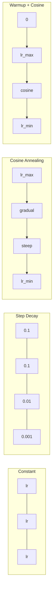
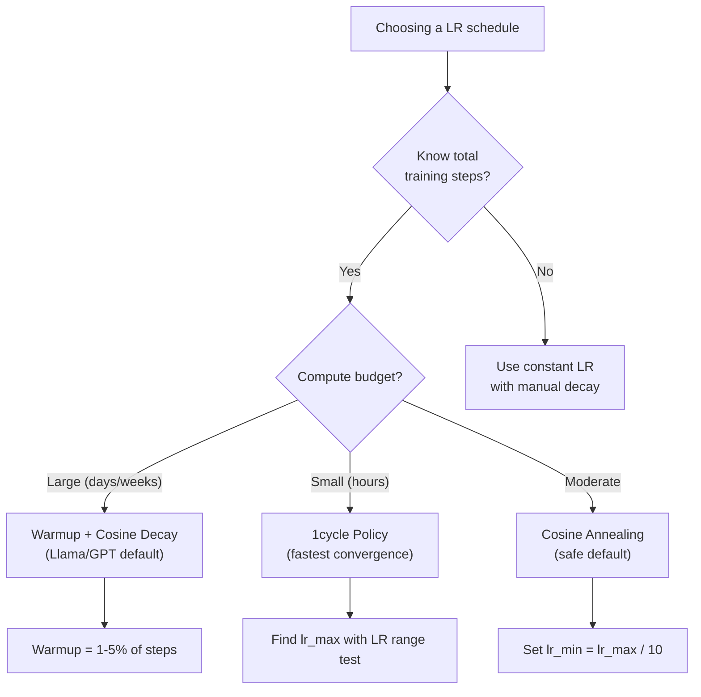
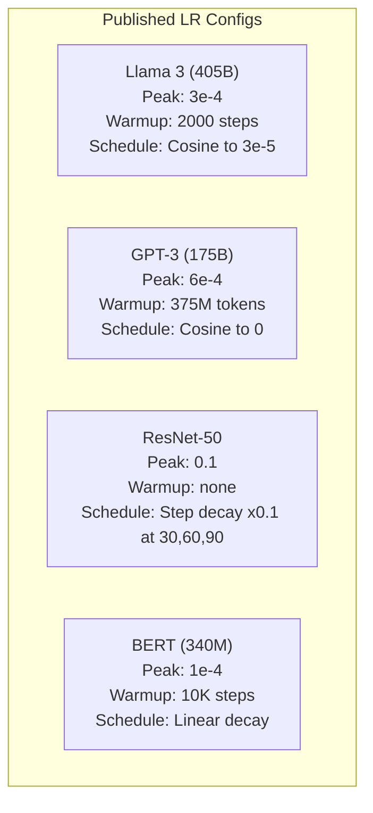

# Learning Rate Schedules and Warmup

> 学习率是最重要的超参数。不是建筑。不是数据集大小。不是激活功能。学习率。如果您没有调整其他内容，请调整这个。

** 类型：** 构建
** 语言：** Python
** 先决条件：** 第03.06课（优化器）、第03.08课（体重分配器）
** 时间：** ~90分钟

## Learning Objectives

- 从头开始实施恒定、阶跃衰减、Cosine退变、热身+Cosine和1周期学习率计划
- 演示学习率选择的三种失败模式：偏离（太高）、停滞（太低）和振荡（没有衰减）
- 解释为什么基于Adam的优化器需要热身，以及它如何稳定早期训练
- 比较同一任务的所有五个时间表的收敛速度，并针对给定的培训预算选择合适的时间表

## The Problem

将学习率设置为0.1。训练出现分歧--损失在3个步骤内跃升至无限大。将其设置为0.0001。训练爬行--经过100个纪元后，模型几乎没有脱离随机状态。设置为0.01。训练工作了50个epoch，然后损失在它永远无法达到的最小值附近振荡，因为步长太大了。

最佳学习率不是一个常数。在训练中会发生变化。在早期，你需要大的步骤来快速覆盖地面。在训练的后期，你希望小步走到最小。90%准确度的模型和95%准确度的模型之间的区别通常只是时间表。

过去三年发布的每个主要模型都使用学习率计划。Lama 3使用峰值lr=3e-4，有2000个预热步骤，并衰变为3e-5。GPT-3使用lr= 6 e-4，预热超过3.75亿个代币。这些不是任意的选择。它们是耗资数百万美元的大规模超参数扫描的结果。

您需要了解时间表，因为默认设置不适用于您的问题。当您微调预先训练的模型时，正确的时间表与从头开始训练不同。当您增加批量大小时，预热期需要更改。当训练在第10，000步中断时，您需要知道这是日程问题还是其他问题。

## The Concept

### Constant Learning Rate

最简单的方法。选择一个数字，将其用于每一步。

```
lr(t) = lr_0
```

很少是最佳的。它要么对于训练结束太高（在最小值附近振荡），要么对于开始太低（在微小的步骤上浪费计算）。适用于小型模型和调试。对于任何训练超过一个小时的东西来说，这是一个可怕的选择。

### Step Decay

ResNet时代的老派方法。在固定时期将学习率降低一个因子（通常是10倍）。

```
lr(t) = lr_0 * gamma^(floor(epoch / step_size))
```

其中gamma = 0.1且step_size = 30意味着：lr每30个epoch下降10倍。ResNet-50使用这个- lr=0.1，在epoch 30，60和90下降10倍。

问题：最佳衰变点取决于数据集和架构。转移到不同的问题，您需要重新调整何时放弃。转变是突然的--当比率突然变化时，损失可能会激增。

### Cosine Annealing

从最大学习率平稳衰减到最小学习率，遵循cos曲线：

```
lr(t) = lr_min + 0.5 * (lr_max - lr_min) * (1 + cos(pi * t / T))
```

其中t是当前步骤，T是步骤的总数。

t=0时，cos项为1，因此lr = lr_max。当t=T时，cos项为-1，因此lr = lr_min。衰变一开始很温和，中间加速，接近结束时再次变得很温和。

这是大多数现代训练跑步的默认设置。除了lr_max和lr_min之外，没有可调整的超参数。cos形状与经验观察相匹配，即大多数学习发生在训练过程中--您希望在关键时期有合理的步距。

### Warmup: Why You Start Small

Adam和其他自适应优化器维护梯度均值和方差的运行估计。在步骤0，这些估计被初始化为零。前几个梯度更新基于垃圾统计数据。如果您在此期间的学习率很高，那么模型就会采取巨大且方向不佳的步骤。

热身解决了这个问题。从很小的学习率开始（通常是lr_max / warmup_steps甚至为零），然后在前N个步骤中线性上升到lr_max。当您达到完全学习率时，Adam的统计数据已经稳定下来。

```
lr(t) = lr_max * (t / warmup_steps)     for t < warmup_steps
```

典型的热身：总训练步骤的1-5%。Lama 3训练了约1.8万亿个代币，并热身了2000步。GPT-3预热了超过3.75亿个代币。

### Linear Warmup + Cosine Decay

现代的默认值。线性上升，然后以余弦衰减：

```
if t < warmup_steps:
    lr(t) = lr_max * (t / warmup_steps)
else:
    progress = (t - warmup_steps) / (total_steps - warmup_steps)
    lr(t) = lr_min + 0.5 * (lr_max - lr_min) * (1 + cos(pi * progress))
```

这就是Llama、GPT、PaLM和大多数现代变压器所使用的。热身可以防止早期不稳定。cos衰变使模型处于良好的最小值。

### 1cycle Policy

莱斯利·史密斯（Leslie Smith）的发现（2018年）：在训练的上半场将学习率从低值提高到高值，然后在下半场将其重新降低。违反直觉--为什么要在中途 * 提高 * 学习率？

理论：高学习率通过向优化轨迹添加噪音来充当规则化。该模型在加速阶段探索了更多的损失景观，找到更好的盆地。然后，下降阶段在发现的最佳盆地内进行细化。

```
Phase 1 (0 to T/2):    lr ramps from lr_max/25 to lr_max
Phase 2 (T/2 to T):    lr ramps from lr_max to lr_max/10000
```

1cycle 对于固定的计算预算，训练通常比Cosine anneal更快。权衡：您必须提前知道总步骤数。

### Schedule Shapes



### Decision Flowchart



### Real Numbers from Published Models



## Build It

### Step 1: Schedule Functions

每个函数采用当前步骤并返回该步骤的学习率。

```python
import math


def constant_schedule(step, lr=0.01, **kwargs):
    return lr


def step_decay_schedule(step, lr=0.1, step_size=100, gamma=0.1, **kwargs):
    return lr * (gamma ** (step // step_size))


def cosine_schedule(step, lr=0.01, total_steps=1000, lr_min=1e-5, **kwargs):
    if step >= total_steps:
        return lr_min
    return lr_min + 0.5 * (lr - lr_min) * (1 + math.cos(math.pi * step / total_steps))


def warmup_cosine_schedule(step, lr=0.01, total_steps=1000, warmup_steps=100, lr_min=1e-5, **kwargs):
    if total_steps <= warmup_steps:
        return lr * (step / max(warmup_steps, 1))
    if step < warmup_steps:
        return lr * step / warmup_steps
    progress = (step - warmup_steps) / (total_steps - warmup_steps)
    return lr_min + 0.5 * (lr - lr_min) * (1 + math.cos(math.pi * progress))


def one_cycle_schedule(step, lr=0.01, total_steps=1000, **kwargs):
    mid = max(total_steps // 2, 1)
    if step < mid:
        return (lr / 25) + (lr - lr / 25) * step / mid
    else:
        progress = (step - mid) / max(total_steps - mid, 1)
        return lr * (1 - progress) + (lr / 10000) * progress
```

### Step 2: Visualize All Schedules

打印基于文本的图表，显示每个时间表在培训中的演变情况。

```python
def visualize_schedule(name, schedule_fn, total_steps=500, **kwargs):
    steps = list(range(0, total_steps, total_steps // 20))
    if total_steps - 1 not in steps:
        steps.append(total_steps - 1)

    lrs = [schedule_fn(s, total_steps=total_steps, **kwargs) for s in steps]
    max_lr = max(lrs) if max(lrs) > 0 else 1.0

    print(f"\n{name}:")
    for s, lr_val in zip(steps, lrs):
        bar_len = int(lr_val / max_lr * 40)
        bar = "#" * bar_len
        print(f"  Step {s:4d}: lr={lr_val:.6f} {bar}")
```

### Step 3: Training Network

圆圈数据集上的简单两层网络，与之前的课程相同，但现在我们改变了时间表。

```python
import random


def sigmoid(x):
    x = max(-500, min(500, x))
    return 1.0 / (1.0 + math.exp(-x))


def relu(x):
    return max(0.0, x)


def relu_deriv(x):
    return 1.0 if x > 0 else 0.0


def make_circle_data(n=200, seed=42):
    random.seed(seed)
    data = []
    for _ in range(n):
        x = random.uniform(-2, 2)
        y = random.uniform(-2, 2)
        label = 1.0 if x * x + y * y < 1.5 else 0.0
        data.append(([x, y], label))
    return data


def train_with_schedule(schedule_fn, schedule_name, data, epochs=300, base_lr=0.05, **kwargs):
    random.seed(0)
    hidden_size = 8
    total_steps = epochs * len(data)

    std = math.sqrt(2.0 / 2)
    w1 = [[random.gauss(0, std) for _ in range(2)] for _ in range(hidden_size)]
    b1 = [0.0] * hidden_size
    w2 = [random.gauss(0, std) for _ in range(hidden_size)]
    b2 = 0.0

    step = 0
    epoch_losses = []

    for epoch in range(epochs):
        total_loss = 0
        correct = 0

        for x, target in data:
            lr = schedule_fn(step, lr=base_lr, total_steps=total_steps, **kwargs)

            z1 = []
            h = []
            for i in range(hidden_size):
                z = w1[i][0] * x[0] + w1[i][1] * x[1] + b1[i]
                z1.append(z)
                h.append(relu(z))

            z2 = sum(w2[i] * h[i] for i in range(hidden_size)) + b2
            out = sigmoid(z2)

            error = out - target
            d_out = error * out * (1 - out)

            for i in range(hidden_size):
                d_h = d_out * w2[i] * relu_deriv(z1[i])
                w2[i] -= lr * d_out * h[i]
                for j in range(2):
                    w1[i][j] -= lr * d_h * x[j]
                b1[i] -= lr * d_h
            b2 -= lr * d_out

            total_loss += (out - target) ** 2
            if (out >= 0.5) == (target >= 0.5):
                correct += 1
            step += 1

        avg_loss = total_loss / len(data)
        accuracy = correct / len(data) * 100
        epoch_losses.append(avg_loss)

    return epoch_losses
```

### Step 4: Compare All Schedules

使用每个计划训练相同的网络，并比较最终损失和收敛行为。

```python
def compare_schedules(data):
    configs = [
        ("Constant", constant_schedule, {}),
        ("Step Decay", step_decay_schedule, {"step_size": 15000, "gamma": 0.1}),
        ("Cosine", cosine_schedule, {"lr_min": 1e-5}),
        ("Warmup+Cosine", warmup_cosine_schedule, {"warmup_steps": 3000, "lr_min": 1e-5}),
        ("1cycle", one_cycle_schedule, {}),
    ]

    print(f"\n{'Schedule':<20} {'Start Loss':>12} {'Mid Loss':>12} {'End Loss':>12} {'Best Loss':>12}")
    print("-" * 70)

    for name, schedule_fn, extra_kwargs in configs:
        losses = train_with_schedule(schedule_fn, name, data, epochs=300, base_lr=0.05, **extra_kwargs)
        mid_idx = len(losses) // 2
        best = min(losses)
        print(f"{name:<20} {losses[0]:>12.6f} {losses[mid_idx]:>12.6f} {losses[-1]:>12.6f} {best:>12.6f}")
```

### Step 5: LR Too High vs Too Low

演示三种故障模式：太高（偏离）、太低（爬行）和恰到好处。

```python
def lr_sensitivity(data):
    learning_rates = [1.0, 0.1, 0.01, 0.001, 0.0001]

    print("\nLR Sensitivity (constant schedule, 100 epochs):")
    print(f"  {'LR':>10} {'Start Loss':>12} {'End Loss':>12} {'Status':>15}")
    print("  " + "-" * 52)

    for lr in learning_rates:
        losses = train_with_schedule(constant_schedule, f"lr={lr}", data, epochs=100, base_lr=lr)
        start = losses[0]
        end = losses[-1]

        if end > start or math.isnan(end) or end > 1.0:
            status = "DIVERGED"
        elif end > start * 0.9:
            status = "BARELY MOVED"
        elif end < 0.15:
            status = "CONVERGED"
        else:
            status = "LEARNING"

        end_str = f"{end:.6f}" if not math.isnan(end) else "NaN"
        print(f"  {lr:>10.4f} {start:>12.6f} {end_str:>12} {status:>15}")
```

## Use It

PyTorch在“torch.optim.lr_schedule”中提供调度器：

```python
import torch
import torch.optim as optim
from torch.optim.lr_scheduler import CosineAnnealingLR, OneCycleLR, StepLR

model = nn.Sequential(nn.Linear(10, 64), nn.ReLU(), nn.Linear(64, 1))
optimizer = optim.Adam(model.parameters(), lr=3e-4)

scheduler = CosineAnnealingLR(optimizer, T_max=1000, eta_min=1e-5)

for step in range(1000):
    loss = train_step(model, optimizer)
    scheduler.step()
```

对于热身+cos，请使用Lambda调度器或HuggingFace的“get_cos_schedule_with_warmup”：

```python
from transformers import get_cosine_schedule_with_warmup

scheduler = get_cosine_schedule_with_warmup(
    optimizer,
    num_warmup_steps=2000,
    num_training_steps=100000,
)
```

HuggingFace函数是大多数Llama和GPT微调脚本使用的功能。如果有疑问，请使用热身+cos，热身=总步数的3-5%。它几乎适用于一切。

## Ship It

本课产生：
- ' outputes/prompt-lr-schedule-advisor.md '-一个提示，为您的培训设置推荐正确的学习率计划和超参数

## Exercises

1. 实现指数衰减：lr（t）= lr_0 * gamma ' t，其中gamma = 0.999。与圆数据集上的Cosine Analing进行比较。

2. 实施学习率范围测试（Leslie Smith）：训练几百步，同时将LR从1 e-7指数级增加到1。情节损失vs LR。最佳最大LR恰好在损失开始增加之前。

3. 用热身+cos进行训练，但改变热身长度：总步数的0%、1%、5%、10%、20%。找到训练最稳定的最佳点。

4. 实施带热重启的Cosine anneal（SGDR）：每T步将学习率重置为lr_max，并再次衰减。与较长时间训练中的标准cos相比。

5. 建立一个“计划外科医生”，监控训练损失，并在损失稳定时自动从热身切换到cos，如果损失停滞太久，则降低lr。

## Key Terms

| Term | 别人怎么说 | 它实际上意味着什么 |
|------|----------------|----------------------|
| 学习率 | “模型学习的速度有多快” | 乘以梯度以确定参数更新大小的纯量 |
| 附表 | “随着时间的推移改变LR” | 将训练步骤映射到学习率的功能，旨在优化收敛 |
| 热身 | “从小LR开始” | 在前N个步骤中将LR从接近零线性提升到目标值，以稳定优化器统计数据 |
| Cosine退变 | “平稳的LR衰变” | 训练期间，LR沿着从lr_max到lr_min的cos曲线下降 |
| 台阶衰变 | “在里程碑上放弃LR” | 以固定的历元间隔将LR乘以一个因子（通常为0.1） |
| 1周期政策 | “上然后下” | 莱斯利·史密斯（Leslie Smith）在单周期内先升后降LR以更快收敛的方法 |
| LR范围测试 | “找到最佳学习率” | 在增加LR的同时进行短暂训练，以找到损失开始分化的价值 |
| Cosine温暖重启 | “重置并重复” | 定期将LR重置为lr_max并再次衰减（SGDR） |
| 埃塔分钟 | “LR的地板” | 时间表衰减到的最低学习率 |
| 峰值学习率 | “最大LR” | 训练期间达到的最高LR，通常在热身后 |

## Further Reading

- Loshchilov和Hutter，“SGDR：随机梯度下降，温重启”（2017年）--引入了Cosine Annealing和温重启
- Smith，“超级收敛：使用大学习率快速训练神经网络”（2018）--1周期政策论文
- Touvron等人，“Lama 2：开放基础和微调聊天模型”（2023）--记录了大规模使用的热身+cos时间表
- 戈亚尔等人，“准确、大型迷你批次新元：1小时内训练ImageNet”（2017）--线性缩放规则和大批量训练的热身
