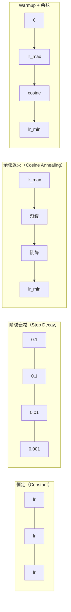
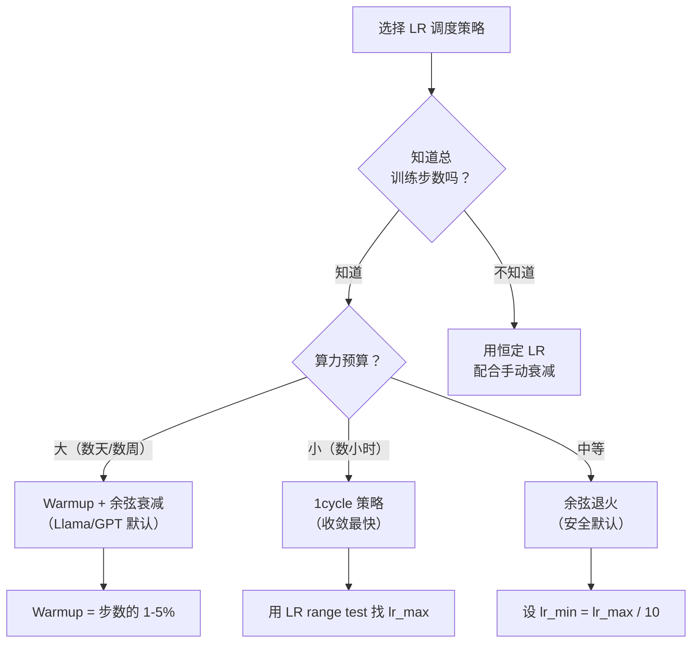
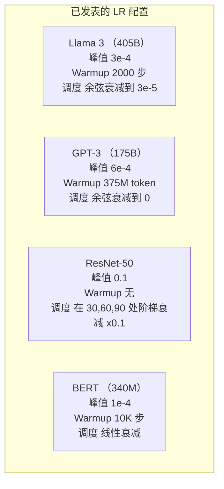

# 学习率调度与 warmup（Learning Rate Schedules and Warmup）

> 译注：本文译自同目录 [`en.md`](./en.md)。术语遵循仓根 [TRANSLATION_GUIDE.md](../../../../TRANSLATION_GUIDE.md)。

> learning rate（学习率）是单一最重要的超参数。不是架构，不是数据集大小，不是激活函数。就是 learning rate。如果其他什么都不调，调它。

**Type:** Build
**Languages:** Python
**Prerequisites:** Lesson 03.06 (Optimizers), Lesson 03.08 (Weight Initialization)
**Time:** ~90 minutes

## 学习目标（Learning Objectives）

- 从零实现 constant、step decay、cosine annealing、warmup + cosine 以及 1cycle 五种 learning rate 调度
- 演示 learning rate 选择的三种失败模式：发散（太高）、停滞（太低）、震荡（不衰减）
- 解释为什么基于 Adam 的 optimizer 需要 warmup，以及它如何稳定训练初期
- 在同一任务上对比五种调度的收敛速度，并为给定的训练预算选择合适的方案

## 问题（The Problem）

把 learning rate 设成 0.1。训练发散——loss 在 3 步内冲到无穷大。设成 0.0001。训练慢得像爬——100 个 epoch 之后，模型几乎还停在随机初始化的位置。设成 0.01。前 50 个 epoch 工作正常，然后 loss 在某个最小值附近震荡，永远到不了，因为步子太大。

最优 learning rate 不是常数。它在训练过程中会变。早期你想用大步子快速覆盖区域。训练后期你想用极小的步子安顿到一个尖锐的极小值里。一个 90% 准确率模型和一个 95% 准确率模型之间的差距，往往就是调度的差距。

过去三年发表的每个主流模型都用了 learning rate 调度。Llama 3 用峰值 lr=3e-4、2000 步 warmup、cosine 衰减到 3e-5。GPT-3 用 lr=6e-4，在 3.75 亿 token 内完成 warmup。这些不是随便选的，而是花了几百万美元做超参数扫描的结果。

你必须理解调度，因为默认值在你自己的问题上多半不奏效。微调一个预训练模型时，正确的调度和从头训练完全不同。增大 batch 时，warmup 长度也得跟着变。当训练在第 10000 步崩了，你得知道这是调度的问题还是别的问题。

## 概念（The Concept）

### 常数学习率（Constant Learning Rate）

最朴素的做法。挑一个数，每一步都用它。

```
lr(t) = lr_0
```

很少是最优。要么对训练末期太高（在最小值附近震荡），要么对开始太低（在小步子上浪费算力）。对小模型和调试来说没问题。但凡训练超过一小时的任务，这就是个糟糕选择。

### 阶梯衰减（Step Decay）

ResNet 时代的老派做法。每过若干个固定 epoch 就把 learning rate 砍掉一个倍数（通常是 10 倍）。

```
lr(t) = lr_0 * gamma^(floor(epoch / step_size))
```

gamma = 0.1、step_size = 30 的意思是：每 30 个 epoch 让 lr 降 10 倍。ResNet-50 就用这套——lr=0.1，在第 30、60、90 个 epoch 各降 10 倍。

问题在于：最优的衰减点依赖数据集和架构。换个问题就得重新调什么时候降。而且过渡是突变的——learning rate 一变，loss 可能猛跳一下。

### 余弦退火（Cosine Annealing）

按余弦曲线，从最大 learning rate 平滑衰减到最小值：

```
lr(t) = lr_min + 0.5 * (lr_max - lr_min) * (1 + cos(pi * t / T))
```

t 是当前 step，T 是总 step 数。

t=0 时余弦项为 1，所以 lr = lr_max。t=T 时余弦项为 -1，所以 lr = lr_min。衰减一开始很温和，中段加速，末尾又变温和。

这是大多数现代训练的默认选择。除了 lr_max 和 lr_min，没有别的超参要调。余弦的形状契合了一个经验观察：大部分学习发生在训练中段——你希望那段关键时期内步长是合理的。

### Warmup：为什么要从小开始

Adam 等自适应 optimizer 维护着梯度均值与方差的滑动估计。在第 0 步时，这些估计被初始化为零。最初几步的梯度更新基于的是垃圾统计。如果这段时间 learning rate 很大，模型就会迈出又大又乱的步子。

Warmup 解决这个问题。从一个极小的 learning rate（通常是 lr_max / warmup_steps，甚至是零）开始，前 N 步线性升到 lr_max。等你升到完整 learning rate 时，Adam 的统计已经稳了。

```
lr(t) = lr_max * (t / warmup_steps)     for t < warmup_steps
```

典型 warmup 长度：占总训练步数的 1-5%。Llama 3 训练了约 1.8 万亿 token，warmup 用了 2000 步。GPT-3 在 3.75 亿 token 内完成 warmup。

### 线性 warmup + 余弦衰减（Linear Warmup + Cosine Decay）

现代默认配方。线性升上去，然后余弦降下来：

```
if t < warmup_steps:
    lr(t) = lr_max * (t / warmup_steps)
else:
    progress = (t - warmup_steps) / (total_steps - warmup_steps)
    lr(t) = lr_min + 0.5 * (lr_max - lr_min) * (1 + cos(pi * progress))
```

Llama、GPT、PaLM 以及大多数现代 transformer 用的都是这套。Warmup 防早期不稳定，cosine 衰减把模型带进一个好的极小值。

### 1cycle 策略（1cycle Policy）

Leslie Smith 在 2018 年发现的：训练前半段把 learning rate 从一个低值升到一个高值，后半段再降回来。反直觉——为什么要在训练中途*提高* learning rate？

理论解释：高 learning rate 通过给优化轨迹注入噪声，起到了正则化作用。模型在升段阶段探索更多 loss 地形，找到更好的盆地。降段阶段再在最佳盆地内精调。

```
Phase 1 (0 to T/2):    lr ramps from lr_max/25 to lr_max
Phase 2 (T/2 to T):    lr ramps from lr_max to lr_max/10000
```

在固定算力预算下，1cycle 通常比 cosine annealing 训得更快。代价是：你必须事先知道总 step 数。

### 调度形态（Schedule Shapes）



### 决策流程图（Decision Flowchart）



### 来自已发表模型的真实数字（Real Numbers from Published Models）



## 动手实现（Build It）

### Step 1：调度函数（Schedule Functions）

每个函数接收当前 step，返回那一步的 learning rate。

```python
import math


def constant_schedule(step, lr=0.01, **kwargs):
    return lr


def step_decay_schedule(step, lr=0.1, step_size=100, gamma=0.1, **kwargs):
    return lr * (gamma ** (step // step_size))


def cosine_schedule(step, lr=0.01, total_steps=1000, lr_min=1e-5, **kwargs):
    if step >= total_steps:
        return lr_min
    return lr_min + 0.5 * (lr - lr_min) * (1 + math.cos(math.pi * step / total_steps))


def warmup_cosine_schedule(step, lr=0.01, total_steps=1000, warmup_steps=100, lr_min=1e-5, **kwargs):
    if total_steps <= warmup_steps:
        return lr * (step / max(warmup_steps, 1))
    if step < warmup_steps:
        return lr * step / warmup_steps
    progress = (step - warmup_steps) / (total_steps - warmup_steps)
    return lr_min + 0.5 * (lr - lr_min) * (1 + math.cos(math.pi * progress))


def one_cycle_schedule(step, lr=0.01, total_steps=1000, **kwargs):
    mid = max(total_steps // 2, 1)
    if step < mid:
        return (lr / 25) + (lr - lr / 25) * step / mid
    else:
        progress = (step - mid) / max(total_steps - mid, 1)
        return lr * (1 - progress) + (lr / 10000) * progress
```

### Step 2：可视化所有调度（Visualize All Schedules）

打印一个文本图，展示每种调度在训练中的演变。

```python
def visualize_schedule(name, schedule_fn, total_steps=500, **kwargs):
    steps = list(range(0, total_steps, total_steps // 20))
    if total_steps - 1 not in steps:
        steps.append(total_steps - 1)

    lrs = [schedule_fn(s, total_steps=total_steps, **kwargs) for s in steps]
    max_lr = max(lrs) if max(lrs) > 0 else 1.0

    print(f"\n{name}:")
    for s, lr_val in zip(steps, lrs):
        bar_len = int(lr_val / max_lr * 40)
        bar = "#" * bar_len
        print(f"  Step {s:4d}: lr={lr_val:.6f} {bar}")
```

### Step 3：训练网络（Training Network）

一个简单的两层网络跑 circle 数据集，和前面几节一样，但这次我们改变调度。

```python
import random


def sigmoid(x):
    x = max(-500, min(500, x))
    return 1.0 / (1.0 + math.exp(-x))


def relu(x):
    return max(0.0, x)


def relu_deriv(x):
    return 1.0 if x > 0 else 0.0


def make_circle_data(n=200, seed=42):
    random.seed(seed)
    data = []
    for _ in range(n):
        x = random.uniform(-2, 2)
        y = random.uniform(-2, 2)
        label = 1.0 if x * x + y * y < 1.5 else 0.0
        data.append(([x, y], label))
    return data


def train_with_schedule(schedule_fn, schedule_name, data, epochs=300, base_lr=0.05, **kwargs):
    random.seed(0)
    hidden_size = 8
    total_steps = epochs * len(data)

    std = math.sqrt(2.0 / 2)
    w1 = [[random.gauss(0, std) for _ in range(2)] for _ in range(hidden_size)]
    b1 = [0.0] * hidden_size
    w2 = [random.gauss(0, std) for _ in range(hidden_size)]
    b2 = 0.0

    step = 0
    epoch_losses = []

    for epoch in range(epochs):
        total_loss = 0
        correct = 0

        for x, target in data:
            lr = schedule_fn(step, lr=base_lr, total_steps=total_steps, **kwargs)

            z1 = []
            h = []
            for i in range(hidden_size):
                z = w1[i][0] * x[0] + w1[i][1] * x[1] + b1[i]
                z1.append(z)
                h.append(relu(z))

            z2 = sum(w2[i] * h[i] for i in range(hidden_size)) + b2
            out = sigmoid(z2)

            error = out - target
            d_out = error * out * (1 - out)

            for i in range(hidden_size):
                d_h = d_out * w2[i] * relu_deriv(z1[i])
                w2[i] -= lr * d_out * h[i]
                for j in range(2):
                    w1[i][j] -= lr * d_h * x[j]
                b1[i] -= lr * d_h
            b2 -= lr * d_out

            total_loss += (out - target) ** 2
            if (out >= 0.5) == (target >= 0.5):
                correct += 1
            step += 1

        avg_loss = total_loss / len(data)
        accuracy = correct / len(data) * 100
        epoch_losses.append(avg_loss)

    return epoch_losses
```

### Step 4：对比所有调度（Compare All Schedules）

用每种调度训练同一个网络，对比最终 loss 和收敛行为。

```python
def compare_schedules(data):
    configs = [
        ("Constant", constant_schedule, {}),
        ("Step Decay", step_decay_schedule, {"step_size": 15000, "gamma": 0.1}),
        ("Cosine", cosine_schedule, {"lr_min": 1e-5}),
        ("Warmup+Cosine", warmup_cosine_schedule, {"warmup_steps": 3000, "lr_min": 1e-5}),
        ("1cycle", one_cycle_schedule, {}),
    ]

    print(f"\n{'Schedule':<20} {'Start Loss':>12} {'Mid Loss':>12} {'End Loss':>12} {'Best Loss':>12}")
    print("-" * 70)

    for name, schedule_fn, extra_kwargs in configs:
        losses = train_with_schedule(schedule_fn, name, data, epochs=300, base_lr=0.05, **extra_kwargs)
        mid_idx = len(losses) // 2
        best = min(losses)
        print(f"{name:<20} {losses[0]:>12.6f} {losses[mid_idx]:>12.6f} {losses[-1]:>12.6f} {best:>12.6f}")
```

### Step 5：LR 太高 vs 太低（LR Too High vs Too Low）

演示三种失败模式：太高（发散）、太低（爬行）、刚刚好。

```python
def lr_sensitivity(data):
    learning_rates = [1.0, 0.1, 0.01, 0.001, 0.0001]

    print("\nLR Sensitivity (constant schedule, 100 epochs):")
    print(f"  {'LR':>10} {'Start Loss':>12} {'End Loss':>12} {'Status':>15}")
    print("  " + "-" * 52)

    for lr in learning_rates:
        losses = train_with_schedule(constant_schedule, f"lr={lr}", data, epochs=100, base_lr=lr)
        start = losses[0]
        end = losses[-1]

        if end > start or math.isnan(end) or end > 1.0:
            status = "DIVERGED"
        elif end > start * 0.9:
            status = "BARELY MOVED"
        elif end < 0.15:
            status = "CONVERGED"
        else:
            status = "LEARNING"

        end_str = f"{end:.6f}" if not math.isnan(end) else "NaN"
        print(f"  {lr:>10.4f} {start:>12.6f} {end_str:>12} {status:>15}")
```

## 用起来（Use It）

PyTorch 在 `torch.optim.lr_scheduler` 里提供了调度器：

```python
import torch
import torch.optim as optim
from torch.optim.lr_scheduler import CosineAnnealingLR, OneCycleLR, StepLR

model = nn.Sequential(nn.Linear(10, 64), nn.ReLU(), nn.Linear(64, 1))
optimizer = optim.Adam(model.parameters(), lr=3e-4)

scheduler = CosineAnnealingLR(optimizer, T_max=1000, eta_min=1e-5)

for step in range(1000):
    loss = train_step(model, optimizer)
    scheduler.step()
```

要做 warmup + cosine，可以用 lambda 调度器，或者用 HuggingFace 的 `get_cosine_schedule_with_warmup`：

```python
from transformers import get_cosine_schedule_with_warmup

scheduler = get_cosine_schedule_with_warmup(
    optimizer,
    num_warmup_steps=2000,
    num_training_steps=100000,
)
```

大多数 Llama 和 GPT 微调脚本就是用的这个 HuggingFace 函数。拿不准的时候，用 warmup + cosine，warmup 取总步数的 3-5%。几乎对什么任务都管用。

## 上线部署（Ship It）

本节产物：
- `outputs/prompt-lr-schedule-advisor.md` —— 一个 prompt，根据你的训练设置推荐合适的 learning rate 调度和超参数

## 练习（Exercises）

1. 实现指数衰减：lr(t) = lr_0 * gamma^t，其中 gamma = 0.999。在 circle 数据集上和 cosine annealing 对比。

2. 实现 learning rate range test（Leslie Smith 的方法）：训练几百步，把 LR 从 1e-7 指数地涨到 1。画出 loss vs LR 曲线。最优最大 LR 就在 loss 即将开始上升之前。

3. 用 warmup + cosine 训练，但改变 warmup 长度：占总步数的 0%、1%、5%、10%、20%。找到训练最稳的甜点。

4. 实现带 warm restart 的 cosine annealing（SGDR）：每 T 步把 learning rate 重置到 lr_max 再次衰减。在更长的训练上和标准 cosine 对比。

5. 做一个「调度外科医生」：监控训练 loss，当 loss 稳下来后自动从 warmup 切到 cosine，loss 长时间不动时降低 lr。

## 关键术语（Key Terms）

| 术语 | 一般说法 | 实际含义 |
|------|----------------|----------------------|
| Learning rate | 「模型学得多快」 | 与梯度相乘以决定参数更新步长的标量 |
| Schedule | 「随时间改变 LR」 | 把训练 step 映射到 learning rate 的函数，目的是优化收敛 |
| Warmup | 「先用小 LR 起步」 | 在最初 N 步把 LR 从接近零线性升到目标值，用于稳定 optimizer 的统计量 |
| Cosine annealing | 「平滑的 LR 衰减」 | 训练期间按余弦曲线把 LR 从 lr_max 降到 lr_min |
| Step decay | 「在节点降 LR」 | 每隔固定 epoch 把 LR 乘以一个因子（通常是 0.1） |
| 1cycle policy | 「先升后降」 | Leslie Smith 提出的方法：在一个周期内把 LR 先升后降，从而更快收敛 |
| LR range test | 「找最佳 learning rate」 | 短训一段同时增大 LR，找到 loss 开始发散的那个值 |
| Cosine with warm restarts | 「重置后再来」 | 周期性把 LR 重置到 lr_max 再衰减一次（SGDR） |
| Eta min | 「LR 的下限」 | 调度衰减到的最小 learning rate |
| Peak learning rate | 「最大 LR」 | 训练过程中达到的最高 LR，通常在 warmup 之后 |

## 延伸阅读（Further Reading）

- Loshchilov & Hutter, "SGDR: Stochastic Gradient Descent with Warm Restarts" (2017) —— 提出 cosine annealing 与 warm restart
- Smith, "Super-Convergence: Very Fast Training of Neural Networks Using Large Learning Rates" (2018) —— 1cycle 策略原始论文
- Touvron et al., "Llama 2: Open Foundation and Fine-Tuned Chat Models" (2023) —— 记录了大规模训练所用的 warmup + cosine 调度
- Goyal et al., "Accurate, Large Minibatch SGD: Training ImageNet in 1 Hour" (2017) —— 大 batch 训练的线性缩放规则与 warmup
