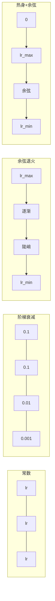
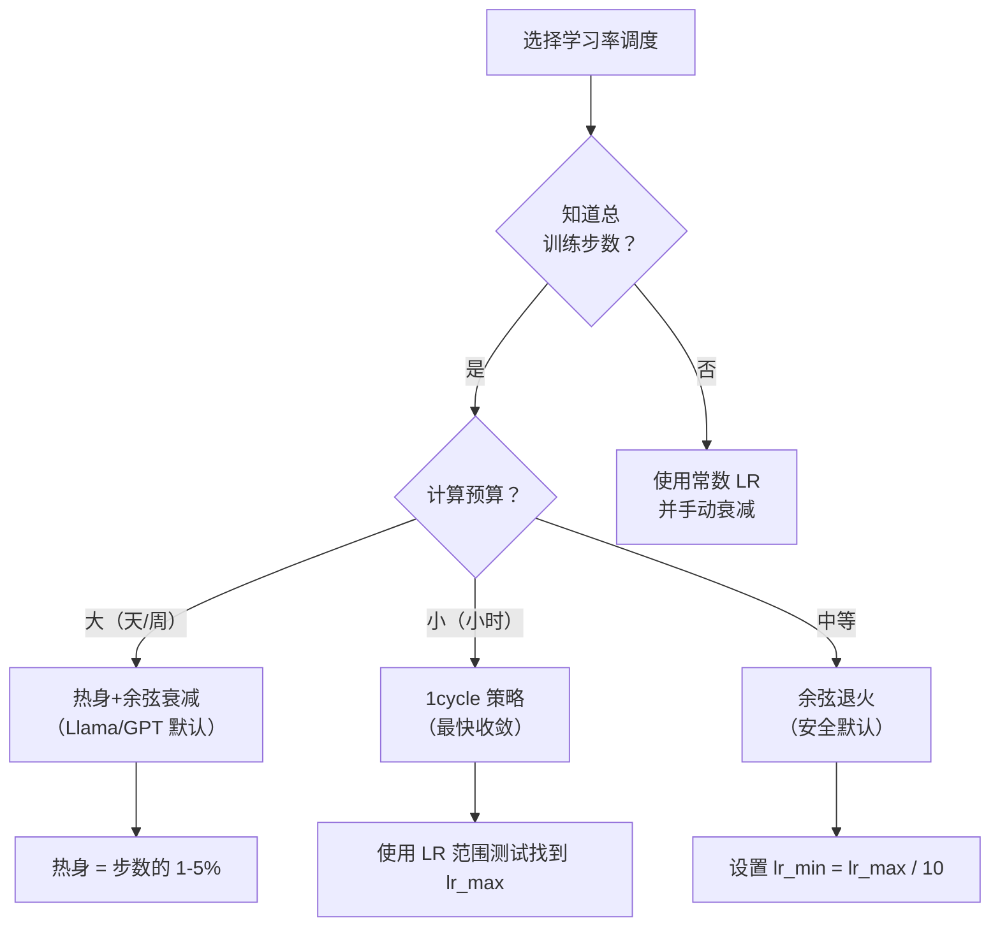
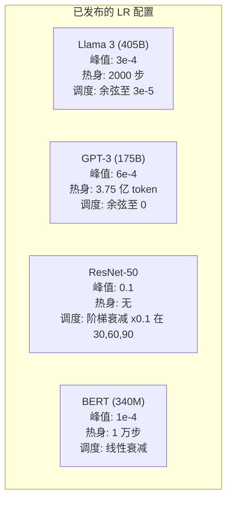

# 学习率调度与热身（Learning Rate Schedules and Warmup）

> 学习率是最最重要的超参数。不是架构，不是数据集大小，也不是激活函数。就是学习率。如果你只调一个参数，就调它。

**类型：** 构建
**语言：** Python
**前置要求：** 课时 03.06（优化器），课时 03.08（权重初始化）
**时间：** 约 90 分钟

## 学习目标

- 从零实现常数调度、阶梯衰减、余弦退火、热身+余弦以及1cycle学习率调度
- 演示学习率选择的三种失败模式：发散（太高）、停滞（太低）和振荡（无衰减）
- 解释为什么基于 Adam 的优化器需要热身，以及热身如何稳定早期训练
- 在同一任务上比较所有五种调度的收敛速度，并为给定的训练预算选择合适的调度

## 问题

将学习率设为 0.1。训练发散——损失在 3 步内跳至无穷。设为 0.0001。训练爬行——100 个 epoch 后，模型几乎仍停留在随机状态。设为 0.01。训练前 50 个 epoch 正常，之后损失在某个最小值附近振荡，永远无法到达，因为步长太大。

最优学习率不是常数。它在训练过程中变化。早期，你需要大步快速覆盖广阔区域；训练后期，你需要小步稳定在尖锐的最小值。一个 90% 准确率的模型和一个 95% 准确率的模型之间的区别，往往就取决于调度。

过去三年发布的每个主要模型都使用了学习率调度。Llama 3 使用了峰值学习率 3e-4，2000 步热身，余弦衰减至 3e-5。GPT-3 使用了学习率 6e-4，3.75 亿 token 热身。这些不是随意选择的。它们是花费数百万美元进行广泛超参数搜索的结果。

你需要了解调度，因为默认设置对你的问题可能不适用。当你微调预训练模型时，正确的调度与从头训练不同。当你增加批量大小时，热身期需要改变。当训练在第 10000 步崩溃时，你需要知道这是调度问题还是其他问题。

## 概念

### 常数学习率

最简单的方法。选择一个数字，每一步都使用它。

```
lr(t) = lr_0
```

很少最优。要么对训练结束来说太高（在最小值附近振荡），要么对开始来说太低（小步骤浪费计算）。适用于小模型和调试。对于训练超过一小时的任务来说是一个糟糕的选择。

### 阶梯衰减（Step Decay）

来自 ResNet 时代的传统方法。在固定 epoch 处将学习率乘以一个因子（通常 10 倍）。

```
lr(t) = lr_0 * gamma^(floor(epoch / step_size))
```

其中 gamma = 0.1，step_size = 30 意味着：每 30 个 epoch 学习率下降 10 倍。ResNet-50 使用了这个——lr=0.1，在第 30、60、90 个 epoch 下降 10 倍。

问题：最优衰减点取决于数据集和架构。换到另一个问题，你需要重新调整何时下降。过渡是突变的——当学习率突然变化时，损失可能飙升。

### 余弦退火（Cosine Annealing）

从最大学习率平滑衰减到最小值，遵循余弦曲线：

```
lr(t) = lr_min + 0.5 * (lr_max - lr_min) * (1 + cos(pi * t / T))
```

其中 t 是当前步，T 是总步数。

在 t=0 时，余弦项为 1，所以 lr = lr_max。在 t=T 时，余弦项为 -1，所以 lr = lr_min。衰减一开始平缓，中间加速，最后再次变缓。

这是大多数现代训练运行的默认选择。除了 lr_max 和 lr_min 之外，没有需要调整的超参数。余弦形状与经验观察一致：大多数学习发生在训练的中段——你希望在那个关键时期使用合理的步长。

### 热身（Warmup）：为什么从小开始

Adam 和其他自适应优化器维护梯度的均值和方差的运行估计。在第 0 步，这些估计初始化为零。前几次梯度更新基于垃圾统计数据。如果在此期间学习率很大，模型会采取巨大且方向不佳的步骤。

热身解决了这个问题。从一个很小的学习率（通常是 lr_max / warmup_steps 甚至零）开始，在前 N 步内线性增加至 lr_max。当你达到完整学习率时，Adam 的统计量已经稳定。

```
lr(t) = lr_max * (t / warmup_steps)     for t < warmup_steps
```

典型热身长度：总训练步数的 1-5%。Llama 3 训练了约 1.8 万亿 token，热身了 2000 步。GPT-3 热身了 3.75 亿 token。

### 线性热身 + 余弦衰减（Linear Warmup + Cosine Decay）

现代默认方案。线性上升，然后余弦衰减：

```
if t < warmup_steps:
    lr(t) = lr_max * (t / warmup_steps)
else:
    progress = (t - warmup_steps) / (total_steps - warmup_steps)
    lr(t) = lr_min + 0.5 * (lr_max - lr_min) * (1 + cos(pi * progress))
```

Llama、GPT、PaLM 以及大多数现代 Transformer 都使用这个方案。热身防止早期不稳定，余弦衰减使模型稳定在良好的最小值。

### 1cycle 策略（1cycle Policy）

Leslie Smith 的发现（2018）：在训练前半段将学习率从低值上升至高值，然后在后半段再降下来。反直觉——为什么要在训练中途*增加*学习率？

理论：高学习率通过向优化轨迹添加噪声来起到正则化作用。模型在上升阶段探索更多的损失景观，找到更好的盆地。下降阶段则在找到的最佳盆地内进行精细调整。

```
阶段 1（0 到 T/2）：    lr 从 lr_max/25 上升到 lr_max
阶段 2（T/2 到 T）：    lr 从 lr_max 下降到 lr_max/10000
```

对于固定的计算预算，1cycle 通常比余弦退火训练更快。权衡：你必须提前知道总步数。

### 调度形状



### 决策流程图



### 已发布模型的实际数值



## 构建它

### 第 1 步：调度函数

每个函数接收当前步数并返回该步的学习率。

```python
import math


def constant_schedule(step, lr=0.01, **kwargs):
    return lr


def step_decay_schedule(step, lr=0.1, step_size=100, gamma=0.1, **kwargs):
    return lr * (gamma ** (step // step_size))


def cosine_schedule(step, lr=0.01, total_steps=1000, lr_min=1e-5, **kwargs):
    if step >= total_steps:
        return lr_min
    return lr_min + 0.5 * (lr - lr_min) * (1 + math.cos(math.pi * step / total_steps))


def warmup_cosine_schedule(step, lr=0.01, total_steps=1000, warmup_steps=100, lr_min=1e-5, **kwargs):
    if total_steps <= warmup_steps:
        return lr * (step / max(warmup_steps, 1))
    if step < warmup_steps:
        return lr * step / warmup_steps
    progress = (step - warmup_steps) / (total_steps - warmup_steps)
    return lr_min + 0.5 * (lr - lr_min) * (1 + math.cos(math.pi * progress))


def one_cycle_schedule(step, lr=0.01, total_steps=1000, **kwargs):
    mid = max(total_steps // 2, 1)
    if step < mid:
        return (lr / 25) + (lr - lr / 25) * step / mid
    else:
        progress = (step - mid) / max(total_steps - mid, 1)
        return lr * (1 - progress) + (lr / 10000) * progress
```

### 第 2 步：可视化所有调度

打印基于文本的图形，显示每种调度在训练过程中的演变。

```python
def visualize_schedule(name, schedule_fn, total_steps=500, **kwargs):
    steps = list(range(0, total_steps, total_steps // 20))
    if total_steps - 1 not in steps:
        steps.append(total_steps - 1)

    lrs = [schedule_fn(s, total_steps=total_steps, **kwargs) for s in steps]
    max_lr = max(lrs) if max(lrs) > 0 else 1.0

    print(f"\n{name}:")
    for s, lr_val in zip(steps, lrs):
        bar_len = int(lr_val / max_lr * 40)
        bar = "#" * bar_len
        print(f"  Step {s:4d}: lr={lr_val:.6f} {bar}")
```

### 第 3 步：训练网络

一个简单的两层网络，在圆形数据集上，与之前的课程相同，但我们现在改变调度。

```python
import random


def sigmoid(x):
    x = max(-500, min(500, x))
    return 1.0 / (1.0 + math.exp(-x))


def relu(x):
    return max(0.0, x)


def relu_deriv(x):
    return 1.0 if x > 0 else 0.0


def make_circle_data(n=200, seed=42):
    random.seed(seed)
    data = []
    for _ in range(n):
        x = random.uniform(-2, 2)
        y = random.uniform(-2, 2)
        label = 1.0 if x * x + y * y < 1.5 else 0.0
        data.append(([x, y], label))
    return data


def train_with_schedule(schedule_fn, schedule_name, data, epochs=300, base_lr=0.05, **kwargs):
    random.seed(0)
    hidden_size = 8
    total_steps = epochs * len(data)

    std = math.sqrt(2.0 / 2)
    w1 = [[random.gauss(0, std) for _ in range(2)] for _ in range(hidden_size)]
    b1 = [0.0] * hidden_size
    w2 = [random.gauss(0, std) for _ in range(hidden_size)]
    b2 = 0.0

    step = 0
    epoch_losses = []

    for epoch in range(epochs):
        total_loss = 0
        correct = 0

        for x, target in data:
            lr = schedule_fn(step, lr=base_lr, total_steps=total_steps, **kwargs)

            z1 = []
            h = []
            for i in range(hidden_size):
                z = w1[i][0] * x[0] + w1[i][1] * x[1] + b1[i]
                z1.append(z)
                h.append(relu(z))

            z2 = sum(w2[i] * h[i] for i in range(hidden_size)) + b2
            out = sigmoid(z2)

            error = out - target
            d_out = error * out * (1 - out)

            for i in range(hidden_size):
                d_h = d_out * w2[i] * relu_deriv(z1[i])
                w2[i] -= lr * d_out * h[i]
                for j in range(2):
                    w1[i][j] -= lr * d_h * x[j]
                b1[i] -= lr * d_h
            b2 -= lr * d_out

            total_loss += (out - target) ** 2
            if (out >= 0.5) == (target >= 0.5):
                correct += 1
            step += 1

        avg_loss = total_loss / len(data)
        accuracy = correct / len(data) * 100
        epoch_losses.append(avg_loss)

    return epoch_losses
```

### 第 4 步：比较所有调度

使用每种调度训练相同的网络，比较最终损失和收敛行为。

```python
def compare_schedules(data):
    configs = [
        ("Constant", constant_schedule, {}),
        ("Step Decay", step_decay_schedule, {"step_size": 15000, "gamma": 0.1}),
        ("Cosine", cosine_schedule, {"lr_min": 1e-5}),
        ("Warmup+Cosine", warmup_cosine_schedule, {"warmup_steps": 3000, "lr_min": 1e-5}),
        ("1cycle", one_cycle_schedule, {}),
    ]

    print(f"\n{'调度':<20} {'起始损失':>12} {'中期损失':>12} {'最终损失':>12} {'最佳损失':>12}")
    print("-" * 70)

    for name, schedule_fn, extra_kwargs in configs:
        losses = train_with_schedule(schedule_fn, name, data, epochs=300, base_lr=0.05, **extra_kwargs)
        mid_idx = len(losses) // 2
        best = min(losses)
        print(f"{name:<20} {losses[0]:>12.6f} {losses[mid_idx]:>12.6f} {losses[-1]:>12.6f} {best:>12.6f}")
```

### 第 5 步：LR 太高 vs 太低

演示三种失败模式：太高（发散）、太低（爬行）和恰到好处。

```python
def lr_sensitivity(data):
    learning_rates = [1.0, 0.1, 0.01, 0.001, 0.0001]

    print("\nLR 敏感性（常数调度，100 个 epoch）：")
    print(f"  {'LR':>10} {'起始损失':>12} {'最终损失':>12} {'状态':>15}")
    print("  " + "-" * 52)

    for lr in learning_rates:
        losses = train_with_schedule(constant_schedule, f"lr={lr}", data, epochs=100, base_lr=lr)
        start = losses[0]
        end = losses[-1]

        if end > start or math.isnan(end) or end > 1.0:
            status = "发散"
        elif end > start * 0.9:
            status = "几乎未移动"
        elif end < 0.15:
            status = "已收敛"
        else:
            status = "学习中"

        end_str = f"{end:.6f}" if not math.isnan(end) else "NaN"
        print(f"  {lr:>10.4f} {start:>12.6f} {end_str:>12} {status:>15}")
```

## 使用它

PyTorch 在 `torch