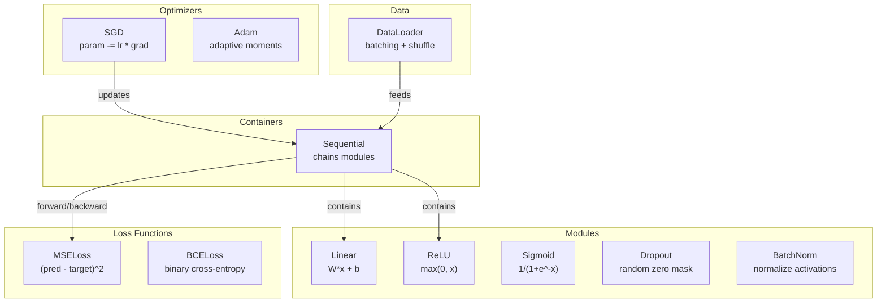
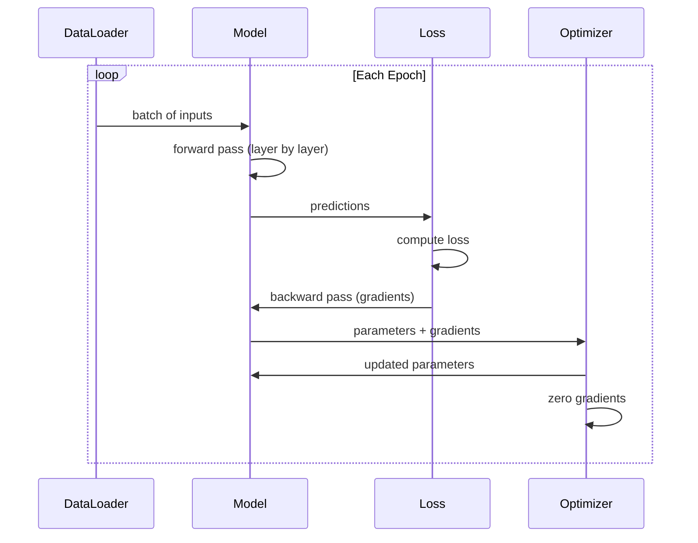
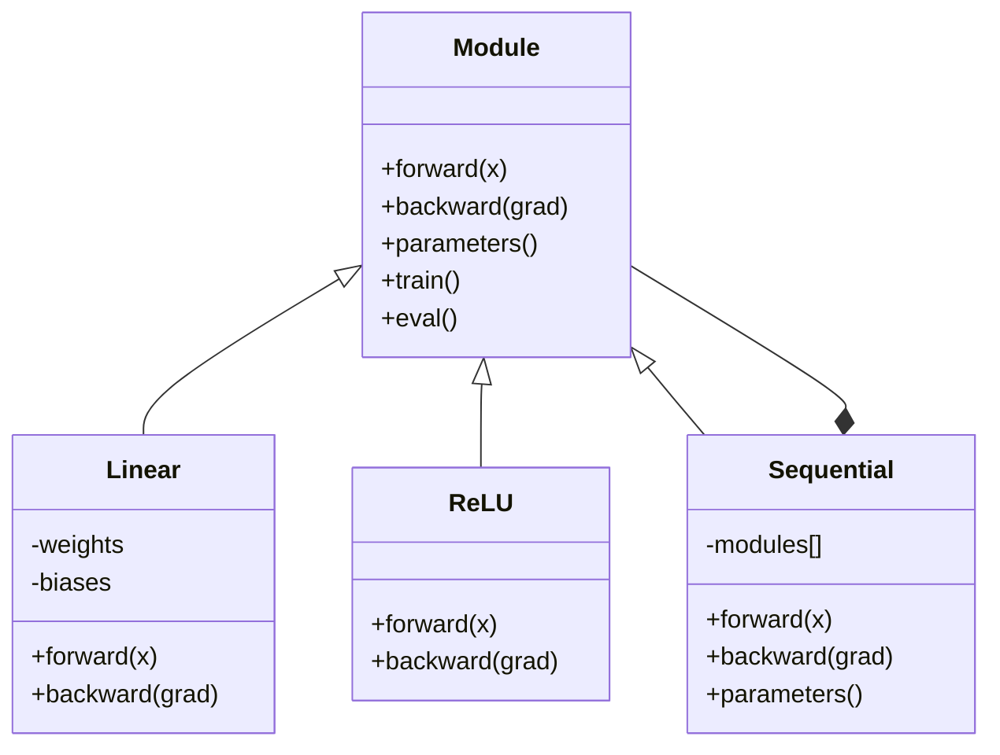

# 自分だけのミニフレームワークを作る

> あなたは neuron、layer、network、backprop、activation、loss function、optimizer、regularization、initialization、LR schedule を作ってきました。すべて別々の部品としてです。今度はそれらをつないで framework にします。PyTorch ではありません。TensorFlow でもありません。あなた自身のものです。

**種類:** Build
**言語:** Python
**前提:** Phase 03 すべて（Lessons 01-09）
**時間:** 約 120 分

## 学習目標

- Module、Linear、ReLU、Sigmoid、Dropout、BatchNorm、Sequential、loss functions、optimizers、DataLoader を備えた完全な deep learning framework（約 500 行）を作る
- Module abstraction（forward、backward、parameters）と、train/eval mode の切り替えが必要な理由を説明する
- すべての component を、circle classification で 4-layer network を学習する実用的な training loop に接続する
- 自分の framework の各 component を PyTorch の対応物（nn.Module、nn.Sequential、optim.Adam、DataLoader）へ対応付ける

## 問題

あなたには、10 lessons 分の building blocks が別々のファイルに散らばっています。ここには `Value` class、そこには training loop、別のファイルには weight initialization、さらに別のファイルには learning rate schedules。network を学習するには、5 つの lessons から copy-paste し、手作業でつなげる必要があります。

framework はこの問題を解決します。PyTorch は `nn.Module`、`nn.Sequential`、`optim.Adam`、`DataLoader`、そしてそれらをまとめる training loop pattern を提供します。TensorFlow は `keras.Layer`、`keras.Sequential`、`keras.optimizers.Adam` を提供します。これらは魔法ではありません。network を毎回 plumbing から作り直さずに定義し、学習し、評価できるようにするための組織化の pattern です。

あなたは同じものを約 500 行の Python で作ります。numpy なし。外部依存なし。任意の feedforward network を定義でき、SGD または Adam で学習でき、data を batch 化し、dropout と batch normalization を適用し、任意の activation を使い、learning rate を schedule できる framework です。

終える頃には、PyTorch で `model = nn.Sequential(...)` と書いたときに何が起きているかを正確に理解できます。`model.train()` と `model.eval()` が存在する理由も理解できます。`optimizer.zero_grad()` が独立した呼び出しである理由も理解できます。すべて自分で作るからです。

## 概念

### Module Abstraction

PyTorch のすべての layer は `nn.Module` を継承します。Module には 3 つの責務があります。

1. **forward()** -- input から output を計算する
2. **parameters()** -- すべての trainable weights を返す
3. **backward()** -- gradients を計算する（PyTorch では autograd が処理し、ここでは明示的に実装する）

Linear layer は Module です。ReLU activation も Module です。dropout layer も Module です。batch normalization layer も Module です。すべて同じ interface を持ちます。

### Sequential Container

`nn.Sequential` は Modules を連結します。Forward pass では、data を Module 1、Module 2、Module 3 の順に通します。Backward pass では、その chain を逆向きにたどります。container 自身も Module です。forward()、parameters()、backward() を持ちます。これは composite pattern です。Modules の sequence が、それ自体 Module になります。

### Training vs Evaluation Mode

Dropout は training 中に neurons を random に 0 にしますが、evaluation 中はすべてをそのまま通します。Batch normalization は training 中に batch statistics を使い、evaluation 中は running averages を使います。`train()` と `eval()` methods はこの behavior を切り替えます。すべての Module は `training` flag を持ちます。

### Optimizer

optimizer は gradients を使って parameters を更新します。SGD は `param -= lr * grad`。Adam は momentum と variance estimates を維持してから更新します。optimizer は network architecture を知りません。flat な parameters と gradients の list だけを見ます。

### DataLoader

batching は 2 つの理由で重要です。第一に、大きな問題では dataset 全体を memory に載せられません。第二に、mini-batch gradient descent は local minima から抜ける助けになる noise を提供します。DataLoader は data を batches に分割し、必要なら epochs の間で shuffle します。

### Framework Architecture



### Training Loop



### Module Hierarchy



## 作ってみる

### Step 1: Module Base Class

すべての layer が実装する abstract interface です。

```python
class Module:
    def __init__(self):
        self.training = True

    def forward(self, x):
        raise NotImplementedError

    def backward(self, grad):
        raise NotImplementedError

    def parameters(self):
        return []

    def train(self):
        self.training = True

    def eval(self):
        self.training = False
```

### Step 2: Linear Layer

基本の building block です。weights と biases を保持し、forward で Wx + b を計算し、backward で weight/input gradients を計算します。

```python
import math
import random


class Linear(Module):
    def __init__(self, fan_in, fan_out):
        super().__init__()
        std = math.sqrt(2.0 / fan_in)
        self.weights = [[random.gauss(0, std) for _ in range(fan_in)] for _ in range(fan_out)]
        self.biases = [0.0] * fan_out
        self.weight_grads = [[0.0] * fan_in for _ in range(fan_out)]
        self.bias_grads = [0.0] * fan_out
        self.fan_in = fan_in
        self.fan_out = fan_out
        self.input = None

    def forward(self, x):
        self.input = x
        output = []
        for i in range(self.fan_out):
            val = self.biases[i]
            for j in range(self.fan_in):
                val += self.weights[i][j] * x[j]
            output.append(val)
        return output

    def backward(self, grad):
        input_grad = [0.0] * self.fan_in
        for i in range(self.fan_out):
            self.bias_grads[i] += grad[i]
            for j in range(self.fan_in):
                self.weight_grads[i][j] += grad[i] * self.input[j]
                input_grad[j] += grad[i] * self.weights[i][j]
        return input_grad

    def parameters(self):
        params = []
        for i in range(self.fan_out):
            for j in range(self.fan_in):
                params.append((self.weights, i, j, self.weight_grads))
            params.append((self.biases, i, None, self.bias_grads))
        return params
```

### Step 3: Activation Modules

ReLU、Sigmoid、Tanh を Modules として実装します。それぞれ backward pass に必要な値を cache します。

```python
class ReLU(Module):
    def __init__(self):
        super().__init__()
        self.mask = None

    def forward(self, x):
        self.mask = [1.0 if v > 0 else 0.0 for v in x]
        return [max(0.0, v) for v in x]

    def backward(self, grad):
        return [g * m for g, m in zip(grad, self.mask)]


class Sigmoid(Module):
    def __init__(self):
        super().__init__()
        self.output = None

    def forward(self, x):
        self.output = []
        for v in x:
            v = max(-500, min(500, v))
            self.output.append(1.0 / (1.0 + math.exp(-v)))
        return self.output

    def backward(self, grad):
        return [g * o * (1 - o) for g, o in zip(grad, self.output)]


class Tanh(Module):
    def __init__(self):
        super().__init__()
        self.output = None

    def forward(self, x):
        self.output = [math.tanh(v) for v in x]
        return self.output

    def backward(self, grad):
        return [g * (1 - o * o) for g, o in zip(grad, self.output)]
```

### Step 4: Dropout Module

training 中に elements を random に 0 にします。期待値が変わらないよう、残った elements を 1/(1-p) で scale します。eval 中は何もしません。

```python
class Dropout(Module):
    def __init__(self, p=0.5):
        super().__init__()
        self.p = p
        self.mask = None

    def forward(self, x):
        if not self.training:
            return x
        self.mask = [0.0 if random.random() < self.p else 1.0 / (1 - self.p) for _ in x]
        return [v * m for v, m in zip(x, self.mask)]

    def backward(self, grad):
        if self.mask is None:
            return grad
        return [g * m for g, m in zip(grad, self.mask)]
```

### Step 5: BatchNorm Module

batch 内の feature ごとに、activations を mean 0、variance 1 に正規化します。eval mode 用に running statistics を維持します。

```python
class BatchNorm(Module):
    def __init__(self, size, momentum=0.1, eps=1e-5):
        super().__init__()
        self.size = size
        self.gamma = [1.0] * size
        self.beta = [0.0] * size
        self.gamma_grads = [0.0] * size
        self.beta_grads = [0.0] * size
        self.running_mean = [0.0] * size
        self.running_var = [1.0] * size
        self.momentum = momentum
        self.eps = eps
        self.x_norm = None
        self.std_inv = None
        self.batch_input = None

    def forward_batch(self, batch):
        batch_size = len(batch)
        output_batch = []

        if self.training:
            mean = [0.0] * self.size
            for sample in batch:
                for j in range(self.size):
                    mean[j] += sample[j]
            mean = [m / batch_size for m in mean]

            var = [0.0] * self.size
            for sample in batch:
                for j in range(self.size):
                    var[j] += (sample[j] - mean[j]) ** 2
            var = [v / batch_size for v in var]

            self.std_inv = [1.0 / math.sqrt(v + self.eps) for v in var]

            self.x_norm = []
            self.batch_input = batch
            for sample in batch:
                normed = [(sample[j] - mean[j]) * self.std_inv[j] for j in range(self.size)]
                self.x_norm.append(normed)
                output = [self.gamma[j] * normed[j] + self.beta[j] for j in range(self.size)]
                output_batch.append(output)

            for j in range(self.size):
                self.running_mean[j] = (1 - self.momentum) * self.running_mean[j] + self.momentum * mean[j]
                self.running_var[j] = (1 - self.momentum) * self.running_var[j] + self.momentum * var[j]
        else:
            std_inv = [1.0 / math.sqrt(v + self.eps) for v in self.running_var]
            for sample in batch:
                normed = [(sample[j] - self.running_mean[j]) * std_inv[j] for j in range(self.size)]
                output = [self.gamma[j] * normed[j] + self.beta[j] for j in range(self.size)]
                output_batch.append(output)

        return output_batch

    def forward(self, x):
        result = self.forward_batch([x])
        return result[0]

    def backward(self, grad):
        if self.x_norm is None:
            return grad
        for j in range(self.size):
            self.gamma_grads[j] += self.x_norm[0][j] * grad[j]
            self.beta_grads[j] += grad[j]
        return [grad[j] * self.gamma[j] * self.std_inv[j] for j in range(self.size)]

    def parameters(self):
        params = []
        for j in range(self.size):
            params.append((self.gamma, j, None, self.gamma_grads))
            params.append((self.beta, j, None, self.beta_grads))
        return params
```

### Step 6: Sequential Container

modules を連結します。Forward は左から右へ、backward は右から左へ進みます。

```python
class Sequential(Module):
    def __init__(self, *modules):
        super().__init__()
        self.modules = list(modules)

    def forward(self, x):
        for module in self.modules:
            x = module.forward(x)
        return x

    def backward(self, grad):
        for module in reversed(self.modules):
            grad = module.backward(grad)
        return grad

    def parameters(self):
        params = []
        for module in self.modules:
            params.extend(module.parameters())
        return params

    def train(self):
        self.training = True
        for module in self.modules:
            module.train()

    def eval(self):
        self.training = False
        for module in self.modules:
            module.eval()
```

### Step 7: Loss Functions

MSE と Binary Cross-Entropy です。それぞれ loss value を返し、gradient を返す backward() を提供します。

```python
class MSELoss:
    def __call__(self, predicted, target):
        self.predicted = predicted
        self.target = target
        n = len(predicted)
        self.loss = sum((p - t) ** 2 for p, t in zip(predicted, target)) / n
        return self.loss

    def backward(self):
        n = len(self.predicted)
        return [2 * (p - t) / n for p, t in zip(self.predicted, self.target)]


class BCELoss:
    def __call__(self, predicted, target):
        self.predicted = predicted
        self.target = target
        eps = 1e-7
        n = len(predicted)
        self.loss = 0
        for p, t in zip(predicted, target):
            p = max(eps, min(1 - eps, p))
            self.loss += -(t * math.log(p) + (1 - t) * math.log(1 - p))
        self.loss /= n
        return self.loss

    def backward(self):
        eps = 1e-7
        n = len(self.predicted)
        grads = []
        for p, t in zip(self.predicted, self.target):
            p = max(eps, min(1 - eps, p))
            grads.append((-t / p + (1 - t) / (1 - p)) / n)
        return grads
```

### Step 8: SGD and Adam Optimizers

どちらも parameter list を受け取り、gradients を使って weights を更新します。

```python
class SGD:
    def __init__(self, parameters, lr=0.01):
        self.params = parameters
        self.lr = lr

    def step(self):
        for container, i, j, grad_container in self.params:
            if j is not None:
                container[i][j] -= self.lr * grad_container[i][j]
            else:
                container[i] -= self.lr * grad_container[i]

    def zero_grad(self):
        for container, i, j, grad_container in self.params:
            if j is not None:
                grad_container[i][j] = 0.0
            else:
                grad_container[i] = 0.0


class Adam:
    def __init__(self, parameters, lr=0.001, beta1=0.9, beta2=0.999, eps=1e-8):
        self.params = parameters
        self.lr = lr
        self.beta1 = beta1
        self.beta2 = beta2
        self.eps = eps
        self.t = 0
        self.m = [0.0] * len(parameters)
        self.v = [0.0] * len(parameters)

    def step(self):
        self.t += 1
        for idx, (container, i, j, grad_container) in enumerate(self.params):
            if j is not None:
                g = grad_container[i][j]
            else:
                g = grad_container[i]

            self.m[idx] = self.beta1 * self.m[idx] + (1 - self.beta1) * g
            self.v[idx] = self.beta2 * self.v[idx] + (1 - self.beta2) * g * g

            m_hat = self.m[idx] / (1 - self.beta1 ** self.t)
            v_hat = self.v[idx] / (1 - self.beta2 ** self.t)

            update = self.lr * m_hat / (math.sqrt(v_hat) + self.eps)

            if j is not None:
                container[i][j] -= update
            else:
                container[i] -= update

    def zero_grad(self):
        for container, i, j, grad_container in self.params:
            if j is not None:
                grad_container[i][j] = 0.0
            else:
                grad_container[i] = 0.0
```

### Step 9: DataLoader

data を batches に分割し、必要なら各 epoch で shuffle します。

```python
class DataLoader:
    def __init__(self, data, batch_size=32, shuffle=True):
        self.data = data
        self.batch_size = batch_size
        self.shuffle = shuffle

    def __iter__(self):
        indices = list(range(len(self.data)))
        if self.shuffle:
            random.shuffle(indices)
        for start in range(0, len(indices), self.batch_size):
            batch_indices = indices[start:start + self.batch_size]
            batch = [self.data[i] for i in batch_indices]
            inputs = [item[0] for item in batch]
            targets = [item[1] for item in batch]
            yield inputs, targets

    def __len__(self):
        return (len(self.data) + self.batch_size - 1) // self.batch_size
```

### Step 10: Circle Classification で 4-Layer Network を学習する

すべてを接続します。model を定義し、loss を選び、optimizer を選び、training loop を実行します。

```python
def make_circle_data(n=500, seed=42):
    random.seed(seed)
    data = []
    for _ in range(n):
        x = random.uniform(-2, 2)
        y = random.uniform(-2, 2)
        label = 1.0 if x * x + y * y < 1.5 else 0.0
        data.append(([x, y], [label]))
    return data


def train():
    random.seed(42)

    model = Sequential(
        Linear(2, 16),
        ReLU(),
        Linear(16, 16),
        ReLU(),
        Linear(16, 8),
        ReLU(),
        Linear(8, 1),
        Sigmoid(),
    )

    criterion = BCELoss()
    optimizer = Adam(model.parameters(), lr=0.01)

    data = make_circle_data(500)
    split = int(len(data) * 0.8)
    train_data = data[:split]
    test_data = data[split:]

    loader = DataLoader(train_data, batch_size=16, shuffle=True)

    model.train()

    for epoch in range(100):
        total_loss = 0
        total_correct = 0
        total_samples = 0

        for batch_inputs, batch_targets in loader:
            batch_loss = 0
            for x, t in zip(batch_inputs, batch_targets):
                pred = model.forward(x)
                loss = criterion(pred, t)
                batch_loss += loss

                optimizer.zero_grad()
                grad = criterion.backward()
                model.backward(grad)
                optimizer.step()

                predicted_class = 1.0 if pred[0] >= 0.5 else 0.0
                if predicted_class == t[0]:
                    total_correct += 1
                total_samples += 1

            total_loss += batch_loss

        avg_loss = total_loss / total_samples
        accuracy = total_correct / total_samples * 100

        if epoch % 10 == 0 or epoch == 99:
            print(f"Epoch {epoch:3d} | Loss: {avg_loss:.6f} | Train Accuracy: {accuracy:.1f}%")

    model.eval()
    correct = 0
    for x, t in test_data:
        pred = model.forward(x)
        predicted_class = 1.0 if pred[0] >= 0.5 else 0.0
        if predicted_class == t[0]:
            correct += 1
    test_accuracy = correct / len(test_data) * 100
    print(f"\nTest Accuracy: {test_accuracy:.1f}% ({correct}/{len(test_data)})")

    return model, test_accuracy
```

## 使ってみる

いま作ったものに対応する PyTorch 版は次のとおりです。

```python
import torch
import torch.nn as nn
from torch.utils.data import DataLoader, TensorDataset

model = nn.Sequential(
    nn.Linear(2, 16),
    nn.ReLU(),
    nn.Linear(16, 16),
    nn.ReLU(),
    nn.Linear(16, 8),
    nn.ReLU(),
    nn.Linear(8, 1),
    nn.Sigmoid(),
)

criterion = nn.BCELoss()
optimizer = torch.optim.Adam(model.parameters(), lr=0.01)

for epoch in range(100):
    model.train()
    for inputs, targets in dataloader:
        optimizer.zero_grad()
        predictions = model(inputs)
        loss = criterion(predictions, targets)
        loss.backward()
        optimizer.step()

    model.eval()
    with torch.no_grad():
        test_predictions = model(test_inputs)
```

構造は同一です。`Sequential`、`Linear`、`ReLU`、`Sigmoid`、`BCELoss`、`Adam`、`zero_grad`、`backward`、`step`、`train`、`eval`。すべての概念が 1 対 1 で対応します。違いは、PyTorch が autograd を自動処理し（各 module に backward() を実装する必要がない）、GPU 上で実行でき、長年最適化されてきたことです。しかし骨格は同じです。

これで PyTorch code を見たとき、各行で何が起きているかを正確に理解できます。その理解こそが目的です。

## 成果物

この lesson で作るもの:
- `outputs/prompt-framework-architect.md` -- framework abstractions を使って neural network architectures を設計するための prompt

## 演習

1. multi-class classification 用の `SoftmaxCrossEntropyLoss` class を追加してください。predictions に softmax を適用し、cross-entropy loss を計算し、combined backward pass を処理します。3-class spiral dataset で test してください。

2. optimizer に learning rate scheduling を実装してください。`set_lr()` method を追加し、Lesson 09 の cosine schedule を接続します。warmup + cosine で circle classifier を学習し、constant LR と比較してください。

3. Sequential に `save()` と `load()` method を追加し、すべての weights を JSON file に serialize して読み戻せるようにしてください。読み込んだ model が元の model と同じ predictions を出すことを確認してください。

4. Adam optimizer に weight decay（L2 regularization）を実装してください。weights を各 step で 0 に近づける `weight_decay` parameter を追加します。decay=0 と decay=0.01 の学習を比較してください。

5. sample ごとの training loop を、正しい mini-batch gradient accumulation に置き換えてください。batch 内のすべての samples で gradients を蓄積し、batch size で割ってから optimizer step を 1 回だけ実行します。これが convergence speed を変えるか測定してください。

## 重要用語

| 用語 | よく言われること | 実際の意味 |
|------|----------------|----------------------|
| Module | "A layer" | framework の base abstraction -- forward()、backward()、parameters() を持つもの |
| Sequential | "Stack layers in order" | modules を chain し、forward では順方向、backward では逆方向に適用する container |
| Forward pass | "Run the network" | input を各 module に順番に通して output を計算すること |
| Backward pass | "Compute gradients" | loss gradient を各 module に逆順で伝播させ、parameter gradients を計算すること |
| Parameters | "The trainable weights" | optimizer が更新できる network 内のすべての値 -- weights と biases |
| Optimizer | "The thing that updates weights" | gradients を使って parameters を更新する algorithm。SGD、Adam、その他の rules を実装する |
| DataLoader | "The thing that feeds data" | dataset を batches に分割し、必要なら epochs 間で shuffle する iterator |
| Training mode | "model.train()" | dropout や batch normalization の batch stats のような stochastic behavior を有効にする flag |
| Evaluation mode | "model.eval()" | dropout を無効化し、batch normalization で running statistics を使う flag |
| Zero grad | "Clear the gradients" | 次の batch の gradients を計算する前に、すべての parameter gradients を 0 に reset すること |

## 参考資料

- Paszke et al., "PyTorch: An Imperative Style, High-Performance Deep Learning Library" (2019) -- PyTorch の設計判断を説明する論文
- Chollet, "Deep Learning with Python, Second Edition" (2021) -- Chapter 3 が同じ module/layer abstraction による Keras internals を扱う
- Johnson, "Tiny-DNN" (https://github.com/tiny-dnn/tiny-dnn) -- framework internals を理解するための header-only C++ deep learning framework
