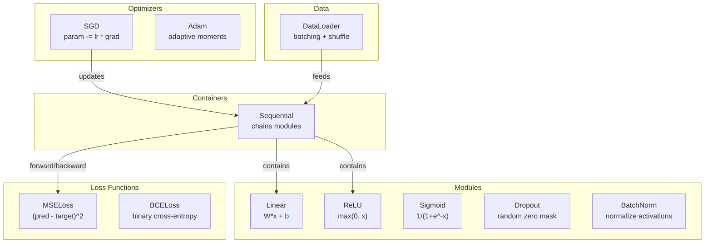
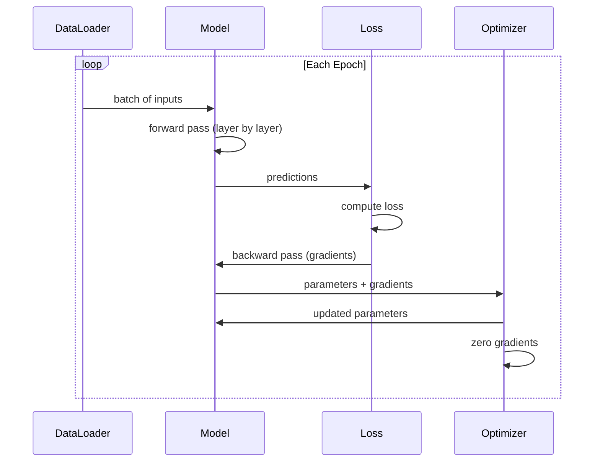
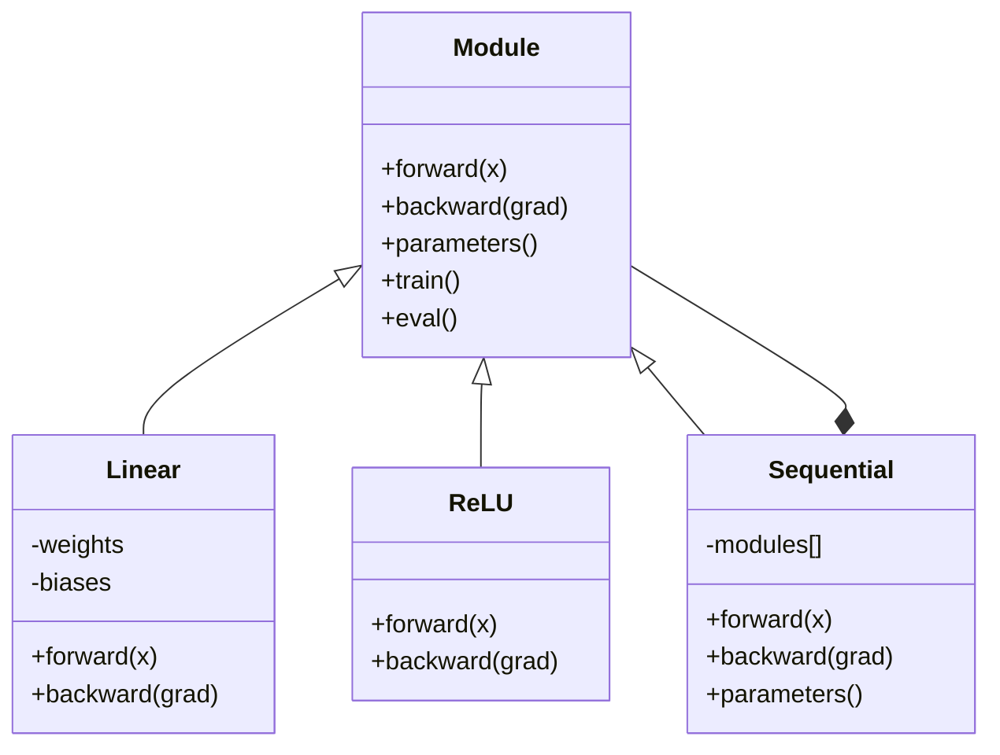

# Kendi Mini'nizi Oluşturun Framework

> Nöronlar, katmanlar, ağlar, backprop, aktivasyonlar, loss function'ler, optimize ediciler, düzenlileştirme, başlatma ve LR programları oluşturdunuz. Hepsi ayrı parçalar halinde. Şimdi bunları bir framework'ye bağlayın. PyTorch değil. TensorFlow değil. Senin.

**Tür:** Yapım
**Diller:** Python
**Önkoşullar:** Aşama 03'ün tamamı (Ders 01-09)
**Süre:** ~120 dakika

## Öğrenme Hedefleri

- Modül, Doğrusal, ReLU, Sigmoid, Bırakma, BatchNorm, Sıralı, loss function'ler, optimize ediciler ve DataLoader ile eksiksiz bir deep learning framework (~500 satır) oluşturun
- Modül soyutlamasını (ileri, geri, parametreler) ve eğitim/değerlendirme modu geçişinin neden gerekli olduğunu açıklayın
- Tüm bileşenleri, daire sınıflandırmasına göre 4 katmanlı bir ağı eğiten çalışan bir eğitim döngüsüne bağlayın
- framework'nizin her bileşenini PyTorch eşdeğeriyle eşleyin (nn.Module, nn.Sequential, optim.Adam, DataLoader)

## Sorun

Ayrı dosyalara dağılmış on ders yapı taşınız var. Burada bir `Value` sınıfı, burada bir eğitim döngüsü, başka bir dosyada ağırlık başlatma, başka bir dosyada öğrenme oranı çizelgeleri. Bir ağı eğitmek için beş farklı dersten kopyalayıp yapıştırır ve bunları elle birbirine bağlarsınız.

framework'lerin çözdüğü şey budur. PyTorch size `nn.Module`, `nn.Sequential`, `optim.Adam`, `DataLoader` ve bunları birbirine bağlayan bir eğitim döngüsü modeli sunar. TensorFlow size `keras.Layer`, `keras.Sequential`, `keras.optimizers.Adam` sunar. Bunlar sihir değil. Bunlar, tesisatı her seferinde yeniden icat etmeden ağları tanımlamayı, eğitmeyi ve değerlendirmeyi mümkün kılan organizasyonel kalıplardır.

Aynı şeyi ~500 Python satırında da inşa edeceksiniz. Uyuşukluk yok. Dış bağımlılık yok. Herhangi bir ileri beslemeli ağı tanımlayabilen, onu SGD veya Adam ile eğitebilen, verileri gruplandırabilen, bırakma ve toplu normalleştirme uygulayabilen, herhangi bir etkinleştirmeyi kullanabilen ve öğrenme oranını planlayabilen bir framework.

Bitirdiğinizde PyTorch'ta `model = nn.Sequential(...)` yazdığınızda tam olarak ne olduğunu anlayacaksınız. `model.train()` ve `model.eval()`'nin neden var olduğunu anlayacaksınız. `optimizer.zero_grad()`'nin neden ayrı bir çağrı olduğunu anlayacaksınız. Hepsini anlayacaksınız çünkü hepsini siz inşa ettiniz.

## Konsept

### Modül Soyutlaması

PyTorch'taki her katman `nn.Module`'den miras alır. Bir Modülün üç sorumluluğu vardır:

1. **forward()** -- girişlere verilen çıktıyı hesaplar
2. **parametreler()** -- eğitilebilir tüm ağırlıkları döndürür
3. **backward()** -- gradient'leri hesaplayın (PyTorch'ta autograd tarafından işlenir, bizimkinde açıktır)

Doğrusal katman bir Modüldür. ReLU aktivasyonu bir Modüldür. Bırakma katmanı bir Modüldür. Toplu normalleştirme katmanı bir Modüldür. Hepsi aynı arayüze sahip.

### Sıralı Konteyner

`nn.Sequential` modülleri zincirler. İleri geçiş: Verileri Modül 1'e, ardından Modül 2'ye ve ardından Modül 3'e besleyin. Geriye doğru geçiş: zinciri tersine çevirin. Kabın kendisi bir Modüldür - forward(), parametreler() ve back()'a sahiptir. Bu bileşik kalıptır: Modüller dizisinin kendisi de bir Modüldür.

### Eğitim ve Değerlendirme Modu

Bırakma, eğitim sırasında nöronları rastgele sıfırlar ancak değerlendirme sırasında her şeyi aktarır. Toplu normalleştirme, eğitim sırasında toplu istatistikleri kullanır, ancak değerlendirme sırasında ortalamaları çalıştırır. `train()` ve `eval()` yöntemleri bu davranışı değiştirir. Her Modülün bir `training` bayrağı vardır.

### Optimize Edici

Optimize edici, gradient'lerini kullanarak parametreleri günceller. SGD: `param -= lr * grad`. Adam: Momentum ve varyans tahminlerini koruyor, ardından güncelliyor. Optimize edici ağ mimarisi hakkında bilgi sahibi değildir; yalnızca düz bir parametre listesi ve bunların gradient'lerini görür.

### Veri Yükleyici

Toplulaştırma iki nedenden dolayı önemlidir. Öncelikle büyük problemler için dataset'nin tamamını belleğe sığdıramazsınız. İkincisi, mini toplu gradient inişi, yerel minimumlardan kaçmaya yardımcı olan gürültü sağlar. DataLoader, verileri gruplara ayırır ve isteğe bağlı olarak dönemler arasında karıştırır.

### Framework Mimari



### Eğitim Döngüsü



### Modül Hiyerarşisi



```figure
gradient-clipping
```

## İnşa Et

### Adım 1: Modül Temel Sınıfı

Her katmanın uyguladığı soyut arayüz.

```python
class Module:
    def __init__(self):
        self.training = True

    def forward(self, x):
        raise NotImplementedError

    def backward(self, grad):
        raise NotImplementedError

    def parameters(self):
        return []

    def train(self):
        self.training = True

    def eval(self):
        self.training = False
```

### Adım 2: Doğrusal Katman

Temel yapı taşı. Ağırlıkları ve sapmaları saklar, Wx + b'yi ileriye doğru ve ağırlık/giriş gradient'leri geriye doğru hesaplar.

```python
import math
import random


class Linear(Module):
    def __init__(self, fan_in, fan_out):
        super().__init__()
        std = math.sqrt(2.0 / fan_in)
        self.weights = [[random.gauss(0, std) for _ in range(fan_in)] for _ in range(fan_out)]
        self.biases = [0.0] * fan_out
        self.weight_grads = [[0.0] * fan_in for _ in range(fan_out)]
        self.bias_grads = [0.0] * fan_out
        self.fan_in = fan_in
        self.fan_out = fan_out
        self.input = None

    def forward(self, x):
        self.input = x
        output = []
        for i in range(self.fan_out):
            val = self.biases[i]
            for j in range(self.fan_in):
                val += self.weights[i][j] * x[j]
            output.append(val)
        return output

    def backward(self, grad):
        input_grad = [0.0] * self.fan_in
        for i in range(self.fan_out):
            self.bias_grads[i] += grad[i]
            for j in range(self.fan_in):
                self.weight_grads[i][j] += grad[i] * self.input[j]
                input_grad[j] += grad[i] * self.weights[i][j]
        return input_grad

    def parameters(self):
        params = []
        for i in range(self.fan_out):
            for j in range(self.fan_in):
                params.append((self.weights, i, j, self.weight_grads))
            params.append((self.biases, i, None, self.bias_grads))
        return params
```

### Adım 3: Etkinleştirme Modülleri

Modüller olarak ReLU, Sigmoid ve Tanh. Her biri geri geçiş için ihtiyaç duyduğu şeyi önbelleğe alır.

```python
class ReLU(Module):
    def __init__(self):
        super().__init__()
        self.mask = None

    def forward(self, x):
        self.mask = [1.0 if v > 0 else 0.0 for v in x]
        return [max(0.0, v) for v in x]

    def backward(self, grad):
        return [g * m for g, m in zip(grad, self.mask)]


class Sigmoid(Module):
    def __init__(self):
        super().__init__()
        self.output = None

    def forward(self, x):
        self.output = []
        for v in x:
            v = max(-500, min(500, v))
            self.output.append(1.0 / (1.0 + math.exp(-v)))
        return self.output

    def backward(self, grad):
        return [g * o * (1 - o) for g, o in zip(grad, self.output)]


class Tanh(Module):
    def __init__(self):
        super().__init__()
        self.output = None

    def forward(self, x):
        self.output = [math.tanh(v) for v in x]
        return self.output

    def backward(self, grad):
        return [g * (1 - o * o) for g, o in zip(grad, self.output)]
```

### Adım 4: Bırakma Modülü

Eğitim sırasında öğeleri rastgele sıfırlar. Kalan öğeleri 1/(1-p) oranında ölçeklendirir, böylece beklenen değerler aynı kalır. Değerlendirme sırasında hiçbir şey yapmaz.

```python
class Dropout(Module):
    def __init__(self, p=0.5):
        super().__init__()
        self.p = p
        self.mask = None

    def forward(self, x):
        if not self.training:
            return x
        self.mask = [0.0 if random.random() < self.p else 1.0 / (1 - self.p) for _ in x]
        return [v * m for v, m in zip(x, self.mask)]

    def backward(self, grad):
        if self.mask is None:
            return grad
        return [g * m for g, m in zip(grad, self.mask)]
```

### Adım 5: BatchNorm Modülü

Aktivasyonları toplu iş genelinde özellik başına sıfır ortalama ve birim varyansa göre normalleştirir. Değerlendirme modu için çalışma istatistiklerini korur.

```python
class BatchNorm(Module):
    def __init__(self, size, momentum=0.1, eps=1e-5):
        super().__init__()
        self.size = size
        self.gamma = [1.0] * size
        self.beta = [0.0] * size
        self.gamma_grads = [0.0] * size
        self.beta_grads = [0.0] * size
        self.running_mean = [0.0] * size
        self.running_var = [1.0] * size
        self.momentum = momentum
        self.eps = eps
        self.x_norm = None
        self.std_inv = None
        self.batch_input = None

    def forward_batch(self, batch):
        batch_size = len(batch)
        output_batch = []

        if self.training:
            mean = [0.0] * self.size
            for sample in batch:
                for j in range(self.size):
                    mean[j] += sample[j]
            mean = [m / batch_size for m in mean]

            var = [0.0] * self.size
            for sample in batch:
                for j in range(self.size):
                    var[j] += (sample[j] - mean[j]) ** 2
            var = [v / batch_size for v in var]

            self.std_inv = [1.0 / math.sqrt(v + self.eps) for v in var]

            self.x_norm = []
            self.batch_input = batch
            for sample in batch:
                normed = [(sample[j] - mean[j]) * self.std_inv[j] for j in range(self.size)]
                self.x_norm.append(normed)
                output = [self.gamma[j] * normed[j] + self.beta[j] for j in range(self.size)]
                output_batch.append(output)

            for j in range(self.size):
                self.running_mean[j] = (1 - self.momentum) * self.running_mean[j] + self.momentum * mean[j]
                self.running_var[j] = (1 - self.momentum) * self.running_var[j] + self.momentum * var[j]
        else:
            std_inv = [1.0 / math.sqrt(v + self.eps) for v in self.running_var]
            for sample in batch:
                normed = [(sample[j] - self.running_mean[j]) * std_inv[j] for j in range(self.size)]
                output = [self.gamma[j] * normed[j] + self.beta[j] for j in range(self.size)]
                output_batch.append(output)

        return output_batch

    def forward(self, x):
        result = self.forward_batch([x])
        return result[0]

    def backward(self, grad):
        if self.x_norm is None:
            return grad
        for j in range(self.size):
            self.gamma_grads[j] += self.x_norm[0][j] * grad[j]
            self.beta_grads[j] += grad[j]
        return [grad[j] * self.gamma[j] * self.std_inv[j] for j in range(self.size)]

    def parameters(self):
        params = []
        for j in range(self.size):
            params.append((self.gamma, j, None, self.gamma_grads))
            params.append((self.beta, j, None, self.beta_grads))
        return params
```

### Adım 6: Sıralı Kapsayıcı

Zincir modülleri. İleri soldan sağa, geri ise sağdan sola gider.

```python
class Sequential(Module):
    def __init__(self, *modules):
        super().__init__()
        self.modules = list(modules)

    def forward(self, x):
        for module in self.modules:
            x = module.forward(x)
        return x

    def backward(self, grad):
        for module in reversed(self.modules):
            grad = module.backward(grad)
        return grad

    def parameters(self):
        params = []
        for module in self.modules:
            params.extend(module.parameters())
        return params

    def train(self):
        self.training = True
        for module in self.modules:
            module.train()

    def eval(self):
        self.training = False
        for module in self.modules:
            module.eval()
```

### Adım 7: Loss Function'ler

MSE ve İkili Çapraz Entropi. Her biri kayıp değerini döndürür ve gradient'yi döndüren bir geriye doğru() işlevi sağlar.

```python
class MSELoss:
    def __call__(self, predicted, target):
        self.predicted = predicted
        self.target = target
        n = len(predicted)
        self.loss = sum((p - t) ** 2 for p, t in zip(predicted, target)) / n
        return self.loss

    def backward(self):
        n = len(self.predicted)
        return [2 * (p - t) / n for p, t in zip(self.predicted, self.target)]


class BCELoss:
    def __call__(self, predicted, target):
        self.predicted = predicted
        self.target = target
        eps = 1e-7
        n = len(predicted)
        self.loss = 0
        for p, t in zip(predicted, target):
            p = max(eps, min(1 - eps, p))
            self.loss += -(t * math.log(p) + (1 - t) * math.log(1 - p))
        self.loss /= n
        return self.loss

    def backward(self):
        eps = 1e-7
        n = len(self.predicted)
        grads = []
        for p, t in zip(self.predicted, self.target):
            p = max(eps, min(1 - eps, p))
            grads.append((-t / p + (1 - t) / (1 - p)) / n)
        return grads
```

### Adım 8: SGD ve Adam Optimize Ediciler

Her ikisi de bir parametre listesi alır ve gradient'leri kullanarak ağırlıkları günceller.

```python
class SGD:
    def __init__(self, parameters, lr=0.01):
        self.params = parameters
        self.lr = lr

    def step(self):
        for container, i, j, grad_container in self.params:
            if j is not None:
                container[i][j] -= self.lr * grad_container[i][j]
            else:
                container[i] -= self.lr * grad_container[i]

    def zero_grad(self):
        for container, i, j, grad_container in self.params:
            if j is not None:
                grad_container[i][j] = 0.0
            else:
                grad_container[i] = 0.0


class Adam:
    def __init__(self, parameters, lr=0.001, beta1=0.9, beta2=0.999, eps=1e-8):
        self.params = parameters
        self.lr = lr
        self.beta1 = beta1
        self.beta2 = beta2
        self.eps = eps
        self.t = 0
        self.m = [0.0] * len(parameters)
        self.v = [0.0] * len(parameters)

    def step(self):
        self.t += 1
        for idx, (container, i, j, grad_container) in enumerate(self.params):
            if j is not None:
                g = grad_container[i][j]
            else:
                g = grad_container[i]

            self.m[idx] = self.beta1 * self.m[idx] + (1 - self.beta1) * g
            self.v[idx] = self.beta2 * self.v[idx] + (1 - self.beta2) * g * g

            m_hat = self.m[idx] / (1 - self.beta1 ** self.t)
            v_hat = self.v[idx] / (1 - self.beta2 ** self.t)

            update = self.lr * m_hat / (math.sqrt(v_hat) + self.eps)

            if j is not None:
                container[i][j] -= update
            else:
                container[i] -= update

    def zero_grad(self):
        for container, i, j, grad_container in self.params:
            if j is not None:
                grad_container[i][j] = 0.0
            else:
                grad_container[i] = 0.0
```

### Adım 9: Veri Yükleyici

Verileri gruplara ayırır ve isteğe bağlı olarak her dönemi karıştırır.

```python
class DataLoader:
    def __init__(self, data, batch_size=32, shuffle=True):
        self.data = data
        self.batch_size = batch_size
        self.shuffle = shuffle

    def __iter__(self):
        indices = list(range(len(self.data)))
        if self.shuffle:
            random.shuffle(indices)
        for start in range(0, len(indices), self.batch_size):
            batch_indices = indices[start:start + self.batch_size]
            batch = [self.data[i] for i in batch_indices]
            inputs = [item[0] for item in batch]
            targets = [item[1] for item in batch]
            yield inputs, targets

    def __len__(self):
        return (len(self.data) + self.batch_size - 1) // self.batch_size
```

### Adım 10: Çember Sınıflandırmasına Göre 4 Katmanlı Bir Ağ Eğitin

Her şeyi birbirine bağlayın. Bir model tanımlayın, bir kayıp seçin, bir optimize edici seçin, eğitim döngüsünü çalıştırın.

```python
def make_circle_data(n=500, seed=42):
    random.seed(seed)
    data = []
    for _ in range(n):
        x = random.uniform(-2, 2)
        y = random.uniform(-2, 2)
        label = 1.0 if x * x + y * y < 1.5 else 0.0
        data.append(([x, y], [label]))
    return data


def train():
    random.seed(42)

    model = Sequential(
        Linear(2, 16),
        ReLU(),
        Linear(16, 16),
        ReLU(),
        Linear(16, 8),
        ReLU(),
        Linear(8, 1),
        Sigmoid(),
    )

    criterion = BCELoss()
    optimizer = Adam(model.parameters(), lr=0.01)

    data = make_circle_data(500)
    split = int(len(data) * 0.8)
    train_data = data[:split]
    test_data = data[split:]

    loader = DataLoader(train_data, batch_size=16, shuffle=True)

    model.train()

    for epoch in range(100):
        total_loss = 0
        total_correct = 0
        total_samples = 0

        for batch_inputs, batch_targets in loader:
            batch_loss = 0
            for x, t in zip(batch_inputs, batch_targets):
                pred = model.forward(x)
                loss = criterion(pred, t)
                batch_loss += loss

                optimizer.zero_grad()
                grad = criterion.backward()
                model.backward(grad)
                optimizer.step()

                predicted_class = 1.0 if pred[0] >= 0.5 else 0.0
                if predicted_class == t[0]:
                    total_correct += 1
                total_samples += 1

            total_loss += batch_loss

        avg_loss = total_loss / total_samples
        accuracy = total_correct / total_samples * 100

        if epoch % 10 == 0 or epoch == 99:
            print(f"Epoch {epoch:3d} | Loss: {avg_loss:.6f} | Train Accuracy: {accuracy:.1f}%")

    model.eval()
    correct = 0
    for x, t in test_data:
        pred = model.forward(x)
        predicted_class = 1.0 if pred[0] >= 0.5 else 0.0
        if predicted_class == t[0]:
            correct += 1
    test_accuracy = correct / len(test_data) * 100
    print(f"\nTest Accuracy: {test_accuracy:.1f}% ({correct}/{len(test_data)})")

    return model, test_accuracy
```

## Kullan onu

İşte yeni oluşturduğunuz şeyin PyTorch eşdeğeri:

```python
import torch
import torch.nn as nn
from torch.utils.data import DataLoader, TensorDataset

model = nn.Sequential(
    nn.Linear(2, 16),
    nn.ReLU(),
    nn.Linear(16, 16),
    nn.ReLU(),
    nn.Linear(16, 8),
    nn.ReLU(),
    nn.Linear(8, 1),
    nn.Sigmoid(),
)

criterion = nn.BCELoss()
optimizer = torch.optim.Adam(model.parameters(), lr=0.01)

for epoch in range(100):
    model.train()
    for inputs, targets in dataloader:
        optimizer.zero_grad()
        predictions = model(inputs)
        loss = criterion(predictions, targets)
        loss.backward()
        optimizer.step()

    model.eval()
    with torch.no_grad():
        test_predictions = model(test_inputs)
```

Yapı aynıdır. `Sequential`, `Linear`, `ReLU`, `Sigmoid`, `BCELoss`, `Adam`, `zero_grad`, `backward`, `step`, `train`, `eval`. Her kavram bire bir eşlenir. Aradaki fark, PyTorch'un autograd'ı otomatik olarak işlemesi (her modülde geriye doğru() uygulamaya gerek yoktur), GPU üzerinde çalışması ve yıllardır optimize edilmiş olmasıdır. Ama kemikler aynı.

Artık PyTorch kodunu gördüğünüzde her satırda ne olduğunu tam olarak bilirsiniz. Bütün mesele bu anlayıştır.

## Gönderin

Bu ders şunları üretir:
- `outputs/prompt-framework-architect.md` - framework soyutlamalarını kullanarak neural network mimarilerini tasarlamak için bir prompt

## Egzersizler

1. Çok sınıflı sınıflandırma için bir `SoftmaxCrossEntropyLoss` sınıfı ekleyin. Tahminleri Softmax yapın, çapraz entropi kaybını hesaplayın ve birleşik geri geçişi yönetin. 3 sınıflı bir spiral dataset üzerinde test edin.

2. Optimize edicide öğrenme oranı planlamasını uygulayın: bir `set_lr()` yöntemi ekleyin ve Ders 09'daki kosinüs programını bağlayın. Daire sınıflandırıcısını ısınma + kosinüs ile eğitin ve sabit LR ile karşılaştırın.

3. Sequential'a, tüm ağırlıkları bir JSON dosyasına serileştiren ve bunları geri yükleyen bir `save()` ve `load()` yöntemini ekleyin. Yüklenen bir modelin orijinal ile aynı tahminleri ürettiğini doğrulayın.

4. Adam optimize edicide ağırlık azaltma (L2 düzenlemesi) uygulayın. Her adımda ağırlıkları sıfıra doğru küçülten bir `weight_decay` parametresi ekleyin. Eğitimi bozunum=0 ve bozunma=0,01 ile karşılaştırın.

5. Örnek başına eğitim döngüsünü uygun mini toplu gradient birikimiyle değiştirin: bir gruptaki tüm örneklerde gradient'leri toplayın, ardından grup boyutuna bölün ve bir optimize edici adım atın. Bunun yakınsama hızını değiştirip değiştirmediğini ölçün.

## Anahtar Terimler

| Dönem | İnsanlar ne diyor | Aslında ne anlama geliyor |
|------|----------------|----------------------|
| Modül | "Bir katman" | framework'deki temel soyutlama -- forward(), back() ve parametreler() içeren herhangi bir şey |
| Sıralı | "Katmanları sırayla yığın" | Modülleri zincirleyen, bunları ileri için sırayla ve geri için geri uygulayan bir kap |
| İleri pas | "Ağı çalıştır" | Girişi her modülden sırayla geçirerek çıkışı hesaplama |
| Geri pas | "gradient'leri Hesapla" | gradients parametresini hesaplamak için gradient kaybının her modüle ters yönde yayılması |
| Parametreler | "Eğitilebilir ağırlıklar" | Optimize edicinin ağda güncelleyebileceği tüm değerler -- ağırlıklar ve sapmalar |
| Optimize Edici | "Ağırlıkları güncelleyen şey" | Parametreleri güncellemek, SGD, Adam veya diğer kuralları uygulamak için gradient'leri kullanan bir algoritma |
| Veri Yükleyici | "Verileri besleyen şey" | dataset'yi gruplara bölen, isteğe bağlı olarak dönemler arasında geçiş yapan bir yineleyici |
| Eğitim modu | "model.train()" | Toplu istatistiklerle bırakma ve toplu normalleştirme gibi stokastik davranışlara olanak tanıyan bir bayrak |
| Değerlendirme modu | "model.eval()" | Bırakmayı devre dışı bırakan ve toplu normalleştirme için çalışma istatistiklerini kullanan bir bayrak |
| Sıfır derece | "gradient'leri Temizle" | Sonraki partinin gradient'lerini hesaplamadan önce tüm gradient parametrelerini sıfıra sıfırlama |

## Daha Fazla Okuma

- Paszke ve diğerleri, "PyTorch: An Imperative Style, High-Performance Deep Learning Library" (2019) -- PyTorch'un tasarım kararlarını açıklayan makale
- Chollet, "Deep Learning with Python, Second Edition" (2021) -- Bölüm 3, aynı modül/katman soyutlamasına sahip Keras dahili bileşenlerini kapsar
- Johnson, "Tiny-DNN" (https://github.com/tiny-dnn/tiny-dnn) -- framework dahili bileşenlerini anlamak için yalnızca başlık içeren bir C++ deep learning framework
