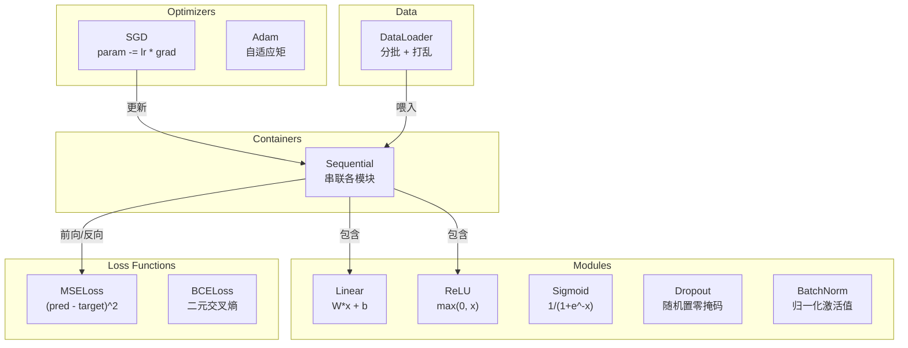
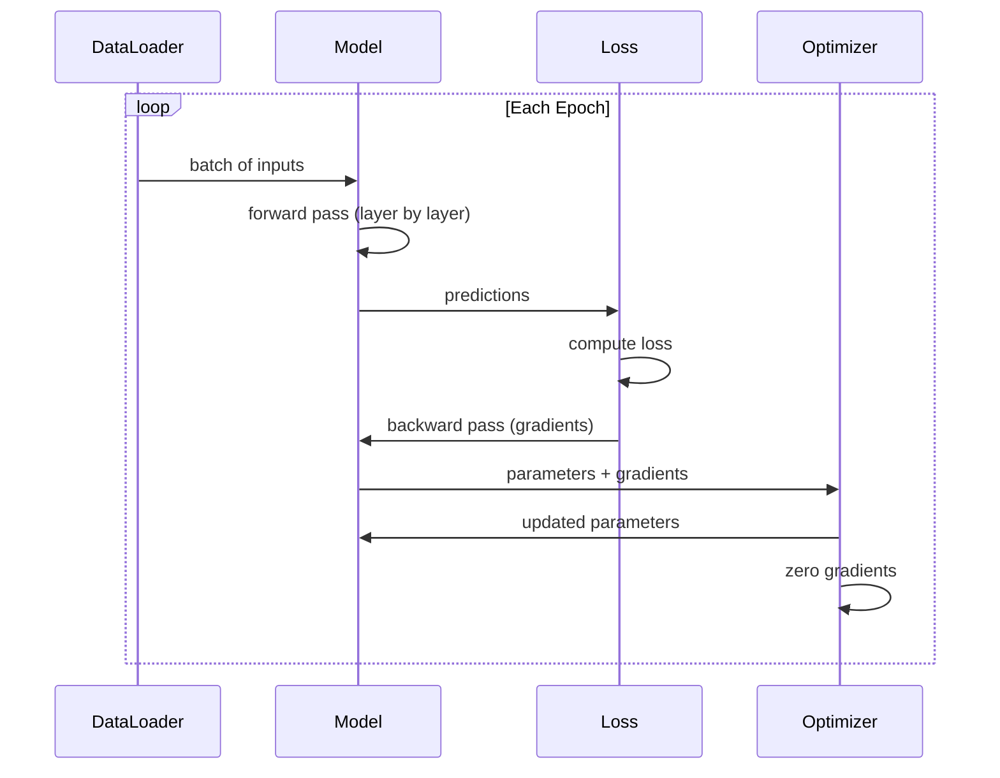
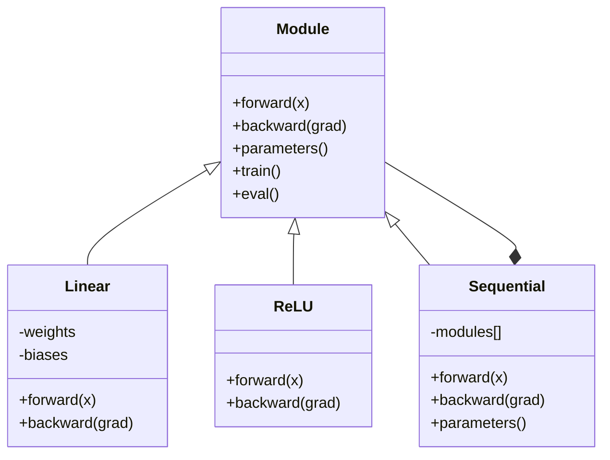

# 自己动手造一个 Mini Framework

> 译注：本文译自同目录 [`en.md`](./en.md)。术语遵循仓根 [TRANSLATION_GUIDE.md](../../../../TRANSLATION_GUIDE.md)。

> 你已经造过神经元、层、网络、backprop（反向传播）、激活函数、损失函数、optimizer、正则化、初始化、还有学习率调度。它们都是各自独立的零件。现在该把它们拧到一起，做成一个框架。不是 PyTorch，不是 TensorFlow，是你自己的。

**Type:** Build
**Languages:** Python
**Prerequisites:** All of Phase 03 (Lessons 01-09)
**Time:** ~120 minutes

## 学习目标（Learning Objectives）

- 用 ~500 行代码搭一个完整的深度学习框架，包含 Module、Linear、ReLU、Sigmoid、Dropout、BatchNorm、Sequential、损失函数、optimizer 和 DataLoader
- 解释 Module 抽象（forward、backward、parameters），并说明为什么需要 train/eval 模式切换
- 把所有组件拼到一个能跑通的训练循环里，训练一个 4 层网络做圆形分类
- 把你框架里的每个组件对应到 PyTorch 的等价实现（nn.Module、nn.Sequential、optim.Adam、DataLoader）

## 问题（The Problem）

你已经攒了十节课的零件，散落在不同文件里。这边一个 `Value` 类，那边一段训练循环，权重初始化又在另一个文件里，学习率调度还在第四个地方。要训一个网络，你得从五节课里复制粘贴，然后手工接线。

这就是框架要解决的事。PyTorch 给你 `nn.Module`、`nn.Sequential`、`optim.Adam`、`DataLoader`，外加一套把它们串起来的训练循环写法。TensorFlow 给你 `keras.Layer`、`keras.Sequential`、`keras.optimizers.Adam`。这些东西没什么魔法，本质上是组织模式：让你能定义、训练、评估网络，而不必每次都重新发明那一堆管道。

你接下来要用 ~500 行 Python 把同样的东西做出来。不用 numpy，不依赖任何外部库。一个能定义任何前馈网络、能用 SGD 或 Adam 训练、能切 batch、能用 dropout 和 batch norm、能用任意激活、能调度学习率的框架。

做完之后，你就能完全明白：在 PyTorch 里写下 `model = nn.Sequential(...)` 那一刻到底发生了什么。你会明白为什么有 `model.train()` 和 `model.eval()`。你会明白为什么 `optimizer.zero_grad()` 是单独的一步调用。你会全部明白，因为这一切都是你亲手造的。

## 概念（The Concept）

### Module 抽象（The Module Abstraction）

PyTorch 里每一层都继承自 `nn.Module`。一个 Module 有三项职责：

1. **forward()** —— 给定输入计算输出
2. **parameters()** —— 返回所有可训练的权重
3. **backward()** —— 计算梯度（PyTorch 里由 autograd 自动处理，我们这里要显式写）

Linear 层是 Module，ReLU 激活是 Module，dropout 层是 Module，batch normalization 层也是 Module。它们共用同一套接口。

### Sequential 容器（Sequential Container）

`nn.Sequential` 把多个 Module 串起来。前向传播：数据先过 Module 1，再过 Module 2，再过 Module 3。反向传播：把这条链反过来。容器自身也是一个 Module —— 它也有 forward()、parameters() 和 backward()。这就是组合模式（composite pattern）：一串 Module 自身也是一个 Module。

### 训练 vs 评估模式（Training vs Evaluation Mode）

Dropout 在训练时随机把神经元置零，但在评估时让所有值原样通过。Batch normalization 训练时用当前 batch 的统计量，评估时用滑动平均。`train()` 和 `eval()` 这两个方法负责切换这套行为。每个 Module 都有一个 `training` 标志。

### Optimizer

Optimizer 用梯度更新参数。SGD：`param -= lr * grad`。Adam：维护动量和方差的估计，再更新。Optimizer 不关心网络结构 —— 它只看到一份扁平的参数列表和它们的梯度。

### DataLoader

切 batch 重要有两点理由。第一，大问题里整个数据集放不进内存。第二，mini-batch 梯度下降带来的噪声有助于跳出局部极小。DataLoader 把数据切成若干 batch，并可选地在 epoch 之间洗牌。

### 框架架构（Framework Architecture）



### 训练循环（Training Loop）



### Module 继承关系（Module Hierarchy）



## 动手实现（Build It）

### Step 1: Module 基类（Module Base Class）

每一层都要实现的抽象接口。

```python
class Module:
    def __init__(self):
        self.training = True

    def forward(self, x):
        raise NotImplementedError

    def backward(self, grad):
        raise NotImplementedError

    def parameters(self):
        return []

    def train(self):
        self.training = True

    def eval(self):
        self.training = False
```

### Step 2: Linear 层（Linear Layer）

最基础的构件。存权重和偏置，前向算 Wx + b，反向算权重梯度和输入梯度。

```python
import math
import random


class Linear(Module):
    def __init__(self, fan_in, fan_out):
        super().__init__()
        std = math.sqrt(2.0 / fan_in)
        self.weights = [[random.gauss(0, std) for _ in range(fan_in)] for _ in range(fan_out)]
        self.biases = [0.0] * fan_out
        self.weight_grads = [[0.0] * fan_in for _ in range(fan_out)]
        self.bias_grads = [0.0] * fan_out
        self.fan_in = fan_in
        self.fan_out = fan_out
        self.input = None

    def forward(self, x):
        self.input = x
        output = []
        for i in range(self.fan_out):
            val = self.biases[i]
            for j in range(self.fan_in):
                val += self.weights[i][j] * x[j]
            output.append(val)
        return output

    def backward(self, grad):
        input_grad = [0.0] * self.fan_in
        for i in range(self.fan_out):
            self.bias_grads[i] += grad[i]
            for j in range(self.fan_in):
                self.weight_grads[i][j] += grad[i] * self.input[j]
                input_grad[j] += grad[i] * self.weights[i][j]
        return input_grad

    def parameters(self):
        params = []
        for i in range(self.fan_out):
            for j in range(self.fan_in):
                params.append((self.weights, i, j, self.weight_grads))
            params.append((self.biases, i, None, self.bias_grads))
        return params
```

### Step 3: 激活 Module（Activation Modules）

把 ReLU、Sigmoid、Tanh 都做成 Module。各自缓存反向所需的内容。

```python
class ReLU(Module):
    def __init__(self):
        super().__init__()
        self.mask = None

    def forward(self, x):
        self.mask = [1.0 if v > 0 else 0.0 for v in x]
        return [max(0.0, v) for v in x]

    def backward(self, grad):
        return [g * m for g, m in zip(grad, self.mask)]


class Sigmoid(Module):
    def __init__(self):
        super().__init__()
        self.output = None

    def forward(self, x):
        self.output = []
        for v in x:
            v = max(-500, min(500, v))
            self.output.append(1.0 / (1.0 + math.exp(-v)))
        return self.output

    def backward(self, grad):
        return [g * o * (1 - o) for g, o in zip(grad, self.output)]


class Tanh(Module):
    def __init__(self):
        super().__init__()
        self.output = None

    def forward(self, x):
        self.output = [math.tanh(v) for v in x]
        return self.output

    def backward(self, grad):
        return [g * (1 - o * o) for g, o in zip(grad, self.output)]
```

### Step 4: Dropout Module

训练时随机把元素置零。剩下的元素乘以 1/(1-p)，让期望值保持不变。评估时什么都不做。

```python
class Dropout(Module):
    def __init__(self, p=0.5):
        super().__init__()
        self.p = p
        self.mask = None

    def forward(self, x):
        if not self.training:
            return x
        self.mask = [0.0 if random.random() < self.p else 1.0 / (1 - self.p) for _ in x]
        return [v * m for v, m in zip(x, self.mask)]

    def backward(self, grad):
        if self.mask is None:
            return grad
        return [g * m for g, m in zip(grad, self.mask)]
```

### Step 5: BatchNorm Module

按特征维度，把 batch 内的激活归一化为零均值、单位方差。同时维护 running 统计量，用于 eval 模式。

```python
class BatchNorm(Module):
    def __init__(self, size, momentum=0.1, eps=1e-5):
        super().__init__()
        self.size = size
        self.gamma = [1.0] * size
        self.beta = [0.0] * size
        self.gamma_grads = [0.0] * size
        self.beta_grads = [0.0] * size
        self.running_mean = [0.0] * size
        self.running_var = [1.0] * size
        self.momentum = momentum
        self.eps = eps
        self.x_norm = None
        self.std_inv = None
        self.batch_input = None

    def forward_batch(self, batch):
        batch_size = len(batch)
        output_batch = []

        if self.training:
            mean = [0.0] * self.size
            for sample in batch:
                for j in range(self.size):
                    mean[j] += sample[j]
            mean = [m / batch_size for m in mean]

            var = [0.0] * self.size
            for sample in batch:
                for j in range(self.size):
                    var[j] += (sample[j] - mean[j]) ** 2
            var = [v / batch_size for v in var]

            self.std_inv = [1.0 / math.sqrt(v + self.eps) for v in var]

            self.x_norm = []
            self.batch_input = batch
            for sample in batch:
                normed = [(sample[j] - mean[j]) * self.std_inv[j] for j in range(self.size)]
                self.x_norm.append(normed)
                output = [self.gamma[j] * normed[j] + self.beta[j] for j in range(self.size)]
                output_batch.append(output)

            for j in range(self.size):
                self.running_mean[j] = (1 - self.momentum) * self.running_mean[j] + self.momentum * mean[j]
                self.running_var[j] = (1 - self.momentum) * self.running_var[j] + self.momentum * var[j]
        else:
            std_inv = [1.0 / math.sqrt(v + self.eps) for v in self.running_var]
            for sample in batch:
                normed = [(sample[j] - self.running_mean[j]) * std_inv[j] for j in range(self.size)]
                output = [self.gamma[j] * normed[j] + self.beta[j] for j in range(self.size)]
                output_batch.append(output)

        return output_batch

    def forward(self, x):
        result = self.forward_batch([x])
        return result[0]

    def backward(self, grad):
        if self.x_norm is None:
            return grad
        for j in range(self.size):
            self.gamma_grads[j] += self.x_norm[0][j] * grad[j]
            self.beta_grads[j] += grad[j]
        return [grad[j] * self.gamma[j] * self.std_inv[j] for j in range(self.size)]

    def parameters(self):
        params = []
        for j in range(self.size):
            params.append((self.gamma, j, None, self.gamma_grads))
            params.append((self.beta, j, None, self.beta_grads))
        return params
```

### Step 6: Sequential 容器（Sequential Container）

把 module 串起来。前向从左到右走，反向从右到左走。

```python
class Sequential(Module):
    def __init__(self, *modules):
        super().__init__()
        self.modules = list(modules)

    def forward(self, x):
        for module in self.modules:
            x = module.forward(x)
        return x

    def backward(self, grad):
        for module in reversed(self.modules):
            grad = module.backward(grad)
        return grad

    def parameters(self):
        params = []
        for module in self.modules:
            params.extend(module.parameters())
        return params

    def train(self):
        self.training = True
        for module in self.modules:
            module.train()

    def eval(self):
        self.training = False
        for module in self.modules:
            module.eval()
```

### Step 7: 损失函数（Loss Functions）

MSE 和二分类交叉熵（Binary Cross-Entropy）。每个都返回损失值，并提供一个 backward()，返回梯度。

```python
class MSELoss:
    def __call__(self, predicted, target):
        self.predicted = predicted
        self.target = target
        n = len(predicted)
        self.loss = sum((p - t) ** 2 for p, t in zip(predicted, target)) / n
        return self.loss

    def backward(self):
        n = len(self.predicted)
        return [2 * (p - t) / n for p, t in zip(self.predicted, self.target)]


class BCELoss:
    def __call__(self, predicted, target):
        self.predicted = predicted
        self.target = target
        eps = 1e-7
        n = len(predicted)
        self.loss = 0
        for p, t in zip(predicted, target):
            p = max(eps, min(1 - eps, p))
            self.loss += -(t * math.log(p) + (1 - t) * math.log(1 - p))
        self.loss /= n
        return self.loss

    def backward(self):
        eps = 1e-7
        n = len(self.predicted)
        grads = []
        for p, t in zip(self.predicted, self.target):
            p = max(eps, min(1 - eps, p))
            grads.append((-t / p + (1 - t) / (1 - p)) / n)
        return grads
```

### Step 8: SGD 与 Adam optimizer（SGD and Adam Optimizers）

两者都接收一个参数列表，并用梯度更新权重。

```python
class SGD:
    def __init__(self, parameters, lr=0.01):
        self.params = parameters
        self.lr = lr

    def step(self):
        for container, i, j, grad_container in self.params:
            if j is not None:
                container[i][j] -= self.lr * grad_container[i][j]
            else:
                container[i] -= self.lr * grad_container[i]

    def zero_grad(self):
        for container, i, j, grad_container in self.params:
            if j is not None:
                grad_container[i][j] = 0.0
            else:
                grad_container[i] = 0.0


class Adam:
    def __init__(self, parameters, lr=0.001, beta1=0.9, beta2=0.999, eps=1e-8):
        self.params = parameters
        self.lr = lr
        self.beta1 = beta1
        self.beta2 = beta2
        self.eps = eps
        self.t = 0
        self.m = [0.0] * len(parameters)
        self.v = [0.0] * len(parameters)

    def step(self):
        self.t += 1
        for idx, (container, i, j, grad_container) in enumerate(self.params):
            if j is not None:
                g = grad_container[i][j]
            else:
                g = grad_container[i]

            self.m[idx] = self.beta1 * self.m[idx] + (1 - self.beta1) * g
            self.v[idx] = self.beta2 * self.v[idx] + (1 - self.beta2) * g * g

            m_hat = self.m[idx] / (1 - self.beta1 ** self.t)
            v_hat = self.v[idx] / (1 - self.beta2 ** self.t)

            update = self.lr * m_hat / (math.sqrt(v_hat) + self.eps)

            if j is not None:
                container[i][j] -= update
            else:
                container[i] -= update

    def zero_grad(self):
        for container, i, j, grad_container in self.params:
            if j is not None:
                grad_container[i][j] = 0.0
            else:
                grad_container[i] = 0.0
```

### Step 9: DataLoader

把数据切成 batch，可选地每个 epoch 洗牌。

```python
class DataLoader:
    def __init__(self, data, batch_size=32, shuffle=True):
        self.data = data
        self.batch_size = batch_size
        self.shuffle = shuffle

    def __iter__(self):
        indices = list(range(len(self.data)))
        if self.shuffle:
            random.shuffle(indices)
        for start in range(0, len(indices), self.batch_size):
            batch_indices = indices[start:start + self.batch_size]
            batch = [self.data[i] for i in batch_indices]
            inputs = [item[0] for item in batch]
            targets = [item[1] for item in batch]
            yield inputs, targets

    def __len__(self):
        return (len(self.data) + self.batch_size - 1) // self.batch_size
```

### Step 10: 用 4 层网络做圆形分类（Train a 4-Layer Network on Circle Classification）

把所有东西拼到一起。定义模型，挑一个损失，挑一个 optimizer，跑训练循环。

```python
def make_circle_data(n=500, seed=42):
    random.seed(seed)
    data = []
    for _ in range(n):
        x = random.uniform(-2, 2)
        y = random.uniform(-2, 2)
        label = 1.0 if x * x + y * y < 1.5 else 0.0
        data.append(([x, y], [label]))
    return data


def train():
    random.seed(42)

    model = Sequential(
        Linear(2, 16),
        ReLU(),
        Linear(16, 16),
        ReLU(),
        Linear(16, 8),
        ReLU(),
        Linear(8, 1),
        Sigmoid(),
    )

    criterion = BCELoss()
    optimizer = Adam(model.parameters(), lr=0.01)

    data = make_circle_data(500)
    split = int(len(data) * 0.8)
    train_data = data[:split]
    test_data = data[split:]

    loader = DataLoader(train_data, batch_size=16, shuffle=True)

    model.train()

    for epoch in range(100):
        total_loss = 0
        total_correct = 0
        total_samples = 0

        for batch_inputs, batch_targets in loader:
            batch_loss = 0
            for x, t in zip(batch_inputs, batch_targets):
                pred = model.forward(x)
                loss = criterion(pred, t)
                batch_loss += loss

                optimizer.zero_grad()
                grad = criterion.backward()
                model.backward(grad)
                optimizer.step()

                predicted_class = 1.0 if pred[0] >= 0.5 else 0.0
                if predicted_class == t[0]:
                    total_correct += 1
                total_samples += 1

            total_loss += batch_loss

        avg_loss = total_loss / total_samples
        accuracy = total_correct / total_samples * 100

        if epoch % 10 == 0 or epoch == 99:
            print(f"Epoch {epoch:3d} | Loss: {avg_loss:.6f} | Train Accuracy: {accuracy:.1f}%")

    model.eval()
    correct = 0
    for x, t in test_data:
        pred = model.forward(x)
        predicted_class = 1.0 if pred[0] >= 0.5 else 0.0
        if predicted_class == t[0]:
            correct += 1
    test_accuracy = correct / len(test_data) * 100
    print(f"\nTest Accuracy: {test_accuracy:.1f}% ({correct}/{len(test_data)})")

    return model, test_accuracy
```

## 用起来（Use It）

下面是你刚刚造的东西在 PyTorch 里的等价写法：

```python
import torch
import torch.nn as nn
from torch.utils.data import DataLoader, TensorDataset

model = nn.Sequential(
    nn.Linear(2, 16),
    nn.ReLU(),
    nn.Linear(16, 16),
    nn.ReLU(),
    nn.Linear(16, 8),
    nn.ReLU(),
    nn.Linear(8, 1),
    nn.Sigmoid(),
)

criterion = nn.BCELoss()
optimizer = torch.optim.Adam(model.parameters(), lr=0.01)

for epoch in range(100):
    model.train()
    for inputs, targets in dataloader:
        optimizer.zero_grad()
        predictions = model(inputs)
        loss = criterion(predictions, targets)
        loss.backward()
        optimizer.step()

    model.eval()
    with torch.no_grad():
        test_predictions = model(test_inputs)
```

结构完全一致。`Sequential`、`Linear`、`ReLU`、`Sigmoid`、`BCELoss`、`Adam`、`zero_grad`、`backward`、`step`、`train`、`eval`。每个概念都一一对应。区别是 PyTorch 自动处理 autograd（不用在每个 module 里手写 backward()），可以跑在 GPU 上，并且经过多年的优化。但骨架是一样的。

从今往后，看到 PyTorch 代码时，你完全清楚每一行背后在干什么。理解了这一点，整件事的意义也就到位了。

## 上线部署（Ship It）

本节产物：
- `outputs/prompt-framework-architect.md` —— 一份用于设计神经网络架构的 prompt，思路是基于框架抽象来组织。

## 练习（Exercises）

1. 加一个 `SoftmaxCrossEntropyLoss` 类，做多分类。先把预测过 softmax，再算交叉熵损失，并把合起来的反向传播处理好。在一个 3 类螺旋数据集上测试。

2. 在 optimizer 里加学习率调度：加一个 `set_lr()` 方法，把 Lesson 09 的 cosine schedule 接进来。用 warmup + cosine 训练圆形分类器，跟恒定学习率对比一下。

3. 给 Sequential 加 `save()` 和 `load()` 方法，把所有权重序列化到 JSON 文件再读回来。验证读回后的模型预测结果跟原模型一致。

4. 在 Adam optimizer 里加权重衰减（L2 正则化）。加一个 `weight_decay` 参数，每步都把权重往零拉一点。对比 decay=0 和 decay=0.01 的训练效果。

5. 把按样本逐个训练的循环换成正经的 mini-batch 梯度累积：在一个 batch 里把所有样本的梯度累加起来，再除以 batch size，最后只走一次 optimizer step。看看这是否会改变收敛速度。

## 关键术语（Key Terms）

| 术语 | 大家口头怎么说 | 实际是什么 |
|------|----------------|----------------------|
| Module | "一层" | 框架里的基础抽象 —— 任何带 forward()、backward()、parameters() 的东西 |
| Sequential | "按顺序堆层" | 把 module 串起来的容器，前向按顺序走，反向逆序走 |
| Forward pass（前向传播） | "跑一遍网络" | 把输入按顺序过每个 module，算出输出 |
| Backward pass（反向传播） | "算梯度" | 把损失梯度沿 module 逆序传回去，算出参数梯度 |
| Parameters（参数） | "可训练的权重" | 网络里 optimizer 能更新的所有值 —— 权重和偏置 |
| Optimizer | "更新权重的那个东西" | 用梯度更新参数的算法，可以是 SGD、Adam 或其他规则 |
| DataLoader | "喂数据的那个东西" | 把数据集切成 batch 的迭代器，可选地在 epoch 之间洗牌 |
| Training mode（训练模式） | "model.train()" | 一个标志，启用 dropout、BatchNorm 用 batch 统计量这类随机行为 |
| Evaluation mode（评估模式） | "model.eval()" | 一个标志，关闭 dropout，并让 BatchNorm 改用 running 统计量 |
| Zero grad | "把梯度清零" | 在算下一 batch 梯度前，把所有参数梯度重置为零 |

## 延伸阅读（Further Reading）

- Paszke et al., "PyTorch: An Imperative Style, High-Performance Deep Learning Library" (2019) —— 介绍 PyTorch 设计取舍的论文
- Chollet, "Deep Learning with Python, Second Edition" (2021) —— 第 3 章用同样的 module/layer 抽象讲 Keras 内部
- Johnson, "Tiny-DNN" (https://github.com/tiny-dnn/tiny-dnn) —— 一个仅头文件的 C++ 深度学习框架，适合用来理解框架内部
