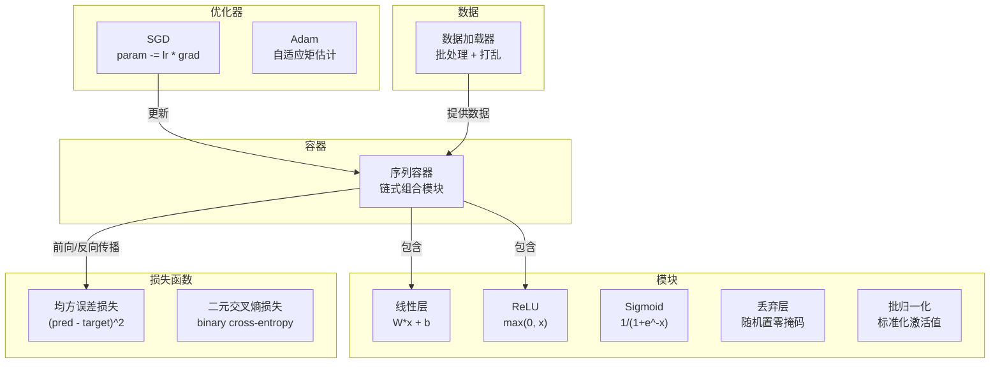
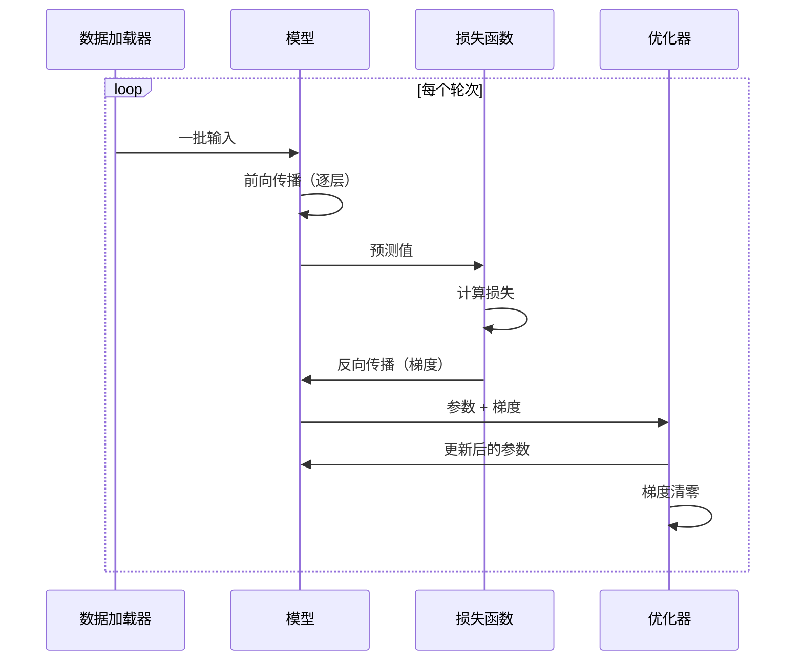
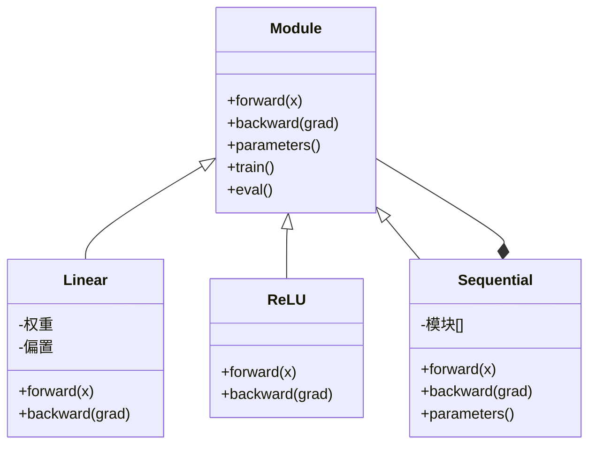

# 构建你自己的微型框架

> 你已经构建了神经元、层、网络、反向传播、激活函数、损失函数、优化器、正则化、初始化和学习率调度。所有这些都是独立的部件。现在将它们整合成一个框架。不是 PyTorch。不是 TensorFlow。是你自己的。

**类型：** 构建  
**语言：** Python  
**前置条件：** 阶段 03 的全部内容（课程 01-09）  
**时间：** 约 120 分钟

## 学习目标

- 构建一个完整的深度学习框架（约 500 行），包含模块（Module）、线性层（Linear）、ReLU、Sigmoid、丢弃（Dropout）、批归一化（BatchNorm）、序列容器（Sequential）、损失函数、优化器和数据加载器（DataLoader）
- 解释模块抽象（前向传播 forward、反向传播 backward、参数 parameters）以及为什么需要训练/评估模式切换
- 将所有组件连接成一个可工作的训练循环，用于在圆形分类任务上训练一个 4 层网络
- 将框架的每个组件映射到其 PyTorch 等价物（nn.Module、nn.Sequential、optim.Adam、DataLoader）

## 问题

你在十个课程中构建了散落在不同文件中的基础模块。一个 `Value` 类在这里，一个训练循环在那里，权重初始化在另一个文件，学习率调度又在另一个文件。要训练一个网络，你需要从五个不同的课程中复制粘贴，并手动将它们连接起来。

这恰恰是框架所解决的问题。PyTorch 提供了 `nn.Module`、`nn.Sequential`、`optim.Adam`、`DataLoader` 以及一个将它们结合起来的训练循环模式。TensorFlow 提供了 `keras.Layer`、`keras.Sequential`、`keras.optimizers.Adam`。这些并非魔法。它们是组织模式，使得定义、训练和评估网络成为可能，而无需每次都重新发明底层管道。

你将要构建同样的东西，用大约 500 行 Python 代码。没有 numpy。没有外部依赖。一个能够定义任何前馈网络、使用 SGD 或 Adam 进行训练、批量处理数据、应用丢弃和批归一化、使用任何激活函数以及调度学习率的框架。

完成后，你将确切理解在 PyTorch 中写下 `model = nn.Sequential(...)` 时发生了什么。你将理解为什么有 `model.train()` 和 `model.eval()`。你将理解为什么 `optimizer.zero_grad()` 是一个独立的调用。你将会理解所有这一切，因为你亲手构建了这一切。

## 概念

### 模块抽象

PyTorch 中的每一层都继承自 `nn.Module`。一个模块（Module）有三项职责：

1. **forward()** —— 给定输入，计算输出
2. **parameters()** —— 返回所有可训练权重
3. **backward()** —— 计算梯度（PyTorch 中由自动求导 autograd 处理，我们的框架中显式实现）

线性层是一个模块。ReLU 激活函数是一个模块。丢弃层是一个模块。批归一化层是一个模块。它们都有相同的接口。

### 序列容器（Sequential）

`nn.Sequential` 将模块链式组合。前向传播：数据依次通过模块 1、模块 2、模块 3。反向传播：反向遍历链。容器本身也是一个模块——它有 forward()、parameters() 和 backward()。这是组合模式：一个模块序列本身也是一个模块。

### 训练模式 vs 评估模式

丢弃（Dropout）在训练期间随机将神经元置零，但在评估期间全部通过。批归一化（BatchNorm）在训练期间使用批次统计量，但在评估期间使用运行平均值。`train()` 和 `eval()` 方法切换此行为。每个模块都有一个 `training` 标志。

### 优化器

优化器使用参数的梯度来更新参数。SGD：`param -= lr * grad`。Adam：维护动量和方差估计，然后更新。优化器不了解网络架构——它只看到一个扁平的参数列表及其梯度。

### 数据加载器

批处理（Batching）很重要，原因有二。首先，对于大规模问题，你无法将整个数据集放入内存。其次，小批量梯度下降提供了有助于逃离局部最小值的噪声。数据加载器将数据分成批次，并可选地在每个周期（epoch）间打乱数据。

### 框架架构



### 训练循环



### 模块层次结构



## 开始构建

### 第1步：模块基类

每一层都实现的抽象接口。

```python
class Module:
    def __init__(self):
        self.training = True

    def forward(self, x):
        raise NotImplementedError

    def backward(self, grad):
        raise NotImplementedError

    def parameters(self):
        return []

    def train(self):
        self.training = True

    def eval(self):
        self.training = False
```

### 第2步：线性层

最基本的构建块。存储权重和偏置，前向计算 Wx + b，反向计算权重梯度和输入梯度。

```python
import math
import random


class Linear(Module):
    def __init__(self, fan_in, fan_out):
        super().__init__()
        std = math.sqrt(2.0 / fan_in)
        self.weights = [[random.gauss(0, std) for _ in range(fan_in)] for _ in range(fan_out)]
        self.biases = [0.0] * fan_out
        self.weight_grads = [[0.0] * fan_in for _ in range(fan_out)]
        self.bias_grads = [0.0] * fan_out
        self.fan_in = fan_in
        self.fan_out = fan_out
        self.input = None

    def forward(self, x):
        self.input = x
        output = []
        for i in range(self.fan_out):
            val = self.biases[i]
            for j in range(self.fan_in):
                val += self.weights[i][j] * x[j]
            output.append(val)
        return output

    def backward(self, grad):
        input_grad = [0.0] * self.fan_in
        for i in range(self.fan_out):
            self.bias_grads[i] += grad[i]
            for j in range(self.fan_in):
                self.weight_grads[i][j] += grad[i] * self.input[j]
                input_grad[j] += grad[i] * self.weights[i][j]
        return input_grad

    def parameters(self):
        params = []
        for i in range(self.fan_out):
            for j in range(self.fan_in):
                params.append((self.weights, i, j, self.weight_grads))
            params.append((self.biases, i, None, self.bias_grads))
        return params
```

### 第3步：激活函数模块

ReLU、Sigmoid 和 Tanh 作为模块。每个模块缓存反向传播所需的内容。

```python
class ReLU(Module):
    def __init__(self):
        super().__init__()
        self.mask = None

    def forward(self, x):
        self.mask = [1.0 if v > 0 else 0.0 for v in x]
        return [max(0.0, v) for v in x]

    def backward(self, grad):
        return [g * m for g, m in zip(grad, self.mask)]


class Sigmoid(Module):
    def __init__(self):
        super().__init__()
        self.output = None

    def forward(self, x):
        self.output = []
        for v in x:
            v = max(-500, min(500, v))
            self.output.append(1.0 / (1.0 + math.exp(-v)))
        return self.output

    def backward(self, grad):
        return [g * o * (1 - o) for g, o in zip(grad, self.output)]


class Tanh(Module):
    def __init__(self):
        super().__init__()
        self.output = None

    def forward(self, x):
        self.output = [math.tanh(v) for v in x]
        return self.output

    def backward(self, grad):
        return [g * (1 - o * o) for g, o in zip(grad, self.output)]
```

### 第4步：丢弃模块

在训练期间随机将元素置零。将剩余元素缩放 1/(1-p) 以保持期望值不变。在评估期间不做任何操作。

```python
class Dropout(Module):
    def __init__(self, p=0.5):
        super().__init__()
        self.p = p
        self.mask = None

    def forward(self, x):
        if not self.training:
            return x
        self.mask = [0.0 if random.random() < self.p else 1.0 / (1 - self.p) for _ in x]
        return [v * m for v, m in zip(x, self.mask)]

    def backward(self, grad):
        if self.mask is None:
            return grad
        return [g * m for g, m in zip(grad, self.mask)]
```

### 第5步：批归一化模块

在批次间对每个特征的激活值进行标准化，使其均值为0、方差为1。在评估模式下维护运行统计量。

```python
class BatchNorm(Module):
    def __init__(self, size, momentum=0.1, eps=1e-5):
        super().__init__()
        self.size = size
        self.gamma = [1.0] * size
        self.beta = [0.0] * size
        self.gamma_grads = [0.0] * size
        self.beta_grads = [0.0] * size
        self.running_mean = [0.0] * size
        self.running_var = [1.0] * size
        self.momentum = momentum
        self.eps = eps
        self.x_norm = None
        self.std_inv = None
        self.batch_input = None

    def forward_batch(self, batch):
        batch_size = len(batch)
        output_batch = []

        if self.training:
            mean = [0.0] * self.size
            for sample in batch:
                for j in range(self.size):
                    mean[j] += sample[j]
            mean = [m / batch_size for m in mean]

            var = [0.0] * self.size
            for sample in batch:
                for j in range(self.size):
                    var[j] += (sample[j] - mean[j]) ** 2
            var = [v / batch_size for v in var]

            self.std_inv = [1.0 / math.sqrt(v + self.eps) for v in var]

            self.x_norm = []
            self.batch_input = batch
            for sample in batch:
                normed = [(sample[j] - mean[j]) * self.std_inv[j] for j in range(self.size)]
                self.x_norm.append(normed)
                output = [self.gamma[j] * normed[j] + self.beta[j] for j in range(self.size)]
                output_batch.append(output)

            for j in range(self.size):
                self.running_mean[j] = (1 - self.momentum) * self.running_mean[j] + self.momentum * mean[j]
                self.running_var[j] = (1 - self.momentum) * self.running_var[j] + self.momentum * var[j]
        else:
            std_inv = [1.0 / math.sqrt(v + self.eps) for v in self.running_var]
            for sample in batch:
                normed = [(sample[j] - self.running_mean[j]) * std_inv[j] for j in range(self.size)]
                output = [self.gamma[j] * normed[j] + self.beta[j] for j in range(self.size)]
                output_batch.append(output)

        return output_batch

    def forward(self, x):
        result = self.forward_batch([x])
        return result[0]

    def backward(self, grad):
        if self.x_norm is None:
            return grad
        for j in range(self.size):
            self.gamma_grads[j] += self.x_norm[0][j] * grad[j]
            self.beta_grads[j] += grad[j]
        return [grad[j] * self.gamma[j] * self.std_inv[j] for j in range(self.size)]

    def parameters(self):
        params = []
        for j in range(self.size):
            params.append((self.gamma, j, None,