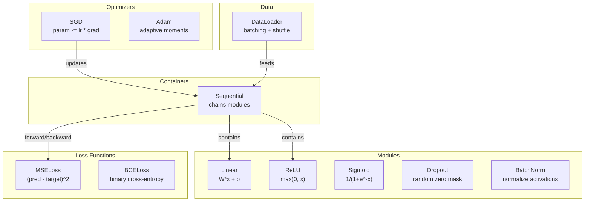
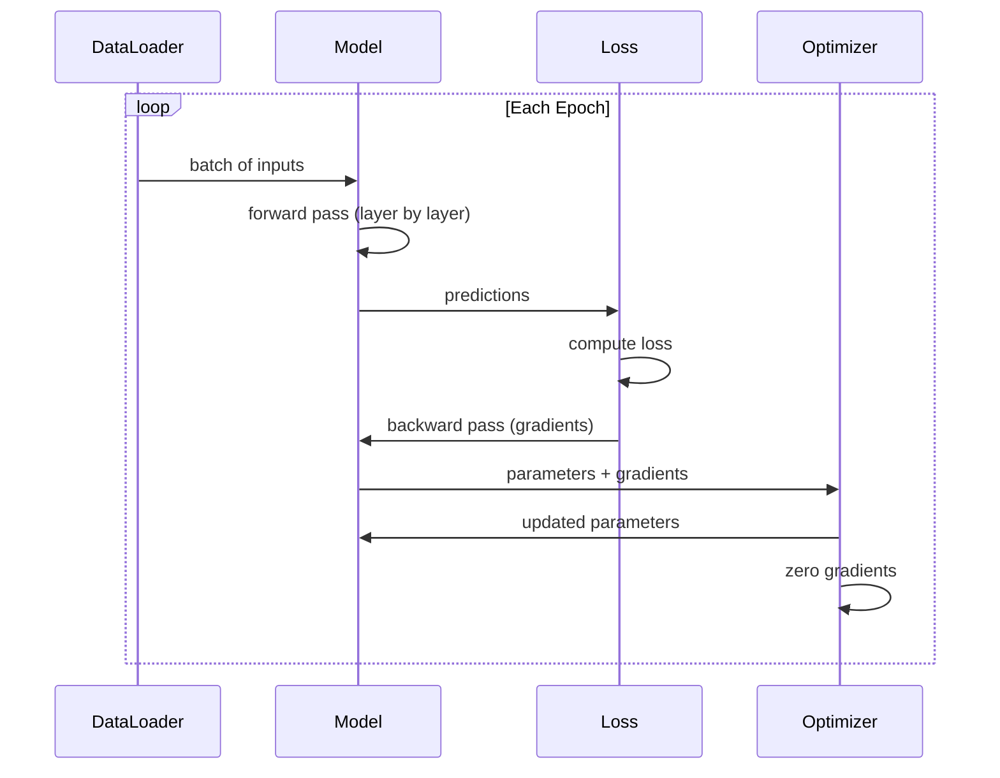
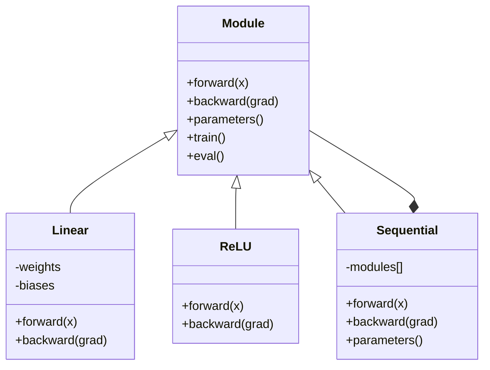

# 构建您自己的迷你框架

> 您已经构建了神经元、层、网络、反推、激活、损失函数、优化器、正规化、初始化和LR调度。所有这些都是独立的碎片。现在将它们连接到一个框架中。不是PyTorch。不是TensorFlow。你的了

** 类型：** 构建
** 语言：** Python
** 先决条件：** 所有阶段03（课程01-09）
** 时间：** ~120分钟

## 学习目标

- 使用模块、Linear、ReLU、Sigmoid、Dropout、BatchNorm、Sequential、损失函数、优化器和DataPlayer构建完整的深度学习框架（约500行）
- 解释模块抽象（前向、后向、参数）以及为什么需要进行训练/评估模式切换
- 将所有组件连接到工作训练循环中，该循环训练4层网络进行圆分类
- 将框架的每个组件映射到其PyTorch等效组件（nn. Mode、nn.Sequential、optim.Adam、DataPlayer）

## 问题

您有十个构建模块课程，这些课程分散在不同的文件中。这里有一个“值”类，那里有一个训练循环，另一个文件中的权重初始化，另一个文件中的学习率计划。为了训练网络，您需要复制粘贴五个不同的课程，并手工将它们连接在一起。

这就是框架解决的问题。PyTorch提供了`nn.Module`、`nn.Sequential`、`optim.Adam`、`DataLoader`以及将它们联系在一起的训练循环模式。TensorFlow提供了`keras.Layer`、`keras.Sequential`、`keras.optimizers.Adam`。这些不是魔法它们是组织模式，可以定义、训练和评估网络，而无需每次重新发明管道。

您将在~500行Python中构建同样的东西。没有麻木。没有外部依赖。一个框架，可以定义任何前向网络，使用BCD或Adam训练它，批量处理数据，应用丢弃和批量规范化，使用任何激活，并安排学习率。

完成后，您将确切地理解当您编写“模型= nn.Sequential（.）”时会发生什么在PyTorch中。您就会明白为什么存在“modal.train（）”和“modal.eval（）”。您就会明白为什么“optimizer.zero_grad（）”是一个单独的调用。你会理解这一切，因为这一切都是你建造的。

## 概念

### 模块抽象

PyTorch中的每个层都继承自“nn. Mode”。模块有三个职责：

1. **forward（）** --计算给定输入的输出
2. ** 参数（）** --返回所有可训练权重
3. **backward（）**-计算梯度（在PyTorch中由autograd处理，在我们的中是显式的）

线性层是一个模块。ReLU激活是一个模块。辍学层是一个模块。批量规范化层是一个模块。它们都有相同的界面。

### 顺序容器

' nn.顺序'链模块。向前传递：通过模块1、模块2、模块3输送数据。向后传球：逆转链条。容器本身是一个模块--它有forward（）、parallels（）和backward（）。这是复合模式：模块序列本身就是一个模块。

### 培训与评估模式

退出在训练期间随机将神经元归零，但在评估期间将所有内容传递出去。批量规范化在训练期间使用批量统计数据，但在评估期间运行平均值。' train（）'和' eval（）'方法会切换此行为。每个模块都有一个“训练”标志。

### 优化器

优化器使用参数的梯度更新参数。新元：“param -= lr * grad”。Adam：维护动量和方差估计，然后更新。优化器不了解网络架构--它只看到参数及其梯度的平坦列表。

### DataLoader

批量处理很重要，原因有两个。首先，您无法将整个数据集放入内存中以解决大型问题。其次，小批量梯度下降提供了有助于摆脱局部极小值的噪音。数据加载器将数据分为批次，并可以选择在时段之间洗牌。

### 框架架构



### 训练循环



### 模块层次



## 建设党

### 第1步：模块基本类

每一层实现的抽象接口。

```python
class Module:
    def __init__(self):
        self.training = True

    def forward(self, x):
        raise NotImplementedError

    def backward(self, grad):
        raise NotImplementedError

    def parameters(self):
        return []

    def train(self):
        self.training = True

    def eval(self):
        self.training = False
```

### 第2步：线性层

基本的构建模块。存储权重和偏差，向前计算Wx + b，向后计算权重/输入梯度。

```python
import math
import random


class Linear(Module):
    def __init__(self, fan_in, fan_out):
        super().__init__()
        std = math.sqrt(2.0 / fan_in)
        self.weights = [[random.gauss(0, std) for _ in range(fan_in)] for _ in range(fan_out)]
        self.biases = [0.0] * fan_out
        self.weight_grads = [[0.0] * fan_in for _ in range(fan_out)]
        self.bias_grads = [0.0] * fan_out
        self.fan_in = fan_in
        self.fan_out = fan_out
        self.input = None

    def forward(self, x):
        self.input = x
        output = []
        for i in range(self.fan_out):
            val = self.biases[i]
            for j in range(self.fan_in):
                val += self.weights[i][j] * x[j]
            output.append(val)
        return output

    def backward(self, grad):
        input_grad = [0.0] * self.fan_in
        for i in range(self.fan_out):
            self.bias_grads[i] += grad[i]
            for j in range(self.fan_in):
                self.weight_grads[i][j] += grad[i] * self.input[j]
                input_grad[j] += grad[i] * self.weights[i][j]
        return input_grad

    def parameters(self):
        params = []
        for i in range(self.fan_out):
            for j in range(self.fan_in):
                params.append((self.weights, i, j, self.weight_grads))
            params.append((self.biases, i, None, self.bias_grads))
        return params
```

### 第3步：激活模块

ReLU、Sigmoid和Tanh作为模块。每个都缓存向后传递所需的内容。

```python
class ReLU(Module):
    def __init__(self):
        super().__init__()
        self.mask = None

    def forward(self, x):
        self.mask = [1.0 if v > 0 else 0.0 for v in x]
        return [max(0.0, v) for v in x]

    def backward(self, grad):
        return [g * m for g, m in zip(grad, self.mask)]


class Sigmoid(Module):
    def __init__(self):
        super().__init__()
        self.output = None

    def forward(self, x):
        self.output = []
        for v in x:
            v = max(-500, min(500, v))
            self.output.append(1.0 / (1.0 + math.exp(-v)))
        return self.output

    def backward(self, grad):
        return [g * o * (1 - o) for g, o in zip(grad, self.output)]


class Tanh(Module):
    def __init__(self):
        super().__init__()
        self.output = None

    def forward(self, x):
        self.output = [math.tanh(v) for v in x]
        return self.output

    def backward(self, grad):
        return [g * (1 - o * o) for g, o in zip(grad, self.output)]
```

### 第4步：辍学模块

训练期间随机将元素归零。将剩余元素按1/（1-p）缩放，以便预期值保持不变。评估期间不做任何事情。

```python
class Dropout(Module):
    def __init__(self, p=0.5):
        super().__init__()
        self.p = p
        self.mask = None

    def forward(self, x):
        if not self.training:
            return x
        self.mask = [0.0 if random.random() < self.p else 1.0 / (1 - self.p) for _ in x]
        return [v * m for v, m in zip(x, self.mask)]

    def backward(self, grad):
        if self.mask is None:
            return grad
        return [g * m for g, m in zip(grad, self.mask)]
```

### 第5步：BatchNorm模块

将批次中每个要素的激活标准化为零均值和单位方差。维护评估模式的运行统计信息。

```python
class BatchNorm(Module):
    def __init__(self, size, momentum=0.1, eps=1e-5):
        super().__init__()
        self.size = size
        self.gamma = [1.0] * size
        self.beta = [0.0] * size
        self.gamma_grads = [0.0] * size
        self.beta_grads = [0.0] * size
        self.running_mean = [0.0] * size
        self.running_var = [1.0] * size
        self.momentum = momentum
        self.eps = eps
        self.x_norm = None
        self.std_inv = None
        self.batch_input = None

    def forward_batch(self, batch):
        batch_size = len(batch)
        output_batch = []

        if self.training:
            mean = [0.0] * self.size
            for sample in batch:
                for j in range(self.size):
                    mean[j] += sample[j]
            mean = [m / batch_size for m in mean]

            var = [0.0] * self.size
            for sample in batch:
                for j in range(self.size):
                    var[j] += (sample[j] - mean[j]) ** 2
            var = [v / batch_size for v in var]

            self.std_inv = [1.0 / math.sqrt(v + self.eps) for v in var]

            self.x_norm = []
            self.batch_input = batch
            for sample in batch:
                normed = [(sample[j] - mean[j]) * self.std_inv[j] for j in range(self.size)]
                self.x_norm.append(normed)
                output = [self.gamma[j] * normed[j] + self.beta[j] for j in range(self.size)]
                output_batch.append(output)

            for j in range(self.size):
                self.running_mean[j] = (1 - self.momentum) * self.running_mean[j] + self.momentum * mean[j]
                self.running_var[j] = (1 - self.momentum) * self.running_var[j] + self.momentum * var[j]
        else:
            std_inv = [1.0 / math.sqrt(v + self.eps) for v in self.running_var]
            for sample in batch:
                normed = [(sample[j] - self.running_mean[j]) * std_inv[j] for j in range(self.size)]
                output = [self.gamma[j] * normed[j] + self.beta[j] for j in range(self.size)]
                output_batch.append(output)

        return output_batch

    def forward(self, x):
        result = self.forward_batch([x])
        return result[0]

    def backward(self, grad):
        if self.x_norm is None:
            return grad
        for j in range(self.size):
            self.gamma_grads[j] += self.x_norm[0][j] * grad[j]
            self.beta_grads[j] += grad[j]
        return [grad[j] * self.gamma[j] * self.std_inv[j] for j in range(self.size)]

    def parameters(self):
        params = []
        for j in range(self.size):
            params.append((self.gamma, j, None, self.gamma_grads))
            params.append((self.beta, j, None, self.beta_grads))
        return params
```

### 第6步：顺序容器

链条模块。向前从左到右，向后从右到左。

```python
class Sequential(Module):
    def __init__(self, *modules):
        super().__init__()
        self.modules = list(modules)

    def forward(self, x):
        for module in self.modules:
            x = module.forward(x)
        return x

    def backward(self, grad):
        for module in reversed(self.modules):
            grad = module.backward(grad)
        return grad

    def parameters(self):
        params = []
        for module in self.modules:
            params.extend(module.parameters())
        return params

    def train(self):
        self.training = True
        for module in self.modules:
            module.train()

    def eval(self):
        self.training = False
        for module in self.modules:
            module.eval()
```

### 第7步：损失函数

均方误差和二元交叉熵。每个都返回损失值并提供返回梯度的向后（）。

```python
class MSELoss:
    def __call__(self, predicted, target):
        self.predicted = predicted
        self.target = target
        n = len(predicted)
        self.loss = sum((p - t) ** 2 for p, t in zip(predicted, target)) / n
        return self.loss

    def backward(self):
        n = len(self.predicted)
        return [2 * (p - t) / n for p, t in zip(self.predicted, self.target)]


class BCELoss:
    def __call__(self, predicted, target):
        self.predicted = predicted
        self.target = target
        eps = 1e-7
        n = len(predicted)
        self.loss = 0
        for p, t in zip(predicted, target):
            p = max(eps, min(1 - eps, p))
            self.loss += -(t * math.log(p) + (1 - t) * math.log(1 - p))
        self.loss /= n
        return self.loss

    def backward(self):
        eps = 1e-7
        n = len(self.predicted)
        grads = []
        for p, t in zip(self.predicted, self.target):
            p = max(eps, min(1 - eps, p))
            grads.append((-t / p + (1 - t) / (1 - p)) / n)
        return grads
```

### 第8步：新元和Adam优化器

两者都采用参数列表并使用梯度更新权重。

```python
class SGD:
    def __init__(self, parameters, lr=0.01):
        self.params = parameters
        self.lr = lr

    def step(self):
        for container, i, j, grad_container in self.params:
            if j is not None:
                container[i][j] -= self.lr * grad_container[i][j]
            else:
                container[i] -= self.lr * grad_container[i]

    def zero_grad(self):
        for container, i, j, grad_container in self.params:
            if j is not None:
                grad_container[i][j] = 0.0
            else:
                grad_container[i] = 0.0


class Adam:
    def __init__(self, parameters, lr=0.001, beta1=0.9, beta2=0.999, eps=1e-8):
        self.params = parameters
        self.lr = lr
        self.beta1 = beta1
        self.beta2 = beta2
        self.eps = eps
        self.t = 0
        self.m = [0.0] * len(parameters)
        self.v = [0.0] * len(parameters)

    def step(self):
        self.t += 1
        for idx, (container, i, j, grad_container) in enumerate(self.params):
            if j is not None:
                g = grad_container[i][j]
            else:
                g = grad_container[i]

            self.m[idx] = self.beta1 * self.m[idx] + (1 - self.beta1) * g
            self.v[idx] = self.beta2 * self.v[idx] + (1 - self.beta2) * g * g

            m_hat = self.m[idx] / (1 - self.beta1 ** self.t)
            v_hat = self.v[idx] / (1 - self.beta2 ** self.t)

            update = self.lr * m_hat / (math.sqrt(v_hat) + self.eps)

            if j is not None:
                container[i][j] -= update
            else:
                container[i] -= update

    def zero_grad(self):
        for container, i, j, grad_container in self.params:
            if j is not None:
                grad_container[i][j] = 0.0
            else:
                grad_container[i] = 0.0
```

### 第9步：数据加载器

将数据拆分为批次，可以选择对每个纪元进行洗牌。

```python
class DataLoader:
    def __init__(self, data, batch_size=32, shuffle=True):
        self.data = data
        self.batch_size = batch_size
        self.shuffle = shuffle

    def __iter__(self):
        indices = list(range(len(self.data)))
        if self.shuffle:
            random.shuffle(indices)
        for start in range(0, len(indices), self.batch_size):
            batch_indices = indices[start:start + self.batch_size]
            batch = [self.data[i] for i in batch_indices]
            inputs = [item[0] for item in batch]
            targets = [item[1] for item in batch]
            yield inputs, targets

    def __len__(self):
        return (len(self.data) + self.batch_size - 1) // self.batch_size
```

### 第10步：根据圈分类训练4层网络

将所有东西都连接在一起。定义模型、选择损失、选择优化器、运行训练循环。

```python
def make_circle_data(n=500, seed=42):
    random.seed(seed)
    data = []
    for _ in range(n):
        x = random.uniform(-2, 2)
        y = random.uniform(-2, 2)
        label = 1.0 if x * x + y * y < 1.5 else 0.0
        data.append(([x, y], [label]))
    return data


def train():
    random.seed(42)

    model = Sequential(
        Linear(2, 16),
        ReLU(),
        Linear(16, 16),
        ReLU(),
        Linear(16, 8),
        ReLU(),
        Linear(8, 1),
        Sigmoid(),
    )

    criterion = BCELoss()
    optimizer = Adam(model.parameters(), lr=0.01)

    data = make_circle_data(500)
    split = int(len(data) * 0.8)
    train_data = data[:split]
    test_data = data[split:]

    loader = DataLoader(train_data, batch_size=16, shuffle=True)

    model.train()

    for epoch in range(100):
        total_loss = 0
        total_correct = 0
        total_samples = 0

        for batch_inputs, batch_targets in loader:
            batch_loss = 0
            for x, t in zip(batch_inputs, batch_targets):
                pred = model.forward(x)
                loss = criterion(pred, t)
                batch_loss += loss

                optimizer.zero_grad()
                grad = criterion.backward()
                model.backward(grad)
                optimizer.step()

                predicted_class = 1.0 if pred[0] >= 0.5 else 0.0
                if predicted_class == t[0]:
                    total_correct += 1
                total_samples += 1

            total_loss += batch_loss

        avg_loss = total_loss / total_samples
        accuracy = total_correct / total_samples * 100

        if epoch % 10 == 0 or epoch == 99:
            print(f"Epoch {epoch:3d} | Loss: {avg_loss:.6f} | Train Accuracy: {accuracy:.1f}%")

    model.eval()
    correct = 0
    for x, t in test_data:
        pred = model.forward(x)
        predicted_class = 1.0 if pred[0] >= 0.5 else 0.0
        if predicted_class == t[0]:
            correct += 1
    test_accuracy = correct / len(test_data) * 100
    print(f"\nTest Accuracy: {test_accuracy:.1f}% ({correct}/{len(test_data)})")

    return model, test_accuracy
```

## 使用它

这是您刚刚构建的PyTorch等效内容：

```python
import torch
import torch.nn as nn
from torch.utils.data import DataLoader, TensorDataset

model = nn.Sequential(
    nn.Linear(2, 16),
    nn.ReLU(),
    nn.Linear(16, 16),
    nn.ReLU(),
    nn.Linear(16, 8),
    nn.ReLU(),
    nn.Linear(8, 1),
    nn.Sigmoid(),
)

criterion = nn.BCELoss()
optimizer = torch.optim.Adam(model.parameters(), lr=0.01)

for epoch in range(100):
    model.train()
    for inputs, targets in dataloader:
        optimizer.zero_grad()
        predictions = model(inputs)
        loss = criterion(predictions, targets)
        loss.backward()
        optimizer.step()

    model.eval()
    with torch.no_grad():
        test_predictions = model(test_inputs)
```

结构相同。“顺序”、“线性”、“ReLU”、“Sigmoid”、“BCELoss”、“Adam”、“zero_grad”、“backward”、“Step”、“train”、“eval”。每个概念都一一映射。不同之处在于PyTorch自动处理autograd（无需在每个模块中实现向后（）），在图形处理器上运行，并且经过多年优化。但骨头是一样的。

现在，当您看到PyTorch代码时，您可以确切地知道每一行发生了什么。这种理解才是重点。

## 把它运

本课产生：
- '输出/prompt-framework-architect.md '--使用框架抽象设计神经网络架构的提示

## 演习

1. 添加“SoftmaCrossEntropyLoss”类进行多类分类。Softmax预测、计算交叉熵损失并处理组合后向传递。在3级螺旋数据集上测试它。

2. 在优化器中实现学习率调度：添加一个“set_lr（）”方法并连接到第09课的cos调度中。使用热身+cos训练圆分类器，并与恒定LR进行比较。

3. 将“Save（）”和“log（）”方法添加到Sequential，该方法将所有权重序列化到一个杨森文件并将它们加载回。验证加载的模型是否产生与原始模型相同的预测。

4. 在Adam优化器中实现权重衰减（L2正规化）。添加一个“weight_decay”参数，可以将每一步权重缩小为零。比较衰变=0与衰变=0.01的训练。

5. 用适当的小批量梯度累积替换每个样本的训练循环：累积一个批次中所有样本的梯度，然后除以批次大小并执行一个优化器步骤。测量这是否会改变收敛速度。

## 关键术语

| Term | 别人怎么说 | 它实际上意味着什么 |
|------|----------------|----------------------|
| 模块 | “一层” | 框架中的基本抽象--任何带有forward（）、backward（）和parents（）的东西 |
| 顺序 | “按顺序堆叠层” | 一个链接模块的容器，按顺序向前应用它们，反向应用它们 |
| 向前传球 | “运行网络” | Computing the output by passing input through each module in order |
| Backward pass | “计算梯度” | 反向叠加每个模块的损失梯度以计算参数梯度 |
| 参数 | “可训练的重量” | 网络中优化器可以更新的所有值--权重和偏差 |
| 优化器 | “更新权重的东西” | 一种使用梯度更新参数、实现Singapore、Adam或其他规则的算法 |
| DataLoader | “提供数据的东西” | 一个迭代器，将数据集拆分为批次，可以选择在历元之间洗牌 |
| 培养模式 | “型号.train（）” | 一个标志，支持随机行为，例如丢弃和使用批统计数据的批规范化 |
| 评价模式 | “模型.eval（）” | 禁用退出并使用运行统计数据进行批量规范化的标志 |
| 零年级 | “清除梯度” | 在计算下一批的梯度之前将所有参数梯度重置为零 |

## 进一步阅读

- Paszke等人，“PyTorch：强制风格、高性能深度学习库”（2019）--描述PyTorch设计决策的论文
- Chollet，“Python深度学习，第二版”（2021年）--第3章涵盖Keras内部结构，具有相同的模块/层抽象
- Johnson，“Tiny-DNN”（https：//github.com/tiny-dnn/tiny-dnn）--一个仅限头部的C++深度学习框架，用于理解框架内部内容
