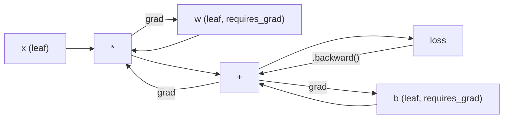
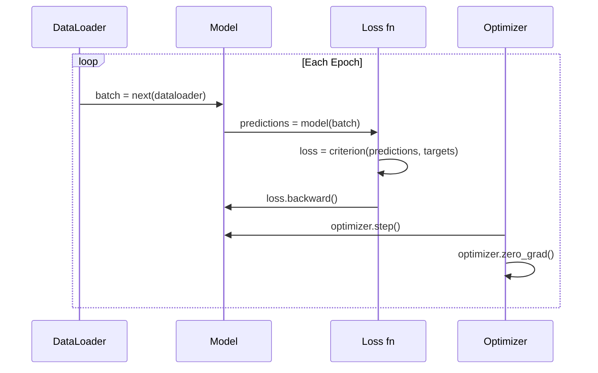

# PyTorch 入門

> あなたは pistons と crankshafts から engine を作りました。今度は、実際に誰もが運転しているものを学びます。

**種類:** Build
**言語:** Python
**前提:** Lesson 03.10 (Build Your Own Mini Framework)
**時間:** 約 75 分

## 学習目標

- PyTorch の nn.Module、nn.Sequential、autograd を使って neural networks を構築し、学習する
- PyTorch tensors、GPU acceleration、標準 training loop（zero_grad、forward、loss、backward、step）を使う
- ゼロから作った mini framework components を PyTorch equivalents に変換する
- 同じ task で pure-Python framework と PyTorch の training speed を profile して比較する

## 問題

あなたには動く mini framework があります。Linear layers、ReLU、dropout、batch norm、Adam、DataLoader、training loop。pure Python で circle classification problem の 4-layer network を学習できます。

ただし、同じ問題では PyTorch より 500 倍遅いです。

mini framework は nested Python loops で 1 sample ずつ処理します。PyTorch は同じ operations を、GPU 上で動く optimized C++/CUDA kernels に dispatch します。単一の NVIDIA A100 では、PyTorch は ImageNet（1.28M images）上で ResNet-50（25.6M parameters）を約 6 時間で学習します。あなたの framework で同じ task を行うと、memory が先に尽きなければ、およそ 3,000 時間かかります。

差は速度だけではありません。あなたの framework には GPU support がありません。automatic differentiation もありません。すべての module に backward() を手書きしました。serialization もありません。distributed training もありません。mixed precision もありません。print statements なしに gradient flow を debug する手段もありません。

PyTorch はこれらの gap をすべて埋めます。しかも、あなたがすでに作った mental model と同じものを保ったままです。Module、forward()、parameters()、backward()、optimizer.step()。概念は 1 対 1 で移行できます。syntax もほぼ同じです。違いは、PyTorch が decade of systems engineering を、あなたがゼロから設計したものと同じ interface の裏に包んでいることです。

## 概念

### PyTorch が勝った理由

2015 年の TensorFlow では、何かを実行する前に static computation graph を定義する必要がありました。graph を作り、compile し、そこに data を流し込みます。debugging は graph visualizations とにらめっこすることでした。architecture を変えるには graph をゼロから作り直す必要がありました。

PyTorch は 2017 年に異なる哲学で登場しました。eager execution です。Python を書けば、すぐに実行されます。`y = model(x)` は「後で y を計算する node を graph に追加する」のではなく、今この場で実際に y を計算します。これにより標準の Python debugging tools が使えました。print() が動きました。pdb が動きました。forward pass の if/else が動きました。

2020 年までに市場の答えは出ていました。ML research papers における PyTorch の share は、7%（2017）から 75% 超（2022）へ増えました。Meta、Google DeepMind、OpenAI、Anthropic、Hugging Face はすべて PyTorch を primary framework として使っています。TensorFlow 2.x はこれに応えて eager execution を採用しました。これは PyTorch の design が正しかったことを暗に認めたものです。

教訓: developer experience は複利で効きます。10% 遅くても debug が 50% 速い framework は、毎回勝ちます。

### Tensors

tensor は、shape、dtype、device という 3 つの重要な properties を持つ multi-dimensional array です。

```python
import torch

x = torch.zeros(3, 4)           # shape: (3, 4), dtype: float32, device: cpu
x = torch.randn(2, 3, 224, 224) # batch of 2 RGB images, 224x224
x = torch.tensor([1, 2, 3])     # from a Python list
```

**Shape** は dimensionality です。scalar は shape ()、vector は (n,)、matrix は (m, n)、images の batch は (batch, channels, height, width) です。

**Dtype** は precision と memory を制御します。

| dtype | Bits | Range | Use case |
|-------|------|-------|----------|
| float32 | 32 | 約 7 decimal digits | Default training |
| float16 | 16 | 約 3.3 decimal digits | Mixed precision |
| bfloat16 | 16 | float32 と同じ range、低い precision | LLM training |
| int8 | 8 | -128 to 127 | Quantized inference |

**Device** は computation がどこで起きるかを決めます。

```python
device = torch.device("cuda" if torch.cuda.is_available() else "cpu")
x = torch.randn(3, 4, device=device)
x = x.to("cuda")
x = x.cpu()
```

すべての operation では、関連する tensors が同じ device 上にある必要があります。これは beginner が最もよく遭遇する PyTorch error です: `RuntimeError: Expected all tensors to be on the same device`。computation の前にすべてを同じ device へ移すことで直します。

**Reshaping** は constant-time です。data ではなく metadata を変えるだけです。

```python
x = torch.randn(2, 3, 4)
x.view(2, 12)      # reshape to (2, 12) -- must be contiguous
x.reshape(6, 4)    # reshape to (6, 4) -- works always
x.permute(2, 0, 1) # reorder dimensions
x.unsqueeze(0)     # add dimension: (1, 2, 3, 4)
x.squeeze()        # remove size-1 dimensions
```

### Autograd

mini framework では、すべての module に backward() を実装する必要がありました。PyTorch では不要です。PyTorch は tensors に対するすべての operation を directed acyclic graph（computational graph）として記録し、その graph を逆向きにたどって gradients を自動計算します。



あなたの framework との重要な違い: PyTorch は tape-based autodiff を使います。forward pass 中のすべての operation が「tape」に追加されます。`.backward()` を呼ぶと、tape を逆向きに再生します。

```python
x = torch.randn(3, requires_grad=True)
y = x ** 2 + 3 * x
z = y.sum()
z.backward()
print(x.grad)  # dz/dx = 2x + 3
```

autograd の 3 つのルール:

1. `requires_grad=True` の leaf tensors だけが gradients を蓄積する
2. gradients は default で蓄積されるため、各 backward pass の前に `optimizer.zero_grad()` を呼ぶ
3. `torch.no_grad()` は gradient tracking を無効化する（evaluation 中に使う）

### nn.Module

`nn.Module` は PyTorch におけるすべての neural network component の base class です。あなたは Lesson 10 でこの abstraction をすでに作りました。PyTorch 版は automatic parameter registration、recursive module discovery、device management、state dict serialization を追加しています。

```python
import torch.nn as nn

class MLP(nn.Module):
    def __init__(self, input_dim, hidden_dim, output_dim):
        super().__init__()
        self.layer1 = nn.Linear(input_dim, hidden_dim)
        self.relu = nn.ReLU()
        self.layer2 = nn.Linear(hidden_dim, output_dim)

    def forward(self, x):
        x = self.layer1(x)
        x = self.relu(x)
        x = self.layer2(x)
        return x
```

`__init__` の中で `nn.Module` または `nn.Parameter` を attribute として割り当てると、PyTorch はそれを自動的に register します。`model.parameters()` は登録されたすべての parameter を recursively に集めます。mini framework のように手動で weights を集めなくてよいのはこのためです。

主要な building blocks:

| Module | 何をするか | Parameters |
|--------|-------------|------------|
| nn.Linear(in, out) | Wx + b | in*out + out |
| nn.Conv2d(in_ch, out_ch, k) | 2D convolution | in_ch*out_ch*k*k + out_ch |
| nn.BatchNorm1d(features) | activations を正規化する | 2 * features |
| nn.Dropout(p) | random zeroing | 0 |
| nn.ReLU() | max(0, x) | 0 |
| nn.GELU() | Gaussian error linear | 0 |
| nn.Embedding(vocab, dim) | lookup table | vocab * dim |
| nn.LayerNorm(dim) | per-sample normalization | 2 * dim |

### Loss Functions and Optimizers

PyTorch には、あなたが作ったものの production-ready 版が含まれています。

**Loss functions**（`torch.nn` から）:

| Loss | Task | Input |
|------|------|-------|
| nn.MSELoss() | Regression | 任意の shape |
| nn.CrossEntropyLoss() | Multi-class classification | Logits（softmax ではない） |
| nn.BCEWithLogitsLoss() | Binary classification | Logits（sigmoid ではない） |
| nn.L1Loss() | Regression（robust） | 任意の shape |
| nn.CTCLoss() | Sequence alignment | Log probabilities |

注意: `CrossEntropyLoss` は内部で `LogSoftmax` + `NLLLoss` を組み合わせています。softmax outputs ではなく raw logits を渡してください。これは wrong gradients を静かに生むよくある mistake です。

**Optimizers**（`torch.optim` から）:

| Optimizer | いつ使うか | Typical LR |
|-----------|-------------|-----------|
| SGD(params, lr, momentum) | CNNs、よく tuning された pipelines | 0.01--0.1 |
| Adam(params, lr) | Default starting point | 1e-3 |
| AdamW(params, lr, weight_decay) | Transformers、fine-tuning | 1e-4--1e-3 |
| LBFGS(params) | Small-scale、second-order | 1.0 |

### Training Loop

すべての PyTorch training loop は同じ 5-step pattern に従います。Lesson 10 ですでに知っているものです。



標準 pattern:

```python
for epoch in range(num_epochs):
    model.train()
    for inputs, targets in train_loader:
        inputs, targets = inputs.to(device), targets.to(device)
        optimizer.zero_grad()
        outputs = model(inputs)
        loss = criterion(outputs, targets)
        loss.backward()
        optimizer.step()
```

batch loop の中は 5 行です。GPT-4、Stable Diffusion、LLaMA を学習した 5 行です。architecture は変わります。data も変わります。この 5 行は変わりません。

### Dataset and DataLoader

PyTorch の `Dataset` は、`__len__` と `__getitem__` という 2 つの methods を持つ abstract class です。`DataLoader` はこれに batching、shuffling、multi-process data loading を追加します。

```python
from torch.utils.data import Dataset, DataLoader

class MNISTDataset(Dataset):
    def __init__(self, images, labels):
        self.images = images
        self.labels = labels

    def __len__(self):
        return len(self.labels)

    def __getitem__(self, idx):
        return self.images[idx], self.labels[idx]

loader = DataLoader(dataset, batch_size=64, shuffle=True, num_workers=4)
```

`num_workers=4` は、GPU が current batch を学習している間に data を並列に load する 4 processes を起動します。disk-bound workloads（大きな images、audio）では、これだけで training speed が 2 倍になることがあります。

### GPU Training

model を GPU へ移す:

```python
device = torch.device("cuda" if torch.cuda.is_available() else "cpu")
model = model.to(device)
```

これはすべての parameters と buffers を recursively に GPU へ移します。その後、training 中に各 batch も移します。

```python
inputs, targets = inputs.to(device), targets.to(device)
```

**Mixed precision** は、modern GPUs（A100、H100、RTX 4090）で forward/backward を float16 で実行し、master weights を float32 に保つことで、memory usage を半分にし、throughput を 2 倍にします。

```python
from torch.amp import autocast, GradScaler

scaler = GradScaler()
for inputs, targets in loader:
    with autocast(device_type="cuda"):
        outputs = model(inputs)
        loss = criterion(outputs, targets)
    scaler.scale(loss).backward()
    scaler.step(optimizer)
    scaler.update()
    optimizer.zero_grad()
```

### Comparison: Mini Framework vs PyTorch vs JAX

| Feature | Mini Framework (L10) | PyTorch | JAX |
|---------|---------------------|---------|-----|
| Autodiff | 手動 backward() | Tape-based autograd | Functional transforms |
| Execution | Eager（Python loops） | Eager（C++ kernels） | Traced + JIT compiled |
| GPU support | なし | あり（CUDA、ROCm、MPS） | あり（CUDA、TPU） |
| Speed (MNIST MLP) | ~300s/epoch | ~0.5s/epoch | ~0.3s/epoch |
| Module system | Custom Module class | nn.Module | Stateless functions（Flax/Equinox） |
| Debugging | print() | print(), pdb, breakpoint() | 難しい（JIT tracing が print を壊す） |
| Ecosystem | なし | Hugging Face、Lightning、timm | Flax、Optax、Orbax |
| Learning curve | 自分で作った | 中程度 | 急（functional paradigm） |
| Production use | toy problems | Meta、OpenAI、Anthropic、HF | Google DeepMind、Midjourney |

## 作ってみる

PyTorch primitives だけを使って MNIST で学習する 3-layer MLP です。high-level wrappers は使いません。`torchvision.datasets` も使いません。raw data を自分で download して parse します。

### Step 1: Raw Files から MNIST を Load する

MNIST は 4 つの gzipped files として配布されています: training images（60,000 x 28 x 28）、training labels、test images（10,000 x 28 x 28）、test labels。これらを download し、binary format を parse します。

```python
import torch
import torch.nn as nn
import struct
import gzip
import urllib.request
import os

def download_mnist(path="./mnist_data"):
    base_url = "https://storage.googleapis.com/cvdf-datasets/mnist/"
    files = [
        "train-images-idx3-ubyte.gz",
        "train-labels-idx1-ubyte.gz",
        "t10k-images-idx3-ubyte.gz",
        "t10k-labels-idx1-ubyte.gz",
    ]
    os.makedirs(path, exist_ok=True)
    for f in files:
        filepath = os.path.join(path, f)
        if not os.path.exists(filepath):
            urllib.request.urlretrieve(base_url + f, filepath)

def load_images(filepath):
    with gzip.open(filepath, "rb") as f:
        magic, num, rows, cols = struct.unpack(">IIII", f.read(16))
        data = f.read()
        images = torch.frombuffer(bytearray(data), dtype=torch.uint8)
        images = images.reshape(num, rows * cols).float() / 255.0
    return images

def load_labels(filepath):
    with gzip.open(filepath, "rb") as f:
        magic, num = struct.unpack(">II", f.read(8))
        data = f.read()
        labels = torch.frombuffer(bytearray(data), dtype=torch.uint8).long()
    return labels
```

### Step 2: Model を定義する

3-layer MLP: 784 -> 256 -> 128 -> 10。ReLU activations。regularization のための Dropout。単純さを保つため batch norm は使いません。

```python
class MNISTModel(nn.Module):
    def __init__(self):
        super().__init__()
        self.net = nn.Sequential(
            nn.Linear(784, 256),
            nn.ReLU(),
            nn.Dropout(0.2),
            nn.Linear(256, 128),
            nn.ReLU(),
            nn.Dropout(0.2),
            nn.Linear(128, 10),
        )

    def forward(self, x):
        return self.net(x)
```

output layer は 10 個の raw logits（digit ごとに 1 つ）を出します。softmax は不要です。`CrossEntropyLoss` が内部で処理します。

Parameter count: 784*256 + 256 + 256*128 + 128 + 128*10 + 10 = 235,146。現代の基準では非常に小さいです。GPT-2 small は 124M です。これは数秒で学習できます。

### Step 3: Training Loop

標準的な forward-loss-backward-step pattern です。

```python
def train_one_epoch(model, loader, criterion, optimizer, device):
    model.train()
    total_loss = 0
    correct = 0
    total = 0
    for images, labels in loader:
        images, labels = images.to(device), labels.to(device)
        optimizer.zero_grad()
        outputs = model(images)
        loss = criterion(outputs, labels)
        loss.backward()
        optimizer.step()
        total_loss += loss.item() * images.size(0)
        _, predicted = outputs.max(1)
        correct += predicted.eq(labels).sum().item()
        total += labels.size(0)
    return total_loss / total, correct / total


def evaluate(model, loader, criterion, device):
    model.eval()
    total_loss = 0
    correct = 0
    total = 0
    with torch.no_grad():
        for images, labels in loader:
            images, labels = images.to(device), labels.to(device)
            outputs = model(images)
            loss = criterion(outputs, labels)
            total_loss += loss.item() * images.size(0)
            _, predicted = outputs.max(1)
            correct += predicted.eq(labels).sum().item()
            total += labels.size(0)
    return total_loss / total, correct / total
```

evaluation 中の `torch.no_grad()` に注目してください。これは autograd を無効化し、memory usage を下げ、inference を速くします。これがないと、PyTorch は使わない computational graph を構築します。

### Step 4: すべてを接続する

```python
def main():
    device = torch.device("cuda" if torch.cuda.is_available() else "cpu")

    download_mnist()
    train_images = load_images("./mnist_data/train-images-idx3-ubyte.gz")
    train_labels = load_labels("./mnist_data/train-labels-idx1-ubyte.gz")
    test_images = load_images("./mnist_data/t10k-images-idx3-ubyte.gz")
    test_labels = load_labels("./mnist_data/t10k-labels-idx1-ubyte.gz")

    train_dataset = torch.utils.data.TensorDataset(train_images, train_labels)
    test_dataset = torch.utils.data.TensorDataset(test_images, test_labels)
    train_loader = torch.utils.data.DataLoader(
        train_dataset, batch_size=64, shuffle=True
    )
    test_loader = torch.utils.data.DataLoader(
        test_dataset, batch_size=256, shuffle=False
    )

    model = MNISTModel().to(device)
    criterion = nn.CrossEntropyLoss()
    optimizer = torch.optim.Adam(model.parameters(), lr=1e-3)

    num_params = sum(p.numel() for p in model.parameters())
    print(f"Device: {device}")
    print(f"Parameters: {num_params:,}")
    print(f"Train samples: {len(train_dataset):,}")
    print(f"Test samples: {len(test_dataset):,}")
    print()

    for epoch in range(10):
        train_loss, train_acc = train_one_epoch(
            model, train_loader, criterion, optimizer, device
        )
        test_loss, test_acc = evaluate(
            model, test_loader, criterion, device
        )
        print(
            f"Epoch {epoch+1:2d} | "
            f"Train Loss: {train_loss:.4f} | Train Acc: {train_acc:.4f} | "
            f"Test Loss: {test_loss:.4f} | Test Acc: {test_acc:.4f}"
        )

    torch.save(model.state_dict(), "mnist_mlp.pt")
    print(f"\nModel saved to mnist_mlp.pt")
    print(f"Final test accuracy: {test_acc:.4f}")
```

10 epochs 後の expected output は、test accuracy 約 97.8% です。CPU での training time は約 30 秒。GPU では約 5 秒。同じ architecture を mini framework で動かすと約 45 分です。

## 使ってみる

### Quick Comparison: Mini Framework vs PyTorch

| Mini Framework (Lesson 10) | PyTorch |
|---------------------------|---------|
| `model = Sequential(Linear(784, 256), ReLU(), ...)` | `model = nn.Sequential(nn.Linear(784, 256), nn.ReLU(), ...)` |
| `pred = model.forward(x)` | `pred = model(x)` |
| `optimizer.zero_grad()` | `optimizer.zero_grad()` |
| `grad = criterion.backward()` then `model.backward(grad)` | `loss.backward()` |
| `optimizer.step()` | `optimizer.step()` |
| GPU なし | `model.to("cuda")` |
| すべての module に手動 backward | Autograd がすべて処理する |

interface はほぼ同じです。違いは hood の下にあるすべてです。

### Models の Save and Load

```python
torch.save(model.state_dict(), "model.pt")

model = MNISTModel()
model.load_state_dict(torch.load("model.pt", weights_only=True))
model.eval()
```

model object ではなく、必ず `state_dict()`（parameter dictionary）を保存してください。model object の保存は pickle を使うため、code を refactor すると壊れます。State dicts は portable です。

### Learning Rate Scheduling

```python
scheduler = torch.optim.lr_scheduler.CosineAnnealingLR(
    optimizer, T_max=10
)
for epoch in range(10):
    train_one_epoch(model, train_loader, criterion, optimizer, device)
    scheduler.step()
```

PyTorch には 15 以上の schedulers があります。StepLR、ExponentialLR、CosineAnnealingLR、OneCycleLR、ReduceLROnPlateau。すべて同じ optimizer interface に plug in できます。

## 成果物

この lesson で作る artifacts は 2 つです。

- `outputs/prompt-pytorch-debugger.md` -- 一般的な PyTorch training failures を診断するための prompt
- `outputs/skill-pytorch-patterns.md` -- PyTorch training patterns の skill reference

## 演習

1. **batch normalization を追加してください。** 各 linear layer の後（activation の前）に `nn.BatchNorm1d` を挿入します。dropout-only version と test accuracy および training speed を比較してください。Batch norm はより少ない epochs で 98%+ に到達するはずです。

2. **learning rate finder を実装してください。** 1 epoch の間に learning rate を指数的に増やします（1e-7 から 1.0）。loss vs LR を plot します。optimal LR は loss が上がり始める直前です。これを使って MNIST model により良い LR を選んでください。

3. **mixed precision 付きで GPU に移植してください。** training loop に `torch.amp.autocast` と `GradScaler` を追加します。GPU 上で mixed precision あり/なしの throughput（samples/second）を測定してください。A100 では約 2x speedup が期待できます。

4. **custom Dataset を作ってください。** Fashion-MNIST（MNIST と同じ format だが clothing items）を download します。`__getitem__` と `__len__` を持つ `FashionMNISTDataset(Dataset)` class を実装します。同じ MLP を学習し、accuracy を比較してください。Fashion-MNIST はより難しく、約 98% に対して約 88% が期待値です。

5. **Adam を SGD + momentum に置き換えてください。** `SGD(params, lr=0.01, momentum=0.9)` で学習します。convergence curves を比較してください。その後 `CosineAnnealingLR` scheduler を追加し、SGD が epoch 10 までに Adam に追いつくか確認してください。

## 重要用語

| 用語 | よく言われること | 実際の意味 |
|------|----------------|----------------------|
| Tensor | "A multi-dimensional array" | すべての operation に automatic differentiation support が組み込まれた、型付きで device-aware な array |
| Autograd | "Automatic backprop" | forward pass 中に operations を記録し、逆向きに再生して exact gradients を計算する tape-based system |
| nn.Module | "A layer" | 任意の differentiable computation block の base class。parameters を register し、nesting を support し、train/eval modes を扱う |
| state_dict | "The model weights" | parameter names から tensors への OrderedDict。trained model の portable で serializable な表現 |
| .backward() | "Compute gradients" | computational graph を逆向きにたどり、requires_grad=True のすべての leaf tensor について gradients を計算・蓄積する |
| .to(device) | "Move to GPU" | すべての parameters と buffers を指定 device（CPU、CUDA、MPS）へ recursively に転送する |
| DataLoader | "The data pipeline" | Dataset からの data loading を batch 化し、shuffle し、必要なら parallelize する iterator |
| Mixed precision | "Use float16" | numerical stability のため float32 master weights を保ちながら、speed のため float16 forward/backward で学習する |
| Eager execution | "Run it now" | operations を呼び出し時に即座に実行する。後の compilation step へ defer しない。PyTorch を TF 1.x から区別する中心的 design choice |
| zero_grad | "Reset gradients" | PyTorch は default で gradients を蓄積するため、次の backward pass の前にすべての parameter gradients を 0 にすること |

## 参考資料

- Paszke et al., "PyTorch: An Imperative Style, High-Performance Deep Learning Library" (2019) -- PyTorch の design tradeoffs を説明する original paper
- PyTorch Tutorials: "Learning PyTorch with Examples" (https://pytorch.org/tutorials/beginner/pytorch_with_examples.html) -- tensors から nn.Module までの official path
- PyTorch Performance Tuning Guide (https://pytorch.org/tutorials/recipes/recipes/tuning_guide.html) -- mixed precision、DataLoader workers、pinned memory、その他 production optimizations
- Horace He, "Making Deep Learning Go Brrrr" (https://horace.io/brrr_intro.html) -- GPU training が速い理由を、PyTorch-specific optimization strategies とともに説明する
