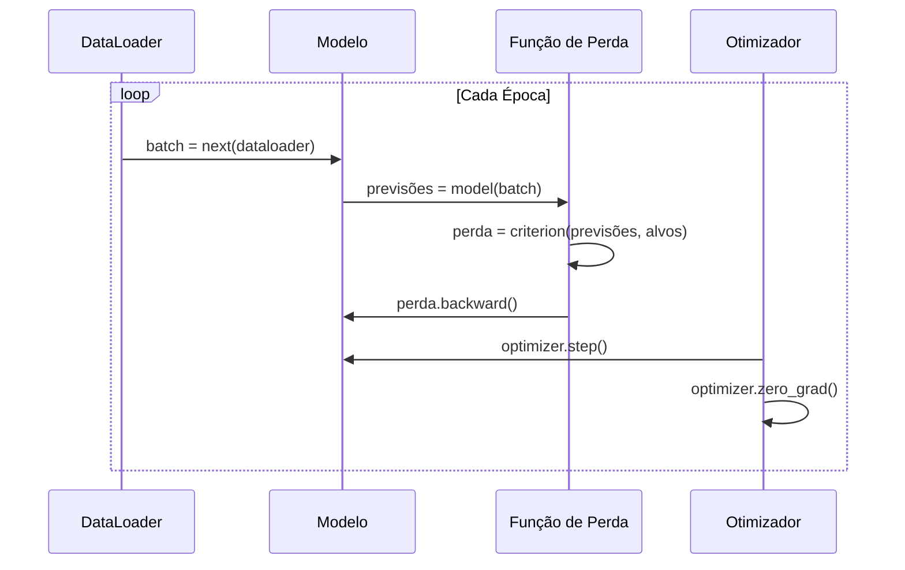

# Introdução ao PyTorch

> Você construiu o motor a partir de pistões e virabrequim. Agora aprenda o que todo mundo realmente dirige.

**Tipo:** Construção
**Linguagens:** Python
**Pré-requisitos:** Aula 03.10 (Construa Seu Próprio Mini Framework)
**Tempo:** ~75 minutos

## Objetivos de Aprendizado

- Construir e treinar redes neurais usando nn.Module, nn.Sequential e autograd do PyTorch
- Usar tensores do PyTorch, aceleração de GPU e o loop de treino padrão (zero_grad, forward, loss, backward, step)
- Converter componentes do seu mini framework do zero pros equivalentes do PyTorch
- Medir e comparar velocidade de treino entre seu framework puro-Python e PyTorch na mesma tarefa

## O Problema

Você tem um mini framework funcional. Camadas Lineares, ReLU, dropout, batch norm, Adam, um DataLoader, um loop de treino. Ele treina uma rede de 4 camadas num problema de classificação de círculo em Python puro.

Também é 500x mais lento que PyTorch no mesmo problema.

Seu mini framework processa uma amostra por vez com loops Python aninhados. PyTorch despacha as mesmas operações pra kernels C++/CUDA otimizados que rodam em GPU. Num único NVIDIA A100, PyTorch treina um ResNet-50 (25,6M de parâmetros) em ImageNet em cerca de 6 horas. Seu framework levaria cerca de 3.000 horas.

## O Conceito

### Por que o PyTorch Venceu

Em 2015, TensorFlow exigia definir um grafo computacional estático antes de rodar qualquer coisa. PyTorch lançou em 2017 com filosofia diferente: execução ansiosa. Você escreve Python. Roda imediatamente. `y = model(x)` realmente computa y agora.

Até 2020, o mercado falou. A fatia do PyTorch em papers de ML foi de 7% (2017) pra mais de 75% (2022).

### Tensores

Um tensor é um array multidimensional com três propriedades críticas: forma, dtype e dispositivo.

```python
import torch

x = torch.zeros(3, 4)           # forma: (3, 4), dtype: float32, device: cpu
x = torch.randn(2, 3, 224, 224) # lote de 2 imagens RGB, 224x224
x = torch.tensor([1, 2, 3])     # de uma lista Python
```

### Autograd

Seu mini framework exigia implementar backward() pra cada módulo. PyTorch não. Ele registra cada operação em tensores num grafo acíclico direcionado e depois percorre o grafo ao contrário pra computar gradientes automaticamente.

```python
x = torch.randn(3, requires_grad=True)
y = x ** 2 + 3 * x
z = y.sum()
z.backward()
print(x.grad)  # dz/dx = 2x + 3
```

Três regras do autograd:

1. Apenas tensores folha com `requires_grad=True` acumulam gradientes
2. Gradientes acumulam por padrão — chame `optimizer.zero_grad()` antes de cada backward
3. `torch.no_grad()` desabilita rastreamento de gradiente (use durante avaliação)

### nn.Module

`nn.Module` é a classe base pra todo componente de rede neural no PyTorch.

```python
import torch.nn as nn

class MLP(nn.Module):
    def __init__(self, input_dim, hidden_dim, output_dim):
        super().__init__()
        self.layer1 = nn.Linear(input_dim, hidden_dim)
        self.relu = nn.ReLU()
        self.layer2 = nn.Linear(hidden_dim, output_dim)

    def forward(self, x):
        x = self.layer1(x)
        x = self.relu(x)
        x = self.layer2(x)
        return x
```

Blocos fundamentais:

| Módulo | O que faz | Parâmetros |
|--------|-----------|------------|
| nn.Linear(in, out) | Wx + b | in*out + out |
| nn.Conv2d(in_ch, out_ch, k) | Convolução 2D | in_ch*out_ch*k*k + out_ch |
| nn.BatchNorm1d(features) | Normalizar ativações | 2 * features |
| nn.Dropout(p) | Zeramento aleatório | 0 |
| nn.ReLU() | max(0, x) | 0 |
| nn.GELU() | Erro linear gaussiano | 0 |
| nn.Embedding(vocab, dim) | Tabela de lookup | vocab * dim |
| nn.LayerNorm(dim) | Normalização por amostra | 2 * dim |

### Funções de Perda e Otimizadores

**Funções de perda** (de `torch.nn`):

| Perda | Tarefa | Entrada |
|-------|--------|---------|
| nn.MSELoss() | Regressão | Qualquer forma |
| nn.CrossEntropyLoss() | Multiclasse | Logits (não softmax) |
| nn.BCEWithLogitsLoss() | Binária | Logits (não sigmoid) |

**Otimizadores** (de `torch.optim`):

| Otimizador | Quando usar | LR típico |
|-----------|-------------|-----------|
| SGD(params, lr, momentum) | CNNs, pipelines bem ajustados | 0.01--0.1 |
| Adam(params, lr) | Ponto de partida padrão | 1e-3 |
| AdamW(params, lr, weight_decay) | Transformers, fine-tuning | 1e-4--1e-3 |

### O Loop de Treino



O padrão canônico:

```python
for epoch in range(num_epochs):
    model.train()
    for inputs, targets in train_loader:
        inputs, targets = inputs.to(device), targets.to(device)
        optimizer.zero_grad()
        outputs = model(inputs)
        loss = criterion(outputs, targets)
        loss.backward()
        optimizer.step()
```

Cinco linhas dentro do loop de batch. Cinco linhas que treinaram GPT-4, Stable Diffusion e LLaMA. A arquitetura muda. Os dados mudam. Essas cinco linhas não mudam.

### Dataset e DataLoader

```python
from torch.utils.data import Dataset, DataLoader

class MNISTDataset(Dataset):
    def __init__(self, images, rótulos):
        self.images = images
        self.rótulos = rótulos

    def __len__(self):
        return len(self.rótulos)

    def __getitem__(self, idx):
        return self.images[idx], self.rótulos[idx]

loader = DataLoader(dataset, batch_size=64, shuffle=True, num_workers=4)
```

### Treino em GPU

```python
device = torch.device("cuda" if torch.cuda.is_available() else "cpu")
model = model.to(device)
```

### Precisão Mista

```python
from torch.amp import autocast, GradScaler

scaler = GradScaler()
for inputs, targets in loader:
    with autocast(device_type="cuda"):
        outputs = model(inputs)
        loss = criterion(outputs, targets)
    scaler.scale(loss).backward()
    scaler.step(optimizer)
    scaler.update()
    optimizer.zero_grad()
```

## Construa

Um MLP de 3 camadas treinado no MNIST usando apenas primitivas do PyTorch.

### Passo 1: Carregar MNIST de Arquivos Brutos

```python
import torch
import torch.nn as nn
import struct
import gzip
import urllib.request
import os

def download_mnist(path="./mnist_data"):
    base_url = "https://storage.googleapis.com/cvdf-datasets/mnist/"
    files = [
        "train-images-idx3-ubyte.gz",
        "train-rótulos-idx1-ubyte.gz",
        "t10k-images-idx3-ubyte.gz",
        "t10k-rótulos-idx1-ubyte.gz",
    ]
    os.makedirs(path, exist_ok=True)
    for f in files:
        filepath = os.path.join(path, f)
        if not os.path.exists(filepath):
            urllib.request.urlretrieve(base_url + f, filepath)

def load_images(filepath):
    with gzip.open(filepath, "rb") as f:
        magic, num, rows, cols = struct.unpack(">IIII", f.read(16))
        data = f.read()
        images = torch.frombuffer(bytearray(data), dtype=torch.uint8)
        images = images.reshape(num, rows * cols).float() / 255.0
    return images

def load_rótulos(filepath):
    with gzip.open(filepath, "rb") as f:
        magic, num = struct.unpack(">II", f.read(8))
        data = f.read()
        rótulos = torch.frombuffer(bytearray(data), dtype=torch.uint8).long()
    return rótulos
```

### Passo 2: Definir o Modelo

```python
class MNISTModel(nn.Module):
    def __init__(self):
        super().__init__()
        self.net = nn.Sequential(
            nn.Linear(784, 256),
            nn.ReLU(),
            nn.Dropout(0.2),
            nn.Linear(256, 128),
            nn.ReLU(),
            nn.Dropout(0.2),
            nn.Linear(128, 10),
        )

    def forward(self, x):
        return self.net(x)
```

Contagem de parâmetros: 784*256 + 256 + 256*128 + 128 + 128*10 + 10 = 235.146. Minúsculo por padrões modernos.

### Passo 3: Loop de Treino

```python
def train_one_epoch(model, loader, criterion, optimizer, device):
    model.train()
    total_loss = 0
    correct = 0
    total = 0
    for images, rótulos in loader:
        images, rótulos = images.to(device), rótulos.to(device)
        optimizer.zero_grad()
        outputs = model(images)
        loss = criterion(outputs, rótulos)
        loss.backward()
        optimizer.step()
        total_loss += loss.item() * images.size(0)
        _, predicted = outputs.max(1)
        correct += predicted.eq(rótulos).sum().item()
        total += rótulos.size(0)
    return total_loss / total, correct / total


def evaluate(model, loader, criterion, device):
    model.eval()
    total_loss = 0
    correct = 0
    total = 0
    with torch.no_grad():
        for images, rótulos in loader:
            images, rótulos = images.to(device), rótulos.to(device)
            outputs = model(images)
            loss = criterion(outputs, rótulos)
            total_loss += loss.item() * images.size(0)
            _, predicted = outputs.max(1)
            correct += predicted.eq(rótulos).sum().item()
            total += rótulos.size(0)
    return total_loss / total, correct / total
```

### Passo 4: Conectar Tudo

```python
def main():
    device = torch.device("cuda" if torch.cuda.is_available() else "cpu")

    download_mnist()
    train_images = load_images("./mnist_data/train-images-idx3-ubyte.gz")
    train_rótulos = load_rótulos("./mnist_data/train-rótulos-idx1-ubyte.gz")
    test_images = load_images("./mnist_data/t10k-images-idx3-ubyte.gz")
    test_rótulos = load_rótulos("./mnist_data/t10k-rótulos-idx1-ubyte.gz")

    train_dataset = torch.utils.data.TensorDataset(train_images, train_rótulos)
    test_dataset = torch.utils.data.TensorDataset(test_images, test_rótulos)
    train_loader = torch.utils.data.DataLoader(
        train_dataset, batch_size=64, shuffle=True
    )
    test_loader = torch.utils.data.DataLoader(
        test_dataset, batch_size=256, shuffle=False
    )

    model = MNISTModel().to(device)
    criterion = nn.CrossEntropyLoss()
    optimizer = torch.optim.Adam(model.parameters(), lr=1e-3)

    num_params = sum(p.numel() for p in model.parameters())
    print(f"Device: {device}")
    print(f"Parameters: {num_params:,}")

    for epoch in range(10):
        train_loss, train_acc = train_one_epoch(
            model, train_loader, criterion, optimizer, device
        )
        test_loss, test_acc = evaluate(
            model, test_loader, criterion, device
        )
        print(
            f"Epoch {epoch+1:2d} | "
            f"Train Loss: {train_loss:.4f} | Train Acc: {train_acc:.4f} | "
            f"Test Loss: {test_loss:.4f} | Test Acc: {test_acc:.4f}"
        )

    torch.save(model.state_dict(), "mnist_mlp.pt")
    print(f"\nModel saved to mnist_mlp.pt")
    print(f"Final test accuracy: {test_acc:.4f}")
```

Espera-se ~97.8% de acurácia de teste após 10 épocas.

## Use

### Comparação: Mini Framework vs PyTorch

| Mini Framework (Aula 10) | PyTorch |
|--------------------------|---------|
| `model = Sequential(Linear(784, 256), ReLU(), ...)` | `model = nn.Sequential(nn.Linear(784, 256), nn.ReLU(), ...)` |
| `pred = model.forward(x)` | `pred = model(x)` |
| `optimizer.zero_grad()` | `optimizer.zero_grad()` |
| `grad = criterion.backward()` depois `model.backward(grad)` | `loss.backward()` |
| `optimizer.step()` | `optimizer.step()` |
| Sem GPU | `model.to("cuda")` |
| Backward manual pra cada módulo | Autograd cuida de tudo |

### Salvando e Carregando Modelos

```python
torch.save(model.state_dict(), "model.pt")

model = MNISTModel()
model.load_state_dict(torch.load("model.pt", weights_only=True))
model.eval()
```

Sempre salve `state_dict()` (o dicionário de parâmetros), não o objeto do modelo.

## Entregue

Esta aula produz dois artefatos:
- `outputs/prompt-pytorch-debugger.md` — um prompt pra diagnosticar falhas comuns de treino no PyTorch
- `outputs/skill-pytorch-patterns.md` — uma referência de habilidades pra padrões de treino do PyTorch

## Exercícios

1. Implemente treino com precisão mista usando torch.amp.autocast. Compare memória e velocidade com treino em float32.
2. Implemente gradient clipping usando `torch.nn.utils.clip_grad_norm_` e compare curvas de perda com e sem clipping numa rede profunda.
3. Crie um dataset personalizado que carregue imagens do disco com augmentation em tempo real (random crop, flip horizontal). Compare velocidade com DataLoader usando num_workers=0 vs num_workers=4.
4. Implemente um loop de treino com mixed precision, gradient accumulation e gradient checkpointing. Explique quando cada técnica é útil.
5. Treine um modelo no MNIST com batch size 32, 128 e 512. Plote a curva de perda pra cada. O tamanho do lote afeta a convergência? A acurácia final?
