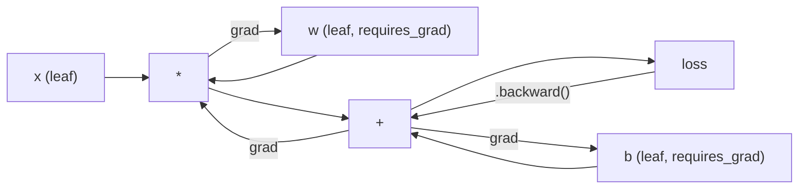
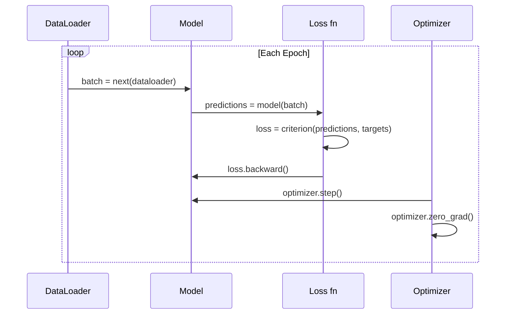

# PyTorch'a Giriş

> Motoru pistonlardan ve krank millerinden yaptınız. Şimdi herkesin gerçekte kullandığı aracı öğrenin.

**Tür:** Yapım
**Diller:** Python
**Önkoşullar:** Ders 03.10 (Kendi Mini Framework'nizi Oluşturun)
**Süre:** ~75 dakika

## Öğrenme Hedefleri

- PyTorch'un nn.Module, nn.Sequential ve autograd'ını kullanarak neural network'leri oluşturun ve eğitin
- PyTorch tensörlerini, GPU hızlandırmayı ve standart eğitim döngüsünü kullanın (zero_grad, ileri, kayıp, geri, adım)
- Sıfırdan mini framework bileşenlerinizi PyTorch eşdeğerlerine dönüştürün
- Aynı görevde saf Python framework ve PyTorch'unuz arasındaki eğitim hızının profilini çıkarın ve karşılaştırın

## Sorun

Çalışan bir mini framework'niz var. Doğrusal katmanlar, ReLU, bırakma, toplu norm, Adam, DataLoader, eğitim döngüsü. Saf Python'da daire sınıflandırma problemi üzerinde 4 katmanlı bir ağı eğitir.

Aynı problemde PyTorch'tan 500 kat daha yavaştır.

Mini framework'niz, iç içe geçmiş Python döngüleriyle aynı anda bir örneği işler. PyTorch, aynı işlemleri GPU üzerinde çalışan optimize edilmiş C++/CUDA çekirdeklerine gönderir. PyTorch, tek bir NVIDIA A100 üzerinde ResNet-50'yi (25,6 milyon parametre) ImageNet (1,28 milyon görüntü) üzerinde yaklaşık 6 saatte eğitir. framework'nizin aynı görevde çalışması yaklaşık 3.000 saat sürecektir - eğer önce belleği dolmasaydı.

Tek fark hız değil. framework'nizin GPU desteği yoktur. Otomatik farklılaşma yok - her modül için geriye doğru () elle yazdınız. Serileştirme yok. Dağıtılmış eğitim yok. Karışık hassasiyet yok. Yazdırma ifadeleri olmadan gradient akışında hata ayıklamanın yolu yoktur.

PyTorch bu boşlukların her birini dolduruyor. Ve bunu, halihazırda oluşturduğunuz zihinsel modelin aynısını koruyarak yapar: Modül, ileri(), parametreler(), geri(), optimizer.step(). Kavramlar bire bir aktarılır. Sözdizimi neredeyse aynı. Aradaki fark, PyTorch'un sıfırdan tasarladığınız arayüzün arkasında on yıllık sistem mühendisliğini tamamlamasıdır.

## Konsept

### PyTorch Neden Kazandı?

2015 yılında TensorFlow, herhangi bir şeyi çalıştırmadan önce statik bir hesaplama grafiği tanımlamanızı gerektirdi. Grafiği oluşturdunuz, derlediniz ve ardından verileri onun üzerinden beslediniz. Hata ayıklama, grafik görselleştirmelerine bakmak anlamına geliyordu. Mimariyi değiştirmek, grafiği sıfırdan yeniden oluşturmak anlamına geliyordu.

PyTorch 2017'de farklı bir felsefeyle piyasaya sürüldü: hevesli uygulama. Python'u sen yaz. Hemen çalışır. `y = model(x)` aslında y'yi şu anda hesaplıyor, "grafiğe daha sonra y'yi hesaplayacak bir düğüm eklemek" değil. Bu, standart Python hata ayıklama araçlarının çalıştığı anlamına geliyordu. print() işe yaradı. pdb çalıştı. ileri geçişinizde if/else işe yaradı.

2020 yılına gelindiğinde piyasa konuşmuştu. PyTorch'un makine öğrenimi araştırma makalelerindeki payı %7'den (2017) %75'in (2022) üzerine çıktı. Meta, Google DeepMind, OpenAI, Anthropic ve Hugging Face'in tümü PyTorch'u birincil framework olarak kullanıyor. TensorFlow 2.x buna yanıt olarak hevesli uygulamayı benimsedi; PyTorch'un tasarımının doğru olduğunun üstü kapalı kabulü.

Ders: geliştirici deneyimi bileşimleri. %10 daha yavaş ancak hata ayıklaması %50 daha hızlı olan framework her zaman kazanır.

### Tensörler

Tensör, üç kritik özelliğe sahip çok boyutlu bir dizidir: şekil, tür ve aygıt.

```python
import torch

x = torch.zeros(3, 4)           # shape: (3, 4), dtype: float32, device: cpu
x = torch.randn(2, 3, 224, 224) # batch of 2 RGB images, 224x224
x = torch.tensor([1, 2, 3])     # from a Python list
```

**Şekil** boyutluluktur. Bir skaler şekildir (), bir vektör (n,), bir matris (m, n), bir görüntü kümesidir (topluluk, kanallar, yükseklik, genişlik).

**Dtype** hassasiyeti ve belleği kontrol eder.

| dtype | Bitler | Menzil | Kullanım örneği |
|-------|------|-------|----------|
| kayan nokta32 | 32 | ~7 ondalık basamak | Varsayılan eğitim |
| kayan nokta16 | 16 | ~3,3 ondalık basamak | Karışık hassasiyet |
| bfloat16 | 16 | Float32 ile aynı aralık, daha az hassasiyet | Yüksek Lisans eğitimi |
| int8 | 8 | -128'den 127'ye | Nicelenmiş inference |

**Cihaz** hesaplamanın nerede gerçekleşeceğini belirler.

```python
device = torch.device("cuda" if torch.cuda.is_available() else "cpu")
x = torch.randn(3, 4, device=device)
x = x.to("cuda")
x = x.cpu()
```

Her işlem tüm tensörlerin aynı cihazda olmasını gerektirir. Bu, yeni başlayanların karşılaştığı 1 numaralı PyTorch hatasıdır: `RuntimeError: Expected all tensors to be on the same device`. Hesaplamadan önce her şeyi aynı cihaza taşıyarak sorunu düzeltin.

**Yeniden şekillendirme** sabit zamanlıdır; verileri değil meta verileri değiştirir.

```python
x = torch.randn(2, 3, 4)
x.view(2, 12)      # reshape to (2, 12) -- must be contiguous
x.reshape(6, 4)    # reshape to (6, 4) -- works always
x.permute(2, 0, 1) # reorder dimensions
x.unsqueeze(0)     # add dimension: (1, 2, 3, 4)
x.squeeze()        # remove size-1 dimensions
```

### Otomatik Geçiş

Mini framework'niz her modül için geriye() uygulamanızı gerektiriyordu. PyTorch bunu yapmaz. Tensörler üzerindeki her işlemi yönlendirilmiş bir döngüsel olmayan grafiğe (hesaplamalı grafik) kaydeder ve ardından gradient'leri otomatik olarak hesaplamak için bu grafiği ters yönde hareket ettirir.



framework'nizden temel fark: PyTorch, bant tabanlı otomatik fark kullanır. Her işlem ileri geçiş sırasında bir "kaset"e eklenir. `.backward()` çağrıldığında kaset tersten yeniden oynatılır.

```python
x = torch.randn(3, requires_grad=True)
y = x ** 2 + 3 * x
z = y.sum()
z.backward()
print(x.grad)  # dz/dx = 2x + 3
```

Otogradın üç kuralı:

1. Yalnızca `requires_grad=True`'ye sahip yaprak tensörler gradient'leri biriktirir
2. Gradient'ler varsayılan olarak birikir; her geri geçişten önce `optimizer.zero_grad()`'yi çağırın
3. `torch.no_grad()`, gradient izlemeyi devre dışı bırakır (değerlendirme sırasında kullanın)

### nn.Module

`nn.Module`, PyTorch'taki her neural network bileşeni için temel sınıftır. Bu soyutlamayı Ders 10'da zaten oluşturdunuz. PyTorch'un sürümü otomatik parametre kaydı, özyinelemeli modül keşfi, cihaz yönetimi ve durum dikte serileştirmesi ekler.

```python
import torch.nn as nn

class MLP(nn.Module):
    def __init__(self, input_dim, hidden_dim, output_dim):
        super().__init__()
        self.layer1 = nn.Linear(input_dim, hidden_dim)
        self.relu = nn.ReLU()
        self.layer2 = nn.Linear(hidden_dim, output_dim)

    def forward(self, x):
        x = self.layer1(x)
        x = self.relu(x)
        x = self.layer2(x)
        return x
```

`__init__`'de bir `nn.Module` veya `nn.Parameter`'yi öznitelik olarak atadığınızda, PyTorch bunu otomatik olarak kaydeder. `model.parameters()` kayıtlı her parametreyi yinelemeli olarak toplar. Bu nedenle mini framework'de yaptığınız gibi ağırlıkları manuel olarak toplamak zorunda kalmazsınız.

Anahtar yapı taşları:

| Modül | Ne işe yarar | Parametreler |
|--------|-------------|------------|
| nn.Linear(giriş, çıkış) | Wx + b | giriş*çıkış + çıkış |
| nn.Conv2d(inç_kanal, çıkış_kanal, k) | 2D evrişim | giriş*çıkış_ch*k*k + çıkış_ch |
| nn.BatchNorm1d(özellikler) | Aktivasyonları normalleştirin | 2 * özellikler |
| nn.Dropout(p) | Rastgele sıfırlama | 0 |
| nn.ReLU() | maksimum(0, x) | 0 |
| nn.GELU() | Gauss hatası doğrusal | 0 |
| nn.Embedding(sözcük, sönük) | Arama tablosu | kelime * loş |
| nn.LayerNorm(soluk) | Numune başına normalleştirme | 2 * loş |

### Loss Function'ler ve Optimize Ediciler

PyTorch, oluşturduğunuz her şeyin üretime hazır sürümlerini gönderir.

**Loss function'ler** (`torch.nn`'den):

| Kayıp | Görev | Giriş |
|------|------|-------|
| nn.MSELoss() | Regresyon | Herhangi bir şekil |
| nn.CrossEntropyLoss() | Çok sınıflı sınıflandırma | Logitler (softmax değil) |
| nn.BCEWithLogitsLoss() | İkili sınıflandırma | Logitler (sigmoid değil) |
| nn.L1Loss() | Regresyon (sağlam) | Herhangi bir şekil |
| nn.CTCLoss() | Sıra hizalaması | Olasılıkları günlüğe kaydet |

Not: `CrossEntropyLoss`, `LogSoftmax` + `NLLLoss`'yi dahili olarak birleştirir. Softmax çıktılarını değil, ham logitleri iletin. Bu, sessizce yanlış gradient'ler üreten yaygın bir hatadır.

**Optimize ediciler** (`torch.optim`'den):

| Optimize Edici | Ne zaman kullanılır | Tipik LR |
|-----------|-------------|-----------|
| SGD(paramlar, lr, momentum) | CNN'ler, iyi ayarlanmış boru hatları | 0.01--0.1 |
| Adam(params, lr) | Varsayılan başlangıç ​​noktası | 1e-3 |
| AdamW(params, lr, ağırlık_decay) | Transformer'ler, fine-tuning | 1e-4--1e-3 |
| LBFGS(paramlar) | Küçük ölçekli, ikinci dereceden | 1.0 |

### Eğitim Döngüsü

Her PyTorch eğitim döngüsü aynı 5 adımlı modeli izler. Bunu Ders 10'dan zaten biliyorsunuz.



Kanonik desen:

```python
for epoch in range(num_epochs):
    model.train()
    for inputs, targets in train_loader:
        inputs, targets = inputs.to(device), targets.to(device)
        optimizer.zero_grad()
        outputs = model(inputs)
        loss = criterion(outputs, targets)
        loss.backward()
        optimizer.step()
```

Toplu döngünün içindeki beş satır. GPT-4, Stabil Difüzyon ve LLaMA'yı eğiten beş hat. Mimari değişir. Veriler değişir. Bu beş satır yok.

### Dataset ve DataLoader

PyTorch'un `Dataset`'si iki yönteme sahip soyut bir sınıftır: `__len__` ve `__getitem__`. `DataLoader` bunu toplu işleme, karıştırma ve çok işlemli veri yüklemeyle tamamlar.

```python
from torch.utils.data import Dataset, DataLoader

class MNISTDataset(Dataset):
    def __init__(self, images, labels):
        self.images = images
        self.labels = labels

    def __len__(self):
        return len(self.labels)

    def __getitem__(self, idx):
        return self.images[idx], self.labels[idx]

loader = DataLoader(dataset, batch_size=64, shuffle=True, num_workers=4)
```

`num_workers=4`, GPU geçerli toplu iş üzerinde eğitim alırken verileri paralel olarak yüklemek için 4 işlem oluşturur. Diske bağlı iş yüklerinde (büyük resimler, ses), bu tek başına eğitim hızını iki katına çıkarabilir.

### GPU Eğitimi

Bir modeli GPU'ya taşıma:

```python
device = torch.device("cuda" if torch.cuda.is_available() else "cpu")
model = model.to(device)
```

Bu, her parametreyi ve arabelleği yinelemeli olarak GPU'ya taşır. Daha sonra eğitim sırasında her partiyi taşıyın:

```python
inputs, targets = inputs.to(device), targets.to(device)
```

**Karma hassasiyet**, ana ağırlıkları float32'de tutarken float16'da ileri/geri koşarak modern GPU'larda (A100, H100, RTX 4090) bellek kullanımını yarıya indirir ve verimi iki katına çıkarır:

```python
from torch.amp import autocast, GradScaler

scaler = GradScaler()
for inputs, targets in loader:
    with autocast(device_type="cuda"):
        outputs = model(inputs)
        loss = criterion(outputs, targets)
    scaler.scale(loss).backward()
    scaler.step(optimizer)
    scaler.update()
    optimizer.zero_grad()
```

### Karşılaştırma: Mini Framework ile PyTorch ve JAX

| Özellik | Mini Framework (L10) | PyTorch | JAX |
|---------|---------------------|---------|-----|
| Otomatik Fark | Manuel geri() | Bant tabanlı otomatik derecelendirme | Fonksiyonel dönüşümler |
| Yürütme | İstekli (Python döngüleri) | İstekli (C++ çekirdekleri) | İzlenen + JIT derlendi |
| GPU desteği | Hayır | Evet (CUDA, ROCm, MPS) | Evet (CUDA, TPU) |
| Hız (MNIST MLP) | ~300s/dönem | ~0,5s/dönem | ~0,3s/dönem |
| Modül sistemi | Özel Modül sınıfı | nn.Module | Durum bilgisi olmayan işlevler (Flax/Equinox) |
| Hata ayıklama | yazdır() | print(), pdb, kesme noktası() | Daha zor (JIT izleme baskıyı keser) |
| Ekosistem | Yok | Sarılma Yüzü, Yıldırım, timm | Keten, Optax, Orbax |
| Öğrenme eğrisi | Onu sen inşa ettin | Orta | Dik (işlevsel paradigma) |
| Üretim kullanımı | Oyuncak sorunları | Meta, OpenAI, Antropik, HF | Google DeepMind, Yolculuğun Ortası |

```figure
dropout-mask
```

## İnşa Et

Yalnızca PyTorch temel öğeleri kullanılarak MNIST üzerinde eğitilmiş 3 katmanlı bir MLP. Üst düzey sarmalayıcı yok. `torchvision.datasets` yok. Ham verileri kendimiz indirip ayrıştırıyoruz.

### Adım 1: MNIST'i Ham Dosyalardan Yükleyin

MNIST, gzip'li 4 dosya olarak gönderilir: eğitim görüntüleri (60.000 x 28 x 28), eğitim etiketleri, test görüntüleri (10.000 x 28 x 28), test etiketleri. Bunları indiriyoruz ve ikili formatı ayrıştırıyoruz.

```python
import torch
import torch.nn as nn
import struct
import gzip
import urllib.request
import os

def download_mnist(path="./mnist_data"):
    base_url = "https://storage.googleapis.com/cvdf-datasets/mnist/"
    files = [
        "train-images-idx3-ubyte.gz",
        "train-labels-idx1-ubyte.gz",
        "t10k-images-idx3-ubyte.gz",
        "t10k-labels-idx1-ubyte.gz",
    ]
    os.makedirs(path, exist_ok=True)
    for f in files:
        filepath = os.path.join(path, f)
        if not os.path.exists(filepath):
            urllib.request.urlretrieve(base_url + f, filepath)

def load_images(filepath):
    with gzip.open(filepath, "rb") as f:
        magic, num, rows, cols = struct.unpack(">IIII", f.read(16))
        data = f.read()
        images = torch.frombuffer(bytearray(data), dtype=torch.uint8)
        images = images.reshape(num, rows * cols).float() / 255.0
    return images

def load_labels(filepath):
    with gzip.open(filepath, "rb") as f:
        magic, num = struct.unpack(">II", f.read(8))
        data = f.read()
        labels = torch.frombuffer(bytearray(data), dtype=torch.uint8).long()
    return labels
```

### Adım 2: Modeli Tanımlayın

3 katmanlı bir MLP: 784 -> 256 -> 128 -> 10. ReLU aktivasyonları. Düzenleme için bırakma. Bunu basit tutacak bir parti normu yok.

```python
class MNISTModel(nn.Module):
    def __init__(self):
        super().__init__()
        self.net = nn.Sequential(
            nn.Linear(784, 256),
            nn.ReLU(),
            nn.Dropout(0.2),
            nn.Linear(256, 128),
            nn.ReLU(),
            nn.Dropout(0.2),
            nn.Linear(128, 10),
        )

    def forward(self, x):
        return self.net(x)
```

Çıkış katmanı 10 ham logit (rakam başına bir tane) üretir. Softmax yok -- `CrossEntropyLoss` bunu dahili olarak hallediyor.

Parametre sayısı: 784*256 + 256 + 256*128 + 128 + 128*10 + 10 = 235.146. Modern standartlara göre küçük. GPT-2 küçük 124M'ye sahiptir. Bu saniyeler içinde eğitilir.

### Adım 3: Eğitim Döngüsü

Kanonik ileri-kayıp-geri adım modeli.

```python
def train_one_epoch(model, loader, criterion, optimizer, device):
    model.train()
    total_loss = 0
    correct = 0
    total = 0
    for images, labels in loader:
        images, labels = images.to(device), labels.to(device)
        optimizer.zero_grad()
        outputs = model(images)
        loss = criterion(outputs, labels)
        loss.backward()
        optimizer.step()
        total_loss += loss.item() * images.size(0)
        _, predicted = outputs.max(1)
        correct += predicted.eq(labels).sum().item()
        total += labels.size(0)
    return total_loss / total, correct / total


def evaluate(model, loader, criterion, device):
    model.eval()
    total_loss = 0
    correct = 0
    total = 0
    with torch.no_grad():
        for images, labels in loader:
            images, labels = images.to(device), labels.to(device)
            outputs = model(images)
            loss = criterion(outputs, labels)
            total_loss += loss.item() * images.size(0)
            _, predicted = outputs.max(1)
            correct += predicted.eq(labels).sum().item()
            total += labels.size(0)
    return total_loss / total, correct / total
```

Değerlendirme sırasında `torch.no_grad()`'ye dikkat edin. Bu, otomatik yükseltmeyi devre dışı bırakır, bellek kullanımını azaltır ve inference'yi hızlandırır. Bu olmadan, PyTorch asla kullanmayacağınız bir hesaplama grafiği oluşturur.

### Adım 4: Her Şeyi Bir Araya Bağlayın

```python
def main():
    device = torch.device("cuda" if torch.cuda.is_available() else "cpu")

    download_mnist()
    train_images = load_images("./mnist_data/train-images-idx3-ubyte.gz")
    train_labels = load_labels("./mnist_data/train-labels-idx1-ubyte.gz")
    test_images = load_images("./mnist_data/t10k-images-idx3-ubyte.gz")
    test_labels = load_labels("./mnist_data/t10k-labels-idx1-ubyte.gz")

    train_dataset = torch.utils.data.TensorDataset(train_images, train_labels)
    test_dataset = torch.utils.data.TensorDataset(test_images, test_labels)
    train_loader = torch.utils.data.DataLoader(
        train_dataset, batch_size=64, shuffle=True
    )
    test_loader = torch.utils.data.DataLoader(
        test_dataset, batch_size=256, shuffle=False
    )

    model = MNISTModel().to(device)
    criterion = nn.CrossEntropyLoss()
    optimizer = torch.optim.Adam(model.parameters(), lr=1e-3)

    num_params = sum(p.numel() for p in model.parameters())
    print(f"Device: {device}")
    print(f"Parameters: {num_params:,}")
    print(f"Train samples: {len(train_dataset):,}")
    print(f"Test samples: {len(test_dataset):,}")
    print()

    for epoch in range(10):
        train_loss, train_acc = train_one_epoch(
            model, train_loader, criterion, optimizer, device
        )
        test_loss, test_acc = evaluate(
            model, test_loader, criterion, device
        )
        print(
            f"Epoch {epoch+1:2d} | "
            f"Train Loss: {train_loss:.4f} | Train Acc: {train_acc:.4f} | "
            f"Test Loss: {test_loss:.4f} | Test Acc: {test_acc:.4f}"
        )

    torch.save(model.state_dict(), "mnist_mlp.pt")
    print(f"\nModel saved to mnist_mlp.pt")
    print(f"Final test accuracy: {test_acc:.4f}")
```

10 dönem sonrasında beklenen çıktı: ~%97,8 test doğruluğu. CPU'da eğitim süresi: ~30 saniye. GPU'da: ~5 saniye. Aynı mimariye sahip mini framework'nizde: ~45 dakika.

## Kullan onu

### Hızlı Karşılaştırma: Mini Framework ve PyTorch

| Mini Framework (Ders 10) | PyTorch |
|---------------------------|---------|
| `model = Sequential(Linear(784, 256), ReLU(), ...)` | `model = nn.Sequential(nn.Linear(784, 256), nn.ReLU(), ...)` |
| `pred = model.forward(x)` | `pred = model(x)` |
| `optimizer.zero_grad()` | `optimizer.zero_grad()` |
| `grad = criterion.backward()` ardından `model.backward(grad)` | `loss.backward()` |
| `optimizer.step()` | `optimizer.step()` |
| GPU yok | `model.to("cuda")` |
| Her modül için manuel geriye doğru | Autograd her şeyi halleder |

Arayüz neredeyse aynı. Fark, kaputun altındaki her şeydir.

### Modelleri Kaydetme ve Yükleme

```python
torch.save(model.state_dict(), "model.pt")

model = MNISTModel()
model.load_state_dict(torch.load("model.pt", weights_only=True))
model.eval()
```

Model nesnesini değil, her zaman `state_dict()`'yi (parametre sözlüğü) kaydedin. Model nesnesinin kaydedilmesi, kodu yeniden düzenlediğinizde bozulan turşu kullanır. Devlet deyimleri taşınabilirdir.

### Öğrenme Hızı Planlama

```python
scheduler = torch.optim.lr_scheduler.CosineAnnealingLR(
    optimizer, T_max=10
)
for epoch in range(10):
    train_one_epoch(model, train_loader, criterion, optimizer, device)
    scheduler.step()
```

PyTorch 15'ten fazla zamanlayıcı sunar: StepLR, ExponentialLR, CosineAnnealingLR, OneCycleLR, ReducLROnPlateau. Hepsi aynı optimize edici arayüzüne takılır.

## Gönderin

Bu ders iki artifact üretir:

- `outputs/prompt-pytorch-debugger.md` - yaygın PyTorch eğitim hatalarını teşhis etmek için bir prompt
- `outputs/skill-pytorch-patterns.md` - PyTorch eğitim kalıpları için bir beceri referansı

## Egzersizler

1. **Toplu normalleştirme ekleyin.** Her doğrusal katmandan sonra (etkinleştirmeden önce) `nn.BatchNorm1d`'yi ekleyin. Test doğruluğunu ve eğitim hızını yalnızca bırakma sürümüyle karşılaştırın. Parti normu daha az dönemde %98+'e ulaşmalıdır.

2. **Öğrenme oranı bulucuyu uygulayın.** Katlanarak artan öğrenme oranıyla (1e-7'den 1,0'a) bir dönem boyunca eğitim alın. LR'ye karşı arsa kaybı. Optimum LR, kaybın tırmanmaya başlamasından hemen önceki zamandır. MNIST modeli için daha iyi bir LR seçmek amacıyla bunu kullanın.

3. **Karışık hassasiyetle bağlantı noktasından GPU'ya.** `torch.amp.autocast` ve `GradScaler`'yi eğitim döngüsüne ekleyin. GPU'da karışık hassasiyetle ve karışık hassasiyet olmadan verimi (örnek/saniye) ölçün. A100'de ~2 kat hızlanma beklenir.

4. **Özel bir Dataset oluşturun.** Fashion-MNIST'i indirin (MNIST ile aynı formattadır ancak giyim öğeleri içerir). `__getitem__` ve `__len__` ile bir `FashionMNISTDataset(Dataset)` sınıfı uygulayın. Aynı MLP'yi eğitin ve doğruluğu karşılaştırın. Fashion-MNIST daha zordur; ~%88'e karşılık ~%98'i bekleyin.

5. **Adam'ı SGD + momentumla değiştirin.** `SGD(params, lr=0.01, momentum=0.9)` ile antrenman yapın. Yakınsama eğrilerini karşılaştırın. Daha sonra bir `CosineAnnealingLR` zamanlayıcı ekleyin ve SGD'nin Adam'ı 10. çağa kadar yakalayıp yakalayamayacağına bakın.

## Anahtar Terimler

| Dönem | İnsanlar ne diyor | Aslında ne anlama geliyor |
|------|----------------|----------------------|
| Tensör | "Çok boyutlu bir dizi" | Her operasyonda otomatik farklılaştırma desteğine sahip, yazılı, cihaza duyarlı bir dizi |
| Otograd | "Otomatik arka destek" | İleri geçiş sırasındaki işlemleri kaydeden, daha sonra bunları tam gradient hesaplamak için ters yönde tekrar oynatan bant tabanlı bir sistem |
| nn.Module | "Bir katman" | Türevlenebilir herhangi bir hesaplama bloğu için temel sınıf -- parametreleri kaydeder, yerleştirmeyi destekler, eğitim/değerlendirme modlarını yönetir |
| state_dict | "Model ağırlıkları" | OrderedDict parametre adlarını tensörlerle eşleştiriyor - eğitilmiş bir modelin taşınabilir, serileştirilebilir temsili |
| .backward() | "gradient'leri Hesapla" | Hesaplamalı grafiği tersten geçerek her yaprak tensörü için gradient'leri require_grad=True | ile hesaplayıp biriktirin.
| .to(cihaz) | "GPU'ya Taşı" | Tüm parametreleri ve arabellekleri belirtilen aygıta (CPU, CUDA, MPS) yinelemeli olarak aktarın |
| Veri Yükleyici | "Veri hattı" | Dataset |
| Karışık hassasiyet | "Float16'yı kullan" | Sayısal kararlılık için float32 ana ağırlıklarını korurken, hız için float16 ile ileri/geri eğitim yapın |
| İstekli infaz | "Şimdi çalıştır" | İşlemler çağrıldığında hemen yürütülür, daha sonraki bir derleme adımına ertelenmez; PyTorch'u TF 1.x'ten ayıran temel tasarım seçeneği |
| sıfır_grad | "gradient'leri Sıfırla" | PyTorch varsayılan olarak gradient'leri biriktirdiğinden, bir sonraki geri geçişten önce tüm gradient parametrelerini sıfıra ayarlayın.

## Daha Fazla Okuma

- Paszke ve diğerleri, "PyTorch: An Imperative Style, High-Performance Deep Learning Library" (2019) -- PyTorch'un tasarım ödünleşimlerini açıklayan orijinal makale
- PyTorch Dersleri: "Örneklerle PyTorch'u Öğrenmek" (https://pytorch.org/tutorials/beginner/pytorch_with_examples.html) -- tensörlerden nn.Module'ye giden resmi yol
- PyTorch Performans Ayarlama Kılavuzu (https://pytorch.org/tutorials/recipes/recipes/tuning_guide.html) -- karma hassasiyet, DataLoader çalışanları, sabitlenmiş bellek ve diğer üretim optimizasyonları
- Horace He, "Making Deep Learning Go Brrrr" (https://horace.io/brrr_intro.html) -- PyTorch'a özel optimizasyon stratejileriyle GPU eğitimi neden hızlı
