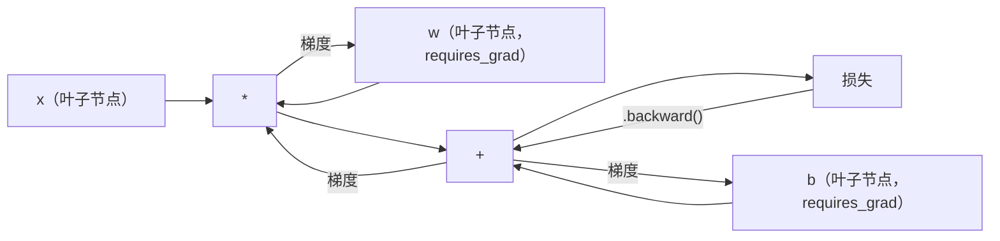
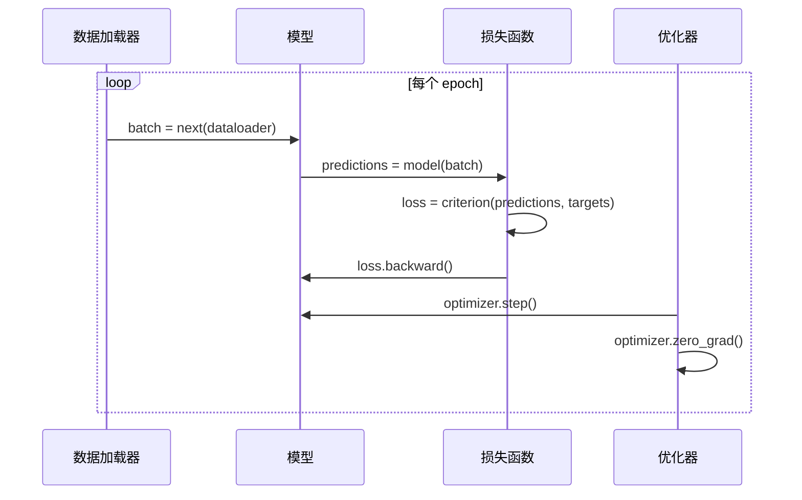

# PyTorch 简介

> 你已经用活塞和曲轴造出了引擎。现在学习那个大家实际在驾驶的。

**类型：** 构建
**语言：** Python
**前置知识：** 03.10 课（构建你自己的微型框架）
**时长：** ~75 分钟

## 学习目标

- 使用 PyTorch 的 nn.Module、nn.Sequential 和自动微分（autograd）构建并训练神经网络
- 使用 PyTorch 张量（Tensor）、GPU 加速以及标准训练循环（zero_grad、前向传播、损失计算、反向传播、参数更新）
- 将你从头搭建的微型框架组件转换为 PyTorch 等价物
- 在同一任务上对比纯 Python 框架与 PyTorch 的训练速度，并进行性能分析

## 问题

你有一个能工作的微型框架。线性层、ReLU、Dropout、批归一化（BatchNorm）、Adam、数据加载器（DataLoader）、训练循环。它能在纯 Python 中训练一个四层网络解决圆分类问题。

但它在同一问题上比 PyTorch 慢 500 倍。

你的微型框架使用嵌套的 Python 循环一次处理一个样本。而 PyTorch 将相同的操作派发给在 GPU 上运行的优化 C++/CUDA 内核。在单个 NVIDIA A100 上，PyTorch 在 ImageNet（128 万张图片）上训练 ResNet-50（2560 万参数）大约需要 6 小时。你的框架在相同任务上大约需要 3000 小时——如果它没有先耗尽内存的话。

速度不是唯一的差距。你的框架没有 GPU 支持。没有自动微分——你为每个模块手写了 backward()。没有序列化。没有分布式训练。没有混合精度（Mixed Precision）。没有无需打印语句就能调试梯度流的方法。

PyTorch 弥补了所有这些差距。而且它保留了与你已经构建的完全相同的思维模型：Module、forward()、parameters()、backward()、optimizer.step()。这些概念一对一地迁移。语法几乎相同。区别在于 PyTorch 在同样你从头设计的接口背后封装了十年的系统工程。

## 概念

### PyTorch 为何胜出

2015 年，TensorFlow 要求你在运行任何东西之前定义一个静态计算图。你构建图、编译它、然后通过它输入数据。调试意味着盯着图可视化。改变架构意味着从头重建图。

PyTorch 于 2017 年推出，采用不同的哲学：即时执行（Eager Execution）。你写 Python。它立即运行。`y = model(x)` 实际上现在计算 y，而不是“向一个以后会计算 y 的图添加节点”。这意味着标准的 Python 调试工具可以工作。print() 能用。pdb 能用。前向传播中的 if/else 也能用。

到 2020 年，市场已经做出选择。PyTorch 在 ML 研究论文中的份额从 7%（2017 年）增长到超过 75%（2022 年）。Meta、Google DeepMind、OpenAI、Anthropic 和 Hugging Face 都使用 PyTorch 作为他们的主要框架。TensorFlow 2.x 作为回应采用了即时执行——这默认承认了 PyTorch 的设计是正确的。

教训：开发者体验是复利的。一个慢 10% 但调试快 50% 的框架总能胜出。

### 张量（Tensor）

张量是一个多维数组，具有三个关键属性：形状（shape）、数据类型（dtype）和设备（device）。

```python
import torch

x = torch.zeros(3, 4)           # 形状: (3, 4), 数据类型: float32, 设备: cpu
x = torch.randn(2, 3, 224, 224) # 批次包含 2 张 RGB 图像，224x224
x = torch.tensor([1, 2, 3])     # 从 Python 列表创建
```

**形状**是维度。标量形状为 ()，向量为 (n,)，矩阵为 (m, n)，一批图像为 (batch, channels, height, width)。

**数据类型**控制精度和内存。

| 数据类型 | 位数 | 范围 | 使用场景 |
|-------|------|-------|----------|
| float32 | 32 | ~7 位十进制数字 | 默认训练 |
| float16 | 16 | ~3.3 位十进制数字 | 混合精度 |
| bfloat16 | 16 | 与 float32 相同范围，精度更低 | 大语言模型训练 |
| int8 | 8 | -128 到 127 | 量化推理 |

**设备**决定计算发生的位置。

```python
device = torch.device("cuda" if torch.cuda.is_available() else "cpu")
x = torch.randn(3, 4, device=device)
x = x.to("cuda")
x = x.cpu()
```

每个操作要求所有张量在同一个设备上。这是新手遇到的 #1 PyTorch 错误：`RuntimeError: Expected all tensors to be on the same device`。解决方法是在计算前将所有内容移到相同设备上。

**重塑（Reshaping）** 是常数时间操作——它改变元数据，而非数据。

```python
x = torch.randn(2, 3, 4)
x.view(2, 12)      # 重塑为 (2, 12) —— 必须是连续的
x.reshape(6, 4)    # 重塑为 (6, 4) —— 总是有效
x.permute(2, 0, 1) # 重新排列维度
x.unsqueeze(0)     # 添加维度: (1, 2, 3, 4)
x.squeeze()        # 移除大小为 1 的维度
```

### 自动微分（Autograd）

你的微型框架要求你为每个模块实现 backward()。PyTorch 不需要。它会将张量上的每个操作记录到一个有向无环图（计算图）中，然后反向遍历该图来自动计算梯度。



与你框架的关键区别：PyTorch 使用基于磁带（tape）的自动微分。每个操作在前向传播期间追加到一条“磁带”上。调用 `.backward()` 会反向回放磁带。

```python
x = torch.randn(3, requires_grad=True)
y = x ** 2 + 3 * x
z = y.sum()
z.backward()
print(x.grad)  # dz/dx = 2x + 3
```

自动微分的三条规则：

1. 只有 `requires_grad=True` 的叶子张量会累积梯度
2. 梯度默认会累积——在每次反向传播之前调用 `optimizer.zero_grad()`
3. `torch.no_grad()` 禁用梯度追踪（在评估时使用）

### nn.Module

`nn.Module` 是 PyTorch 中每个神经网络组件的基类。你在第 10 课已经构建了这个抽象。PyTorch 的版本增加了自动参数注册、递归模块发现、设备管理和状态字典（state dict）序列化。

```python
import torch.nn as nn

class MLP(nn.Module):
    def __init__(self, input_dim, hidden_dim, output_dim):
        super().__init__()
        self.layer1 = nn.Linear(input_dim, hidden_dim)
        self.relu = nn.ReLU()
        self.layer2 = nn.Linear(hidden_dim, output_dim)

    def forward(self, x):
        x = self.layer1(x)
        x = self.relu(x)
        x = self.layer2(x)
        return x
```

当你在 `__init__` 中将 `nn.Module` 或 `nn.Parameter` 作为属性赋值时，PyTorch 会自动注册它。`model.parameters()` 会递归收集每一个已注册的参数。这就是为什么你永远不需要像在微型框架中那样手动收集权重。

关键构建块：

| 模块 | 功能 | 参数数量 |
|--------|-------------|------------|
| nn.Linear(in, out) | Wx + b | in*out + out |
| nn.Conv2d(in_ch, out_ch, k) | 2D 卷积 | in_ch*out_ch*k*k + out_ch |
| nn.BatchNorm1d(features) | 归一化激活 | 2 * features |
| nn.Dropout(p) | 随机置零 | 0 |
| nn.ReLU() | max(0, x) | 0 |
| nn.GELU() | 高斯误差线性单元 | 0 |
| nn.Embedding(vocab, dim) | 查找表 | vocab * dim |
| nn.LayerNorm(dim) | 逐样本归一化 | 2 * dim |

### 损失函数和优化器

PyTorch 提供了你构建的所有内容的生产级版本。

**损失函数**（来自 `torch.nn`）：

| 损失 | 任务 | 输入 |
|------|------|-------|
| nn.MSELoss() | 回归 | 任意形状 |
| nn.CrossEntropyLoss() | 多分类 | logits（非 softmax） |
| nn.BCEWithLogitsLoss() | 二分类 | logits（非 sigmoid） |
| nn.L1Loss() | 回归（鲁棒） | 任意形状 |
| nn.CTCLoss() | 序列对齐 | 对数概率 |

注意：`CrossEntropyLoss` 内部组合了 `LogSoftmax` + `NLLLoss`。传入原始 logits，而非 softmax 输出。这是一个常见错误，会静默产生错误的梯度。

**优化器**（来自 `torch.optim`）：

| 优化器 | 何时使用 | 典型学习率 |
|-----------|-------------|-----------|
| SGD(params, lr, momentum) | 卷积神经网络、调优良好的流程 | 0.01--0.1 |
| Adam(params, lr) | 默认起点 | 1e-3 |
| AdamW(params, lr, weight_decay) | Transformer、微调 | 1e-4--1e-3 |
| LBFGS(params) | 小规模、二阶 | 1.0 |

### 训练循环

每个 PyTorch 训练循环都遵循相同的 5 步模式。你在第 10 课已经知道。



标准模式：

```python
for epoch in range(num_epochs):
    model.train()
    for inputs, targets in train_loader:
        inputs, targets = inputs.to(device), targets.to(device)
        optimizer.zero_grad()
        outputs = model(inputs)
        loss = criterion(outputs, targets)
        loss.backward()
        optimizer.step()
```

批处理循环内的五行代码。训练 GPT-4、Stable Diffusion 和 LLaMA 的就是这五行。架构在变。数据在变。但这五行不变。

### 数据集和数据加载器

PyTorch 的 `Dataset` 是一个抽象类，包含两个方法：`__len__` 和 `__getitem__`。`DataLoader` 将其包装为批处理、打乱和多进程数据加载。

```python
from torch.utils.data import Dataset, DataLoader

class MNISTDataset(Dataset):
    def __init__(self, images, labels):
        self.images = images
        self.labels = labels

    def __len__(self):
        return len(self.labels)

    def __getitem__(self, idx):
        return self.images[idx], self.labels[idx]

loader = DataLoader(dataset, batch_size=64, shuffle=True, num_workers=4)
```

`num_workers=4` 会生成 4 个进程并行加载数据，同时 GPU 训练当前批次。在磁盘密集型工作负载（大图像、音频）上，仅此一项就能使训练速度加倍。

### GPU 训练

将模型移到 GPU：

```python
device = torch.device("cuda" if torch.cuda.is_available() else "cpu")
model = model.to(device)
```

这会递归地将每个参数和缓冲区移到 GPU。然后在训练期间移动每个批次：

```python
inputs, targets = inputs.to(device), targets.to(device)
```

**混合精度（Mixed Precision）** 在现代 GPU（A100、H100、RTX 4090）上通过在前向/反向传播中使用 float16 同时保持主权重为 float32，可将内存使用减半并使吞吐量加倍：

```python
from torch.amp import autocast, GradScaler

scaler = GradScaler()
for inputs, targets in loader:
    with autocast(device_type="cuda"):
        outputs = model(inputs)
        loss = criterion(outputs, targets)
    scaler.scale(loss).backward()
    scaler.step(optimizer)
    scaler.update()
    optimizer.zero_grad()
```

### 对比：微型框架 vs PyTorch vs JAX

| 特性 | 微型框架（第 10 课） | PyTorch | JAX |
|---------|---------------------|---------|-----|
| 自动微分 | 手动 backward() | 基于磁带的自动微分 | 函数式变换 |
| 执行方式 | 即时（Python 循环） | 即时（C++ 内核） | 追踪 + JIT 编译 |
| GPU 支持 | 无 | 有（CUDA、ROCm、MPS） | 有（CUDA、TPU） |
| 速度（MNIST MLP） | ~300s/epoch | ~0.5s/epoch | ~0.3s/epoch |
| 模块系统 | 自定义 Module 类 | nn.Module | 无状态函数（Flax/Equinox） |
| 调试 | print() | print()、pdb、breakpoint() | 较难（JIT 追踪会破坏 print） |
| 生态系统 | 无 | Hugging Face、Lightning、timm | Flax、Optax、Orbax |
| 学习曲线 | 你构建了它 | 中等 | 陡峭（函数式范式） |
| 生产使用 | 玩具问题 | Meta、OpenAI、Anthropic、HF | Google DeepMind、Midjourney |

## 构建它

一个三层的 MLP，仅使用 PyTorch 原语在 MNIST 上训练。没有高级包装器。没有 `torchvision.datasets`。我们自己下载并解析原始数据。

### 步骤 1：从原始文件加载 MNIST

MNIST 以 4 个 gzip 文件形式提供：训练图像（60,000 x 28 x 28）、训练标签、测试图像（10,000 x 28 x 28）、测试标签。我们下载它们并解析二进制格式。

```python
import torch
import torch.nn as nn
import struct
import gzip
import urllib.request
import os

def download_mnist(path="./mnist_data"):
    base_url = "https://storage.googleapis.com/cvdf-datasets/mnist/"
    files = [
        "train-images-idx3-ubyte.gz",
        "train-labels-idx1-ubyte.gz",
        "t10k-images-idx3-ubyte.gz",
        "t10k-labels-idx1-ubyte.gz",
    ]
    os.makedirs(path, exist_ok=True)
    for f in files:
        filepath = os.path.join(path, f)
        if not os.path.exists(filepath):
            urllib.request.urlretrieve(base_url + f, filepath)

def load_images(filepath):
    with gzip.open(filepath, "rb") as f:
        magic, num, rows, cols = struct.unpack(">IIII", f.read(16))
        data = f.read()
        images = torch.frombuffer(bytearray(data), dtype=torch.uint8)
        images = images.reshape(num, rows * cols).float() / 255.0
    return images

def load_labels(filepath):
    with gzip.open(filepath, "rb") as f:
        magic, num = struct.unpack(">II", f.read(8))
        data = f.read()
        labels = torch.frombuffer(bytearray(data), dtype=torch.uint8).long()
    return labels
```

### 步骤 2：定义模型

一个三层的 MLP：784 -> 256 -> 128 -> 10。ReLU 激活函数。Dropout 用于正则化。为简化起见，不添加批归一化。

```python
class MNISTModel(nn.Module):
    def __init__(self):
        super().__init__()
        self.net = nn.Sequential(
            nn.Linear(784, 256),
            nn.ReLU(),
            nn.Dropout(0