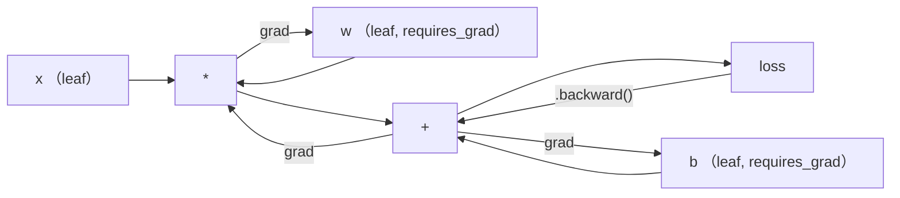
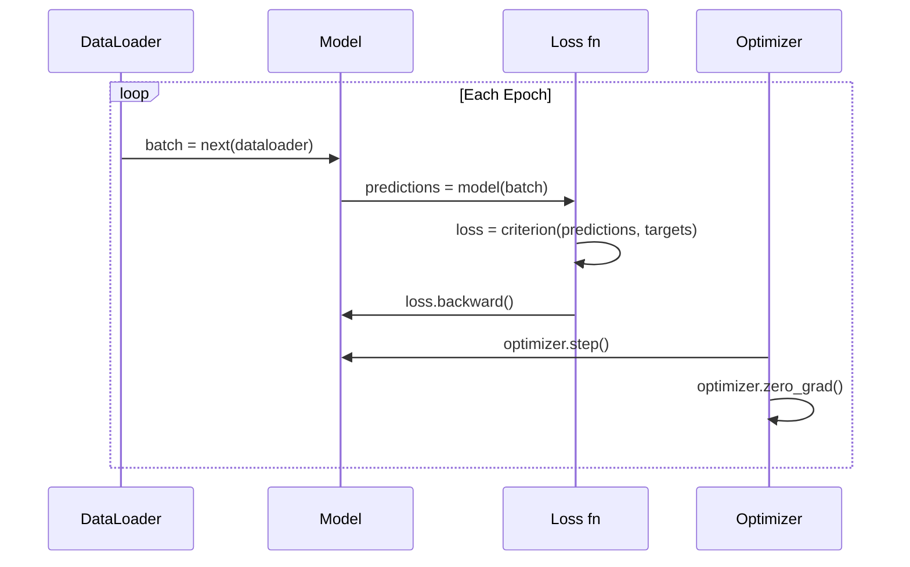

# PyTorch 入门

> 译注：本文译自同目录 [`en.md`](./en.md)。术语遵循仓根 [TRANSLATION_GUIDE.md](../../../../TRANSLATION_GUIDE.md)。

> 你已经用活塞和曲轴造好了一台引擎。现在去学一台大家真正在开的。

**Type:** Build
**Languages:** Python
**Prerequisites:** Lesson 03.10 (Build Your Own Mini Framework)
**Time:** ~75 minutes

## 学习目标（Learning Objectives）

- 用 PyTorch 的 nn.Module、nn.Sequential 和 autograd 搭建并训练神经网络
- 用 PyTorch tensor、GPU 加速以及标准训练循环（zero_grad、forward、loss、backward、step）
- 把你从零写的 mini framework 各个组件换成 PyTorch 对应实现
- 在同一任务上对比并 profile 你的纯 Python 框架与 PyTorch 的训练速度

## 问题（The Problem）

你已经有一个能跑的 mini framework：Linear 层、ReLU、dropout、batch norm、Adam、一个 DataLoader、一个训练循环。它在一个圆形分类问题上以纯 Python 训练一个 4 层网络。

它在同一问题上也比 PyTorch 慢 500 倍。

你的 mini framework 用嵌套 Python 循环一次只处理一个样本。PyTorch 把同样的算子分发给优化过的 C++/CUDA kernel，跑在 GPU 上。在单卡 NVIDIA A100 上，PyTorch 在 ImageNet（128 万张图）上训练 ResNet-50（2560 万参数）大约只要 6 小时。同样的任务，你那个框架大概要 3000 小时——前提是它没先 OOM。

速度还不是唯一的差距。你的框架没有 GPU 支持。没有自动微分——每个 module 的 backward() 都是你手写的。没有序列化。没有分布式训练。没有 mixed precision。除了 print 之外没有任何办法 debug 梯度流。

PyTorch 把这些坑全都填上了。而且它在做这些事的时候，沿用的还是你已经建立起来的那套心智模型：Module、forward()、parameters()、backward()、optimizer.step()。概念是一一对应的，语法几乎一模一样。区别在于 PyTorch 在你从零设计出来的同一个接口背后，封装了十年的系统工程。

## 概念（The Concept）

### 为什么是 PyTorch 赢了（Why PyTorch Won）

2015 年，TensorFlow 要求你先定义一张静态计算图，然后才能跑任何东西。你先把图搭起来，编译，再把数据喂进去。debug 意味着盯着计算图可视化看。改架构意味着把图从头重搭。

PyTorch 在 2017 年带着完全不同的哲学登场：eager execution（即时执行）。你写 Python，它立刻就跑。`y = model(x)` 当下就把 y 算出来，而不是「往一张图里加一个节点，让它待会儿去算 y」。这意味着标准 Python debug 工具能用。print() 能用。pdb 能用。在 forward 里写 if/else 也能用。

到了 2020 年，市场已经表态。PyTorch 在 ML 研究论文里的占比从 2017 年的 7% 涨到 2022 年超过 75%。Meta、Google DeepMind、OpenAI、Anthropic 和 Hugging Face 都把 PyTorch 当主框架。TensorFlow 2.x 也作为回应改成了 eager execution——这等于默认了 PyTorch 的设计是对的。

教训是：开发者体验会复利。一个慢 10% 但 debug 快 50% 的框架每次都能赢。

### 张量（Tensors）

一个 tensor（张量）是一个多维数组，有三个关键属性：shape、dtype 和 device。

```python
import torch

x = torch.zeros(3, 4)           # shape: (3, 4), dtype: float32, device: cpu
x = torch.randn(2, 3, 224, 224) # batch of 2 RGB images, 224x224
x = torch.tensor([1, 2, 3])     # from a Python list
```

**Shape** 是维度。标量是 shape ()，向量是 (n,)，矩阵是 (m, n)，一个 batch 的图像是 (batch, channels, height, width)。

**Dtype** 决定精度和内存。

| dtype | 位数 | 范围 | 用途 |
|-------|------|-------|----------|
| float32 | 32 | ~7 位十进制 | 默认训练 |
| float16 | 16 | ~3.3 位十进制 | mixed precision |
| bfloat16 | 16 | 范围与 float32 相同，精度更低 | LLM 训练 |
| int8 | 8 | -128 到 127 | 量化推理 |

**Device** 决定计算发生在哪里。

```python
device = torch.device("cuda" if torch.cuda.is_available() else "cpu")
x = torch.randn(3, 4, device=device)
x = x.to("cuda")
x = x.cpu()
```

每个算子都要求所有 tensor 在同一个 device 上。这是新手最常踩到的 PyTorch 错误：`RuntimeError: Expected all tensors to be on the same device`。修复方法是计算前把所有东西都搬到同一个 device。

**Reshape** 是常数时间——它改的是元数据，不是数据本身。

```python
x = torch.randn(2, 3, 4)
x.view(2, 12)      # reshape to (2, 12) -- must be contiguous
x.reshape(6, 4)    # reshape to (6, 4) -- works always
x.permute(2, 0, 1) # reorder dimensions
x.unsqueeze(0)     # add dimension: (1, 2, 3, 4)
x.squeeze()        # remove size-1 dimensions
```

### Autograd

你的 mini framework 要求你为每个 module 实现 backward()。PyTorch 不用。它把每个对 tensor 的算子记录到一张有向无环图（计算图）里，然后反向遍历这张图来自动算梯度。



和你的框架的关键区别是：PyTorch 用的是基于 tape 的自动微分。前向过程中每个算子都会往一条「磁带」上追加一项。调用 `.backward()` 就是把这条磁带反向回放。

```python
x = torch.randn(3, requires_grad=True)
y = x ** 2 + 3 * x
z = y.sum()
z.backward()
print(x.grad)  # dz/dx = 2x + 3
```

Autograd 的三条规则：

1. 只有 `requires_grad=True` 的 leaf tensor（叶子张量）会累积梯度
2. 梯度默认是累积的——每次 backward 之前要调用 `optimizer.zero_grad()`
3. `torch.no_grad()` 关闭梯度跟踪（评估时用）

### nn.Module

`nn.Module` 是 PyTorch 里每个神经网络组件的基类。这个抽象你在第 10 课已经造过了。PyTorch 这版多了：自动参数注册、递归 module 发现、device 管理、state dict 序列化。

```python
import torch.nn as nn

class MLP(nn.Module):
    def __init__(self, input_dim, hidden_dim, output_dim):
        super().__init__()
        self.layer1 = nn.Linear(input_dim, hidden_dim)
        self.relu = nn.ReLU()
        self.layer2 = nn.Linear(hidden_dim, output_dim)

    def forward(self, x):
        x = self.layer1(x)
        x = self.relu(x)
        x = self.layer2(x)
        return x
```

当你在 `__init__` 里把一个 `nn.Module` 或 `nn.Parameter` 赋给某个属性时，PyTorch 会自动注册它。`model.parameters()` 会递归收集每一个注册过的参数。这就是为什么你不再像在 mini framework 里那样手动收集权重。

关键构件：

| Module | 作用 | 参数量 |
|--------|-------------|------------|
| nn.Linear(in, out) | Wx + b | in*out + out |
| nn.Conv2d(in_ch, out_ch, k) | 二维卷积 | in_ch*out_ch*k*k + out_ch |
| nn.BatchNorm1d(features) | 归一化激活 | 2 * features |
| nn.Dropout(p) | 随机置零 | 0 |
| nn.ReLU() | max(0, x) | 0 |
| nn.GELU() | Gaussian error linear | 0 |
| nn.Embedding(vocab, dim) | 查表 | vocab * dim |
| nn.LayerNorm(dim) | 单样本归一化 | 2 * dim |

### 损失函数与优化器（Loss Functions and Optimizers）

PyTorch 自带了你造过的所有东西的生产级版本。

**损失函数**（来自 `torch.nn`）：

| Loss | 任务 | 输入 |
|------|------|-------|
| nn.MSELoss() | 回归 | 任意 shape |
| nn.CrossEntropyLoss() | 多分类 | logits（不是 softmax 之后） |
| nn.BCEWithLogitsLoss() | 二分类 | logits（不是 sigmoid 之后） |
| nn.L1Loss() | 回归（鲁棒） | 任意 shape |
| nn.CTCLoss() | 序列对齐 | log 概率 |

注意：`CrossEntropyLoss` 内部把 `LogSoftmax` 和 `NLLLoss` 合在一起。传入原始 logits，不是 softmax 输出。这是一个常见错误，会无声无息地产生错误的梯度。

**优化器**（来自 `torch.optim`）：

| Optimizer | 何时用 | 典型 learning rate |
|-----------|-------------|-----------|
| SGD(params, lr, momentum) | CNN，调好的流水线 | 0.01--0.1 |
| Adam(params, lr) | 默认起点 | 1e-3 |
| AdamW(params, lr, weight_decay) | transformer、微调 | 1e-4--1e-3 |
| LBFGS(params) | 小规模、二阶 | 1.0 |

### 训练循环（The Training Loop）

每个 PyTorch 训练循环都遵循同样的 5 步模式。第 10 课你已经知道了。



经典模式：

```python
for epoch in range(num_epochs):
    model.train()
    for inputs, targets in train_loader:
        inputs, targets = inputs.to(device), targets.to(device)
        optimizer.zero_grad()
        outputs = model(inputs)
        loss = criterion(outputs, targets)
        loss.backward()
        optimizer.step()
```

batch 循环里就这五行。这五行训练出了 GPT-4、Stable Diffusion 和 LLaMA。架构会变，数据会变，这五行不会变。

### Dataset 和 DataLoader

PyTorch 的 `Dataset` 是一个抽象类，有两个方法：`__len__` 和 `__getitem__`。`DataLoader` 在它外面包了一层，提供 batching、shuffle 和多进程数据加载。

```python
from torch.utils.data import Dataset, DataLoader

class MNISTDataset(Dataset):
    def __init__(self, images, labels):
        self.images = images
        self.labels = labels

    def __len__(self):
        return len(self.labels)

    def __getitem__(self, idx):
        return self.images[idx], self.labels[idx]

loader = DataLoader(dataset, batch_size=64, shuffle=True, num_workers=4)
```

`num_workers=4` 会派 4 个进程并行加载数据，与此同时 GPU 还在训练当前 batch。在磁盘瓶颈的工作负载（大图、音频）上，光这一项就能把训练速度翻倍。

### GPU 训练（GPU Training）

把 model 搬到 GPU：

```python
device = torch.device("cuda" if torch.cuda.is_available() else "cpu")
model = model.to(device)
```

它会递归把每个参数和 buffer 搬到 GPU。然后训练时把每个 batch 也搬过去：

```python
inputs, targets = inputs.to(device), targets.to(device)
```

**Mixed precision**（混合精度）在现代 GPU（A100、H100、RTX 4090）上能把内存占用减半，吞吐翻倍——做法是用 float16 跑前向/反向，同时把 master 权重保留为 float32：

```python
from torch.amp import autocast, GradScaler

scaler = GradScaler()
for inputs, targets in loader:
    with autocast(device_type="cuda"):
        outputs = model(inputs)
        loss = criterion(outputs, targets)
    scaler.scale(loss).backward()
    scaler.step(optimizer)
    scaler.update()
    optimizer.zero_grad()
```

### 对比：Mini Framework vs PyTorch vs JAX（Comparison: Mini Framework vs PyTorch vs JAX）

| 特性 | Mini Framework (L10) | PyTorch | JAX |
|---------|---------------------|---------|-----|
| 自动微分 | 手写 backward() | 基于 tape 的 autograd | 函数式 transform |
| 执行 | Eager（Python 循环） | Eager（C++ kernel） | Trace + JIT 编译 |
| GPU 支持 | 无 | 有（CUDA、ROCm、MPS） | 有（CUDA、TPU） |
| 速度（MNIST MLP） | ~300s/epoch | ~0.5s/epoch | ~0.3s/epoch |
| Module 系统 | 自定义 Module 类 | nn.Module | 无状态函数（Flax/Equinox） |
| Debug | print() | print()、pdb、breakpoint() | 更难（JIT trace 把 print 弄坏） |
| 生态 | 无 | Hugging Face、Lightning、timm | Flax、Optax、Orbax |
| 学习曲线 | 你自己造 | 中等 | 陡峭（函数式范式） |
| 生产使用 | 玩具问题 | Meta、OpenAI、Anthropic、HF | Google DeepMind、Midjourney |

## 动手实现（Build It）

只用 PyTorch 原语在 MNIST 上训一个 3 层 MLP。不用高层封装，不用 `torchvision.datasets`。我们自己下载并解析原始数据。

### 第一步：从原始文件加载 MNIST（Step 1: Load MNIST From Raw Files）

MNIST 以 4 个 gzip 文件形式发布：训练图像（60,000 x 28 x 28）、训练 label、测试图像（10,000 x 28 x 28）、测试 label。我们下载它们并解析二进制格式。

```python
import torch
import torch.nn as nn
import struct
import gzip
import urllib.request
import os

def download_mnist(path="./mnist_data"):
    base_url = "https://storage.googleapis.com/cvdf-datasets/mnist/"
    files = [
        "train-images-idx3-ubyte.gz",
        "train-labels-idx1-ubyte.gz",
        "t10k-images-idx3-ubyte.gz",
        "t10k-labels-idx1-ubyte.gz",
    ]
    os.makedirs(path, exist_ok=True)
    for f in files:
        filepath = os.path.join(path, f)
        if not os.path.exists(filepath):
            urllib.request.urlretrieve(base_url + f, filepath)

def load_images(filepath):
    with gzip.open(filepath, "rb") as f:
        magic, num, rows, cols = struct.unpack(">IIII", f.read(16))
        data = f.read()
        images = torch.frombuffer(bytearray(data), dtype=torch.uint8)
        images = images.reshape(num, rows * cols).float() / 255.0
    return images

def load_labels(filepath):
    with gzip.open(filepath, "rb") as f:
        magic, num = struct.unpack(">II", f.read(8))
        data = f.read()
        labels = torch.frombuffer(bytearray(data), dtype=torch.uint8).long()
    return labels
```

### 第二步：定义模型（Step 2: Define the Model）

一个 3 层 MLP：784 -> 256 -> 128 -> 10。ReLU 激活函数。用 dropout 做正则化。不用 batch norm，保持简单。

```python
class MNISTModel(nn.Module):
    def __init__(self):
        super().__init__()
        self.net = nn.Sequential(
            nn.Linear(784, 256),
            nn.ReLU(),
            nn.Dropout(0.2),
            nn.Linear(256, 128),
            nn.ReLU(),
            nn.Dropout(0.2),
            nn.Linear(128, 10),
        )

    def forward(self, x):
        return self.net(x)
```

输出层产出 10 个原始 logits（每个数字一个）。不要 softmax——`CrossEntropyLoss` 内部会处理。

参数量：784*256 + 256 + 256*128 + 128 + 128*10 + 10 = 235,146。以现代标准看是个小不点。GPT-2 small 有 1.24 亿。这个模型几秒就能训完。

### 第三步：训练循环（Step 3: Training Loop）

经典的 forward-loss-backward-step 模式。

```python
def train_one_epoch(model, loader, criterion, optimizer, device):
    model.train()
    total_loss = 0
    correct = 0
    total = 0
    for images, labels in loader:
        images, labels = images.to(device), labels.to(device)
        optimizer.zero_grad()
        outputs = model(images)
        loss = criterion(outputs, labels)
        loss.backward()
        optimizer.step()
        total_loss += loss.item() * images.size(0)
        _, predicted = outputs.max(1)
        correct += predicted.eq(labels).sum().item()
        total += labels.size(0)
    return total_loss / total, correct / total


def evaluate(model, loader, criterion, device):
    model.eval()
    total_loss = 0
    correct = 0
    total = 0
    with torch.no_grad():
        for images, labels in loader:
            images, labels = images.to(device), labels.to(device)
            outputs = model(images)
            loss = criterion(outputs, labels)
            total_loss += loss.item() * images.size(0)
            _, predicted = outputs.max(1)
            correct += predicted.eq(labels).sum().item()
            total += labels.size(0)
    return total_loss / total, correct / total
```

注意评估时的 `torch.no_grad()`。它关闭 autograd，降低内存使用、加速推理。不写它，PyTorch 会构建一张你根本用不到的计算图。

### 第四步：把所有东西连起来（Step 4: Wire Everything Together）

```python
def main():
    device = torch.device("cuda" if torch.cuda.is_available() else "cpu")

    download_mnist()
    train_images = load_images("./mnist_data/train-images-idx3-ubyte.gz")
    train_labels = load_labels("./mnist_data/train-labels-idx1-ubyte.gz")
    test_images = load_images("./mnist_data/t10k-images-idx3-ubyte.gz")
    test_labels = load_labels("./mnist_data/t10k-labels-idx1-ubyte.gz")

    train_dataset = torch.utils.data.TensorDataset(train_images, train_labels)
    test_dataset = torch.utils.data.TensorDataset(test_images, test_labels)
    train_loader = torch.utils.data.DataLoader(
        train_dataset, batch_size=64, shuffle=True
    )
    test_loader = torch.utils.data.DataLoader(
        test_dataset, batch_size=256, shuffle=False
    )

    model = MNISTModel().to(device)
    criterion = nn.CrossEntropyLoss()
    optimizer = torch.optim.Adam(model.parameters(), lr=1e-3)

    num_params = sum(p.numel() for p in model.parameters())
    print(f"Device: {device}")
    print(f"Parameters: {num_params:,}")
    print(f"Train samples: {len(train_dataset):,}")
    print(f"Test samples: {len(test_dataset):,}")
    print()

    for epoch in range(10):
        train_loss, train_acc = train_one_epoch(
            model, train_loader, criterion, optimizer, device
        )
        test_loss, test_acc = evaluate(
            model, test_loader, criterion, device
        )
        print(
            f"Epoch {epoch+1:2d} | "
            f"Train Loss: {train_loss:.4f} | Train Acc: {train_acc:.4f} | "
            f"Test Loss: {test_loss:.4f} | Test Acc: {test_acc:.4f}"
        )

    torch.save(model.state_dict(), "mnist_mlp.pt")
    print(f"\nModel saved to mnist_mlp.pt")
    print(f"Final test accuracy: {test_acc:.4f}")
```

10 epoch 后期望的输出：约 97.8% 的测试准确率。CPU 训练时间：约 30 秒。GPU：约 5 秒。同样架构在你的 mini framework 上：约 45 分钟。

## 用起来（Use It）

### 快速对照：Mini Framework vs PyTorch（Quick Comparison: Mini Framework vs PyTorch）

| Mini Framework（第 10 课） | PyTorch |
|---------------------------|---------|
| `model = Sequential(Linear(784, 256), ReLU(), ...)` | `model = nn.Sequential(nn.Linear(784, 256), nn.ReLU(), ...)` |
| `pred = model.forward(x)` | `pred = model(x)` |
| `optimizer.zero_grad()` | `optimizer.zero_grad()` |
| `grad = criterion.backward()` 然后 `model.backward(grad)` | `loss.backward()` |
| `optimizer.step()` | `optimizer.step()` |
| 没有 GPU | `model.to("cuda")` |
| 每个 module 都要手写 backward | autograd 全包了 |

接口几乎一模一样。区别在于底层那一切。

### 保存与加载模型（Saving and Loading Models）

```python
torch.save(model.state_dict(), "model.pt")

model = MNISTModel()
model.load_state_dict(torch.load("model.pt", weights_only=True))
model.eval()
```

永远保存 `state_dict()`（参数字典），不要保存 model 对象。保存对象用的是 pickle，重构代码后就会坏掉。state dict 是可移植的。

### 学习率调度（Learning Rate Scheduling）

```python
scheduler = torch.optim.lr_scheduler.CosineAnnealingLR(
    optimizer, T_max=10
)
for epoch in range(10):
    train_one_epoch(model, train_loader, criterion, optimizer, device)
    scheduler.step()
```

PyTorch 自带 15 个以上 scheduler：StepLR、ExponentialLR、CosineAnnealingLR、OneCycleLR、ReduceLROnPlateau。它们全都接同一个 optimizer 接口。

## 上线部署（Ship It）

这一课产出两个 artifact：

- `outputs/prompt-pytorch-debugger.md` —— 一个用于诊断常见 PyTorch 训练失败的 prompt
- `outputs/skill-pytorch-patterns.md` —— 一份 PyTorch 训练模式的 skill 参考

## 练习（Exercises）

1. **加上 batch normalization。** 在每个 linear 层之后（激活函数之前）插入 `nn.BatchNorm1d`。和只用 dropout 的版本对比测试准确率和训练速度。Batch norm 应该能在更少 epoch 内冲到 98%+。

2. **实现一个 learning rate finder。** 用从 1e-7 到 1.0 指数递增的 learning rate 训练一个 epoch。画 loss vs LR 曲线。最佳 LR 就在 loss 开始上扬之前。用它给 MNIST 模型选一个更好的 LR。

3. **移植到 GPU + mixed precision。** 给训练循环加上 `torch.amp.autocast` 和 `GradScaler`。在 GPU 上分别测有/没有 mixed precision 的吞吐（samples/second）。在 A100 上预期约 2 倍加速。

4. **写一个自定义 Dataset。** 下载 Fashion-MNIST（格式与 MNIST 相同，但内容是衣物）。实现一个带 `__getitem__` 和 `__len__` 的 `FashionMNISTDataset(Dataset)` 类。训同一个 MLP，对比准确率。Fashion-MNIST 更难——预期约 88% vs 约 98%。

5. **把 Adam 换成 SGD + momentum。** 用 `SGD(params, lr=0.01, momentum=0.9)` 训练。对比收敛曲线。然后加一个 `CosineAnnealingLR` scheduler，看看到第 10 epoch 时 SGD 是否能追上 Adam。

## 关键术语（Key Terms）

| 术语 | 大家通常这样说 | 它实际是什么 |
|------|----------------|----------------------|
| Tensor | 「一个多维数组」 | 一个有类型、感知 device 的数组，每个算子里都内建了自动微分支持 |
| Autograd | 「自动 backprop」 | 一套基于 tape 的系统，前向时记录算子，反向回放以算出精确梯度 |
| nn.Module | 「一层」 | 任意可微计算块的基类——注册参数、支持嵌套、处理 train/eval 模式 |
| state_dict | 「模型权重」 | 一个把参数名映射到 tensor 的 OrderedDict——已训练模型的可移植、可序列化表示 |
| .backward() | 「算梯度」 | 反向遍历计算图，给每个 `requires_grad=True` 的 leaf tensor 计算并累加梯度 |
| .to(device) | 「搬到 GPU」 | 递归把所有参数和 buffer 转移到指定 device（CPU、CUDA、MPS） |
| DataLoader | 「数据流水线」 | 一个迭代器，从 Dataset 做 batching、shuffle，并可选地并行加载数据 |
| Mixed precision | 「用 float16」 | 用 float16 跑前向/反向以求速度，同时保留 float32 master 权重以保证数值稳定 |
| Eager execution | 「现在就跑」 | 算子被调用时立刻执行，而不是延后到某个编译步骤——这是把 PyTorch 与 TF 1.x 区分开的核心设计选择 |
| zero_grad | 「重置梯度」 | 在下一次 backward 之前把所有参数梯度置零，因为 PyTorch 默认会累积梯度 |

## 延伸阅读（Further Reading）

- Paszke et al., "PyTorch: An Imperative Style, High-Performance Deep Learning Library" (2019) —— 阐述 PyTorch 设计权衡的原始论文
- PyTorch Tutorials: "Learning PyTorch with Examples" (https://pytorch.org/tutorials/beginner/pytorch_with_examples.html) —— 从 tensor 到 nn.Module 的官方路径
- PyTorch Performance Tuning Guide (https://pytorch.org/tutorials/recipes/recipes/tuning_guide.html) —— mixed precision、DataLoader workers、pinned memory 等生产环境优化
- Horace He, "Making Deep Learning Go Brrrr" (https://horace.io/brrr_intro.html) —— 为什么 GPU 训练快，以及 PyTorch 专属的优化策略
