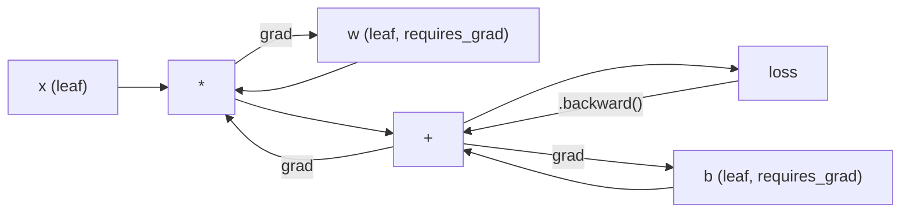
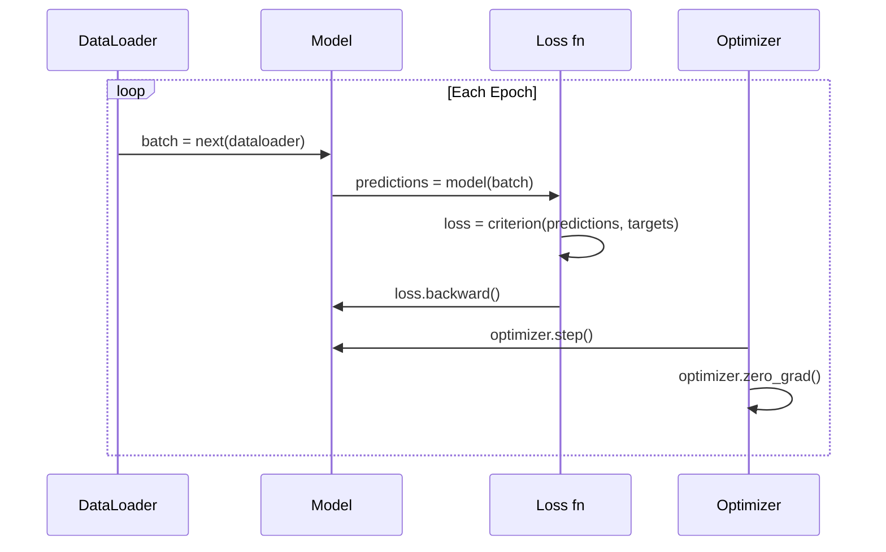

# PyTorch简介

> 你用活塞和曲轴制造了引擎。现在学大家都开的那辆。

** 类型：** 构建
** 语言：** Python
** 先决条件：** 第03.10课（构建您自己的迷你框架）
** 时间：** ~75分钟

## 学习目标

- 使用PyTorch的nn.Module、nn.Sequential和autograd构建和训练神经网络
- 使用PyTorch张量、图形处理器加速和标准训练循环（zero_grad、forward、loss、backward、Step）
- 将从头开始的迷你框架组件转换为其PyTorch等效组件
- 分析并比较纯Python框架和PyTorch在同一任务上的训练速度

## 问题

您有一个可用的迷你框架。线性层、ReLU、dropout、批量规范、Adam、数据加载器、训练循环。它在纯Python中训练4层网络解决圆分类问题。

在同一问题上，它的速度也比PyTorch慢500倍。

您的迷你框架使用嵌套的Python循环一次处理一个样本。PyTorch将相同的操作调度到在图形处理器上运行的优化C++/CUDA内核。在单个NVIDIA A100上，PyTorch在ImageNet（1.28万张图像）上训练ResNet-50（2560万个参数）。如果框架没有首先耗尽内存的话，您的框架大约需要3，000个小时来完成同一任务。

速度并不是唯一的差距。您的框架不支持图形处理器。没有自动区分--您为每个模块手写了向后（）。没有序列化。没有分布式培训。没有混合的精确度。如果没有打印声明，就无法调试梯度流。

PyTorch填补了其中的每一个空白。它在这样做的同时保持您已经构建的完全相同的心理模型：模块、forward（）、parties（）、backward（）、optimizer.Step（）。概念一一转移。语法几乎相同。不同之处在于，PyTorch将十年的系统工程经验包裹在您从头开始设计的同一界面后面。

## 概念

### 为什么PyTorch赢了

2015年，TensorFlow要求您在运行任何内容之前定义静态计算图。您构建了图表、编译它，然后通过它输入数据。收件箱意味着盯着图表可视化。改变架构意味着从头开始重建图表。

PyTorch于2017年推出，其理念不同：渴望执行。你写Python。它立即运行。' y =模型（x）'实际上是现在计算y，而不是“将一个节点添加到稍后将计算y的图中”。“这意味着标准的Python调试工具可以工作。print（）有效。DPD起作用了。如果/否则您的向前传球有效。

到了2020年，市场已经发声。PyTorch在ML研究论文中的份额从7%（2017年）上升到超过75%（2022年）。Meta、Google DeepMind、OpenAI、Anthropic和Hugging Face都使用PyTorch作为其主要框架。TensorFlow 2.x采取了热切的执行作为回应--默认PyTorch的设计是正确的。

教训：开发人员体验复合。调试速度慢10%但快50%的框架每次都会获胜。

### 张量

张量是一个多维数组，具有三个关键属性：形状，dtype和设备。

```python
import torch

x = torch.zeros(3, 4)           # shape: (3, 4), dtype: float32, device: cpu
x = torch.randn(2, 3, 224, 224) # batch of 2 RGB images, 224x224
x = torch.tensor([1, 2, 3])     # from a Python list
```

**Shape** 是维度。纯量是Shape（），vector是（n，），矩阵是（m，n），一批图像是（batch、channels、height、height）。

**Dtype** 控制精度和内存。

| dtype | 比特 | 范围 | 用例 |
|-------|------|-------|----------|
| float32 | 32 | ~7个小数位 | 默认培训 |
| float16 | 16 | ~3.3个小数位 | 混合精度 |
| bfloat 16 | 16 | 与float 32范围相同，精度较低 | 法学硕士培训 |
| int8 | 8 | -128至127 | 量化推断 |

** 设备 ** 确定计算发生的位置。

```python
device = torch.device("cuda" if torch.cuda.is_available() else "cpu")
x = torch.randn(3, 4, device=device)
x = x.to("cuda")
x = x.cpu()
```

每个操作都需要同一设备上的所有张量。这是初学者遇到的第一个PyTorch错误：“RuntimeHelp：期望所有张量位于同一设备上”。通过在计算之前将所有内容移至同一设备来修复它。

** 重塑 ** 是恒定时间的--它更改的是元数据，而不是数据。

```python
x = torch.randn(2, 3, 4)
x.view(2, 12)      # reshape to (2, 12) -- must be contiguous
x.reshape(6, 4)    # reshape to (6, 4) -- works always
x.permute(2, 0, 1) # reorder dimensions
x.unsqueeze(0)     # add dimension: (1, 2, 3, 4)
x.squeeze()        # remove size-1 dimensions
```

### Autograd

您的迷你框架要求您为每个模块实现backward（）。PyTorch不。它将张量上的每一个操作记录到有向非环图（计算图）中，然后反向穿越该图以自动计算梯度。



与您的框架的主要区别：PyTorch使用基于磁带的autodiff。在向前传球期间，每个操作都会附加到“磁带”上。调用'.backward（）'会反向重播磁带。

```python
x = torch.randn(3, requires_grad=True)
y = x ** 2 + 3 * x
z = y.sum()
z.backward()
print(x.grad)  # dz/dx = 2x + 3
```

自动毕业的三条规则：

1. 只有具有“needs_grad=True”的叶张量才累积梯度
2. 默认情况下，成员会累积--在每次向后传递之前调用& optimizer.zero_grad（）&
3. ' torch.no_grad（）'禁用梯度跟踪（评估期间使用）

### nn.Module

' nn.模组'是PyTorch中每个神经网络组件的基本类。您已经在第10课中构建了这个抽象。PyTorch的版本添加了自动参数注册、循环模块发现、设备管理和状态dict序列化。

```python
import torch.nn as nn

class MLP(nn.Module):
    def __init__(self, input_dim, hidden_dim, output_dim):
        super().__init__()
        self.layer1 = nn.Linear(input_dim, hidden_dim)
        self.relu = nn.ReLU()
        self.layer2 = nn.Linear(hidden_dim, output_dim)

    def forward(self, x):
        x = self.layer1(x)
        x = self.relu(x)
        x = self.layer2(x)
        return x
```

当您在“_init__'中将“nn. Mode”或“nn. Term”指定为属性时，PyTorch会自动注册它。“modal. parages（）”会循环收集每个注册的参数。这就是为什么您永远不必像在迷你框架中那样手动收集权重。

关键构建模块：

| 模块 | 它所做的 | 参数 |
|--------|-------------|------------|
| nn.线性（进、出） | WX + B | in*out + out |
| nn.Conv2d（in_ch，out_ch，k） | 2D卷积 | in_ch*out_ch*k*k + out_ch |
| nn.BatchNorm 1d（功能） | 使激活正常化 | 2 * 功能 |
| nn.辍学（p） | 随机归零 | 0 |
| nn.ReLU（） | max（0，x） | 0 |
| nn.GELU（） | 高斯线性误差 | 0 |
| nn.嵌入（vocab，dim） | 查找表 | vocab * dim |
| nn.LayerNorm（暗淡） | 每样本标准化 | 2 * 暗淡 |

### 损失函数和优化器

PyTorch交付您所构建的所有内容的生产就绪版本。

** 损失函数 **（来自' torch.nn '）：

| 损失 | 任务 | 输入 |
|------|------|-------|
| nn.MSELoss（） | 回归 | 任何形状 |
| n.CrossEntropyLoss（） | 多类分类 | Logits（不是softmax） |
| nn.BCEWithLogitsLoss（） | 二元分类 | Logits（不是Sigmoid） |
| nn.L1损失（） | 回归（稳健） | 任何形状 |
| nn.CTCLoss（） | 序列比对 | 对数概率 |

注意：“CrossEntropyLoss”在内部组合了“LogSoftmax”+“NLLLoss”。传递原始logits，而不是softmax输出。这是一个常见的错误，会悄无声息地产生错误的渐变。

** 优化器 **（来自“torch.optim”）：

| 优化器 | 何时使用 | 典型LR |
|-----------|-------------|-----------|
| 新元（参数、lr、动量） | CNN，精心调整的管道 | 0.01--0.1 |
| Adam（params，lr） | 默认起点 | 1e-3 |
| AdamW（参数，lr，weight_decay） | 变形金刚，微调 | 1 e-4--1 e-3 |
| LBFSG（参数） | 小规模、二级 | 1.0 |

### 训练循环

每个PyTorch训练循环都遵循相同的5步模式。您从第10课中已经知道了这一点。



典型模式：

```python
for epoch in range(num_epochs):
    model.train()
    for inputs, targets in train_loader:
        inputs, targets = inputs.to(device), targets.to(device)
        optimizer.zero_grad()
        outputs = model(inputs)
        loss = criterion(outputs, targets)
        loss.backward()
        optimizer.step()
```

Five lines inside the batch loop. Five lines that trained GPT-4, Stable Diffusion, and LLaMA. The architecture changes. The data changes. These five lines do not.

### 数据集和数据加载器

PyTorch的“Dataset”是一个抽象类，具有两个方法：“__len__”和“__getitem__”。“数据加载器”通过MIDI、洗牌和多进程数据加载来包装它。

```python
from torch.utils.data import Dataset, DataLoader

class MNISTDataset(Dataset):
    def __init__(self, images, labels):
        self.images = images
        self.labels = labels

    def __len__(self):
        return len(self.labels)

    def __getitem__(self, idx):
        return self.images[idx], self.labels[idx]

loader = DataLoader(dataset, batch_size=64, shuffle=True, num_workers=4)
```

' num_worker =4 '会产生4个进程来并行加载数据，同时图形处理器训练当前批次。在磁盘绑定的工作负载（大图像、音频）上，仅这一点就可以使训练速度翻倍。

### 图形处理器培训

将模型移动到图形处理器：

```python
device = torch.device("cuda" if torch.cuda.is_available() else "cpu")
model = model.to(device)
```

这会将每个参数和缓冲区递进地移动到图形处理器。然后在培训期间移动每个批次：

```python
inputs, targets = inputs.to(device), targets.to(device)
```

** 混合精度 ** 通过在float 16中向前/向后运行，同时将主权重保持在float 32中，将现代图形处理器（A100、H100、RTX 4090）的内存使用量减半，并使吞吐量翻倍：

```python
from torch.amp import autocast, GradScaler

scaler = GradScaler()
for inputs, targets in loader:
    with autocast(device_type="cuda"):
        outputs = model(inputs)
        loss = criterion(outputs, targets)
    scaler.scale(loss).backward()
    scaler.step(optimizer)
    scaler.update()
    optimizer.zero_grad()
```

### 比较：迷你框架与PyTorch与JAX

| 特征 | 迷你框架（L10） | PyTorch | Jax |
|---------|---------------------|---------|-----|
| Autodiff | 手动向后（） | 基于磁带的自动分级 | 功能转换 |
| 执行 | 渴望（Python循环） | 渴望（C++内核） | 跟踪+及时编译 |
| GPU支持 | 没有 | 是（CUDA、ROCM、MPS） | 是（CUDA、TPU） |
| 速度（MNIST MLP） | ~ 300秒/纪元 | ~ 0.5秒/纪元 | ~ 0.3秒/纪元 |
| 模块系统 | 自定义模块类 | nn.Module | 无状态函数（Flax/Equinox） |
| 调试 | print（） | print（）、ppb、断点（） | 更难（JT跟踪中断打印） |
| 生态系统 | 没有一 | 拥抱脸、闪电、蒂姆 | 亚麻、Optax、Orbax |
| 学习曲线 | 你建造了它 | 中度 | 陡峭（功能范式） |
| 生产使用 | 玩具问题 | Meta、OpenAI、Anthropic、HF | Google DeepMind，Midjourney |

## 建设党

在MNIST上训练的3层MLP仅使用PyTorch原语。没有高级包装器。没有`torchvision.datasets`。我们自己下载并分析原始数据。

### 第1步：从原始文件加载MNIST

MNIST以4个压缩文件形式发货：训练图像（60，000 x 28 x 28）、训练标签、测试图像（10，000 x 28 x 28）、测试标签。我们下载它们并解析二进制格式。

```python
import torch
import torch.nn as nn
import struct
import gzip
import urllib.request
import os

def download_mnist(path="./mnist_data"):
    base_url = "https://storage.googleapis.com/cvdf-datasets/mnist/"
    files = [
        "train-images-idx3-ubyte.gz",
        "train-labels-idx1-ubyte.gz",
        "t10k-images-idx3-ubyte.gz",
        "t10k-labels-idx1-ubyte.gz",
    ]
    os.makedirs(path, exist_ok=True)
    for f in files:
        filepath = os.path.join(path, f)
        if not os.path.exists(filepath):
            urllib.request.urlretrieve(base_url + f, filepath)

def load_images(filepath):
    with gzip.open(filepath, "rb") as f:
        magic, num, rows, cols = struct.unpack(">IIII", f.read(16))
        data = f.read()
        images = torch.frombuffer(bytearray(data), dtype=torch.uint8)
        images = images.reshape(num, rows * cols).float() / 255.0
    return images

def load_labels(filepath):
    with gzip.open(filepath, "rb") as f:
        magic, num = struct.unpack(">II", f.read(8))
        data = f.read()
        labels = torch.frombuffer(bytearray(data), dtype=torch.uint8).long()
    return labels
```

### 第2步：定义模型

3层MLP：784 -> 256 -> 128 -> 10。ReLU激活。辍学以获得正规化。没有批量规范来保持简单。

```python
class MNISTModel(nn.Module):
    def __init__(self):
        super().__init__()
        self.net = nn.Sequential(
            nn.Linear(784, 256),
            nn.ReLU(),
            nn.Dropout(0.2),
            nn.Linear(256, 128),
            nn.ReLU(),
            nn.Dropout(0.2),
            nn.Linear(128, 10),
        )

    def forward(self, x):
        return self.net(x)
```

输出层产生10个原始logit（每个数字一个）。没有softmax --' CrossEntropyLoss '在内部处理该问题。

参数计数：784*256 + 256 + 256*128 + 128 + 128*10 + 10 = 235，146。按照现代标准来看很小。GPT-2小号有124 M。这只需几秒钟即可完成。

### 3.训练循环

典型的向前-损失-后退模式。

```python
def train_one_epoch(model, loader, criterion, optimizer, device):
    model.train()
    total_loss = 0
    correct = 0
    total = 0
    for images, labels in loader:
        images, labels = images.to(device), labels.to(device)
        optimizer.zero_grad()
        outputs = model(images)
        loss = criterion(outputs, labels)
        loss.backward()
        optimizer.step()
        total_loss += loss.item() * images.size(0)
        _, predicted = outputs.max(1)
        correct += predicted.eq(labels).sum().item()
        total += labels.size(0)
    return total_loss / total, correct / total


def evaluate(model, loader, criterion, device):
    model.eval()
    total_loss = 0
    correct = 0
    total = 0
    with torch.no_grad():
        for images, labels in loader:
            images, labels = images.to(device), labels.to(device)
            outputs = model(images)
            loss = criterion(outputs, labels)
            total_loss += loss.item() * images.size(0)
            _, predicted = outputs.max(1)
            correct += predicted.eq(labels).sum().item()
            total += labels.size(0)
    return total_loss / total, correct / total
```

评估期间请注意“torch.no_grad（）”。这会禁用自动分级，减少内存使用并加速推理。如果没有它，PyTorch就会构建一个您从未使用过的计算图。

### 第4步：将一切连接在一起

```python
def main():
    device = torch.device("cuda" if torch.cuda.is_available() else "cpu")

    download_mnist()
    train_images = load_images("./mnist_data/train-images-idx3-ubyte.gz")
    train_labels = load_labels("./mnist_data/train-labels-idx1-ubyte.gz")
    test_images = load_images("./mnist_data/t10k-images-idx3-ubyte.gz")
    test_labels = load_labels("./mnist_data/t10k-labels-idx1-ubyte.gz")

    train_dataset = torch.utils.data.TensorDataset(train_images, train_labels)
    test_dataset = torch.utils.data.TensorDataset(test_images, test_labels)
    train_loader = torch.utils.data.DataLoader(
        train_dataset, batch_size=64, shuffle=True
    )
    test_loader = torch.utils.data.DataLoader(
        test_dataset, batch_size=256, shuffle=False
    )

    model = MNISTModel().to(device)
    criterion = nn.CrossEntropyLoss()
    optimizer = torch.optim.Adam(model.parameters(), lr=1e-3)

    num_params = sum(p.numel() for p in model.parameters())
    print(f"Device: {device}")
    print(f"Parameters: {num_params:,}")
    print(f"Train samples: {len(train_dataset):,}")
    print(f"Test samples: {len(test_dataset):,}")
    print()

    for epoch in range(10):
        train_loss, train_acc = train_one_epoch(
            model, train_loader, criterion, optimizer, device
        )
        test_loss, test_acc = evaluate(
            model, test_loader, criterion, device
        )
        print(
            f"Epoch {epoch+1:2d} | "
            f"Train Loss: {train_loss:.4f} | Train Acc: {train_acc:.4f} | "
            f"Test Loss: {test_loss:.4f} | Test Acc: {test_acc:.4f}"
        )

    torch.save(model.state_dict(), "mnist_mlp.pt")
    print(f"\nModel saved to mnist_mlp.pt")
    print(f"Final test accuracy: {test_acc:.4f}")
```

10个历元后的预期输出：~97.8%测试准确度。中央处理器训练时间：~30秒。在图形处理器上：~5秒。在具有相同架构的迷你框架上：~45分钟。

## 使用它

### 快速比较：迷你框架与PyTorch

| 迷你框架（第10课） | PyTorch |
|---------------------------|---------|
| '模型=顺序（线性（784，256），ReLU（），.）' | '模型= nn.顺序（nn.线性（784，256），nn.ReLU（），.）' |
| ' pred =模型.forward（x）' | ' pred =模型（x）' |
| ' optimizer.zero_grad（）' | ' optimizer.zero_grad（）' |
| ' grad = criteria.backward（）' then ' model.backward（grad）'然后'然后' | ' loss.backward（）' |
| ' optimizer.Step（）' | ' optimizer.Step（）' |
| 没有图形处理器 | ' model.to（“cuda”）' |
| 每个模块手动后退 | Autograd处理一切 |

接口几乎相同。区别在于引擎盖下的一切。

### 保存和加载模型

```python
torch.save(model.state_dict(), "model.pt")

model = MNISTModel()
model.load_state_dict(torch.load("model.pt", weights_only=True))
model.eval()
```

始终保存' State_dict（）'（参数字典），而不是模型对象。保存模型对象使用pickle，当您重构代码时，pickle就会中断。州独裁是可移植的。

### 学习率安排

```python
scheduler = torch.optim.lr_scheduler.CosineAnnealingLR(
    optimizer, T_max=10
)
for epoch in range(10):
    train_one_epoch(model, train_loader, criterion, optimizer, device)
    scheduler.step()
```

PyTorch运送15+个订单：StepLR、ExponentialLR、CosineAnnealingLR、OneCycleLR、ReduceLROnPlateau。所有这些都插入同一个优化器接口。

## 把它运

本课产生了两个工件：

- '输出/prompt-pytorch-debugger.md '--诊断常见PyTorch培训失败的提示
- '输出/skill-pytorch-patterns.md '--PyTorch培训模式的技能参考

## 演习

1. ** 增加批量归一化。**在每个线性层后插入`nn.BatchNorm1d`（激活前）。比较测试准确性和训练速度与仅辍学版本。批量标准应在更少的时期内达到98%+。

2. ** 实现学习率查找器。**训练一个纪元，学习率呈指数级增长（从1 e-7到1.0）。情节损失vs LR。最佳LR是在损失开始攀升之前。使用它为MNIST模型选择更好的LR。

3. ** 以混合精度将端口移植到图形处理器。**将“torch.amp.autocast”和“GradScaler”添加到训练循环中。在图形处理器上使用和不使用混合精度测量吞吐量（样本/秒）。在A100上，预计加速约2倍。

4. ** 构建自定义数据集 **下载Fashion-MNIST（与MNIST相同的格式，但带有服装项目）。用`__getitem__`和`__len__`实现一个`FashionMNISTDataset（Dataset）`类。训练相同的MLP并比较准确度。Fashion-MNIST更难--预计~88% vs ~ 98%。

5. ** 用新加坡元+势头取代Adam。**用“新元（参数，lr=0.01，动量=0.9）”训练。比较收敛曲线。然后添加一个“CosineAnnealingLR”调度程序，看看Singapore是否在第10个纪元之前赶上Adam。

## 关键术语

| Term | 别人怎么说 | 它实际上意味着什么 |
|------|----------------|----------------------|
| 张量 | “多维阵列” | 类型化的设备感知阵列，在每次操作中都内置自动差异化支持 |
| Autograd | “自动背撑” | 一个基于磁带的系统，在正向传递期间记录操作，然后反向回放操作以计算精确的梯度 |
| nn.Module | “一层” | 任何可微计算块的基类--注册参数、支持嵌套、处理训练/求值模式 |
| 州_dict | “模型权重” | 将参数名称映射到张量的Order Dict--训练模型的可移植、可序列化表示 |
| .倒退（） | “计算梯度” | 反向穿越计算图，使用reases_grad=True计算和累积每个叶张量的梯度 |
| .to（设备） | “移至图形处理器” | 将所有参数和缓冲区循环传输到指定设备（中央处理器、CUDA、MPS） |
| DataLoader | “数据管道” | 一个迭代器，可对数据集的数据加载进行批处理、洗牌和可选并行处理 |
| 混合精度 | “使用float 16” | 带浮动16向前/向后以提高速度，同时保持浮动32主重量以提高数字稳定性 |
| Eager execution | “立即运行” | 操作在调用时立即执行，而不是推迟到稍后的编译步骤--这是PyTorch与TF 1.x区分开来的核心设计选择 |
| 零年级 | “重置渐变” | 在下一次向后传递之前将所有参数梯度设置为零，因为PyTorch默认会累积梯度 |

## 进一步阅读

- Paszke等人，“PyTorch：强制风格、高性能深度学习库”（2019）--解释PyTorch设计权衡的原创论文
- PyTorch教程：“用例子学习PyTorch”（https：//pytorch.org/tutorials/Beginner/pytorch_with_examples.html）--从张量到nn的官方路径。模块
- PyTorch性能调优指南（https：//pytorch.org/tutorials/recipes/recipes/tuning_guide.html）--混合精度、数据加载器工作人员、固定内存和其他生产优化
- Horace He，“让深度学习Go Brrrr”（https：//horace.io/brr_intro.html）--为什么图形处理器训练速度很快，采用特定于PyTorch的优化策略
