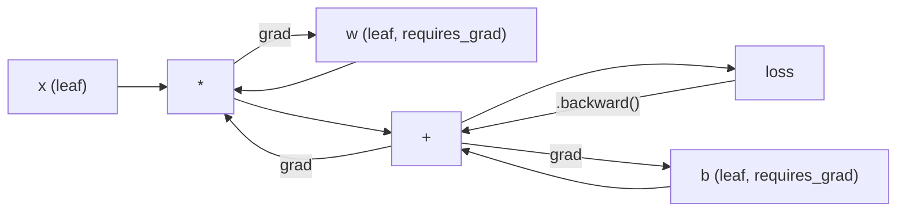
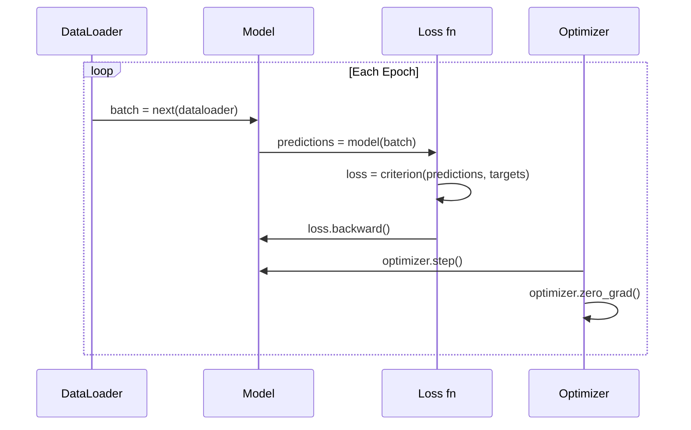

# 11 · PyTorch 入门

> 你已经用活塞和曲轴造出了一台引擎。现在来学习那台所有人真正在开的车。

**类型：** 实战构建
**语言：** Python
**前置：** 课程 03.10（构建你自己的迷你框架）
**时长：** 约 75 分钟

## 学习目标

- 使用 PyTorch 的 nn.Module、nn.Sequential 和 autograd 构建并训练神经网络
- 使用 PyTorch 张量、GPU 加速以及标准训练循环（zero_grad、forward、loss、backward、step）
- 把你从零构建的迷你框架组件转换为对应的 PyTorch 等价实现
- 在同一任务上对纯 Python 框架与 PyTorch 的训练速度进行性能剖析（profile）并对比

## 问题所在

你已经有了一个能工作的迷你框架：线性层、ReLU、dropout、批归一化、Adam、一个 DataLoader、一个训练循环。它用纯 Python 在一个圆形分类问题上训练了一个 4 层网络。

但它在同一个问题上比 PyTorch 慢 500 倍。

你的迷你框架用嵌套的 Python 循环一次处理一个样本。PyTorch 则把同样的运算分派给运行在 GPU 上、经过优化的 C++/CUDA 内核（kernel）。在单张 NVIDIA A100 上，PyTorch 在 ImageNet（128 万张图像）上训练一个 ResNet-50（2560 万参数）大约只需要 6 小时。你的框架在同样的任务上大约要花 3000 小时——前提是它没有先把内存耗尽。

速度并不是唯一的差距。你的框架没有 GPU 支持，没有自动微分（automatic differentiation）——每个模块的 backward() 都得你亲手写。没有序列化，没有分布式训练，没有混合精度，也没法在不靠 print 语句的情况下调试梯度流动。

PyTorch 填补了上述每一个缺口。而且它在做到这些的同时，还保留了你已经构建起来的那套完全相同的心智模型：Module、forward()、parameters()、backward()、optimizer.step()。这些概念一一对应。语法几乎完全相同。区别在于，PyTorch 把十年的系统工程封装在了你从零设计的那套接口背后。

## 核心概念

### PyTorch 为何胜出

2015 年，TensorFlow 要求你在运行任何东西之前先定义一个静态计算图。你先构建图，编译它，然后把数据喂进去。调试意味着盯着图的可视化看。改架构意味着从头重建整张图。

PyTorch 于 2017 年带着另一套哲学登场：即时执行（eager execution）。你写 Python，它立刻运行。`y = model(x)` 现在就真的计算出 y，而不是"往一张稍后才会计算 y 的图里添加一个节点"。这意味着标准的 Python 调试工具都能用。print() 能用，pdb 能用，在前向传播里写 if/else 也能用。

到了 2020 年，市场已经给出了答案。PyTorch 在机器学习研究论文中的占比从 7%（2017 年）涨到了超过 75%（2022 年）。Meta、Google DeepMind、OpenAI、Anthropic 和 Hugging Face 都把 PyTorch 当作主力框架。TensorFlow 2.x 也随之采用了即时执行——这等于默认了 PyTorch 的设计是正确的。

教训是：开发者体验会复利式累积。一个慢 10% 但调试快 50% 的框架每次都会胜出。

### 张量

张量（tensor）是一个多维数组，有三个关键属性：形状（shape）、数据类型（dtype）和设备（device）。

```python
import torch

x = torch.zeros(3, 4)           # 形状: (3, 4), dtype: float32, device: cpu
x = torch.randn(2, 3, 224, 224) # 2 张 RGB 图像组成的 batch, 224x224
x = torch.tensor([1, 2, 3])     # 从 Python 列表创建
```

**形状（shape）** 是维度结构。标量的形状是 ()，向量是 (n,)，矩阵是 (m, n)，一批图像是 (batch, channels, height, width)。

**数据类型（dtype）** 控制精度和内存占用。

| dtype | 位数 | 范围 | 使用场景 |
|-------|------|-------|----------|
| float32 | 32 | 约 7 位十进制有效数字 | 默认训练 |
| float16 | 16 | 约 3.3 位十进制有效数字 | 混合精度 |
| bfloat16 | 16 | 范围与 float32 相同，精度更低 | LLM 训练 |
| int8 | 8 | -128 到 127 | 量化推理 |

**设备（device）** 决定计算发生在哪里。

```python
device = torch.device("cuda" if torch.cuda.is_available() else "cpu")
x = torch.randn(3, 4, device=device)
x = x.to("cuda")
x = x.cpu()
```

每个运算都要求所有张量在同一设备上。这是初学者最常踩的 PyTorch 错误：`RuntimeError: Expected all tensors to be on the same device`。解决方法是在计算前把所有东西都移到同一设备上。

**重塑（reshape）** 是常数时间操作——它改变的是元数据，而非数据本身。

```python
x = torch.randn(2, 3, 4)
x.view(2, 12)      # 重塑为 (2, 12) —— 要求内存连续 (contiguous)
x.reshape(6, 4)    # 重塑为 (6, 4) —— 总是有效
x.permute(2, 0, 1) # 重新排列维度顺序
x.unsqueeze(0)     # 增加一个维度: (1, 2, 3, 4)
x.squeeze()        # 移除所有大小为 1 的维度
```

### Autograd（自动求导）

你的迷你框架要求你为每个模块实现 backward()。PyTorch 不需要。它把对张量的每一个运算记录到一张有向无环图（即计算图）中，然后反向遍历这张图，自动计算梯度。



与你的框架最关键的区别在于：PyTorch 使用基于磁带（tape-based）的自动微分。前向传播过程中，每个运算都会追加到一条"磁带"上。调用 `.backward()` 就是把这条磁带反向回放一遍。

```python
x = torch.randn(3, requires_grad=True)
y = x ** 2 + 3 * x
z = y.sum()
z.backward()
print(x.grad)  # dz/dx = 2x + 3
```

autograd 的三条规则：

1. 只有 `requires_grad=True` 的叶子张量（leaf tensor）才会累积梯度
2. 梯度默认是累加的——在每次反向传播前要调用 `optimizer.zero_grad()`
3. `torch.no_grad()` 会关闭梯度追踪（在评估时使用）

### nn.Module

`nn.Module` 是 PyTorch 中每个神经网络组件的基类。你在课程 10 里已经构建过这个抽象。PyTorch 的版本额外提供了自动参数注册、递归模块发现、设备管理，以及状态字典（state dict）序列化。

```python
import torch.nn as nn

class MLP(nn.Module):
    def __init__(self, input_dim, hidden_dim, output_dim):
        super().__init__()
        self.layer1 = nn.Linear(input_dim, hidden_dim)
        self.relu = nn.ReLU()
        self.layer2 = nn.Linear(hidden_dim, output_dim)

    def forward(self, x):
        x = self.layer1(x)
        x = self.relu(x)
        x = self.layer2(x)
        return x
```

当你在 `__init__` 中把一个 `nn.Module` 或 `nn.Parameter` 赋值为属性时，PyTorch 会自动注册它。`model.parameters()` 会递归地收集每一个已注册的参数。这就是为什么你再也不必像在迷你框架里那样手动收集权重。

关键构建模块：

| 模块 | 作用 | 参数量 |
|--------|-------------|------------|
| nn.Linear(in, out) | Wx + b | in*out + out |
| nn.Conv2d(in_ch, out_ch, k) | 二维卷积 | in_ch*out_ch*k*k + out_ch |
| nn.BatchNorm1d(features) | 归一化激活值 | 2 * features |
| nn.Dropout(p) | 随机置零 | 0 |
| nn.ReLU() | max(0, x) | 0 |
| nn.GELU() | 高斯误差线性单元 | 0 |
| nn.Embedding(vocab, dim) | 查找表 | vocab * dim |
| nn.LayerNorm(dim) | 逐样本归一化 | 2 * dim |

### 损失函数与优化器

PyTorch 自带了你所构建的一切的生产级版本。

**损失函数**（来自 `torch.nn`）：

| 损失函数 | 任务 | 输入 |
|------|------|------|
| nn.MSELoss() | 回归 | 任意形状 |
| nn.CrossEntropyLoss() | 多分类 | Logits（不是 softmax） |
| nn.BCEWithLogitsLoss() | 二分类 | Logits（不是 sigmoid） |
| nn.L1Loss() | 回归（鲁棒） | 任意形状 |
| nn.CTCLoss() | 序列对齐 | 对数概率 |

注意：`CrossEntropyLoss` 在内部组合了 `LogSoftmax` + `NLLLoss`。要传入原始 logits，而不是 softmax 之后的输出。这是一个常见错误，它会悄无声息地产生错误的梯度。

**优化器**（来自 `torch.optim`）：

| 优化器 | 使用时机 | 典型学习率 |
|-----------|-------------|-----------|
| SGD(params, lr, momentum) | CNN、调优良好的流水线 | 0.01--0.1 |
| Adam(params, lr) | 默认起点 | 1e-3 |
| AdamW(params, lr, weight_decay) | Transformer、微调 | 1e-4--1e-3 |
| LBFGS(params) | 小规模、二阶方法 | 1.0 |

### 训练循环

每个 PyTorch 训练循环都遵循同样的 5 步模式。你在课程 10 里已经知道这个了。



标准范式：

```python
for epoch in range(num_epochs):
    model.train()
    for inputs, targets in train_loader:
        inputs, targets = inputs.to(device), targets.to(device)
        optimizer.zero_grad()
        outputs = model(inputs)
        loss = criterion(outputs, targets)
        loss.backward()
        optimizer.step()
```

batch 循环里就这五行。就是这五行训练出了 GPT-4、Stable Diffusion 和 LLaMA。架构会变，数据会变，而这五行不变。

### Dataset 与 DataLoader

PyTorch 的 `Dataset` 是一个抽象类，包含两个方法：`__len__` 和 `__getitem__`。`DataLoader` 在它之上封装了批处理、打乱（shuffling）以及多进程数据加载。

```python
from torch.utils.data import Dataset, DataLoader

class MNISTDataset(Dataset):
    def __init__(self, images, labels):
        self.images = images
        self.labels = labels

    def __len__(self):
        return len(self.labels)

    def __getitem__(self, idx):
        return self.images[idx], self.labels[idx]

loader = DataLoader(dataset, batch_size=64, shuffle=True, num_workers=4)
```

`num_workers=4` 会启动 4 个进程并行加载数据，与此同时 GPU 正在当前 batch 上训练。在受磁盘 I/O 制约的工作负载（大图像、音频）上，仅这一项就能让训练速度翻倍。

### GPU 训练

把模型移到 GPU：

```python
device = torch.device("cuda" if torch.cuda.is_available() else "cpu")
model = model.to(device)
```

这会递归地把每个参数和缓冲区（buffer）移到 GPU 上。然后在训练时移动每个 batch：

```python
inputs, targets = inputs.to(device), targets.to(device)
```

**混合精度（mixed precision）** 在现代 GPU（A100、H100、RTX 4090）上能把内存占用减半、吞吐量翻倍：它用 float16 跑前向/反向传播，同时把主权重（master weights）保留为 float32：

```python
from torch.amp import autocast, GradScaler

scaler = GradScaler()
for inputs, targets in loader:
    with autocast(device_type="cuda"):
        outputs = model(inputs)
        loss = criterion(outputs, targets)
    scaler.scale(loss).backward()
    scaler.step(optimizer)
    scaler.update()
    optimizer.zero_grad()
```

### 对比：迷你框架 vs PyTorch vs JAX

| 特性 | 迷你框架（L10） | PyTorch | JAX |
|---------|---------------------|---------|-----|
| 自动微分 | 手写 backward() | 基于磁带的 autograd | 函数式变换 |
| 执行方式 | 即时（Python 循环） | 即时（C++ 内核） | 追踪 + JIT 编译 |
| GPU 支持 | 无 | 有（CUDA、ROCm、MPS） | 有（CUDA、TPU） |
| 速度（MNIST MLP） | 约 300 秒/epoch | 约 0.5 秒/epoch | 约 0.3 秒/epoch |
| 模块系统 | 自定义 Module 类 | nn.Module | 无状态函数（Flax/Equinox） |
| 调试 | print() | print()、pdb、breakpoint() | 更难（JIT 追踪会破坏 print） |
| 生态系统 | 无 | Hugging Face、Lightning、timm | Flax、Optax、Orbax |
| 学习曲线 | 你亲手造的 | 中等 | 陡峭（函数式范式） |
| 生产使用 | 玩具问题 | Meta、OpenAI、Anthropic、HF | Google DeepMind、Midjourney |

## 动手构建

一个仅用 PyTorch 原语训练 MNIST 的 3 层 MLP。不用高层封装，不用 `torchvision.datasets`。我们自己下载并解析原始数据。

### 第 1 步：从原始文件加载 MNIST

MNIST 以 4 个 gzip 压缩文件的形式发布：训练图像（60,000 x 28 x 28）、训练标签、测试图像（10,000 x 28 x 28）、测试标签。我们下载它们并解析其二进制格式。

```python
import torch
import torch.nn as nn
import struct
import gzip
import urllib.request
import os

def download_mnist(path="./mnist_data"):
    base_url = "https://storage.googleapis.com/cvdf-datasets/mnist/"
    files = [
        "train-images-idx3-ubyte.gz",
        "train-labels-idx1-ubyte.gz",
        "t10k-images-idx3-ubyte.gz",
        "t10k-labels-idx1-ubyte.gz",
    ]
    os.makedirs(path, exist_ok=True)
    for f in files:
        filepath = os.path.join(path, f)
        if not os.path.exists(filepath):
            urllib.request.urlretrieve(base_url + f, filepath)

def load_images(filepath):
    with gzip.open(filepath, "rb") as f:
        magic, num, rows, cols = struct.unpack(">IIII", f.read(16))
        data = f.read()
        images = torch.frombuffer(bytearray(data), dtype=torch.uint8)
        images = images.reshape(num, rows * cols).float() / 255.0
    return images

def load_labels(filepath):
    with gzip.open(filepath, "rb") as f:
        magic, num = struct.unpack(">II", f.read(8))
        data = f.read()
        labels = torch.frombuffer(bytearray(data), dtype=torch.uint8).long()
    return labels
```

### 第 2 步：定义模型

一个 3 层 MLP：784 -> 256 -> 128 -> 10。ReLU 激活。用 Dropout 做正则化。不加批归一化，保持简单。

```python
class MNISTModel(nn.Module):
    def __init__(self):
        super().__init__()
        self.net = nn.Sequential(
            nn.Linear(784, 256),
            nn.ReLU(),
            nn.Dropout(0.2),
            nn.Linear(256, 128),
            nn.ReLU(),
            nn.Dropout(0.2),
            nn.Linear(128, 10),
        )

    def forward(self, x):
        return self.net(x)
```

输出层产生 10 个原始 logits（每个数字一个）。不加 softmax——`CrossEntropyLoss` 会在内部处理它。

参数量：784*256 + 256 + 256*128 + 128 + 128*10 + 10 = 235,146。以现代标准看微不足道。GPT-2 small 有 1.24 亿参数。这个模型几秒钟就能训完。

### 第 3 步：训练循环

标准的 forward-loss-backward-step 模式。

```python
def train_one_epoch(model, loader, criterion, optimizer, device):
    model.train()
    total_loss = 0
    correct = 0
    total = 0
    for images, labels in loader:
        images, labels = images.to(device), labels.to(device)
        optimizer.zero_grad()
        outputs = model(images)
        loss = criterion(outputs, labels)
        loss.backward()
        optimizer.step()
        total_loss += loss.item() * images.size(0)
        _, predicted = outputs.max(1)
        correct += predicted.eq(labels).sum().item()
        total += labels.size(0)
    return total_loss / total, correct / total


def evaluate(model, loader, criterion, device):
    model.eval()
    total_loss = 0
    correct = 0
    total = 0
    with torch.no_grad():
        for images, labels in loader:
            images, labels = images.to(device), labels.to(device)
            outputs = model(images)
            loss = criterion(outputs, labels)
            total_loss += loss.item() * images.size(0)
            _, predicted = outputs.max(1)
            correct += predicted.eq(labels).sum().item()
            total += labels.size(0)
    return total_loss / total, correct / total
```

注意评估时使用 `torch.no_grad()`。它会关闭 autograd，从而降低内存占用并加速推理。不加它的话，PyTorch 会构建一张你根本用不到的计算图。

### 第 4 步：把所有部分串起来

```python
def main():
    device = torch.device("cuda" if torch.cuda.is_available() else "cpu")

    download_mnist()
    train_images = load_images("./mnist_data/train-images-idx3-ubyte.gz")
    train_labels = load_labels("./mnist_data/train-labels-idx1-ubyte.gz")
    test_images = load_images("./mnist_data/t10k-images-idx3-ubyte.gz")
    test_labels = load_labels("./mnist_data/t10k-labels-idx1-ubyte.gz")

    train_dataset = torch.utils.data.TensorDataset(train_images, train_labels)
    test_dataset = torch.utils.data.TensorDataset(test_images, test_labels)
    train_loader = torch.utils.data.DataLoader(
        train_dataset, batch_size=64, shuffle=True
    )
    test_loader = torch.utils.data.DataLoader(
        test_dataset, batch_size=256, shuffle=False
    )

    model = MNISTModel().to(device)
    criterion = nn.CrossEntropyLoss()
    optimizer = torch.optim.Adam(model.parameters(), lr=1e-3)

    num_params = sum(p.numel() for p in model.parameters())
    print(f"Device: {device}")
    print(f"Parameters: {num_params:,}")
    print(f"Train samples: {len(train_dataset):,}")
    print(f"Test samples: {len(test_dataset):,}")
    print()

    for epoch in range(10):
        train_loss, train_acc = train_one_epoch(
            model, train_loader, criterion, optimizer, device
        )
        test_loss, test_acc = evaluate(
            model, test_loader, criterion, device
        )
        print(
            f"Epoch {epoch+1:2d} | "
            f"Train Loss: {train_loss:.4f} | Train Acc: {train_acc:.4f} | "
            f"Test Loss: {test_loss:.4f} | Test Acc: {test_acc:.4f}"
        )

    torch.save(model.state_dict(), "mnist_mlp.pt")
    print(f"\nModel saved to mnist_mlp.pt")
    print(f"Final test accuracy: {test_acc:.4f}")
```

训练 10 个 epoch 后的预期输出：约 97.8% 的测试准确率。CPU 上的训练时间：约 30 秒。GPU 上：约 5 秒。在你那个同样架构的迷你框架上：约 45 分钟。

## 上手运用

### 速查对比：迷你框架 vs PyTorch

| 迷你框架（课程 10） | PyTorch |
|---------------------------|---------|
| `model = Sequential(Linear(784, 256), ReLU(), ...)` | `model = nn.Sequential(nn.Linear(784, 256), nn.ReLU(), ...)` |
| `pred = model.forward(x)` | `pred = model(x)` |
| `optimizer.zero_grad()` | `optimizer.zero_grad()` |
| `grad = criterion.backward()` 然后 `model.backward(grad)` | `loss.backward()` |
| `optimizer.step()` | `optimizer.step()` |
| 无 GPU | `model.to("cuda")` |
| 每个模块手写 backward | Autograd 全权处理 |

接口几乎完全相同。区别在于引擎盖下的一切。

### 保存与加载模型

```python
torch.save(model.state_dict(), "model.pt")

model = MNISTModel()
model.load_state_dict(torch.load("model.pt", weights_only=True))
model.eval()
```

永远保存 `state_dict()`（参数字典），而不是模型对象本身。保存模型对象用的是 pickle，当你重构代码时它会失效。状态字典则是可移植的。

### 学习率调度

```python
scheduler = torch.optim.lr_scheduler.CosineAnnealingLR(
    optimizer, T_max=10
)
for epoch in range(10):
    train_one_epoch(model, train_loader, criterion, optimizer, device)
    scheduler.step()
```

PyTorch 自带 15 种以上的调度器：StepLR、ExponentialLR、CosineAnnealingLR、OneCycleLR、ReduceLROnPlateau。它们全都接入同一套优化器接口。

## 交付成果

本课产出两件交付物：

- `outputs/prompt-pytorch-debugger.md` —— 一个用于诊断常见 PyTorch 训练故障的 prompt
- `outputs/skill-pytorch-patterns.md` —— 一份 PyTorch 训练模式的技能参考

## 练习

1. **加入批归一化。** 在每个线性层之后（激活之前）插入 `nn.BatchNorm1d`。对比测试准确率和训练速度与仅用 dropout 的版本。批归一化应该能用更少的 epoch 达到 98%+。

2. **实现一个学习率查找器。** 用指数递增的学习率（从 1e-7 到 1.0）训练一个 epoch。绘制 loss 对 LR 的曲线。最优 LR 就在 loss 开始攀升之前。用它为 MNIST 模型挑一个更好的 LR。

3. **移植到 GPU 并使用混合精度。** 在训练循环中加入 `torch.amp.autocast` 和 `GradScaler`。在 GPU 上测量使用和不使用混合精度时的吞吐量（样本/秒）。在 A100 上，预期约 2 倍加速。

4. **构建一个自定义 Dataset。** 下载 Fashion-MNIST（格式与 MNIST 相同，但内容是服饰物品）。实现一个带 `__getitem__` 和 `__len__` 的 `FashionMNISTDataset(Dataset)` 类。训练同样的 MLP 并对比准确率。Fashion-MNIST 更难——预期约 88% 而非约 98%。

5. **用 SGD + 动量替换 Adam。** 用 `SGD(params, lr=0.01, momentum=0.9)` 训练。对比收敛曲线。然后加上一个 `CosineAnnealingLR` 调度器，看看 SGD 能否在第 10 个 epoch 时追上 Adam。

## 关键术语

| 术语 | 人们怎么说 | 它实际指什么 |
|------|----------------|----------------------|
| 张量（Tensor） | "一个多维数组" | 一个带类型、感知设备的数组，每个运算中都内建了自动微分支持 |
| Autograd | "自动反向传播" | 一套基于磁带的系统，在前向传播时记录运算，然后反向回放来计算精确梯度 |
| nn.Module | "一个层" | 任何可微分计算块的基类——注册参数、支持嵌套、处理 train/eval 模式 |
| state_dict | "模型权重" | 一个把参数名映射到张量的 OrderedDict——已训练模型的可移植、可序列化表示 |
| .backward() | "计算梯度" | 反向遍历计算图，为每个 requires_grad=True 的叶子张量计算并累积梯度 |
| .to(device) | "移到 GPU" | 递归地把所有参数和缓冲区传输到指定设备（CPU、CUDA、MPS） |
| DataLoader | "数据流水线" | 一个迭代器，对来自 Dataset 的数据进行批处理、打乱，并可选地并行加载 |
| 混合精度（Mixed precision） | "用 float16" | 用 float16 跑前向/反向以提速，同时保留 float32 主权重以保证数值稳定性 |
| 即时执行（Eager execution） | "现在就跑" | 运算在被调用时立即执行，而不是推迟到稍后的编译步骤——这是 PyTorch 区别于 TF 1.x 的核心设计选择 |
| zero_grad | "重置梯度" | 在下一次反向传播之前把所有参数梯度清零，因为 PyTorch 默认累加梯度 |

## 延伸阅读

- Paszke 等人，《PyTorch: An Imperative Style, High-Performance Deep Learning Library》（2019）—— 阐释 PyTorch 设计取舍的原始论文
- PyTorch Tutorials：《Learning PyTorch with Examples》(https://pytorch.org/tutorials/beginner/pytorch_with_examples.html) —— 从张量到 nn.Module 的官方学习路径
- PyTorch Performance Tuning Guide (https://pytorch.org/tutorials/recipes/recipes/tuning_guide.html) —— 混合精度、DataLoader workers、固定内存（pinned memory）以及其他生产优化
- Horace He，《Making Deep Learning Go Brrrr》(https://horace.io/brrr_intro.html) —— 为什么 GPU 训练很快，附带 PyTorch 专属的优化策略
