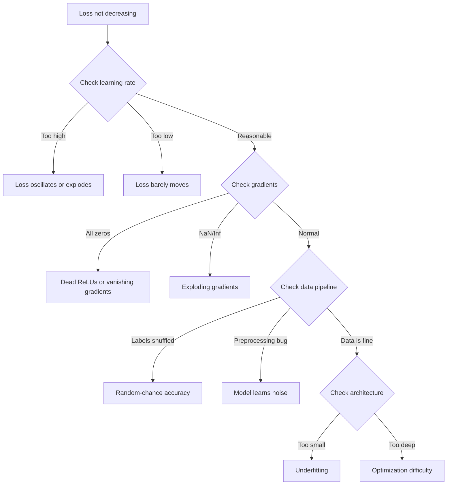
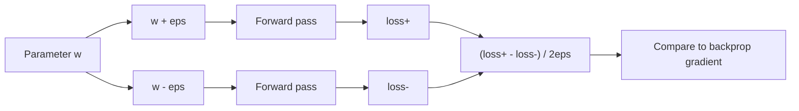
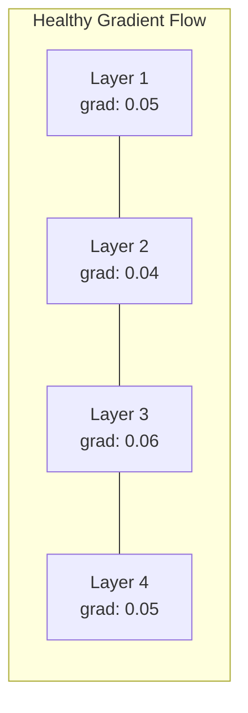
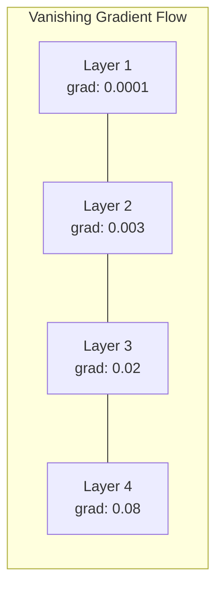
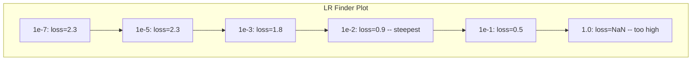

# Neural Networks の Debugging

> network は compile できました。実行もできました。数値も出ました。その数値が間違っていて、何も crash していません。最も難しい種類の debugging へようこそ。error message がない種類です。

**種類:** Practice
**言語:** Python, PyTorch
**前提:** Phase 03 Lessons 01-10（特に backpropagation、loss functions、optimizers）
**時間:** 約 90 分

## 学習目標

- common neural network failures（NaN loss、flat loss curve、overfitting、oscillation）を systematic debugging strategies で診断する
- "overfit one batch" technique を適用し、model architecture と training loop が正しいことを検証する
- gradient magnitudes、activation distributions、weight norms を調べ、vanishing/exploding gradient problems を特定する
- data pipeline、model architecture、loss function、optimizer、learning rate issues を網羅する debugging checklist を作る

## 問題

traditional software は壊れると crash します。null pointer は exception を投げます。type mismatch は compile time に失敗します。off-by-one error は明らかに wrong output を出します。

neural networks はその贅沢を与えてくれません。

壊れた neural network は最後まで実行され、loss value を print し、predictions を出します。loss は下がるかもしれません。predictions はそれらしく見えるかもしれません。しかし model は silently wrong です。shortcuts を学習し、noise を記憶し、役に立たない local minimum に収束します。Google researchers は、ML debugging time の 60-70% が、errors を出さず model quality を劣化させる "silent" bugs に費やされると推定しました。

working model と broken model の違いは、しばしば 1 行の置き場所です。missing `zero_grad()`、transposed dimension、10x ずれた learning rate。canonical "Recipe for Training Neural Networks" (2019) はこう始まります。「最もよくある neural net mistakes は crash しない bugs である」。

この lesson では、それらの bugs を見つける方法を学びます。

## 概念

### Debugging Mindset

print-and-pray debugging は忘れてください。neural network debugging には systematic approach が必要です。feedback loop は遅く（training run あたり minutes to hours）、symptoms は曖昧だからです（bad loss は 20 種類の意味を持ち得ます）。

黄金律: **単純なものから始め、complexity を 1 つずつ追加し、各 piece を独立に検証する。**



### 症状 1: Loss が下がらない

これは最も多い complaint です。training loop は動き、epochs は進みますが、loss は flat のまま、または激しく oscillate します。

**learning rate が wrong。** 高すぎると loss が oscillate するか NaN へ飛びます。低すぎると loss は flat に見えるほどゆっくりしか下がりません。Adam では 1e-3 から始めます。SGD では 1e-1 または 1e-2 から始めます。何か別の問題だと結論する前に、必ず 10x 間隔で 3 つの learning rates（例: 1e-2、1e-3、1e-4）を試してください。

**Dead ReLUs。** ReLU neuron が大きな negative input を受けると、output は 0、gradient も 0 になります。以後二度と activate しません。十分な数の neurons が dead になると、network は学習できません。確認方法: 各 ReLU layer の後で、activations が exactly 0 である割合を print します。50% を超えて dead なら、LeakyReLU に切り替えるか learning rate を下げます。

**Vanishing gradients。** sigmoid または tanh activations を持つ deep networks では、gradients が backward に伝播するにつれて指数的に小さくなります。first layer に到達する頃にはほぼ 0 です。最初の layers は学習を止めます。修正: ReLU/GELU を使う、residual connections を追加する、batch normalization を使う。

**Exploding gradients。** 反対の問題です。gradients が指数的に大きくなります。RNNs や very deep networks でよく起きます。loss は NaN に飛びます。修正: gradient clipping（`torch.nn.utils.clip_grad_norm_`）、learning rate を下げる、normalization を追加する。

### 症状 2: Loss は下がるが Model が悪い

loss は下がります。training accuracy は 99% に達します。しかし test accuracy は 55%。または model が real data に対して意味不明な outputs を出します。

**Overfitting。** model が patterns を学ぶ代わりに training data を記憶しています。training loss と validation loss の gap が時間とともに広がります。修正: more data、dropout、weight decay、early stopping、data augmentation。

**Data leakage。** test data が training に漏れています。accuracy が怪しいほど高くなります。よくある原因は、split 前の shuffling、full dataset の statistics を使った preprocessing、splits 間の duplicate samples です。修正: split first、preprocess second、duplicates を確認する。

**Label errors。** ほとんどの real datasets では labels の 5-10% が間違っています（Northcutt et al., 2021 -- "Pervasive Label Errors in Test Sets"）。model は noise を学びます。修正: confident learning で mislabeled examples を見つけて直す、または loss truncation で high-loss samples を無視する。

### 症状 3: Loss の NaN または Inf

loss value が `nan` または `inf` になります。training は dead です。

**learning rate が高すぎる。** gradient updates が大きく overshoot し、weights が explode します。修正: 10x 下げる。

**log(0) または log(negative)。** Cross-entropy loss は `log(p)` を計算します。model が exactly 0 または negative probability を出すと log が explode します。修正: predictions を `[eps, 1-eps]` に clamp します。ここで `eps=1e-7` です。

**Division by zero。** Batch normalization は standard deviation で割ります。constant values の batch では std=0 です。修正: denominator に epsilon を追加します（PyTorch は default で行いますが、custom implementations では抜けていることがあります）。

**Numerical overflow。** 大きな activations を `exp()` に入れると Inf が出ます。Softmax は特に起きやすいです。修正: exponentiating の前に max を引きます（log-sum-exp trick）。

### Technique 1: Gradient Checking

analytical gradients（backprop から）と numerical gradients（finite differences から）を比較します。不一致なら backward pass に bug があります。

parameter `w` の numerical gradient:

```
grad_numerical = (loss(w + eps) - loss(w - eps)) / (2 * eps)
```

一致度の metric（relative difference）:

```
rel_diff = |grad_analytical - grad_numerical| / max(|grad_analytical|, |grad_numerical|, 1e-8)
```

`rel_diff < 1e-5` なら正しいです。`rel_diff > 1e-3` なら、ほぼ確実に bug です。



### Technique 2: Activation Statistics

training 中に、各 layer 後の activations の mean と standard deviation を monitor します。healthy networks は activations の mean を 0 付近、std を 1 付近（normalization 後）または少なくとも bounded に保ちます。

| Health indicator | Mean | Std | Diagnosis |
|-----------------|------|-----|-----------|
| Healthy | ~0 | ~1 | network は通常どおり学習している |
| Saturated | >>0 or <<0 | ~0 | activations が極端な値に stuck している |
| Dead | 0 | 0 | neurons が dead（すべて zeros） |
| Exploding | >>10 | >>10 | activations が無制限に増えている |

### Technique 3: Gradient Flow Visualization

各 layer の average gradient magnitude を plot します。healthy network では、gradient magnitudes は layers 間でおおむね似ているはずです。early layers の gradients が later layers より 1000x 小さい場合、vanishing gradients があります。





### Technique 4: Overfit-One-Batch Test

deep learning で最も重要な debugging technique です。

小さな batch（8-32 samples）を 1 つ取ります。それで 100+ iterations 学習します。loss はほぼ 0 まで下がり、training accuracy は 100% に達するはずです。そうならない場合、model または training loop に fundamental bug があります。full training に進んではいけません。

この test が検出するもの:
- Broken loss functions
- Broken backward passes
- data を表現するには小さすぎる architecture
- model parameters に接続されていない optimizer
- data と labels のずれ

これは 30 秒で実行でき、full training runs の debugging に何時間も費やすのを防ぎます。

### Technique 5: Learning Rate Finder

Leslie Smith（2017）は、1 epoch の間に learning rate を非常に小さい値（1e-7）から非常に大きい値（10）へ sweep しながら loss を記録する方法を提案しました。loss vs learning rate を plot します。optimal learning rate は、loss が最も速く下がり始める rate よりおよそ 10x 小さい値です。



この例での best LR は約 1e-3 です（steepest point の 1 order of magnitude 前）。

### Common PyTorch Bugs

PyTorch community で最も多くの時間を浪費している bugs です。

| Bug | Symptom | Fix |
|-----|---------|-----|
| `optimizer.zero_grad()` を忘れる | gradients が batches 間で蓄積し、loss が oscillate する | `loss.backward()` の前に `optimizer.zero_grad()` を追加する |
| test 時に `model.eval()` を忘れる | Dropout と batch norm の挙動が変わり、test accuracy が runs 間で変動する | `model.eval()` と `torch.no_grad()` を追加する |
| wrong tensor shapes | silent broadcasting が wrong results を生み、error は出ない | debugging 中は各 operation 後に shapes を print する |
| CPU/GPU mismatch | `RuntimeError: expected CUDA tensor` | model と data の両方に `.to(device)` を使う |
| tensors を detach しない | computation graph が永遠に増え、OOM になる | `.detach()` または `with torch.no_grad()` を使う |
| in-place operations が autograd を壊す | `RuntimeError: modified by in-place operation` | `x += 1` を `x = x + 1` に置き換える |
| data が normalized されていない | loss が random-chance level に stuck する | inputs を mean=0、std=1 に normalize する |
| labels の dtype が wrong | Cross-entropy は `Long` を期待するが `Float` が来る | labels を cast する: `labels.long()` |

### Master Debugging Table

| Symptom | Likely cause | First thing to try |
|---------|-------------|-------------------|
| Loss stuck at -log(1/num_classes) | model が uniform distribution を予測している | data pipeline を確認し、labels が inputs と対応しているか検証する |
| Loss NaN after a few steps | learning rate が高すぎる | LR を 10x 下げる |
| Loss NaN immediately | log(0) または division by zero | log/division operations に epsilon を追加する |
| Loss oscillating wildly | LR が高すぎる、または batch size が小さすぎる | LR を下げ、batch size を増やす |
| Loss decreasing then plateaus | fine-tuning phase には LR が高すぎる | LR schedule（cosine または step decay）を追加する |
| Training acc high, test acc low | Overfitting | dropout、weight decay、more data を追加する |
| Training acc = test acc = chance | model が何も学習していない | overfit-one-batch test を実行する |
| Training acc = test acc but both low | Underfitting | より大きい model、more layers、more features |
| Gradients all zero | Dead ReLUs または detached computation graph | LeakyReLU に切り替え、`.requires_grad` を確認する |
| Out of memory during training | batch が大きすぎる、または graph が解放されていない | batch size を下げ、eval では `torch.no_grad()` を使う |

## 作ってみる

activations、gradients、loss curves を monitor する diagnostic toolkit です。わざと network を壊し、toolkit を使って各問題を診断します。

### Step 1: NetworkDebugger Class

PyTorch model に hooks を入れ、layer ごとの activation と gradient statistics を記録します。

```python
import torch
import torch.nn as nn
import math


class NetworkDebugger:
    def __init__(self, model):
        self.model = model
        self.activation_stats = {}
        self.gradient_stats = {}
        self.loss_history = []
        self.lr_losses = []
        self.hooks = []
        self._register_hooks()

    def _register_hooks(self):
        for name, module in self.model.named_modules():
            if isinstance(module, (nn.Linear, nn.Conv2d, nn.ReLU, nn.LeakyReLU)):
                hook = module.register_forward_hook(self._make_activation_hook(name))
                self.hooks.append(hook)
                hook = module.register_full_backward_hook(self._make_gradient_hook(name))
                self.hooks.append(hook)

    def _make_activation_hook(self, name):
        def hook(module, input, output):
            with torch.no_grad():
                out = output.detach().float()
                self.activation_stats[name] = {
                    "mean": out.mean().item(),
                    "std": out.std().item(),
                    "fraction_zero": (out == 0).float().mean().item(),
                    "min": out.min().item(),
                    "max": out.max().item(),
                }
        return hook

    def _make_gradient_hook(self, name):
        def hook(module, grad_input, grad_output):
            if grad_output[0] is not None:
                with torch.no_grad():
                    grad = grad_output[0].detach().float()
                    self.gradient_stats[name] = {
                        "mean": grad.mean().item(),
                        "std": grad.std().item(),
                        "abs_mean": grad.abs().mean().item(),
                        "max": grad.abs().max().item(),
                    }
        return hook

    def record_loss(self, loss_value):
        self.loss_history.append(loss_value)

    def check_loss_health(self):
        if len(self.loss_history) < 2:
            return "NOT_ENOUGH_DATA"
        recent = self.loss_history[-10:]
        if any(math.isnan(v) or math.isinf(v) for v in recent):
            return "NAN_OR_INF"
        if len(self.loss_history) >= 20:
            first_half = sum(self.loss_history[:10]) / 10
            second_half = sum(self.loss_history[-10:]) / 10
            if second_half >= first_half * 0.99:
                return "NOT_DECREASING"
        if len(recent) >= 5:
            diffs = [recent[i+1] - recent[i] for i in range(len(recent)-1)]
            if max(diffs) - min(diffs) > 2 * abs(sum(diffs) / len(diffs)):
                return "OSCILLATING"
        return "HEALTHY"

    def check_activations(self):
        issues = []
        for name, stats in self.activation_stats.items():
            if stats["fraction_zero"] > 0.5:
                issues.append(f"DEAD_NEURONS: {name} has {stats['fraction_zero']:.0%} zero activations")
            if abs(stats["mean"]) > 10:
                issues.append(f"EXPLODING_ACTIVATIONS: {name} mean={stats['mean']:.2f}")
            if stats["std"] < 1e-6:
                issues.append(f"COLLAPSED_ACTIVATIONS: {name} std={stats['std']:.2e}")
        return issues if issues else ["HEALTHY"]

    def check_gradients(self):
        issues = []
        grad_magnitudes = []
        for name, stats in self.gradient_stats.items():
            grad_magnitudes.append((name, stats["abs_mean"]))
            if stats["abs_mean"] < 1e-7:
                issues.append(f"VANISHING_GRADIENT: {name} abs_mean={stats['abs_mean']:.2e}")
            if stats["abs_mean"] > 100:
                issues.append(f"EXPLODING_GRADIENT: {name} abs_mean={stats['abs_mean']:.2e}")
        if len(grad_magnitudes) >= 2:
            first_mag = grad_magnitudes[0][1]
            last_mag = grad_magnitudes[-1][1]
            if last_mag > 0 and first_mag / last_mag > 100:
                issues.append(f"GRADIENT_RATIO: first/last = {first_mag/last_mag:.0f}x (vanishing)")
        return issues if issues else ["HEALTHY"]

    def print_report(self):
        print("\n=== NETWORK DEBUGGER REPORT ===")
        print(f"\nLoss health: {self.check_loss_health()}")
        if self.loss_history:
            print(f"  Last 5 losses: {[f'{v:.4f}' for v in self.loss_history[-5:]]}")
        print("\nActivation diagnostics:")
        for item in self.check_activations():
            print(f"  {item}")
        print("\nGradient diagnostics:")
        for item in self.check_gradients():
            print(f"  {item}")
        print("\nPer-layer activation stats:")
        for name, stats in self.activation_stats.items():
            print(f"  {name}: mean={stats['mean']:.4f} std={stats['std']:.4f} zero={stats['fraction_zero']:.1%}")
        print("\nPer-layer gradient stats:")
        for name, stats in self.gradient_stats.items():
            print(f"  {name}: abs_mean={stats['abs_mean']:.2e} max={stats['max']:.2e}")

    def remove_hooks(self):
        for hook in self.hooks:
            hook.remove()
        self.hooks.clear()
```

### Step 2: Overfit-One-Batch Test

```python
def overfit_one_batch(model, x_batch, y_batch, criterion, lr=0.01, steps=200):
    optimizer = torch.optim.Adam(model.parameters(), lr=lr)
    model.train()
    print("\n=== OVERFIT ONE BATCH TEST ===")
    print(f"Batch size: {x_batch.shape[0]}, Steps: {steps}")

    for step in range(steps):
        optimizer.zero_grad()
        output = model(x_batch)
        loss = criterion(output, y_batch)
        loss.backward()
        optimizer.step()

        if step % 50 == 0 or step == steps - 1:
            with torch.no_grad():
                preds = (output > 0).float() if output.shape[-1] == 1 else output.argmax(dim=1)
                targets = y_batch if y_batch.dim() == 1 else y_batch.squeeze()
                acc = (preds.squeeze() == targets).float().mean().item()
            print(f"  Step {step:3d} | Loss: {loss.item():.6f} | Accuracy: {acc:.1%}")

    final_loss = loss.item()
    if final_loss > 0.1:
        print(f"\n  FAIL: Loss did not converge ({final_loss:.4f}). Model or training loop is broken.")
        return False
    print(f"\n  PASS: Loss converged to {final_loss:.6f}")
    return True
```

### Step 3: Learning Rate Finder

```python
def find_learning_rate(model, x_data, y_data, criterion, start_lr=1e-7, end_lr=10, steps=100):
    import copy
    original_state = copy.deepcopy(model.state_dict())
    optimizer = torch.optim.SGD(model.parameters(), lr=start_lr)
    lr_mult = (end_lr / start_lr) ** (1 / steps)

    model.train()
    results = []
    best_loss = float("inf")
    current_lr = start_lr

    print("\n=== LEARNING RATE FINDER ===")

    for step in range(steps):
        optimizer.zero_grad()
        output = model(x_data)
        loss = criterion(output, y_data)

        if math.isnan(loss.item()) or loss.item() > best_loss * 10:
            break

        best_loss = min(best_loss, loss.item())
        results.append((current_lr, loss.item()))

        loss.backward()
        optimizer.step()

        current_lr *= lr_mult
        for param_group in optimizer.param_groups:
            param_group["lr"] = current_lr

    model.load_state_dict(original_state)

    if len(results) < 10:
        print("  Could not complete LR sweep -- loss diverged too quickly")
        return results

    min_loss_idx = min(range(len(results)), key=lambda i: results[i][1])
    suggested_lr = results[max(0, min_loss_idx - 10)][0]

    print(f"  Swept {len(results)} steps from {start_lr:.0e} to {results[-1][0]:.0e}")
    print(f"  Minimum loss {results[min_loss_idx][1]:.4f} at lr={results[min_loss_idx][0]:.2e}")
    print(f"  Suggested learning rate: {suggested_lr:.2e}")

    return results
```

### Step 4: Gradient Checker

```python
def _flat_to_multi_index(flat_idx, shape):
    multi_idx = []
    remaining = flat_idx
    for dim in reversed(shape):
        multi_idx.insert(0, remaining % dim)
        remaining //= dim
    return tuple(multi_idx)


def gradient_check(model, x, y, criterion, eps=1e-4):
    model.train()
    x_double = x.double()
    y_double = y.double()
    model_double = model.double()

    print("\n=== GRADIENT CHECK ===")
    overall_max_diff = 0
    checked = 0

    for name, param in model_double.named_parameters():
        if not param.requires_grad:
            continue

        layer_max_diff = 0

        model_double.zero_grad()
        output = model_double(x_double)
        loss = criterion(output, y_double)
        loss.backward()
        analytical_grad = param.grad.clone()

        num_checks = min(5, param.numel())
        for i in range(num_checks):
            idx = _flat_to_multi_index(i, param.shape)
            original = param.data[idx].item()

            param.data[idx] = original + eps
            with torch.no_grad():
                loss_plus = criterion(model_double(x_double), y_double).item()

            param.data[idx] = original - eps
            with torch.no_grad():
                loss_minus = criterion(model_double(x_double), y_double).item()

            param.data[idx] = original

            numerical = (loss_plus - loss_minus) / (2 * eps)
            analytical = analytical_grad[idx].item()

            denom = max(abs(numerical), abs(analytical), 1e-8)
            rel_diff = abs(numerical - analytical) / denom

            layer_max_diff = max(layer_max_diff, rel_diff)
            checked += 1

        overall_max_diff = max(overall_max_diff, layer_max_diff)
        status = "OK" if layer_max_diff < 1e-5 else "MISMATCH"
        print(f"  {name}: max_rel_diff={layer_max_diff:.2e} [{status}]")

    model.float()

    print(f"\n  Checked {checked} parameters")
    if overall_max_diff < 1e-5:
        print("  PASS: Gradients match (rel_diff < 1e-5)")
    elif overall_max_diff < 1e-3:
        print("  WARN: Small differences (1e-5 < rel_diff < 1e-3)")
    else:
        print("  FAIL: Gradient mismatch detected (rel_diff > 1e-3)")
    return overall_max_diff
```

### Step 5: わざと壊した Networks

toolkit を broken networks に適用し、それぞれを診断します。

```python
def demo_broken_networks():
    torch.manual_seed(42)
    x = torch.randn(64, 10)
    y = (x[:, 0] > 0).long()

    print("\n" + "=" * 60)
    print("BUG 1: Learning rate too high (lr=10)")
    print("=" * 60)
    model1 = nn.Sequential(nn.Linear(10, 32), nn.ReLU(), nn.Linear(32, 2))
    debugger1 = NetworkDebugger(model1)
    optimizer1 = torch.optim.SGD(model1.parameters(), lr=10.0)
    criterion = nn.CrossEntropyLoss()
    for step in range(20):
        optimizer1.zero_grad()
        out = model1(x)
        loss = criterion(out, y)
        debugger1.record_loss(loss.item())
        loss.backward()
        optimizer1.step()
    debugger1.print_report()
    debugger1.remove_hooks()

    print("\n" + "=" * 60)
    print("BUG 2: Dead ReLUs from bad initialization")
    print("=" * 60)
    model2 = nn.Sequential(nn.Linear(10, 32), nn.ReLU(), nn.Linear(32, 32), nn.ReLU(), nn.Linear(32, 2))
    with torch.no_grad():
        for m in model2.modules():
            if isinstance(m, nn.Linear):
                m.weight.fill_(-1.0)
                m.bias.fill_(-5.0)
    debugger2 = NetworkDebugger(model2)
    optimizer2 = torch.optim.Adam(model2.parameters(), lr=1e-3)
    for step in range(50):
        optimizer2.zero_grad()
        out = model2(x)
        loss = criterion(out, y)
        debugger2.record_loss(loss.item())
        loss.backward()
        optimizer2.step()
    debugger2.print_report()
    debugger2.remove_hooks()

    print("\n" + "=" * 60)
    print("BUG 3: Missing zero_grad (gradients accumulate)")
    print("=" * 60)
    model3 = nn.Sequential(nn.Linear(10, 32), nn.ReLU(), nn.Linear(32, 2))
    debugger3 = NetworkDebugger(model3)
    optimizer3 = torch.optim.SGD(model3.parameters(), lr=0.01)
    for step in range(50):
        out = model3(x)
        loss = criterion(out, y)
        debugger3.record_loss(loss.item())
        loss.backward()
        optimizer3.step()
    debugger3.print_report()
    debugger3.remove_hooks()

    print("\n" + "=" * 60)
    print("HEALTHY NETWORK: Correct setup for comparison")
    print("=" * 60)
    model_good = nn.Sequential(nn.Linear(10, 32), nn.ReLU(), nn.Linear(32, 2))
    debugger_good = NetworkDebugger(model_good)
    optimizer_good = torch.optim.Adam(model_good.parameters(), lr=1e-3)
    for step in range(50):
        optimizer_good.zero_grad()
        out = model_good(x)
        loss = criterion(out, y)
        debugger_good.record_loss(loss.item())
        loss.backward()
        optimizer_good.step()
    debugger_good.print_report()
    debugger_good.remove_hooks()

    print("\n" + "=" * 60)
    print("OVERFIT-ONE-BATCH TEST (healthy model)")
    print("=" * 60)
    model_test = nn.Sequential(nn.Linear(10, 32), nn.ReLU(), nn.Linear(32, 2))
    overfit_one_batch(model_test, x[:8], y[:8], criterion)

    print("\n" + "=" * 60)
    print("LEARNING RATE FINDER")
    print("=" * 60)
    model_lr = nn.Sequential(nn.Linear(10, 32), nn.ReLU(), nn.Linear(32, 2))
    find_learning_rate(model_lr, x, y, criterion)

    print("\n" + "=" * 60)
    print("GRADIENT CHECK")
    print("=" * 60)
    model_grad = nn.Sequential(nn.Linear(10, 8), nn.ReLU(), nn.Linear(8, 2))
    gradient_check(model_grad, x[:4], y[:4], criterion)
```

## 使ってみる

### PyTorch Built-in Tools

```python
import torch
import torch.nn as nn

model = nn.Sequential(
    nn.Linear(768, 256),
    nn.ReLU(),
    nn.Linear(256, 10),
)

with torch.autograd.detect_anomaly():
    output = model(input_tensor)
    loss = criterion(output, target)
    loss.backward()

for name, param in model.named_parameters():
    if param.grad is not None:
        print(f"{name}: grad_mean={param.grad.abs().mean():.2e}")
```

### Weights & Biases Integration

```python
import wandb

wandb.init(project="debug-training")

for epoch in range(100):
    loss = train_one_epoch()
    wandb.log({
        "loss": loss,
        "lr": optimizer.param_groups[0]["lr"],
        "grad_norm": torch.nn.utils.clip_grad_norm_(model.parameters(), float("inf")),
    })

    for name, param in model.named_parameters():
        if param.grad is not None:
            wandb.log({f"grad/{name}": wandb.Histogram(param.grad.cpu().numpy())})
```

### TensorBoard

```python
from torch.utils.tensorboard import SummaryWriter

writer = SummaryWriter("runs/debug_experiment")

for epoch in range(100):
    loss = train_one_epoch()
    writer.add_scalar("Loss/train", loss, epoch)

    for name, param in model.named_parameters():
        writer.add_histogram(f"weights/{name}", param, epoch)
        if param.grad is not None:
            writer.add_histogram(f"gradients/{name}", param.grad, epoch)
```

### Debug Checklist（Full Training の前）

1. overfit-one-batch test を実行します。失敗したら止めます。
2. model summary を print し、parameter count が妥当か確認します。
3. random data で single forward pass を実行し、output shape を確認します。
4. 5 epochs 学習し、loss が下がることを確認します。
5. activation statistics を確認し、dead layers や explosions がないことを確認します。
6. gradient flow を確認し、vanishing や exploding がないことを確認します。
7. data pipeline を検証し、labels 付きの random samples を 5 つ print します。

## 成果物

この lesson で作るもの:
- `outputs/prompt-nn-debugger.md` -- neural network training failures を診断するための prompt
- `outputs/skill-debug-checklist.md` -- training issues を debug するための decision-tree checklist

debugging の key deployment patterns:
- production training scripts に monitoring hooks を追加する
- activation と gradient statistics を W&B または TensorBoard に N steps ごとに log する
- NaN loss、dead neurons（>80% zero）、gradient explosion に対する automatic alerts を実装する
- architectures または data pipelines を変更するときは、必ず overfit-one-batch test を実行する

## 演習

1. **exploding gradient detector を追加してください。** `NetworkDebugger` を変更し、gradients が threshold を超えたときに検出し、自動的に gradient clipping value を提案するようにします。normalization のない 20-layer network で test してください。

2. **dead neuron resurrector を作ってください。** dead ReLU neurons（常に 0 を出力する）を特定し、その incoming weights を Kaiming initialization で再初期化する function を書きます。neurons の 70% 超が dead な network が回復することを示してください。

3. **plotting 付き learning rate finder を実装してください。** `find_learning_rate` を拡張して results を CSV として保存し、その CSV を読み込んで matplotlib で LR vs loss curve を表示する別 script を書きます。CIFAR-10 上の ResNet-18 に対して optimal LR を特定してください。

4. **data pipeline validator を作ってください。** 次を確認する function を書きます: train/test splits 間の duplicate samples、label distribution imbalance（>10:1 ratio）、input normalization（mean near 0、std near 1）、data 内の NaN/Inf values。わざと corrupted dataset で実行してください。

5. **real failure を debug してください。** Lesson 10 の mini-framework を取り、subtle bug（例: backward で weight matrix を transpose する）を入れ、gradient checking を使ってどの parameter の gradients が incorrect か正確に特定してください。debugging process を document してください。

## 重要用語

| 用語 | よく言われること | 実際の意味 |
|------|----------------|----------------------|
| Silent bug | "It runs but gives bad results" | error は出ないが model quality を劣化させる bug。ML における dominant failure mode |
| Dead ReLU | "The neurons died" | input が常に negative で、0 を出力し、0 gradient を永久に受け取る ReLU neuron |
| Vanishing gradients | "Early layers stop learning" | gradients が layers を通る間に指数的に小さくなり、early layers の weights が実質的に frozen になる |
| Exploding gradients | "Loss went to NaN" | gradients が layers を通る間に指数的に大きくなり、weight updates が overflow するほど大きくなる |
| Gradient checking | "Verify backprop is correct" | backprop からの analytical gradients と finite differences からの numerical gradients を比較すること |
| Overfit-one-batch | "The most important debug test" | single small batch で学習し、model が学習できることを検証すること。できなければ fundamental に壊れている |
| LR finder | "Sweep to find the right learning rate" | 1 epoch の間に learning rate を指数的に増やし、loss が diverge する直前の rate を選ぶこと |
| Data leakage | "Test data leaked into training" | test set の情報が training を汚染し、artificially high accuracy を生むこと |
| Activation statistics | "Monitor layer health" | 各 layer output の mean、std、zero-fraction を追跡し、dead、saturated、exploding neurons を検出すること |
| Gradient clipping | "Cap the gradient magnitude" | gradient norm が threshold を超えたときに gradients を scale down し、exploding gradient updates を防ぐこと |

## 参考資料

- Smith, "Cyclical Learning Rates for Training Neural Networks" (2017) -- learning rate range test（LR finder）を導入した論文
- Northcutt et al., "Pervasive Label Errors in Test Sets Destabilize Machine Learning Benchmarks" (2021) -- ImageNet、CIFAR-10、その他 major benchmarks の labels の 3-6% が間違っていることを示す
- Zhang et al., "Understanding Deep Learning Requires Rethinking Generalization" (2017) -- neural networks が random labels を記憶できることを示した論文。overfit-one-batch test が機能する理由でもある
- `torch.autograd.detect_anomaly` と `torch.autograd.set_detect_anomaly` に関する PyTorch documentation。built-in NaN/Inf detection 用
