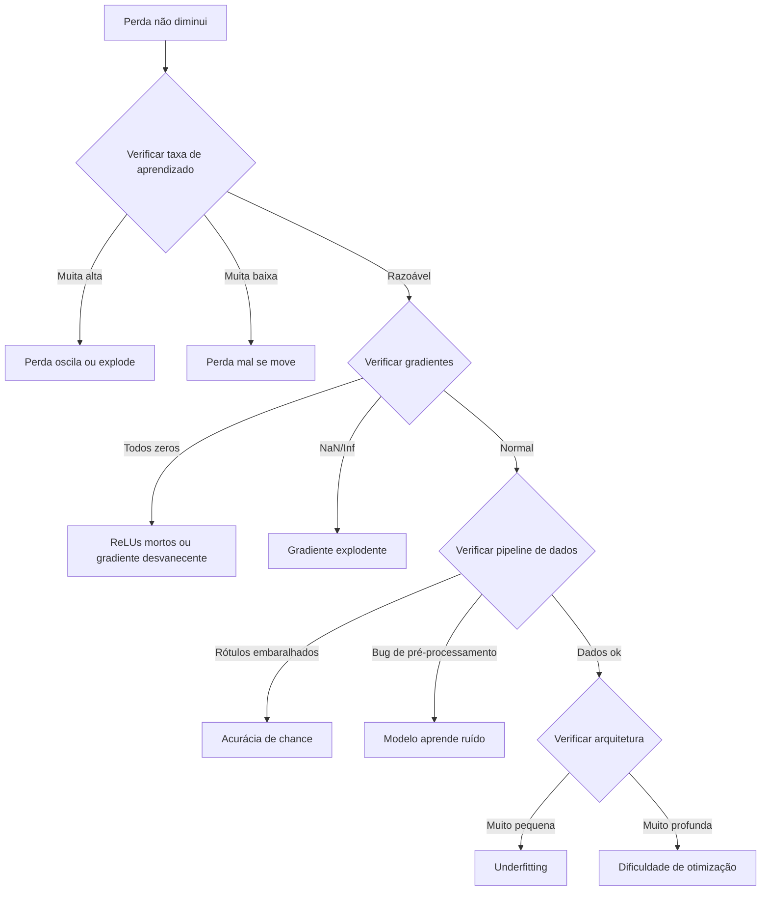

# Debugging de Redes Neurais

> Sua rede compilou. Rodou. Produziu um número. O número está errado e nada crashou. Bem-vindo ao tipo mais difícil de debug — onde não tem mensagem de erro.

**Tipo:** Prática
**Linguagens:** Python, PyTorch
**Pré-requisitos:** Aulas 01-10 da Fase 03 (eespecificaçãoialmente retropropagação, funções de perda, otimizadores)
**Tempo:** ~90 minutos

## Objetivos de Aprendizado

- Diagnosticar falhas comuns em redes neurais (perda NaN, curva de perda plana, overfitting, oscilação) usando estratégias de debug sistemáticas
- Aplicar a técnica "sobreajustar um lote" pra verificar que sua arquitetura e loop de treino estão corretos
- Inespecificaçãoionar magnitudes de gradiente, distribuições de ativação e normas de peso pra identificar problemas de gradiente desvanecente/explodente
- Construir um checklist de debug que cubra pipeline de dados, arquitetura, função de perda, otimizador e taxa de aprendizado

## O Problema

Software tradicional quebra quando está quebrado. Um ponteiro nulo lança exceção. Um mismatch de tipo falha na compilação. Um erro de um-off-by-one produz uma saída claramente errada.

Redes neurais não te dão esse luxo.

Uma rede neural quebrada roda até o final, imprime um valor de perda e gera previsões. A perda pode diminuir. As previsões podem parecer plausíveis. Mas o modelo está silenciosamente errado — aprendendo atalhos, memorizando ruído ou convergindo pra um mínimo inútil. Pesquisadores do Google estimaram que 60-70% do tempo de debug em ML é gasto em bugs "silenciosos" que não produzem erros mas degradam a qualidade do modelo.

A diferença entre um modelo funcional e um quebrado é frequentemente uma única linha fora do lugar: um `zero_grad()` faltando, uma dimensão transposta, uma taxa de aprendizado errada por 10x.

## O Conceito

### O Mindset de Debug

Esqueça debug print-e-reze. Debug de rede neural requer abordagem sistemática porque o ciclo de feedback é lento e os sintomas são ambíguos.

Regra dourada: **comece simples, adicione complexidade uma peça por vez e verifique cada peça independentemente.**



### Sintoma 1: Perda Não Diminui

Essa é a queixa mais comum. O loop de passa, as épocas avançam e a perda fica plana ou oscila violentamente.

**Taxa de aprendizado errada.** Muita alta: perda oscila ou pula pra NaN. Muita baixa: perda diminui tão devagar que parece plana. Pra Adam, comece em 1e-3. Pra SGD, comece em 1e-1 ou 1e-2. Sempre teste 3 taxas cobrindo 10x cada.

**ReLUs mortos.** Se um neurônio ReLU recebe entrada negativa grande, sua saída é 0 e seu gradiente é 0. Nunca se ativa de novo. Se morrerem neurônios suficientes, a rede não aprende.

**Gradientes desvanecentes.** Em redes profundas com sigmoid ou tanh, gradientes diminuem exponencialmente ao propagar pra trás.

**Gradientes explodentes.** O problema oposto — gradientes crescem exponencialmente. Comum em RNNs e redes muito profundas.

### Sintoma 2: Perda Diminui Mas Modelo é Ruim

A perda cai. Acurácia de treino chega a 99%. Mas acurácia de teste é 55%.

**Overfitting.** O modelo memoriza dados de treino em vez de aprender padrões. Fix: mais dados, dropout, weight decay, parada antecipada, aumento de dados.

**Vazamento de dados.** Dados de teste vazaram pro treino. Acurácia é suspeitosamente alta.

**Erros de rótulo.** 5-10% dos rótulos em datasets reais estão errados. O modelo aprende o ruído.

### Sintoma 3: NaN ou Inf na Perda

O valor da perda vira `nan` ou `inf`. Treino morto.

**Taxa muito alta.** Updates de gradiente ultrapassam tanto que pesos explodem. Fix: reduza 10x.

**log(0) ou log(negativo).** Fix: restrinja previsões pra `[eps, 1-eps]` onde `eps=1e-7`.

**Divisão por zero.** Batch normalization divide por desvio padrão. Lote com valores constantes tem std=0.

**Estouro numérico.** Ativações grandes alimentando `exp()` produzem Inf. Subtraia o máximo antes de elevar a exponencial.

### Técnica 1: Verificação de Gradiente

Compare seus gradientes analíticos (da retropropagação) com gradientes numéricos (diferenças finitas).

```
grad_numerical = (loss(w + eps) - loss(w - eps)) / (2 * eps)
```

Métrica de concordância:
```
rel_diff = |grad_analytical - grad_numerical| / max(|grad_analytical|, |grad_numerical|, 1e-8)
```

Se `rel_diff < 1e-5`: correto. Se `rel_diff > 1e-3`: quase certamente um bug.

### Técnica 2: Estatísticas de Ativação

| Indicador | Média | Std | Diagnóstico |
|-----------|-------|-----|-------------|
| Saudável | ~0 | ~1 | Rede aprendendo normalmente |
| Saturado | >>0 ou <<0 | ~0 | Ativações presas em extremos |
| Morto | 0 | 0 | Neurônios mortos (todos zeros) |
| Explodindo | >>10 | >>10 | Ativações crescendo sem limite |

### Técnica 3: Teste de Sobreajustar um Lote

A técnica de debug mais importante do deep learning.

Pegue um lote pequeno (8-32 amostras). Treine nele por 100+ iterações. A perda deve ir pra quase zero e acurácia de treino deve atingir 100%.

Esse teste pega:
- Funções de perda quebradas
- Passos reversos quebrados
- Arquitetura pequena demais pra representar os dados
- Otimizador não conectado aos parâmetros do modelo
- Dados e rótulos desalinhados

### Técnica 4: Localizador de Taxa de Aprendizado

Leslie Smith (2017) propôs varrer o lr de muito pequeno (1e-7) pra muito grande (10) numa época, registrando a perda. Plote perda vs lr. O lr ideal é aproximadamente 10x menor que o ponto de queda mais íngreme.

### Erros Comuns no PyTorch

| Bug | Sintoma | Correção |
|-----|---------|----------|
| Esquecer `optimizer.zero_grad()` | Gradientes acumulam, perda oscila | Adicionar antes de `loss.backward()` |
| Esquecer `model.eval()` no teste | Dropout e batch norm se comportam diferente | Adicionar `model.eval()` e `torch.no_grad()` |
| Formas de tensor erradas | Broadcasting silencioso produz resultados errados | Imprimir formas após cada operação |
| Mismatch CPU/GPU | `RuntimeError: expected CUDA tensor` | Usar `.to(device)` no modelo E nos dados |
| Não desserializar tensores | Grafo computacional cresce pra sempre, OOM | Usar `.detach()` ou `with torch.no_grad()` |

### Tabela Mestra de Debug

| Sintoma | Causa provável | Primeira coisa pra tentar |
|---------|---------------|---------------------------|
| Perda presa em -log(1/num_classes) | Modelo prevê distribuição uniforme | Verificar pipeline de dados |
| Perda NaN após alguns passos | Taxa muito alta | Reduzir LR 10x |
| Perda NaN imediatamente | log(0) ou divisão por zero | Adicionar epsilon |
| Perda oscilando violentamente | LR alto ou lote pequeno | Reduzir LR, aumentar lote |
| Treino alta, teste baixa | Overfitting | Adicionar dropout, weight decay |
| Treino = teste = chance | Modelo não aprende | Rodar teste sobreajuste-um-lote |
| Todos gradientes zero | ReLUs mortos ou grafo desserializado | Trocar pra LeakyReLU, checar `.requires_grad` |
| Sem memória durante treino | Lote grande ou grafo não liberado | Reduzir batch size |

## Construa

### Passo 1: Classe NetworkDebugger

```python
import torch
import torch.nn as nn
import math


class NetworkDebugger:
    def __init__(self, model):
        self.model = model
        self.activation_stats = {}
        self.gradient_stats = {}
        self.loss_history = []
        self.hooks = []
        self._register_hooks()

    def _register_hooks(self):
        for name, module in self.model.named_modules():
            if isinstance(module, (nn.Linear, nn.Conv2d, nn.ReLU, nn.LeakyReLU)):
                hook = module.register_forward_hook(self._make_activation_hook(name))
                self.hooks.append(hook)
                hook = module.register_full_backward_hook(self._make_gradient_hook(name))
                self.hooks.append(hook)

    def _make_activation_hook(self, name):
        def hook(module, input, output):
            with torch.no_grad():
                out = output.detach().float()
                self.activation_stats[name] = {
                    "mean": out.mean().item(),
                    "std": out.std().item(),
                    "fraction_zero": (out == 0).float().mean().item(),
                    "min": out.min().item(),
                    "max": out.max().item(),
                }
        return hook

    def _make_gradient_hook(self, name):
        def hook(module, grad_input, grad_output):
            if grad_output[0] is not None:
                with torch.no_grad():
                    grad = grad_output[0].detach().float()
                    self.gradient_stats[name] = {
                        "mean": grad.mean().item(),
                        "std": grad.std().item(),
                        "abs_mean": grad.abs().mean().item(),
                        "max": grad.abs().max().item(),
                    }
        return hook

    def record_loss(self, loss_value):
        self.loss_history.append(loss_value)

    def check_loss_health(self):
        if len(self.loss_history) < 2:
            return "NOT_ENOUGH_DATA"
        recent = self.loss_history[-10:]
        if any(math.isnan(v) or math.isinf(v) for v in recent):
            return "NAN_OR_INF"
        if len(self.loss_history) >= 20:
            first_half = sum(self.loss_history[:10]) / 10
            second_half = sum(self.loss_history[-10:]) / 10
            if second_half >= first_half * 0.99:
                return "NOT_DECREASING"
        if len(recent) >= 5:
            diffs = [recent[i+1] - recent[i] for i in range(len(recent)-1)]
            if max(diffs) - min(diffs) > 2 * abs(sum(diffs) / len(diffs)):
                return "OSCILLATING"
        return "HEALTHY"

    def check_activations(self):
        issues = []
        for name, stats in self.activation_stats.items():
            if stats["fraction_zero"] > 0.5:
                issues.append(f"DEAD_NEURONS: {name} has {stats['fraction_zero']:.0%} zero activations")
            if abs(stats["mean"]) > 10:
                issues.append(f"EXPLODING_ACTIVATIONS: {name} mean={stats['mean']:.2f}")
            if stats["std"] < 1e-6:
                issues.append(f"COLLAPSED_ACTIVATIONS: {name} std={stats['std']:.2e}")
        return issues if issues else ["HEALTHY"]

    def check_gradients(self):
        issues = []
        grad_magnitudes = []
        for name, stats in self.gradient_stats.items():
            grad_magnitudes.append((name, stats["abs_mean"]))
            if stats["abs_mean"] < 1e-7:
                issues.append(f"VANISHING_GRADIENT: {name} abs_mean={stats['abs_mean']:.2e}")
            if stats["abs_mean"] > 100:
                issues.append(f"EXPLODING_GRADIENT: {name} abs_mean={stats['abs_mean']:.2e}")
        if len(grad_magnitudes) >= 2:
            first_mag = grad_magnitudes[0][1]
            last_mag = grad_magnitudes[-1][1]
            if last_mag > 0 and first_mag / last_mag > 100:
                issues.append(f"GRADIENT_RATIO: first/last = {first_mag/last_mag:.0f}x (vanishing)")
        return issues if issues else ["HEALTHY"]

    def print_report(self):
        print("\n=== NETWORK DEBUGGER REPORT ===")
        print(f"\nLoss health: {self.check_loss_health()}")
        if self.loss_history:
            print(f"  Last 5 losses: {[f'{v:.4f}' for v in self.loss_history[-5:]]}")
        print("\nActivation diagnostics:")
        for item in self.check_activations():
            print(f"  {item}")
        print("\nGradient diagnostics:")
        for item in self.check_gradients():
            print(f"  {item}")
        print("\nPer-layer activation stats:")
        for name, stats in self.activation_stats.items():
            print(f"  {name}: mean={stats['mean']:.4f} std={stats['std']:.4f} zero={stats['fraction_zero']:.1%}")
        print("\nPer-layer gradient stats:")
        for name, stats in self.gradient_stats.items():
            print(f"  {name}: abs_mean={stats['abs_mean']:.2e} max={stats['max']:.2e}")

    def remove_hooks(self):
        for hook in self.hooks:
            hook.remove()
        self.hooks.clear()
```

### Passo 2: Teste de Sobreajustar um Lote

```python
def overfit_one_batch(model, x_batch, y_batch, criterion, lr=0.01, steps=200):
    optimizer = torch.optim.Adam(model.parameters(), lr=lr)
    model.train()
    print("\n=== OVERFIT ONE BATCH TEST ===")
    print(f"Batch size: {x_batch.shape[0]}, Steps: {steps}")

    for step in range(steps):
        optimizer.zero_grad()
        output = model(x_batch)
        loss = criterion(output, y_batch)
        loss.backward()
        optimizer.step()

        if step % 50 == 0 or step == steps - 1:
            with torch.no_grad():
                preds = (output > 0).float() if output.shape[-1] == 1 else output.argmax(dim=1)
                targets = y_batch if y_batch.dim() == 1 else y_batch.squeeze()
                acc = (preds.squeeze() == targets).float().mean().item()
            print(f"  Step {step:3d} | Loss: {loss.item():.6f} | Accuracy: {acc:.1%}")

    final_loss = loss.item()
    if final_loss > 0.1:
        print(f"\n  FAIL: Loss did not converge ({final_loss:.4f}). Model or training loop is broken.")
        return False
    print(f"\n  PASS: Loss converged to {final_loss:.6f}")
    return True
```

### Passo 3: Localizador de Taxa de Aprendizado

```python
def find_learning_rate(model, x_data, y_data, criterion, start_lr=1e-7, end_lr=10, steps=100):
    import copy
    original_state = copy.deepcopy(model.state_dict())
    optimizer = torch.optim.SGD(model.parameters(), lr=start_lr)
    lr_mult = (end_lr / start_lr) ** (1 / steps)

    model.train()
    results = []
    best_loss = float("inf")
    current_lr = start_lr

    print("\n=== LEARNING RATE FINDER ===")

    for step in range(steps):
        optimizer.zero_grad()
        output = model(x_data)
        loss = criterion(output, y_data)

        if math.isnan(loss.item()) or loss.item() > best_loss * 10:
            break

        best_loss = min(best_loss, loss.item())
        results.append((current_lr, loss.item()))

        loss.backward()
        optimizer.step()

        current_lr *= lr_mult
        for param_group in optimizer.param_groups:
            param_group["lr"] = current_lr

    model.load_state_dict(original_state)

    if len(results) < 10:
        print("  Could not complete LR sweep -- loss diverged too quickly")
        return results

    min_loss_idx = min(range(len(results)), key=lambda i: results[i][1])
    suggested_lr = results[max(0, min_loss_idx - 10)][0]

    print(f"  Swept {len(results)} steps from {start_lr:.0e} to {results[-1][0]:.0e}")
    print(f"  Minimum loss {results[min_loss_idx][1]:.4f} at lr={results[min_loss_idx][0]:.2e}")
    print(f"  Suggested learning rate: {suggested_lr:.2e}")

    return results
```

## Entregue

Esta aula produz:
- `outputs/skill-debug-checklist.md` — um checklist de debug pra redes neurais
- `outputs/prompt-nn-debugger.md` — um prompt pra diagnosticar problemas de treino

## Exercícios

1. Treine uma rede no MNIST e introduza um bug sutil: esqueça o `optimizer.zero_grad()`. Observe os gradientes acumulando e a perda oscilando. Use o NetworkDebugger pra identificar o problema.

2. Treine uma rede ReLU com bias fixo em -10 pra todos os neurônios. Use o debugger pra ver a fração de neurônios mortos. Corrija mudando o bias pra 0.

3. Crie uma rede com 10 camadas lineares + sigmoid (sem residual connections). Use o debugger pra mostrar gradientes desvanecentes. Adicione conexões residuais e mostre melhoria.

4. Implemente o teste de gradiente numérico pra uma rede de 3 camadas. Verifique que seus gradientes analíticos batem com os numéricos.

5. Use o localizador de taxa de aprendizado numa rede no MNIST. Encontre a melhor taxa e treine com ela. Compare com treino usando taxa fixa de 0.001.

## Termos-Chave

| Termo | O que o pessoal diz | O que realmente significa |
|-------|---------------------|--------------------------|
| Debug de rede neural | "Achar bugs no treino" | Processo sistemático de encontrar erros silenciosos em redes que produzem resultados errados sem crashar |
| Sobreajustar um lote | "Testar se treina" | Treinar num único lote pequeno pra verificar se a rede consegue memorizar — se não, o modelo ou loop está quebrado |
| Localizador de taxa | "Achar o melhor LR" | Varredura do lr de baixo pra alto registrando perda, pra encontrar a faixa ideal |
| Verificação de gradiente | "Conferir os gradientes" | Comparar gradientes computados pelo backward pass com gradientes numéricos via diferenças finitas |
| Debugger de rede | "Monitor de saúde da rede" | Hooks que rastreiam estatísticas de ativação e gradiente durante treino pra diagnosticar problemas |
