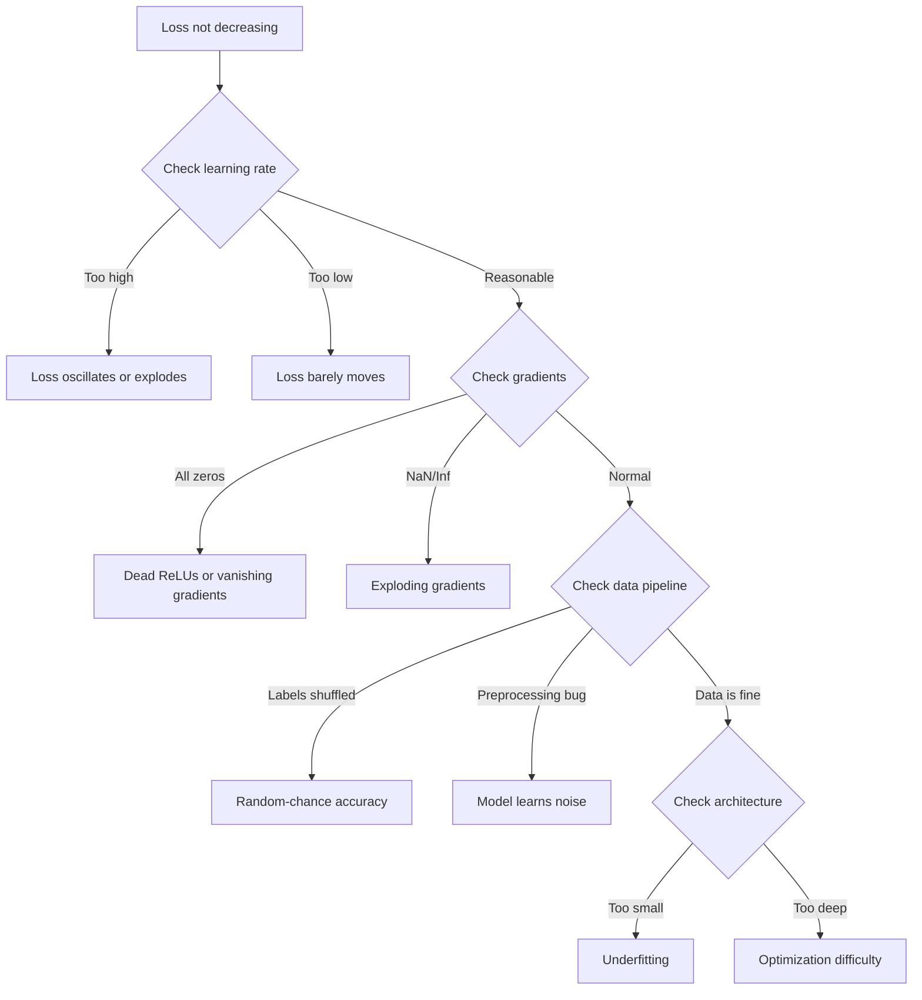
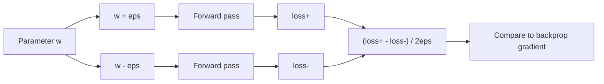
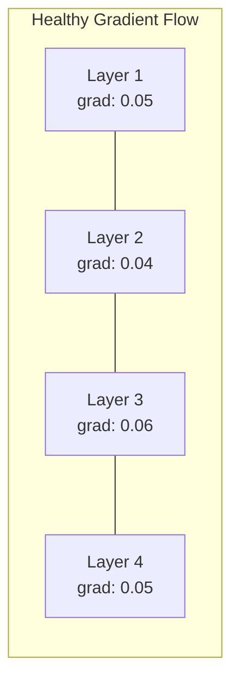
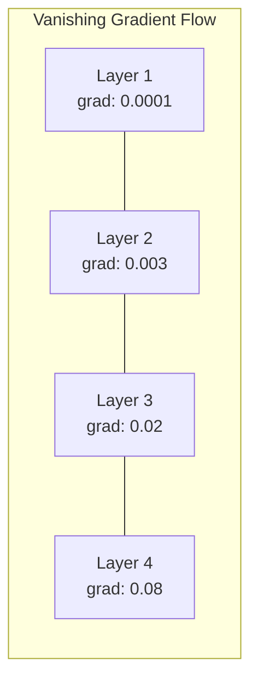
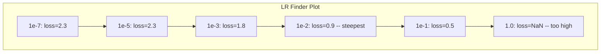

# Neural Network'lerde hata ayıklama

> Ağınız derlendi. Koştu. Bir sayı üretti. Numara yanlış ve hiçbir şey çökmedi. Hata ayıklamanın en zor türüne, yani hiçbir hata mesajının bulunmadığı türe hoş geldiniz.

**Tür:** Yapım
**Diller:** Python, PyTorch
**Önkoşullar:** Aşama 03 Dersler 01-10 (özellikle backpropagation, loss function'ler, optimize ediciler)
**Süre:** ~90 dakika

## Öğrenme Hedefleri

- Sistematik hata ayıklama stratejilerini kullanarak yaygın neural network hatalarını (NaN kaybı, düz kayıp eğrisi, aşırı uyum, salınım) teşhis edin
- Model mimarinizin ve eğitim döngünüzün doğru olduğunu doğrulamak için "bir partiyi fazla donat" tekniğini uygulayın
- Kaybolan/patlayan gradient sorunlarını belirlemek için gradient büyüklüklerini, aktivasyon dağılımlarını ve ağırlık normlarını inceleyin
- Veri hattını, model mimarisini, loss function'yi, optimize ediciyi ve öğrenme hızı sorunlarını kapsayan bir hata ayıklama kontrol listesi oluşturun

## Sorun

Geleneksel yazılım bozulduğunda çöker. Boş bir işaretçi bir istisna atar. Tür uyuşmazlığı derleme zamanında başarısız olur. Birer birer hata açıkça yanlış bir çıktı üretir.

Neural network'ler size bu lüksü sunmuyor.

Bozuk bir neural network tamamlanana kadar çalışır, bir kayıp değeri yazdırır ve tahminlerin çıktısını verir. Kayıp azalabilir. Tahminler makul görünebilir. Ancak model sessizce yanılıyor; kısayolları öğrenmek, gürültüyü ezberlemek veya işe yaramaz bir yerel minimuma yakınsama. Google araştırmacıları, makine öğrenimi hata ayıklama süresinin %60-70'inin, hiçbir hata üretmeyen ancak model kalitesini düşüren "sessiz" hatalara harcandığını tahmin ediyor.

Çalışan bir model ile bozuk bir model arasındaki fark genellikle tek bir yanlış yerleştirilmiş çizgidir: eksik bir `zero_grad()`, aktarılmış bir boyut, 10 kat daha düşük bir öğrenme oranı. standart "Neural Network Eğitimi Tarifi" (2019) şu şekilde açılıyor: "En yaygın sinir ağı hataları, çökmeyen hatalardır."

Bu ders size bu hataları bulmayı öğretiyor.

## Konsept

### Hata Ayıklama Zihniyeti

Yazdır ve dua et hata ayıklamasını unutun. Neural network Hata ayıklama sistematik bir yaklaşım gerektirir çünkü geri bildirim döngüsü yavaştır (eğitim çalıştırması başına dakikalardan saatlere kadar) ve belirtiler belirsizdir (kötü kayıp 20 farklı anlama gelebilir).

Altın kural: **Basitten başlayın, karmaşıklığı teker teker ekleyin ve her parçayı bağımsız olarak doğrulayın.**



### Belirti 1: Kayıp Azalanmıyor

Bu en yaygın şikayettir. Eğitim döngüsü devam ediyor, dönemler geçiyor ve kayıp sabit kalıyor ya da çılgınca salınıyor.

**Yanlış öğrenme oranı.** Çok yüksek: kayıp salınır veya NaN'ye sıçrar. Çok düşük: Kayıp o kadar yavaş azalır ki düz görünür. Adam için 1e-3'ten başlayın. SGD için 1e-1 veya 1e-2'den başlayın. Başka bir şeyin yanlış olduğu sonucuna varmadan önce her zaman her biri 10 kata yayılan 3 öğrenme oranını (e.g., 1e-2, 1e-3, 1e-4) deneyin.

**Ölü ReLU'lar.** Bir ReLU nöronu büyük bir negatif girdi alırsa, çıktı olarak 0 verir ve gradient değeri 0 olur. Bir daha asla etkinleşmez. Yeterli sayıda nöron ölürse ağ öğrenemez. Kontrol edin: Her ReLU katmanından sonra tam olarak 0 olan aktivasyonların fraksiyonunu yazdırın. >%50 ölüyse LeakyReLU'ya geçin veya öğrenme oranını azaltın.

**gradient'lerin kaybolması.** Sigmoid veya tanh aktivasyonlarına sahip derin ağlarda, gradient'ler geriye doğru yayıldıkça katlanarak küçülür. İlk katmana ulaştıklarında ~0'dırlar. İlk katmanlar öğrenmeyi durdurur. Düzeltme: ReLU/GELU kullanın, kalan bağlantıları ekleyin veya toplu normalleştirmeyi kullanın.

**gradient'lerin patlaması.** Tam tersi sorun: gradient'ler katlanarak büyüyor. RNN'lerde ve çok derin ağlarda yaygındır. Kayıp NaN'a sıçradı. Düzeltme: gradient kırpma (`torch.nn.utils.clip_grad_norm_`), daha düşük öğrenme oranı veya normalleştirme ekleme.

### Belirti 2: Kayıp Azalıyor Ancak Model Kötü

Kayıp azalır. Eğitim doğruluğu %99'a ulaşır. Ancak test doğruluğu% 55'tir. Veya model gerçek veriler üzerinden anlamsız çıktılar üretiyor.

**Fazla uyum.** Model, öğrenme kalıpları yerine eğitim verilerini ezberler. Eğitim ve doğrulama kaybı arasındaki fark zamanla büyür. Düzeltme: daha fazla veri, kesinti, ağırlık azalması, erken durdurma, veri artırma.

**Veri sızıntısı.** Test verileri eğitime sızdırıldı. Doğruluk şüpheli derecede yüksektir. Yaygın nedenler: bölmeden önce karıştırma, tam dataset'den alınan istatistiklerle ön işleme, bölmeler arasında örneklerin çoğaltılması. Düzeltme: önce bölme, ikinci olarak ön işleme, kopyaları kontrol etme.

**Etiket hataları.** Çoğu gerçek dataset'deki etiketlerin %5-10'u yanlıştır (Northcutt ve diğerleri, 2021 -- "Test Setlerinde Yaygın Etiket Hataları"). Model gürültüyü öğrenir. Düzeltme: Yanlış etiketlenmiş örnekleri bulmak ve düzeltmek için kendinden emin öğrenmeyi kullanın veya yüksek kayıplı örnekleri göz ardı etmek için kayıp kesmeyi kullanın.

### Belirti 3: NaN veya Inf Kayıpta

Kayıp değeri `nan` veya `inf` olur. Eğitim öldü.

**Öğrenme oranı çok yüksek.** Gradient güncellemeleri o kadar fazla ilerliyor ki ağırlıklar patlıyor. Düzeltme: 10 kat azaltın.

**log(0) veya log(negatif).** Çapraz entropi kaybı `log(p)`'yi hesaplar. Modeliniz tam olarak 0 veya negatif bir olasılık verirse log patlar. Düzeltme: Tahminleri `[eps, 1-eps]`'ye sıkıştırın; burada `eps=1e-7`.

**Sıfıra bölme.** Toplu normalleştirme, standart sapmaya bölünür. Sabit değerlere sahip bir toplu iş std=0'a sahiptir. Düzeltme: paydaya epsilon ekleyin (PyTorch bunu varsayılan olarak yapar, ancak özel uygulamalar yapmayabilir).

**Sayısal taşma.** `exp()`'ye beslenen büyük etkinleştirmeler Inf. Softmax özellikle yatkındır. Düzeltme: Üs alma işleminden önce maksimumu çıkarın (log-toplam-exp hilesi).

### Teknik 1: Gradient Kontrol Etme

Analitik gradient'lerinizi (backprop'tan) sayısal gradient'lerle (sonlu farklardan) karşılaştırın. Eğer aynı fikirde değillerse, geri geçişinizde bir hata var.

`w` parametresi için sayısal gradient:

```
grad_numerical = (loss(w + eps) - loss(w - eps)) / (2 * eps)
```

Anlaşma metriği (göreceli fark):

```
rel_diff = |grad_analytical - grad_numerical| / max(|grad_analytical|, |grad_numerical|, 1e-8)
```

`rel_diff < 1e-5` ise: doğru. `rel_diff > 1e-3` ise: neredeyse kesinlikle bir hata.



### Teknik 2: Etkinleştirme İstatistikleri

Eğitim sırasında her katmandan sonra aktivasyonların ortalamasını ve standart sapmasını izleyin. Sağlıklı ağlar, aktivasyonları ortalama 0'a yakın ve std 1'e yakın (normalizasyondan sonra) veya en azından sınırlı olacak şekilde sürdürür.

| Sağlık göstergesi | Ortalama | Std | Teşhis |
|-----------------|------|-----|-----------|
| Sağlıklı | ~0 | ~1 | Ağ normal şekilde öğreniyor |
| Doymuş | >>0 veya <<0 | ~0 | Aktivasyonlar aşırı değerlerde kaldı |
| Ölü | 0 | 0 | Nöronlar öldü (hepsi sıfır) |
| Patlayan | >>10 | >>10 | Sınırsız büyüyen aktivasyonlar |

### Teknik 3: Gradient Akış Görselleştirme

Her katman için ortalama gradient büyüklüğünü çizin. Sağlıklı bir ağda, gradient büyüklükleri katmanlar arasında kabaca benzer olmalıdır. İlk katmanlarda sonraki katmanlardan 1000 kat daha küçük gradient'ler varsa, gradient'ler kayboluyor demektir.





### Teknik 4: Tek Toplu Aşırı Uyum Testi

deep learning'deki en önemli hata ayıklama tekniği.

Küçük bir parti alın (8-32 numune). 100'den fazla yineleme için eğitim alın. Kayıp neredeyse sıfıra inmeli ve eğitim doğruluğu %100'e ulaşmalıdır. Aksi takdirde modelinizde veya eğitim döngünüzde temel bir hata var demektir; tam eğitime geçmeyin.

Bu test şunları yakalar:
- Kırık loss function'ler
- Kırık geri paslar
- Veriyi temsil edemeyecek kadar küçük mimari
- Optimize edici model parametrelerine bağlı değil
- Veriler ve etiketler yanlış hizalanmış

Bu işlemin çalıştırılması 30 saniye sürer ve tam eğitim çalıştırmalarında saatlerce süren hata ayıklamadan tasarruf sağlar.

### Teknik 5: Öğrenme Oranı Bulucu

Leslie Smith (2017), kaybı kaydederken öğrenme oranının çok küçükten (1e-7) çok büyüğe (10) kadar bir dönem boyunca süpürülmesini önerdi. Arsa kaybı ve öğrenme oranı. Optimum öğrenme oranı, kaybın en hızlı şekilde azalmaya başladığı orandan kabaca 10 kat daha küçüktür.



Bu örnekte en iyi LR: ~1e-3 (en dik noktadan önceki bir büyüklük sırası).

### Yaygın PyTorch Hataları

PyTorch topluluğunda en çok kolektif saatleri boşa harcayan hatalar şunlardır:

| Hata | Belirti | Düzelt |
|-----|---------|-----|
| `optimizer.zero_grad()`'nin unutulması | Gradient'ler gruplar arasında birikiyor, kayıplar salınıyor | `loss.backward()`'den önce `optimizer.zero_grad()`'yi ekleyin |
| `model.eval()`'nin test zamanında unutulması | Bırakma ve parti normu farklı davranır, test doğruluğu çalışmalar arasında farklılık gösterir | `model.eval()` ve `torch.no_grad()`'yi ekleyin |
| Yanlış tensör şekilleri | Sessiz yayın yanlış sonuç üretir, hata olmaz | Hata ayıklama sırasında her işlemden sonra şekilleri yazdırma |
| CPU/GPU uyumsuzluğu | `RuntimeError: expected CUDA tensor` | Model VE verilerde `.to(device)`'yi kullanın |
| Tensörleri ayırmıyor | Hesaplama grafiği sonsuza kadar büyüyor, OOM | `.detach()` veya `with torch.no_grad()` |
| Autograd'ı kıran yerinde işlemler | `RuntimeError: modified by in-place operation` | `x += 1`'yi `x = x + 1` ile değiştirin |
| Veriler normalleştirilmedi | Kayıp rastgele şans seviyesinde kaldı | Girişleri ortalama=0, std=1 olacak şekilde normalleştirin |
| Yanlış tipte etiketler | Çapraz entropi `Long`'yi bekliyor, `Float`'yi aldı | Yayın etiketleri: `labels.long()` |

### Ana Hata Ayıklama Tablosu

| Belirti | Olası neden | Denenecek ilk şey |
|---------|-------------|-------------------|
| Kayıp -log(1/num_classes) konumunda kaldı | Düzgün dağılımı öngören model | Veri hattını kontrol edin, etiketlerin girişlerle eşleştiğini doğrulayın |
| Birkaç adımdan sonra NaN kaybı | Öğrenme oranı çok yüksek | LR'yi 10 kat azaltın |
| NaN'yi hemen kaybedin | log(0) veya sıfıra bölme | Günlük/bölme işlemlerine epsilon ekleyin |
| Kayıp çılgınca salınıyor | LR çok yüksek veya parti boyutu çok küçük | LR'yi azaltın, parti boyutunu artırın |
| Kayıplar azaldı, ardından platolar | fine-tuning aşaması için LR çok yüksek | LR çizelgesi ekle (kosinüs veya adım azalması) |
| Eğitim ivmesi yüksek, test ivmesi düşük | Aşırı uyum | Bırakma, ağırlık azalması ve daha fazla veri ekleyin |
| Eğitim acc = test acc = şans | Model hiçbir şey öğrenmiyor | Bir toplu iş üzerinde aşırı uyum testini çalıştırın |
| Eğitim acc = test acc ama her ikisi de düşük | Yetersiz uyum | Daha büyük model, daha fazla katman, daha fazla özellik |
| Gradient'lerin hepsi sıfır | Ölü ReLU'lar veya bağımsız hesaplama grafiği | LeakyReLU'ya geçin, `.requires_grad` |'yi kontrol edin |
| Eğitim sırasında hafıza yetersiz | Parti çok büyük veya grafik serbest bırakılmadı | Toplu iş boyutunu azaltın, değerlendirme için `torch.no_grad()` kullanın |

```figure
learning-curves
```

## İnşa Et

Aktivasyonları, gradient'leri ve kayıp eğrilerini izleyen bir teşhis araç seti. Bir ağı kasıtlı olarak kesecek ve her sorunu teşhis etmek için araç setini kullanacaksınız.

### Adım 1: NetworkDebugger Sınıfı

Katman başına aktivasyon ve gradient istatistiklerini kaydetmek için bir PyTorch modeline bağlanır.

```python
import torch
import torch.nn as nn
import math


class NetworkDebugger:
    def __init__(self, model):
        self.model = model
        self.activation_stats = {}
        self.gradient_stats = {}
        self.loss_history = []
        self.lr_losses = []
        self.hooks = []
        self._register_hooks()

    def _register_hooks(self):
        for name, module in self.model.named_modules():
            if isinstance(module, (nn.Linear, nn.Conv2d, nn.ReLU, nn.LeakyReLU)):
                hook = module.register_forward_hook(self._make_activation_hook(name))
                self.hooks.append(hook)
                hook = module.register_full_backward_hook(self._make_gradient_hook(name))
                self.hooks.append(hook)

    def _make_activation_hook(self, name):
        def hook(module, input, output):
            with torch.no_grad():
                out = output.detach().float()
                self.activation_stats[name] = {
                    "mean": out.mean().item(),
                    "std": out.std().item(),
                    "fraction_zero": (out == 0).float().mean().item(),
                    "min": out.min().item(),
                    "max": out.max().item(),
                }
        return hook

    def _make_gradient_hook(self, name):
        def hook(module, grad_input, grad_output):
            if grad_output[0] is not None:
                with torch.no_grad():
                    grad = grad_output[0].detach().float()
                    self.gradient_stats[name] = {
                        "mean": grad.mean().item(),
                        "std": grad.std().item(),
                        "abs_mean": grad.abs().mean().item(),
                        "max": grad.abs().max().item(),
                    }
        return hook

    def record_loss(self, loss_value):
        self.loss_history.append(loss_value)

    def check_loss_health(self):
        if len(self.loss_history) < 2:
            return "NOT_ENOUGH_DATA"
        recent = self.loss_history[-10:]
        if any(math.isnan(v) or math.isinf(v) for v in recent):
            return "NAN_OR_INF"
        if len(self.loss_history) >= 20:
            first_half = sum(self.loss_history[:10]) / 10
            second_half = sum(self.loss_history[-10:]) / 10
            if second_half >= first_half * 0.99:
                return "NOT_DECREASING"
        if len(recent) >= 5:
            diffs = [recent[i+1] - recent[i] for i in range(len(recent)-1)]
            if max(diffs) - min(diffs) > 2 * abs(sum(diffs) / len(diffs)):
                return "OSCILLATING"
        return "HEALTHY"

    def check_activations(self):
        issues = []
        for name, stats in self.activation_stats.items():
            if stats["fraction_zero"] > 0.5:
                issues.append(f"DEAD_NEURONS: {name} has {stats['fraction_zero']:.0%} zero activations")
            if abs(stats["mean"]) > 10:
                issues.append(f"EXPLODING_ACTIVATIONS: {name} mean={stats['mean']:.2f}")
            if stats["std"] < 1e-6:
                issues.append(f"COLLAPSED_ACTIVATIONS: {name} std={stats['std']:.2e}")
        return issues if issues else ["HEALTHY"]

    def check_gradients(self):
        issues = []
        grad_magnitudes = []
        for name, stats in self.gradient_stats.items():
            grad_magnitudes.append((name, stats["abs_mean"]))
            if stats["abs_mean"] < 1e-7:
                issues.append(f"VANISHING_GRADIENT: {name} abs_mean={stats['abs_mean']:.2e}")
            if stats["abs_mean"] > 100:
                issues.append(f"EXPLODING_GRADIENT: {name} abs_mean={stats['abs_mean']:.2e}")
        if len(grad_magnitudes) >= 2:
            first_mag = grad_magnitudes[0][1]
            last_mag = grad_magnitudes[-1][1]
            if last_mag > 0 and first_mag / last_mag > 100:
                issues.append(f"GRADIENT_RATIO: first/last = {first_mag/last_mag:.0f}x (vanishing)")
        return issues if issues else ["HEALTHY"]

    def print_report(self):
        print("\n=== NETWORK DEBUGGER REPORT ===")
        print(f"\nLoss health: {self.check_loss_health()}")
        if self.loss_history:
            print(f"  Last 5 losses: {[f'{v:.4f}' for v in self.loss_history[-5:]]}")
        print("\nActivation diagnostics:")
        for item in self.check_activations():
            print(f"  {item}")
        print("\nGradient diagnostics:")
        for item in self.check_gradients():
            print(f"  {item}")
        print("\nPer-layer activation stats:")
        for name, stats in self.activation_stats.items():
            print(f"  {name}: mean={stats['mean']:.4f} std={stats['std']:.4f} zero={stats['fraction_zero']:.1%}")
        print("\nPer-layer gradient stats:")
        for name, stats in self.gradient_stats.items():
            print(f"  {name}: abs_mean={stats['abs_mean']:.2e} max={stats['max']:.2e}")

    def remove_hooks(self):
        for hook in self.hooks:
            hook.remove()
        self.hooks.clear()
```

### Adım 2: Tek Toplu Aşırı Uyum Testi

```python
def overfit_one_batch(model, x_batch, y_batch, criterion, lr=0.01, steps=200):
    optimizer = torch.optim.Adam(model.parameters(), lr=lr)
    model.train()
    print("\n=== OVERFIT ONE BATCH TEST ===")
    print(f"Batch size: {x_batch.shape[0]}, Steps: {steps}")

    for step in range(steps):
        optimizer.zero_grad()
        output = model(x_batch)
        loss = criterion(output, y_batch)
        loss.backward()
        optimizer.step()

        if step % 50 == 0 or step == steps - 1:
            with torch.no_grad():
                preds = (output > 0).float() if output.shape[-1] == 1 else output.argmax(dim=1)
                targets = y_batch if y_batch.dim() == 1 else y_batch.squeeze()
                acc = (preds.squeeze() == targets).float().mean().item()
            print(f"  Step {step:3d} | Loss: {loss.item():.6f} | Accuracy: {acc:.1%}")

    final_loss = loss.item()
    if final_loss > 0.1:
        print(f"\n  FAIL: Loss did not converge ({final_loss:.4f}). Model or training loop is broken.")
        return False
    print(f"\n  PASS: Loss converged to {final_loss:.6f}")
    return True
```

### Adım 3: Öğrenme Oranı Bulucu

```python
def find_learning_rate(model, x_data, y_data, criterion, start_lr=1e-7, end_lr=10, steps=100):
    import copy
    original_state = copy.deepcopy(model.state_dict())
    optimizer = torch.optim.SGD(model.parameters(), lr=start_lr)
    lr_mult = (end_lr / start_lr) ** (1 / steps)

    model.train()
    results = []
    best_loss = float("inf")
    current_lr = start_lr

    print("\n=== LEARNING RATE FINDER ===")

    for step in range(steps):
        optimizer.zero_grad()
        output = model(x_data)
        loss = criterion(output, y_data)

        if math.isnan(loss.item()) or loss.item() > best_loss * 10:
            break

        best_loss = min(best_loss, loss.item())
        results.append((current_lr, loss.item()))

        loss.backward()
        optimizer.step()

        current_lr *= lr_mult
        for param_group in optimizer.param_groups:
            param_group["lr"] = current_lr

    model.load_state_dict(original_state)

    if len(results) < 10:
        print("  Could not complete LR sweep -- loss diverged too quickly")
        return results

    min_loss_idx = min(range(len(results)), key=lambda i: results[i][1])
    suggested_lr = results[max(0, min_loss_idx - 10)][0]

    print(f"  Swept {len(results)} steps from {start_lr:.0e} to {results[-1][0]:.0e}")
    print(f"  Minimum loss {results[min_loss_idx][1]:.4f} at lr={results[min_loss_idx][0]:.2e}")
    print(f"  Suggested learning rate: {suggested_lr:.2e}")

    return results
```

### Adım 4: Gradient Denetleyici

```python
def _flat_to_multi_index(flat_idx, shape):
    multi_idx = []
    remaining = flat_idx
    for dim in reversed(shape):
        multi_idx.insert(0, remaining % dim)
        remaining //= dim
    return tuple(multi_idx)


def gradient_check(model, x, y, criterion, eps=1e-4):
    model.train()
    x_double = x.double()
    y_double = y.double()
    model_double = model.double()

    print("\n=== GRADIENT CHECK ===")
    overall_max_diff = 0
    checked = 0

    for name, param in model_double.named_parameters():
        if not param.requires_grad:
            continue

        layer_max_diff = 0

        model_double.zero_grad()
        output = model_double(x_double)
        loss = criterion(output, y_double)
        loss.backward()
        analytical_grad = param.grad.clone()

        num_checks = min(5, param.numel())
        for i in range(num_checks):
            idx = _flat_to_multi_index(i, param.shape)
            original = param.data[idx].item()

            param.data[idx] = original + eps
            with torch.no_grad():
                loss_plus = criterion(model_double(x_double), y_double).item()

            param.data[idx] = original - eps
            with torch.no_grad():
                loss_minus = criterion(model_double(x_double), y_double).item()

            param.data[idx] = original

            numerical = (loss_plus - loss_minus) / (2 * eps)
            analytical = analytical_grad[idx].item()

            denom = max(abs(numerical), abs(analytical), 1e-8)
            rel_diff = abs(numerical - analytical) / denom

            layer_max_diff = max(layer_max_diff, rel_diff)
            checked += 1

        overall_max_diff = max(overall_max_diff, layer_max_diff)
        status = "OK" if layer_max_diff < 1e-5 else "MISMATCH"
        print(f"  {name}: max_rel_diff={layer_max_diff:.2e} [{status}]")

    model.float()

    print(f"\n  Checked {checked} parameters")
    if overall_max_diff < 1e-5:
        print("  PASS: Gradients match (rel_diff < 1e-5)")
    elif overall_max_diff < 1e-3:
        print("  WARN: Small differences (1e-5 < rel_diff < 1e-3)")
    else:
        print("  FAIL: Gradient mismatch detected (rel_diff > 1e-3)")
    return overall_max_diff
```

### Adım 5: Kasıtlı Olarak Kesilen Ağlar

Şimdi araç setini bozuk ağlara uygulayın ve her birini teşhis edin.

```python
def demo_broken_networks():
    torch.manual_seed(42)
    x = torch.randn(64, 10)
    y = (x[:, 0] > 0).long()

    print("\n" + "=" * 60)
    print("BUG 1: Learning rate too high (lr=10)")
    print("=" * 60)
    model1 = nn.Sequential(nn.Linear(10, 32), nn.ReLU(), nn.Linear(32, 2))
    debugger1 = NetworkDebugger(model1)
    optimizer1 = torch.optim.SGD(model1.parameters(), lr=10.0)
    criterion = nn.CrossEntropyLoss()
    for step in range(20):
        optimizer1.zero_grad()
        out = model1(x)
        loss = criterion(out, y)
        debugger1.record_loss(loss.item())
        loss.backward()
        optimizer1.step()
    debugger1.print_report()
    debugger1.remove_hooks()

    print("\n" + "=" * 60)
    print("BUG 2: Dead ReLUs from bad initialization")
    print("=" * 60)
    model2 = nn.Sequential(nn.Linear(10, 32), nn.ReLU(), nn.Linear(32, 32), nn.ReLU(), nn.Linear(32, 2))
    with torch.no_grad():
        for m in model2.modules():
            if isinstance(m, nn.Linear):
                m.weight.fill_(-1.0)
                m.bias.fill_(-5.0)
    debugger2 = NetworkDebugger(model2)
    optimizer2 = torch.optim.Adam(model2.parameters(), lr=1e-3)
    for step in range(50):
        optimizer2.zero_grad()
        out = model2(x)
        loss = criterion(out, y)
        debugger2.record_loss(loss.item())
        loss.backward()
        optimizer2.step()
    debugger2.print_report()
    debugger2.remove_hooks()

    print("\n" + "=" * 60)
    print("BUG 3: Missing zero_grad (gradients accumulate)")
    print("=" * 60)
    model3 = nn.Sequential(nn.Linear(10, 32), nn.ReLU(), nn.Linear(32, 2))
    debugger3 = NetworkDebugger(model3)
    optimizer3 = torch.optim.SGD(model3.parameters(), lr=0.01)
    for step in range(50):
        out = model3(x)
        loss = criterion(out, y)
        debugger3.record_loss(loss.item())
        loss.backward()
        optimizer3.step()
    debugger3.print_report()
    debugger3.remove_hooks()

    print("\n" + "=" * 60)
    print("HEALTHY NETWORK: Correct setup for comparison")
    print("=" * 60)
    model_good = nn.Sequential(nn.Linear(10, 32), nn.ReLU(), nn.Linear(32, 2))
    debugger_good = NetworkDebugger(model_good)
    optimizer_good = torch.optim.Adam(model_good.parameters(), lr=1e-3)
    for step in range(50):
        optimizer_good.zero_grad()
        out = model_good(x)
        loss = criterion(out, y)
        debugger_good.record_loss(loss.item())
        loss.backward()
        optimizer_good.step()
    debugger_good.print_report()
    debugger_good.remove_hooks()

    print("\n" + "=" * 60)
    print("OVERFIT-ONE-BATCH TEST (healthy model)")
    print("=" * 60)
    model_test = nn.Sequential(nn.Linear(10, 32), nn.ReLU(), nn.Linear(32, 2))
    overfit_one_batch(model_test, x[:8], y[:8], criterion)

    print("\n" + "=" * 60)
    print("LEARNING RATE FINDER")
    print("=" * 60)
    model_lr = nn.Sequential(nn.Linear(10, 32), nn.ReLU(), nn.Linear(32, 2))
    find_learning_rate(model_lr, x, y, criterion)

    print("\n" + "=" * 60)
    print("GRADIENT CHECK")
    print("=" * 60)
    model_grad = nn.Sequential(nn.Linear(10, 8), nn.ReLU(), nn.Linear(8, 2))
    gradient_check(model_grad, x[:4], y[:4], criterion)
```

## Kullan onu

### PyTorch Yerleşik Araçlar

```python
import torch
import torch.nn as nn

model = nn.Sequential(
    nn.Linear(768, 256),
    nn.ReLU(),
    nn.Linear(256, 10),
)

with torch.autograd.detect_anomaly():
    output = model(input_tensor)
    loss = criterion(output, target)
    loss.backward()

for name, param in model.named_parameters():
    if param.grad is not None:
        print(f"{name}: grad_mean={param.grad.abs().mean():.2e}")
```

### Ağırlıklar ve Önyargılar Entegrasyonu

```python
import wandb

wandb.init(project="debug-training")

for epoch in range(100):
    loss = train_one_epoch()
    wandb.log({
        "loss": loss,
        "lr": optimizer.param_groups[0]["lr"],
        "grad_norm": torch.nn.utils.clip_grad_norm_(model.parameters(), float("inf")),
    })

    for name, param in model.named_parameters():
        if param.grad is not None:
            wandb.log({f"grad/{name}": wandb.Histogram(param.grad.cpu().numpy())})
```

### TensorBoard

```python
from torch.utils.tensorboard import SummaryWriter

writer = SummaryWriter("runs/debug_experiment")

for epoch in range(100):
    loss = train_one_epoch()
    writer.add_scalar("Loss/train", loss, epoch)

    for name, param in model.named_parameters():
        writer.add_histogram(f"weights/{name}", param, epoch)
        if param.grad is not None:
            writer.add_histogram(f"gradients/{name}", param.grad, epoch)
```

### Hata Ayıklama Kontrol Listesi (Tam Eğitimden Önce)

1. Bir seride aşırı uyum testini çalıştırın. Başarısız olursa, durun.
2. Model özetini yazdırın - parametre sayısının makul olduğunu doğrulayın.
3. Rastgele verilerle tek bir ileri geçiş yapın; çıktı şeklini kontrol edin.
4. 5 dönem boyunca antrenman yapın – kaybın azaldığını doğrulayın.
5. Etkinleştirme istatistiklerini kontrol edin; ölü katman yok, patlama yok.
6. gradient akışını kontrol edin; kaybolma veya patlama yok.
7. Veri hattını doğrulayın - etiketlerle birlikte 5 rastgele örnek yazdırın.

## Gönderin

Bu ders şunları üretir:
- `outputs/prompt-nn-debugger.md` -- neural network eğitim hatalarını teşhis etmek için bir prompt
- `outputs/skill-debug-checklist.md` -- eğitim sorunlarında hata ayıklamaya yönelik bir karar ağacı kontrol listesi

Hata ayıklama için anahtar deployment modelleri:
- Üretim eğitimi komut dosyalarına izleme kancaları ekleyin
- Etkinleştirmeyi ve gradient istatistiklerini her N adımda W&B veya TensorBoard'a kaydedin
- NaN kaybı, ölü nöronlar (>%80 sıfır) veya gradient patlaması için otomatik uyarılar uygulayın
- Mimarileri veya veri hatlarını değiştirirken her zaman bir toplu iş üzerinde aşırı uyum testini çalıştırın

## Egzersizler

1. **Patlayan bir gradient dedektörü ekleyin.** gradient'lerin bir eşiği aştığını tespit etmek ve otomatik olarak bir gradient kırpma değeri önermek için `NetworkDebugger`'yi değiştirin. Normalleştirme olmadan 20 katmanlı bir ağda test edin.

2. **Ölü bir nöron dirilticisi oluşturun.** Ölü ReLU nöronlarını tanımlayan (her zaman 0 çıktı veren) ve bunların gelen ağırlıklarını Kaiming başlatmayla yeniden başlatan bir fonksiyon yazın. Bunun, nöronların %70'inden fazlasının öldüğü bir ağı kurtardığını gösterin.

3. **Öğrenme oranı bulucuyu çizim ile uygulayın.** Sonuçları CSV olarak kaydetmek için `find_learning_rate`'yi genişletin ve matplotlib kullanarak CSV'yi okuyan ve LR ile kayıp eğrisini görüntüleyen ayrı bir komut dosyası yazın. CIFAR-10'da ResNet-18 için en uygun LR'yi belirleyin.

4. **Bir veri hattı doğrulayıcısı oluşturun.** Şunları kontrol eden bir işlev yazın: eğitim/test bölünmeleri boyunca yinelenen örnekler, etiket dağıtım dengesizliği (>10:1 oranı), giriş normalizasyonu (ortalama 0'a yakın, std 1'e yakın) ve verilerdeki NaN/Inf değerleri. Kasıtlı olarak bozulmuş bir dataset üzerinde çalıştırın.

5. **Gerçek bir başarısızlıkta hata ayıklayın.** Ders 10'daki mini-framework'yi alın, ince bir hata ekleyin (e.g., ağırlık matrisini geriye doğru aktarın) ve tam olarak hangi parametrenin hatalı gradient'ye sahip olduğunu bulmak için gradient kontrolünü kullanın. Hata ayıklama işlemini belgeleyin.

## Anahtar Terimler

| Dönem | İnsanlar ne diyor | Aslında ne anlama geliyor |
|------|----------------|----------------------|
| Sessiz hata | "Çalışıyor ancak kötü sonuçlar veriyor" | Hata oluşturmayan ancak model kalitesini düşüren bir hata - ML'deki baskın hata modu |
| Ölü ReLU | "Nöronlar öldü" | Girişi her zaman negatif olan bir ReLU nöronu, dolayısıyla 0 çıkışı yapar ve kalıcı olarak 0 alır. gradient |
| Kaybolan gradient'ler | "Erken katmanlar öğrenmeyi durdurur" | Gradient'ler katmanlar arasında katlanarak küçülür ve ilk katmanlardaki ağırlıkların etkili bir şekilde dondurulmasını sağlar |
| Patlayan gradient'ler | "Kayıp NaN'a gitti" | Gradient'ler katmanlar arasında katlanarak büyür ve ağırlık güncellemelerinin taşacak kadar büyük olmasına neden olur |
| Gradient kontrol | "Backprop'un doğru olduğunu doğrulayın" | Backprop'tan analitik gradient'lerin sonlu farklardan sayısal gradient'lerle karşılaştırılması |
| Bir toplu fazla donatım | "En önemli hata ayıklama testi" | Modeli doğrulamak için tek bir küçük grup üzerinde eğitim Öğrenebilir; eğer öğrenemiyorsa, bir şeyler temelden bozuktur |
| LR bulucu | "Doğru öğrenme oranını bulmak için kaydırın" | Bir dönem boyunca öğrenme oranını katlanarak artırmak ve kayıp farklılaşmadan hemen önce oranı seçmek |
| Veri sızıntısı | "Test verileri eğitime sızdırıldı" | Test setinden gelen bilgiler eğitimi kirletip yapay olarak yüksek doğruluk ürettiğinde |
| Etkinleştirme istatistikleri | "Katman sağlığını izleyin" | Ölü, doymuş veya patlayan nöronları tespit etmek için her katmanın çıktısının ortalamasını, std'sini ve sıfır fraksiyonunu izleme |
| Gradient kırpma | "gradient büyüklüğünü sınırlayın" | Normları bir eşiği aştığında gradient'lerin ölçeklendirilmesi, gradient güncellemelerinde patlamanın önlenmesi |

## Daha Fazla Okuma

- Smith, "Neural Networks Eğitimi için Döngüsel Öğrenme Oranları" (2017) -- öğrenme oranı aralığı testini tanıtan makale (LR bulucu)
- Northcutt ve diğerleri, "Test Setlerindeki Yaygın Etiket Hataları Machine Learning Benchmark'leri Dengesizleştiriyor" (2021) -- ImageNet, CIFAR-10 ve diğer önemli benchmark'lerdeki etiketlerin %3-6'sının yanlış olduğunu gösteriyor
- Zhang ve diğerleri, "Deep Learning'yi Anlamak, Genelleştirmeyi Yeniden Düşünmeyi Gerektirir" (2017) -- neural network'leri gösteren makale, rastgele etiketleri ezberleyebilir; bu nedenle, bir grup fazla sığdırma testi işe yarıyor
- Yerleşik NaN/Inf tespiti için `torch.autograd.detect_anomaly` ve `torch.autograd.set_detect_anomaly` ile ilgili PyTorch belgeleri
