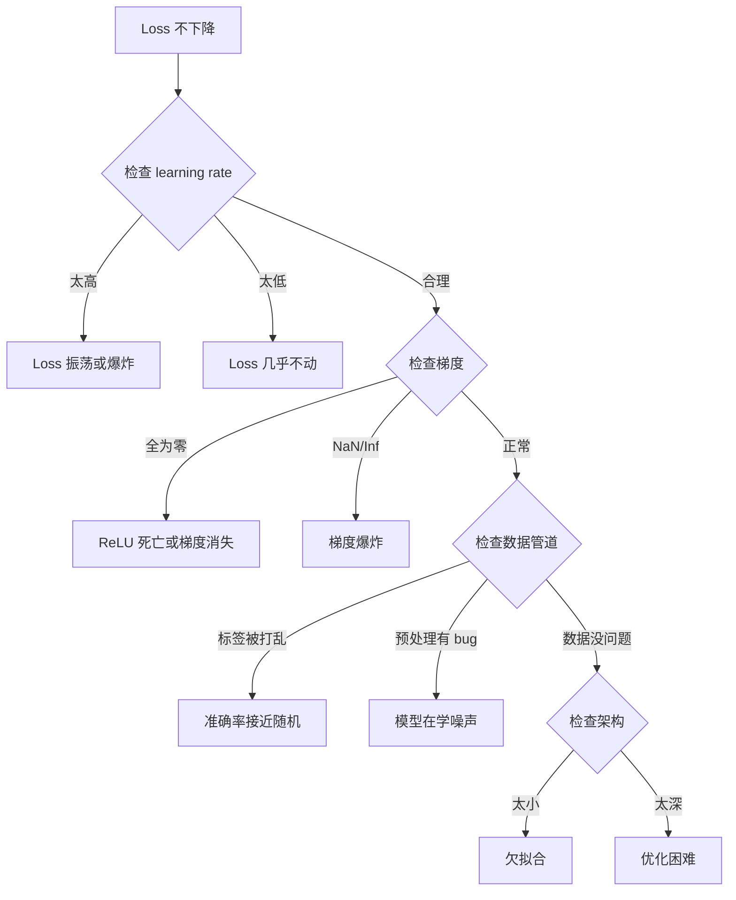
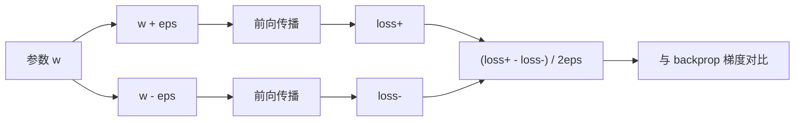
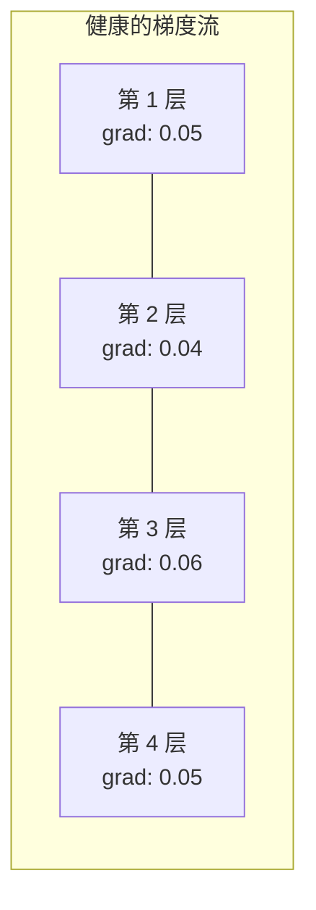
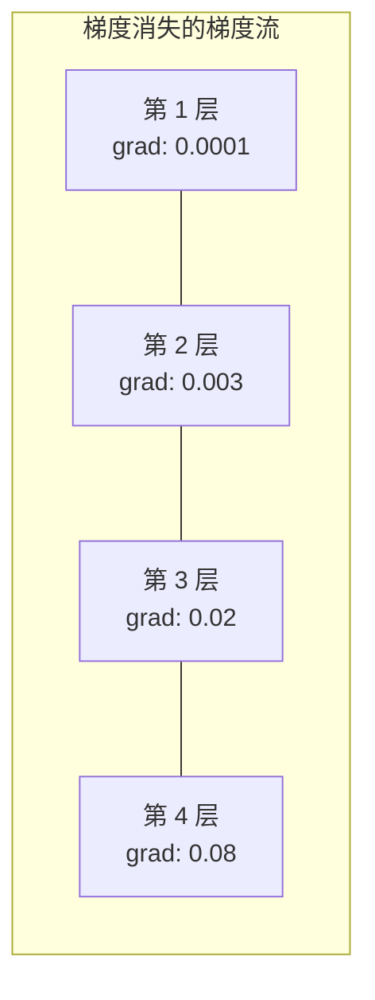

# 调试神经网络

> 译注：本文译自同目录 [`en.md`](./en.md)。术语遵循仓根 [TRANSLATION_GUIDE.md](../../../../TRANSLATION_GUIDE.md)。

> 你的网络编译通过了。它运行了。它输出了一个数字。这个数字是错的，而且什么都没崩。欢迎来到最难调的那种 bug —— 没有报错信息的那种。

**Type:** Practice
**Languages:** Python, PyTorch
**Prerequisites:** Phase 03 Lessons 01-10 (especially backpropagation, loss functions, optimizers)
**Time:** ~90 minutes

## 学习目标（Learning Objectives）

- 用系统化的调试策略，诊断常见的神经网络故障（NaN loss、loss 曲线趴平、过拟合、震荡）
- 应用「overfit one batch（过拟合一个 batch）」技巧，验证你的模型架构和训练循环是正确的
- 检查梯度量级、激活分布、权重范数，定位梯度消失 / 梯度爆炸问题
- 搭一份调试 checklist，覆盖数据流水线、模型架构、损失函数、optimizer、学习率这些坑

## 问题（The Problem）

传统软件坏了会崩。空指针抛异常。类型不匹配编译就过不去。off-by-one 错误会输出明显错误的结果。

神经网络才不给你这种待遇。

一个坏掉的神经网络能完整跑完，打印出 loss 值，给出预测结果。loss 可能在下降。预测看起来也像那么回事。但模型其实是悄悄错着的 —— 学到了 shortcut、记住了噪声、或者收敛到了一个没用的局部极小。Google 的研究人员估计，60-70% 的 ML 调试时间都耗在「沉默 bug」上 —— 这些 bug 不报错，但会拖垮模型质量。

一个能用的模型和一个坏掉的模型，差别经常就是错放的那一行代码：少了 `zero_grad()`、维度转置错了、学习率差了 10 倍。经典的 "Recipe for Training Neural Networks"（2019）开篇就是这句话：「最常见的神经网络错误，是不会让程序崩的 bug。」

这节课就是教你怎么找出这些 bug。

## 概念（The Concept）

### 调试心态（The Debugging Mindset）

把那种「打 print 加祈祷」的调试方式忘掉。神经网络调试需要系统化的方法，因为反馈循环很慢（每次训练几分钟到几小时），症状又模糊（一个糟糕的 loss 可能意味着 20 种不同的问题）。

黄金法则：**从最简单的开始，每次只加一块复杂度，每一块都独立验证一遍。**



### 症状 1：loss 不下降（Symptom 1: Loss Not Decreasing）

这是最常见的抱怨。训练循环跑起来了，epoch 一个一个过，loss 却趴在那不动，或者剧烈震荡。

**学习率不对。** 太高：loss 震荡或者直接跳到 NaN。太低：loss 下降太慢，看起来像不动。Adam 从 1e-3 起步。SGD 从 1e-1 或 1e-2 起步。下结论之前，永远先试 3 个跨越 10 倍的学习率（比如 1e-2、1e-3、1e-4）。

**Dead ReLU（神经元死亡）。** 如果一个 ReLU 神经元收到一个很大的负输入，它会输出 0，梯度也是 0，从此再也不激活。如果死掉的神经元够多，网络就学不动了。检查方法：在每个 ReLU 层后面打印激活值精确等于 0 的比例。如果 >50% 都死了，换 LeakyReLU 或者降低学习率。

**梯度消失（Vanishing gradients）。** 在用 sigmoid 或 tanh 激活的深层网络里，梯度反向传播时会指数级缩小。等传到第一层时，梯度已经接近 0。前几层就停止学习了。修法：用 ReLU/GELU、加残差连接、或者用 batch norm。

**梯度爆炸（Exploding gradients）。** 反过来的问题 —— 梯度指数级增长。在 RNN 和很深的网络里常见。loss 跳到 NaN。修法：梯度裁剪（`torch.nn.utils.clip_grad_norm_`）、降低学习率、或加 normalization。

### 症状 2：loss 在降但模型烂（Symptom 2: Loss Decreasing But Model is Bad）

loss 在降。训练准确率到 99%。但测试准确率 55%。或者模型在真实数据上输出胡言乱语。

**过拟合。** 模型在背训练数据，而不是学规律。训练 loss 和验证 loss 之间的差距越来越大。修法：更多数据、dropout、权重衰减、early stopping、数据增强。

**数据泄漏（Data leakage）。** 测试数据漏到训练里去了。准确率高得可疑。常见原因：分割之前先 shuffle、用全数据集的统计量做预处理、不同 split 之间有重复样本。修法：先分割再预处理，检查重复。

**标签错误。** 大多数真实数据集里有 5-10% 的标签是错的（Northcutt 等，2021，"Pervasive Label Errors in Test Sets"）。模型把噪声当规律学。修法：用 confident learning 找出并修正误标样本，或者用 loss truncation 忽略高 loss 样本。

### 症状 3：loss 出现 NaN 或 Inf（Symptom 3: NaN or Inf in Loss）

loss 值变成 `nan` 或 `inf`。训练死了。

**学习率太高。** 梯度更新冲过头，权重爆炸。修法：降 10 倍。

**log(0) 或 log(负数)。** 交叉熵 loss 计算 `log(p)`。如果模型输出恰好是 0 或者负的概率，log 就炸了。修法：把预测值 clamp 到 `[eps, 1-eps]`，`eps=1e-7`。

**除零。** Batch norm 要除以标准差。如果一个 batch 里的值全相同，std=0。修法：在分母上加 epsilon（PyTorch 默认会加，但自定义实现可能没加）。

**数值溢出。** 大的激活喂给 `exp()` 会输出 Inf。softmax 特别容易出这问题。修法：在指数化之前先减最大值（log-sum-exp 技巧）。

### 技巧 1：梯度检查（Technique 1: Gradient Checking）

把你解析得到的梯度（来自 backprop）和数值梯度（来自有限差分）对比。如果对不上，说明你的反向传播有 bug。

参数 `w` 的数值梯度：

```
grad_numerical = (loss(w + eps) - loss(w - eps)) / (2 * eps)
```

一致性指标（相对差）：

```
rel_diff = |grad_analytical - grad_numerical| / max(|grad_analytical|, |grad_numerical|, 1e-8)
```

`rel_diff < 1e-5`：正确。`rel_diff > 1e-3`：几乎肯定有 bug。



### 技巧 2：激活统计（Technique 2: Activation Statistics）

训练时监控每一层激活值的均值和标准差。健康的网络，激活值的均值在 0 附近、标准差在 1 附近（normalize 之后），或者至少是有界的。

| 健康指标 | Mean | Std | 诊断 |
|-----------------|------|-----|-----------|
| 健康 | ~0 | ~1 | 网络在正常学习 |
| 饱和 | >>0 或 <<0 | ~0 | 激活卡在极端值 |
| 死亡 | 0 | 0 | 神经元死了（全 0） |
| 爆炸 | >>10 | >>10 | 激活无界增长 |

### 技巧 3：梯度流可视化（Technique 3: Gradient Flow Visualization）

把每层平均梯度量级画出来。健康的网络里，各层梯度量级应该差不多。如果前几层的梯度比后几层小 1000 倍，那就是梯度消失。





### 技巧 4：过拟合一个 batch（Technique 4: The Overfit-One-Batch Test）

深度学习里最重要的单一调试技巧。

拿一个小 batch（8-32 个样本）。在它上面训练 100+ 次迭代。loss 应该接近 0，训练准确率应该达到 100%。如果做不到，说明你的模型或者训练循环有根本性 bug —— 不要继续走完整训练。

这个测试能抓出：
- 损失函数写坏了
- 反向传播写坏了
- 架构太小，表达不了数据
- optimizer 没接到模型参数上
- 数据和标签对错位了

跑这个测试只要 30 秒，能省下你调试完整训练的几个小时。

### 技巧 5：学习率查找器（Technique 5: Learning Rate Finder）

Leslie Smith（2017）提出在一个 epoch 内把学习率从极小（1e-7）扫到极大（10），同时记录 loss。画 loss vs 学习率的图。最优学习率大约比 loss 下降最快的那个点小 10 倍。


这个例子里最优学习率：~1e-3（最陡点之前一个数量级）。

### 常见的 PyTorch bug（Common PyTorch Bugs）

下面这些 bug 在 PyTorch 社区里集体浪费了最多时间：

| Bug | 症状 | 修法 |
|-----|---------|-----|
| 忘了 `optimizer.zero_grad()` | 梯度跨 batch 累加，loss 震荡 | 在 `loss.backward()` 之前加 `optimizer.zero_grad()` |
| 测试时忘了 `model.eval()` | dropout 和 batch norm 行为不同，测试准确率每次都不一样 | 加 `model.eval()` 和 `torch.no_grad()` |
| tensor 形状错了 | 静默 broadcasting 算出错的结果，不报错 | 调试期间每个操作后都打印 shape |
| CPU/GPU 不匹配 | `RuntimeError: expected CUDA tensor` | 模型和数据都要 `.to(device)` |
| 没有 detach tensor | 计算图无限增长，OOM | 用 `.detach()` 或 `with torch.no_grad()` |
| in-place 操作破坏 autograd | `RuntimeError: modified by in-place operation` | 把 `x += 1` 换成 `x = x + 1` |
| 数据没归一化 | loss 卡在随机水平 | 把输入归一化到 mean=0, std=1 |
| 标签 dtype 错了 | 交叉熵期望 `Long`，传了 `Float` | 类型转换：`labels.long()` |

### 调试主表（The Master Debugging Table）

| 症状 | 可能原因 | 第一个尝试 |
|---------|-------------|-------------------|
| loss 卡在 -log(1/num_classes) | 模型在预测均匀分布 | 检查数据流水线，验证标签和输入对得上 |
| 几步之后 loss 变 NaN | 学习率太高 | 学习率降 10 倍 |
| 一开始 loss 就 NaN | log(0) 或除零 | 在 log/除法操作里加 epsilon |
| loss 剧烈震荡 | 学习率太高或 batch 太小 | 降学习率，加大 batch |
| loss 先降后趴平 | 微调阶段学习率太高 | 加学习率调度（cosine 或 step decay） |
| 训练准确率高、测试准确率低 | 过拟合 | 加 dropout、weight decay、更多数据 |
| 训练准确率 = 测试准确率 = 随机水平 | 模型啥也没学 | 跑过拟合一个 batch 测试 |
| 训练准确率 = 测试准确率，但都很低 | 欠拟合 | 加大模型、加层、加特征 |
| 梯度全 0 | Dead ReLU 或计算图被 detach | 换 LeakyReLU，检查 `.requires_grad` |
| 训练时显存爆 | batch 太大或图没释放 | 减小 batch，eval 用 `torch.no_grad()` |

## 动手实现（Build It）

一个诊断工具包，监控激活、梯度和 loss 曲线。你会故意把一个网络弄坏，然后用工具包诊断每个问题。

### 第 1 步：NetworkDebugger 类（Step 1: The NetworkDebugger Class）

挂钩到 PyTorch 模型上，按层记录激活和梯度的统计信息。

```python
import torch
import torch.nn as nn
import math


class NetworkDebugger:
    def __init__(self, model):
        self.model = model
        self.activation_stats = {}
        self.gradient_stats = {}
        self.loss_history = []
        self.lr_losses = []
        self.hooks = []
        self._register_hooks()

    def _register_hooks(self):
        for name, module in self.model.named_modules():
            if isinstance(module, (nn.Linear, nn.Conv2d, nn.ReLU, nn.LeakyReLU)):
                hook = module.register_forward_hook(self._make_activation_hook(name))
                self.hooks.append(hook)
                hook = module.register_full_backward_hook(self._make_gradient_hook(name))
                self.hooks.append(hook)

    def _make_activation_hook(self, name):
        def hook(module, input, output):
            with torch.no_grad():
                out = output.detach().float()
                self.activation_stats[name] = {
                    "mean": out.mean().item(),
                    "std": out.std().item(),
                    "fraction_zero": (out == 0).float().mean().item(),
                    "min": out.min().item(),
                    "max": out.max().item(),
                }
        return hook

    def _make_gradient_hook(self, name):
        def hook(module, grad_input, grad_output):
            if grad_output[0] is not None:
                with torch.no_grad():
                    grad = grad_output[0].detach().float()
                    self.gradient_stats[name] = {
                        "mean": grad.mean().item(),
                        "std": grad.std().item(),
                        "abs_mean": grad.abs().mean().item(),
                        "max": grad.abs().max().item(),
                    }
        return hook

    def record_loss(self, loss_value):
        self.loss_history.append(loss_value)

    def check_loss_health(self):
        if len(self.loss_history) < 2:
            return "NOT_ENOUGH_DATA"
        recent = self.loss_history[-10:]
        if any(math.isnan(v) or math.isinf(v) for v in recent):
            return "NAN_OR_INF"
        if len(self.loss_history) >= 20:
            first_half = sum(self.loss_history[:10]) / 10
            second_half = sum(self.loss_history[-10:]) / 10
            if second_half >= first_half * 0.99:
                return "NOT_DECREASING"
        if len(recent) >= 5:
            diffs = [recent[i+1] - recent[i] for i in range(len(recent)-1)]
            if max(diffs) - min(diffs) > 2 * abs(sum(diffs) / len(diffs)):
                return "OSCILLATING"
        return "HEALTHY"

    def check_activations(self):
        issues = []
        for name, stats in self.activation_stats.items():
            if stats["fraction_zero"] > 0.5:
                issues.append(f"DEAD_NEURONS: {name} has {stats['fraction_zero']:.0%} zero activations")
            if abs(stats["mean"]) > 10:
                issues.append(f"EXPLODING_ACTIVATIONS: {name} mean={stats['mean']:.2f}")
            if stats["std"] < 1e-6:
                issues.append(f"COLLAPSED_ACTIVATIONS: {name} std={stats['std']:.2e}")
        return issues if issues else ["HEALTHY"]

    def check_gradients(self):
        issues = []
        grad_magnitudes = []
        for name, stats in self.gradient_stats.items():
            grad_magnitudes.append((name, stats["abs_mean"]))
            if stats["abs_mean"] < 1e-7:
                issues.append(f"VANISHING_GRADIENT: {name} abs_mean={stats['abs_mean']:.2e}")
            if stats["abs_mean"] > 100:
                issues.append(f"EXPLODING_GRADIENT: {name} abs_mean={stats['abs_mean']:.2e}")
        if len(grad_magnitudes) >= 2:
            first_mag = grad_magnitudes[0][1]
            last_mag = grad_magnitudes[-1][1]
            if last_mag > 0 and first_mag / last_mag > 100:
                issues.append(f"GRADIENT_RATIO: first/last = {first_mag/last_mag:.0f}x (vanishing)")
        return issues if issues else ["HEALTHY"]

    def print_report(self):
        print("\n=== NETWORK DEBUGGER REPORT ===")
        print(f"\nLoss health: {self.check_loss_health()}")
        if self.loss_history:
            print(f"  Last 5 losses: {[f'{v:.4f}' for v in self.loss_history[-5:]]}")
        print("\nActivation diagnostics:")
        for item in self.check_activations():
            print(f"  {item}")
        print("\nGradient diagnostics:")
        for item in self.check_gradients():
            print(f"  {item}")
        print("\nPer-layer activation stats:")
        for name, stats in self.activation_stats.items():
            print(f"  {name}: mean={stats['mean']:.4f} std={stats['std']:.4f} zero={stats['fraction_zero']:.1%}")
        print("\nPer-layer gradient stats:")
        for name, stats in self.gradient_stats.items():
            print(f"  {name}: abs_mean={stats['abs_mean']:.2e} max={stats['max']:.2e}")

    def remove_hooks(self):
        for hook in self.hooks:
            hook.remove()
        self.hooks.clear()
```

### 第 2 步：过拟合一个 batch 测试（Step 2: The Overfit-One-Batch Test）

```python
def overfit_one_batch(model, x_batch, y_batch, criterion, lr=0.01, steps=200):
    optimizer = torch.optim.Adam(model.parameters(), lr=lr)
    model.train()
    print("\n=== OVERFIT ONE BATCH TEST ===")
    print(f"Batch size: {x_batch.shape[0]}, Steps: {steps}")

    for step in range(steps):
        optimizer.zero_grad()
        output = model(x_batch)
        loss = criterion(output, y_batch)
        loss.backward()
        optimizer.step()

        if step % 50 == 0 or step == steps - 1:
            with torch.no_grad():
                preds = (output > 0).float() if output.shape[-1] == 1 else output.argmax(dim=1)
                targets = y_batch if y_batch.dim() == 1 else y_batch.squeeze()
                acc = (preds.squeeze() == targets).float().mean().item()
            print(f"  Step {step:3d} | Loss: {loss.item():.6f} | Accuracy: {acc:.1%}")

    final_loss = loss.item()
    if final_loss > 0.1:
        print(f"\n  FAIL: Loss did not converge ({final_loss:.4f}). Model or training loop is broken.")
        return False
    print(f"\n  PASS: Loss converged to {final_loss:.6f}")
    return True
```

### 第 3 步：学习率查找器（Step 3: Learning Rate Finder）

```python
def find_learning_rate(model, x_data, y_data, criterion, start_lr=1e-7, end_lr=10, steps=100):
    import copy
    original_state = copy.deepcopy(model.state_dict())
    optimizer = torch.optim.SGD(model.parameters(), lr=start_lr)
    lr_mult = (end_lr / start_lr) ** (1 / steps)

    model.train()
    results = []
    best_loss = float("inf")
    current_lr = start_lr

    print("\n=== LEARNING RATE FINDER ===")

    for step in range(steps):
        optimizer.zero_grad()
        output = model(x_data)
        loss = criterion(output, y_data)

        if math.isnan(loss.item()) or loss.item() > best_loss * 10:
            break

        best_loss = min(best_loss, loss.item())
        results.append((current_lr, loss.item()))

        loss.backward()
        optimizer.step()

        current_lr *= lr_mult
        for param_group in optimizer.param_groups:
            param_group["lr"] = current_lr

    model.load_state_dict(original_state)

    if len(results) < 10:
        print("  Could not complete LR sweep -- loss diverged too quickly")
        return results

    min_loss_idx = min(range(len(results)), key=lambda i: results[i][1])
    suggested_lr = results[max(0, min_loss_idx - 10)][0]

    print(f"  Swept {len(results)} steps from {start_lr:.0e} to {results[-1][0]:.0e}")
    print(f"  Minimum loss {results[min_loss_idx][1]:.4f} at lr={results[min_loss_idx][0]:.2e}")
    print(f"  Suggested learning rate: {suggested_lr:.2e}")

    return results
```

### 第 4 步：梯度检查器（Step 4: Gradient Checker）

```python
def _flat_to_multi_index(flat_idx, shape):
    multi_idx = []
    remaining = flat_idx
    for dim in reversed(shape):
        multi_idx.insert(0, remaining % dim)
        remaining //= dim
    return tuple(multi_idx)


def gradient_check(model, x, y, criterion, eps=1e-4):
    model.train()
    x_double = x.double()
    y_double = y.double()
    model_double = model.double()

    print("\n=== GRADIENT CHECK ===")
    overall_max_diff = 0
    checked = 0

    for name, param in model_double.named_parameters():
        if not param.requires_grad:
            continue

        layer_max_diff = 0

        model_double.zero_grad()
        output = model_double(x_double)
        loss = criterion(output, y_double)
        loss.backward()
        analytical_grad = param.grad.clone()

        num_checks = min(5, param.numel())
        for i in range(num_checks):
            idx = _flat_to_multi_index(i, param.shape)
            original = param.data[idx].item()

            param.data[idx] = original + eps
            with torch.no_grad():
                loss_plus = criterion(model_double(x_double), y_double).item()

            param.data[idx] = original - eps
            with torch.no_grad():
                loss_minus = criterion(model_double(x_double), y_double).item()

            param.data[idx] = original

            numerical = (loss_plus - loss_minus) / (2 * eps)
            analytical = analytical_grad[idx].item()

            denom = max(abs(numerical), abs(analytical), 1e-8)
            rel_diff = abs(numerical - analytical) / denom

            layer_max_diff = max(layer_max_diff, rel_diff)
            checked += 1

        overall_max_diff = max(overall_max_diff, layer_max_diff)
        status = "OK" if layer_max_diff < 1e-5 else "MISMATCH"
        print(f"  {name}: max_rel_diff={layer_max_diff:.2e} [{status}]")

    model.float()

    print(f"\n  Checked {checked} parameters")
    if overall_max_diff < 1e-5:
        print("  PASS: Gradients match (rel_diff < 1e-5)")
    elif overall_max_diff < 1e-3:
        print("  WARN: Small differences (1e-5 < rel_diff < 1e-3)")
    else:
        print("  FAIL: Gradient mismatch detected (rel_diff > 1e-3)")
    return overall_max_diff
```

### 第 5 步：故意弄坏的网络（Step 5: Deliberately Broken Networks）

现在把工具包用在坏掉的网络上，逐个诊断。

```python
def demo_broken_networks():
    torch.manual_seed(42)
    x = torch.randn(64, 10)
    y = (x[:, 0] > 0).long()

    print("\n" + "=" * 60)
    print("BUG 1: Learning rate too high (lr=10)")
    print("=" * 60)
    model1 = nn.Sequential(nn.Linear(10, 32), nn.ReLU(), nn.Linear(32, 2))
    debugger1 = NetworkDebugger(model1)
    optimizer1 = torch.optim.SGD(model1.parameters(), lr=10.0)
    criterion = nn.CrossEntropyLoss()
    for step in range(20):
        optimizer1.zero_grad()
        out = model1(x)
        loss = criterion(out, y)
        debugger1.record_loss(loss.item())
        loss.backward()
        optimizer1.step()
    debugger1.print_report()
    debugger1.remove_hooks()

    print("\n" + "=" * 60)
    print("BUG 2: Dead ReLUs from bad initialization")
    print("=" * 60)
    model2 = nn.Sequential(nn.Linear(10, 32), nn.ReLU(), nn.Linear(32, 32), nn.ReLU(), nn.Linear(32, 2))
    with torch.no_grad():
        for m in model2.modules():
            if isinstance(m, nn.Linear):
                m.weight.fill_(-1.0)
                m.bias.fill_(-5.0)
    debugger2 = NetworkDebugger(model2)
    optimizer2 = torch.optim.Adam(model2.parameters(), lr=1e-3)
    for step in range(50):
        optimizer2.zero_grad()
        out = model2(x)
        loss = criterion(out, y)
        debugger2.record_loss(loss.item())
        loss.backward()
        optimizer2.step()
    debugger2.print_report()
    debugger2.remove_hooks()

    print("\n" + "=" * 60)
    print("BUG 3: Missing zero_grad (gradients accumulate)")
    print("=" * 60)
    model3 = nn.Sequential(nn.Linear(10, 32), nn.ReLU(), nn.Linear(32, 2))
    debugger3 = NetworkDebugger(model3)
    optimizer3 = torch.optim.SGD(model3.parameters(), lr=0.01)
    for step in range(50):
        out = model3(x)
        loss = criterion(out, y)
        debugger3.record_loss(loss.item())
        loss.backward()
        optimizer3.step()
    debugger3.print_report()
    debugger3.remove_hooks()

    print("\n" + "=" * 60)
    print("HEALTHY NETWORK: Correct setup for comparison")
    print("=" * 60)
    model_good = nn.Sequential(nn.Linear(10, 32), nn.ReLU(), nn.Linear(32, 2))
    debugger_good = NetworkDebugger(model_good)
    optimizer_good = torch.optim.Adam(model_good.parameters(), lr=1e-3)
    for step in range(50):
        optimizer_good.zero_grad()
        out = model_good(x)
        loss = criterion(out, y)
        debugger_good.record_loss(loss.item())
        loss.backward()
        optimizer_good.step()
    debugger_good.print_report()
    debugger_good.remove_hooks()

    print("\n" + "=" * 60)
    print("OVERFIT-ONE-BATCH TEST (healthy model)")
    print("=" * 60)
    model_test = nn.Sequential(nn.Linear(10, 32), nn.ReLU(), nn.Linear(32, 2))
    overfit_one_batch(model_test, x[:8], y[:8], criterion)

    print("\n" + "=" * 60)
    print("LEARNING RATE FINDER")
    print("=" * 60)
    model_lr = nn.Sequential(nn.Linear(10, 32), nn.ReLU(), nn.Linear(32, 2))
    find_learning_rate(model_lr, x, y, criterion)

    print("\n" + "=" * 60)
    print("GRADIENT CHECK")
    print("=" * 60)
    model_grad = nn.Sequential(nn.Linear(10, 8), nn.ReLU(), nn.Linear(8, 2))
    gradient_check(model_grad, x[:4], y[:4], criterion)
```

## 用起来（Use It）

### PyTorch 内置工具（PyTorch Built-in Tools）

```python
import torch
import torch.nn as nn

model = nn.Sequential(
    nn.Linear(768, 256),
    nn.ReLU(),
    nn.Linear(256, 10),
)

with torch.autograd.detect_anomaly():
    output = model(input_tensor)
    loss = criterion(output, target)
    loss.backward()

for name, param in model.named_parameters():
    if param.grad is not None:
        print(f"{name}: grad_mean={param.grad.abs().mean():.2e}")
```

### Weights & Biases 集成（Weights & Biases Integration）

```python
import wandb

wandb.init(project="debug-training")

for epoch in range(100):
    loss = train_one_epoch()
    wandb.log({
        "loss": loss,
        "lr": optimizer.param_groups[0]["lr"],
        "grad_norm": torch.nn.utils.clip_grad_norm_(model.parameters(), float("inf")),
    })

    for name, param in model.named_parameters():
        if param.grad is not None:
            wandb.log({f"grad/{name}": wandb.Histogram(param.grad.cpu().numpy())})
```

### TensorBoard

```python
from torch.utils.tensorboard import SummaryWriter

writer = SummaryWriter("runs/debug_experiment")

for epoch in range(100):
    loss = train_one_epoch()
    writer.add_scalar("Loss/train", loss, epoch)

    for name, param in model.named_parameters():
        writer.add_histogram(f"weights/{name}", param, epoch)
        if param.grad is not None:
            writer.add_histogram(f"gradients/{name}", param.grad, epoch)
```

### 调试 checklist（在完整训练之前）（The Debug Checklist (Before Full Training)）

1. 跑过拟合一个 batch 测试。失败了就停。
2. 打印模型摘要 —— 验证参数量是合理的。
3. 用随机数据跑一次前向传播 —— 检查输出 shape。
4. 训 5 个 epoch —— 验证 loss 在降。
5. 检查激活统计 —— 没有死层、没有爆炸。
6. 检查梯度流 —— 没有消失、没有爆炸。
7. 验证数据流水线 —— 打印 5 个随机样本和它们的标签。

## 上线部署（Ship It）

这节课产出：
- `outputs/prompt-nn-debugger.md` —— 用于诊断神经网络训练失败的 prompt
- `outputs/skill-debug-checklist.md` —— 用于调试训练问题的决策树 checklist

调试相关的关键部署模式：
- 给生产环境的训练脚本加监控钩子
- 每 N 步把激活和梯度统计记录到 W&B 或 TensorBoard
- 给 NaN loss、死神经元（>80% 为 0）、梯度爆炸做自动告警
- 改架构或数据流水线的时候，永远跑一遍过拟合一个 batch 测试

## 练习（Exercises）

1. **加一个梯度爆炸探测器。** 改造 `NetworkDebugger`，让它在梯度超过阈值时检测出来，并自动建议一个梯度裁剪值。在一个没有 normalization 的 20 层网络上测试。

2. **写一个死神经元复活器。** 写一个函数，识别死掉的 ReLU 神经元（永远输出 0），用 Kaiming 初始化重新初始化它们的输入权重。证明这能救活一个 >70% 神经元已死的网络。

3. **实现带画图的学习率查找器。** 扩展 `find_learning_rate`，把结果存成 CSV，再写一个独立脚本读 CSV，用 matplotlib 画 LR vs loss 曲线。在 CIFAR-10 上为 ResNet-18 找出最优学习率。

4. **做一个数据流水线验证器。** 写一个函数，检查：训练/测试 split 之间的重复样本、标签分布不平衡（>10:1）、输入归一化情况（mean 接近 0、std 接近 1）、数据里的 NaN/Inf 值。在一个故意污染过的数据集上跑。

5. **调一个真实故障。** 拿 Lesson 10 的 mini-framework，引入一个微妙的 bug（比如反向传播里把权重矩阵转置），用梯度检查精确定位是哪个参数的梯度错了。把调试过程写下来。

## 关键术语（Key Terms）

| 术语 | 别人怎么说 | 它实际是什么 |
|------|----------------|----------------------|
| 沉默 bug（Silent bug） | 「能跑，但结果烂」 | 一个不报错但会拖垮模型质量的 bug —— ML 里占主导地位的失败模式 |
| Dead ReLU | 「神经元死了」 | 一个 ReLU 神经元的输入永远是负的，所以它输出 0、永远收到 0 梯度 |
| 梯度消失（Vanishing gradients） | 「前几层不学了」 | 梯度逐层指数级衰减，让前几层的权重实际上被冻住 |
| 梯度爆炸（Exploding gradients） | 「loss 跑成 NaN 了」 | 梯度逐层指数级增长，权重更新大到溢出 |
| 梯度检查（Gradient checking） | 「验证 backprop 写对没」 | 把 backprop 解析得到的梯度，和有限差分得到的数值梯度对比 |
| 过拟合一个 batch（Overfit-one-batch） | 「最重要的调试测试」 | 在一个小 batch 上训练，验证模型「能」学会 —— 学不会就说明有根本性问题 |
| LR finder | 「扫一遍找合适的学习率」 | 在一个 epoch 内指数级提升学习率，挑 loss 发散前的那个值 |
| 数据泄漏（Data leakage） | 「测试数据漏到训练里了」 | 测试集的信息污染了训练，导致虚高的准确率 |
| 激活统计（Activation statistics） | 「监控层的健康度」 | 跟踪每层输出的均值、std、零比例，检测死掉、饱和、爆炸的神经元 |
| 梯度裁剪（Gradient clipping） | 「给梯度量级封顶」 | 当梯度范数超过阈值时把它缩小，防止梯度爆炸式更新 |

## 延伸阅读（Further Reading）

- Smith, "Cyclical Learning Rates for Training Neural Networks" (2017) —— 提出学习率范围测试（LR finder）的论文
- Northcutt et al., "Pervasive Label Errors in Test Sets Destabilize Machine Learning Benchmarks" (2021) —— 证明 ImageNet、CIFAR-10 等主要 benchmark 里有 3-6% 的标签是错的
- Zhang et al., "Understanding Deep Learning Requires Rethinking Generalization" (2017) —— 这篇论文展示了神经网络可以记住随机标签，这也是过拟合一个 batch 测试能成立的原因
- PyTorch 关于 `torch.autograd.detect_anomaly` 和 `torch.autograd.set_detect_anomaly` 的文档，用于内置的 NaN/Inf 检测
