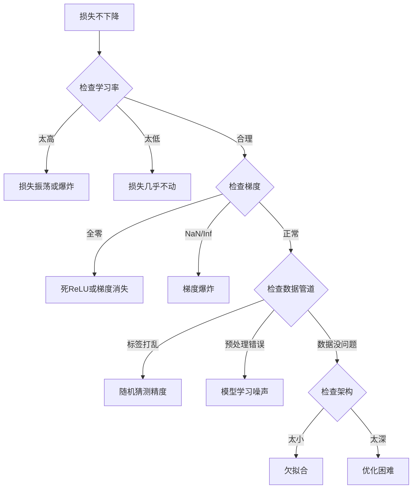
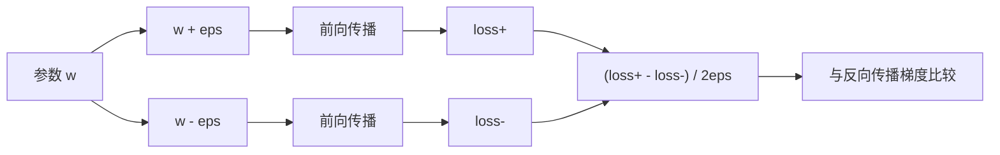
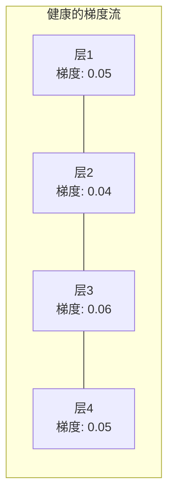
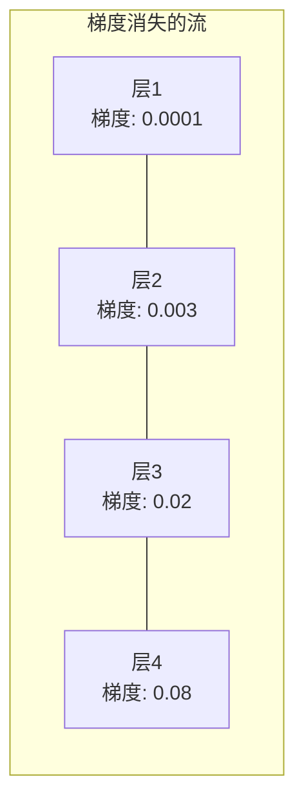
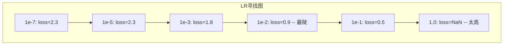

# 调试神经网络（Debugging Neural Networks）

> 你的网络编译通过了，运行了，输出了一个数字。这个数字是错误的，但什么也没有崩溃。欢迎来到最难的一种调试 —— 没有错误消息的那种。

**类型：** 实践
**语言：** Python, PyTorch
**前置知识：** 阶段03课程01-10（特别是反向传播、损失函数、优化器）
**时间：** 约90分钟

## 学习目标

- 使用系统性的调试策略诊断常见的神经网络故障（NaN损失、平坦的损失曲线、过拟合、振荡）
- 应用"过拟合一个批次"技术来验证模型架构和训练循环是否正确
- 检查梯度大小、激活分布和权重范数，以识别梯度消失/爆炸问题
- 构建一个涵盖数据管道、模型架构、损失函数、优化器和学习率问题的调试检查清单

## 问题

传统软件在出现故障时会崩溃。空指针会抛出异常。类型不匹配会在编译时失败。差一错误会产生明显错误的输出。

神经网络不会给你这种奢侈。

损坏的神经网络会运行到结束，打印一个损失值，并输出预测。损失可能会下降。预测可能看起来合理。但模型是悄悄地出错 —— 学习捷径、记忆噪声、或收敛到无用的局部最小值。Google的研究人员估计，60-70%的机器学习调试时间花在了"静默"错误上，这些错误不会产生报错但会降低模型质量。

一个正常工作的模型和一个损坏的模型之间的差异往往只是一行位置错误：缺少 `zero_grad()`、维度转置、学习率差了10倍。经典的"训练神经网络配方"（2019）以这句话开头："最常见的神经网络错误是不会导致崩溃的bug。"

这节课程教你如何找到这些错误。

## 概念

### 调试心态

忘掉"打印并祈祷"式的调试。神经网络调试需要系统性的方法，因为反馈循环很慢（每次训练运行几分钟到几小时），并且症状很模糊（损失不好可能意味着20种不同的原因）。

黄金法则：**从简单开始，一次只增加一个复杂度，并独立验证每个部分。**



### 症状1：损失不下降

这是最常见的抱怨。训练循环运行，轮次不断更新，损失保持平坦或剧烈振荡。

**错误的学习率。** 太高：损失振荡或跳到NaN。太低：损失下降非常缓慢，看起来是平坦的。对于Adam，从1e-3开始。对于SGD，从1e-1或1e-2开始。在得出结论其他问题之前，总是尝试3个相差10倍的学习率（例如1e-2、1e-3、1e-4）。

**死ReLU。** 如果一个ReLU神经元收到大的负输入，它输出0，梯度为0。它再也不会激活。如果足够多的神经元死亡，网络无法学习。检查：打印每个ReLU层后激活恰好为0的比例。如果>50%是死的，切换到LeakyReLU或降低学习率。

**梯度消失。** 在深度网络中，使用sigmoid或tanh激活函数时，梯度在反向传播时指数级缩小。当它们到达第一层时，几乎为0。前几层停止学习。修复：使用ReLU/GELU、添加残差连接或使用批归一化。

**梯度爆炸。** 相反的问题 —— 梯度指数级增长。常见于RNN和非常深的网络。损失跳到NaN。修复：梯度裁剪（`torch.nn.utils.clip_grad_norm_`）、降低学习率或添加归一化。

### 症状2：损失下降但模型效果差

损失下降。训练准确率达到99%。但测试准确率为55%。或者模型在真实数据上产生无意义的输出。

**过拟合。** 模型记住了训练数据而不是学习模式。训练和验证损失之间的差距随时间增大。修复：更多数据、dropout、权重衰减、早停、数据增强。

**数据泄漏。** 测试数据泄漏到了训练中。准确率出奇地高。常见原因：在划分之前打乱、使用整个数据集的统计量进行预处理、不同划分中存在重复样本。修复：先划分再预处理、检查重复。

**标签错误。** 大多数真实数据集中5-10%的标签是错误的（Northcutt等人，2021 —— "测试集中普遍存在的标签错误"）。模型学习噪声。修复：使用置信学习（confident learning）来发现并修正错误标记的样本，或使用损失截断（loss truncation）忽略高损失样本。

### 症状3：损失为NaN或Inf

损失值变为`nan`或`inf`。训练死掉了。

**学习率太高。** 梯度更新过度，导致权重爆炸。修复：降低10倍。

**log(0)或log(负数)。** 交叉熵损失计算`log(p)`。如果你的模型输出恰好为0或负概率，log就爆炸了。修复：将预测限制在`[eps, 1-eps]`，其中`eps=1e-7`。

**除以零。** 批归一化除以标准差。一个常数值的批次std=0。修复：在分母中添加epsilon（PyTorch默认这样做，但自定义实现可能没有）。

**数值溢出。** 大的激活值输入到`exp()`会产生Inf。Softmax尤其容易。修复：在指数化之前减去最大值（log-sum-exp技巧）。

### 技巧1：梯度检查（Gradient Checking）

比较来自反向传播的分析梯度与来自有限差分的数值梯度。如果它们不一致，说明你的反向传播有错误。

参数`w`的数值梯度：

```
grad_numerical = (loss(w + eps) - loss(w - eps)) / (2 * eps)
```

一致性度量（相对差异）：

```
rel_diff = |grad_analytical - grad_numerical| / max(|grad_analytical|, |grad_numerical|, 1e-8)
```

如果`rel_diff < 1e-5`：正确。如果`rel_diff > 1e-3`：几乎肯定是错误。



### 技巧2：激活统计（Activation Statistics）

训练过程中监控每一层激活值的均值和标准差。健康的网络在归一化后或至少在有界范围内，激活值的均值接近0、标准差接近1。

| 健康指标 | 均值 | 标准差 | 诊断 |
|---------|------|--------|------|
| 健康 | ~0 | ~1 | 网络正常学习 |
| 饱和 | 远大于0或远小于0 | ~0 | 激活值卡在极端值上 |
| 死亡 | 0 | 0 | 神经元死亡（全零） |
| 爆炸 | 远大于10 | 远大于10 | 激活值无界增长 |

### 技巧3：梯度流可视化（Gradient Flow Visualization）

绘制每一层的平均梯度大小。在健康的网络中，各层的梯度大小应该大致相似。如果前几层的梯度比后几层小1000倍，则存在梯度消失。





### 技巧4：过拟合一个批次测试（Overfit-One-Batch Test）

深度学习中最重要的一项调试技术。

取一个小批次（8-32个样本）。在上面训练100+步。损失应该几乎降到零，训练准确率应该达到100%。如果没有，你的模型或训练循环存在根本性错误 —— 不要继续全量训练。

这个测试能捕捉到：
- 损坏的损失函数
- 损坏的反向传播
- 架构太小，无法表示数据
- 优化器未连接到模型参数
- 数据和标签不对齐

这只需要30秒运行，可以节省数小时的完整训练调试。

### 技巧5：学习率寻找器（Learning Rate Finder）

Leslie Smith (2017) 提出在一个epoch内从非常小的学习率（1e-7）扫到非常大的学习率（10），同时记录损失。绘制损失 vs 学习率图。最优学习率大致比损失开始最快下降的学习率小10倍。



此例中的最佳学习率：~1e-3（比最陡点小一个数量级）。

### 常见PyTorch错误

这些是在PyTorch社区中浪费最多集体时间的错误：

| 错误 | 症状 | 修复 |
|-----|------|------|
| 忘记`optimizer.zero_grad()` | 梯度跨批次累积，损失振荡 | 在`loss.backward()`之前添加`optimizer.zero_grad()` |
| 测试时忘记`model.eval()` | Dropout和批归一化行为不同，测试准确率因运行而异 | 添加`model.eval()`和`torch.no_grad()` |
| 张量形状错误 | 静默广播导致错误结果，无报错 | 调试期间在每个操作后打印形状 |
| CPU/GPU不匹配 | `RuntimeError: expected CUDA tensor` | 在模型和数据上都使用`.to(device)` |
| 未分离张量 | 计算图无限增长，内存溢出 | 使用`.detach()`或`with torch.no_grad()` |
| 原地操作破坏自动求导 | `RuntimeError: modified by in-place operation` | 将`x += 1`替换为`x = x + 1` |
| 数据未归一化 | 损失停滞在随机猜测水平 | 将输入归一化为mean=0, std=1 |
| 标签数据类型错误 | 交叉熵期望`Long`，得到`Float` | 转换标签：`labels.long()` |

### 主调试表

| 症状 | 可能原因 | 首先尝试的方法 |
|------|---------|----------------|
| 损失停滞在 -log(1/num_classes) | 模型预测均匀分布 | 检查数据管道，验证标签与输入匹配 |
| 几步后损失NaN | 学习率太高 | 降低LR 10倍 |
| 立即出现NaN损失 | log(0)或除以零 | 在log/除法操作中添加epsilon |
| 损失剧烈振荡 | LR太高或批量大小太小 | 降低LR，增大批量大小 |
| 损失下降后停滞 | 学习率对于微调阶段太高 | 添加LR调度（余弦或阶梯衰减） |
| 训练准确率高、测试准确率低 | 过拟合 | 添加dropout、权重衰减、更多数据 |
| 训练准确率=测试准确率=随机水平 | 模型没有学到任何东西 | 运行过拟合一个批次测试 |
| 训练准确率=测试准确率，都低 | 欠拟合 | 更大的模型、更多层、更多特征 |
| 梯度全零 | 死ReLU或分离的计算图 | 切换到LeakyReLU，检查`.requires_grad` |
| 训练时内存溢出 | 批次太大或图未释放 | 减小批次大小，评估时使用`torch.no_grad()` |

## 构建它

一个诊断工具包，用于监控激活值、梯度和损失曲线。你将故意破坏一个网络并使用该工具包诊断每个问题。

### 步骤1：NetworkDebugger类

钩入PyTorch模型，记录每一层的激活和梯度统计。

```python
import torch
import torch.nn as nn
import math


class NetworkDebugger:
    def __init__(self, model):
        self.model = model
        self.activation_stats = {}
        self.gradient_stats = {}
        self.loss_history = []
        self.lr_losses = []
        self.hooks = []
        self._register_hooks()

    def _register_hooks(self):
        for name, module in self.model.named_modules():
            if isinstance(module, (nn.Linear, nn.Conv2d, nn.ReLU, nn.LeakyReLU)):
                hook = module.register_forward_hook(self._make_activation_hook(name))
                self.hooks.append(hook)
                hook = module.register_full_backward_hook(self._make_gradient_hook(name))
                self.hooks.append(hook)

    def _make_activation_hook(self, name):
        def hook(module, input, output):
            with torch.no_grad():
                out = output.detach().float()
                self.activation_stats[name] = {
                    "mean": out.mean().item(),
                    "std": out.std().item(),
                    "fraction_zero": (out == 0).float().mean().item(),
                    "min": out.min().item(),
                    "max": out.max().item(),
                }
        return hook

    def _make_gradient_hook(self, name):
        def hook(module, grad_input, grad_output):
            if grad_output[0] is not None:
                with torch.no_grad():
                    grad = grad_output[0].detach().float()
                    self.gradient_stats[name] = {
                        "mean": grad.mean().item(),
                        "std": grad.std().item(),
                        "abs_mean": grad.abs().mean().item(),
                        "max": grad.abs().max().item(),
                    }
        return hook

    def record_loss(self, loss_value):
        self.loss_history.append(loss_value)

    def check_loss_health(self):
        if len(self.loss_history) < 2:
            return "NOT_ENOUGH_DATA"
        recent = self.loss_history[-10:]
        if any(math.isnan(v) or math.isinf(v) for v in recent):
            return "NAN_OR_INF"
        if len(self.loss_history) >= 20:
            first_half = sum(self.loss_history[:10]) / 10
            second_half = sum(self.loss_history[-10:]) / 10
            if second_half >= first_half * 0.99:
                return "NOT_DECREASING"
        if len(recent) >= 5:
            diffs = [recent[i+1] - recent[i] for i in range(len(recent)-1)]
            if max(diffs) - min(diffs) > 2 * abs(sum(diffs) / len(diffs)):
                return "OSCILLATING"
        return "HEALTHY"

    def check_activations(self):
        issues = []
        for name, stats in self.activation_stats.items():
            if stats["fraction_zero"] > 0.5:
                issues.append(f"DEAD_NEURONS: {name} has {stats['fraction_zero']:.0%} zero activations")
            if abs(stats["mean"]) > 10:
                issues.append(f"EXPLODING_ACTIVATIONS: {name} mean={stats['mean']:.2f}")
            if stats["std"] < 1e-6:
                issues.append(f"COLLAPSED_ACTIVATIONS: {name} std={stats['std']:.2e}")
        return issues if issues else ["HEALTHY"]

    def check_gradients(self):
        issues = []
        grad_magnitudes = []
        for name, stats in self.gradient_stats.items():
            grad_magnitudes.append((name, stats["abs_mean"]))
            if stats["abs_mean"] < 1e-7:
                issues.append(f"VANISHING_GRADIENT: {name} abs_mean={stats['abs_mean']:.2e}")
            if stats["abs_mean"] > 100:
                issues.append(f"EXPLODING_GRADIENT: {name} abs_mean={stats['abs_mean']:.2e}")
        if len(grad_magnitudes) >= 2:
            first_mag = grad_magnitudes[0][1]
            last_mag = grad_magnitudes[-1][1]
            if last_mag > 0 and first_mag / last_mag > 100:
                issues.append(f"GRADIENT_RATIO: first/last = {first_mag/last_mag:.0f}x (vanishing)")
        return issues if issues else ["HEALTHY"]

    def print_report(self):
        print("\n=== 网络调试器报告 ===")
        print(f"\n损失