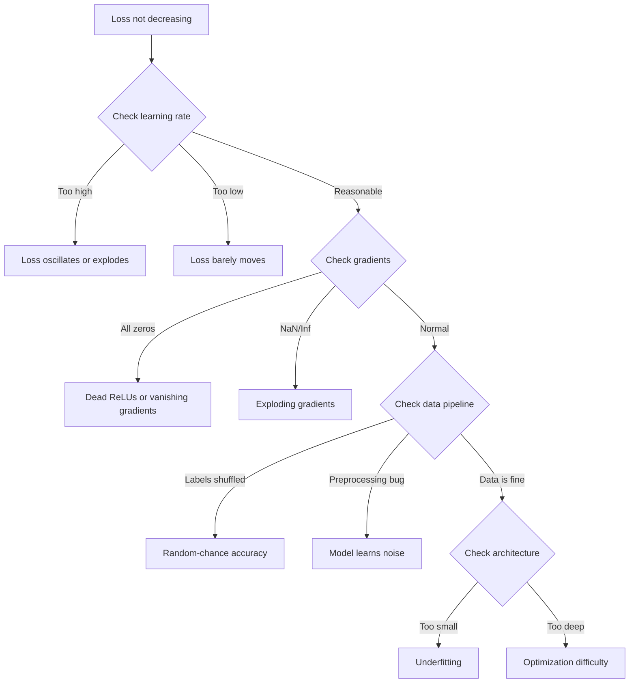
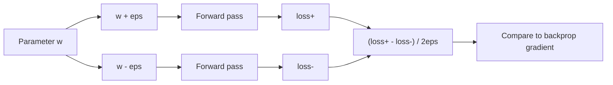
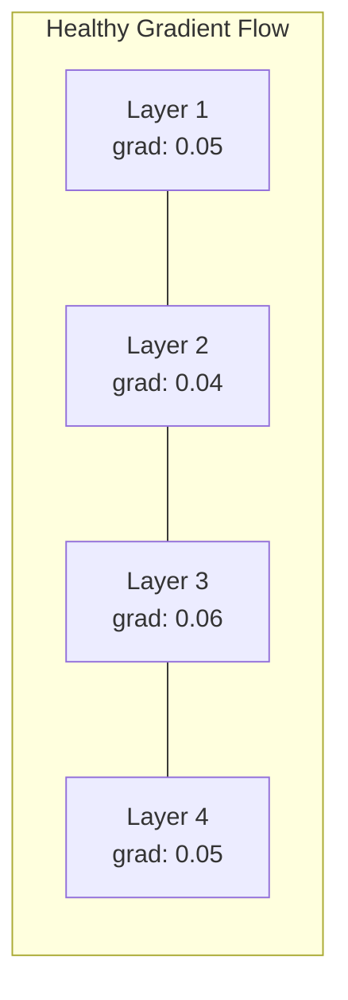
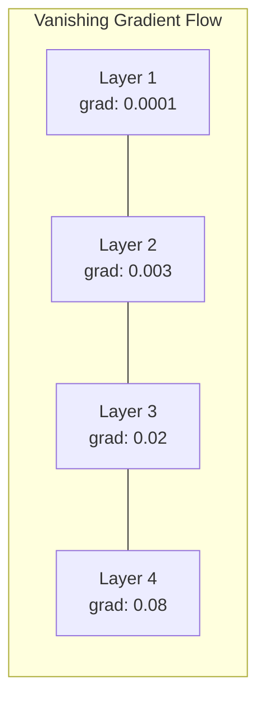
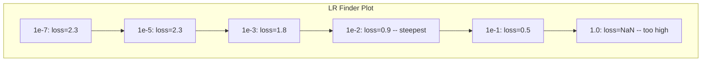

# Debugging Neural Networks

> 您的网络已编译。它跑了。它产生了一个数字。号码是错误的，没有任何东西崩溃。欢迎来到最困难的调试--没有错误消息的调试。

** 类型：** 练习
** 语言：** Python、PyTorch
** 先决条件：** 阶段03课程01-10（尤其是反向传播、损失函数、优化器）
** 时间：** ~90分钟

## Learning Objectives

- 使用系统调试策略诊断常见神经网络故障（NaN损失、平坦损失曲线、过拟、振荡）
- 应用“过度适应一批”技术来验证您的模型架构和训练循环是否正确
- 检查梯度幅度、激活分布和权重规范，以识别消失/爆炸的梯度问题
- 构建调试清单，涵盖数据管道、模型架构、损失函数、优化器和学习率问题

## The Problem

传统软件损坏后就会崩溃。空指针引发异常。类型不匹配在编译时失败。差一的错误会产生明显错误的输出。

神经网络不会给你那么奢侈。

损坏的神经网络运行完成，打印损失值并输出预测。损失可能会减少。这些预测可能看起来可信。但这个模型显然是错误的--学习捷径、记住噪音或收敛到无用的局部最小值。谷歌研究人员估计，60-70%的ML调试时间花在“无声”错误上，这些错误不会产生错误，但会降低模型质量。

工作模型和损坏模型之间的区别通常只是一条放错位置的线：缺失的“zero_grad（）”、转置维度、学习率下降10倍。经典的《训练神经网络的食谱》（2019）以这样的方式开头：“最常见的神经网络错误是不会崩溃的错误。"

本课教你如何找到这些bug。

## The Concept

### The Debugging Mindset

忘记打印并祈祷调试。神经网络调试需要系统性的方法，因为反馈循环很慢（每次训练运行需要几分钟到几个小时），而且症状也很模糊（严重的损失可能意味着20种不同的事情）。

黄金法则：** 从简单开始，一次添加一件复杂性，并独立验证每件事。**



### Symptom 1: Loss Not Decreasing

这是最常见的抱怨。训练循环运行，纪元滴答作响，损失保持平稳或剧烈波动。

** 学习率错误。**太高：损失波动或跳至NaN。太低：损失下降得太慢，看起来很平。对于Adam来说，从1 e-3开始。对于新元，从1 e-1或1 e-2开始。始终尝试3个学习率，每个学习率为10倍（例如，1 e-2、1 e-3、1 e-4），然后得出其他错误的结论。

** 死的ReLU。**如果ReLU神经元接收到大的负输入，则它输出0，并且其梯度为0。它再也不会激活。如果足够多的神经元死亡，网络就无法学习。检查：打印每个ReLU层后的激活分数为0。如果超过50%是死的，切换到LeakyReLU或降低学习率。

** 渐变消失。**在具有sigmoid或tanh激活的深度网络中，梯度在向后传播时呈指数级缩小。当它们到达第一层时，它们为~0。第一层停止学习。修复：使用ReLU/GELU、添加剩余连接或使用批量规范化。

** 爆炸的渐变。**相反的问题--梯度呈指数级增长。常见于RNN和非常深的网络中。损失跃升至NaN。修复：梯度剪裁（' torch.nn.utils.clip_grad_norm_'）、较低的学习率或添加规范化。

### Symptom 2: Loss Decreasing But Model is Bad

损失会下降。训练准确率达到99%。但测试准确率为55%。或者该模型对真实数据产生荒谬的输出。

** 过度贴合。**该模型记忆训练数据而不是学习模式。培训和验证损失之间的差距随着时间的推移而扩大。修复：更多数据、丢失、体重下降、提前停止、数据增强。

** 数据泄露。**测试数据泄露到训练中。准确性高得令人怀疑。常见原因：拆分前洗牌、使用完整数据集的统计数据进行预处理、跨拆分重复样本。修复：先拆分，然后预处理，检查是否重复。

** 标签错误。**大多数真实数据集中有5-10%的标签是错误的（Northcutt等人，2021年--“测试集中普遍存在的标签错误”）。模型学习噪音。修复：使用自信的学习来查找并修复标签错误的示例，或使用损失截断来忽略高损失样本。

### Symptom 3: NaN or Inf in Loss

损失值变为“nan”或“inf”。训练死了。

** 学习率太高。**梯度更新过度，以至于权重爆炸。修复：减少10倍。

**log（0）或log（负）。**交叉熵损失计算“log（p）”。如果您的模型输出的概率恰好为0或负，那么日志就会爆炸。修复：将预测固定为“[eps，1-eps]”，其中“eps= 1 e-7”。

** 除以零。**批规格化除以标准差。具有常数值的批次的std=0。修复：将RST添加到分母（PyTorch默认会这样做，但自定义实现可能不会）。

** 数字溢出。**输入到“BEP（）”的大规模激活会产生Inf. Softmax尤其容易。修复：在取指数之前减去最大值（log-sum-BEP技巧）。

### Technique 1: Gradient Checking

比较你的分析梯度（从反向传播）和数值梯度（从有限差分）。如果他们不同意，你的向后传球就有问题。

参数“w”的数字梯度：

```
grad_numerical = (loss(w + eps) - loss(w - eps)) / (2 * eps)
```

一致性指标（相对差异）：

```
rel_diff = |grad_analytical - grad_numerical| / max(|grad_analytical|, |grad_numerical|, 1e-8)
```

如果' rel_diff '：正确。如果“rel_diff > 1 e-3”：几乎肯定是一个错误。



### Technique 2: Activation Statistics

训练期间每层后监测激活的平均值和标准差。健康的网络保持激活平均值接近0，std接近1（正常化后）或至少有界。

| 健康指标 | 是说 | STD | 诊断 |
|-----------------|------|-----|-----------|
| 健康 | ~0 | ~1 | 网络学习正常 |
| 饱和 | >>0或<<0 | ~0 | 激活停留在极端值 |
| 死 | 0 | 0 | 神经元已死亡（全为零） |
| 爆炸 | >>10 | >>10 | 激活无限增长 |

### Technique 3: Gradient Flow Visualization

绘制每个层的平均梯度幅度。在健康的网络中，各层的梯度幅度应该大致相似。如果早期层的渐变比后期层小1000倍，那么渐变就会消失。





### Technique 4: The Overfit-One-Batch Test

深度学习中最重要的调试技术。

取一小批（8-32个样本）。对其进行100多次迭代训练。损失应该接近为零，训练准确率应该达到100%。如果没有，那么您的模型或训练循环就存在一个根本错误--不要继续进行完整训练。

此测试捕获：
- 破碎的损失功能
- 向后传球失败
- 架构太小，无法代表数据
- 优化器未连接到模型参数
- 数据和标签错位

运行这需要30秒，并节省调试完整培训运行的数小时时间。

### Technique 5: Learning Rate Finder

Leslie Smith（2017）提议在一个时期内将学习率从非常小（1 e-7）扫到非常大（10），同时记录损失。情节损失与学习率。最佳学习率大约比损失开始下降最快的速度小10倍。



本例中的最佳LR：~ 1 e-3（最陡点前一个数量级）。

### Common PyTorch Bugs

这些是PyTorch社区中浪费最多集体时间的错误：

| Bug | 症状 | 修复 |
|-----|---------|-----|
| 忘记“optimizer.zero_grad（）” | 贷款跨批次累积，损失振荡 | 在“loss.backward（）”之前添加“optimizer.zero_grad（）” |
| 测试时忘记“modal.eval（）” | 脱落率和批次规范表现不同，测试准确性在运行之间有所不同 | 添加' modal.eval（）'和' torch.no_grad（）' |
| 错误的张量形状 | 无声广播产生错误结果，没有错误 | 调试期间每次操作后打印形状 |
| 中央处理器/图形处理器不匹配 | ' Runtime错误：预期的CUDA张量' | 在模型和数据上使用' to（设备）' |
| 未分离张量 | 计算图永远增长，OOM | 使用'. disconnect（）'或'与torch.no_grad（）' |
| 就地操作打破自动毕业 | ' Runtime错误：通过就地操作修改' | 将“x += 1”替换为“x = x + 1” |
| 数据未规范化 | 损失停留在随机机会水平 | 将输入归一化为均值=0，标准差=1 |
| 标签为错误的d类型 | 交叉熵期望“Long”，得到“Float” | 演员标签：“labels.long（）” |

### The Master Debugging Table

| 症状 | 可能原因 | 首先要尝试的是 |
|---------|-------------|-------------------|
| 损失停留在-log（1/num_classes） | 预测均匀分布的模型 | 检查数据管道，验证标签与输入匹配 |
| 几步后失去NaN | 学习率太高 | 将LR减少10倍 |
| 立即失去NaN | log（0）或除以零 | 将收件箱添加到日志/部门操作 |
| 损失剧烈波动 | LR太高或批量太小 | 减少LR，增加批量 |
| 损失下降后趋于平稳 | LR对于微调阶段来说太高 | 添加LR时间表（cos或阶跃衰减） |
| 培训acc高，测试acc低 | 过拟合 | 添加脱落、体重下降、更多数据 |
| 培训acc =测试acc =机会 | 模型什么也没学到 | 运行过度适合一批测试 |
| 训练acc =测试acc，但两者都很低 | 欠拟合 | 更大的型号、更多的层次、更多的功能 |
| 学生全部为零 | Dead ReLU或分离的计算图 | 切换到LeakyReLU，检查'. needs_grad ' |
| 训练期间失忆 | 批太大或图形未释放 | 减少批量大小，使用`torch.no_grad（）`进行eval |

## Build It

监控激活、梯度和损失曲线的诊断工具包。您将故意破坏网络并使用工具包来诊断每个问题。

### Step 1: The NetworkDebugger Class

挂钩到PyTorch模型中以记录每层的激活和梯度统计数据。

```python
import torch
import torch.nn as nn
import math


class NetworkDebugger:
    def __init__(self, model):
        self.model = model
        self.activation_stats = {}
        self.gradient_stats = {}
        self.loss_history = []
        self.lr_losses = []
        self.hooks = []
        self._register_hooks()

    def _register_hooks(self):
        for name, module in self.model.named_modules():
            if isinstance(module, (nn.Linear, nn.Conv2d, nn.ReLU, nn.LeakyReLU)):
                hook = module.register_forward_hook(self._make_activation_hook(name))
                self.hooks.append(hook)
                hook = module.register_full_backward_hook(self._make_gradient_hook(name))
                self.hooks.append(hook)

    def _make_activation_hook(self, name):
        def hook(module, input, output):
            with torch.no_grad():
                out = output.detach().float()
                self.activation_stats[name] = {
                    "mean": out.mean().item(),
                    "std": out.std().item(),
                    "fraction_zero": (out == 0).float().mean().item(),
                    "min": out.min().item(),
                    "max": out.max().item(),
                }
        return hook

    def _make_gradient_hook(self, name):
        def hook(module, grad_input, grad_output):
            if grad_output[0] is not None:
                with torch.no_grad():
                    grad = grad_output[0].detach().float()
                    self.gradient_stats[name] = {
                        "mean": grad.mean().item(),
                        "std": grad.std().item(),
                        "abs_mean": grad.abs().mean().item(),
                        "max": grad.abs().max().item(),
                    }
        return hook

    def record_loss(self, loss_value):
        self.loss_history.append(loss_value)

    def check_loss_health(self):
        if len(self.loss_history) < 2:
            return "NOT_ENOUGH_DATA"
        recent = self.loss_history[-10:]
        if any(math.isnan(v) or math.isinf(v) for v in recent):
            return "NAN_OR_INF"
        if len(self.loss_history) >= 20:
            first_half = sum(self.loss_history[:10]) / 10
            second_half = sum(self.loss_history[-10:]) / 10
            if second_half >= first_half * 0.99:
                return "NOT_DECREASING"
        if len(recent) >= 5:
            diffs = [recent[i+1] - recent[i] for i in range(len(recent)-1)]
            if max(diffs) - min(diffs) > 2 * abs(sum(diffs) / len(diffs)):
                return "OSCILLATING"
        return "HEALTHY"

    def check_activations(self):
        issues = []
        for name, stats in self.activation_stats.items():
            if stats["fraction_zero"] > 0.5:
                issues.append(f"DEAD_NEURONS: {name} has {stats['fraction_zero']:.0%} zero activations")
            if abs(stats["mean"]) > 10:
                issues.append(f"EXPLODING_ACTIVATIONS: {name} mean={stats['mean']:.2f}")
            if stats["std"] < 1e-6:
                issues.append(f"COLLAPSED_ACTIVATIONS: {name} std={stats['std']:.2e}")
        return issues if issues else ["HEALTHY"]

    def check_gradients(self):
        issues = []
        grad_magnitudes = []
        for name, stats in self.gradient_stats.items():
            grad_magnitudes.append((name, stats["abs_mean"]))
            if stats["abs_mean"] < 1e-7:
                issues.append(f"VANISHING_GRADIENT: {name} abs_mean={stats['abs_mean']:.2e}")
            if stats["abs_mean"] > 100:
                issues.append(f"EXPLODING_GRADIENT: {name} abs_mean={stats['abs_mean']:.2e}")
        if len(grad_magnitudes) >= 2:
            first_mag = grad_magnitudes[0][1]
            last_mag = grad_magnitudes[-1][1]
            if last_mag > 0 and first_mag / last_mag > 100:
                issues.append(f"GRADIENT_RATIO: first/last = {first_mag/last_mag:.0f}x (vanishing)")
        return issues if issues else ["HEALTHY"]

    def print_report(self):
        print("\n=== NETWORK DEBUGGER REPORT ===")
        print(f"\nLoss health: {self.check_loss_health()}")
        if self.loss_history:
            print(f"  Last 5 losses: {[f'{v:.4f}' for v in self.loss_history[-5:]]}")
        print("\nActivation diagnostics:")
        for item in self.check_activations():
            print(f"  {item}")
        print("\nGradient diagnostics:")
        for item in self.check_gradients():
            print(f"  {item}")
        print("\nPer-layer activation stats:")
        for name, stats in self.activation_stats.items():
            print(f"  {name}: mean={stats['mean']:.4f} std={stats['std']:.4f} zero={stats['fraction_zero']:.1%}")
        print("\nPer-layer gradient stats:")
        for name, stats in self.gradient_stats.items():
            print(f"  {name}: abs_mean={stats['abs_mean']:.2e} max={stats['max']:.2e}")

    def remove_hooks(self):
        for hook in self.hooks:
            hook.remove()
        self.hooks.clear()
```

### Step 2: The Overfit-One-Batch Test

```python
def overfit_one_batch(model, x_batch, y_batch, criterion, lr=0.01, steps=200):
    optimizer = torch.optim.Adam(model.parameters(), lr=lr)
    model.train()
    print("\n=== OVERFIT ONE BATCH TEST ===")
    print(f"Batch size: {x_batch.shape[0]}, Steps: {steps}")

    for step in range(steps):
        optimizer.zero_grad()
        output = model(x_batch)
        loss = criterion(output, y_batch)
        loss.backward()
        optimizer.step()

        if step % 50 == 0 or step == steps - 1:
            with torch.no_grad():
                preds = (output > 0).float() if output.shape[-1] == 1 else output.argmax(dim=1)
                targets = y_batch if y_batch.dim() == 1 else y_batch.squeeze()
                acc = (preds.squeeze() == targets).float().mean().item()
            print(f"  Step {step:3d} | Loss: {loss.item():.6f} | Accuracy: {acc:.1%}")

    final_loss = loss.item()
    if final_loss > 0.1:
        print(f"\n  FAIL: Loss did not converge ({final_loss:.4f}). Model or training loop is broken.")
        return False
    print(f"\n  PASS: Loss converged to {final_loss:.6f}")
    return True
```

### Step 3: Learning Rate Finder

```python
def find_learning_rate(model, x_data, y_data, criterion, start_lr=1e-7, end_lr=10, steps=100):
    import copy
    original_state = copy.deepcopy(model.state_dict())
    optimizer = torch.optim.SGD(model.parameters(), lr=start_lr)
    lr_mult = (end_lr / start_lr) ** (1 / steps)

    model.train()
    results = []
    best_loss = float("inf")
    current_lr = start_lr

    print("\n=== LEARNING RATE FINDER ===")

    for step in range(steps):
        optimizer.zero_grad()
        output = model(x_data)
        loss = criterion(output, y_data)

        if math.isnan(loss.item()) or loss.item() > best_loss * 10:
            break

        best_loss = min(best_loss, loss.item())
        results.append((current_lr, loss.item()))

        loss.backward()
        optimizer.step()

        current_lr *= lr_mult
        for param_group in optimizer.param_groups:
            param_group["lr"] = current_lr

    model.load_state_dict(original_state)

    if len(results) < 10:
        print("  Could not complete LR sweep -- loss diverged too quickly")
        return results

    min_loss_idx = min(range(len(results)), key=lambda i: results[i][1])
    suggested_lr = results[max(0, min_loss_idx - 10)][0]

    print(f"  Swept {len(results)} steps from {start_lr:.0e} to {results[-1][0]:.0e}")
    print(f"  Minimum loss {results[min_loss_idx][1]:.4f} at lr={results[min_loss_idx][0]:.2e}")
    print(f"  Suggested learning rate: {suggested_lr:.2e}")

    return results
```

### Step 4: Gradient Checker

```python
def _flat_to_multi_index(flat_idx, shape):
    multi_idx = []
    remaining = flat_idx
    for dim in reversed(shape):
        multi_idx.insert(0, remaining % dim)
        remaining //= dim
    return tuple(multi_idx)


def gradient_check(model, x, y, criterion, eps=1e-4):
    model.train()
    x_double = x.double()
    y_double = y.double()
    model_double = model.double()

    print("\n=== GRADIENT CHECK ===")
    overall_max_diff = 0
    checked = 0

    for name, param in model_double.named_parameters():
        if not param.requires_grad:
            continue

        layer_max_diff = 0

        model_double.zero_grad()
        output = model_double(x_double)
        loss = criterion(output, y_double)
        loss.backward()
        analytical_grad = param.grad.clone()

        num_checks = min(5, param.numel())
        for i in range(num_checks):
            idx = _flat_to_multi_index(i, param.shape)
            original = param.data[idx].item()

            param.data[idx] = original + eps
            with torch.no_grad():
                loss_plus = criterion(model_double(x_double), y_double).item()

            param.data[idx] = original - eps
            with torch.no_grad():
                loss_minus = criterion(model_double(x_double), y_double).item()

            param.data[idx] = original

            numerical = (loss_plus - loss_minus) / (2 * eps)
            analytical = analytical_grad[idx].item()

            denom = max(abs(numerical), abs(analytical), 1e-8)
            rel_diff = abs(numerical - analytical) / denom

            layer_max_diff = max(layer_max_diff, rel_diff)
            checked += 1

        overall_max_diff = max(overall_max_diff, layer_max_diff)
        status = "OK" if layer_max_diff < 1e-5 else "MISMATCH"
        print(f"  {name}: max_rel_diff={layer_max_diff:.2e} [{status}]")

    model.float()

    print(f"\n  Checked {checked} parameters")
    if overall_max_diff < 1e-5:
        print("  PASS: Gradients match (rel_diff < 1e-5)")
    elif overall_max_diff < 1e-3:
        print("  WARN: Small differences (1e-5 < rel_diff < 1e-3)")
    else:
        print("  FAIL: Gradient mismatch detected (rel_diff > 1e-3)")
    return overall_max_diff
```

### Step 5: Deliberately Broken Networks

现在，将该工具包应用于破碎的网络并诊断每个网络。

```python
def demo_broken_networks():
    torch.manual_seed(42)
    x = torch.randn(64, 10)
    y = (x[:, 0] > 0).long()

    print("\n" + "=" * 60)
    print("BUG 1: Learning rate too high (lr=10)")
    print("=" * 60)
    model1 = nn.Sequential(nn.Linear(10, 32), nn.ReLU(), nn.Linear(32, 2))
    debugger1 = NetworkDebugger(model1)
    optimizer1 = torch.optim.SGD(model1.parameters(), lr=10.0)
    criterion = nn.CrossEntropyLoss()
    for step in range(20):
        optimizer1.zero_grad()
        out = model1(x)
        loss = criterion(out, y)
        debugger1.record_loss(loss.item())
        loss.backward()
        optimizer1.step()
    debugger1.print_report()
    debugger1.remove_hooks()

    print("\n" + "=" * 60)
    print("BUG 2: Dead ReLUs from bad initialization")
    print("=" * 60)
    model2 = nn.Sequential(nn.Linear(10, 32), nn.ReLU(), nn.Linear(32, 32), nn.ReLU(), nn.Linear(32, 2))
    with torch.no_grad():
        for m in model2.modules():
            if isinstance(m, nn.Linear):
                m.weight.fill_(-1.0)
                m.bias.fill_(-5.0)
    debugger2 = NetworkDebugger(model2)
    optimizer2 = torch.optim.Adam(model2.parameters(), lr=1e-3)
    for step in range(50):
        optimizer2.zero_grad()
        out = model2(x)
        loss = criterion(out, y)
        debugger2.record_loss(loss.item())
        loss.backward()
        optimizer2.step()
    debugger2.print_report()
    debugger2.remove_hooks()

    print("\n" + "=" * 60)
    print("BUG 3: Missing zero_grad (gradients accumulate)")
    print("=" * 60)
    model3 = nn.Sequential(nn.Linear(10, 32), nn.ReLU(), nn.Linear(32, 2))
    debugger3 = NetworkDebugger(model3)
    optimizer3 = torch.optim.SGD(model3.parameters(), lr=0.01)
    for step in range(50):
        out = model3(x)
        loss = criterion(out, y)
        debugger3.record_loss(loss.item())
        loss.backward()
        optimizer3.step()
    debugger3.print_report()
    debugger3.remove_hooks()

    print("\n" + "=" * 60)
    print("HEALTHY NETWORK: Correct setup for comparison")
    print("=" * 60)
    model_good = nn.Sequential(nn.Linear(10, 32), nn.ReLU(), nn.Linear(32, 2))
    debugger_good = NetworkDebugger(model_good)
    optimizer_good = torch.optim.Adam(model_good.parameters(), lr=1e-3)
    for step in range(50):
        optimizer_good.zero_grad()
        out = model_good(x)
        loss = criterion(out, y)
        debugger_good.record_loss(loss.item())
        loss.backward()
        optimizer_good.step()
    debugger_good.print_report()
    debugger_good.remove_hooks()

    print("\n" + "=" * 60)
    print("OVERFIT-ONE-BATCH TEST (healthy model)")
    print("=" * 60)
    model_test = nn.Sequential(nn.Linear(10, 32), nn.ReLU(), nn.Linear(32, 2))
    overfit_one_batch(model_test, x[:8], y[:8], criterion)

    print("\n" + "=" * 60)
    print("LEARNING RATE FINDER")
    print("=" * 60)
    model_lr = nn.Sequential(nn.Linear(10, 32), nn.ReLU(), nn.Linear(32, 2))
    find_learning_rate(model_lr, x, y, criterion)

    print("\n" + "=" * 60)
    print("GRADIENT CHECK")
    print("=" * 60)
    model_grad = nn.Sequential(nn.Linear(10, 8), nn.ReLU(), nn.Linear(8, 2))
    gradient_check(model_grad, x[:4], y[:4], criterion)
```

## Use It

### PyTorch Built-in Tools

```python
import torch
import torch.nn as nn

model = nn.Sequential(
    nn.Linear(768, 256),
    nn.ReLU(),
    nn.Linear(256, 10),
)

with torch.autograd.detect_anomaly():
    output = model(input_tensor)
    loss = criterion(output, target)
    loss.backward()

for name, param in model.named_parameters():
    if param.grad is not None:
        print(f"{name}: grad_mean={param.grad.abs().mean():.2e}")
```

### Weights & Biases Integration

```python
import wandb

wandb.init(project="debug-training")

for epoch in range(100):
    loss = train_one_epoch()
    wandb.log({
        "loss": loss,
        "lr": optimizer.param_groups[0]["lr"],
        "grad_norm": torch.nn.utils.clip_grad_norm_(model.parameters(), float("inf")),
    })

    for name, param in model.named_parameters():
        if param.grad is not None:
            wandb.log({f"grad/{name}": wandb.Histogram(param.grad.cpu().numpy())})
```

### TensorBoard

```python
from torch.utils.tensorboard import SummaryWriter

writer = SummaryWriter("runs/debug_experiment")

for epoch in range(100):
    loss = train_one_epoch()
    writer.add_scalar("Loss/train", loss, epoch)

    for name, param in model.named_parameters():
        writer.add_histogram(f"weights/{name}", param, epoch)
        if param.grad is not None:
            writer.add_histogram(f"gradients/{name}", param.grad, epoch)
```

### The Debug Checklist (Before Full Training)

1. 运行过度适合一批测试。如果失败，请停止。
2. 打印模型摘要--验证参数计数是否合理。
3. 使用随机数据运行单次正向传递--检查输出形状。
4. 训练5个纪元--验证损失减少。
5. 检查激活统计数据--没有死层，没有爆炸。
6. 检查梯度流--没有消失，没有爆炸。
7. 验证数据管道--随机打印5个带标签的样本。

## Ship It

本课产生：
- ' outputes/prompt-nn-debugger.md '--诊断神经网络训练失败的提示
- '输出/skill-debug-checklist.md '--调试培训问题的决策树清单

调试的关键部署模式：
- 将监控挂钩添加到生产培训脚本中
- 每N步将激活和梯度统计数据记录到W & B或TensorBoard
- 对NaN损失、死亡神经元（>80%零）或梯度爆炸实施自动警报
- 在更改架构或数据管道时，始终运行过拟合一批测试

## Exercises

1. ** 添加爆炸梯度检测器。**修改“Networks Delivergger”以检测梯度何时超过阈值并自动建议梯度剪辑值。在未规范化的20层网络上测试它。

2. ** 建造一个死去的神经元复活者。**编写一个函数来识别死亡的ReLU神经元（始终输出0），并通过Kaiming初始化重新初始化它们的输入权重。表明这可以恢复超过70%神经元死亡的网络。

3. ** 通过绘图实现学习率查找器。**扩展“Find_learning_rate”以将结果保存为CSV，并编写单独的脚本来读取CSV并使用matplotlib显示LR与损失曲线。确定CIFAR-10上ResNet-18的最佳LR。

4. ** 创建数据管道验证器。**编写一个函数来检查：跨训练/测试分裂的重复样本、标签分布不平衡（>10：1比例）、输入正规化（平均值接近0，标准值接近1）以及数据中的NaN/Inf值。在故意损坏的数据集上运行它。

5. ** 表示真正的失败。**从第10课中吸取迷你框架，引入一个微妙的错误（例如，向后转置权重矩阵），并使用梯度检查来准确定位哪个参数具有不正确的梯度。记录调试过程。

## Key Terms

| Term | 别人怎么说 | 它实际上意味着什么 |
|------|----------------|----------------------|
| 无声虫子 | “它运行，但结果不佳” | 一个不会产生错误但会降低模型质量的错误--ML中的主要故障模式 |
| Dead ReLU | “神经元死亡” | 输入始终为负的ReLU神经元，因此它输出0并永久接收0梯度 |
| 梯度消失 | “早期的人停止学习” | 成分在分层中呈指数级缩小，使早期分层的重量有效冻结 |
| 爆炸式梯度 | “输给了NaN” | 成员在层中呈指数级增长，导致权重更新如此之大以至于溢出 |
| 梯度检查 | “验证反向推进是否正确” | 将反向传播的解析梯度与有限差分的数值梯度进行比较 |
| 过度适合一批 | “最重要的调试测试” | 对一小批进行训练以验证模型是否可以学习--如果不能，那么某些东西就从根本上被破坏了 |
| LR取景器 | “扫一扫找到合适的学习率” | 在一个时期内按指数增加学习率，并在损失偏离之前选择学习率 |
| 数据泄露 | “测试数据泄露到训练中” | 当来自测试集的信息污染训练时，人为地产生高准确性 |
| 激活统计数据 | “监控层健康状况” | 跟踪每层输出的平均值、标准差和零分数，以检测死亡、饱和或爆炸的神经元 |
| 渐变剪裁 | “限制梯度幅度” | 当梯度的范数超过阈值时缩小梯度，防止梯度更新爆炸 |

## Further Reading

- Smith，“训练神经网络的周期学习率”（2017）--介绍学习率范围测试（LR finder）的论文
- Northcutt等人，“测试集中普遍存在的标签错误使机器学习基准变得不稳定”（2021）-证明ImageNet，CIFAR-10和其他主要基准中3-6%的标签是错误的
- 张等人，《理解深度学习需要重新思考一般化》（2017）--这篇论文表明神经网络可以记住随机标签，这就是过度适应一批测试有效的原因
- 关于“torch.autograd.Detect_anorgan”和“torch.autograd.set_Detect_anorgan '异常'的PyTorch文档，用于内置NaN/Inf检测
