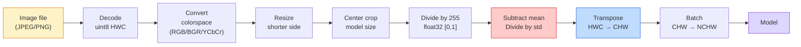
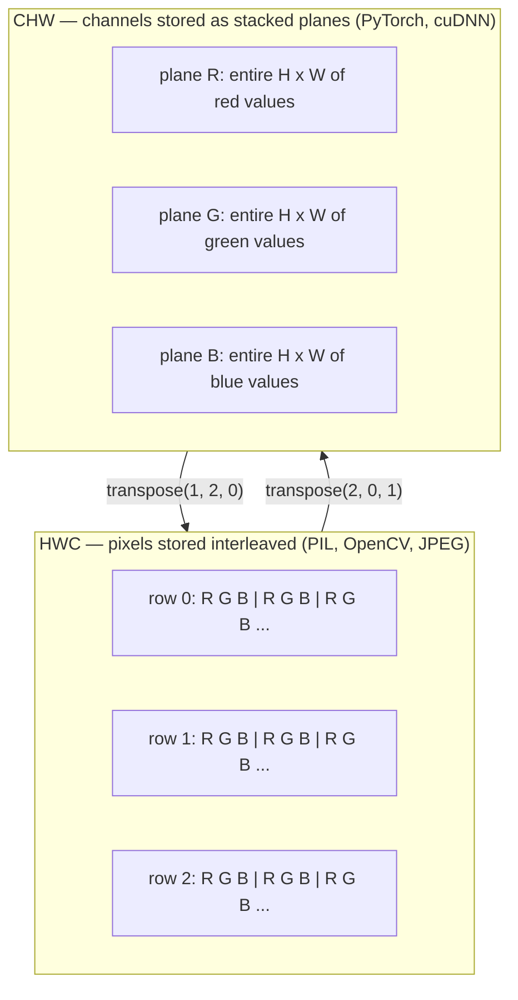

# 画像の基礎 — ピクセル、チャネル、色空間

> 画像とは、光のサンプルを並べたテンソルです。これから使うすべての vision model は、この事実から始まります。

**種類:** Build
**言語:** Python
**前提条件:** フェーズ 1 レッスン 12（Tensor Operations）、フェーズ 3 レッスン 11（Intro to PyTorch）
**所要時間:** 約 45 分

## 学習目標

- 連続的なシーンがどのようにピクセルへ離散化されるか、そしてサンプリングと量子化の判断が下流のすべてのモデルの上限を決める理由を説明する
- NumPy 配列として画像を読み込み、スライスし、調査し、HWC と CHW のレイアウトを自在に切り替える
- RGB、grayscale、HSV、YCbCr を相互変換し、それぞれの色空間が存在する理由を説明する
- torchvision が期待する形に合わせて、ピクセル単位の前処理（normalize、standardize、resize、channel-first）を正確に適用する

## 問題

これから読むすべての論文、ダウンロードするすべての pretrained weight、呼び出すすべての vision API は、入力が特定の形式で符号化されていることを前提にしています。モデルが `float32` を求めているところに `uint8` 画像を渡しても、処理自体は走ります。そして何も言わずに意味のない結果を出します。RGB で学習されたネットワークに BGR を入れると、精度は 10 ポイント単位で崩れます。channels-first を期待するモデルに channels-last の入力を渡すと、最初の conv layer は高さを feature channel として扱います。これらはエラーを投げません。ただ metric を壊し、ファイルの読み込み方に潜むバグを 1 週間探すことになります。

convolution は、何の上をスライドしているのかが分かれば複雑ではありません。難しいのは、「画像」が camera、JPEG decoder、PIL、OpenCV、torchvision、CUDA kernel によって違う意味を持つことです。それぞれの stack には独自の axis order、byte range、channel convention があります。これらを整理できない vision engineer は、壊れた pipeline を出荷してしまいます。

このレッスンでは、フェーズの残りが積み上がる土台を直します。最後まで進めば、pixel とは何か、なぜ pixel ごとに 1 つではなく 3 つの数値があるのか、「ImageNet stats で normalize する」とは実際に何をしているのか、そしてこのフェーズの他のレッスンが前提にする 2 つか 3 つの layout をどう行き来するのかが分かります。

## 概念

### 前処理 pipeline の全体像

本番の vision system は、どれも可逆変換の同じ並びです。1 ステップでも間違えると、モデルは学習時とは違う入力を見ることになります。



赤と青の 2 つの box は、静かな失敗の 80% が潜む場所です。standardization の抜けと、layout の間違いです。

### pixel は四角ではなく sample

camera sensor は、小さな detector の grid に落ちた photon を数えます。各 detector は一瞬だけ光を積分し、当たった photon 数に比例した電圧を出します。sensor はその電圧を整数に離散化します。1 つの detector が 1 つの pixel になります。

```
Continuous scene                 Sensor grid                     Digital image
(infinite detail)                (H x W detectors)               (H x W integers)

    ~~~~~                        +--+--+--+--+--+                 210 198 180 155 120
   ~   ~   ~                     |  |  |  |  |  |                 205 195 178 152 118
  ~ light ~      ---->           +--+--+--+--+--+     ---->       200 190 175 150 115
   ~~~~~                         |  |  |  |  |  |                 195 185 170 148 112
                                 +--+--+--+--+--+                 188 180 165 145 108
```

この段階で 2 つの選択が行われ、それが下流すべての上限を決めます。

- **Spatial sampling** は、scene の 1 度あたりに detector をいくつ置くかを決めます。少なすぎると edge がギザギザになります（aliasing）。多すぎると storage と compute が膨れ上がります。
- **Intensity quantization** は、電圧をどれだけ細かい bucket に分けるかを決めます。8 bit は 256 level で、表示用途の標準です。10、12、16 bit はより滑らかな gradient を与え、medical imaging、HDR、raw sensor pipeline で重要になります。

pixel は面積を持つ色付きの四角ではありません。単一の測定値です。resize や rotate をするとき、あなたはその測定 grid を resampling しています。

### なぜ 3 channels なのか

1 つの detector は可視スペクトル全体の photon を数えます。これが grayscale です。color を得るために、sensor は赤、緑、青の filter の mosaic で grid を覆います。demosaicing の後、すべての空間位置は 3 つの整数を持ちます。近傍にある赤 filter、緑 filter、青 filter の detector response です。この 3 つの整数が、pixel の RGB triplet です。

```
One pixel in memory:

    (R, G, B) = (210, 140, 30)   <- reddish-orange

An H x W RGB image:

    shape (H, W, 3)     stored as   H rows of W pixels of 3 values
                                    each in [0, 255] for uint8
```

3 は魔法の数ではありません。depth camera は Z channel を追加します。satellite は infrared や ultraviolet の band を追加します。medical scan は 1 channel（X-ray、CT）であることも、多数の channel（hyperspectral）を持つこともあります。channel 数は最後の axis で、conv layer はそれらを混ぜ合わせることを学習します。

### 2 つの layout convention: HWC と CHW

同じ tensor でも、並べ方は 2 通りあります。library ごとにどちらかを選びます。

```
HWC (height, width, channels)           CHW (channels, height, width)

   W ->                                    H ->
  +-----+-----+-----+                     +-----+-----+
H |R G B|R G B|R G B|                   C |R R R R R R|
| +-----+-----+-----+                   | +-----+-----+
v |R G B|R G B|R G B|                   v |G G G G G G|
  +-----+-----+-----+                     +-----+-----+
                                          |B B B B B B|
                                          +-----+-----+

   PIL, OpenCV, matplotlib,              PyTorch, most deep learning
   almost every image file on disk       frameworks, cuDNN kernels
```

CHW が存在するのは、convolution kernel が H と W の上をスライドするからです。channel axis を先頭に置くと、各 kernel は channel ごとに連続した 2D plane を見られ、きれいに vectorize できます。disk format が HWC を保つのは、sensor から scanline が出てくる並びと一致するからです。

これから何度も打つ 1 行の変換です。

```
img_chw = img_hwc.transpose(2, 0, 1)      # NumPy
img_chw = img_hwc.permute(2, 0, 1)        # PyTorch tensor
```

memory layout を図にするとこうなります。



### byte range と dtype

主に 3 つの convention があります。

| Convention | dtype | Range | Where you see it |
|------------|-------|-------|------------------|
| Raw | `uint8` | [0, 255] | disk 上の file、PIL、OpenCV output |
| Normalized | `float32` | [0.0, 1.0] | `img.astype('float32') / 255` の後 |
| Standardized | `float32` | おおよそ [-2, +2] | mean を引き、std で割った後 |

convolutional network は standardized input で学習されています。ImageNet stats の `mean=[0.485, 0.456, 0.406]`、`std=[0.229, 0.224, 0.225]` は、[0, 1] に normalized された pixel 上で、ImageNet training set 全体の 3 channel の算術平均と標準偏差を計算したものです。standardized float を期待するモデルに raw `uint8` を入れることは、応用 vision で最も多い静かな失敗です。

### 色空間と存在理由

RGB は capture format ですが、model にとって常に最も便利な表現とは限りません。

```
 RGB               HSV                       YCbCr / YUV

 R red             H hue (angle 0-360)       Y luminance (brightness)
 G green           S saturation (0-1)        Cb chroma blue-yellow
 B blue            V value/brightness (0-1)  Cr chroma red-green

 Linear to         Separates color from      Separates brightness from
 sensor output     brightness. Useful for    color. JPEG and most video
                   color thresholding, UI    codecs compress the chroma
                   sliders, simple filters   channels harder because the
                                             human eye is less sensitive
                                             to chroma detail than to Y.
```

ほとんどの modern CNN には RGB を入力します。他の色空間に出会うのは、次のような場面です。

- **HSV** — classical CV code、color-based segmentation、white-balancing。
- **YCbCr** — JPEG internal を読むとき、video pipeline、Y のみで動く super-resolution model。
- **Grayscale** — OCR、document model、color が signal ではなく nuisance variable になるあらゆるケース。

RGB からの grayscale は平均ではなく weighted sum です。人間の目は赤や青より緑に敏感だからです。

```
Y = 0.299 R + 0.587 G + 0.114 B       (ITU-R BT.601, the classic weights)
```

### aspect ratio、resize、interpolation

すべての model には固定の input size があります（多くの ImageNet classifier では 224x224、modern detector では 384x384 や 512x512）。手元の画像がそれに一致することはほとんどありません。重要な resize の選択肢は 3 つです。

- **shorter side を resize してから center crop** — 標準的な ImageNet recipe です。aspect ratio を保ち、edge pixel の帯を捨てます。
- **resize and pad** — aspect ratio とすべての pixel を保ち、black bar を追加します。detection と OCR の標準です。
- **target に直接 resize** — 画像を引き伸ばします。安価ですが geometry を歪めます。多くの classification task では十分です。

interpolation method は、新しい grid が古い grid と揃わないときに中間 pixel をどう計算するかを決めます。

```
Nearest neighbour     fastest, blocky, only choice for masks/labels
Bilinear              fast, smooth, default for most image resizing
Bicubic               slower, sharper on upscaling
Lanczos               slowest, best quality, used for final display
```

目安は、training には bilinear、目で見る asset には bicubic または lanczos、integer class ID を含むものには nearest です。

## 自分で作る

### ステップ 1: 画像を読み込み、shape を調べる

Pillow で任意の JPEG または PNG を読み込み、NumPy に変換して、得られたものを出力します。offline で決定的に動く例として、ここでは 1 枚合成します。

```python
import numpy as np
from PIL import Image

def synthetic_rgb(h=128, w=192, seed=0):
    rng = np.random.default_rng(seed)
    yy, xx = np.meshgrid(np.linspace(0, 1, h), np.linspace(0, 1, w), indexing="ij")
    r = (np.sin(xx * 6) * 0.5 + 0.5) * 255
    g = yy * 255
    b = (1 - yy) * xx * 255
    rgb = np.stack([r, g, b], axis=-1) + rng.normal(0, 6, (h, w, 3))
    return np.clip(rgb, 0, 255).astype(np.uint8)

arr = synthetic_rgb()
# Or load from disk:
# arr = np.asarray(Image.open("your_image.jpg").convert("RGB"))

print(f"type:   {type(arr).__name__}")
print(f"dtype:  {arr.dtype}")
print(f"shape:  {arr.shape}     # (H, W, C)")
print(f"min:    {arr.min()}")
print(f"max:    {arr.max()}")
print(f"pixel at (0, 0): {arr[0, 0]}")
```

期待される出力は `shape: (H, W, 3)`、`dtype: uint8`、range `[0, 255]` です。byte が camera、JPEG decoder、synthetic generator のどこから来たとしても、これが disk 上の標準表現です。

### ステップ 2: channel を分割し、layout を並べ替える

R、G、B を別々に取り出し、PyTorch 用に HWC から CHW へ変換します。

```python
R = arr[:, :, 0]
G = arr[:, :, 1]
B = arr[:, :, 2]
print(f"R shape: {R.shape}, mean: {R.mean():.1f}")
print(f"G shape: {G.shape}, mean: {G.mean():.1f}")
print(f"B shape: {B.shape}, mean: {B.mean():.1f}")

arr_chw = arr.transpose(2, 0, 1)
print(f"\nHWC shape: {arr.shape}")
print(f"CHW shape: {arr_chw.shape}")
```

channel ごとに 1 枚、合計 3 枚の grayscale plane です。CHW は axis を並べ替えるだけです。memory layout が許せば、厳密には data copy は不要です。

### ステップ 3: grayscale と HSV への変換

weighted-sum grayscale を作り、その後で RGB-to-HSV を手書きします。

```python
def rgb_to_grayscale(rgb):
    weights = np.array([0.299, 0.587, 0.114], dtype=np.float32)
    return (rgb.astype(np.float32) @ weights).astype(np.uint8)

def rgb_to_hsv(rgb):
    rgb_f = rgb.astype(np.float32) / 255.0
    r, g, b = rgb_f[..., 0], rgb_f[..., 1], rgb_f[..., 2]
    cmax = np.max(rgb_f, axis=-1)
    cmin = np.min(rgb_f, axis=-1)
    delta = cmax - cmin

    h = np.zeros_like(cmax)
    mask = delta > 0
    rmax = mask & (cmax == r)
    gmax = mask & (cmax == g)
    bmax = mask & (cmax == b)
    h[rmax] = ((g[rmax] - b[rmax]) / delta[rmax]) % 6
    h[gmax] = ((b[gmax] - r[gmax]) / delta[gmax]) + 2
    h[bmax] = ((r[bmax] - g[bmax]) / delta[bmax]) + 4
    h = h * 60.0

    s = np.where(cmax > 0, delta / cmax, 0)
    v = cmax
    return np.stack([h, s, v], axis=-1)

gray = rgb_to_grayscale(arr)
hsv = rgb_to_hsv(arr)
print(f"gray shape: {gray.shape}, range: [{gray.min()}, {gray.max()}]")
print(f"hsv   shape: {hsv.shape}")
print(f"hue range: [{hsv[..., 0].min():.1f}, {hsv[..., 0].max():.1f}] degrees")
print(f"sat range: [{hsv[..., 1].min():.2f}, {hsv[..., 1].max():.2f}]")
print(f"val range: [{hsv[..., 2].min():.2f}, {hsv[..., 2].max():.2f}]")
```

Hue は degree で、saturation と value は [0, 1] で出力されます。これは OpenCV の `hsv_full` convention と一致します。

### ステップ 4: normalize、standardize、そして元に戻す

raw byte から pretrained ImageNet model が期待する正確な tensor に変換し、その後で戻します。

```python
mean = np.array([0.485, 0.456, 0.406], dtype=np.float32)
std = np.array([0.229, 0.224, 0.225], dtype=np.float32)

def preprocess_imagenet(rgb_uint8):
    x = rgb_uint8.astype(np.float32) / 255.0
    x = (x - mean) / std
    x = x.transpose(2, 0, 1)
    return x

def deprocess_imagenet(chw_float32):
    x = chw_float32.transpose(1, 2, 0)
    x = x * std + mean
    x = np.clip(x * 255.0, 0, 255).astype(np.uint8)
    return x

x = preprocess_imagenet(arr)
print(f"preprocessed shape: {x.shape}     # (C, H, W)")
print(f"preprocessed dtype: {x.dtype}")
print(f"preprocessed mean per channel:  {x.mean(axis=(1, 2)).round(3)}")
print(f"preprocessed std  per channel:  {x.std(axis=(1, 2)).round(3)}")

roundtrip = deprocess_imagenet(x)
max_diff = np.abs(roundtrip.astype(int) - arr.astype(int)).max()
print(f"roundtrip max pixel diff: {max_diff}    # should be 0 or 1")
```

channel ごとの mean は 0 に近く、std は 1 に近いはずです。`preprocess` / `deprocess` の組は、すべての torchvision `transforms.Normalize` call が裏側で行っていることと同じです。

### ステップ 5: 3 つの interpolation method で resize する

違いが見えるように、upscale で nearest、bilinear、bicubic を比較します。

```python
target = (arr.shape[0] * 3, arr.shape[1] * 3)

nearest = np.asarray(Image.fromarray(arr).resize(target[::-1], Image.NEAREST))
bilinear = np.asarray(Image.fromarray(arr).resize(target[::-1], Image.BILINEAR))
bicubic = np.asarray(Image.fromarray(arr).resize(target[::-1], Image.BICUBIC))

def local_roughness(x):
    gy = np.diff(x.astype(float), axis=0)
    gx = np.diff(x.astype(float), axis=1)
    return float(np.abs(gy).mean() + np.abs(gx).mean())

for name, out in [("nearest", nearest), ("bilinear", bilinear), ("bicubic", bicubic)]:
    print(f"{name:>8}  shape={out.shape}  roughness={local_roughness(out):6.2f}")
```

nearest は硬い edge を保つため、roughness が最も高くなります。bilinear は最も滑らかです。bicubic はその中間で、階段状の artifact を抑えながら見た目の sharpness を保ちます。

## 使う

`torchvision.transforms` は、上の処理を 1 つの合成可能な pipeline にまとめています。以下の code は、resize と crop に加えて、`preprocess_imagenet` とまったく同じことを再現します。

```python
import torch
from torchvision import transforms
from PIL import Image

img = Image.fromarray(synthetic_rgb(256, 256))

pipeline = transforms.Compose([
    transforms.Resize(256),
    transforms.CenterCrop(224),
    transforms.ToTensor(),
    transforms.Normalize(mean=[0.485, 0.456, 0.406], std=[0.229, 0.224, 0.225]),
])

x = pipeline(img)
print(f"tensor type:  {type(x).__name__}")
print(f"tensor dtype: {x.dtype}")
print(f"tensor shape: {tuple(x.shape)}      # (C, H, W)")
print(f"per-channel mean: {x.mean(dim=(1, 2)).tolist()}")
print(f"per-channel std:  {x.std(dim=(1, 2)).tolist()}")

batch = x.unsqueeze(0)
print(f"\nbatched shape: {tuple(batch.shape)}   # (N, C, H, W) — ready for a model")
```

この順序で 4 steps です。`Resize(256)` は shorter side を 256 に scale します。`CenterCrop(224)` は中央から 224x224 patch を取り出します。`ToTensor()` は 255 で割り、HWC を CHW に入れ替えます。`Normalize` は ImageNet mean を引き、std で割ります。この順序を逆にすると、モデルへ届くものが静かに変わります。

## 出荷物

このレッスンは次を生成します。

- `outputs/prompt-vision-preprocessing-audit.md` — 任意の model card または dataset card を、team が守るべき正確な preprocessing invariant の checklist に変換する prompt。
- `outputs/skill-image-tensor-inspector.md` — 任意の image-shaped tensor または array を受け取り、dtype、layout、range、raw / normalized / standardized のどれに見えるかを報告する skill。

## 演習

1. **(Easy)** OpenCV（`cv2.imread`）と Pillow で JPEG を読み込みます。両方の shape と `(0, 0)` の pixel を出力します。channel order の違いを説明し、OpenCV array を Pillow のものと同一にする 1 行の変換を書いてください。
2. **(Medium)** `standardize(img, mean, std)` とその inverse を書き、任意の uint8 image で `roundtrip_max_diff <= 1` test を通してください。関数は同じ call で、HWC の単一 image と NCHW の batch の両方に対応する必要があります。
3. **(Hard)** 3-channel の ImageNet-standardized tensor を、RGB を 1 つの grayscale channel に weighted mixture する 1x1 conv に通します。weight を `[0.299, 0.587, 0.114]` で初期化して freeze し、出力が手書きの `rgb_to_grayscale` と floating-point error の範囲内で一致することを検証してください。他にどの classical color-space transform を 1x1 convolution として書けるでしょうか。

## 重要用語

| Term | What people say | What it actually means |
|------|----------------|----------------------|
| Pixel | 「色付きの四角」 | 1 つの grid location における光の強度の 1 sample。color なら 3 つの数値、grayscale なら 1 つの数値 |
| Channel | 「色」 | image tensor に stack された parallel spatial grid の 1 つ。HWC では最後の axis、CHW では最初の axis |
| HWC / CHW | 「shape」 | image tensor の axis ordering。disk と PIL は HWC、PyTorch と cuDNN は CHW を使う |
| Normalize | 「画像を scale する」 | pixel が [0, 1] に収まるように 255 で割ること。必要だが、それだけでは十分ではない |
| Standardize | 「zero-center する」 | input distribution が model の学習時と一致するように、channel ごとに mean を引き std で割ること |
| Grayscale conversion | 「channel を平均する」 | 人間の luminance perception に合う係数 0.299/0.587/0.114 による weighted sum |
| Interpolation | 「resize が pixel を選ぶ方法」 | 新しい grid が古い grid と揃わないときに output value を決める規則。label には nearest、training には bilinear、display には bicubic |
| Aspect ratio | 「width over height」 | 「resize and pad」と「resize and stretch」を分ける比率 |

## 参考資料

- [Charles Poynton — A Guided Tour of Color Space](https://poynton.ca/PDFs/Guided_tour.pdf) — 色空間がこれほど多い理由と、それぞれが重要になる場面を最も明快に扱った技術解説
- [PyTorch Vision Transforms Docs](https://pytorch.org/vision/stable/transforms.html) — 本番で実際に組み合わせる transforms の full pipeline
- [How JPEG Works (Colt McAnlis)](https://www.youtube.com/watch?v=F1kYBnY6mwg) — chroma subsampling、DCT、そして JPEG が RGB ではなく YCbCr を encode する理由を視覚的に理解できる解説
- [ImageNet Preprocessing Conventions (torchvision models)](https://pytorch.org/vision/stable/models.html) — `mean=[0.485, 0.456, 0.406]` の正典であり、model zoo のすべての model がそれを期待する理由
