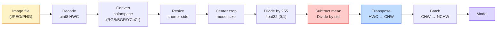
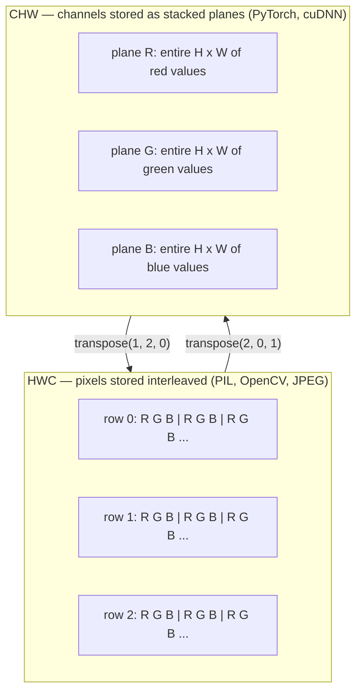

# Görüntünün Temelleri — Pikseller, Kanallar, Renk Uzayları

> Bir görüntü, ışık örneklerinin tensörüdür. Kullanacağınız her görüş modeli bu tek gerçekle başlar.

**Tür:** Yapım
**Diller:** Python
**Önkoşullar:** Aşama 1 Ders 12 (Tensör İşlemleri), Aşama 3 Ders 11 (PyTorch'a Giriş)
**Süre:** ~45 dakika

## Öğrenme Hedefleri

- Sürekli bir sahnenin nasıl piksellere bölündüğünü ve örnekleme/kuantizasyon kararlarının neden her alt modelde tavanı belirlediğini açıklayın
- Görüntüleri NumPy dizileri olarak okuyun, dilimleyin ve inceleyin ve HWC ile CHW düzenleri arasında akıcı bir şekilde geçiş yapın
- RGB, gri tonlama, HSV ve YCbCr arasında dönüştürme yapın ve her renk alanının neden var olduğunu gerekçelendirin
- Tam olarak torchvision'un beklediği gibi piksel düzeyinde ön işleme uygulayın (normalleştirme, standartlaştırma, yeniden boyutlandırma, öncelikli kanal)

## Sorun

Okuyacağınız her makale, indireceğiniz önceden eğitilmiş her ağırlık, çağıracağınız her görme API'si, girişin belirli bir kodlamasını varsayar. Modelin `float32` istediği ve çalışmaya devam edeceği bir `uint8` görüntüsünü iletin ve sessizce çöp üretin. BGR'yi RGB konusunda eğitilmiş bir ağa beslediğinizde doğruluk on puan düşer. İlk önce kanalları beklediğinde, bir model kanalları-son girişi verin ve ilk dönüşüm katmanı, yüksekliği bir özellik kanalı olarak ele alır. Bunların hiçbiri hata vermiyor. Bu sadece ölçümlerinizi mahveder ve dosyayı yükleme şeklinizde yaşayan bir hatayı aramak için bir hafta harcarsınız.

Neyin üzerinden kaydığını bildiğinizde bir evrişim karmaşık değildir. İşin zor kısmı, "görüntü"nün bir kamera, JPEG kod çözücü, PIL, OpenCV, torchvision ve CUDA çekirdeği için farklı anlamlara gelmesidir. Her yığının kendi eksen sırası, bayt aralığı ve kanal kuralı vardır. Bu dümdüz gemilerin kırık boru hatlarını tutamayan bir vizyon mühendisi.

Bu ders, aşamanın geri kalanının onun üzerine inşa edilebilmesi için temeli sabitler. Sonunda pikselin ne olduğunu, piksel başına neden bir yerine üç sayı olduğunu, "ImageNet istatistikleriyle normalleştirme"nin gerçekte ne yaptığını ve bu aşamadaki diğer derslerin üstleneceği iki veya üç düzen arasında nasıl geçiş yapacağınızı öğreneceksiniz.

## Konsept

### Bir bakışta tüm ön işleme hattı

Her üretim görüş sistemi, aynı tersinir dönüşüm dizisidir. Bir adım yanlış yaparsanız model, üzerinde eğitim verildiğinden farklı bir girdi görür.



İki kırmızı ve mavi kutu, sessiz arızaların %80'inin yaşandığı yerdir: eksik standardizasyon ve yanlış düzen.

### Piksel bir kare değil örnektir

Bir kamera sensörü, küçük dedektörlerden oluşan bir ızgaraya düşen fotonları sayar. Her dedektör, ışığı saniyenin çok küçük bir kısmı boyunca entegre eder ve kendisine çarpan foton sayısıyla orantılı bir voltaj yayar. Sensör daha sonra bu voltajı bir tamsayıya ayırır. Bir dedektör bir piksel haline gelir.

```
Continuous scene                 Sensor grid                     Digital image
(infinite detail)                (H x W detectors)               (H x W integers)

    ~~~~~                        +--+--+--+--+--+                 210 198 180 155 120
   ~   ~   ~                     |  |  |  |  |  |                 205 195 178 152 118
  ~ light ~      ---->           +--+--+--+--+--+     ---->       200 190 175 150 115
   ~~~~~                         |  |  |  |  |  |                 195 185 170 148 112
                                 +--+--+--+--+--+                 188 180 165 145 108
```

Bu adımda iki seçenek olur ve bunlar aşağı yöndeki her şeyin tavanını sabitler:

- **Uzaysal örnekleme**, sahnenin derecesi başına kaç dedektör olacağına karar verir. Çok az olursa kenarlar pürüzlü hale gelir (örtüşme). Çok fazla olursa depolama ve bilgi işlem patlar.
- **Yoğunluk nicelemesi** voltajın ne kadar hassas bir şekilde gruplandırılacağına karar verir. 8 bit 256 seviye verir ve görüntüleme için standarttır. 10, 12, 16 bitler daha yumuşak gradient'ler sağlar ve tıbbi görüntüleme, HDR ve ham sensör hatları için önemlidir.

Bir piksel, alanı olan renkli bir kare değildir. Tek bir ölçümdür. Yeniden boyutlandırdığınızda veya döndürdüğünüzde, o ölçüm ızgarasını yeniden örneklemiş olursunuz.

### Neden üç kanal

Bir dedektör, tüm görünür spektrumdaki (gri tonlamalı) fotonları sayar. Renk elde etmek için sensör ızgarayı kırmızı, yeşil ve mavi filtrelerden oluşan bir mozaikle kaplıyor. Buz çözme işleminden sonra, her uzamsal konum üç tamsayıya sahiptir: kırmızı filtreli dedektörün yanıtı, yeşil filtreli ve yakındaki mavi filtreli dedektörün yanıtı. Bu üç tamsayı bir pikselin RGB üçlüsüdür.

```
One pixel in memory:

    (R, G, B) = (210, 140, 30)   <- reddish-orange

An H x W RGB image:

    shape (H, W, 3)     stored as   H rows of W pixels of 3 values
                                    each in [0, 255] for uint8
```

Üç sihir değil. Derinlik kameraları bir Z kanalı ekler. Uydular kızılötesi ve morötesi bantlar ekler. Tıbbi taramalar genellikle bir kanala (X-ışını, CT) veya birden fazla kanala (hiperspektral) sahiptir. Kanal sayısı son eksendir; conv katmanları onun üzerinde karıştırmayı öğrenir.

### İki düzen kuralı: HWC ve CHW

Aynı tensör, iki sıralama. Her kütüphane bir tane seçer.

```
HWC (height, width, channels)           CHW (channels, height, width)

   W ->                                    H ->
  +-----+-----+-----+                     +-----+-----+
H |R G B|R G B|R G B|                   C |R R R R R R|
| +-----+-----+-----+                   | +-----+-----+
v |R G B|R G B|R G B|                   v |G G G G G G|
  +-----+-----+-----+                     +-----+-----+
                                          |B B B B B B|
                                          +-----+-----+

   PIL, OpenCV, matplotlib,              PyTorch, most deep learning
   almost every image file on disk       frameworks, cuDNN kernels
```

CHW, evrişim çekirdeklerinin H ve W boyunca kayması nedeniyle mevcuttur. Kanal eksenini ilk önce tutmak, her çekirdeğin kanal başına bitişik bir 2 boyutlu düzlem görmesi anlamına gelir ve bu, temiz bir şekilde vektörleşir. Disk formatları HWC'yi korur çünkü bu, tarama çizgilerinin sensörden çıkma şekliyle eşleşir.

Bin kere yazacağınız tek satırlık dönüşüm:

```
img_chw = img_hwc.transpose(2, 0, 1)      # NumPy
img_chw = img_hwc.permute(2, 0, 1)        # PyTorch tensor
```

Bellek düzeni, görselleştirildi:



### Bayt aralıkları ve türü

Üç sözleşme hakimdir:

| Kongre | dtype | Menzil | Nerede görüyorsunuz |
|------------|-------|-------|------------------|
| Ham | `uint8` | [0, 255] | Diskteki dosyalar, PIL, OpenCV çıktısı |
| Normalleştirilmiş | `float32` | [0,0, 1,0] | `img.astype('float32') / 255`'den sonra |
| Standartlaştırılmış | `float32` | kabaca [-2, +2] | Ortalamayı çıkardıktan ve std'ye böldükten sonra |

Evrişimli ağlar standartlaştırılmış girdiler üzerinde eğitildi. ImageNet istatistikleri `mean=[0.485, 0.456, 0.406]`, `std=[0.229, 0.224, 0.225]`, tam ImageNet eğitim seti üzerinden üç kanalın [0, 1] normalleştirilmiş piksel üzerinden hesaplanan aritmetik ortalaması ve standart sapmasıdır. Ham `uint8`'yi standartlaştırılmış kayan nokta bekleyen bir modele beslemek, uygulamalı görmede en yaygın görülen sessiz hatadır.

### Renk uzayları ve neden var oldukları

RGB yakalama formatıdır ancak bir model için her zaman en kullanışlı gösterim değildir.

```
 RGB               HSV                       YCbCr / YUV

 R red             H hue (angle 0-360)       Y luminance (brightness)
 G green           S saturation (0-1)        Cb chroma blue-yellow
 B blue            V value/brightness (0-1)  Cr chroma red-green

 Linear to         Separates color from      Separates brightness from
 sensor output     brightness. Useful for    color. JPEG and most video
                   color thresholding, UI    codecs compress the chroma
                   sliders, simple filters   channels harder because the
                                             human eye is less sensitive
                                             to chroma detail than to Y.
```

Çoğu modern CNN için RGB'yi beslersiniz. Aşağıdaki durumlarda diğer alanlarla tanışırsınız:

- **HSV** — klasik CV kodu, renk tabanlı segmentasyon, beyaz dengeleme.
- **YCbCr** — yalnızca Y'de çalışan JPEG dahili dosyalarını, video ardışık düzenlerini ve süper çözünürlüklü modelleri okur.
- **Gri Tonlama** — OCR, belge modelleri, rengin sinyal yerine rahatsız edici değişken olduğu her durum.

RGB'den gelen gri tonlama, ortalama değil ağırlıklı bir toplamdır çünkü insan gözü yeşile kırmızı veya maviden daha duyarlıdır:

```
Y = 0.299 R + 0.587 G + 0.114 B       (ITU-R BT.601, the classic weights)
```

### En boy oranı, yeniden boyutlandırma ve enterpolasyon

Her modelin sabit bir giriş boyutu vardır (çoğu ImageNet sınıflandırıcı için 224x224, modern dedektörler için 384x384 veya 512x512). Resimleriniz nadiren eşleşir. Önemli olan üç yeniden boyutlandırma seçeneği:

- **Kısa kenarı yeniden boyutlandırın, ardından kırpmanın ortasını yapın** — standart ImageNet tarifi. En boy oranını korur, kenar piksel şeridini atar.
- **Yeniden boyutlandır ve doldur** — en boy oranını ve her pikseli korur, siyah çubuklar ekler. Algılama ve OCR standardı.
- **Doğrudan hedefe göre yeniden boyutlandır** — görüntüyü uzatır. Ucuzdur, geometriyi bozar, birçok sınıflandırma görevi için uygundur.

Enterpolasyon yöntemi, yeni ızgara eskisiyle hizalanmadığında ara piksellerin nasıl hesaplanacağına karar verir:

```
Nearest neighbour     fastest, blocky, only choice for masks/labels
Bilinear              fast, smooth, default for most image resizing
Bicubic               slower, sharper on upscaling
Lanczos               slowest, best quality, used for final display
```

Temel kural: eğitim için çift doğrusal, bakacağınız varlıklar için bikübik veya lanczolar, tam sayı sınıf kimlikleri içeren her şeye en yakın olan.

```figure
conv-output-size
```

## İnşa Et

### Adım 1: Bir görsel yükleyin ve şeklini inceleyin

Herhangi bir JPEG veya PNG'yi yüklemek, NumPy'ye dönüştürmek ve elinizde olanı yazdırmak için Pillow'u kullanın. Çevrimdışı çalışan deterministik bir örnek için bir tane sentezleyin.

```python
import numpy as np
from PIL import Image

def synthetic_rgb(h=128, w=192, seed=0):
    rng = np.random.default_rng(seed)
    yy, xx = np.meshgrid(np.linspace(0, 1, h), np.linspace(0, 1, w), indexing="ij")
    r = (np.sin(xx * 6) * 0.5 + 0.5) * 255
    g = yy * 255
    b = (1 - yy) * xx * 255
    rgb = np.stack([r, g, b], axis=-1) + rng.normal(0, 6, (h, w, 3))
    return np.clip(rgb, 0, 255).astype(np.uint8)

arr = synthetic_rgb()
# Or load from disk:
# arr = np.asarray(Image.open("your_image.jpg").convert("RGB"))

print(f"type:   {type(arr).__name__}")
print(f"dtype:  {arr.dtype}")
print(f"shape:  {arr.shape}     # (H, W, C)")
print(f"min:    {arr.min()}")
print(f"max:    {arr.max()}")
print(f"pixel at (0, 0): {arr[0, 0]}")
```

Beklenen çıktı: `shape: (H, W, 3)`, `dtype: uint8`, aralık `[0, 255]`. Bu, baytların bir kameradan mı, bir JPEG kod çözücüden mi yoksa sentetik bir oluşturucudan mı geldiğine dair kurallı disk üzerindeki temsildir.

### 2. Adım: Kanalları ayırın ve düzeni yeniden düzenleyin

R, G, B'yi ayrı ayrı çekin, ardından PyTorch için HWC'den CHW'ye dönüştürün.

```python
R = arr[:, :, 0]
G = arr[:, :, 1]
B = arr[:, :, 2]
print(f"R shape: {R.shape}, mean: {R.mean():.1f}")
print(f"G shape: {G.shape}, mean: {G.mean():.1f}")
print(f"B shape: {B.shape}, mean: {B.mean():.1f}")

arr_chw = arr.transpose(2, 0, 1)
print(f"\nHWC shape: {arr.shape}")
print(f"CHW shape: {arr_chw.shape}")
```

Kanal başına bir tane olmak üzere üç gri tonlamalı düzlem. CHW yalnızca eksenleri yeniden sıralıyor; Bellek düzeni izin verdiğinde hiçbir veri kopyasına kesinlikle gerek yoktur.

### 3. Adım: Gri tonlama ve HSV dönüşümleri

Ağırlıklı toplam gri tonlama, ardından manuel RGB'den HSV'ye geçiş.

```python
def rgb_to_grayscale(rgb):
    weights = np.array([0.299, 0.587, 0.114], dtype=np.float32)
    return (rgb.astype(np.float32) @ weights).astype(np.uint8)

def rgb_to_hsv(rgb):
    rgb_f = rgb.astype(np.float32) / 255.0
    r, g, b = rgb_f[..., 0], rgb_f[..., 1], rgb_f[..., 2]
    cmax = np.max(rgb_f, axis=-1)
    cmin = np.min(rgb_f, axis=-1)
    delta = cmax - cmin

    h = np.zeros_like(cmax)
    mask = delta > 0
    rmax = mask & (cmax == r)
    gmax = mask & (cmax == g)
    bmax = mask & (cmax == b)
    h[rmax] = ((g[rmax] - b[rmax]) / delta[rmax]) % 6
    h[gmax] = ((b[gmax] - r[gmax]) / delta[gmax]) + 2
    h[bmax] = ((r[bmax] - g[bmax]) / delta[bmax]) + 4
    h = h * 60.0

    s = np.where(cmax > 0, delta / cmax, 0)
    v = cmax
    return np.stack([h, s, v], axis=-1)

gray = rgb_to_grayscale(arr)
hsv = rgb_to_hsv(arr)
print(f"gray shape: {gray.shape}, range: [{gray.min()}, {gray.max()}]")
print(f"hsv   shape: {hsv.shape}")
print(f"hue range: [{hsv[..., 0].min():.1f}, {hsv[..., 0].max():.1f}] degrees")
print(f"sat range: [{hsv[..., 1].min():.2f}, {hsv[..., 1].max():.2f}]")
print(f"val range: [{hsv[..., 2].min():.2f}, {hsv[..., 2].max():.2f}]")
```

Renk tonu derece, doygunluk ve değer olarak [0, 1] olarak ortaya çıkar. Bu, OpenCV `hsv_full` kuralıyla eşleşir.

### Adım 4: Normalleştirin, standartlaştırın ve tersine çevirin

Ham baytlardan, önceden eğitilmiş bir ImageNet modelinin beklediği tam tensöre gidin ve ardından geri dönün.

```python
mean = np.array([0.485, 0.456, 0.406], dtype=np.float32)
std = np.array([0.229, 0.224, 0.225], dtype=np.float32)

def preprocess_imagenet(rgb_uint8):
    x = rgb_uint8.astype(np.float32) / 255.0
    x = (x - mean) / std
    x = x.transpose(2, 0, 1)
    return x

def deprocess_imagenet(chw_float32):
    x = chw_float32.transpose(1, 2, 0)
    x = x * std + mean
    x = np.clip(x * 255.0, 0, 255).astype(np.uint8)
    return x

x = preprocess_imagenet(arr)
print(f"preprocessed shape: {x.shape}     # (C, H, W)")
print(f"preprocessed dtype: {x.dtype}")
print(f"preprocessed mean per channel:  {x.mean(axis=(1, 2)).round(3)}")
print(f"preprocessed std  per channel:  {x.std(axis=(1, 2)).round(3)}")

roundtrip = deprocess_imagenet(x)
max_diff = np.abs(roundtrip.astype(int) - arr.astype(int)).max()
print(f"roundtrip max pixel diff: {max_diff}    # should be 0 or 1")
```

Kanal başına ortalama sıfıra yakın, std bire yakın olmalıdır. Ön işleme/işlemden çıkarma çifti, her torchvision `transforms.Normalize` çağrısının tam olarak yaptığı şeydir.

### Adım 5: Üç enterpolasyon yöntemiyle yeniden boyutlandırın

Farkın görülebilmesi için en yakın, çift doğrusal ve çift kübik değerleri lüks bir ölçekte karşılaştırın.

```python
target = (arr.shape[0] * 3, arr.shape[1] * 3)

nearest = np.asarray(Image.fromarray(arr).resize(target[::-1], Image.NEAREST))
bilinear = np.asarray(Image.fromarray(arr).resize(target[::-1], Image.BILINEAR))
bicubic = np.asarray(Image.fromarray(arr).resize(target[::-1], Image.BICUBIC))

def local_roughness(x):
    gy = np.diff(x.astype(float), axis=0)
    gx = np.diff(x.astype(float), axis=1)
    return float(np.abs(gy).mean() + np.abs(gx).mean())

for name, out in [("nearest", nearest), ("bilinear", bilinear), ("bicubic", bicubic)]:
    print(f"{name:>8}  shape={out.shape}  roughness={local_roughness(out):6.2f}")
```

En yakın puanlar, sert kenarları koruduğu için pürüzlülükte en yüksek puanları alır. Bilinear en yumuşak olanıdır. Bicubic, merdiven basamağı artifact'ler olmadan algılanan keskinliği koruyarak arada durur.

## Kullan onu

`torchvision.transforms` yukarıdaki her şeyi tek bir şekillendirilebilir boru hattında birleştirir. Aşağıdaki kod, `preprocess_imagenet`'nin yaptığı şeyin aynısını, ayrıca yeniden boyutlandırma ve kırpma işlemlerini de yeniden üretir.

```python
import torch
from torchvision import transforms
from PIL import Image

img = Image.fromarray(synthetic_rgb(256, 256))

pipeline = transforms.Compose([
    transforms.Resize(256),
    transforms.CenterCrop(224),
    transforms.ToTensor(),
    transforms.Normalize(mean=[0.485, 0.456, 0.406], std=[0.229, 0.224, 0.225]),
])

x = pipeline(img)
print(f"tensor type:  {type(x).__name__}")
print(f"tensor dtype: {x.dtype}")
print(f"tensor shape: {tuple(x.shape)}      # (C, H, W)")
print(f"per-channel mean: {x.mean(dim=(1, 2)).tolist()}")
print(f"per-channel std:  {x.std(dim=(1, 2)).tolist()}")

batch = x.unsqueeze(0)
print(f"\nbatched shape: {tuple(batch.shape)}   # (N, C, H, W) — ready for a model")
```

Tam olarak bu sırayla dört adım: `Resize(256)` kısa kenarı 256'ya ölçeklendirir; `CenterCrop(224)` ortadan 224x224'lük bir yama alır; `ToTensor()` 255'e böler ve HWC'yi CHW'ye değiştirir; `Normalize`, ImageNet ortalamasını çıkarır ve std'ye böler. Bu sırayı tersine çevirmek, modele ulaşanları sessizce değiştirir.

## Gönderin

Bu ders şunları üretir:

- `outputs/prompt-vision-preprocessing-audit.md` — herhangi bir model kartı veya dataset kartını, bir ekibin uyması gereken ön işleme değişmezlerinin kesin bir kontrol listesine dönüştüren bir prompt.
- `outputs/skill-image-tensor-inspector.md` — herhangi bir görüntü şeklindeki tensör veya dizi verildiğinde, türü, düzeni, aralığı ve ham, normalleştirilmiş veya standartlaştırılmış görünüp görünmediğini bildiren bir beceri.

## Egzersizler

1. **(Kolay)** OpenCV (`cv2.imread`) ve Yastık ile bir JPEG yükleyin. Hem şekilleri hem de pikseli `(0, 0)`'de yazdırın. Kanal sırası farkını açıklayın, ardından OpenCV dizisini Pillow dizisiyle aynı yapan tek satırlık bir dönüşüm yazın.
2. **(Orta)** Herhangi bir uint8 görüntüsü üzerinde `roundtrip_max_diff <= 1` testini birlikte geçen `standardize(img, mean, std)` ve bunun tersini yazın. İşlevleriniz aynı çağrıyla HWC'de tek bir görüntü üzerinde, NCHW'de ise toplu olarak çalışmalıdır.
3. **(Sert)** 3 kanallı ImageNet standartlaştırılmış bir tensör alın ve onu, RGB'nin ağırlıklı karışımını tek bir gri tonlamalı kanala öğrenen 1x1 dönüşümden geçirin. Ağırlıkları `[0.299, 0.587, 0.114]` olarak başlatın, dondurun ve çıktının, kayan nokta hatası dahilinde manuel `rgb_to_grayscale` ile eşleştiğini doğrulayın. Başka hangi klasik renk uzayı dönüşümleri 1x1 evrişim olarak yazılabilir?

## Anahtar Terimler

| Dönem | İnsanlar ne diyor | Aslında ne anlama geliyor |
|------|----------------|----------------------|
| Piksel | "Renkli bir kare" | Tek bir ızgara konumundaki ışık yoğunluğu örneği — renkli için üç sayı, gri tonlamalı için bir sayı |
| Kanal | "Renk" | Bir görüntü tensörüne yığılmış paralel uzamsal ızgaralardan biri; HWC'de son eksen, CHW'de ilk |
| HWC / CHW | "Şekil" | Bir görüntü tensörü için eksen sıralamaları; disk ve PIL HWC'yi kullanır, PyTorch ve cuDNN CHW'yi kullanır |
| Normalleştir | "Resmi ölçeklendir" | Piksellerin [0, 1] içinde kalması için 255'e bölün — gerekli ama yeterli değil |
| Standartlaştırın | "Sıfır merkezli" | Ortalamayı çıkarın ve kanal başına std'ye bölün, böylece girdi dağılımı modelin eğitildiğiyle eşleşir |
| Gri tonlamalı dönüştürme | "Kanalların ortalamasını al" | İnsan parlaklık algısıyla eşleşen, 0,299/0,587/0,114 katsayılı ağırlıklı toplam |
| Enterpolasyon | "Yeniden boyutlandırma pikselleri nasıl seçer?" | Yeni ızgara eskisiyle hizalanmadığında çıktı değerlerine karar veren kural — etiketler için en yakın, eğitim için çift doğrusal, görüntüleme için çift kübik |
| En boy oranı | "Genişlik yüksekliğe göre" | "Yeniden boyutlandırma ve doldurma" işlemini "yeniden boyutlandırma ve genişletme" işleminden ayıran oran |

## Daha Fazla Okuma

- [Charles Poynton — Rehberli Renk Uzayı Turu](https://poynton.ca/PDFs/Guided_tour.pdf) — neden bu kadar çok renk uzayının bulunduğunu ve her birinin ne zaman önemli olduğunu açıklayan en net teknik inceleme
- [PyTorch Vision Transforms Dokümanları](https://pytorch.org/vision/stable/transforms.html) — üretimde oluşturacağınız dönüşümlerin tam listesi
- [JPEG Nasıl Çalışır (Colt McAnlis)](https://www.youtube.com/watch?v=F1kYBnY6mwg) — renk alt örneklemesi, DCT ve JPEG'in neden RGB yerine YCbCr'yi kodladığı konusunda keskin bir görsel tur
- [ImageNet Ön İşleme Kuralları (torchvision modelleri)](https://pytorch.org/vision/stable/models.html) — `mean=[0.485, 0.456, 0.406]` ile ilgili gerçeğin kaynağı ve hayvanat bahçesindeki her modelin neden bunu beklediği
