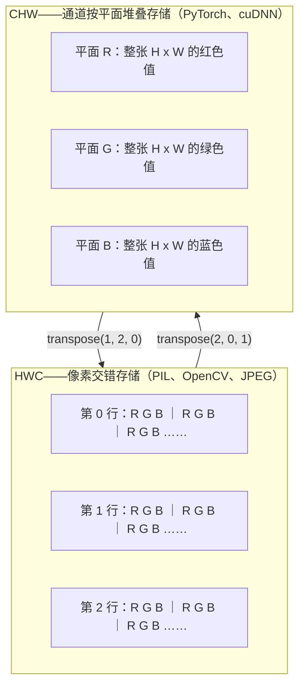

# 图像基础——像素、通道与色彩空间

> 译注：本文译自同目录 [`en.md`](./en.md)。术语遵循仓根 [TRANSLATION_GUIDE.md](../../../../TRANSLATION_GUIDE.md)。

> 一张图像就是一份光的采样张量（tensor）。你今后用到的每一个视觉模型，都从这个事实出发。

**Type:** Build
**Languages:** Python
**Prerequisites:** Phase 1 Lesson 12 (Tensor Operations), Phase 3 Lesson 11 (Intro to PyTorch)
**Time:** ~45 minutes

## 学习目标（Learning Objectives）

- 解释一个连续场景如何被离散化为像素，以及采样 / 量化决策为何会决定下游所有模型的天花板
- 把图像当作 NumPy 数组来读取、切片、检查，并能在 HWC 与 CHW 这两种布局之间自如切换
- 在 RGB、灰度、HSV、YCbCr 之间互转，并说出每种色彩空间存在的理由
- 按 torchvision 期望的方式做像素级预处理（normalize、standardize、resize、channels-first）

## 问题（The Problem）

你将读到的每一篇论文、下载的每一份预训练权重、调用的每一个视觉 API，都假设输入有一种特定的编码方式。把 `uint8` 图像喂给一个想要 `float32` 的模型，它照样能跑——然后默默地输出垃圾。把 BGR 喂给一个用 RGB 训练的网络，准确率直接掉十个点。把 channels-last 输入塞给一个期望 channels-first 的模型，第一个 conv layer 会把高度当成一个特征通道处理。这些情况都不会报错，只会毁掉你的指标，然后你会花一整周去找一个其实藏在文件加载方式里的 bug。

一旦你知道卷积在哪个东西上滑动，它本身并不复杂。难点在于「一张图像」对相机、JPEG 解码器、PIL、OpenCV、torchvision 和某个 CUDA kernel 来说，意思都不一样。每一层栈都有自己的轴顺序、字节范围和通道约定。一个分不清这些的视觉工程师，交付的就是坏掉的 pipeline。

这节课把地基打牢，让本阶段后面的内容都能在它上面继续建。学完之后你会知道：什么是一个像素、为什么每个像素是三个数而不是一个、「按 ImageNet 统计量做 normalize」到底在做什么，以及如何在本阶段每节课都会假设的那两三种布局之间来回切换。

## 概念（The Concept）

### 一眼看完整条预处理流水线

每一个生产级视觉系统都是同一串可逆变换。任何一步搞错，模型看到的就不是它训练时看到的输入。

```mermaid
flowchart LR
    A["图像文件<br/>JPEG／PNG"] --> B["解码<br/>uint8 HWC"]
    B --> C["转换色彩空间<br/>RGB／BGR／YCbCr"]
    C --> D["缩放<br/>按短边"]
    D --> E["中心裁剪<br/>模型尺寸"]
    E --> F["除以 255<br/>float32 区间 0 到 1"]
    F --> G["减均值<br/>除标准差"]
    G --> H["转置<br/>HWC → CHW"]
    H --> I["组 batch<br/>CHW → NCHW"]
    I --> J["模型"]

    style A fill:#fef3c7,stroke:#d97706
    style J fill:#ddd6fe,stroke:#7c3aed
    style G fill:#fecaca,stroke:#dc2626
    style H fill:#bfdbfe,stroke:#2563eb
```



那两个红色和蓝色的方块，就是 80% 的「无声故障」住的地方：缺了 standardization，或者布局错了。

### 一个像素是一次采样，不是一个方块

相机传感器在一张由极小探测器组成的网格上数光子。每个探测器对光积分若干分之一秒，输出一个与光子数成正比的电压。然后传感器把那个电压离散成一个整数。一个探测器变成一个像素。

```
Continuous scene                 Sensor grid                     Digital image
(infinite detail)                (H x W detectors)               (H x W integers)

    ~~~~~                        +--+--+--+--+--+                 210 198 180 155 120
   ~   ~   ~                     |  |  |  |  |  |                 205 195 178 152 118
  ~ light ~      ---->           +--+--+--+--+--+     ---->       200 190 175 150 115
   ~~~~~                         |  |  |  |  |  |                 195 185 170 148 112
                                 +--+--+--+--+--+                 188 180 165 145 108
```

这一步发生两个抉择，它们决定了下游一切的天花板：

- **空间采样**决定每一度场景对应多少个探测器。太少，边缘会出现锯齿（aliasing）；太多，存储和算力会爆炸。
- **强度量化**决定电压被分成多细的桶。8 bit 给你 256 级，是显示的标准。10、12、16 bit 给你更平滑的渐变，对医学影像、HDR 和 raw sensor pipeline 很重要。

像素不是一个有面积的彩色方块，而是一次单点测量。当你 resize 或旋转，你是在重采样这张测量网格。

### 为什么是三个通道

一个探测器在整段可见光谱上数光子——这就是灰度。要拿到颜色，传感器在网格上覆盖一层红、绿、蓝滤光片的马赛克。经过去马赛克（demosaicing）之后，每一个空间位置都有三个整数：附近红色滤光片探测器、绿色滤光片探测器、蓝色滤光片探测器各自的响应。这三个整数就是一个像素的 RGB 三元组。

```
One pixel in memory:

    (R, G, B) = (210, 140, 30)   <- reddish-orange

An H x W RGB image:

    shape (H, W, 3)     stored as   H rows of W pixels of 3 values
                                    each in [0, 255] for uint8
```

「三」并不神圣。深度相机加一个 Z 通道。卫星加红外和紫外波段。医学扫描往往只有一个通道（X 光、CT），或者很多个（高光谱）。通道数是最后一个轴；conv layer 学的是如何在它上面做混合。

### 两种布局约定：HWC 和 CHW

同一个张量，两种排布。每个库都挑一种。

```
HWC (height, width, channels)           CHW (channels, height, width)

   W ->                                    H ->
  +-----+-----+-----+                     +-----+-----+
H |R G B|R G B|R G B|                   C |R R R R R R|
| +-----+-----+-----+                   | +-----+-----+
v |R G B|R G B|R G B|                   v |G G G G G G|
  +-----+-----+-----+                     +-----+-----+
                                          |B B B B B B|
                                          +-----+-----+

   PIL, OpenCV, matplotlib,              PyTorch, most deep learning
   almost every image file on disk       frameworks, cuDNN kernels
```

CHW 之所以存在，是因为卷积核在 H 和 W 上滑动。把通道轴放在最前面，意味着每个卷积核每次都看到一个连续的 2D 平面，向量化非常干净。磁盘格式保留 HWC，是因为这正好对应传感器扫描线出来的顺序。

那行你会敲一千遍的代码：

```
img_chw = img_hwc.transpose(2, 0, 1)      # NumPy
img_chw = img_hwc.permute(2, 0, 1)        # PyTorch tensor
```

把内存布局画出来：



### 字节范围和 dtype

主流就这三种约定：

| Convention | dtype | Range | Where you see it |
|------------|-------|-------|------------------|
| Raw | `uint8` | [0, 255] | 磁盘文件、PIL、OpenCV 输出 |
| Normalized | `float32` | [0.0, 1.0] | 经过 `img.astype('float32') / 255` 之后 |
| Standardized | `float32` | 大致 [-2, +2] | 减均值再除以标准差之后 |

卷积网络是用 standardized 输入训练的。ImageNet 统计量 `mean=[0.485, 0.456, 0.406]`、`std=[0.229, 0.224, 0.225]` 是整个 ImageNet 训练集上三个通道的算术均值和标准差，按 [0, 1] normalized 像素计算得到。把原始 `uint8` 喂给一个期望 standardized float 的模型，是应用视觉里最常见的「无声失败」。

### 色彩空间，以及它们存在的理由

RGB 是采集格式，但对模型来说并不总是最有用的表示。

```
 RGB               HSV                       YCbCr / YUV

 R red             H hue (angle 0-360)       Y luminance (brightness)
 G green           S saturation (0-1)        Cb chroma blue-yellow
 B blue            V value/brightness (0-1)  Cr chroma red-green

 Linear to         Separates color from      Separates brightness from
 sensor output     brightness. Useful for    color. JPEG and most video
                   color thresholding, UI    codecs compress the chroma
                   sliders, simple filters   channels harder because the
                                             human eye is less sensitive
                                             to chroma detail than to Y.
```

对大多数现代 CNN，你喂 RGB。下面这些情况下你会遇到别的色彩空间：

- **HSV**——经典 CV 代码、基于颜色的分割、白平衡。
- **YCbCr**——读 JPEG 内部、视频流水线、只在 Y 通道上工作的超分模型。
- **Grayscale**（灰度）——OCR、文档模型，以及任何颜色不是信号、只是干扰变量的场景。

从 RGB 到灰度是加权和，不是平均，因为人眼对绿色比对红色和蓝色更敏感：

```
Y = 0.299 R + 0.587 G + 0.114 B       (ITU-R BT.601, the classic weights)
```

### 长宽比、resize 和插值

每个模型都有一个固定的输入尺寸（大多数 ImageNet 分类器是 224x224，现代检测器是 384x384 或 512x512）。你的图像很少正好对得上。值得记住的三种 resize 选项：

- **resize 短边再 center crop**——标准 ImageNet 配方。保留长宽比，扔掉一圈边缘像素。
- **resize 加 pad**——保留长宽比也保留每一个像素，加黑边补齐。检测和 OCR 的标准。
- **直接 resize 到目标尺寸**——拉伸图像。便宜，几何会变形，但对很多分类任务够用。

插值方法决定当新网格没法和旧网格对齐时，中间像素如何计算：

```
Nearest neighbour     fastest, blocky, only choice for masks/labels
Bilinear              fast, smooth, default for most image resizing
Bicubic               slower, sharper on upscaling
Lanczos               slowest, best quality, used for final display
```

经验法则：训练用 bilinear，给人看的资产用 bicubic 或 lanczos，任何带整数类别 ID 的东西都用 nearest。

## 动手实现（Build It）

### Step 1：加载一张图像，检查它的形状

用 Pillow 加载任意一张 JPEG 或 PNG，转成 NumPy，把你拿到的东西打印出来。为了让示例可以离线确定性运行，下面合成一张。

```python
import numpy as np
from PIL import Image

def synthetic_rgb(h=128, w=192, seed=0):
    rng = np.random.default_rng(seed)
    yy, xx = np.meshgrid(np.linspace(0, 1, h), np.linspace(0, 1, w), indexing="ij")
    r = (np.sin(xx * 6) * 0.5 + 0.5) * 255
    g = yy * 255
    b = (1 - yy) * xx * 255
    rgb = np.stack([r, g, b], axis=-1) + rng.normal(0, 6, (h, w, 3))
    return np.clip(rgb, 0, 255).astype(np.uint8)

arr = synthetic_rgb()
# Or load from disk:
# arr = np.asarray(Image.open("your_image.jpg").convert("RGB"))

print(f"type:   {type(arr).__name__}")
print(f"dtype:  {arr.dtype}")
print(f"shape:  {arr.shape}     # (H, W, C)")
print(f"min:    {arr.min()}")
print(f"max:    {arr.max()}")
print(f"pixel at (0, 0): {arr[0, 0]}")
```

预期输出：`shape: (H, W, 3)`、`dtype: uint8`、范围 `[0, 255]`。无论字节是来自相机、JPEG 解码器还是合成器，这就是磁盘上的标准表示。

### Step 2：拆通道、换布局

把 R、G、B 单独取出来，再把 HWC 转成 PyTorch 用的 CHW。

```python
R = arr[:, :, 0]
G = arr[:, :, 1]
B = arr[:, :, 2]
print(f"R shape: {R.shape}, mean: {R.mean():.1f}")
print(f"G shape: {G.shape}, mean: {G.mean():.1f}")
print(f"B shape: {B.shape}, mean: {B.mean():.1f}")

arr_chw = arr.transpose(2, 0, 1)
print(f"\nHWC shape: {arr.shape}")
print(f"CHW shape: {arr_chw.shape}")
```

三个灰度平面，每个通道一个。CHW 只是重排了一下轴；当内存布局允许时，并不严格需要复制数据。

### Step 3：灰度和 HSV 转换

加权和的灰度，再手写一个 RGB 到 HSV。

```python
def rgb_to_grayscale(rgb):
    weights = np.array([0.299, 0.587, 0.114], dtype=np.float32)
    return (rgb.astype(np.float32) @ weights).astype(np.uint8)

def rgb_to_hsv(rgb):
    rgb_f = rgb.astype(np.float32) / 255.0
    r, g, b = rgb_f[..., 0], rgb_f[..., 1], rgb_f[..., 2]
    cmax = np.max(rgb_f, axis=-1)
    cmin = np.min(rgb_f, axis=-1)
    delta = cmax - cmin

    h = np.zeros_like(cmax)
    mask = delta > 0
    rmax = mask & (cmax == r)
    gmax = mask & (cmax == g)
    bmax = mask & (cmax == b)
    h[rmax] = ((g[rmax] - b[rmax]) / delta[rmax]) % 6
    h[gmax] = ((b[gmax] - r[gmax]) / delta[gmax]) + 2
    h[bmax] = ((r[bmax] - g[bmax]) / delta[bmax]) + 4
    h = h * 60.0

    s = np.where(cmax > 0, delta / cmax, 0)
    v = cmax
    return np.stack([h, s, v], axis=-1)

gray = rgb_to_grayscale(arr)
hsv = rgb_to_hsv(arr)
print(f"gray shape: {gray.shape}, range: [{gray.min()}, {gray.max()}]")
print(f"hsv   shape: {hsv.shape}")
print(f"hue range: [{hsv[..., 0].min():.1f}, {hsv[..., 0].max():.1f}] degrees")
print(f"sat range: [{hsv[..., 1].min():.2f}, {hsv[..., 1].max():.2f}]")
print(f"val range: [{hsv[..., 2].min():.2f}, {hsv[..., 2].max():.2f}]")
```

色相（hue）以度为单位，饱和度和明度在 [0, 1]。这与 OpenCV 的 `hsv_full` 约定一致。

### Step 4：normalize、standardize 以及反向操作

把原始字节变成预训练 ImageNet 模型期望的那个张量，再变回去。

```python
mean = np.array([0.485, 0.456, 0.406], dtype=np.float32)
std = np.array([0.229, 0.224, 0.225], dtype=np.float32)

def preprocess_imagenet(rgb_uint8):
    x = rgb_uint8.astype(np.float32) / 255.0
    x = (x - mean) / std
    x = x.transpose(2, 0, 1)
    return x

def deprocess_imagenet(chw_float32):
    x = chw_float32.transpose(1, 2, 0)
    x = x * std + mean
    x = np.clip(x * 255.0, 0, 255).astype(np.uint8)
    return x

x = preprocess_imagenet(arr)
print(f"preprocessed shape: {x.shape}     # (C, H, W)")
print(f"preprocessed dtype: {x.dtype}")
print(f"preprocessed mean per channel:  {x.mean(axis=(1, 2)).round(3)}")
print(f"preprocessed std  per channel:  {x.std(axis=(1, 2)).round(3)}")

roundtrip = deprocess_imagenet(x)
max_diff = np.abs(roundtrip.astype(int) - arr.astype(int)).max()
print(f"roundtrip max pixel diff: {max_diff}    # should be 0 or 1")
```

每个通道的均值应该接近零、标准差应该接近一。这一对 preprocess / deprocess，正是 torchvision 每一次 `transforms.Normalize` 调用底层在做的事。

### Step 5：用三种插值方法 resize

在一次放大上对比 nearest、bilinear、bicubic，让差异看得见。

```python
target = (arr.shape[0] * 3, arr.shape[1] * 3)

nearest = np.asarray(Image.fromarray(arr).resize(target[::-1], Image.NEAREST))
bilinear = np.asarray(Image.fromarray(arr).resize(target[::-1], Image.BILINEAR))
bicubic = np.asarray(Image.fromarray(arr).resize(target[::-1], Image.BICUBIC))

def local_roughness(x):
    gy = np.diff(x.astype(float), axis=0)
    gx = np.diff(x.astype(float), axis=1)
    return float(np.abs(gy).mean() + np.abs(gx).mean())

for name, out in [("nearest", nearest), ("bilinear", bilinear), ("bicubic", bicubic)]:
    print(f"{name:>8}  shape={out.shape}  roughness={local_roughness(out):6.2f}")
```

nearest 在「粗糙度」上分数最高，因为它保留了硬边。bilinear 最平滑。bicubic 介于两者之间，既保留了观感上的锐利，又没有阶梯状伪影。

## 用起来（Use It）

`torchvision.transforms` 把上面所有东西打包成一条可组合的流水线。下面这段代码完全复刻 `preprocess_imagenet`，再加上 resize 和 crop。

```python
import torch
from torchvision import transforms
from PIL import Image

img = Image.fromarray(synthetic_rgb(256, 256))

pipeline = transforms.Compose([
    transforms.Resize(256),
    transforms.CenterCrop(224),
    transforms.ToTensor(),
    transforms.Normalize(mean=[0.485, 0.456, 0.406], std=[0.229, 0.224, 0.225]),
])

x = pipeline(img)
print(f"tensor type:  {type(x).__name__}")
print(f"tensor dtype: {x.dtype}")
print(f"tensor shape: {tuple(x.shape)}      # (C, H, W)")
print(f"per-channel mean: {x.mean(dim=(1, 2)).tolist()}")
print(f"per-channel std:  {x.std(dim=(1, 2)).tolist()}")

batch = x.unsqueeze(0)
print(f"\nbatched shape: {tuple(batch.shape)}   # (N, C, H, W) — ready for a model")
```

四个步骤，必须按这个顺序：`Resize(256)` 把短边缩到 256；`CenterCrop(224)` 从中间取一块 224x224；`ToTensor()` 除以 255 并把 HWC 换成 CHW；`Normalize` 减 ImageNet 均值再除以标准差。把顺序反过来，会悄无声息地改变送进模型的内容。

## 上线部署（Ship It）

这节课产出：

- `outputs/prompt-vision-preprocessing-audit.md`——一个 prompt，把任意一张 model card 或 dataset card 变成团队必须遵守的预处理不变量清单。
- `outputs/skill-image-tensor-inspector.md`——一个 skill，给定任意图像形状的张量或数组，报告它的 dtype、布局、范围，以及它看起来是 raw、normalized 还是 standardized。

## 练习（Exercises）

1. **(Easy)** 用 OpenCV 的 `cv2.imread` 和 Pillow 各加载一次同一张 JPEG。打印两边的 shape 和 `(0, 0)` 的像素值。解释通道顺序的差异，然后写一行能让 OpenCV 数组和 Pillow 数组完全一致的转换。
2. **(Medium)** 写出 `standardize(img, mean, std)` 和它的反函数，让二者在任意 uint8 图像上一起通过 `roundtrip_max_diff <= 1` 测试。你的函数必须能用同一份调用同时处理 HWC 单图和 NCHW batch。
3. **(Hard)** 拿一个 3 通道、按 ImageNet standardized 的张量，过一个学习把 RGB 加权混成单通道灰度的 1x1 conv。把权重初始化成 `[0.299, 0.587, 0.114]`，冻结它们，并验证输出和你手写的 `rgb_to_grayscale` 在浮点误差范围内一致。还有哪些经典的色彩空间变换可以写成 1x1 卷积？

## 关键术语（Key Terms）

| Term | What people say | What it actually means |
|------|----------------|----------------------|
| Pixel | 「一个彩色方块」 | 一个网格位置上的一次光强采样——彩色三个数，灰度一个数 |
| Channel | 「颜色」 | 堆叠进图像张量的若干平行空间网格之一；HWC 时是最后一个轴，CHW 时是第一个 |
| HWC / CHW | 「形状」 | 图像张量的轴顺序约定；磁盘和 PIL 用 HWC，PyTorch 和 cuDNN 用 CHW |
| Normalize | 「缩放图像」 | 除以 255 把像素压到 [0, 1]——必要但不够 |
| Standardize | 「零中心化」 | 按通道减均值再除以标准差，让输入分布与模型训练时一致 |
| Grayscale conversion | 「把通道平均一下」 | 系数为 0.299/0.587/0.114 的加权和，匹配人眼亮度感知 |
| Interpolation | 「resize 怎么挑像素」 | 当新网格和旧网格对不齐时，决定输出值的规则——标签用 nearest，训练用 bilinear，给人看用 bicubic |
| Aspect ratio | 「宽高比」 | 区分「resize+pad」和「resize+拉伸」的那个比例 |

## 延伸阅读（Further Reading）

- [Charles Poynton — A Guided Tour of Color Space](https://poynton.ca/PDFs/Guided_tour.pdf)——对「为什么有这么多色彩空间、各自什么时候重要」最清晰的技术性梳理
- [PyTorch Vision Transforms Docs](https://pytorch.org/vision/stable/transforms.html)——你在生产里真正会组合的那条完整 transforms 流水线
- [How JPEG Works (Colt McAnlis)](https://www.youtube.com/watch?v=F1kYBnY6mwg)——一段精炼的视觉解读，讲 chroma subsampling、DCT，以及为什么 JPEG 用 YCbCr 而不是 RGB
- [ImageNet Preprocessing Conventions (torchvision models)](https://pytorch.org/vision/stable/models.html)——`mean=[0.485, 0.456, 0.406]` 的真理之源，以及为什么 zoo 里每个模型都期望它
