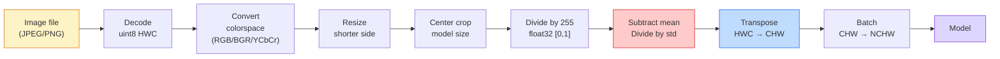
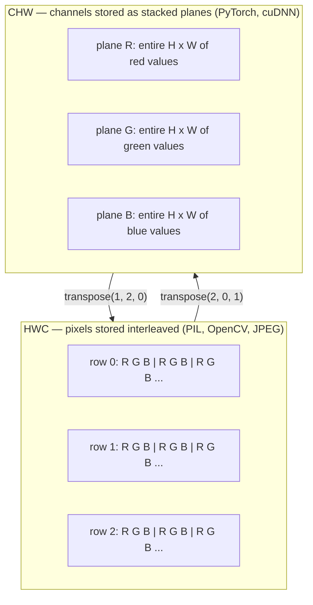

# 01 · 图像基础——像素、通道与色彩空间

> 图像是一个由光照采样构成的张量。你今后用到的每一个视觉模型，都从这一事实出发。

**类型：** 实战构建
**语言：** Python
**前置：** 第 1 阶段第 12 课（张量操作）、第 3 阶段第 11 课（PyTorch 入门）
**时长：** 约 45 分钟

## 学习目标

- 解释一个连续场景如何被离散化为像素，以及为什么采样/量化的取舍会决定下游所有模型的上限
- 把图像当作 NumPy 数组来读取、切片和检视，并在 HWC 与 CHW 两种布局之间流畅切换
- 在 RGB、灰度、HSV、YCbCr 之间相互转换，并说明每种色彩空间存在的理由
- 完全按照 torchvision 的预期方式应用像素级预处理（归一化、标准化、缩放、通道优先）

## 问题所在

你将阅读的每一篇论文、下载的每一份预训练权重、调用的每一个视觉 API，都假定输入是某种特定的编码方式。当模型需要 `float32` 时你却传入了 `uint8` 图像，它照样能跑——然后悄无声息地产出垃圾结果。把 BGR 喂给一个用 RGB 训练的网络，准确率会骤降十个百分点。给一个期望通道优先（channels-first）的模型递上通道最后（channels-last）的输入，第一个卷积层就会把高度当成一个特征通道来处理。这些都不会抛出任何错误。它们只会毁掉你的指标，而你会花上一周时间去追查一个其实藏在文件加载方式里的 bug。

一旦你弄清楚卷积在什么东西上滑动，它就不再复杂了。真正棘手的是：「一张图像」对于相机、JPEG 解码器、PIL、OpenCV、torchvision 和 CUDA kernel 来说意味着不同的东西。每一套技术栈都有自己的轴顺序、字节范围和通道约定。一个理不清这些的视觉工程师，交付的就是坏掉的流水线。

本课打牢这个基础，好让本阶段的其余内容能在其之上构建。学完之后，你将知道像素是什么、为什么每个像素是三个数而不是一个、「用 ImageNet 统计量做归一化」究竟做了什么，以及如何在本阶段后续每一课都会假定的那两三种布局之间切换。

## 核心概念

### 一览完整的预处理流水线

每一个生产级视觉系统，本质上都是同一串可逆变换。任何一步出错，模型看到的输入就和它训练时用的不一样了。



那两个红色和蓝色的方框，就是 80% 的静默失败所在之处：漏掉标准化，以及布局搞错。

### 像素是一次采样，不是一个方块

相机传感器对落在密集排列的微型探测器网格上的光子计数。每个探测器在几分之一秒内对光照积分，并输出一个与命中光子数成正比的电压。随后传感器把该电压离散化为一个整数。一个探测器对应一个像素。

```
连续场景                          传感器网格                       数字图像
（无限细节）                       (H x W 个探测器)                  (H x W 个整数)

    ~~~~~                        +--+--+--+--+--+                 210 198 180 155 120
   ~   ~   ~                     |  |  |  |  |  |                 205 195 178 152 118
  ~ light ~      ---->           +--+--+--+--+--+     ---->       200 190 175 150 115
   ~~~~~                         |  |  |  |  |  |                 195 185 170 148 112
                                 +--+--+--+--+--+                 188 180 165 145 108
```

这一步有两个选择，它们决定了下游一切的上限：

- **空间采样（spatial sampling）** 决定场景每一度对应多少个探测器。太少，边缘会出现锯齿（混叠，aliasing）；太多，存储和算力会爆炸。
- **强度量化（intensity quantization）** 决定电压被分桶得多细。8 位给出 256 个级别，是显示的标准。10、12、16 位给出更平滑的渐变，对医学影像、HDR 和原始（raw）传感器流水线很重要。

像素不是一个有面积的彩色方块，它是单次测量。当你缩放或旋转时，你是在对这个测量网格重新采样。

### 为什么是三个通道

一个探测器对整个可见光谱的光子计数——那就是灰度。要获得颜色，传感器在网格上覆盖一层由红、绿、蓝滤镜构成的马赛克。经过去马赛克（demosaicing）之后，每个空间位置都有三个整数：附近被红色滤镜、绿色滤镜、蓝色滤镜过滤后的探测器的响应值。这三个整数就是一个像素的 RGB 三元组。

```
内存中的一个像素：

    (R, G, B) = (210, 140, 30)   <- 偏红的橙色

一张 H x W 的 RGB 图像：

    shape (H, W, 3)     存储为   H 行，每行 W 个像素，每个像素 3 个值
                                 对 uint8 而言每个值都在 [0, 255] 区间
```

三并不是什么魔法数字。深度相机会加上一个 Z 通道。卫星会加上红外和紫外波段。医学扫描通常只有一个通道（X 光、CT）或有很多通道（高光谱）。通道数是最后一个轴；卷积层会学着在它上面做混合。

### 两种布局约定：HWC 与 CHW

同一个张量，两种排序。每个库都选定其一。

```
HWC（高度、宽度、通道）                  CHW（通道、高度、宽度）

   W ->                                    H ->
  +-----+-----+-----+                     +-----+-----+
H |R G B|R G B|R G B|                   C |R R R R R R|
| +-----+-----+-----+                   | +-----+-----+
v |R G B|R G B|R G B|                   v |G G G G G G|
  +-----+-----+-----+                     +-----+-----+
                                          |B B B B B B|
                                          +-----+-----+

   PIL、OpenCV、matplotlib，             PyTorch、绝大多数深度学习
   几乎所有磁盘上的图像文件               框架、cuDNN kernel
```

CHW 之所以存在，是因为卷积核要在 H 和 W 上滑动。把通道轴放在最前面意味着每个卷积核看到的是每个通道上一块连续的二维平面，这能干净地向量化。磁盘格式保留 HWC，是因为它匹配扫描线从传感器输出的方式。

你会敲上千遍的那一行转换代码：

```
img_chw = img_hwc.transpose(2, 0, 1)      # NumPy
img_chw = img_hwc.permute(2, 0, 1)        # PyTorch tensor
```

内存布局可视化：



### 字节范围与数据类型

三种约定占据主导：

| 约定 | dtype | 范围 | 在哪里遇到 |
|------|-------|------|-----------|
| 原始 | `uint8` | [0, 255] | 磁盘上的文件、PIL、OpenCV 的输出 |
| 归一化 | `float32` | [0.0, 1.0] | 执行 `img.astype('float32') / 255` 之后 |
| 标准化 | `float32` | 大致 [-2, +2] | 减去均值并除以标准差之后 |

卷积网络是在标准化输入上训练的。ImageNet 统计量 `mean=[0.485, 0.456, 0.406]`、`std=[0.229, 0.224, 0.225]` 是在整个 ImageNet 训练集上、对 [0, 1] 归一化后的像素计算出的三个通道的算术平均值和标准差。把原始 `uint8` 喂给一个期望标准化浮点数的模型，是应用视觉中最常见的单一静默失败。

### 色彩空间及其存在的理由

RGB 是采集格式，但它对模型来说并不总是最有用的表示。

```
 RGB               HSV                       YCbCr / YUV

 R 红              H 色相（角度 0-360）       Y 亮度（明暗）
 G 绿              S 饱和度（0-1）            Cb 蓝-黄色度
 B 蓝              V 明度/亮度（0-1）         Cr 红-绿色度

 线性对应          把颜色与亮度分离开。       把亮度与颜色分离开。JPEG 和
 传感器输出        适用于颜色阈值分割、       多数视频编解码器对色度通道
                   UI 滑块、简单滤镜          压缩得更狠，因为人眼对色度
                                             细节的敏感度不如对 Y 的敏感度。
```

对大多数现代 CNN，你喂的是 RGB。你会在以下情形遇到其他空间：

- **HSV** —— 经典 CV 代码、基于颜色的分割、白平衡。
- **YCbCr** —— 解读 JPEG 内部结构、视频流水线、只在 Y 通道上工作的超分辨率模型。
- **灰度（Grayscale）** —— OCR、文档模型，以及任何颜色是干扰变量而非信号的场景。

从 RGB 转灰度是一个加权求和，而不是简单平均，因为人眼对绿色比对红色或蓝色更敏感：

```
Y = 0.299 R + 0.587 G + 0.114 B       （ITU-R BT.601，经典权重）
```

### 宽高比、缩放与插值

每个模型都有固定的输入尺寸（大多数 ImageNet 分类器是 224x224，现代检测器是 384x384 或 512x512）。你的图像很少恰好匹配。三种重要的缩放选择：

- **缩放短边，然后中心裁剪（center crop）** —— 标准的 ImageNet 配方。保持宽高比，丢掉边缘的一条像素带。
- **缩放并填充（pad）** —— 保持宽高比和每一个像素，加上黑边。检测和 OCR 的标准做法。
- **直接缩放到目标尺寸** —— 拉伸图像。代价低，会扭曲几何形状，但对许多分类任务没问题。

插值方法决定了当新网格与旧网格不对齐时，中间像素如何计算：

```
最近邻（Nearest neighbour）  最快、有块状感，掩码/标签的唯一选择
双线性（Bilinear）           快、平滑，大多数图像缩放的默认选项
双三次（Bicubic）            较慢，放大时更锐利
Lanczos                      最慢、质量最好，用于最终显示
```

经验法则：训练用双线性，给人看的素材用双三次或 Lanczos，任何含有整数类别 ID 的内容用最近邻。

## 动手构建

### 第 1 步：加载一张图像并检视其形状

用 Pillow 加载任意 JPEG 或 PNG，转成 NumPy，然后打印你得到的东西。为了得到一个可离线运行的确定性示例，我们合成一张。

```python
import numpy as np
from PIL import Image

def synthetic_rgb(h=128, w=192, seed=0):
    rng = np.random.default_rng(seed)
    yy, xx = np.meshgrid(np.linspace(0, 1, h), np.linspace(0, 1, w), indexing="ij")
    r = (np.sin(xx * 6) * 0.5 + 0.5) * 255
    g = yy * 255
    b = (1 - yy) * xx * 255
    rgb = np.stack([r, g, b], axis=-1) + rng.normal(0, 6, (h, w, 3))
    return np.clip(rgb, 0, 255).astype(np.uint8)

arr = synthetic_rgb()
# 或者从磁盘加载：
# arr = np.asarray(Image.open("your_image.jpg").convert("RGB"))

print(f"type:   {type(arr).__name__}")
print(f"dtype:  {arr.dtype}")
print(f"shape:  {arr.shape}     # (H, W, C)")
print(f"min:    {arr.min()}")
print(f"max:    {arr.max()}")
print(f"pixel at (0, 0): {arr[0, 0]}")
```

预期输出：`shape: (H, W, 3)`、`dtype: uint8`、范围 `[0, 255]`。无论这些字节来自相机、JPEG 解码器还是合成生成器，这都是磁盘上规范的表示形式。

### 第 2 步：拆分通道并重排布局

把 R、G、B 分别取出来，然后从 HWC 转成 PyTorch 用的 CHW。

```python
R = arr[:, :, 0]
G = arr[:, :, 1]
B = arr[:, :, 2]
print(f"R shape: {R.shape}, mean: {R.mean():.1f}")
print(f"G shape: {G.shape}, mean: {G.mean():.1f}")
print(f"B shape: {B.shape}, mean: {B.mean():.1f}")

arr_chw = arr.transpose(2, 0, 1)
print(f"\nHWC shape: {arr.shape}")
print(f"CHW shape: {arr_chw.shape}")
```

三个灰度平面，每个通道一个。CHW 只是重排了轴；当内存布局允许时，并不严格需要复制数据。

### 第 3 步：灰度与 HSV 转换

先做加权求和灰度，再手写一个 RGB 到 HSV 的转换。

```python
def rgb_to_grayscale(rgb):
    weights = np.array([0.299, 0.587, 0.114], dtype=np.float32)
    return (rgb.astype(np.float32) @ weights).astype(np.uint8)

def rgb_to_hsv(rgb):
    rgb_f = rgb.astype(np.float32) / 255.0
    r, g, b = rgb_f[..., 0], rgb_f[..., 1], rgb_f[..., 2]
    cmax = np.max(rgb_f, axis=-1)
    cmin = np.min(rgb_f, axis=-1)
    delta = cmax - cmin

    h = np.zeros_like(cmax)
    mask = delta > 0
    rmax = mask & (cmax == r)
    gmax = mask & (cmax == g)
    bmax = mask & (cmax == b)
    h[rmax] = ((g[rmax] - b[rmax]) / delta[rmax]) % 6
    h[gmax] = ((b[gmax] - r[gmax]) / delta[gmax]) + 2
    h[bmax] = ((r[bmax] - g[bmax]) / delta[bmax]) + 4
    h = h * 60.0

    s = np.where(cmax > 0, delta / cmax, 0)
    v = cmax
    return np.stack([h, s, v], axis=-1)

gray = rgb_to_grayscale(arr)
hsv = rgb_to_hsv(arr)
print(f"gray shape: {gray.shape}, range: [{gray.min()}, {gray.max()}]")
print(f"hsv   shape: {hsv.shape}")
print(f"hue range: [{hsv[..., 0].min():.1f}, {hsv[..., 0].max():.1f}] degrees")
print(f"sat range: [{hsv[..., 1].min():.2f}, {hsv[..., 1].max():.2f}]")
print(f"val range: [{hsv[..., 2].min():.2f}, {hsv[..., 2].max():.2f}]")
```

色相以度为单位输出，饱和度和明度在 [0, 1] 区间。这与 OpenCV 的 `hsv_full` 约定一致。

### 第 4 步：归一化、标准化，并将其反向还原

从原始字节出发，得到一个预训练 ImageNet 模型所期望的精确张量，再反向还原回去。

```python
mean = np.array([0.485, 0.456, 0.406], dtype=np.float32)
std = np.array([0.229, 0.224, 0.225], dtype=np.float32)

def preprocess_imagenet(rgb_uint8):
    x = rgb_uint8.astype(np.float32) / 255.0
    x = (x - mean) / std
    x = x.transpose(2, 0, 1)
    return x

def deprocess_imagenet(chw_float32):
    x = chw_float32.transpose(1, 2, 0)
    x = x * std + mean
    x = np.clip(x * 255.0, 0, 255).astype(np.uint8)
    return x

x = preprocess_imagenet(arr)
print(f"preprocessed shape: {x.shape}     # (C, H, W)")
print(f"preprocessed dtype: {x.dtype}")
print(f"preprocessed mean per channel:  {x.mean(axis=(1, 2)).round(3)}")
print(f"preprocessed std  per channel:  {x.std(axis=(1, 2)).round(3)}")

roundtrip = deprocess_imagenet(x)
max_diff = np.abs(roundtrip.astype(int) - arr.astype(int)).max()
print(f"roundtrip max pixel diff: {max_diff}    # should be 0 or 1")
```

每个通道的均值应接近零，标准差应接近一。这一对 preprocess/deprocess 函数，正是每一次 torchvision `transforms.Normalize` 调用在底层所做的事情。

### 第 5 步：用三种插值方法缩放

在一次放大上对比最近邻、双线性和双三次，好让差异可见。

```python
target = (arr.shape[0] * 3, arr.shape[1] * 3)

nearest = np.asarray(Image.fromarray(arr).resize(target[::-1], Image.NEAREST))
bilinear = np.asarray(Image.fromarray(arr).resize(target[::-1], Image.BILINEAR))
bicubic = np.asarray(Image.fromarray(arr).resize(target[::-1], Image.BICUBIC))

def local_roughness(x):
    gy = np.diff(x.astype(float), axis=0)
    gx = np.diff(x.astype(float), axis=1)
    return float(np.abs(gy).mean() + np.abs(gx).mean())

for name, out in [("nearest", nearest), ("bilinear", bilinear), ("bicubic", bicubic)]:
    print(f"{name:>8}  shape={out.shape}  roughness={local_roughness(out):6.2f}")
```

最近邻在粗糙度（roughness）上得分最高，因为它保留了硬边缘。双线性最平滑。双三次介于两者之间，在不产生阶梯状伪影的前提下保留了感知到的锐度。

## 投入使用

`torchvision.transforms` 把上面所有内容打包成一条可组合的流水线。下面的代码精确复现了 `preprocess_imagenet` 所做的事情，外加缩放和裁剪。

```python
import torch
from torchvision import transforms
from PIL import Image

img = Image.fromarray(synthetic_rgb(256, 256))

pipeline = transforms.Compose([
    transforms.Resize(256),
    transforms.CenterCrop(224),
    transforms.ToTensor(),
    transforms.Normalize(mean=[0.485, 0.456, 0.406], std=[0.229, 0.224, 0.225]),
])

x = pipeline(img)
print(f"tensor type:  {type(x).__name__}")
print(f"tensor dtype: {x.dtype}")
print(f"tensor shape: {tuple(x.shape)}      # (C, H, W)")
print(f"per-channel mean: {x.mean(dim=(1, 2)).tolist()}")
print(f"per-channel std:  {x.std(dim=(1, 2)).tolist()}")

batch = x.unsqueeze(0)
print(f"\nbatched shape: {tuple(batch.shape)}   # (N, C, H, W) — 已就绪可送入模型")
```

四个步骤，严格按此顺序：`Resize(256)` 把短边缩放到 256；`CenterCrop(224)` 从中间取一块 224x224 的图块；`ToTensor()` 除以 255 并把 HWC 换成 CHW；`Normalize` 减去 ImageNet 均值并除以标准差。颠倒这个顺序会悄无声息地改变最终抵达模型的内容。

## 交付成果

本课产出：

- `outputs/prompt-vision-preprocessing-audit.md` —— 一段提示词，能把任意模型卡片（model card）或数据集卡片（dataset card）转化为一份清单，列出团队必须遵守的精确预处理不变量。
- `outputs/skill-image-tensor-inspector.md` —— 一个技能，给定任意图像形状的张量或数组，报告其 dtype、布局、范围，以及它看起来是原始、归一化还是标准化的。

## 练习

1. **（简单）** 用 OpenCV（`cv2.imread`）和 Pillow 分别加载一张 JPEG。打印两者的形状以及 `(0, 0)` 处的像素。解释通道顺序的差异，然后写一行转换代码，让 OpenCV 数组与 Pillow 数组完全相同。
2. **（中等）** 编写 `standardize(img, mean, std)` 及其逆函数，二者合起来要能在任意 uint8 图像上通过 `roundtrip_max_diff <= 1` 测试。你的函数必须能用同一种调用方式同时作用于 HWC 的单张图像和 NCHW 的批量数据。
3. **（困难）** 取一个 3 通道、经 ImageNet 标准化的张量，让它通过一个 1x1 卷积，该卷积学习把 RGB 加权混合成单个灰度通道。把权重初始化为 `[0.299, 0.587, 0.114]`，冻结它们，并验证输出在浮点误差范围内与你手写的 `rgb_to_grayscale` 一致。还有哪些经典的色彩空间变换可以写成 1x1 卷积？

## 关键术语

| 术语 | 人们怎么说 | 它实际是什么意思 |
|------|-----------|----------------|
| 像素（Pixel） | 「一个彩色方块」 | 某个网格位置上一次光强采样——彩色是三个数，灰度是一个数 |
| 通道（Channel） | 「颜色」 | 堆叠进图像张量的若干并行空间网格之一；在 HWC 中是最后一个轴，在 CHW 中是第一个轴 |
| HWC / CHW | 「形状」 | 图像张量的轴排序方式；磁盘和 PIL 用 HWC，PyTorch 和 cuDNN 用 CHW |
| 归一化（Normalize） | 「缩放图像」 | 除以 255 使像素落在 [0, 1]——必要但不充分 |
| 标准化（Standardize） | 「零中心化」 | 按通道减去均值并除以标准差，使输入分布匹配模型训练时的分布 |
| 灰度转换（Grayscale conversion） | 「把各通道平均」 | 一个系数为 0.299/0.587/0.114 的加权求和，与人眼亮度感知相匹配 |
| 插值（Interpolation） | 「缩放如何挑选像素」 | 当新网格与旧网格不对齐时决定输出值的规则——标签用最近邻、训练用双线性、显示用双三次 |
| 宽高比（Aspect ratio） | 「宽除以高」 | 用以区分「缩放并填充」与「缩放并拉伸」的比值 |

## 延伸阅读

- [Charles Poynton —— A Guided Tour of Color Space](https://poynton.ca/PDFs/Guided_tour.pdf) —— 关于为什么存在这么多色彩空间、以及每一种何时重要的最清晰技术性论述
- [PyTorch Vision Transforms 文档](https://pytorch.org/vision/stable/transforms.html) —— 你在生产中真正会去组合的完整变换流水线
- [JPEG 工作原理（Colt McAnlis）](https://www.youtube.com/watch?v=F1kYBnY6mwg) —— 对色度子采样、DCT 以及为什么 JPEG 编码的是 YCbCr 而非 RGB 的一次犀利的可视化讲解
- [ImageNet 预处理约定（torchvision 模型）](https://pytorch.org/vision/stable/models.html) —— `mean=[0.485, 0.456, 0.406]` 的权威来源，以及为什么模型库中每个模型都期望它
