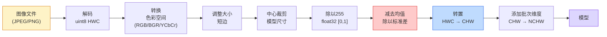
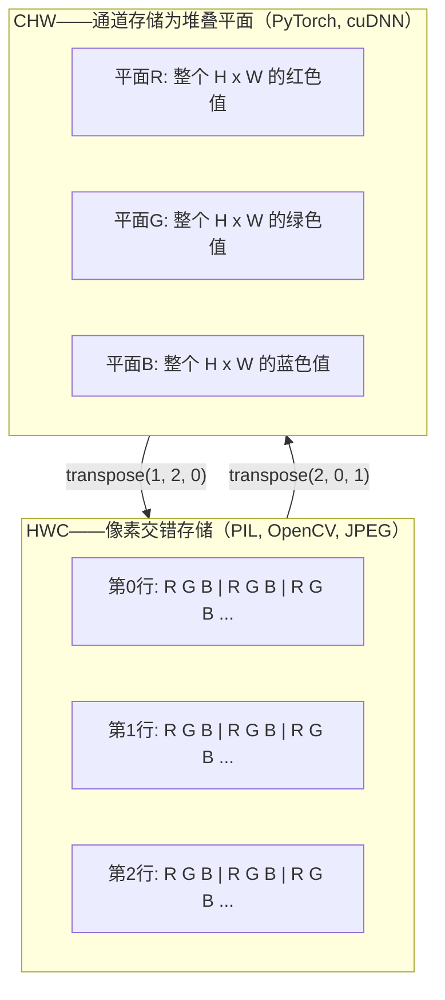

# 图像基础 — 像素、通道与色彩空间

> **图像是光采样的张量。你将使用的每一个视觉模型都基于这一事实。**

**类型：** 构建  
**语言：** Python  
**前置知识：** 阶段1 第12课（张量运算），阶段3 第11课（PyTorch入门）  
**时长：** 约45分钟

## 学习目标

- 解释连续场景如何离散化为像素，以及采样/量化决策如何为所有下游模型设定性能上限
- 将图像作为NumPy数组进行读取、切片和检查，并在HWC和CHW布局之间流畅切换
- 在RGB、灰度、HSV和YCbCr之间进行转换，并说明每种色彩空间存在的理由
- 精确按照torchvision预期的方式应用像素级预处理（归一化、标准化、调整大小、通道优先）

## 问题

你阅读的每一篇论文、下载的每一个预训练权重、调用的每一个视觉API，都假设输入具有特定的编码。向期望`float32`的模型传入`uint8`图像，它仍然会运行——然后静默地产生垃圾结果。向基于RGB训练的网络输入BGR，准确率会下降十个百分点。当模型期望通道优先（Channels-First）时，传入通道最后（Channels-Last）的输入，第一个卷积层会把高度当作特征通道。这些情况都不会抛出错误。它们只会破坏你的指标，然后你花一周时间寻找隐藏在文件加载方式中的bug。

一旦你知道卷积在什么之上滑动，它就不再复杂。难点在于，"一张图像"对相机、JPEG解码器、PIL、OpenCV、torchvision和CUDA内核意味着不同的东西。每个栈都有自己的轴顺序、字节范围和通道约定。无法理清这些的视觉工程师会交付有缺陷的流水线。

本课将夯实基础，使本阶段的后续课程能够在此基础上构建。到课程结束时，你将知道什么是像素、为什么每个像素有三个数字而不是一个、"使用ImageNet统计量进行归一化"实际上做了什么，以及如何在本阶段其他课程假设的那两三种布局之间进行转换。

## 概念

### 完整的预处理流水线一览

每个生产级视觉系统都是相同序列的可逆变换。做错一步，模型看到的输入就不同于训练时的输入。



两个红色和蓝色的框是80%静默失败的原因：缺少标准化和错误的布局。

### 像素是一个样本，不是一个方块

相机传感器对落在微小探测器网格上的光子进行计数。每个探测器在一小段时间内积分光线，并发射一个与撞击光子数成正比的电压。然后传感器将该电压离散化为一个整数。一个探测器变成一个像素。

```
连续场景                     传感器网格                     数字图像
(无限细节)                   (H x W 个探测器)               (H x W 个整数)

    ~~~~~                        +--+--+--+--+--+                 210 198 180 155 120
   ~   ~   ~                     |  |  |  |  |  |                 205 195 178 152 118
  ~ light ~      ---->           +--+--+--+--+--+     ---->       200 190 175 150 115
   ~~~~~                         |  |  |  |  |  |                 195 185 170 148 112
                                 +--+--+--+--+--+                 188 180 165 145 108
```

这一步做出两个选择，它们设定了所有下游任务的上限：

- **空间采样（Spatial Sampling）** 决定每度场景有多少个探测器。太少，边缘会变得锯齿状（混叠）。太多，存储和计算会爆炸。
- **强度量化（Intensity Quantization）** 决定电压被划分的精细程度。8位提供256个级别，是显示的标准。10位、12位、16位提供更平滑的梯度，在医学成像、HDR和原始传感器流水线中很重要。

像素不是一个有面积的彩色方块。它是一个单独的测量值。当你调整大小或旋转时，你正在对该测量网格进行重新采样。

### 为什么是三个通道

一个探测器对整个可见光谱的光子进行计数——这就是灰度。为了获得颜色，传感器用红、绿、蓝滤波器的马赛克覆盖网格。经过去马赛克处理后，每个空间位置都有三个整数：附近红色滤波探测器、绿色滤波探测器和蓝色滤波探测器的响应。这三个整数就是一个像素的RGB三元组。

```
内存中的一个像素：

    (R, G, B) = (210, 140, 30)   <- 红橙色

一张 H x W 的RGB图像：

    形状 (H, W, 3)     存储为: H行，每行W个像素，每个像素3个值
                                   每个值在uint8下为[0, 255]
```

三个并非魔法。深度相机增加一个Z通道。卫星增加红外和紫外波段。医学扫描通常只有一个通道（X射线、CT）或很多通道（高光谱）。通道数是最后一个轴；卷积层学会跨通道混合。

### 两种布局约定：HWC 和 CHW

相同的张量，两种排列顺序。每个库选择一种。

```
HWC（高度，宽度，通道）                 CHW（通道，高度，宽度）

   W ->                                    H ->
  +-----+-----+-----+                     +-----+-----+
H |R G B|R G B|R G B|                   C |R R R R R R|
| +-----+-----+-----+                   | +-----+-----+
v |R G B|R G B|R G B|                   v |G G G G G G|
  +-----+-----+-----+                     +-----+-----+
                                          |B B B B B B|
                                          +-----+-----+

   PIL, OpenCV, matplotlib,               PyTorch, 大多数深度学习框架,
   几乎所有的磁盘图像文件                  cuDNN内核
```

CHW存在是因为卷积内核在H和W上滑动。将通道轴放在第一位意味着每个内核在每个通道上看到一个连续的2D平面，这有助于向量化。磁盘格式保留HWC，因为这匹配传感器输出的扫描线。

你会输入一千次的一行转换：

```python
img_chw = img_hwc.transpose(2, 0, 1)      # NumPy
img_chw = img_hwc.permute(2, 0, 1)        # PyTorch 张量
```

内存布局可视化：



### 字节范围与数据类型

三种约定占主导地位：

| 约定 | 数据类型 | 范围 | 出现位置 |
|------|---------|------|----------|
| 原始 | `uint8` | [0, 255] | 磁盘文件、PIL、OpenCV输出 |
| 归一化 | `float32` | [0.0, 1.0] | `img.astype('float32') / 255` 之后 |
| 标准化 | `float32` | 大致 [-2, +2] | 减去均值并除以标准差之后 |

卷积网络是在标准化输入上训练的。ImageNet统计量 `mean=[0.485, 0.456, 0.406]`, `std=[0.229, 0.224, 0.225]` 是三个通道在整个ImageNet训练集上的算术均值和标准差，是在 [0, 1] 归一化像素上计算的。将原始 `uint8` 输入到期望标准化浮点数的模型，是应用视觉中最常见的静默失败。

### 色彩空间及其存在理由

RGB是捕捉格式，但它并不总是对模型最有用的表示。

```
 RGB               HSV                       YCbCr / YUV

 R 红色           H 色调（角度 0-360）       Y 亮度（明度）
 G 绿色           S 饱和度（0-1）            Cb 蓝色-黄色色度
 B 蓝色           V 值/明度（0-1）           Cr 红-绿色度

 线性对应          将颜色与亮度分离。        将亮度与颜色分离。
 传感器输出        对颜色阈值、UI滑块、         JPEG和大多数视频编解码器
                   简单滤波器有用             对色度通道进行更重的压缩，
                                              因为人眼对色度细节不如对Y敏感。
```

对于大多数现代CNN，你输入RGB。你在以下情况会遇到其他空间：

- **HSV** — 经典计算机视觉代码、基于颜色的分割、白平衡。
- **YCbCr** — 读取JPEG内部、视频流水线、仅对Y操作的超分辨率模型。
- **灰度** — OCR、文档模型、颜色是干扰变量而非信号的任何情况。

从RGB到灰度是加权和，而非平均值，因为人眼对绿色比红色或蓝色更敏感：

```
Y = 0.299 R + 0.587 G + 0.114 B       （ITU-R BT.601，经典权重）
```

### 宽高比、调整大小与插值

每个模型都有一个固定的输入尺寸（大多数ImageNet分类器为224x224，现代检测器为384x384或512x512）。你的图像很少匹配。以下三种调整大小选择很重要：

- **调整短边大小，然后中心裁剪** — 标准的ImageNet方案。保留宽高比，丢弃一周边界像素。
- **调整大小并填充** — 保留宽高比和每个像素，添加黑色边框。检测和OCR的标准做法。
- **直接调整到目标大小** — 拉伸图像。廉价、扭曲几何形状，但对许多分类任务足够。

插值方法决定了当新网格与旧网格不对齐时如何计算中间像素：

```
最近邻（Nearest Neighbour）    最快，块状，仅用于掩码/标签
双线性（Bilinear）             快速，平滑，大多数图像调整大小的默认值
双三次（Bicubic）              较慢，放大时更锐利
兰索斯（Lanczos）              最慢，质量最好，用于最终显示
```

经验法则：训练时用双线性，你会查看的资源用双三次或兰索斯，包含整数类ID的任何内容用最近邻。

## 动手构建

### 步骤1：加载图像并检查其形状

使用Pillow加载任意JPEG或PNG，转换为NumPy，并打印你得到的内容。为了一个可确定性离线运行的示例，合成一张。

```python
import numpy as np
from PIL import Image

def synthetic_rgb(h=128, w=192, seed=0):
    rng = np.random.default_rng(seed)
    yy, xx = np.meshgrid(np.linspace(0, 1, h), np.linspace(0, 1, w), indexing="ij")
    r = (np.sin(xx * 6) * 0.5 + 0.5) * 255
    g = yy * 255
    b = (1 - yy) * xx * 255
    rgb = np.stack([r, g, b], axis=-1) + rng.normal(0, 6, (h, w, 3))
    return np.clip(rgb, 0, 255).astype(np.uint8)

arr = synthetic_rgb()
# 或者从磁盘加载：
# arr = np.asarray(Image.open("your_image.jpg").convert("RGB"))

print(f"类型:   {type(arr).__name__}")
print(f"数据类型:  {arr.dtype}")
print(f"形状:  {arr.shape}     # (H, W, C)")
print(f"最小值:    {arr.min()}")
print(f"最大值:    {arr.max()}")
print(f"(0, 0)处的像素: {arr[0, 0]}")
```

期望输出：`shape: (H, W, 3)`, `dtype: uint8`, 范围 `[0, 255]`。无论字节来自相机、JPEG解码器还是合成生成器，这都是规范的磁盘表示。

### 步骤2：分离通道并重排布局

分别提取R、G、B，然后从HWC转换为CHW以便用于PyTorch。

```python
R = arr[:, :, 0]
G = arr[:, :, 1]
B = arr[:, :, 2]
print(f"R 形状: {R.shape}, 均值: {R.mean():.1f}")
print(f"G 形状: {G.shape}, 均值: {G.mean():.1f}")
print(f"B 形状: {B.shape}, 均值: {B.mean():.1f}")

arr_chw = arr.transpose(2, 0, 1)
print(f"\nHWC 形状: {arr.shape}")
print(f"CHW 形状: {arr_chw.shape}")
```

三个灰度平面，每个通道一个。CHW只是重新排列轴；当内存布局允许时，严格来说不需要数据复制。

### 步骤3：灰度和HSV转换

加权和灰度，然后手动RGB转HSV。

```python
def rgb_to_grayscale(rgb):
    weights = np.array([0.299, 0.587, 0.114], dtype=np.float32)
    return (rgb.astype(np.float32) @ weights).astype(np.uint8)

def rgb_to_hsv(rgb):
    rgb_f = rgb.astype(np.float32) / 255.0
    r, g, b = rgb_f[..., 0], rgb_f[..., 1], rgb_f[..., 2]
    cmax = np.max(rgb_f, axis=-1)
    cmin = np.min(rgb_f, axis=-1)
    delta = cmax - cmin

    h = np.zeros_like(cmax)
    mask = delta > 0
    rmax = mask & (cmax == r)
    gmax = mask & (cmax == g)
    bmax = mask & (cmax == b)
    h[rmax] = ((g[rmax] - b[rmax]) / delta[rmax]) % 6
    h[gmax] = ((b[gmax] - r[gmax]) / delta[gmax]) + 2
    h[bmax] = ((r[bmax] - g[bmax]) / delta[bmax]) + 4
    h = h * 60.0

    s = np.where(cmax > 0, delta / cmax, 0)
    v = cmax
    return np.stack([h, s, v], axis=-1)

gray = rgb_to_grayscale(arr)
hsv = rgb_to_hsv(arr)
print(f"灰度形状: {gray.shape}, 范围: [{gray.min()}, {gray.max()}]")
print(f"HSV 形状: {hsv.shape}")
print(f"色调范围: [{hsv[..., 0].min():.1f}, {hsv[..., 0].max():.1f}] 度")
print(f"饱和度范围: [{hsv[..., 1].min():.2f}, {hsv[..., 1].max():.2f}]")
print(f"明度范围: [{hsv[..., 2].min():