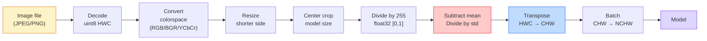
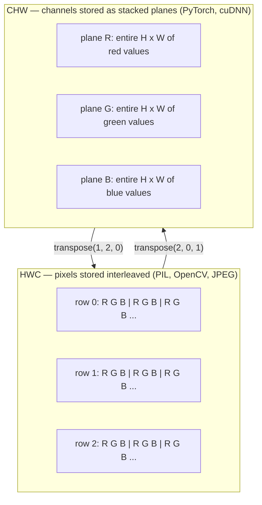

# 图像基础-像素、通道、色彩空间

> 图像是光样本的张量。您使用的每个视觉模型都始于这一事实。

** 类型：** 构建
** 语言：** Python
** 先决条件：** 阶段1第12课（张量运算），阶段3第11课（PyTorch简介）
** 时间：** ~45分钟

## 学习目标

- 解释连续场景如何离散化为像素，以及为什么采样/量化决策为每个下游模型设定了上限
- 将图像作为NumPy阵列读取、切片和检查，并在HWC和CHW布局之间流畅切换
- 在RGB、灰度、HSV和YCbCr之间进行转换，并说明每个颜色空间存在的原因
- 完全按照Torchvision的期望应用像素级预处理（规范化、标准化、调整大小、通道优先）

## 问题

您将阅读的每份论文、您将下载的每份预训练权重、您将调用的每个视觉API都假设输入的特定编码。传递一个“uint 8”图像，其中模型想要“float 32”，它仍然会运行-并默默地产生垃圾。将BGR输入到经过Ruby训练的网络，准确性就会下降十个百分点。当模型预期通道优先且第一个转换层将高度视为要素通道时，提交模型通道最后输入。所有这些都不会出错。它只会破坏你的指标，你会花一周的时间寻找加载文件的方式中存在的错误。

一旦你知道卷积正在滑动什么，它就并不复杂了。困难的部分是，“图像”对于相机、JPEG解码器、PIL、OpenCV、torchvision和CUDA内核来说意味着不同的东西。每个堆栈都有自己的轴顺序、字节范围和通道约定。一位无法让这些船只保持笔直，管道破裂。

本课奠定了基础，以便阶段的其余部分可以在此基础上进行。最后，您将知道什么是像素，为什么每个像素有三个数字而不是一个数字，“使用ImageNet统计数据进行规范化”实际上是什么，以及如何在两个或三个布局之间移动，这是本阶段的每个其他课程都会假设的。

## 概念

### 完整的预处理管道概览

每个产品视觉系统都是相同的可逆转换序列。如果走错一步，模型就会看到与训练时不同的输入。



这两个红色和蓝色的盒子是80%的无声失败所在：缺少标准化和错误的布局。

### 像素是样本，而不是正方形

相机传感器对落在微型探测器网格上的量子进行计数。每个探测器在几分之一秒内对光进行积分，并发射与撞击它的量子数量成比例的电压。然后传感器将该电压离散化为一个整体。一个探测器变成一个像素。

```
Continuous scene                 Sensor grid                     Digital image
(infinite detail)                (H x W detectors)               (H x W integers)

    ~~~~~                        +--+--+--+--+--+                 210 198 180 155 120
   ~   ~   ~                     |  |  |  |  |  |                 205 195 178 152 118
  ~ light ~      ---->           +--+--+--+--+--+     ---->       200 190 175 150 115
   ~~~~~                         |  |  |  |  |  |                 195 185 170 148 112
                                 +--+--+--+--+--+                 188 180 165 145 108
```

这一步发生了两种选择，它们固定了下游一切的上限：

- ** 空间采样 ** 决定场景每度有多少个检测器。太少，边缘会变得锯齿状（锯齿状）。太多，存储和计算就会爆炸式增长。
- ** 强度量化 ** 决定电压的分层程度。8位提供256个级别，是显示的标准。10、12、16位为医学成像、HDR和原始传感器管道提供更平滑的梯度和物质。

像素不是带面积的彩色正方形。这是一个单一的测量。当您调整大小或旋转时，您将重新调整该测量网格。

### 为什么是三个渠道

一个探测器计算整个可见光谱中的光子--也就是灰度级。为了获得颜色，传感器用红、绿、蓝三色滤光片的马赛克覆盖网格。去马赛克后，每个空间位置都有三个整数：红色滤波检测器的响应，绿色滤波和蓝色滤波附近。这三个整数是像素的RGB三元组。

```
One pixel in memory:

    (R, G, B) = (210, 140, 30)   <- reddish-orange

An H x W RGB image:

    shape (H, W, 3)     stored as   H rows of W pixels of 3 values
                                    each in [0, 255] for uint8
```

三不是魔法。深度相机添加Z通道。卫星添加了红外和紫外线频段。医学扫描通常有一个通道（X射线、CT）或多个通道（高光谱）。通道的数量是最后一个轴;转换层学会在其中混合。

### 两种布局惯例：HWC和CHW

相同的张量，两种排序。每个图书馆都会挑选一个。

```
HWC (height, width, channels)           CHW (channels, height, width)

   W ->                                    H ->
  +-----+-----+-----+                     +-----+-----+
H |R G B|R G B|R G B|                   C |R R R R R R|
| +-----+-----+-----+                   | +-----+-----+
v |R G B|R G B|R G B|                   v |G G G G G G|
  +-----+-----+-----+                     +-----+-----+
                                          |B B B B B B|
                                          +-----+-----+

   PIL, OpenCV, matplotlib,              PyTorch, most deep learning
   almost every image file on disk       frameworks, cuDNN kernels
```

CHW的存在是因为卷积核滑过H和W。首先保持通道轴意味着每个内核在每个通道上看到一个连续的2D平面，它可以干净地进行载体化。磁盘格式保留了HWC，因为它与扫描线从传感器发出的方式相匹配。

您将输入一千次的一行转换：

```
img_chw = img_hwc.transpose(2, 0, 1)      # NumPy
img_chw = img_hwc.permute(2, 0, 1)        # PyTorch tensor
```

内存布局，可视化：



### 字节范围和d类型

三个公约占主导地位：

| 公约 | dtype | 范围 | 你在哪里看到它 |
|------------|-------|-------|------------------|
| 原 | “uint 8” | [0，255] | 磁盘上的文件、PIL、OpenCV输出 |
| 归一化 | ' float 32 ' | [0.0，1.0] | ' IMG.astype（' float 32 '）/ 255 '之后' |
| 标准化 | ' float 32 ' | 大致[-2，+2] | 减去平均值并除以标准差后 |

卷积网络根据标准化输入进行训练。ImageNet统计数据' mean=[0.485，0.456，0.406]'，' std=[0.229，0.224，0.225]'是完整ImageNet训练集中三个通道的算术平均值和标准差，在[0，1]标准化像素上计算。将原始的“uint 8”输入到期望标准化浮动的模型中是应用视觉中最常见的无声失败。

### 色彩空间及其存在的原因

GB是捕获格式，但它并不总是模型最有用的表示。

```
 RGB               HSV                       YCbCr / YUV

 R red             H hue (angle 0-360)       Y luminance (brightness)
 G green           S saturation (0-1)        Cb chroma blue-yellow
 B blue            V value/brightness (0-1)  Cr chroma red-green

 Linear to         Separates color from      Separates brightness from
 sensor output     brightness. Useful for    color. JPEG and most video
                   color thresholding, UI    codecs compress the chroma
                   sliders, simple filters   channels harder because the
                                             human eye is less sensitive
                                             to chroma detail than to Y.
```

对于大多数现代CNN，您需要输入RB。当您遇到其他空间时：

- ** SV ** -经典CV代码、基于颜色的分割、白平衡。
- ** YGbCR ** -读取仅在Y上运行的JPEG内部结构、视频管道、超分辨率模型。
- ** 灰度 ** - OCR、文档模型，颜色是滋扰变量而不是信号的任何情况。

来自Ruby的灰度是加权和，而不是平均值，因为人眼对绿色比对红色或蓝色更敏感：

```
Y = 0.299 R + 0.587 G + 0.114 B       (ITU-R BT.601, the classic weights)
```

### 长宽比、插值和插值

每个模型都有固定的输入大小（大多数ImageNet分类器为224 x224，现代检测器为384 x384或512 x512）。你的图像很少匹配。三个重要的调整大小选择：

- ** 调整短边的大小，然后调整中心裁剪 ** -标准ImageNet食谱。保留长宽比，丢弃边缘像素条。
- ** 调整大小和填充 ** -保留长宽比和每个像素，添加黑条。检测和OCR标准。
- ** 直接调整大小至目标 ** -伸展图像。便宜、扭曲几何形状，适合许多分类任务。

内插方法决定当新网格与旧网格不对齐时如何计算中间像素：

```
Nearest neighbour     fastest, blocky, only choice for masks/labels
Bilinear              fast, smooth, default for most image resizing
Bicubic               slower, sharper on upscaling
Lanczos               slowest, best quality, used for final display
```

经验法则：双线性用于训练，双三次或lanczos用于您将要查看的资产，最接近的是包含整类ID的任何资产。

## 建设党

### 第1步：加载图像并检查其形状

使用Pillow加载任何JPEG或PNG、转换为NumPy并打印您得到的内容。对于离线运行的确定性示例，请合成一个。

```python
import numpy as np
from PIL import Image

def synthetic_rgb(h=128, w=192, seed=0):
    rng = np.random.default_rng(seed)
    yy, xx = np.meshgrid(np.linspace(0, 1, h), np.linspace(0, 1, w), indexing="ij")
    r = (np.sin(xx * 6) * 0.5 + 0.5) * 255
    g = yy * 255
    b = (1 - yy) * xx * 255
    rgb = np.stack([r, g, b], axis=-1) + rng.normal(0, 6, (h, w, 3))
    return np.clip(rgb, 0, 255).astype(np.uint8)

arr = synthetic_rgb()
# Or load from disk:
# arr = np.asarray(Image.open("your_image.jpg").convert("RGB"))

print(f"type:   {type(arr).__name__}")
print(f"dtype:  {arr.dtype}")
print(f"shape:  {arr.shape}     # (H, W, C)")
print(f"min:    {arr.min()}")
print(f"max:    {arr.max()}")
print(f"pixel at (0, 0): {arr[0, 0]}")
```

预期输出：“shape：（H，W，3）'，'，' dype：uint 8 '，范围'[0，255]'。无论字节来自相机、JPEG解码器还是合成生成器，这都是规范的磁盘表示。

### 第2步：分割频道并重新排序布局

分别取出R、G、B，然后从HWC转换为CHW用于PyTorch。

```python
R = arr[:, :, 0]
G = arr[:, :, 1]
B = arr[:, :, 2]
print(f"R shape: {R.shape}, mean: {R.mean():.1f}")
print(f"G shape: {G.shape}, mean: {G.mean():.1f}")
print(f"B shape: {B.shape}, mean: {B.mean():.1f}")

arr_chw = arr.transpose(2, 0, 1)
print(f"\nHWC shape: {arr.shape}")
print(f"CHW shape: {arr_chw.shape}")
```

三个灰度平面，每个通道一个。CHW只是重新排序轴;当内存布局允许时，不严格要求数据复制。

### 第3步：灰度和SV转换

加权和灰度，然后手动RGB-to-SV。

```python
def rgb_to_grayscale(rgb):
    weights = np.array([0.299, 0.587, 0.114], dtype=np.float32)
    return (rgb.astype(np.float32) @ weights).astype(np.uint8)

def rgb_to_hsv(rgb):
    rgb_f = rgb.astype(np.float32) / 255.0
    r, g, b = rgb_f[..., 0], rgb_f[..., 1], rgb_f[..., 2]
    cmax = np.max(rgb_f, axis=-1)
    cmin = np.min(rgb_f, axis=-1)
    delta = cmax - cmin

    h = np.zeros_like(cmax)
    mask = delta > 0
    rmax = mask & (cmax == r)
    gmax = mask & (cmax == g)
    bmax = mask & (cmax == b)
    h[rmax] = ((g[rmax] - b[rmax]) / delta[rmax]) % 6
    h[gmax] = ((b[gmax] - r[gmax]) / delta[gmax]) + 2
    h[bmax] = ((r[bmax] - g[bmax]) / delta[bmax]) + 4
    h = h * 60.0

    s = np.where(cmax > 0, delta / cmax, 0)
    v = cmax
    return np.stack([h, s, v], axis=-1)

gray = rgb_to_grayscale(arr)
hsv = rgb_to_hsv(arr)
print(f"gray shape: {gray.shape}, range: [{gray.min()}, {gray.max()}]")
print(f"hsv   shape: {hsv.shape}")
print(f"hue range: [{hsv[..., 0].min():.1f}, {hsv[..., 0].max():.1f}] degrees")
print(f"sat range: [{hsv[..., 1].min():.2f}, {hsv[..., 1].max():.2f}]")
print(f"val range: [{hsv[..., 2].min():.2f}, {hsv[..., 2].max():.2f}]")
```

色调以[0，1]的度数、饱和度和值表示。这符合OpenCV ' hsv_full '惯例。

### 第四步：规范化、标准化和扭转

从原始字节转到预训练的ImageNet模型期望的确切张量，然后返回。

```python
mean = np.array([0.485, 0.456, 0.406], dtype=np.float32)
std = np.array([0.229, 0.224, 0.225], dtype=np.float32)

def preprocess_imagenet(rgb_uint8):
    x = rgb_uint8.astype(np.float32) / 255.0
    x = (x - mean) / std
    x = x.transpose(2, 0, 1)
    return x

def deprocess_imagenet(chw_float32):
    x = chw_float32.transpose(1, 2, 0)
    x = x * std + mean
    x = np.clip(x * 255.0, 0, 255).astype(np.uint8)
    return x

x = preprocess_imagenet(arr)
print(f"preprocessed shape: {x.shape}     # (C, H, W)")
print(f"preprocessed dtype: {x.dtype}")
print(f"preprocessed mean per channel:  {x.mean(axis=(1, 2)).round(3)}")
print(f"preprocessed std  per channel:  {x.std(axis=(1, 2)).round(3)}")

roundtrip = deprocess_imagenet(x)
max_diff = np.abs(roundtrip.astype(int) - arr.astype(int)).max()
print(f"roundtrip max pixel diff: {max_diff}    # should be 0 or 1")
```

每个通道的平均值应该接近零，标准差应该接近一。预处理/反处理对正是每个Torchvision所“转变的”。规范化”呼吁正在幕后进行。

### 第5步：使用三种插值方法调整大小

在高档产品上比较最近的、双线性的和双三次的，以便差异显而易见。

```python
target = (arr.shape[0] * 3, arr.shape[1] * 3)

nearest = np.asarray(Image.fromarray(arr).resize(target[::-1], Image.NEAREST))
bilinear = np.asarray(Image.fromarray(arr).resize(target[::-1], Image.BILINEAR))
bicubic = np.asarray(Image.fromarray(arr).resize(target[::-1], Image.BICUBIC))

def local_roughness(x):
    gy = np.diff(x.astype(float), axis=0)
    gx = np.diff(x.astype(float), axis=1)
    return float(np.abs(gy).mean() + np.abs(gx).mean())

for name, out in [("nearest", nearest), ("bilinear", bilinear), ("bicubic", bicubic)]:
    print(f"{name:>8}  shape={out.shape}  roughness={local_roughness(out):6.2f}")
```

最近的粗糙度得分最高，因为它保留了坚硬的边缘。双线性最光滑。双三次曲线介于两者之间，保留了感知到的清晰度，而没有阶梯文物。

## 使用它

' torchvision.transforms '将上述所有内容捆绑到一个可组合的管道中。下面的代码准确再现了“premedia_imagenet”的作用，以及调整大小和裁剪。

```python
import torch
from torchvision import transforms
from PIL import Image

img = Image.fromarray(synthetic_rgb(256, 256))

pipeline = transforms.Compose([
    transforms.Resize(256),
    transforms.CenterCrop(224),
    transforms.ToTensor(),
    transforms.Normalize(mean=[0.485, 0.456, 0.406], std=[0.229, 0.224, 0.225]),
])

x = pipeline(img)
print(f"tensor type:  {type(x).__name__}")
print(f"tensor dtype: {x.dtype}")
print(f"tensor shape: {tuple(x.shape)}      # (C, H, W)")
print(f"per-channel mean: {x.mean(dim=(1, 2)).tolist()}")
print(f"per-channel std:  {x.std(dim=(1, 2)).tolist()}")

batch = x.unsqueeze(0)
print(f"\nbatched shape: {tuple(batch.shape)}   # (N, C, H, W) — ready for a model")
```

按照这个确切的顺序，四个步骤：“Resize（256）”将较短边扩展到256;“CenterCrop（224）”从中间取出224 x224补丁;“ToTensor（）”除以255并将HWC交换为CHW;“Normalize”减去ImageNet平均值并除以std。默默地扭转这个顺序会改变到达模型的内容。

## 把它运

本课产生：

- ' outputes/prompt-vision-preprocessing-audit.md '-一个提示，可以将任何模型卡或数据集卡转变为团队必须遵守的确切预处理不变量的清单。
- ' outlots/skill-image-tensor-inspector.md '-一种技能，在给定任何图像形状的张量或数组时，报告数据类型、布局、范围以及它看起来是原始的、规范化的还是标准化的。

## 演习

1. **（简单）** 使用OpenCV（' cv2.imread '）和Pillow加载JPEG。打印“（0，0）”处的形状和像素。解释通道顺序差异，然后编写一个一线转换，使OpenCV阵列与Pillow阵列相同。
2. **（中）** 写入“标准化（IMG，mean，std）”及其逆项，共同通过任何uint 8图像的“roundtrip_max_diff <= 1”测试。您的函数必须使用相同的调用处理HWC中的单个图像和NCHW中的批处理图像。
3. **（Hard）** 获取3通道ImageNet标准化张量，并将其运行1x 1 conv，从而学习到单个灰度通道中的GHz加权混合。将权重初始化为“[0.299，0.587，0.114]”，冻结它们，并验证输出是否在浮点误差内匹配您的手动“rGB_to_gravegray”。还有哪些其他经典色彩空间变换可以写成1x 1卷积？

## 关键术语

| Term | 别人怎么说 | 它实际上意味着什么 |
|------|----------------|----------------------|
| 像素 | “彩色方块” | 一个网格位置的一个光强度样本-三个数字代表颜色，一个数字代表灰度 |
| 信道 | “颜色” | 堆叠到图像张量中的一个平行空间网格; HWC中的最后一个轴，CHW中的第一个轴 |
| HWC / CHW | “形状” | 图像张量的轴排序;磁盘和PIL使用HWC，PyTorch和cuDNN使用CHW |
| 正常化 | “缩放图像” | 除以255，使像素位于[0，1]中-必要但还不够 |
| 规范 | “零中心” | 减去平均值并除以每个通道的std，以便输入分布与模型训练的内容相匹配 |
| 灰度转换 | “平均渠道” | 与人类亮度感知相匹配的系数为0.299/0.587/0.114的加权和 |
| 插值 | “如何调整大小选择像素” | 当新网格与旧网格不对齐时，决定输出值的规则-标签最接近，训练双线性，显示双三次 |
| 纵横比 | “宽度大于高度” | 区分“调整大小和填充”与“调整大小和拉伸”的比例 |

## 进一步阅读

- [Charles Poynton -色彩空间导游]（https：//poynton.ca/PDFs/Guided_tour.pdf）-关于为什么有这么多色彩空间以及每个色彩空间何时重要的最清晰的技术处理
- [PyTorch Vision Transforms收件箱]（https：//pytorch.org/vision/stable/transforms.html）-您将在生产中实际编写的完整转换管道
- [How JPEG Works（Colt McAnlis）]（https：www.youtube.com/watch? v= F1 kYBnY 6 mwg）-色度子采样、DCT以及JPEG为何编码YCbCr而不是RGB的清晰视觉之旅
- [ImageNet Preprocessing Conventions（torchvision models）]（https：//pytorch.org/vision/stable/models.html）-`mean=[0.485，0.456，0.406]`的真实来源以及为什么动物园中的每个模型都期望它
