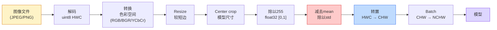
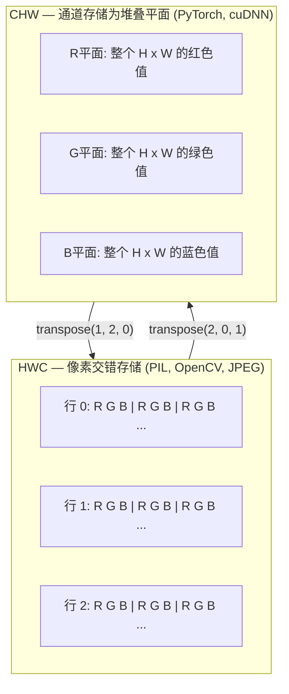

# 图像基础 — 像素、通道、色彩空间

> 图像是光样本的张量。你将使用的每一个视觉模型都始于这一事实。

**类型：** 构建
**语言：** Python
**前置条件：** 阶段1 第12课（张量操作），阶段3 第11课（PyTorch入门）
**时间：** ~45分钟

## 学习目标

- 解释连续场景如何离散化为像素，以及采样/量化决策如何决定每个下游模型的上限
- 将图像作为NumPy数组进行读取、切片和检查，并在HWC和CHW布局之间流畅切换
- 在RGB、灰度、HSV和YCbCr之间转换，并证明每种色彩空间存在的理由
- 精确按照torchvision期望的方式应用像素级预处理（normalize、standardize、resize、channel-first）

## 问题

你读到的每篇论文、你下载的每个预训练权重、你调用的每个视觉API，都假设了特定的输入编码。向期望`float32`的模型传入`uint8`图像，它仍然会运行——然后默默地产生垃圾。将BGR馈送给在RGB上训练的网络，准确率会下降十个百分点。将channels-last输入交给期望channels-first的模型，第一个conv层会把高度当成特征通道。这些都不会抛出错误。它们只会毁掉你的指标，让你花一周时间寻找一个存在于文件加载方式中的bug。

卷积并不复杂，一旦你知道它在什么上面滑动。困难在于，"图像"对相机、JPEG解码器、PIL、OpenCV、torchvision和CUDA kernel意味着不同的东西。每个栈都有自己的轴顺序、字节范围和通道约定。一个不能理清这些的视觉工程师会交付有问题的pipeline。

本课打好基础，以便本阶段的其余内容可以在此基础上构建。到本课结束时，你将知道什么是像素，为什么每个像素有三个数字而不是一个，"用ImageNet统计数据标准化"究竟做了什么，以及如何在本阶段所有其他课程假设的两三种布局之间切换。

## 概念

### 完整的预处理流程一览

每个生产级视觉系统都是相同的可逆变换序列。搞错一步，模型看到的输入就与其训练时不同。


```mermaid
flowchart LR
    A["图像文件<br/>(JPEG/PNG)"] --> B["解码<br/>uint8 HWC"]
    B --> C["转换<br/>色彩空间<br/>(RGB/BGR/YCbCr)"]
    C --> D["Resize<br/>较短边"]
    D --> E["Center crop<br/>模型尺寸"]
    E --> F["除以255<br/>float32 [0,1]"]
    F --> G["减去mean<br/>除以std"]
    G --> H["转置<br/>HWC → CHW"]
    H --> I["Batch<br/>CHW → NCHW"]
    I --> J["模型"]

    style A fill:#fef3c7,stroke:#d97706
    style J fill:#ddd6fe,stroke:#7c3aed
    style G fill:#fecaca,stroke:#dc2626
    style H fill:#bfdbfe,stroke:#2563eb
```

红蓝两个框是80%的静默错误所在：缺少standardization和错误的布局。

### 像素是一个样本，而不是一个方块

相机传感器统计落在微小探测器网格上的光子。每个探测器在几分之一秒内积分光线，并发出与撞击光子数成比例的电压。传感器随后将该电压离散化为整数。一个探测器成为一个像素。

```
连续场景                    传感器网格                     数字图像
（无限细节）                （H x W 探测器）               （H x W 整数）

    ~~~~~                        +--+--+--+--+--+                 210 198 180 155 120
   ~   ~   ~                     |  |  |  |  |  |                 205 195 178 152 118
  ~ 光  ~      ---->           +--+--+--+--+--+     ---->       200 190 175 150 115
   ~~~~~                         |  |  |  |  |  |                 195 185 170 148 112
                                 +--+--+--+--+--+                 188 180 165 145 108
```

此步骤发生两个选择，它们决定了所有下游任务的上限：

- **空间采样** 决定每度场景有多少个探测器。太少，边缘会变得锯齿状（aliasing）。太多，存储和计算会爆炸。
- **强度量化** 决定电压被分桶的精细程度。8位提供256级，是显示标准。10、12、16位提供更平滑的梯度，对医学成像、HDR和原始传感器pipeline很重要。

像素不是一个带有面积的有色方块。它是一个单一的测量值。当你resize或rotate时，你是在重新采样那个测量网格。

### 为什么是三个通道

一个探测器统计整个可见光谱内的光子——那就是灰度。为了获得颜色，传感器用红、绿、蓝滤光片的马赛克覆盖网格。经过demosaicing（去马赛克）后，每个空间位置有三个整数：红色滤光探测器、绿色滤光和蓝色滤光探测器附近的响应。这三个整数就是一个像素的RGB三元组。

```
内存中的一个像素：

    (R, G, B) = (210, 140, 30)   <- 红橙色

一张 H x W 的RGB图像：

    shape (H, W, 3)     存储为   H行，每行W个像素，每个像素3个值
                                     uint8时每个值在[0, 255]范围内
```

三个并非魔法。深度相机添加了一个Z通道。卫星添加了红外和紫外波段。医学扫描通常有一个通道（X光、CT）或多个通道（高光谱）。通道数是最后一个轴；conv层学习在通道间混合。

### 两种布局约定：HWC和CHW

相同的张量，两种排列方式。每个库选择一种。

```
HWC (height, width, channels)           CHW (channels, height, width)

   W ->                                    H ->
  +-----+-----+-----+                     +-----+-----+
H |R G B|R G B|R G B|                   C |R R R R R R|
| +-----+-----+-----+                   | +-----+-----+
v |R G B|R G B|R G B|                   v |G G G G G G|
  +-----+-----+-----+                     +-----+-----+
                                          |B B B B B B|
                                          +-----+-----+

   PIL, OpenCV, matplotlib,              PyTorch, 大多数深度学习
   几乎所有的磁盘图像文件               框架, cuDNN kernels
```

CHW存在的原因是convolution kernel在H和W上滑动。将通道轴放在第一位意味着每个kernel看到每个通道上一个连续的2D平面，这可以干净地向量化。磁盘格式保持HWC，因为这与传感器输出扫描线的方式匹配。

你将输入一千次的一行转换：

```
img_chw = img_hwc.transpose(2, 0, 1)      # NumPy
img_chw = img_hwc.permute(2, 0, 1)        # PyTorch tensor
```

内存布局可视化：


```mermaid
flowchart TB
    subgraph HWC["HWC — 像素交错存储 (PIL, OpenCV, JPEG)"]
        H1["行 0: R G B | R G B | R G B ..."]
        H2["行 1: R G B | R G B | R G B ..."]
        H3["行 2: R G B | R G B | R G B ..."]
    end
    subgraph CHW["CHW — 通道存储为堆叠平面 (PyTorch, cuDNN)"]
        C1["R平面: 整个 H x W 的红色值"]
        C2["G平面: 整个 H x W 的绿色值"]
        C3["B平面: 整个 H x W 的蓝色值"]
    end
    HWC -->|"transpose(2, 0, 1)"| CHW
    CHW -->|"transpose(1, 2, 0)"| HWC
```

### 字节范围和dtype

三种约定占主导地位：

| 约定 | dtype | 范围 | 你会在哪里看到 |
|------------|-------|-------|------------------|
| Raw | `uint8` | [0, 255] | 磁盘上的文件、PIL、OpenCV输出 |
| Normalized | `float32` | [0.0, 1.0] | 在 `img.astype('float32') / 255` 之后 |
| Standardized | `float32` | 大约 [-2, +2] | 减去mean并除以std之后 |

卷积网络是在standardized输入上训练的。ImageNet统计量 `mean=[0.485, 0.456, 0.406]`, `std=[0.229, 0.224, 0.225]` 是整个ImageNet训练集上三个通道的算术均值和标准差，在[0, 1]归一化像素上计算。将原始`uint8`馈送给期望standardized float的模型，是应用视觉中最常见的静默错误。

### 色彩空间及其存在理由

RGB是采集格式，但它并不总是对模型最有用的表示。

```
 RGB               HSV                       YCbCr / YUV

 R 红               H 色调 (角度 0-360)       Y 亮度 (明度)
 G 绿               S 饱和度 (0-1)            Cb 蓝色-黄色色度
 B 蓝               V 值/亮度 (0-1)            Cr 红色-绿色色度

 线性于             将颜色与亮度分开。         将亮度与颜色分开。
 传感器输出         适用于颜色阈值、            JPEG和大多数视频编解码器
                    UI滑块、简单过滤器          对色度通道压缩更狠，
                                                因为人眼对色度细节
                                                不如对Y敏感。
```

对于大多数现代CNN，你输入RGB。你在以下情况会遇到其他空间：

- **HSV** — 经典CV代码、基于颜色的分割、白平衡。
- **YCbCr** — 读取JPEG内部结构、视频pipeline、仅对Y操作的超分辨率模型。
- **灰度** — OCR、文档模型、任何颜色是干扰变量而非信号的情况。

从RGB到灰度是加权和，而不是平均值，因为人眼对绿色比对红色或蓝色更敏感：

```
Y = 0.299 R + 0.587 G + 0.114 B       (ITU-R BT.601，经典权重)
```

### 宽高比、resize和插值

每个模型都有一个固定的输入尺寸（大多数ImageNet分类器为224x224，现代检测器为384x384或512x512）。你的图像很少匹配。三个重要的resize选择：

- **Resize较短边，然后center crop** — 标准的ImageNet方案。保持宽高比，丢弃一条边缘像素。
- **Resize并填充** — 保持宽高比和每个像素，添加黑边。检测和OCR的标准做法。
- **直接resize到目标尺寸** — 拉伸图像。便宜，扭曲几何形状，对许多分类任务可以接受。

插值方法决定当新网格与旧网格不对齐时如何计算中间像素：

```
Nearest neighbour     最快，块状，掩码/标签的唯一选择
Bilinear              快速，平滑，大多数图像resize的默认选择
Bicubic               较慢，放大时更锐利
Lanczos               最慢，质量最好，用于最终显示
```

经验法则：训练用bilinear，你要看的素材用bicubic或lanczos，包含整数类ID的任何内容用nearest。

```figure
conv-output-size
```

## 构建

### 第1步：加载图像并检查其shape

使用Pillow加载任意JPEG或PNG，转换为NumPy，并打印你得到的内容。为了一个可离线运行的确定性示例，合成一个。

```python
import numpy as np
from PIL import Image

def synthetic_rgb(h=128, w=192, seed=0):
    rng = np.random.default_rng(seed)
    yy, xx = np.meshgrid(np.linspace(0, 1, h), np.linspace(0, 1, w), indexing="ij")
    r = (np.sin(xx * 6) * 0.5 + 0.5) * 255
    g = yy * 255
    b = (1 - yy) * xx * 255
    rgb = np.stack([r, g, b], axis=-1) + rng.normal(0, 6, (h, w, 3))
    return np.clip(rgb, 0, 255).astype(np.uint8)

arr = synthetic_rgb()
# 或从磁盘加载：
# arr = np.asarray(Image.open("your_image.jpg").convert("RGB"))

print(f"type:   {type(arr).__name__}")
print(f"dtype:  {arr.dtype}")
print(f"shape:  {arr.shape}     # (H, W, C)")
print(f"min:    {arr.min()}")
print(f"max:    {arr.max()}")
print(f"pixel at (0, 0): {arr[0, 0]}")
```

期望输出：`shape: (H, W, 3)`, `dtype: uint8`, 范围 `[0, 255]`。无论字节来自相机、JPEG解码器还是合成生成器，这都是标准的磁盘表示。

### 第2步：分离通道并重新排列布局

分别取出R、G、B，然后从HWC转换为CHW以用于PyTorch。

```python
R = arr[:, :, 0]
G = arr[:, :, 1]
B = arr[:, :, 2]
print(f"R shape: {R.shape}, mean: {R.mean():.1f}")
print(f"G shape: {G.shape}, mean: {G.mean():.1f}")
print(f"B shape: {B.shape}, mean: {B.mean():.1f}")

arr_chw = arr.transpose(2, 0, 1)
print(f"\nHWC shape: {arr.shape}")
print(f"CHW shape: {arr_chw.shape}")
```

三个灰度平面，每个通道一个。CHW只是重新排列了轴；当内存布局允许时，严格来说不需要数据拷贝。

### 第3步：灰度和HSV转换

加权和灰度，然后手动RGB到HSV。

```python
def rgb_to_grayscale(rgb):
    weights = np.array([0.299, 0.587, 0.114], dtype=np.float32)
    return (rgb.astype(np.float32) @ weights).astype(np.uint8)

def rgb_to_hsv(rgb):
    rgb_f = rgb.astype(np.float32) / 255.0
    r, g, b = rgb_f[..., 0], rgb_f[..., 1], rgb_f[..., 2]
    cmax = np.max(rgb_f, axis=-1)
    cmin = np.min(rgb_f, axis=-1)
    delta = cmax - cmin

    h = np.zeros_like(cmax)
    mask = delta > 0
    rmax = mask & (cmax == r)
    gmax = mask & (cmax == g)
    bmax = mask & (cmax == b)
    h[rmax] = ((g[rmax] - b[rmax]) / delta[rmax]) % 6
    h[gmax] = ((b[gmax] - r[gmax]) / delta[gmax]) + 2
    h[bmax] = ((r[bmax] - g[bmax]) / delta[bmax]) + 4
    h = h * 60.0

    s = np.where(cmax > 0, delta / cmax, 0)
    v = cmax
    return np.stack([h, s, v], axis=-1)

gray = rgb_to_grayscale(arr)
hsv = rgb_to_hsv(arr)
print(f"gray shape: {gray.shape}, range: [{gray.min()}, {gray.max()}]")
print(f"hsv   shape: {hsv.shape}")
print(f"hue range: [{hsv[..., 0].min():.1f}, {hsv[..., 0].max():.1f}] degrees")
print(f"sat range: [{hsv[..., 1].min():.2f}, {hsv[..., 1].max():.2f}]")
print(f"val range: [{hsv[..., 2].min():.2f}, {hsv[..., 2].max():.2f}]")
```

Hue以度为单位输出，saturation和value在[0, 1]范围内。这与OpenCV的`hsv_full`约定一致。

### 第4步：Normalize、standardize并逆转

从原始字节到预训练ImageNet模型期望的精确张量，然后再返回。

```python
mean = np.array([0.485, 0.456, 0.406], dtype=np.float32)
std = np.array([0.229, 0.224, 0.225], dtype=np.float32)

def preprocess_imagenet(rgb_uint8):
    x = rgb_uint8.astype(np.float32) / 255.0
    x = (x - mean) / std
    x = x.transpose(2, 0, 1)
    return x

def deprocess_imagenet(chw_float32):
    x = chw_float32.transpose(1, 2, 0)
    x = x * std + mean
    x = np.clip(x * 255.0, 0, 255).astype(np.uint8)
    return x

x = preprocess_imagenet(arr)
print(f"preprocessed shape: {x.shape}     # (C, H, W)")
print(f"preprocessed dtype: {x.dtype}")
print(f"preprocessed mean per channel:  {x.mean(axis=(1, 2)).round(3)}")
print(f"preprocessed std  per channel:  {x.std(axis=(1, 2)).round(3)}")

roundtrip = deprocess_imagenet(x)
max_diff = np.abs(roundtrip.astype(int) - arr.astype(int)).max()
print(f"roundtrip max pixel diff: {max_diff}    # should be 0 or 1")
```

每个通道的mean应接近零，std接近1。preprocess/deprocess对正是每个torchvision `transforms.Normalize` 调用在幕后所做的事情。

### 第5步：使用三种插值方法resize

在放大尺度上比较nearest、bilinear和bicubic，使差异可见。

```python
target = (arr.shape[0] * 3, arr.shape[1] * 3)

nearest = np.asarray(Image.fromarray(arr).resize(target[::-1], Image.NEAREST))
bilinear = np.asarray(Image.fromarray(arr).resize(target[::-1], Image.BILINEAR))
bicubic = np.asarray(Image.fromarray(arr).resize(target[::-1], Image.BICUBIC))

def local_roughness(x):
    gy = np.diff(x.astype(float), axis=0)
    gx = np.diff(x.astype(float), axis=1)
    return float(np.abs(gy).mean() + np.abs(gx).mean())

for name, out in [("nearest", nearest), ("bilinear", bilinear), ("bicubic", bicubic)]:
    print(f"{name:>8}  shape={out.shape}  roughness={local_roughness(out):6.2f}")
```

Nearest的roughness最高，因为它保持硬边缘。Bilinear最平滑。Bicubic居于两者之间，保留了感知上的锐度而没有阶梯状伪影。

## 使用

`torchvision.transforms` 将上述所有内容打包成一个可组合的pipeline。下面的代码精确复现了 `preprocess_imagenet` 的功能，外加resize和crop。

```python
import torch
from torchvision import transforms
from PIL import Image

img = Image.fromarray(synthetic_rgb(256, 256))

pipeline = transforms.Compose([
    transforms.Resize(256),
    transforms.CenterCrop(224),
    transforms.ToTensor(),
    transforms.Normalize(mean=[0.485, 0.456, 0.406], std=[0.229, 0.224, 0.225]),
])

x = pipeline(img)
print(f"tensor type:  {type(x).__name__}")
print(f"tensor dtype: {x.dtype}")
print(f"tensor shape: {tuple(x.shape)}      # (C, H, W)")
print(f"per-channel mean: {x.mean(dim=(1, 2)).tolist()}")
print(f"per-channel std:  {x.std(dim=(1, 2)).tolist()}")

batch = x.unsqueeze(0)
print(f"\nbatched shape: {tuple(batch.shape)}   # (N, C, H, W) — 准备好送入模型")
```

四个步骤，按此确切顺序：`Resize(256)` 将较短边缩放到256；`CenterCrop(224)` 从中间截取224x224的块；`ToTensor()` 除以255并将HWC转换为CHW；`Normalize` 减去ImageNet mean并除以std。颠倒此顺序会静默地改变模型接收到的内容。

## 交付物

本课产出：

- `outputs/prompt-vision-preprocessing-audit.md` — 一个prompt，将任何model card或dataset card转化为团队必须遵守的精确预处理不变量清单。
- `outputs/skill-image-tensor-inspector.md` — 一个技能，给定任何图像形状的张量或数组，报告其dtype、layout、range，以及它看起来是raw、normalized还是standardized。

## 练习

1. **(简单)** 使用OpenCV（`cv2.imread`）和Pillow加载一张JPEG。打印两者的shape和`(0, 0)`处的像素。解释通道顺序的差异，然后编写一行转换，使OpenCV数组与Pillow数组完全相同。
2. **(中等)** 编写`standardize(img, mean, std)`及其逆变换，它们一起在任何uint8图像上通过`roundtrip_max_diff <= 1`测试。你的函数必须使用相同的调用在HWC格式的单张图像和NCHW格式的batch上都能工作。
3. **(困难)** 取一个3通道ImageNet-standardized张量，通过一个学习RGB到单个灰度通道加权混合的1x1 conv。将权重初始化为`[0.299, 0.587, 0.114]`，冻结它们，并验证输出与你手动的`rgb_to_grayscale`在浮点误差范围内一致。还有哪些经典的色彩空间变换可以写成1x1卷积？

## 关键术语

| 术语 | 人们的说法 | 实际含义 |
|------|----------------|----------------------|
| Pixel | "一个有颜色的方块" | 一个网格位置上的一个光强度样本 — 彩色三个数字，灰度一个数字 |
| Channel | "颜色" | 堆叠到图像张量中的并行空间网格之一；HWC中为最后一个轴，CHW中为第一个轴 |
| HWC / CHW | "形状" | 图像张量的轴顺序；磁盘和PIL使用HWC，PyTorch和cuDNN使用CHW |
| Normalize | "缩放图像" | 除以255，使像素处于[0, 1]范围 — 必要但不充分 |
| Standardize | "零中心化" | 每通道减去mean并除以std，使输入分布与模型训练时的分布匹配 |
| 灰度转换 | "对通道取平均" | 使用系数0.299/0.587/0.114的加权和，与人眼亮度感知相匹配 |
| Interpolation | "resize如何选取像素" | 当新网格与旧网格不对齐时决定输出值的规则 — labels用nearest，训练用bilinear，显示用bicubic |
| Aspect ratio | "宽除以高" | 区分"resize并填充"和"resize并拉伸"的比例 |

## 延伸阅读

- [Charles Poynton — A Guided Tour of Color Space](https://poynton.ca/PDFs/Guided_tour.pdf) — 关于为什么有这么多色彩空间以及每种何时重要的最清晰的技术论述
- [PyTorch Vision Transforms Docs](https://pytorch.org/vision/stable/transforms.html) — 你在生产中实际会组合使用的完整transforms pipeline
- [How JPEG Works (Colt McAnlis)](https://www.youtube.com/watch?v=F1kYBnY6mwg) — 关于色度子采样、DCT以及为什么JPEG编码YCbCr而非RGB的精彩视觉之旅
- [ImageNet Preprocessing Conventions (torchvision models)](https://pytorch.org/vision/stable/models.html) — `mean=[0.485, 0.456, 0.406]`的真相来源，以及为什么模型动物园中的每个模型都期望它
