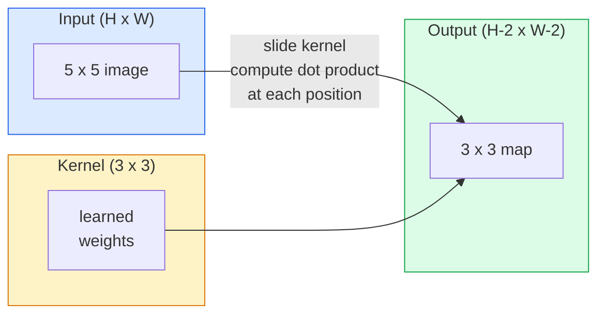
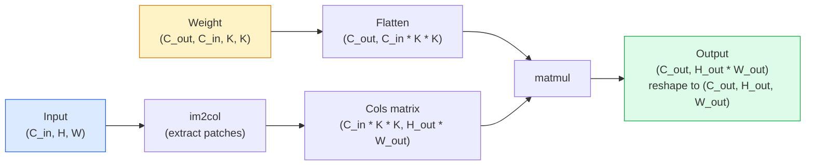

# 畳み込みをゼロから実装する

> 畳み込みは、画像上をスライドさせる小さな dense layer です。すべての位置で同じ重みを共有します。

**種類:** Build
**言語:** Python
**前提条件:** Phase 3（Deep Learning Core）、Phase 4 Lesson 01（Image Fundamentals）
**所要時間:** 約75分

## 学習目標

- NumPy だけを使って、ネストしたループ版とベクトル化された `im2col` 版を含む 2D 畳み込みをゼロから実装する
- 入力サイズ、カーネルサイズ、パディング、ストライドの任意の組み合わせについて出力の空間サイズを計算し、`(H - K + 2P) / S + 1` の式を説明する
- カーネル（edge、blur、sharpen、Sobel）を手で設計し、それぞれがなぜその活性化パターンを生むのか説明する
- 畳み込みを積み重ねて特徴抽出器を作り、スタックの深さと受容野の大きさを結び付ける

## 問題

224x224 の RGB 画像に fully connected layer を適用すると、ニューロン 1 個あたり 224 * 224 * 3 = 150,528 個の入力重みが必要になります。1,000 ユニットの単一 hidden layer だけで、何か有用なことを学ぶ前から 1 億 5,000 万パラメータです。さらに悪いことに、そのレイヤーには左上の犬と右下の犬が同じパターンだという概念がありません。すべてのピクセル位置を独立に扱いますが、これは画像に対してはまさに間違っています。猫を 3 ピクセル平行移動しただけで、ネットワークがその概念を学び直す必要があってはいけません。

画像モデルに必要な 2 つの性質は、**平行移動同変性**（入力が移動すると出力も移動する）と **パラメータ共有**（同じ特徴検出器をどこでも使う）です。Dense layer はそのどちらも与えません。畳み込みはその両方を自然に与えます。

畳み込みは deep learning のために発明されたものではありません。JPEG 圧縮、Photoshop の Gaussian blur、産業用ビジョンのエッジ検出、そしてあらゆる音声フィルタを支えてきた同じ操作です。CNN が 2012 年から 2020 年まで ImageNet を支配した理由は、畳み込みが、近くの値が関係し、同じパターンがどこにでも現れうるデータに対する正しい事前知識だからです。

## 概念

### 1 つのカーネルをスライドさせる

2D 畳み込みは、カーネル（またはフィルタ）と呼ばれる小さな重み行列を入力上でスライドさせ、各位置で要素ごとの積の和を計算します。その和が 1 つの出力ピクセルになります。



5x5 入力に対する具体的な 3x3 の例（パディングなし、ストライド 1）です。

```
Input X (5 x 5):                Kernel W (3 x 3):

  1  2  0  1  2                   1  0 -1
  0  1  3  1  0                   2  0 -2
  2  1  0  2  1                   1  0 -1
  1  0  2  1  3
  2  1  1  0  1

The kernel slides across every valid 3 x 3 window. Output Y is 3 x 3:

 Y[0,0] = sum( W * X[0:3, 0:3] )
 Y[0,1] = sum( W * X[0:3, 1:4] )
 Y[0,2] = sum( W * X[0:3, 2:5] )
 Y[1,0] = sum( W * X[1:4, 0:3] )
 ... and so on
```

この 1 つの式、つまり **重み共有、局所性、スライディングウィンドウ** が考え方のすべてです。それ以外は帳尻合わせです。

### 出力サイズの式

入力の空間サイズを `H`、カーネルサイズを `K`、パディングを `P`、ストライドを `S` とすると、次のようになります。

```
H_out = floor( (H - K + 2P) / S ) + 1
```

これは覚えてください。アーキテクチャごとに何十回も計算することになります。

| シナリオ | H | K | P | S | H_out |
|----------|---|---|---|---|-------|
| Valid conv、パディングなし | 32 | 3 | 0 | 1 | 30 |
| Same conv（サイズを保つ） | 32 | 3 | 1 | 1 | 32 |
| 2 分の 1 にダウンサンプリング | 32 | 3 | 1 | 2 | 16 |
| 2x2 pool | 32 | 2 | 0 | 2 | 16 |
| 大きな受容野 | 32 | 7 | 3 | 2 | 16 |

"Same padding" は、`S == 1` のときに `H_out == H` になるように `P` を選ぶことです。奇数の `K` では `P = (K - 1) / 2` です。3x3 カーネルが主流なのはこのためです。中心を持つ最小の奇数カーネルだからです。

### パディング

パディングなしでは、畳み込みのたびに feature map が小さくなります。20 個積み重ねると 224x224 の画像は 184x184 になり、境界の計算を無駄にし、形状一致が必要な residual connection も複雑になります。

```
Zero padding (P = 1) on a 5 x 5 input:

  0  0  0  0  0  0  0
  0  1  2  0  1  2  0
  0  0  1  3  1  0  0
  0  2  1  0  2  1  0       Now the kernel can centre on pixel
  0  1  0  2  1  3  0       (0, 0) and still have three rows and
  0  2  1  1  0  1  0       three columns of values to multiply.
  0  0  0  0  0  0  0
```

実務で出会うモードには、`zero`（最も一般的）、`reflect`（端を鏡映し、生成モデルで硬い境界を避ける）、`replicate`（端をコピーする）、`circular`（巻き戻す。トーラス状の問題で使う）があります。

### ストライド

ストライドはスライドのステップサイズです。`stride=1` がデフォルトです。`stride=2` は空間次元を半分にし、別の pooling layer を使わずに CNN 内でダウンサンプリングする古典的な方法です。現代的なアーキテクチャ（ResNet、ConvNeXt、MobileNet）はどれも、どこかで max-pool の代わりに strided conv を使っています。

```
Stride 1 on a 5 x 5 input, 3 x 3 kernel:

  starts: (0,0) (0,1) (0,2)        -> output row 0
          (1,0) (1,1) (1,2)        -> output row 1
          (2,0) (2,1) (2,2)        -> output row 2

  Output: 3 x 3

Stride 2 on the same input:

  starts: (0,0) (0,2)              -> output row 0
          (2,0) (2,2)              -> output row 1

  Output: 2 x 2
```

### 複数の入力チャンネル

実際の画像には 3 つのチャンネルがあります。RGB 入力に対する 3x3 畳み込みは、実際には 3x3x3 の volume です。入力チャンネルごとに 1 枚の 3x3 slice があります。各空間位置で、3 つの slice すべてにわたって掛け算して合計し、bias を足します。

```
Input:   (C_in,  H,  W)        3 x 5 x 5
Kernel:  (C_in,  K,  K)        3 x 3 x 3 (one kernel)
Output:  (1,     H', W')       2D map

For a layer that produces C_out output channels, you stack C_out kernels:

Weight:  (C_out, C_in, K, K)   e.g. 64 x 3 x 3 x 3
Output:  (C_out, H', W')       64 x 3 x 3

Parameter count: C_out * C_in * K * K + C_out   (the + C_out is biases)
```

最後の行は、モデルを設計するときに計算するものです。3 チャンネル入力に 64 チャンネルの 3x3 conv をかけると、パラメータ数は `64 * 3 * 3 * 3 + 64 = 1,792` です。安いものです。

### im2col のトリック

ネストしたループは読みやすいものの遅いです。GPU が欲しいのは大きな行列積です。トリックは、入力の各 receptive-field window を大きな行列の 1 列に flatten し、カーネルを 1 行に flatten することです。すると畳み込み全体が 1 回の matmul になります。



本番用の conv 実装は、これに cache tiling の工夫を足した何らかの変種です（direct conv、Winograd、大きなカーネル向けの FFT conv）。im2col を理解すれば、中心部分は理解できたことになります。

### 受容野

単一の 3x3 conv は 9 個の入力ピクセルを見ます。3x3 conv を 2 つ積むと、2 番目の層のニューロンは 5x5 の入力ピクセルを見ます。3 つの 3x3 conv では 7x7 です。一般に次のようになります。

```
RF after L stacked K x K convs (stride 1) = 1 + L * (K - 1)

With strides:   RF grows multiplicatively with stride along each layer.
```

"3x3 を最後まで積む" 設計（VGG、ResNet、ConvNeXt）がうまくいく根本理由は、2 つの 3x3 conv が 1 つの 5x5 conv と同じ入力範囲を見ながら、パラメータ数を減らし、その間に追加の非線形性を入れられるからです。

## 作る

### ステップ 1: 配列をパディングする

最小の primitive から始めます。H x W 配列の周囲をゼロで埋める関数です。

```python
import numpy as np

def pad2d(x, p):
    if p == 0:
        return x
    h, w = x.shape[-2:]
    out = np.zeros(x.shape[:-2] + (h + 2 * p, w + 2 * p), dtype=x.dtype)
    out[..., p:p + h, p:p + w] = x
    return out

x = np.arange(9).reshape(3, 3)
print(x)
print()
print(pad2d(x, 1))
```

末尾軸のトリック `x.shape[:-2]` により、同じ関数が `(H, W)`、`(C, H, W)`、`(N, C, H, W)` のどれにも変更なしで使えます。

### ステップ 2: ネストしたループによる 2D 畳み込み

参照実装です。遅いですが曖昧さはありません。原理的には `torch.nn.functional.conv2d` が行っていることです。

```python
def conv2d_naive(x, w, b=None, stride=1, padding=0):
    c_in, h, w_in = x.shape
    c_out, c_in_w, kh, kw = w.shape
    assert c_in == c_in_w

    x_pad = pad2d(x, padding)
    h_out = (h + 2 * padding - kh) // stride + 1
    w_out = (w_in + 2 * padding - kw) // stride + 1

    out = np.zeros((c_out, h_out, w_out), dtype=np.float32)
    for oc in range(c_out):
        for i in range(h_out):
            for j in range(w_out):
                hs = i * stride
                ws = j * stride
                patch = x_pad[:, hs:hs + kh, ws:ws + kw]
                out[oc, i, j] = np.sum(patch * w[oc])
        if b is not None:
            out[oc] += b[oc]
    return out
```

4 重のネストしたループ（出力チャンネル、行、列、そして `C_in`、`kh`、`kw` にわたる暗黙の和）です。これは、より速い実装すべてを照合する基準になります。

### ステップ 3: 手設計のカーネルで検証する

縦方向の Sobel カーネルを作り、合成した step image に適用して、縦エッジが明るくなる様子を確認します。

```python
def synthetic_step_image():
    img = np.zeros((1, 16, 16), dtype=np.float32)
    img[:, :, 8:] = 1.0
    return img

sobel_x = np.array([
    [[-1, 0, 1],
     [-2, 0, 2],
     [-1, 0, 1]]
], dtype=np.float32)[None]

x = synthetic_step_image()
y = conv2d_naive(x, sobel_x, padding=1)
print(y[0].round(1))
```

列 7（左から右への明るさの増加）に大きな正の値が出て、それ以外はゼロになるはずです。この 1 回の print が、数学が正しいことを確認する sanity check です。

### ステップ 4: im2col

入力内のカーネルサイズの各 window を、行列の 1 列に変換します。`C_in=3, K=3` では、各列は 27 個の数値になります。

```python
def im2col(x, kh, kw, stride=1, padding=0):
    c_in, h, w = x.shape
    x_pad = pad2d(x, padding)
    h_out = (h + 2 * padding - kh) // stride + 1
    w_out = (w + 2 * padding - kw) // stride + 1

    cols = np.zeros((c_in * kh * kw, h_out * w_out), dtype=x.dtype)
    col = 0
    for i in range(h_out):
        for j in range(w_out):
            hs = i * stride
            ws = j * stride
            patch = x_pad[:, hs:hs + kh, ws:ws + kw]
            cols[:, col] = patch.reshape(-1)
            col += 1
    return cols, h_out, w_out
```

まだ Python loop ですが、重い処理はこのあと 1 回のベクトル化された matmul になります。

### ステップ 5: im2col + matmul による高速 conv

4 重ループを 1 回の行列積に置き換えます。

```python
def conv2d_im2col(x, w, b=None, stride=1, padding=0):
    c_out, c_in, kh, kw = w.shape
    cols, h_out, w_out = im2col(x, kh, kw, stride, padding)
    w_flat = w.reshape(c_out, -1)
    out = w_flat @ cols
    if b is not None:
        out += b[:, None]
    return out.reshape(c_out, h_out, w_out)
```

正しさの確認として、両方の実装を実行して比較します。

```python
rng = np.random.default_rng(0)
x = rng.normal(0, 1, (3, 16, 16)).astype(np.float32)
w = rng.normal(0, 1, (8, 3, 3, 3)).astype(np.float32)
b = rng.normal(0, 1, (8,)).astype(np.float32)

y_naive = conv2d_naive(x, w, b, padding=1)
y_im2col = conv2d_im2col(x, w, b, padding=1)

print(f"max abs diff: {np.max(np.abs(y_naive - y_im2col)):.2e}")
```

`max abs diff` はおよそ `1e-5` になるはずです。差は floating-point の累積順序によるもので、バグではありません。

### ステップ 6: 手設計カーネルのバンク

学習前でも単一の conv layer が表現できるものを示す 5 つのフィルタです。

```python
KERNELS = {
    "identity": np.array([[0, 0, 0], [0, 1, 0], [0, 0, 0]], dtype=np.float32),
    "blur_3x3": np.ones((3, 3), dtype=np.float32) / 9.0,
    "sharpen": np.array([[0, -1, 0], [-1, 5, -1], [0, -1, 0]], dtype=np.float32),
    "sobel_x": np.array([[-1, 0, 1], [-2, 0, 2], [-1, 0, 1]], dtype=np.float32),
    "sobel_y": np.array([[-1, -2, -1], [0, 0, 0], [1, 2, 1]], dtype=np.float32),
}

def apply_kernel(img2d, kernel):
    x = img2d[None].astype(np.float32)
    w = kernel[None, None]
    return conv2d_im2col(x, w, padding=1)[0]
```

任意の grayscale image に適用すると、blur は柔らかくし、sharpen はエッジをくっきりさせ、Sobel-x は縦エッジを、Sobel-y は横エッジを明るくします。これらは AlexNet や VGG の *最初の* 学習済み conv layer が最終的に学んだパターンそのものです。後続のタスクが何であれ、優れた画像モデルにはエッジ検出器と blob 検出器が必要だからです。

## 使う

PyTorch の `nn.Conv2d` は、同じ操作を autograd、CUDA kernels、cuDNN optimisation と一緒に包みます。形状の意味論は同じです。

```python
import torch
import torch.nn as nn

conv = nn.Conv2d(in_channels=3, out_channels=64, kernel_size=3, stride=1, padding=1)
print(conv)
print(f"weight shape: {tuple(conv.weight.shape)}   # (C_out, C_in, K, K)")
print(f"bias shape:   {tuple(conv.bias.shape)}")
print(f"param count:  {sum(p.numel() for p in conv.parameters())}")

x = torch.randn(8, 3, 224, 224)
y = conv(x)
print(f"\ninput  shape: {tuple(x.shape)}")
print(f"output shape: {tuple(y.shape)}")
```

`padding=1` を `padding=0` に変えると、出力は 222x222 に落ちます。`stride=1` を `stride=2` に変えると、112x112 に落ちます。上で覚えたものと同じ式です。

## 出荷する

このレッスンが生み出すものは次のとおりです。

- `outputs/prompt-cnn-architect.md`：入力サイズ、パラメータ予算、目標受容野を与えると、各ステップで正しい K/S/P を持つ `Conv2d` layers の stack を設計するプロンプト。
- `outputs/skill-conv-shape-calculator.md`：network spec を layer ごとにたどり、各 block の出力形状、受容野、パラメータ数を返す skill。

## 演習

1. **（易）** 128x128 の grayscale input と `[Conv3x3(s=1,p=1), Conv3x3(s=2,p=1), Conv3x3(s=1,p=1), Conv3x3(s=2,p=1)]` の stack があるとします。各 layer の出力空間サイズと受容野を手で計算してください。dummy conv の PyTorch `nn.Sequential` で検証してください。
2. **（中）** `conv2d_naive` と `conv2d_im2col` を拡張し、`groups` 引数を受け取れるようにしてください。`groups=C_in=C_out` が depthwise convolution を再現し、そのパラメータ数が `C * C * K * K` ではなく `C * K * K` になることを示してください。
3. **（難）** `conv2d_im2col` の backward pass を手で実装してください。出力の gradient が与えられたとき、`x` と `w` の gradient を計算します。同じ入力と重みで `torch.autograd.grad` と照合してください。トリックは、im2col の gradient が `col2im` であり、重なり合う window を累積しなければならないことです。

## 重要用語

| 用語 | よく言われること | 実際の意味 |
|------|----------------|------------|
| 畳み込み (Convolution) | "フィルタをスライドさせる" | 共有重みを使って、各空間位置に適用される学習可能な dot product。数学的には cross-correlation だが、誰もが convolution と呼ぶ |
| カーネル / フィルタ (Kernel / filter) | "特徴検出器" | 形状 (C_in, K, K) の小さな weight tensor。入力 window との dot product により 1 つの出力ピクセルを作る |
| ストライド (Stride) | "どれだけ飛ぶか" | 連続するカーネル配置の間の step size。stride 2 は各空間次元を半分にする |
| パディング (Padding) | "端のゼロ" | カーネルが border pixel を中心に置けるように、入力の周囲に追加する値。`same` padding は出力サイズを入力サイズと等しく保つ |
| 受容野 (Receptive field) | "ニューロンがどれだけ見ているか" | ある出力 activation が依存する元入力の patch。深さと stride によって広がる |
| im2col | "GEMM のトリック" | すべての receptive window を列へ並べ替え、畳み込みを大きな行列積にすること。高速 conv kernel の中核 |
| Depthwise conv | "チャンネルごとに 1 つのカーネル" | `groups == C_in` の conv。各出力チャンネルを対応する入力チャンネルだけから計算する。MobileNet と ConvNeXt の backbone |
| 平行移動同変性 (Translation equivariance) | "入力をずらすと出力もずれる" | 入力を k ピクセルずらすと出力も k ピクセルずれる性質。共有重みによって自然に得られる |

## 追加資料

- [A guide to convolution arithmetic for deep learning (Dumoulin & Visin, 2016)](https://arxiv.org/abs/1603.07285)：padding、stride、dilation の決定版の図解。多くの講義が密かに参照している資料です。
- [CS231n: Convolutional Neural Networks for Visual Recognition](https://cs231n.github.io/convolutional-networks/)：元祖 im2col の説明を含む定番の講義ノート。
- [The Annotated ConvNet (fast.ai)](https://nbviewer.org/github/fastai/fastbook/blob/master/13_convolutions.ipynb)：手動畳み込みから学習済み digit classifier まで進む notebook。
- [Receptive Field Arithmetic for CNNs (Dang Ha The Hien)](https://distill.pub/2019/computing-receptive-fields/)：受容野計算についての論文品質の interactive explainer。
