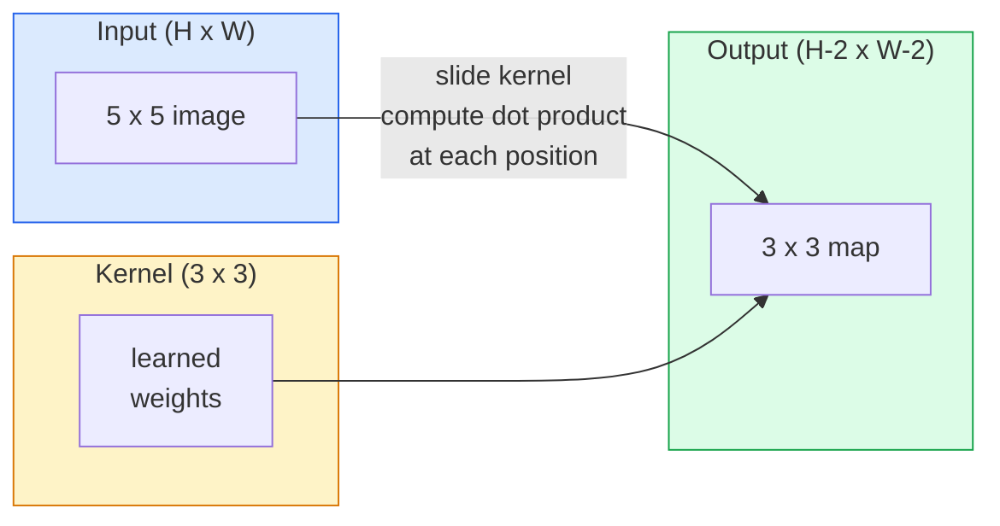
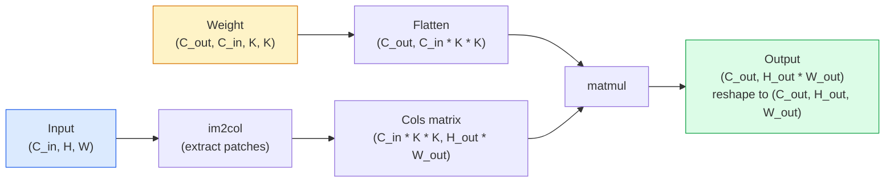

# Sıfırdan Evrişimler

> Evrişim, bir görüntü üzerinde kaydırdığınız, her konumda aynı ağırlıkları paylaşan küçük, yoğun bir katmandır.

**Tür:** Yapım
**Diller:** Python
**Önkoşullar:** Aşama 3 (Deep Learning Temel), Aşama 4 Ders 01 (Görüntünün Temelleri)
**Süre:** ~75 dakika

## Öğrenme Hedefleri

- İç içe döngü sürümü ve vektörleştirilmiş `im2col` sürümü de dahil olmak üzere yalnızca NumPy kullanarak sıfırdan 2B evrişimi uygulayın
- Herhangi bir giriş boyutu, çekirdek boyutu, dolgu ve adım kombinasyonu için çıktı uzamsal boyutunu hesaplayın ve `(H - K + 2P) / S + 1` formülünü doğrulayın
- Çekirdekleri elle tasarlayın (kenar, bulanıklaştırma, keskinleştirme, Sobel) ve her birinin neden kendi yaptığı aktivasyon modelini ürettiğini açıklayın
- Evrişimleri bir özellik çıkarıcıya yığının ve yığının derinliğini alıcı alanın boyutuna bağlayın

## Sorun

224x224 RGB görüntüdeki tamamen bağlı bir katmanın, nöron başına 224 * 224 * 3 = 150.528 giriş ağırlığına ihtiyacı olacaktır. 1.000 birimlik tek bir gizli katman, siz daha yararlı bir şey öğrenmeden önce zaten 150 milyon parametreye karşılık gelir. Daha da kötüsü, bu katmanın sol üstteki köpek ile sağ alttaki köpeğin aynı kalıp olduğuna dair hiçbir fikri yok. Her piksel konumunu bağımsız olarak ele alır; bu da görüntüler için kesinlikle yanlıştır: Bir kediyi üç piksele çevirmek, ağı kavramı yeniden öğrenmeye zorlamamalıdır.

Bir görüntü modelinin ihtiyaç duyduğu iki özellik **çeviri eşitliği** (giriş değiştiğinde çıktı da değişir) ve **parametre paylaşımı**'dır (aynı özellik algılayıcı her yerde çalışır). Yoğun katmanlar size ikisini de vermez. Evrişim size her ikisini de ücretsiz olarak verir.

Evrişim deep learning için icat edilmedi. JPEG sıkıştırmayı, Photoshop'ta Gauss bulanıklığını, endüstriyel görüşte kenar algılamayı ve şimdiye kadar gönderilen tüm ses filtrelerini çalıştıran işlemin aynısıdır. CNN'lerin 2012'den 2020'ye kadar ImageNet'e hakim olmasının nedeni, yakın değerlerin ilişkili olduğu ve aynı modelin her yerde görünebileceği veriler için evrişimin doğru öncelik olmasıdır.

## Konsept

### Tek çekirdek, kayan

2 boyutlu bir evrişim, çekirdek (veya filtre) adı verilen küçük bir ağırlık matrisini alır, onu giriş boyunca kaydırır ve her konumda öğe bazında çarpımların toplamını hesaplar. Bu toplam bir çıktı pikseli haline gelir.



5x5 girişte somut bir 3x3 örneği (dolgu yok, adım 1):

```
Input X (5 x 5):                Kernel W (3 x 3):

  1  2  0  1  2                   1  0 -1
  0  1  3  1  0                   2  0 -2
  2  1  0  2  1                   1  0 -1
  1  0  2  1  3
  2  1  1  0  1

The kernel slides across every valid 3 x 3 window. Output Y is 3 x 3:

 Y[0,0] = sum( W * X[0:3, 0:3] )
 Y[0,1] = sum( W * X[0:3, 1:4] )
 Y[0,2] = sum( W * X[0:3, 2:5] )
 Y[1,0] = sum( W * X[1:4, 0:3] )
 ... and so on
```

Bu tek formül — **paylaşılan ağırlıklar, konum, kayan pencere** — fikrin tamamıdır. Geriye kalan her şey muhasebedir.

### Çıktı boyutu formülü

Girdi uzamsal boyutu `H`, çekirdek boyutu `K`, dolgu `P`, adım `S` verildiğinde:

```
H_out = floor( (H - K + 2P) / S ) + 1
```

Bunu ezberle. Bunu mimari başına onlarca kez hesaplayacaksınız.

| Senaryo | H | k | P | S | H_out |
|----------|---|---|---|---|-------|
| Geçerli dönüşüm, dolgu yok | 32 | 3 | 0 | 1 | 30 |
| Aynı dönüşüm (boyutu korur) | 32 | 3 | 1 | 1 | 32 |
| 2'ye göre alt örnek | 32 | 3 | 1 | 2 | 16 |
| Havuz 2x2 | 32 | 2 | 0 | 2 | 16 |
| Büyük alıcı alan | 32 | 7 | 3 | 2 | 16 |

"Aynı dolgu", S == 1 olduğunda H_out == H olacak şekilde P'yi seçmek anlamına gelir. Tek K için bu P = (K - 1) / 2'dir. Bu nedenle 3x3 çekirdekler baskındır - bunlar hala bir merkezi olan en küçük tek çekirdeklerdir.

### Dolgu

Dolgu olmadan her evrişim özellik haritasını küçültür. Bunlardan 20 tanesini yığınladığınızda 224x224 görüntünüz 184x184 olur; bu da sınırda bilgi israfına neden olur ve eşleşen şekillere ihtiyaç duyan kalan bağlantıları karmaşık hale getirir.

```
Zero padding (P = 1) on a 5 x 5 input:

  0  0  0  0  0  0  0
  0  1  2  0  1  2  0
  0  0  1  3  1  0  0
  0  2  1  0  2  1  0       Now the kernel can centre on pixel
  0  1  0  2  1  3  0       (0, 0) and still have three rows and
  0  2  1  1  0  1  0       three columns of values to multiply.
  0  0  0  0  0  0  0
```

Uygulamada karşılaştığınız modlar: `zero` (en yaygın), `reflect` (kenarı yansıtın, üretken modellerde sert sınırları önler), `replicate` (kenarı kopyalayın), `circular` (etrafına sarın, toroidal problemlerde kullanılır).

### Adım

Adım, slaydın adım boyutudur. `stride=1` varsayılandır. `stride=2`, uzamsal boyutları yarıya indirir ve ayrı bir havuzlama katmanı olmadan bir CNN içinde alt örnekleme yapmanın klasik yoludur; her modern mimari (ResNet, ConvNeXt, MobileNet), bir yerde maksimum havuz yerine adımlı dönüşümler kullanır.

```
Stride 1 on a 5 x 5 input, 3 x 3 kernel:

  starts: (0,0) (0,1) (0,2)        -> output row 0
          (1,0) (1,1) (1,2)        -> output row 1
          (2,0) (2,1) (2,2)        -> output row 2

  Output: 3 x 3

Stride 2 on the same input:

  starts: (0,0) (0,2)              -> output row 0
          (2,0) (2,2)              -> output row 1

  Output: 2 x 2
```

### Çoklu giriş kanalları

Gerçek görüntülerin üç kanalı vardır. Bir RGB girişindeki 3x3 evrişim aslında 3x3x3 hacimdir: giriş kanalı başına bir 3x3 dilim. Her uzamsal konumda, üç dilimin tamamını çarpar ve toplarsınız ve bir önyargı eklersiniz.

```
Input:   (C_in,  H,  W)        3 x 5 x 5
Kernel:  (C_in,  K,  K)        3 x 3 x 3 (one kernel)
Output:  (1,     H', W')       2D map

For a layer that produces C_out output channels, you stack C_out kernels:

Weight:  (C_out, C_in, K, K)   e.g. 64 x 3 x 3 x 3
Output:  (C_out, H', W')       64 x 3 x 3

Parameter count: C_out * C_in * K * K + C_out   (the + C_out is biases)
```

Bu son satır, bir model planlarken hesaplayacağınız satırdır. 3 kanallı bir girişteki 64 kanallı 3x3 dönüşümün `64 * 3 * 3 * 3 + 64 = 1,792` parametreleri vardır. Ucuz.

### im2col numarası

İç içe geçmiş döngülerin okunması kolaydır ancak yavaştır. GPU'lar büyük matris çarpımları ister. İşin püf noktası: girdinin her alıcı alan penceresini büyük bir matrisin bir sütununa düzleştirin, çekirdeği bir satıra düzleştirin ve tüm evrişim tek bir matmul haline gelir.



Her üretim dönüşümü uygulaması bunun bir çeşidi ve önbellek döşeme hileleridir (büyük çekirdekler için doğrudan dönüşüm, Winograd, FFT dönüşümü). İm2col'ü anladığınızda özü anlarsınız.

### Alıcı alan

Tek bir 3x3 dönüşüm, 9 giriş pikseline bakar. İki adet 3x3 dönüşümü yığınlayın ve ikinci katmandaki bir nöron 5x5 giriş pikseline bakar. Üç 3x3 dönüşüm 7x7 verir. Genel olarak:

```
RF after L stacked K x K convs (stride 1) = 1 + L * (K - 1)

With strides:   RF grows multiplicatively with stride along each layer.
```

"3x3'ün sonuna kadar" çalışmasının (VGG, ResNet, ConvNeXt) tüm nedeni, iki 3x3 dönüşümün bir 5x5 dönüşümle aynı giriş alanını görmesi, ancak daha az parametre ve arada ekstra doğrusal olmama durumu olmasıdır.

```figure
convolution-kernel
```

## İnşa Et

### Adım 1: Bir diziyi doldurun

En küçük ilkel ile başlayın: Y x G dizisinin etrafında sıfırlarla doldurulan bir işlev.

```python
import numpy as np

def pad2d(x, p):
    if p == 0:
        return x
    h, w = x.shape[-2:]
    out = np.zeros(x.shape[:-2] + (h + 2 * p, w + 2 * p), dtype=x.dtype)
    out[..., p:p + h, p:p + w] = x
    return out

x = np.arange(9).reshape(3, 3)
print(x)
print()
print(pad2d(x, 1))
```

Takip eden eksenler hilesi `x.shape[:-2]`, aynı işlevin `(H, W)`, `(C, H, W)` veya `(N, C, H, W)` üzerinde değişiklik yapılmadan çalışacağı anlamına gelir.

### Adım 2: İç içe döngülerle 2 boyutlu evrişim

Referans uygulaması yavaş ama nettir. `torch.nn.functional.conv2d`'nin prensipte yaptığı budur.

```python
def conv2d_naive(x, w, b=None, stride=1, padding=0):
    c_in, h, w_in = x.shape
    c_out, c_in_w, kh, kw = w.shape
    assert c_in == c_in_w

    x_pad = pad2d(x, padding)
    h_out = (h + 2 * padding - kh) // stride + 1
    w_out = (w_in + 2 * padding - kw) // stride + 1

    out = np.zeros((c_out, h_out, w_out), dtype=np.float32)
    for oc in range(c_out):
        for i in range(h_out):
            for j in range(w_out):
                hs = i * stride
                ws = j * stride
                patch = x_pad[:, hs:hs + kh, ws:ws + kw]
                out[oc, i, j] = np.sum(patch * w[oc])
        if b is not None:
            out[oc] += b[oc]
    return out
```

Dört iç içe döngü (çıkış kanalı, satır, sütun artı C_in, kh, kw üzerinden örtülü toplam). Her hızlı uygulamayı kontrol edeceğiniz temel gerçek budur.

### 3. Adım: Elle tasarlanmış bir çekirdekle doğrulama

Dikey bir Sobel çekirdeği oluşturun, bunu sentetik bir adım görüntüsüne uygulayın ve dikey kenarın yanmasını izleyin.

```python
def synthetic_step_image():
    img = np.zeros((1, 16, 16), dtype=np.float32)
    img[:, :, 8:] = 1.0
    return img

sobel_x = np.array([
    [[-1, 0, 1],
     [-2, 0, 2],
     [-1, 0, 1]]
], dtype=np.float32)[None]

x = synthetic_step_image()
y = conv2d_naive(x, sobel_x, padding=1)
print(y[0].round(1))
```

7. sütunda büyük pozitif değerler (soldan sağa parlaklık artışı) ve diğer her yerde sıfırlar olmasını bekleyin. Bu tek baskı, matematiğin doğru olup olmadığını kontrol etmenizdir.

### Adım 4: im2col

Girişteki her çekirdek boyutundaki pencereyi bir matrisin sütununa dönüştürün. `C_in=3, K=3` için her sütun 27 sayıdan oluşur.

```python
def im2col(x, kh, kw, stride=1, padding=0):
    c_in, h, w = x.shape
    x_pad = pad2d(x, padding)
    h_out = (h + 2 * padding - kh) // stride + 1
    w_out = (w + 2 * padding - kw) // stride + 1

    cols = np.zeros((c_in * kh * kw, h_out * w_out), dtype=x.dtype)
    col = 0
    for i in range(h_out):
        for j in range(w_out):
            hs = i * stride
            ws = j * stride
            patch = x_pad[:, hs:hs + kh, ws:ws + kw]
            cols[:, col] = patch.reshape(-1)
            col += 1
    return cols, h_out, w_out
```

Bu hala bir Python döngüsüdür, ancak artık ağır kaldırma tek bir vektörize matmul olacaktır.

### Adım 5: im2col + matmul aracılığıyla hızlı dönüşüm

Dörtlü döngüyü bir matris çarpımı ile değiştirin.

```python
def conv2d_im2col(x, w, b=None, stride=1, padding=0):
    c_out, c_in, kh, kw = w.shape
    cols, h_out, w_out = im2col(x, kh, kw, stride, padding)
    w_flat = w.reshape(c_out, -1)
    out = w_flat @ cols
    if b is not None:
        out += b[:, None]
    return out.reshape(c_out, h_out, w_out)
```

Doğruluk kontrolü: her iki uygulamayı da çalıştırın ve karşılaştırın.

```python
rng = np.random.default_rng(0)
x = rng.normal(0, 1, (3, 16, 16)).astype(np.float32)
w = rng.normal(0, 1, (8, 3, 3, 3)).astype(np.float32)
b = rng.normal(0, 1, (8,)).astype(np.float32)

y_naive = conv2d_naive(x, w, b, padding=1)
y_im2col = conv2d_im2col(x, w, b, padding=1)

print(f"max abs diff: {np.max(np.abs(y_naive - y_im2col)):.2e}")
```

`max abs diff`, `1e-5` civarında olmalıdır — fark, bir hata değil, kayan nokta birikim sırasıdır.

### Adım 6: Elle tasarlanmış çekirdeklerden oluşan bir banka

Herhangi bir eğitimden önce tek bir dönüşüm katmanının neyi ifade edebileceğini gösteren beş filtre.

```python
KERNELS = {
    "identity": np.array([[0, 0, 0], [0, 1, 0], [0, 0, 0]], dtype=np.float32),
    "blur_3x3": np.ones((3, 3), dtype=np.float32) / 9.0,
    "sharpen": np.array([[0, -1, 0], [-1, 5, -1], [0, -1, 0]], dtype=np.float32),
    "sobel_x": np.array([[-1, 0, 1], [-2, 0, 2], [-1, 0, 1]], dtype=np.float32),
    "sobel_y": np.array([[-1, -2, -1], [0, 0, 0], [1, 2, 1]], dtype=np.float32),
}

def apply_kernel(img2d, kernel):
    x = img2d[None].astype(np.float32)
    w = kernel[None, None]
    return conv2d_im2col(x, w, padding=1)[0]
```

Herhangi bir gri tonlamalı görüntüye uygulandığında, bulanıklığı yumuşatır, keskinleştirme kenarları keskinleştirir, Sobel-x dikey kenarları aydınlatır, Sobel-y yatay kenarları aydınlatır. Bunlar tam olarak AlexNet ve VGG'deki *ilk* eğitilmiş dönüşüm katmanının öğrendiği kalıplardır - çünkü iyi bir görüntü modeli, daha sonra hangi görev gelirse gelsin kenar ve damla dedektörlerine ihtiyaç duyar.

## Kullan onu

PyTorch'un `nn.Conv2d`'si aynı işlemi autograd, CUDA çekirdekleri ve cuDNN optimizasyonuyla tamamlar. Şekil anlambilimi aynıdır.

```python
import torch
import torch.nn as nn

conv = nn.Conv2d(in_channels=3, out_channels=64, kernel_size=3, stride=1, padding=1)
print(conv)
print(f"weight shape: {tuple(conv.weight.shape)}   # (C_out, C_in, K, K)")
print(f"bias shape:   {tuple(conv.bias.shape)}")
print(f"param count:  {sum(p.numel() for p in conv.parameters())}")

x = torch.randn(8, 3, 224, 224)
y = conv(x)
print(f"\ninput  shape: {tuple(x.shape)}")
print(f"output shape: {tuple(y.shape)}")
```

`padding=1`'yi `padding=0` ile değiştirin ve çıktı 222x222'ye düşer. `stride=1`'yi `stride=2` ile değiştirin ve 112x112'ye düşer. Yukarıda ezberlediğiniz formülün aynısı.

## Gönderin

Bu ders şunları üretir:

- `outputs/prompt-cnn-architect.md` — giriş boyutu, parametre bütçesi ve hedef alıcı alan göz önüne alındığında, her adımda doğru K/S/P ile `Conv2d` katmanlarından oluşan bir yığın tasarlayan bir prompt.
- `outputs/skill-conv-shape-calculator.md` — bir ağ spesifikasyonunu katman katman yürüten ve her blok için çıktı şeklini, alıcı alanı ve parametre sayısını döndüren bir beceri.

## Egzersizler

1. **(Kolay)** 128x128 gri tonlamalı bir giriş ve bir `[Conv3x3(s=1,p=1), Conv3x3(s=2,p=1), Conv3x3(s=1,p=1), Conv3x3(s=2,p=1)]` yığını göz önüne alındığında, çıktının uzamsal boyutunu ve her katmandaki alıcı alanı elle hesaplayın. Sahte dönüşümleri PyTorch `nn.Sequential` ile doğrulayın.
2. **(Orta)** `conv2d_naive` ve `conv2d_im2col`'yi `groups` bağımsız değişkenini kabul edecek şekilde genişletin. `groups=C_in=C_out`'nin derinlemesine bir evrişim ürettiğini ve parametre sayısının `C * C * K * K` yerine `C * K * K` olduğunu gösterin.
3. **(Zor)** `conv2d_im2col`'nin geriye geçişini elle uygulayın: çıktının gradient'si verildiğinde, `x` ve `w`'nin gradient'sini hesaplayın. Aynı giriş ve ağırlıklarda `torch.autograd.grad`'ye göre doğrulama yapın. İşin püf noktası: im2col'un gradient'si `col2im`'dir ve örtüşen pencereleri biriktirmesi gerekir.

## Anahtar Terimler

| Dönem | İnsanlar ne diyor | Aslında ne anlama geliyor |
|------|----------------|----------------------|
| Evrişim | "Filtreyi kaydırma" | Paylaşılan ağırlıklarla her mekansal konuma uygulanan öğrenilebilir bir nokta çarpım; matematiksel olarak bir çapraz korelasyon, ancak herkes buna evrişim diyor |
| Çekirdek / filtre | "Özellik algılayıcı" | Giriş penceresiyle nokta çarpımı bir çıkış pikseli üreten küçük bir ağırlık şekli (C_in, K, K) tensörü |
| Adım | "Ne kadar uzağa atlarsın" | Ardışık çekirdek yerleşimleri arasındaki adım boyutu; 2. adım her uzamsal boyutu yarıya indirir |
| Dolgu | "Kenarlarda sıfırlar" | Çekirdeğin sınır piksellerini merkezleyebilmesi için girdinin çevresine ekstra değerler eklendi; `same` dolgusu çıktı boyutunu giriş boyutuna eşit tutar |
| Alıcı alan | "Nöron ne kadar görüyor" | Belirli bir çıktı aktivasyonunun bağlı olduğu, derinlik ve adımlarla büyüyen orijinal girdi yaması |
| im2col | "GEMM numarası" | Evrişimin büyük bir matris çarpımı haline gelmesi için her alıcı pencereyi sütunlar halinde yeniden düzenlemek - her hızlı dönüşüm çekirdeğinin çekirdeği |
| Derinlemesine dönüşüm | "Kanal başına bir çekirdek" | Her çıkış kanalını yalnızca eşleşen giriş kanalından hesaplayan `groups == C_in` ile bir dönüşüm; MobileNet ve ConvNeXt'in omurgası |
| Çeviri denkliği | "Kaydırın, kaydırın" | Girişi k piksel kaydırmanın çıktıyı k piksel kaydırması özelliği; paylaşılan ağırlıklarla ücretsiz olarak geliyor |

## Daha Fazla Okuma

- [deep learning için evrişim aritmetiği kılavuzu (Dumoulin ve Visin, 2016)](https://arxiv.org/abs/1603.07285) — her kursun sessizce kopyaladığı kesin dolgu/adım/genişleme diyagramları
- [CS231n: Görsel Tanıma için Evrişimli Neural Network'ler](https://cs231n.github.io/convolutional-networks/) — orijinal im2col açıklamasını da içeren standart ders notları
- [The Annotated ConvNet (fast.ai)](https://nbviewer.org/github/fastai/fastbook/blob/master/13_convolutions.ipynb) — manuel evrişimden eğitimli rakam sınıflandırıcıya geçiş yapan bir dizüstü bilgisayar
- [CNN'ler için Alıcı Alan Aritmetiği (Dang Ha The Hien)](https://distill.pub/2019/computing-receptive-fields/) — alıcı alan hesaplamalarının kağıt kalitesinde etkileşimli açıklayıcısı
