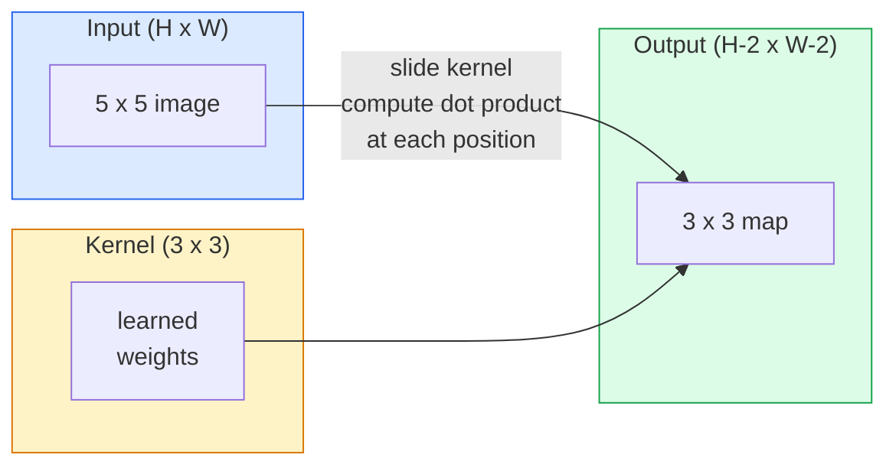
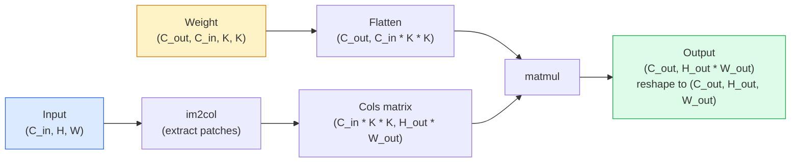

# 02 · 从零实现卷积

> 卷积就是一个微型的全连接层，你把它在图像上滑动，并在每个位置共享同一套权重。

**类型：** 实践构建
**语言：** Python
**前置：** 第 3 阶段（深度学习核心）、第 4 阶段第 01 课（图像基础）
**时长：** 约 75 分钟

## 学习目标

- 仅用 NumPy 从零实现 2D 卷积，包括嵌套循环版本和向量化的 `im2col` 版本
- 针对任意输入尺寸、卷积核大小、填充和步长的组合计算输出空间尺寸，并推导出 `(H - K + 2P) / S + 1` 公式
- 手工设计卷积核（边缘、模糊、锐化、Sobel），并解释每个核为何会产生它对应的激活模式
- 把多个卷积堆叠成一个特征提取器，并把堆叠深度与「感受野（receptive field）」大小联系起来

## 问题所在

对一张 224x224 的 RGB 图像使用「全连接层（fully connected layer）」，每个神经元需要 224 * 224 * 3 = 150,528 个输入权重。仅仅一个 1,000 个单元的隐藏层就已经是 1.5 亿个参数——而你还没学到任何有用的东西。更糟的是，这一层根本不知道左上角的狗和右下角的狗是同一个模式。它把每个像素位置都当作彼此独立，这对图像来说恰恰是错的：把一只猫平移三个像素，不应该迫使网络重新学习这个概念。

图像模型需要的两个性质是**平移等变性（translation equivariance）**（输入移动时输出随之移动）和**参数共享（parameter sharing）**（同一个特征检测器在每个位置运行）。全连接层这两者都给不了。卷积则免费同时提供了这两者。

卷积并不是为深度学习而发明的。它和驱动 JPEG 压缩、Photoshop 高斯模糊、工业视觉中的边缘检测以及历来所有音频滤波器的，是同一个运算。卷积神经网络（CNN）之所以从 2012 年到 2020 年统治了 ImageNet，原因就在于：对于「邻近值彼此相关、同一模式可能出现在任意位置」这类数据，卷积是正确的「先验（prior）」。

## 核心概念

### 一个卷积核，滑动

2D 卷积取一个被称为「卷积核（kernel）」（或称滤波器 filter）的小权重矩阵，把它在输入上滑动，并在每个位置计算逐元素乘积之和。这个和就成为一个输出像素。



在一个 5x5 输入上做 3x3 卷积的具体例子（无填充，步长 1）：

```
Input X (5 x 5):                Kernel W (3 x 3):

  1  2  0  1  2                   1  0 -1
  0  1  3  1  0                   2  0 -2
  2  1  0  2  1                   1  0 -1
  1  0  2  1  3
  2  1  1  0  1

卷积核在每一个有效的 3 x 3 窗口上滑动。输出 Y 是 3 x 3：

 Y[0,0] = sum( W * X[0:3, 0:3] )
 Y[0,1] = sum( W * X[0:3, 1:4] )
 Y[0,2] = sum( W * X[0:3, 2:5] )
 Y[1,0] = sum( W * X[1:4, 0:3] )
 ... 以此类推
```

那一条规则——**权重共享、局部性、滑动窗口**——就是全部的核心思想。其余一切都只是记账。

### 输出尺寸公式

给定输入空间尺寸 `H`、卷积核大小 `K`、填充 `P`、步长 `S`：

```
H_out = floor( (H - K + 2P) / S ) + 1
```

把它背下来。在设计每个架构时你都会计算它几十次。

| 场景 | H | K | P | S | H_out |
|----------|---|---|---|---|-------|
| 有效卷积，无填充 | 32 | 3 | 0 | 1 | 30 |
| 同尺寸卷积（保持尺寸不变） | 32 | 3 | 1 | 1 | 32 |
| 下采样 2 倍 | 32 | 3 | 1 | 2 | 16 |
| 2x2 池化 | 32 | 2 | 0 | 2 | 16 |
| 大感受野 | 32 | 7 | 3 | 2 | 16 |

「同尺寸填充（same padding）」是指：当 S == 1 时，选择合适的 P 使得 H_out == H。对于奇数 K，这个值就是 P = (K - 1) / 2。这正是 3x3 卷积核占据主导地位的原因——它是仍然有一个中心点的最小奇数核。

### 填充

如果不做填充，每次卷积都会让特征图缩小。堆叠 20 个这样的卷积，你的 224x224 图像会变成 184x184，这既在边界上浪费算力，又使得需要形状匹配的残差连接变得复杂。

```
对一个 5 x 5 输入做零填充（P = 1）：

  0  0  0  0  0  0  0
  0  1  2  0  1  2  0
  0  0  1  3  1  0  0
  0  2  1  0  2  1  0       现在卷积核可以以像素 (0, 0) 为中心，
  0  1  0  2  1  3  0       并且仍然有三行和三列的值
  0  2  1  1  0  1  0       可供相乘。
  0  0  0  0  0  0  0
```

实践中你会遇到的几种模式：`zero`（最常见）、`reflect`（镜像边缘，可避免生成式模型中出现生硬的边界）、`replicate`（复制边缘）、`circular`（环绕，用于环面类问题）。

### 步长

步长是滑动的步进大小。`stride=1` 是默认值。`stride=2` 会把空间维度减半，是在 CNN 内部不借助单独池化层进行下采样的经典做法——每一个现代架构（ResNet、ConvNeXt、MobileNet）都在某处用带步长的卷积替代了最大池化。

```
在 5 x 5 输入上用 3 x 3 卷积核、步长 1：

  起点: (0,0) (0,1) (0,2)        -> 输出第 0 行
        (1,0) (1,1) (1,2)        -> 输出第 1 行
        (2,0) (2,1) (2,2)        -> 输出第 2 行

  输出: 3 x 3

在同一输入上用步长 2：

  起点: (0,0) (0,2)              -> 输出第 0 行
        (2,0) (2,2)              -> 输出第 1 行

  输出: 2 x 2
```

### 多个输入通道

真实图像有三个通道。对一个 RGB 输入做 3x3 卷积，实际上是一个 3x3x3 的立体块：每个输入通道对应一个 3x3 切片。在每个空间位置，你对所有三个切片做乘加并加上一个偏置。

```
Input:   (C_in,  H,  W)        3 x 5 x 5
Kernel:  (C_in,  K,  K)        3 x 3 x 3 （一个卷积核）
Output:  (1,     H', W')       2D 图

要让一层产生 C_out 个输出通道，你需要堆叠 C_out 个卷积核：

Weight:  (C_out, C_in, K, K)   例如 64 x 3 x 3 x 3
Output:  (C_out, H', W')       64 x 3 x 3

参数量: C_out * C_in * K * K + C_out   （加上 C_out 是偏置项）
```

最后那一行就是你在规划模型时要计算的东西。一个作用于 3 通道输入、产生 64 通道的 3x3 卷积有 `64 * 3 * 3 * 3 + 64 = 1,792` 个参数。很便宜。

### im2col 技巧

嵌套循环易读但慢。GPU 喜欢大型矩阵乘法。技巧在于：把输入中每个感受野窗口展平成一个大矩阵的一列，把卷积核展平成一行，于是整个卷积就变成了一次矩阵乘法（matmul）。



每一个生产级的卷积实现都是这个思路的某种变体，再加上缓存分块（cache-tiling）技巧（直接卷积、Winograd、针对大核的 FFT 卷积）。理解了 im2col，你就理解了核心。

### 感受野

单个 3x3 卷积看的是 9 个输入像素。堆叠两个 3x3 卷积，第二层中的一个神经元看的就是 5x5 个输入像素。三个 3x3 卷积给出 7x7。一般而言：

```
堆叠 L 个 K x K 卷积（步长 1）后的感受野 RF = 1 + L * (K - 1)

带步长时:   感受野会随每层的步长以乘法方式增长。
```

「一路 3x3 到底」之所以行得通（VGG、ResNet、ConvNeXt），全部原因就在于：两个 3x3 卷积看到的输入区域和一个 5x5 卷积相同，但参数更少，而且中间还多了一次非线性变换。

## 动手构建

### 第 1 步：填充一个数组

从最小的基本单元开始：一个在 H x W 数组周围用零填充的函数。

```python
import numpy as np

def pad2d(x, p):
    if p == 0:
        return x
    h, w = x.shape[-2:]
    out = np.zeros(x.shape[:-2] + (h + 2 * p, w + 2 * p), dtype=x.dtype)
    out[..., p:p + h, p:p + w] = x
    return out

x = np.arange(9).reshape(3, 3)
print(x)
print()
print(pad2d(x, 1))
```

尾轴技巧 `x.shape[:-2]` 意味着同一个函数无需修改即可作用于 `(H, W)`、`(C, H, W)` 或 `(N, C, H, W)`。

### 第 2 步：用嵌套循环实现 2D 卷积

参考实现——慢，但毫无歧义。这在原理上就是 `torch.nn.functional.conv2d` 所做的事。

```python
def conv2d_naive(x, w, b=None, stride=1, padding=0):
    c_in, h, w_in = x.shape
    c_out, c_in_w, kh, kw = w.shape
    assert c_in == c_in_w

    x_pad = pad2d(x, padding)
    h_out = (h + 2 * padding - kh) // stride + 1
    w_out = (w_in + 2 * padding - kw) // stride + 1

    out = np.zeros((c_out, h_out, w_out), dtype=np.float32)
    for oc in range(c_out):
        for i in range(h_out):
            for j in range(w_out):
                hs = i * stride
                ws = j * stride
                patch = x_pad[:, hs:hs + kh, ws:ws + kw]
                out[oc, i, j] = np.sum(patch * w[oc])
        if b is not None:
            out[oc] += b[oc]
    return out
```

四层嵌套循环（输出通道、行、列，外加对 C_in、kh、kw 的隐式求和）。这就是你用来校验每个更快实现的「真值（ground truth）」。

### 第 3 步：用手工设计的卷积核验证

构建一个垂直方向的 Sobel 核，把它作用于一张合成的阶跃图像，观察垂直边缘被点亮。

```python
def synthetic_step_image():
    img = np.zeros((1, 16, 16), dtype=np.float32)
    img[:, :, 8:] = 1.0
    return img

sobel_x = np.array([
    [[-1, 0, 1],
     [-2, 0, 2],
     [-1, 0, 1]]
], dtype=np.float32)[None]

x = synthetic_step_image()
y = conv2d_naive(x, sobel_x, padding=1)
print(y[0].round(1))
```

预期在第 7 列（从左到右亮度增大处）出现较大的正值，其余位置全为零。这一条 print 语句就是你检验数学是否正确的健全性检查。

### 第 4 步：im2col

把输入中每个卷积核大小的窗口转换成矩阵的一列。对于 `C_in=3, K=3`，每一列是 27 个数。

```python
def im2col(x, kh, kw, stride=1, padding=0):
    c_in, h, w = x.shape
    x_pad = pad2d(x, padding)
    h_out = (h + 2 * padding - kh) // stride + 1
    w_out = (w + 2 * padding - kw) // stride + 1

    cols = np.zeros((c_in * kh * kw, h_out * w_out), dtype=x.dtype)
    col = 0
    for i in range(h_out):
        for j in range(w_out):
            hs = i * stride
            ws = j * stride
            patch = x_pad[:, hs:hs + kh, ws:ws + kw]
            cols[:, col] = patch.reshape(-1)
            col += 1
    return cols, h_out, w_out
```

它仍然是一个 Python 循环，但现在繁重的计算将变成一次向量化的矩阵乘法。

### 第 5 步：通过 im2col + matmul 实现快速卷积

用一次矩阵乘法替换那四重循环。

```python
def conv2d_im2col(x, w, b=None, stride=1, padding=0):
    c_out, c_in, kh, kw = w.shape
    cols, h_out, w_out = im2col(x, kh, kw, stride, padding)
    w_flat = w.reshape(c_out, -1)
    out = w_flat @ cols
    if b is not None:
        out += b[:, None]
    return out.reshape(c_out, h_out, w_out)
```

正确性检查：运行两种实现并对比。

```python
rng = np.random.default_rng(0)
x = rng.normal(0, 1, (3, 16, 16)).astype(np.float32)
w = rng.normal(0, 1, (8, 3, 3, 3)).astype(np.float32)
b = rng.normal(0, 1, (8,)).astype(np.float32)

y_naive = conv2d_naive(x, w, b, padding=1)
y_im2col = conv2d_im2col(x, w, b, padding=1)

print(f"max abs diff: {np.max(np.abs(y_naive - y_im2col)):.2e}")
```

`max abs diff` 应在 `1e-5` 左右——这个差异源于浮点累加顺序的不同，而不是 bug。

### 第 6 步：一组手工设计的卷积核

五个滤波器，展示在任何训练之前，单个卷积层能表达什么。

```python
KERNELS = {
    "identity": np.array([[0, 0, 0], [0, 1, 0], [0, 0, 0]], dtype=np.float32),
    "blur_3x3": np.ones((3, 3), dtype=np.float32) / 9.0,
    "sharpen": np.array([[0, -1, 0], [-1, 5, -1], [0, -1, 0]], dtype=np.float32),
    "sobel_x": np.array([[-1, 0, 1], [-2, 0, 2], [-1, 0, 1]], dtype=np.float32),
    "sobel_y": np.array([[-1, -2, -1], [0, 0, 0], [1, 2, 1]], dtype=np.float32),
}

def apply_kernel(img2d, kernel):
    x = img2d[None].astype(np.float32)
    w = kernel[None, None]
    return conv2d_im2col(x, w, padding=1)[0]
```

应用于任意灰度图像时：blur 使图像变柔和，sharpen 让边缘更锐利，sobel_x 点亮垂直边缘，sobel_y 点亮水平边缘。这些恰恰是 AlexNet 和 VGG 中*第一个*经过训练的卷积层最终学到的模式——因为无论后续要做什么任务，一个好的图像模型都需要边缘检测器和斑点检测器。

## 实际使用

PyTorch 的 `nn.Conv2d` 把同一个运算用自动微分（autograd）、CUDA 核函数和 cuDNN 优化包装了起来。形状语义完全一致。

```python
import torch
import torch.nn as nn

conv = nn.Conv2d(in_channels=3, out_channels=64, kernel_size=3, stride=1, padding=1)
print(conv)
print(f"weight shape: {tuple(conv.weight.shape)}   # (C_out, C_in, K, K)")
print(f"bias shape:   {tuple(conv.bias.shape)}")
print(f"param count:  {sum(p.numel() for p in conv.parameters())}")

x = torch.randn(8, 3, 224, 224)
y = conv(x)
print(f"\ninput  shape: {tuple(x.shape)}")
print(f"output shape: {tuple(y.shape)}")
```

把 `padding=1` 换成 `padding=0`，输出会降到 222x222。把 `stride=1` 换成 `stride=2`，则降到 112x112。和你上面背下来的公式完全一致。

## 交付产出

本课产出：

- `outputs/prompt-cnn-architect.md` —— 一个提示词，给定输入尺寸、参数预算和目标感受野，设计出一个在每一步都带有正确 K/S/P 的 `Conv2d` 层堆叠。
- `outputs/skill-conv-shape-calculator.md` —— 一个技能，逐层遍历一份网络规格说明，并为每个模块返回输出形状、感受野和参数量。

## 练习

1. **（简单）** 给定一个 128x128 的灰度输入和卷积堆叠 `[Conv3x3(s=1,p=1), Conv3x3(s=2,p=1), Conv3x3(s=1,p=1), Conv3x3(s=2,p=1)]`，手工计算每一层的输出空间尺寸和感受野。用一个由占位卷积组成的 PyTorch `nn.Sequential` 来验证。
2. **（中等）** 扩展 `conv2d_naive` 和 `conv2d_im2col`，使其接受一个 `groups` 参数。证明 `groups=C_in=C_out` 能复现一个「深度卷积（depthwise convolution）」，且其参数量是 `C * K * K` 而不是 `C * C * K * K`。
3. **（困难）** 手工实现 `conv2d_im2col` 的反向传播：给定输出的梯度，计算 `x` 和 `w` 的梯度。用在相同输入和权重上的 `torch.autograd.grad` 进行验证。诀窍在于：im2col 的梯度是 `col2im`，并且它必须把重叠的窗口累加起来。

## 关键术语

| 术语 | 人们怎么说 | 它实际的含义 |
|------|----------------|----------------------|
| 卷积（Convolution） | 「滑动一个滤波器」 | 一个可学习的点积，在每个空间位置以共享权重的方式施加；数学上它是「互相关（cross-correlation）」，但所有人都把它叫作卷积 |
| 卷积核 / 滤波器（Kernel / filter） | 「特征检测器」 | 一个形状为 (C_in, K, K) 的小权重张量，其与一个输入窗口的点积产生一个输出像素 |
| 步长（Stride） | 「你跳多远」 | 相邻两次卷积核放置之间的步进大小；步长 2 会把每个空间维度减半 |
| 填充（Padding） | 「边缘上的零」 | 在输入周围添加的额外值，使卷积核能以边界像素为中心；`same` 填充让输出尺寸等于输入尺寸 |
| 感受野（Receptive field） | 「神经元看到多少」 | 某个输出激活所依赖的那块原始输入区域，随深度和步长增大 |
| im2col | 「GEMM 技巧」 | 把每个感受野窗口重排成列，从而把卷积变成一次大型矩阵乘法——是每一个快速卷积核函数的核心 |
| 深度卷积（Depthwise conv） | 「每个通道一个卷积核」 | 一个 `groups == C_in` 的卷积，每个输出通道仅由其对应的那个输入通道计算得到；是 MobileNet 和 ConvNeXt 的骨干 |
| 平移等变性（Translation equivariance） | 「输入移，输出移」 | 输入平移 k 个像素则输出平移 k 个像素的性质；由权重共享免费带来 |

## 延伸阅读

- [深度学习卷积运算指南（Dumoulin & Visin, 2016）](https://arxiv.org/abs/1603.07285) —— 关于填充/步长/空洞卷积（dilation）的权威示意图，几乎每门课程都在悄悄照搬
- [CS231n：用于视觉识别的卷积神经网络](https://cs231n.github.io/convolutional-networks/) —— 经典讲义，包含最初的 im2col 解释
- [注释版 ConvNet（fast.ai）](https://nbviewer.org/github/fastai/fastbook/blob/master/13_convolutions.ipynb) —— 一个从手工卷积一路走到训练好的数字分类器的 notebook
- [CNN 的感受野算术（Dang Ha The Hien）](https://distill.pub/2019/computing-receptive-fields/) —— 论文级质量、可交互的感受野计算讲解
