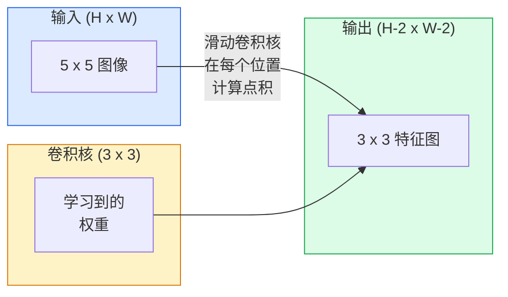
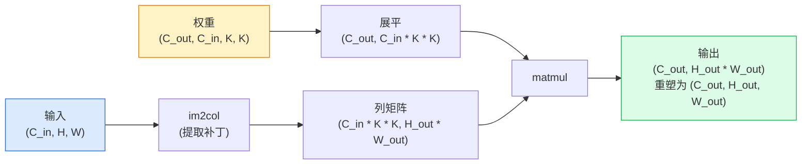

# 从零实现卷积

> 卷积是一个微型密集层，你将其在图像上滑动，在每个位置共享相同的权重。

**类型：** 构建
**语言：** Python
**前置知识：** 阶段 3（深度学习核心），阶段 4 第 01 课（图像基础）
**预计时间：** ~75 分钟

## 学习目标

- 仅使用 NumPy 从零实现二维卷积，包括嵌套循环版本和向量化的 `im2col` 版本
- 针对输入尺寸、卷积核尺寸、填充和步长的任意组合，计算输出空间尺寸，并解释 `(H - K + 2P) / S + 1` 公式
- 手工设计卷积核（边缘检测、模糊、锐化、Sobel），并解释每个卷积核为何产生其对应的激活模式
- 将卷积堆叠成特征提取器，并将堆叠深度与感受野尺寸联系起来

## 问题

一个全连接层处理 224x224 的 RGB 图像时，每个神经元需要 224 * 224 * 3 = 150,528 个输入权重。一个有 1000 个单元的隐藏层已经拥有 1.5 亿个参数——而你还没学到任何有用的东西。更糟的是，该层无法识别左上角的狗和右下角的狗是同样的模式。它将每个像素位置视为独立的，这对于图像而言是完全错误的：将一只猫平移三个像素不应该迫使网络重新学习这个概念。

图像模型需要的两个特性是**平移等变性（Translation Equivariance）**（输入平移时输出也随之平移）和**参数共享（Parameter Sharing）**（相同的特征检测器作用于所有位置）。密集层两者都无法提供。而卷积天然地同时提供了两者。

卷积并非为深度学习而发明。它是一种相同的运算，为 JPEG 压缩、Photoshop 中的高斯模糊、工业视觉中的边缘检测，以及所有音频滤波器提供动力。CNN 能在 2012 至 2020 年间主导 ImageNet 的原因在于：对于邻近值相关且相同模式可能在任何位置出现的数据，卷积是正确的先验知识。

## 概念

### 一个卷积核，滑动

二维卷积将一个称为卷积核（kernel 或 filter）的小权重矩阵滑过输入，在每个位置计算逐元素乘积的和。该和值成为输出中的一个像素。



一个具体的 3x3 在 5x5 输入上的例子（无填充，步长 1）：

```
输入 X (5 x 5):                卷积核 W (3 x 3):

  1  2  0  1  2                   1  0 -1
  0  1  3  1  0                   2  0 -2
  2  1  0  2  1                   1  0 -1
  1  0  2  1  3
  2  1  1  0  1

卷积核滑过每一个有效的 3 x 3 窗口。输出 Y 为 3 x 3：

 Y[0,0] = sum( W * X[0:3, 0:3] )
 Y[0,1] = sum( W * X[0:3, 1:4] )
 Y[0,2] = sum( W * X[0:3, 2:5] )
 Y[1,0] = sum( W * X[1:4, 0:3] )
 ... 依此类推
```

这一公式——**共享权重、局部性、滑动窗口**——就是全部核心思想。其余都只是簿记。

### 输出尺寸公式

给定输入空间尺寸 `H`、卷积核尺寸 `K`、填充 `P`、步长 `S`：

```
H_out = floor( (H - K + 2P) / S ) + 1
```

记住这个公式。你在每个架构中都会计算它几十次。

| 场景 | H | K | P | S | H_out |
|------|---|---|---|---|-------|
| 有效卷积，无填充 | 32 | 3 | 0 | 1 | 30 |
| 相同卷积（保持尺寸） | 32 | 3 | 1 | 1 | 32 |
| 下采样 2 倍 | 32 | 3 | 1 | 2 | 16 |
| 池化 2x2 | 32 | 2 | 0 | 2 | 16 |
| 大感受野 | 32 | 7 | 3 | 2 | 16 |

"相同填充" 指选择 P 使得当 S == 1 时 H_out == H。对于奇数 K，P = (K - 1) / 2。这就是为什么 3x3 卷积核占主导地位——它们是拥有中心的最小奇数卷积核。

### 填充

没有填充，每次卷积都会缩小特征图。堆叠 20 层，你的 224x224 图像会变成 184x184，这会浪费边界上的计算量，并使需要匹配形状的残差连接复杂化。

```
零填充 (P = 1) 在 5 x 5 输入上：

  0  0  0  0  0  0  0
  0  1  2  0  1  2  0
  0  0  1  3  1  0  0
  0  2  1  0  2  1  0      现在卷积核可以在像素 (0, 0) 处居中，
  0  1  0  2  1  3  0      并且仍然有三行三列的值进行乘法。
  0  2  1  1  0  1  0
  0  0  0  0  0  0  0
```

实践中你会遇到的模式：`zero`（最常用）、`reflect`（镜像边缘，避免生成模型中的硬边界）、`replicate`（复制边缘）、`circular`（环绕，用于环形问题）。

### 步长

步长是滑动时的步进尺寸。`stride=1` 是默认值。`stride=2` 将空间尺寸减半，是在 CNN 内部进行下采样而不使用单独池化层的经典方式——每个现代架构（ResNet、ConvNeXt、MobileNet）都在某些地方用步长卷积代替了最大池化。

```
在 5 x 5 输入、3 x 3 卷积核上步长 1：

  起始点: (0,0) (0,1) (0,2)        -> 输出行 0
          (1,0) (1,1) (1,2)        -> 输出行 1
          (2,0) (2,1) (2,2)        -> 输出行 2

  输出: 3 x 3

相同输入上步长 2：

  起始点: (0,0) (0,2)              -> 输出行 0
          (2,0) (2,2)              -> 输出行 1

  输出: 2 x 2
```

### 多输入通道

真实图像有三个通道。在 RGB 输入上的 3x3 卷积实际上是一个 3x3x3 的体：每个输入通道对应一个 3x3 切片。在每个空间位置上，你跨所有三个切片进行乘法和求和，然后加上偏置。

```
输入:   (C_in,  H,  W)        3 x 5 x 5
卷积核: (C_in,  K,  K)        3 x 3 x 3（一个卷积核）
输出:   (1,     H', W')       二维特征图

对于产生 C_out 个输出通道的层，你堆叠 C_out 个卷积核：

权重:  (C_out, C_in, K, K)   例如 64 x 3 x 3 x 3
输出:  (C_out, H', W')       64 x 3 x 3

参数量: C_out * C_in * K * K + C_out   （+ C_out 是偏置）
```

最后一行是你规划模型时会计算的公式。一个在 3 通道输入上的 64 通道 3x3 卷积有 `64 * 3 * 3 * 3 + 64 = 1,792` 个参数。很便宜。

### im2col 技巧

嵌套循环易于阅读但速度慢。GPU 需要大型矩阵乘法。技巧：将输入的每个感受野窗口展平为一个大矩阵的一列，将卷积核展平为一行，整个卷积就变成了单个矩阵乘法。



每个生产级卷积实现都是该技巧的某种变体，再加上缓存平铺技巧（直接卷积、Winograd、针对大卷积核的 FFT 卷积）。理解 im2col 就掌握了核心。

### 感受野

单个 3x3 卷积关注 9 个输入像素。堆叠两个 3x3 卷积，第二层中的一个神经元关注 5x5 的输入像素。三个 3x3 卷积给出 7x7。一般来说：

```
堆叠 L 个 K x K 卷积（步长 1）后的感受野 RF = 1 + L * (K - 1)

有步长时：感受野在各层中随步长乘性增长。
```

"全部使用 3x3 卷积"（VGG、ResNet、ConvNeXt）之所以有效，是因为两个 3x3 卷积看到的输入区域与一个 5x5 卷积相同，但参数更少，且中间有一个额外的非线性层。

## 构建

### 步骤 1：填充数组

从最小的原语开始：一个在 H x W 数组周围用零填充的函数。

```python
import numpy as np

def pad2d(x, p):
    if p == 0:
        return x
    h, w = x.shape[-2:]
    out = np.zeros(x.shape[:-2] + (h + 2 * p, w + 2 * p), dtype=x.dtype)
    out[..., p:p + h, p:p + w] = x
    return out

x = np.arange(9).reshape(3, 3)
print(x)
print()
print(pad2d(x, 1))
```

尾轴技巧 `x.shape[:-2]` 意味着同一个函数无需修改就能处理 `(H, W)`、`(C, H, W)` 或 `(N, C, H, W)`。

### 步骤 2：嵌套循环的二维卷积

参考实现——慢，但明确。这大致就是 `torch.nn.functional.conv2d` 所做的。

```python
def conv2d_naive(x, w, b=None, stride=1, padding=0):
    c_in, h, w_in = x.shape
    c_out, c_in_w, kh, kw = w.shape
    assert c_in == c_in_w

    x_pad = pad2d(x, padding)
    h_out = (h + 2 * padding - kh) // stride + 1
    w_out = (w_in + 2 * padding - kw) // stride + 1

    out = np.zeros((c_out, h_out, w_out), dtype=np.float32)
    for oc in range(c_out):
        for i in range(h_out):
            for j in range(w_out):
                hs = i * stride
                ws = j * stride
                patch = x_pad[:, hs:hs + kh, ws:ws + kw]
                out[oc, i, j] = np.sum(patch * w[oc])
        if b is not None:
            out[oc] += b[oc]
    return out
```

四个嵌套循环（输出通道、行、列，再加上对 C_in、kh、kw 的隐式求和）。这是你将用来检查所有更快实现版本的基准。

### 步骤 3：用手工设计的卷积核验证

构建一个垂直 Sobel 卷积核，应用于合成的阶跃图像，观察垂直边缘被激活。

```python
def synthetic_step_image():
    img = np.zeros((1, 16, 16), dtype=np.float32)
    img[:, :, 8:] = 1.0
    return img

sobel_x = np.array([
    [[-1, 0, 1],
     [-2, 0, 2],
     [-1, 0, 1]]
], dtype=np.float32)[None]

x = synthetic_step_image()
y = conv2d_naive(x, sobel_x, padding=1)
print(y[0].round(1))
```

期望第 7 列（从左到右亮度增加）出现大的正值，其他地方为零。这一行打印是你的合理性检查，确保数学正确。

### 步骤 4：im2col

将输入中每个卷积核大小的窗口转换为矩阵的一列。对于 `C_in=3, K=3`，每列有 27 个数字。

```python
def im2col(x, kh, kw, stride=1, padding=0):
    c_in, h, w = x.shape
    x_pad = pad2d(x, padding)
    h_out = (h + 2 * padding - kh) // stride + 1
    w_out = (w + 2 * padding - kw) // stride + 1

    cols = np.zeros((c_in * kh * kw, h_out * w_out), dtype=x.dtype)
    col = 0
    for i in range(h_out):
        for j in range(w_out):
            hs = i * stride
            ws = j * stride
            patch = x_pad[:, hs:hs + kh, ws:ws + kw]
            cols[:, col] = patch.reshape(-1)
            col += 1
    return cols, h_out, w_out
```

这仍然是一个 Python 循环，但现在重计算部分将是一个单一的向量化矩阵乘法。

### 步骤 5：通过 im2col + matmul 实现快速卷积

用一次矩阵乘法替换四重循环。

```python
def conv2d_im2col(x, w, b=None, stride=1, padding=0):
    c_out, c_in, kh, kw = w.shape
    cols, h_out, w_out = im2col(x, kh, kw, stride, padding)
    w_flat = w.reshape(c_out, -1)
    out = w_flat @ cols
    if b is not None:
        out += b[:, None]
    return out.reshape(c_out, h_out, w_out)
```

正确性检查：同时运行两个实现并比较。

```python
rng = np.random.default_rng(0)
x = rng.normal(0, 1, (3, 16, 16)).astype(np.float32)
w = rng.normal(0, 1, (8, 3, 3, 3)).astype(np.float32)
b = rng.normal(0, 1, (8,)).astype(np.float32)

y_naive = conv2d_naive(x, w, b, padding=1)
y_im2col = conv2d_im2col(x, w, b, padding=1)

print(f"最大绝对差值: {np.max(np.abs(y_naive - y_im2col)):.2e}")
```

`max abs diff` 应该在 `1e-5` 左右——差异来自浮点累加顺序，而非 bug。

### 步骤 6：一组手工设计的卷积核

五个滤波器，展示了在没有任何训练之前，单个卷积层能表达什么。

```python
KERNELS = {
    "identity": np.array([[0, 0, 0], [0, 1, 0], [0, 0, 0]], dtype=np.float32),
    "blur_3x3": np.ones((3, 3), dtype=np.float32) / 9.0,
    "sharpen": np.array([[0, -1, 0], [-1, 5, -1], [0, -1, 0]], dtype=np.float32),
    "sobel_x": np.array([[-1, 0, 1], [-2, 0, 2], [-1, 0, 1]], dtype=np.float32),
    "sobel_y": np.array([[-1, -2, -1