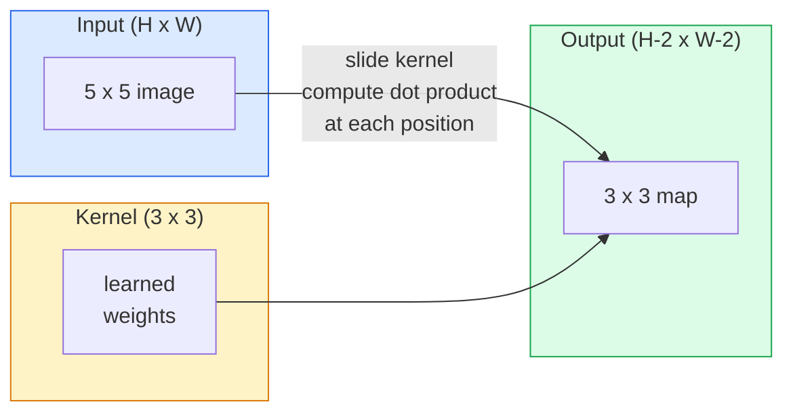
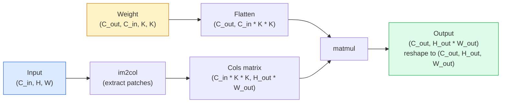

# Scratch的卷积

> 卷积是一个微小的密集层，你可以在图像上滑动，在每个位置共享相同的权重。

** 类型：** 构建
** 语言：** Python
** 先决条件：** 第3阶段（深度学习核心），第4阶段01课（图像基础知识）
** 时间：** ~75分钟

## 学习目标

- 仅使用NumPy从头开始实现2D卷积，包括嵌套循环版本和载体化的“im2col”版本
- 计算输入大小、内核大小、填充和跨度的任何组合的输出空间大小，并证明“（H-K +2 P）/ S + 1”公式
- 手工设计核心（边缘、模糊、锐利、Sobel）并解释为什么每个核心都会产生激活模式
- 将卷积堆叠到特征提取器中，并将堆叠深度与感受野的大小联系起来

## 问题

224 x224 RB图像上的全连接层需要每个神经元224 * 224 * 3 = 150，528个输入权重。在您学到任何有用的东西之前，一个包含1，000个单位的隐藏层已经是1.5亿个参数。更糟糕的是，该层不知道左上角的狗和右下角的狗是相同的模式。它将每个像素位置视为独立的，这对于图像来说是完全错误的：将猫翻译三个像素不应该迫使网络重新学习这个概念。

图像模型需要的两个属性是 ** 翻译等方差 **（输入移动时输出移动）和 ** 参数共享 **（相同的特征检测器到处运行）。致密的层既没有给你带来任何好处。卷积为你们提供免费的服务。

卷积不是为了深度学习而发明的。它与JPEG压缩、Photoshop中的高斯模糊、工业视觉中的边缘检测以及所有已发货的音频滤镜的支持相同操作。CNN在2012年至2020年期间占据主导地位的原因是，对于附近值相关且相同模式可能出现在任何地方的数据，卷积是正确的先验。

## 概念

### 一个内核，滑动

2D卷积采用一个称为核（或过滤器）的小权重矩阵，将其滑动到输入上，并在每个位置计算元素级积的总和。该总和变成一个输出像素。



5x 5输入上的具体3x 3示例（无填充，跨度1）：

```
Input X (5 x 5):                Kernel W (3 x 3):

  1  2  0  1  2                   1  0 -1
  0  1  3  1  0                   2  0 -2
  2  1  0  2  1                   1  0 -1
  1  0  2  1  3
  2  1  1  0  1

The kernel slides across every valid 3 x 3 window. Output Y is 3 x 3:

 Y[0,0] = sum( W * X[0:3, 0:3] )
 Y[0,1] = sum( W * X[0:3, 1:4] )
 Y[0,2] = sum( W * X[0:3, 2:5] )
 Y[1,0] = sum( W * X[1:4, 0:3] )
 ... and so on
```

这个公式- ** 共享权重、局部性、滑动窗口 ** -就是整个想法。其他一切都是簿记。

### 输出大小公式

给定输入空间大小`H`，内核大小`K`，填充`P`，步幅`S`：

```
H_out = floor( (H - K + 2P) / S ) + 1
```

简化这个。您将对每个架构进行数十次计算。

| 场景 | H | K | P | S | H_out |
|----------|---|---|---|---|-------|
| 有效转换，无填充 | 32 | 3 | 0 | 1 | 30 |
| 相同的conv（保留大小） | 32 | 3 | 1 | 1 | 32 |
| 向下采样2 | 32 | 3 | 1 | 2 | 16 |
| 泳池2x 2 | 32 | 2 | 0 | 2 | 16 |
| 大的感受野 | 32 | 7 | 3 | 2 | 16 |

“相同的填充”意味着选择P，以便当S == 1时H_out == H。对于奇数K，即P =（K - 1）/ 2。这就是为什么3x 3内核占据主导地位--它们是仍然有中心的最小奇数内核。

### 填充

如果没有填充，每次卷积都会缩小特征地图。堆叠20个，您的224 x224图像就会变成184 x184，这会浪费边界上的计算，并使需要匹配形状的剩余连接变得复杂。

```
Zero padding (P = 1) on a 5 x 5 input:

  0  0  0  0  0  0  0
  0  1  2  0  1  2  0
  0  0  1  3  1  0  0
  0  2  1  0  2  1  0       Now the kernel can centre on pixel
  0  1  0  2  1  3  0       (0, 0) and still have three rows and
  0  2  1  1  0  1  0       three columns of values to multiply.
  0  0  0  0  0  0  0
```

实践中遇到的模式：“零”（最常见）、“反射”（镜像边缘，避免生成式模型中的硬边界）、“复制”（复制边缘）、“循环”（环绕，用于环形问题）。

### 步幅

Stride是幻灯片的步进大小。“stride=1”是默认值。“stride=2”将空间维度减半，是在CNN内进行下采样的经典方法，无需单独的池化层-每个现代架构（ResNet、ConvNeXt、MobileNet）都使用striped cons来代替某个地方的最大池。

```
Stride 1 on a 5 x 5 input, 3 x 3 kernel:

  starts: (0,0) (0,1) (0,2)        -> output row 0
          (1,0) (1,1) (1,2)        -> output row 1
          (2,0) (2,1) (2,2)        -> output row 2

  Output: 3 x 3

Stride 2 on the same input:

  starts: (0,0) (0,2)              -> output row 0
          (2,0) (2,2)              -> output row 1

  Output: 2 x 2
```

### 多个输入声道

真实图像有三个通道。RGB输入上的3x3卷积实际上是一个3x3x3体积：每个输入通道一个3x3切片。在每个空间位置，您对所有三个切片进行相乘和求和，并添加偏移。

```
Input:   (C_in,  H,  W)        3 x 5 x 5
Kernel:  (C_in,  K,  K)        3 x 3 x 3 (one kernel)
Output:  (1,     H', W')       2D map

For a layer that produces C_out output channels, you stack C_out kernels:

Weight:  (C_out, C_in, K, K)   e.g. 64 x 3 x 3 x 3
Output:  (C_out, H', W')       64 x 3 x 3

Parameter count: C_out * C_in * K * K + C_out   (the + C_out is biases)
```

最后一行是您在规划模型时要计算的行。3通道输入上的64通道3x 3 conv具有“64 * 3 * 3 * 3 + 64 = 1，792”参数。便宜.

### im2col技巧

嵌套循环易于阅读，但速度较慢。图形处理器想要大矩阵相乘。技巧：将输入的每个接收场窗口压平为大矩阵的一列，将核压平为一行，整个卷积就变成一个矩阵。



每个生产conv实现都是这个的某种变体以及缓存切片技巧（用于大型内核的直接conv、Winograd、快速傅立叶转换）。了解im2col，您就了解核心。

### 感受野

单个3x 3 conv查看9个输入像素。堆叠两个3x 3 conv，第二层中的神经元查看5x 5输入像素。三场3x 3比赛给出7x 7。一般来说：

```
RF after L stacked K x K convs (stride 1) = 1 + L * (K - 1)

With strides:   RF grows multiplicatively with stride along each layer.
```

“3x 3一路向下”（VGG、ResNet、ConvNeXt）有效的全部原因是，两个3x 3 conv与一个5x 5 conv看到相同的输入区域，但参数更少，中间有额外的非线性。

## 建设党

### 第1步：填充阵列

从最小的基元开始：一个在H x W阵列周围填充零的函数。

```python
import numpy as np

def pad2d(x, p):
    if p == 0:
        return x
    h, w = x.shape[-2:]
    out = np.zeros(x.shape[:-2] + (h + 2 * p, w + 2 * p), dtype=x.dtype)
    out[..., p:p + h, p:p + w] = x
    return out

x = np.arange(9).reshape(3, 3)
print(x)
print()
print(pad2d(x, 1))
```

尾随轴技巧“x.shape[：-2]”意味着相同的功能在“（H，W）”、“（C，H，W）”或“（N，C，H，W）”上起作用，无需修改。

### 第2步：使用嵌套循环的2D卷积

参考实现-缓慢，但明确。这就是“torch.nn.functional.conv2d”原则上的作用。

```python
def conv2d_naive(x, w, b=None, stride=1, padding=0):
    c_in, h, w_in = x.shape
    c_out, c_in_w, kh, kw = w.shape
    assert c_in == c_in_w

    x_pad = pad2d(x, padding)
    h_out = (h + 2 * padding - kh) // stride + 1
    w_out = (w_in + 2 * padding - kw) // stride + 1

    out = np.zeros((c_out, h_out, w_out), dtype=np.float32)
    for oc in range(c_out):
        for i in range(h_out):
            for j in range(w_out):
                hs = i * stride
                ws = j * stride
                patch = x_pad[:, hs:hs + kh, ws:ws + kw]
                out[oc, i, j] = np.sum(patch * w[oc])
        if b is not None:
            out[oc] += b[oc]
    return out
```

四个嵌套循环（输出通道、行、列，加上C_in、kh、kw的隐式和）。这是您将检查每一个更快的实施的基本事实。

### 第3步：使用手工设计的内核验证

构建垂直Sobel内核，将其应用于合成步骤图像，并观察垂直边缘点亮。

```python
def synthetic_step_image():
    img = np.zeros((1, 16, 16), dtype=np.float32)
    img[:, :, 8:] = 1.0
    return img

sobel_x = np.array([
    [[-1, 0, 1],
     [-2, 0, 2],
     [-1, 0, 1]]
], dtype=np.float32)[None]

x = synthetic_step_image()
y = conv2d_naive(x, sobel_x, padding=1)
print(y[0].round(1))
```

预计第7列上会出现大的正值（从左到右的亮度增加），其他地方会出现零。这张打印纸是您的理智检查，以确保数学正确。

### 第4步：im2col

将输入中的每个内核大小的窗口转换为矩阵的一列。对于“C_in=3，K=3”，每列是27个数字。

```python
def im2col(x, kh, kw, stride=1, padding=0):
    c_in, h, w = x.shape
    x_pad = pad2d(x, padding)
    h_out = (h + 2 * padding - kh) // stride + 1
    w_out = (w + 2 * padding - kw) // stride + 1

    cols = np.zeros((c_in * kh * kw, h_out * w_out), dtype=x.dtype)
    col = 0
    for i in range(h_out):
        for j in range(w_out):
            hs = i * stride
            ws = j * stride
            patch = x_pad[:, hs:hs + kh, ws:ws + kw]
            cols[:, col] = patch.reshape(-1)
            col += 1
    return cols, h_out, w_out
```

它仍然是一个Python循环，但现在繁重的工作将是一个单一的载体化矩阵。

### 第5步：通过im2col + matmul快速转换

用一个矩阵相乘替换四重循环。

```python
def conv2d_im2col(x, w, b=None, stride=1, padding=0):
    c_out, c_in, kh, kw = w.shape
    cols, h_out, w_out = im2col(x, kh, kw, stride, padding)
    w_flat = w.reshape(c_out, -1)
    out = w_flat @ cols
    if b is not None:
        out += b[:, None]
    return out.reshape(c_out, h_out, w_out)
```

正确性检查：运行两个实现并比较。

```python
rng = np.random.default_rng(0)
x = rng.normal(0, 1, (3, 16, 16)).astype(np.float32)
w = rng.normal(0, 1, (8, 3, 3, 3)).astype(np.float32)
b = rng.normal(0, 1, (8,)).astype(np.float32)

y_naive = conv2d_naive(x, w, b, padding=1)
y_im2col = conv2d_im2col(x, w, b, padding=1)

print(f"max abs diff: {np.max(np.abs(y_naive - y_im2col)):.2e}")
```

“max abs diff”应该在“1 e-5”左右-区别在于浮点累积顺序，而不是错误。

### 第6步：手工设计的内核库

五个过滤器显示单个conv层在任何训练之前可以表达的内容。

```python
KERNELS = {
    "identity": np.array([[0, 0, 0], [0, 1, 0], [0, 0, 0]], dtype=np.float32),
    "blur_3x3": np.ones((3, 3), dtype=np.float32) / 9.0,
    "sharpen": np.array([[0, -1, 0], [-1, 5, -1], [0, -1, 0]], dtype=np.float32),
    "sobel_x": np.array([[-1, 0, 1], [-2, 0, 2], [-1, 0, 1]], dtype=np.float32),
    "sobel_y": np.array([[-1, -2, -1], [0, 0, 0], [1, 2, 1]], dtype=np.float32),
}

def apply_kernel(img2d, kernel):
    x = img2d[None].astype(np.float32)
    w = kernel[None, None]
    return conv2d_im2col(x, w, padding=1)[0]
```

应用于任何灰度图像，模糊会软化，边缘变得清晰，Sobel-x照亮垂直边缘，Sobel-y照亮水平边缘。这些正是AlexNet和VGG中 * 第一个 * 训练的conv层最终学习到的模式-因为无论以后执行什么任务，好的图像模型都需要边缘和斑点检测器。

## 使用它

PyTorch的“nn.Conv2d”使用autograd、CUDA内核和cuDNN优化包装了相同的操作。形状语义相同。

```python
import torch
import torch.nn as nn

conv = nn.Conv2d(in_channels=3, out_channels=64, kernel_size=3, stride=1, padding=1)
print(conv)
print(f"weight shape: {tuple(conv.weight.shape)}   # (C_out, C_in, K, K)")
print(f"bias shape:   {tuple(conv.bias.shape)}")
print(f"param count:  {sum(p.numel() for p in conv.parameters())}")

x = torch.randn(8, 3, 224, 224)
y = conv(x)
print(f"\ninput  shape: {tuple(x.shape)}")
print(f"output shape: {tuple(y.shape)}")
```

将“padding=1”替换为“padding=0”，输出就会下降到222 x222。将“stride=1”替换为“stride=2”，它就会下降到112 x112。与您上面记住的公式相同。

## 把它运

本课产生：

- ' outputes/prompt-cnn-architect.md '-一个提示，在给定输入大小、参数预算和目标感受野的情况下，设计每一步都具有正确的K/S/P的“Conv 2d”层堆栈。
- ' outlots/skill-conv-shape-calculator.md '-一种逐层探索网络规范并返回每个块的输出形状、感受域和参数计数的技能。

## 演习

1. **（简单）** 给定128 x128灰度输入和“[Conv 3x 3（s=1，p=1）、Conv 3x 3（s=2，p=1）、Conv 3x 3（s=1，p=1）、Conv 3x 3（s=2，p=1）]'的堆栈，手工计算每层的输出空间大小和感受野。使用PyTorch ' nn.序列'的虚拟Conv进行验证。
2. **（中）** 扩展“conv2d_naive”和“conv2d_im2col”以接受“groups”参数。表明“groups=C_in=C_out”再现深度卷积，并且其参数计数是“C * K * K”而不是“C * C * K * K”。
3. **（硬）** 手动实现“conv2d_im2col”的向后传递：给定输出的梯度，计算“x”和“w”的梯度。在相同的输入和权重上对照“torch.autograd.grad”进行验证。技巧：im2 col的梯度是“col2 im”，并且它必须积累重叠的窗口。

## 关键术语

| Term | 别人怎么说 | 它实际上意味着什么 |
|------|----------------|----------------------|
| 卷积 | “滑动过滤器” | 应用于每个空间位置的可学习点积，具有共享权重;数学上是互相关，但每个人都称之为卷积 |
| 核心/过滤器 | “特征检测器” | 形状的小权重张量（C_in，K，K），其点与输入窗口的积产生一个输出像素 |
| 步幅 | “你跳多远” | 连续核心放置之间的步进大小;第2步是每个空间维度的一半 |
| 填充 | “边缘上的零” | 在输入周围添加额外的值，以便内核可以以边界像素为中心; `same`填充使输出大小等于输入大小 |
| 感受野 | “神经元看到了多少” | 给定输出激活所依赖的原始输入补丁，随着深度和步伐而增长 |
| im2col | “GEMM技巧” | 将每个接收窗口重新排列成列，以便卷积成为一个大矩阵乘-每个快速conv内核的核心 |
| 依赖转换 | “每个通道一个内核” | 具有“groups == C_in”的conv，仅根据其匹配的输入通道计算每个输出通道; MobileNet和ConvNeXt的主干 |
| 翻译等方差 | “移入，移出” | 将输入移动k个像素会将输出移动k个像素的属性;免费提供，具有共享权重 |

## 进一步阅读

- [深度学习卷积算法指南（Dumoulin & Visin，2016）]（https：//arxiv.org/ab/1603.07285）-每门课程悄悄复制的填充/步伐/扩张的权威图表
- [CS 231 n：用于视觉识别的卷积神经网络]（https：//cs231n.github.io/convolutional-networks/）-规范的课堂笔记，包括原始的im 2col解释
- [The注释ConvNet（fast.ai）]（https：//nbviewer.org/github/fastai/fastbook/blob/master/13_convolutions.ipynb）-一款从手动卷积转向经过训练的数字分类器的笔记本
- [CNN的感受场算术（Dang Ha The Hien）]（https：//guards.pub/2019/cuting-receptive-fields/）-感受场计算的纸质交互式解释器
