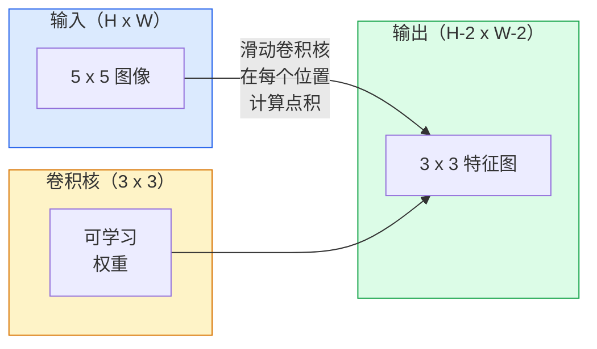
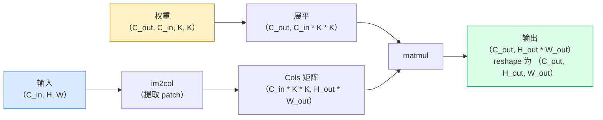

# 从零实现卷积（Convolutions from Scratch）

> 译注：本文译自同目录 [`en.md`](./en.md)。术语遵循仓根 [TRANSLATION_GUIDE.md](../../../../TRANSLATION_GUIDE.md)。

> 卷积就是一个小型的全连接层（dense layer），你把它在图像上滑动，每个位置都共享同一组权重。

**Type:** Build
**Languages:** Python
**Prerequisites:** Phase 3（深度学习核心）, Phase 4 Lesson 01（图像基础）
**Time:** ~75 minutes

## 学习目标（Learning Objectives）

- 仅用 NumPy 从零实现 2D 卷积，包括嵌套循环版本和向量化的 `im2col` 版本
- 给定输入尺寸、kernel 尺寸、padding、stride 的任意组合，能算出输出空间尺寸，并解释 `(H - K + 2P) / S + 1` 这条公式从何而来
- 手工设计 kernel（边缘、模糊、锐化、Sobel），并解释每一个为什么会产生它对应的激活模式
- 把卷积堆叠成特征提取器，并把堆叠的深度与感受野（receptive field）的大小联系起来

## 问题（The Problem）

在 224x224 的 RGB 图像上接一个全连接层，每个神经元就要 224 * 224 * 3 = 150,528 个输入权重。一个 1,000 单元的隐层就已经是 1.5 亿个参数——你还没学到任何有用的东西。更糟的是，这一层完全意识不到「左上角的狗」和「右下角的狗」是同一个 pattern。它把每个像素位置当成独立的，对图像而言这恰好是错的：把一只猫平移三像素，不应该逼网络重新学习「猫」这个概念。

图像模型需要两个性质：**translation equivariance（平移等变性，输入平移则输出跟着平移）** 和 **parameter sharing（参数共享，同一个特征检测器在所有位置上跑）**。Dense 层一个都没给你。卷积一次性免费送上两个。

卷积不是为深度学习发明的。同样的运算驱动着 JPEG 压缩、Photoshop 里的 Gaussian blur、工业视觉里的边缘检测，以及历史上每一个音频滤波器。CNN 之所以能在 2012 到 2020 间统治 ImageNet，是因为对于「邻近值相互关联、同一 pattern 可以出现在任意位置」这种数据，卷积是正确的先验。

## 概念（The Concept）

### 一个 kernel，滑动起来（One kernel, sliding）

2D 卷积接收一个被称作 kernel（或 filter）的小权重矩阵，在输入上滑动，在每个位置上计算逐元素乘积之和。这个和就成为一个输出像素。



一个 5x5 输入上的 3x3 具体例子（无 padding，stride 1）：

```
Input X (5 x 5):                Kernel W (3 x 3):

  1  2  0  1  2                   1  0 -1
  0  1  3  1  0                   2  0 -2
  2  1  0  2  1                   1  0 -1
  1  0  2  1  3
  2  1  1  0  1

The kernel slides across every valid 3 x 3 window. Output Y is 3 x 3:

 Y[0,0] = sum( W * X[0:3, 0:3] )
 Y[0,1] = sum( W * X[0:3, 1:4] )
 Y[0,2] = sum( W * X[0:3, 2:5] )
 Y[1,0] = sum( W * X[1:4, 0:3] )
 ... and so on
```

这一条公式——**共享权重、局部性、滑动窗口**——就是全部的核心思想。剩下的都是记账。

### 输出尺寸公式（Output size formula）

给定输入空间尺寸 `H`，kernel 尺寸 `K`，padding `P`，stride `S`：

```
H_out = floor( (H - K + 2P) / S ) + 1
```

把它背下来。设计一个架构时你会算几十遍。

| 场景 | H | K | P | S | H_out |
|----------|---|---|---|---|-------|
| Valid 卷积，无 padding | 32 | 3 | 0 | 1 | 30 |
| Same 卷积（保持尺寸） | 32 | 3 | 1 | 1 | 32 |
| 下采样 2 倍 | 32 | 3 | 1 | 2 | 16 |
| Pool 2x2 | 32 | 2 | 0 | 2 | 16 |
| 大感受野 | 32 | 7 | 3 | 2 | 16 |

「Same padding」意思是挑一个 P 让 S == 1 时 H_out == H。对于奇数 K，那就是 P = (K - 1) / 2。这就是 3x3 kernel 一统江湖的原因——它是仍然有「中心」的最小奇数 kernel。

### Padding

不加 padding 的话，每一次卷积都会把 feature map 缩一圈。叠 20 层下去，你的 224x224 图像就变成 184x184，既在边界上浪费算力，又让需要形状对齐的残差连接变得复杂。

```
Zero padding (P = 1) on a 5 x 5 input:

  0  0  0  0  0  0  0
  0  1  2  0  1  2  0
  0  0  1  3  1  0  0
  0  2  1  0  2  1  0       Now the kernel can centre on pixel
  0  1  0  2  1  3  0       (0, 0) and still have three rows and
  0  2  1  1  0  1  0       three columns of values to multiply.
  0  0  0  0  0  0  0
```

实践中你会遇到的几种模式：`zero`（最常用）、`reflect`（镜像边缘，避免生成模型里出现硬边界）、`replicate`（复制边缘）、`circular`（环绕，用于环形/toroidal 问题）。

### Stride

Stride 就是滑动的步长。`stride=1` 是默认值。`stride=2` 把空间维度减半，是 CNN 内部不另起一个 pooling 层就完成下采样的经典做法——每一个现代架构（ResNet、ConvNeXt、MobileNet）都在某处用 strided 卷积替代 max-pool。

```
Stride 1 on a 5 x 5 input, 3 x 3 kernel:

  starts: (0,0) (0,1) (0,2)        -> output row 0
          (1,0) (1,1) (1,2)        -> output row 1
          (2,0) (2,1) (2,2)        -> output row 2

  Output: 3 x 3

Stride 2 on the same input:

  starts: (0,0) (0,2)              -> output row 0
          (2,0) (2,2)              -> output row 1

  Output: 2 x 2
```

### 多输入通道（Multiple input channels）

真实图像有三个通道。在 RGB 输入上做的 3x3 卷积实际上是一个 3x3x3 的体（volume）：每个输入通道一片 3x3。在每个空间位置上，你跨三片做乘加，再加一个 bias（偏置）。

```
Input:   (C_in,  H,  W)        3 x 5 x 5
Kernel:  (C_in,  K,  K)        3 x 3 x 3 (one kernel)
Output:  (1,     H', W')       2D map

For a layer that produces C_out output channels, you stack C_out kernels:

Weight:  (C_out, C_in, K, K)   e.g. 64 x 3 x 3 x 3
Output:  (C_out, H', W')       64 x 3 x 3

Parameter count: C_out * C_in * K * K + C_out   (the + C_out is biases)
```

最后那行是你规划模型时会反复算的东西。一个 64 通道的 3x3 卷积，输入是 3 通道，那就是 `64 * 3 * 3 * 3 + 64 = 1,792` 个参数。便宜。

### im2col 技巧（The im2col trick）

嵌套循环易读但慢。GPU 想要大型矩阵乘法。技巧是：把输入里每一个感受野窗口铺平成一个大矩阵的一列，把 kernel 铺平成一行，那么整个卷积就变成一次 matmul。



每个生产级的卷积实现都是这个加上某种缓存分块技巧的变体（直接卷积、Winograd、对大 kernel 用 FFT 卷积）。看懂 im2col，就看懂了内核。

### 感受野（Receptive field）

一次 3x3 卷积看 9 个输入像素。叠两层 3x3，第二层里的一个神经元就看到 5x5 个输入像素。三层 3x3 看到 7x7。一般地：

```
RF after L stacked K x K convs (stride 1) = 1 + L * (K - 1)

With strides:   RF grows multiplicatively with stride along each layer.
```

「一路 3x3 到底」这种做法（VGG、ResNet、ConvNeXt）成立的全部原因，就是两层 3x3 卷积看到的输入区域和一层 5x5 卷积一样，但参数更少，中间还多一个非线性激活。

## 动手实现（Build It）

### 第 1 步：给数组加 padding（Pad an array）

从最小的原语开始：一个在 H x W 数组周围补零的函数。

```python
import numpy as np

def pad2d(x, p):
    if p == 0:
        return x
    h, w = x.shape[-2:]
    out = np.zeros(x.shape[:-2] + (h + 2 * p, w + 2 * p), dtype=x.dtype)
    out[..., p:p + h, p:p + w] = x
    return out

x = np.arange(9).reshape(3, 3)
print(x)
print()
print(pad2d(x, 1))
```

`x.shape[:-2]` 这种「保留前面所有轴」的写法意味着同一个函数不用改就能处理 `(H, W)`、`(C, H, W)` 或 `(N, C, H, W)`。

### 第 2 步：嵌套循环版的 2D 卷积（2D convolution with nested loops）

参考实现——慢，但毫不含糊。这就是 `torch.nn.functional.conv2d` 在原理上做的事。

```python
def conv2d_naive(x, w, b=None, stride=1, padding=0):
    c_in, h, w_in = x.shape
    c_out, c_in_w, kh, kw = w.shape
    assert c_in == c_in_w

    x_pad = pad2d(x, padding)
    h_out = (h + 2 * padding - kh) // stride + 1
    w_out = (w_in + 2 * padding - kw) // stride + 1

    out = np.zeros((c_out, h_out, w_out), dtype=np.float32)
    for oc in range(c_out):
        for i in range(h_out):
            for j in range(w_out):
                hs = i * stride
                ws = j * stride
                patch = x_pad[:, hs:hs + kh, ws:ws + kw]
                out[oc, i, j] = np.sum(patch * w[oc])
        if b is not None:
            out[oc] += b[oc]
    return out
```

四层嵌套循环（输出通道、行、列，再加上 C_in、kh、kw 上的隐式求和）。这是你要拿来核对每一个更快实现的 ground truth（基准）。

### 第 3 步：用手工设计的 kernel 验证（Verify with a hand-designed kernel）

构造一个垂直 Sobel kernel，作用在一个合成阶跃图上，看垂直边缘亮起来。

```python
def synthetic_step_image():
    img = np.zeros((1, 16, 16), dtype=np.float32)
    img[:, :, 8:] = 1.0
    return img

sobel_x = np.array([
    [[-1, 0, 1],
     [-2, 0, 2],
     [-1, 0, 1]]
], dtype=np.float32)[None]

x = synthetic_step_image()
y = conv2d_naive(x, sobel_x, padding=1)
print(y[0].round(1))
```

预期是第 7 列出现大正值（亮度从左到右增加），其他位置全是零。这一句 print 就是你确认数学没写错的 sanity check。

### 第 4 步：im2col

把输入里每一个 kernel 大小的窗口转成一个矩阵的列。对于 `C_in=3, K=3`，每一列就是 27 个数。

```python
def im2col(x, kh, kw, stride=1, padding=0):
    c_in, h, w = x.shape
    x_pad = pad2d(x, padding)
    h_out = (h + 2 * padding - kh) // stride + 1
    w_out = (w + 2 * padding - kw) // stride + 1

    cols = np.zeros((c_in * kh * kw, h_out * w_out), dtype=x.dtype)
    col = 0
    for i in range(h_out):
        for j in range(w_out):
            hs = i * stride
            ws = j * stride
            patch = x_pad[:, hs:hs + kh, ws:ws + kw]
            cols[:, col] = patch.reshape(-1)
            col += 1
    return cols, h_out, w_out
```

它仍然是个 Python 循环，但接下来的重活就交给一次向量化 matmul 去做。

### 第 5 步：通过 im2col + matmul 实现快速卷积（Fast conv via im2col + matmul）

把四层循环换成一次矩阵乘法。

```python
def conv2d_im2col(x, w, b=None, stride=1, padding=0):
    c_out, c_in, kh, kw = w.shape
    cols, h_out, w_out = im2col(x, kh, kw, stride, padding)
    w_flat = w.reshape(c_out, -1)
    out = w_flat @ cols
    if b is not None:
        out += b[:, None]
    return out.reshape(c_out, h_out, w_out)
```

正确性核对：跑两个实现并比较。

```python
rng = np.random.default_rng(0)
x = rng.normal(0, 1, (3, 16, 16)).astype(np.float32)
w = rng.normal(0, 1, (8, 3, 3, 3)).astype(np.float32)
b = rng.normal(0, 1, (8,)).astype(np.float32)

y_naive = conv2d_naive(x, w, b, padding=1)
y_im2col = conv2d_im2col(x, w, b, padding=1)

print(f"max abs diff: {np.max(np.abs(y_naive - y_im2col)):.2e}")
```

`max abs diff` 应该在 `1e-5` 量级——差异来自浮点累加顺序，不是 bug。

### 第 6 步：一组手工设计的 kernel（A bank of hand-designed kernels）

五个滤波器，能展示一个卷积层在还没训练之前就已经能表达什么。

```python
KERNELS = {
    "identity": np.array([[0, 0, 0], [0, 1, 0], [0, 0, 0]], dtype=np.float32),
    "blur_3x3": np.ones((3, 3), dtype=np.float32) / 9.0,
    "sharpen": np.array([[0, -1, 0], [-1, 5, -1], [0, -1, 0]], dtype=np.float32),
    "sobel_x": np.array([[-1, 0, 1], [-2, 0, 2], [-1, 0, 1]], dtype=np.float32),
    "sobel_y": np.array([[-1, -2, -1], [0, 0, 0], [1, 2, 1]], dtype=np.float32),
}

def apply_kernel(img2d, kernel):
    x = img2d[None].astype(np.float32)
    w = kernel[None, None]
    return conv2d_im2col(x, w, padding=1)[0]
```

施加在任何灰度图上：blur 让画面变柔，sharpen 让边缘变锐，sobel_x 让垂直边缘亮起来，sobel_y 让水平边缘亮起来。这正是 AlexNet 和 VGG *第一* 个训练出来的卷积层最终学到的 pattern——因为不管下游任务是什么，一个好的图像模型都需要边缘和斑点检测器。

## 用起来（Use It）

PyTorch 的 `nn.Conv2d` 把同样的运算和 autograd、CUDA kernel、cuDNN 优化封装在一起。形状语义完全相同。

```python
import torch
import torch.nn as nn

conv = nn.Conv2d(in_channels=3, out_channels=64, kernel_size=3, stride=1, padding=1)
print(conv)
print(f"weight shape: {tuple(conv.weight.shape)}   # (C_out, C_in, K, K)")
print(f"bias shape:   {tuple(conv.bias.shape)}")
print(f"param count:  {sum(p.numel() for p in conv.parameters())}")

x = torch.randn(8, 3, 224, 224)
y = conv(x)
print(f"\ninput  shape: {tuple(x.shape)}")
print(f"output shape: {tuple(y.shape)}")
```

把 `padding=1` 换成 `padding=0`，输出会掉到 222x222。把 `stride=1` 换成 `stride=2`，掉到 112x112。还是你刚才背下来的那条公式。

## 上线部署（Ship It）

本节产出：

- `outputs/prompt-cnn-architect.md` —— 一个 prompt：给定输入尺寸、参数预算和目标感受野，设计一个 `Conv2d` 堆叠并在每一步给出正确的 K/S/P。
- `outputs/skill-conv-shape-calculator.md` —— 一个 skill：逐层走一份网络规格，返回每一块的输出形状、感受野和参数量。

## 练习（Exercises）

1. **（简单）** 给定 128x128 的灰度输入和一组堆叠 `[Conv3x3(s=1,p=1), Conv3x3(s=2,p=1), Conv3x3(s=1,p=1), Conv3x3(s=2,p=1)]`，手工算每一层的输出空间尺寸和感受野。用 PyTorch 的 `nn.Sequential` 加几个占位卷积验证。
2. **（中等）** 把 `conv2d_naive` 和 `conv2d_im2col` 扩展为接受一个 `groups` 参数。证明 `groups=C_in=C_out` 能复现深度卷积（depthwise convolution），且参数量是 `C * K * K` 而不是 `C * C * K * K`。
3. **（困难）** 手工实现 `conv2d_im2col` 的反向传播：给定输出的梯度，算出 `x` 和 `w` 的梯度。在同样的输入和权重上对照 `torch.autograd.grad` 验证。诀窍：im2col 的梯度是 `col2im`，必须在重叠的窗口上累加。

## 关键术语（Key Terms）

| 术语 | 大家怎么说 | 实际是什么 |
|------|----------------|----------------------|
| Convolution（卷积） | 「滑动一个滤波器」 | 在每个空间位置上以共享权重做的可学习点积；数学上其实是互相关，但所有人都叫它卷积 |
| Kernel / filter | 「特征检测器」 | 一个形状为 (C_in, K, K) 的小权重张量，与输入的一个窗口做点积，得到一个输出像素 |
| Stride | 「跳多远」 | 相邻 kernel 摆放位置之间的步长；stride 2 让每一个空间维度减半 |
| Padding | 「边缘补零」 | 在输入周围加的额外值，让 kernel 可以在边界像素上居中；`same` padding 让输出尺寸等于输入尺寸 |
| Receptive field（感受野） | 「神经元能看到多少」 | 一个输出激活所依赖的原始输入区域，随深度和 stride 增长 |
| im2col | 「GEMM 技巧」 | 把每个感受野窗口排成列，让卷积变成一次大矩阵乘法——这是每一个高速卷积内核的核心 |
| Depthwise conv（深度卷积） | 「每通道一个 kernel」 | `groups == C_in` 的卷积，每个输出通道只从对应的输入通道算来；MobileNet 和 ConvNeXt 的骨干 |
| Translation equivariance（平移等变性） | 「输入移，输出也移」 | 输入平移 k 像素，输出也平移 k 像素的性质；权重共享自带这一条 |

## 延伸阅读（Further Reading）

- [A guide to convolution arithmetic for deep learning (Dumoulin & Visin, 2016)](https://arxiv.org/abs/1603.07285) —— padding/stride/dilation 的权威示意图，每一门课都在悄悄抄
- [CS231n: Convolutional Neural Networks for Visual Recognition](https://cs231n.github.io/convolutional-networks/) —— 经典讲义，包含最早的 im2col 解释
- [The Annotated ConvNet (fast.ai)](https://nbviewer.org/github/fastai/fastbook/blob/master/13_convolutions.ipynb) —— 一份从手工卷积一路走到训练完成的数字分类器的 notebook
- [Receptive Field Arithmetic for CNNs (Dang Ha The Hien)](https://distill.pub/2019/computing-receptive-fields/) —— 论文级别的感受野计算交互式讲解
