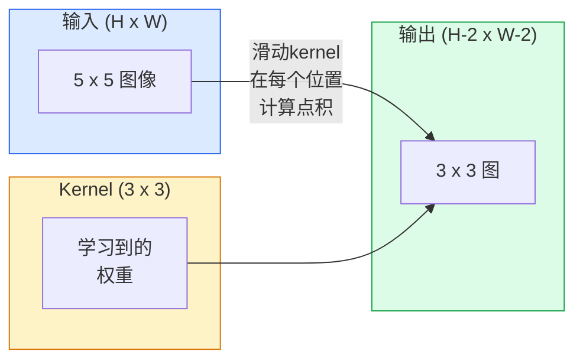
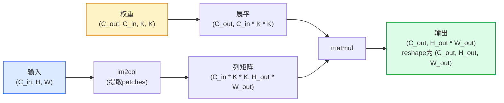

# 从零实现卷积

> 卷积是一个微小的全连接层，你在图像上滑动它，在每个位置共享相同的权重。

**类型：** 构建
**语言：** Python
**前置条件：** 阶段3（深度学习核心），阶段4 第01课（图像基础）
**时间：** ~75分钟

## 学习目标

- 仅使用NumPy从零实现2D卷积，包括嵌套循环版本和向量化的`im2col`版本
- 对输入大小、kernel大小、padding和stride的任意组合计算输出空间尺寸，并证明公式 `(H - K + 2P) / S + 1`
- 手工设计kernels（边缘、模糊、锐化、Sobel），并解释为什么每个kernel产生它所产生的激活模式
- 将卷积堆叠成特征提取器，并将堆叠深度与感受野大小联系起来

## 问题

在一个224x224 RGB图像上的全连接层，每个神经元需要224 * 224 * 3 = 150,528个输入权重。一个带有1,000个单元的隐藏层在学到任何有用东西之前就已经有1.5亿个参数。更糟糕的是，该层没有意识到左上角的狗和右下角的狗是相同的模式。它将每个像素位置视为独立的，这对图像来说完全是错误的：将猫平移三个像素不应该迫使网络重新学习这个概念。

图像模型需要的两个属性是**平移等变性**（输入移动时输出也移动）和**参数共享**（相同的特征检测器在所有位置运行）。全连接层两者都不能提供。卷积免费提供了两者。

卷积并非为深度学习而发明。它是为JPEG压缩、Photoshop中的高斯模糊、工业视觉中的边缘检测以及每个已发布的音频滤波器提供动力的相同操作。CNN在2012年至2020年间主导ImageNet的原因是，对于相邻值相关且相同模式可能出现在任何位置的数据，卷积是正确的先验知识。

## 概念

### 一个kernel，滑动

2D卷积使用一个称为kernel（或filter）的小权重矩阵，在输入上滑动它，并在每个位置计算逐元素乘积之和。该和成为一个输出像素。


```mermaid
flowchart LR
    subgraph IN["输入 (H x W)"]
        direction LR
        I1["5 x 5 图像"]
    end
    subgraph K["Kernel (3 x 3)"]
        K1["学习到的<br/>权重"]
    end
    subgraph OUT["输出 (H-2 x W-2)"]
        O1["3 x 3 图"]
    end
    I1 --> |"滑动kernel<br/>在每个位置<br/>计算点积"| O1
    K1 --> O1

    style IN fill:#dbeafe,stroke:#2563eb
    style K fill:#fef3c7,stroke:#d97706
    style OUT fill:#dcfce7,stroke:#16a34a
```

一个在5x5输入上的具体3x3示例（无padding，stride 1）：

```
输入 X (5 x 5):                Kernel W (3 x 3):

  1  2  0  1  2                   1  0 -1
  0  1  3  1  0                   2  0 -2
  2  1  0  2  1                   1  0 -1
  1  0  2  1  3
  2  1  1  0  1

kernel在每个有效的3 x 3窗口上滑动。输出Y为3 x 3：

 Y[0,0] = sum( W * X[0:3, 0:3] )
 Y[0,1] = sum( W * X[0:3, 1:4] )
 Y[0,2] = sum( W * X[0:3, 2:5] )
 Y[1,0] = sum( W * X[1:4, 0:3] )
 ... 依此类推
```

那一个公式 — **共享权重、局部性、滑动窗口** — 就是全部思想。其他一切都是簿记工作。

### 输出尺寸公式

给定输入空间尺寸`H`、kernel尺寸`K`、padding `P`、stride `S`：

```
H_out = floor( (H - K + 2P) / S ) + 1
```

记住这个公式。你会在每个架构中计算它几十次。

| 场景 | H | K | P | S | H_out |
|----------|---|---|---|---|-------|
| Valid conv，无padding | 32 | 3 | 0 | 1 | 30 |
| Same conv（保持尺寸） | 32 | 3 | 1 | 1 | 32 |
| 按2下采样 | 32 | 3 | 1 | 2 | 16 |
| Pool 2x2 | 32 | 2 | 0 | 2 | 16 |
| 大感受野 | 32 | 7 | 3 | 2 | 16 |

"Same padding"意味着选择P使得当S == 1时H_out == H。对于奇数K，即P = (K - 1) / 2。这就是为什么3x3 kernels占主导地位 — 它们是仍具有中心的最小奇数kernel。

### Padding

没有padding，每个卷积都会缩小特征图。堆叠20个，你的224x224图像会变成184x184，这会在边界上浪费计算，并使需要匹配形状的残差连接复杂化。

```
在5 x 5输入上的Zero padding (P = 1)：

  0  0  0  0  0  0  0
  0  1  2  0  1  2  0
  0  0  1  3  1  0  0
  0  2  1  0  2  1  0      现在kernel可以以像素(0, 0)为中心，
  0  1  0  2  1  3  0      并且仍然有三行三列的值可以相乘。
  0  2  1  1  0  1  0
  0  0  0  0  0  0  0
```

实践中遇到的模式：`zero`（最常见）、`reflect`（镜像边缘，避免生成模型中的硬边界）、`replicate`（复制边缘）、`circular`（循环环绕，用于环形问题）。

### Stride

Stride是滑动的步长。`stride=1`是默认值。`stride=2`将空间尺寸减半，是在CNN内下采样而不需要单独pooling层的经典方法 — 每个现代架构（ResNet、ConvNeXt、MobileNet）都在某处使用strided convs代替max-pool。

```
在5 x 5输入上的Stride 1，3 x 3 kernel：

  开始: (0,0) (0,1) (0,2)        -> 输出行 0
          (1,0) (1,1) (1,2)        -> 输出行 1
          (2,0) (2,1) (2,2)        -> 输出行 2

  输出: 3 x 3

相同输入上的Stride 2：

  开始: (0,0) (0,2)              -> 输出行 0
          (2,0) (2,2)              -> 输出行 1

  输出: 2 x 2
```

### 多输入通道

真实图像有三个通道。RGB输入上的3x3卷积实际上是一个3x3x3的体积：每个输入通道一个3x3切片。在每个空间位置，你跨所有三个切片相乘并求和，然后添加一个bias。

```
输入:   (C_in,  H,  W)        3 x 5 x 5
Kernel:  (C_in,  K,  K)        3 x 3 x 3 (一个kernel)
输出:  (1,     H', W')       2D图

对于产生C_out输出通道的层，你堆叠C_out个kernels：

权重:  (C_out, C_in, K, K)   例如 64 x 3 x 3 x 3
输出:  (C_out, H', W')       64 x 3 x 3

参数数量: C_out * C_in * K * K + C_out   (+ C_out 是 bias)
```

最后一行是你在规划模型时会计算的。一个3通道输入上的64通道3x3 conv有 `64 * 3 * 3 * 3 + 64 = 1,792`个参数。很便宜。

### im2col技巧

嵌套循环易于阅读但速度慢。GPU需要大型矩阵乘法。技巧：将输入的每个感受野窗口展平为大矩阵的一列，将kernel展平为一行，整个卷积就变成了一次matmul。


```mermaid
flowchart LR
    X["输入<br/>(C_in, H, W)"] --> IM2COL["im2col<br/>(提取patches)"]
    IM2COL --> COLS["列矩阵<br/>(C_in * K * K, H_out * W_out)"]
    W["权重<br/>(C_out, C_in, K, K)"] --> FLAT["展平<br/>(C_out, C_in * K * K)"]
    FLAT --> MM["matmul"]
    COLS --> MM
    MM --> OUT["输出<br/>(C_out, H_out * W_out)<br/>reshape为 (C_out, H_out, W_out)"]

    style X fill:#dbeafe,stroke:#2563eb
    style W fill:#fef3c7,stroke:#d97706
    style OUT fill:#dcfce7,stroke:#16a34a
```

每个生产级conv实现都是这个的某种变体，加上cache-tiling技巧（direct conv、Winograd、大kernel的FFT conv）。理解im2col，你就理解了核心。

### 感受野

单个3x3 conv查看9个输入像素。堆叠两个3x3 conv，第二层中的一个神经元查看5x5个输入像素。三个3x3 conv给出7x7。一般来说：

```
RF after L stacked K x K convs (stride 1) = 1 + L * (K - 1)

使用strides：感受野随每层的stride呈乘法增长。
```

"一路3x3"（VGG、ResNet、ConvNeXt）有效的全部原因在于，两个3x3 conv看到与一个5x5 conv相同的输入区域，但参数更少，中间还有一个额外的非线性层。

```figure
convolution-kernel
```

## 构建

### 第1步：填充数组

从最小的原语开始：一个在H x W数组周围补零的函数。

```python
import numpy as np

def pad2d(x, p):
    if p == 0:
        return x
    h, w = x.shape[-2:]
    out = np.zeros(x.shape[:-2] + (h + 2 * p, w + 2 * p), dtype=x.dtype)
    out[..., p:p + h, p:p + w] = x
    return out

x = np.arange(9).reshape(3, 3)
print(x)
print()
print(pad2d(x, 1))
```

尾轴技巧 `x.shape[:-2]` 意味着相同的函数无需修改即可在 `(H, W)`、`(C, H, W)` 或 `(N, C, H, W)` 上工作。

### 第2步：带嵌套循环的2D卷积

参考实现 — 慢，但明确无误。这就是 `torch.nn.functional.conv2d` 在原理上所做的事情。

```python
def conv2d_naive(x, w, b=None, stride=1, padding=0):
    c_in, h, w_in = x.shape
    c_out, c_in_w, kh, kw = w.shape
    assert c_in == c_in_w

    x_pad = pad2d(x, padding)
    h_out = (h + 2 * padding - kh) // stride + 1
    w_out = (w_in + 2 * padding - kw) // stride + 1

    out = np.zeros((c_out, h_out, w_out), dtype=np.float32)
    for oc in range(c_out):
        for i in range(h_out):
            for j in range(w_out):
                hs = i * stride
                ws = j * stride
                patch = x_pad[:, hs:hs + kh, ws:ws + kw]
                out[oc, i, j] = np.sum(patch * w[oc])
        if b is not None:
            out[oc] += b[oc]
    return out
```

四个嵌套循环（输出通道、行、列，加上对C_in、kh、kw的隐式求和）。这是你将对照检查每个更快实现的基本事实。

### 第3步：用手工设计的kernel验证

构建一个垂直Sobel kernel，应用于合成阶跃图像，观察垂直边缘亮起。

```python
def synthetic_step_image():
    img = np.zeros((1, 16, 16), dtype=np.float32)
    img[:, :, 8:] = 1.0
    return img

sobel_x = np.array([
    [[-1, 0, 1],
     [-2, 0, 2],
     [-1, 0, 1]]
], dtype=np.float32)[None]

x = synthetic_step_image()
y = conv2d_naive(x, sobel_x, padding=1)
print(y[0].round(1))
```

期望在第7列看到大的正值（从左到右的亮度增加），其他地方为零。那一次打印就是你检查数学是否正确的基本验证。

### 第4步：im2col

将输入中每个kernel大小的窗口转换为矩阵的一列。对于 `C_in=3, K=3`，每列是27个数字。

```python
def im2col(x, kh, kw, stride=1, padding=0):
    c_in, h, w = x.shape
    x_pad = pad2d(x, padding)
    h_out = (h + 2 * padding - kh) // stride + 1
    w_out = (w + 2 * padding - kw) // stride + 1

    cols = np.zeros((c_in * kh * kw, h_out * w_out), dtype=x.dtype)
    col = 0
    for i in range(h_out):
        for j in range(w_out):
            hs = i * stride
            ws = j * stride
            patch = x_pad[:, hs:hs + kh, ws:ws + kw]
            cols[:, col] = patch.reshape(-1)
            col += 1
    return cols, h_out, w_out
```

它仍然是一个Python循环，但现在繁重的工作将是一次向量化的matmul。

### 第5步：通过im2col + matmul实现快速卷积

用一次矩阵乘法替换四重循环。

```python
def conv2d_im2col(x, w, b=None, stride=1, padding=0):
    c_out, c_in, kh, kw = w.shape
    cols, h_out, w_out = im2col(x, kh, kw, stride, padding)
    w_flat = w.reshape(c_out, -1)
    out = w_flat @ cols
    if b is not None:
        out += b[:, None]
    return out.reshape(c_out, h_out, w_out)
```

正确性检查：运行两种实现并比较。

```python
rng = np.random.default_rng(0)
x = rng.normal(0, 1, (3, 16, 16)).astype(np.float32)
w = rng.normal(0, 1, (8, 3, 3, 3)).astype(np.float32)
b = rng.normal(0, 1, (8,)).astype(np.float32)

y_naive = conv2d_naive(x, w, b, padding=1)
y_im2col = conv2d_im2col(x, w, b, padding=1)

print(f"max abs diff: {np.max(np.abs(y_naive - y_im2col)):.2e}")
```

`max abs diff` 应该在 `1e-5` 左右 — 差异来自浮点数累加顺序，而非bug。

### 第6步：一组手工设计的kernels

五个滤波器，展示单个conv层在任何训练之前可以表达什么。

```python
KERNELS = {
    "identity": np.array([[0, 0, 0], [0, 1, 0], [0, 0, 0]], dtype=np.float32),
    "blur_3x3": np.ones((3, 3), dtype=np.float32) / 9.0,
    "sharpen": np.array([[0, -1, 0], [-1, 5, -1], [0, -1, 0]], dtype=np.float32),
    "sobel_x": np.array([[-1, 0, 1], [-2, 0, 2], [-1, 0, 1]], dtype=np.float32),
    "sobel_y": np.array([[-1, -2, -1], [0, 0, 0], [1, 2, 1]], dtype=np.float32),
}

def apply_kernel(img2d, kernel):
    x = img2d[None].astype(np.float32)
    w = kernel[None, None]
    return conv2d_im2col(x, w, padding=1)[0]
```

应用于任何灰度图像，blur柔化，sharpen使边缘更锐利，Sobel-x点亮垂直边缘，Sobel-y点亮水平边缘。这些正是AlexNet和VGG中*第一个*训练过的conv layer最终学到的模式 — 因为一个好的图像模型无论后续任务是什么，都需要边缘和斑点检测器。

## 使用

PyTorch的 `nn.Conv2d` 封装了相同的操作，带有autograd、CUDA kernels和cuDNN优化。形状语义完全相同。

```python
import torch
import torch.nn as nn

conv = nn.Conv2d(in_channels=3, out_channels=64, kernel_size=3, stride=1, padding=1)
print(conv)
print(f"weight shape: {tuple(conv.weight.shape)}   # (C_out, C_in, K, K)")
print(f"bias shape:   {tuple(conv.bias.shape)}")
print(f"param count:  {sum(p.numel() for p in conv.parameters())}")

x = torch.randn(8, 3, 224, 224)
y = conv(x)
print(f"\ninput  shape: {tuple(x.shape)}")
print(f"output shape: {tuple(y.shape)}")
```

将 `padding=1` 换成 `padding=0`，输出降为222x222。将 `stride=1` 换成 `stride=2`，输出降为112x112。与你上面记住的公式相同。

## 交付物

本课产出：

- `outputs/prompt-cnn-architect.md` — 一个prompt，给定输入尺寸、参数预算和目标感受野，设计一个在每个步骤具有正确K/S/P的`Conv2d`层堆叠。
- `outputs/skill-conv-shape-calculator.md` — 一个技能，逐层遍历网络规格，返回每个块的输出形状、感受野和参数数量。

## 练习

1. **(简单)** 给定128x128灰度输入和一个堆叠 `[Conv3x3(s=1,p=1), Conv3x3(s=2,p=1), Conv3x3(s=1,p=1), Conv3x3(s=2,p=1)]`，手动计算每层的输出空间尺寸和感受野。用PyTorch的带虚拟conv的`nn.Sequential`验证。
2. **(中等)** 扩展`conv2d_naive`和`conv2d_im2col`以接受`groups`参数。证明`groups=C_in=C_out`实现了depthwise convolution，其参数数量为`C * K * K`而不是`C * C * K * K`。
3. **(困难)** 手动实现`conv2d_im2col`的反向传播：给定输出的梯度，计算`x`和`w`的梯度。在相同输入和权重上对照`torch.autograd.grad`验证。技巧：im2col的梯度是`col2im`，它必须累加重叠窗口。

## 关键术语

| 术语 | 人们的说法 | 实际含义 |
|------|----------------|----------------------|
| Convolution | "滑动一个滤波器" | 在每个空间位置应用的可学习点积，共享权重；数学上是cross-correlation，但每个人都称之为convolution |
| Kernel / filter | "特征检测器" | 形状为(C_in, K, K)的小权重张量，其与输入窗口的点积产生一个输出像素 |
| Stride | "你跳多远" | 连续kernel放置之间的步长；stride 2将每个空间维度减半 |
| Padding | "边缘上的零" | 输入周围添加的额外值，使kernel可以在边界像素上居中；`same` padding使输出尺寸等于输入尺寸 |
| Receptive field | "神经元看到多少" | 给定输出激活所依赖的原始输入块，随深度和stride增长 |
| im2col | "GEMM技巧" | 将每个感受窗口重新排列成列，使卷积成为一次大矩阵乘法 — 每个快速conv kernel的核心 |
| Depthwise conv | "每个通道一个kernel" | `groups == C_in`的conv，每个输出通道只从其匹配的输入通道计算；MobileNet和ConvNeXt的骨干 |
| Translation equivariance | "平移输入，平移输出" | 将输入平移k个像素会使输出平移k个像素的属性；共享权重免费提供的特性 |

## 延伸阅读

- [A guide to convolution arithmetic for deep learning (Dumoulin & Visin, 2016)](https://arxiv.org/abs/1603.07285) — 每个课程都在悄悄复制的padding/stride/dilation的权威图解
- [CS231n: Convolutional Neural Networks for Visual Recognition](https://cs231n.github.io/convolutional-networks/) — 规范的讲义笔记，包括原始的im2col解释
- [The Annotated ConvNet (fast.ai)](https://nbviewer.org/github/fastai/fastbook/blob/master/13_convolutions.ipynb) — 一个从手动卷积到训练好的数字分类器的Notebook教程
- [Receptive Field Arithmetic for CNNs (Dang Ha The Hien)](https://distill.pub/2019/computing-receptive-fields/) — 感受野计算的论文级交互式讲解
