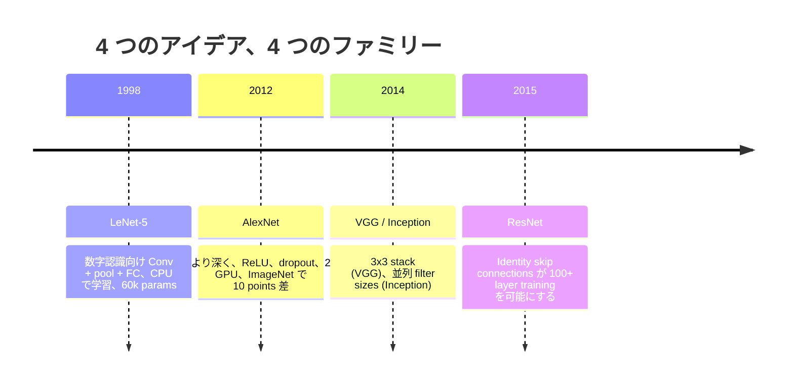
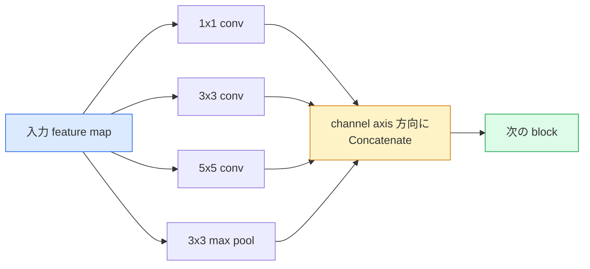
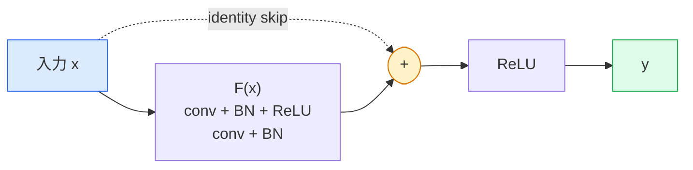

# CNN：LeNet から ResNet まで

> 過去30年の主要な CNN はどれも、conv、非線形、ダウンサンプリングという同じレシピに、新しいアイデアを 1 つ継ぎ足したものです。そのアイデアを順番に学びます。

**種類:** Learn + Build
**言語:** Python
**前提条件:** フェーズ 3 レッスン 11 (PyTorch), フェーズ 4 レッスン 01 (画像の基礎), フェーズ 4 レッスン 02 (畳み込みをスクラッチから)
**所要時間:** 約75分

## 学習目標

- LeNet-5 -> AlexNet -> VGG -> Inception -> ResNet というアーキテクチャの系譜をたどり、各ファミリーが追加した 1 つの新しいアイデアを説明する
- LeNet-5、VGG 風ブロック、ResNet BasicBlock をそれぞれ 40 行未満で PyTorch 実装する
- 残差接続が、1,000 層ネットワークを訓練不能なものから最先端水準へ変える理由を説明する
- 現代的なバックボーン (ResNet-18, ResNet-50) を読み、ソースを見る前に出力 shape、受容野、パラメータ数を予測する

## 問題

2011 年、最高の ImageNet 分類器は top-5 accuracy でおよそ 74% でした。2012 年に AlexNet は 85% を出しました。2015 年に ResNet は 96% を出しました。新しいデータはありません。新しい GPU 世代もありません。改善はアーキテクチャのアイデアから生まれました。実務の vision engineer は、どのアイデアがどの論文から来たのかを知っている必要があります。2026 年に本番へ出すあらゆる backbone は、同じ部品を組み合わせ直したものだからです。そして、そのアイデアは転用され続けています。grouped conv は CNN から transformer へ移り、residual connection は ResNet から現存するすべての LLM へ移り、batch normalisation は diffusion model の中で使われています。

これらのネットワークを順に学ぶことは、よくあるミスへの免疫にもなります。LeNet サイズのネットワークで解ける問題に、利用可能な最大モデルを使ってしまうミスです。MNIST に ResNet は要りません。各ファミリーのスケーリング曲線を知っていれば、その曲線のどこに座るべきかが分かります。

## コンセプト

### 画像認識を変えた 4 つのアイデア



古典的な画像認識では、この 4 つの飛躍ほど重要だったものはありません。

### LeNet-5 (1998)

Yann LeCun の手書き数字認識器です。60,000 パラメータ。2 つの conv-pool ブロック、2 つの fully connected layer、tanh activation。すべての CNN が継承するテンプレートを定義しました。

```
input (1, 32, 32)
  conv 5x5 -> (6, 28, 28)
  avg pool 2x2 -> (6, 14, 14)
  conv 5x5 -> (16, 10, 10)
  avg pool 2x2 -> (16, 5, 5)
  flatten -> 400
  dense -> 120
  dense -> 84
  dense -> 10
```

現代で CNN と呼ばれるもの、つまり畳み込みとダウンサンプリングを交互に重ね、最後に小さな classifier head へ渡す構造は、層を増やし、チャネルを太くし、activation を良くした LeNet です。

### AlexNet (2012)

ImageNet を突破したのは、3 つの変更を同時に入れたからです。

1. tanh の代わりに **ReLU**。勾配が消えにくくなり、学習が約 6 倍速くなりました。
2. fully connected head に **Dropout**。正則化が小技ではなく layer になりました。
3. **深さと幅**。5 つの conv layer、3 つの dense layer、60M パラメータ。モデルを 2 つの GPU に分割して学習しました。

論文の図 2 には、GPU 分割が 2 本の並列ストリームとして今も描かれています。この並列化はアーキテクチャ上の洞察ではなく、ハードウェア上の回避策でした。ただし、上の 3 つのアイデアはいま使うすべてのモデルに残っています。

### VGG (2014)

VGG が問うたのは、3x3 convolution だけを使って深くしたら何が起きるか、でした。

```
stack:   conv 3x3 -> conv 3x3 -> pool 2x2
repeat:  16 or 19 conv layers
```

2 つの 3x3 conv は、1 つの 5x5 conv と同じ 5x5 入力領域を見ます。しかしパラメータは少なく (2*9*C^2 = 18C^2 vs 25*C^2)、間に ReLU が 1 つ増えます。VGG はこの観察をアーキテクチャ全体にしました。1 種類のブロックを繰り返すだけという単純さにより、VGG はその後のあらゆるモデルの参照点になりました。

代償は 138M パラメータ、遅い学習、高価な推論です。

### Inception (2014、同年)

「どの kernel size を使うべきか」という問いに対する Google の答えは「全部を並列に使う」でした。



各 branch はそれぞれ特化します。1x1 はチャネル混合、3x3 は局所テクスチャ、5x5 はより大きなパターン、pooling は shift-invariant feature です。concat によって次の layer は有用な branch を選べます。Inception v1 は、パラメータ数を現実的に保つため、各 branch の内部で 1x1 convolution を bottleneck として使いました。

### 劣化問題

2015 年までに、VGG-19 は動きましたが VGG-32 は動きませんでした。深さは役立つはずでしたが、約 20 層を超えると training loss も test loss も悪化しました。これは overfitting ではありません。勾配が各 layer を通るたびに乗算的に小さくなり、optimizer が有用な重みを見つけられなくなる問題です。

```
Plain deep network:
  y = f_L( f_{L-1}( ... f_1(x) ... ) )

early layer に関する gradient:
  dL/dW_1 = dL/dy * df_L/df_{L-1} * ... * df_2/df_1 * df_1/dW_1

各乗算項の大きさは、おおよそ (weight magnitude) * (activation gain) です。
gain < 1 の項を 100 個積むと、gradient は実質的にゼロになります。
```

VGG が 19 層で動いたのは、同時期に発表された batch norm が activation のスケールをうまく保ったからです。しかし batch norm でさえ、30 層程度を超えた深さは救えませんでした。

### ResNet (2015)

He、Zhang、Ren、Sun は、すべてを直す 1 つの変更を提案しました。

```
standard block:   y = F(x)
residual block:   y = F(x) + x
```

`+ x` があるため、layer は `F(x)` をゼロへ近づけることで、いつでも何もしないことを選べます。1,000 層の ResNet は、追加されたすべての block に自明な逃げ道があるため、少なくとも 1 層ネットワークより極端に悪くなりにくくなります。この保証があると、optimizer は各 block を少しだけ有用にする方向へ進めます。そして少しだけ有用なものを 100 回積むと、最先端性能になります。



この block には、あらゆる場所で見かける 2 つの variant があります。

- **BasicBlock** (ResNet-18, ResNet-34): 2 つの 3x3 conv をまとめて skip します。
- **Bottleneck** (ResNet-50, -101, -152): 1x1 down、3x3 middle、1x1 up の 3 つをまとめて skip します。チャネル数が大きいと安価です。

skip が downsample (stride=2) をまたぐ必要があるとき、identity path は shape を合わせるために 1x1 stride=2 conv へ置き換えられます。

### 残差が vision を超えて重要な理由

このアイデアは本質的には画像分類の話ではありませんでした。深いネットワークを「うまく勾配が残ることを祈るもの」から、信頼できてスケールするエンジニアリング道具へ変える話でした。次のフェーズで読むすべての transformer は、各 block にまったく同じ skip connection を持っています。ResNet がなければ GPT はありません。

## 作ってみる

### ステップ 1: LeNet-5

最小限で忠実な LeNet です。Tanh activation、average pooling。現代向けにした唯一の譲歩は、元の Gaussian connections ではなく、下流で `nn.CrossEntropyLoss` を使う点です。

```python
import torch
import torch.nn as nn
import torch.nn.functional as F

class LeNet5(nn.Module):
    def __init__(self, num_classes=10):
        super().__init__()
        self.conv1 = nn.Conv2d(1, 6, kernel_size=5)
        self.conv2 = nn.Conv2d(6, 16, kernel_size=5)
        self.pool = nn.AvgPool2d(2)
        self.fc1 = nn.Linear(16 * 5 * 5, 120)
        self.fc2 = nn.Linear(120, 84)
        self.fc3 = nn.Linear(84, num_classes)

    def forward(self, x):
        x = self.pool(torch.tanh(self.conv1(x)))
        x = self.pool(torch.tanh(self.conv2(x)))
        x = torch.flatten(x, 1)
        x = torch.tanh(self.fc1(x))
        x = torch.tanh(self.fc2(x))
        return self.fc3(x)

net = LeNet5()
x = torch.randn(1, 1, 32, 32)
print(f"output: {net(x).shape}")
print(f"params: {sum(p.numel() for p in net.parameters()):,}")
```

期待される出力は `output: torch.Size([1, 10])`、`params: 61,706` です。これが、現代的な vision の出発点になった数字分類器の全体です。

### ステップ 2: VGG block

再利用できる block を 1 つ作ります。2 つの 3x3 conv、ReLU、batch norm、max pool です。

```python
class VGGBlock(nn.Module):
    def __init__(self, in_c, out_c):
        super().__init__()
        self.conv1 = nn.Conv2d(in_c, out_c, kernel_size=3, padding=1)
        self.bn1 = nn.BatchNorm2d(out_c)
        self.conv2 = nn.Conv2d(out_c, out_c, kernel_size=3, padding=1)
        self.bn2 = nn.BatchNorm2d(out_c)
        self.pool = nn.MaxPool2d(2)

    def forward(self, x):
        x = F.relu(self.bn1(self.conv1(x)))
        x = F.relu(self.bn2(self.conv2(x)))
        return self.pool(x)

class MiniVGG(nn.Module):
    def __init__(self, num_classes=10):
        super().__init__()
        self.stack = nn.Sequential(
            VGGBlock(3, 32),
            VGGBlock(32, 64),
            VGGBlock(64, 128),
        )
        self.head = nn.Sequential(
            nn.AdaptiveAvgPool2d(1),
            nn.Flatten(),
            nn.Linear(128, num_classes),
        )

    def forward(self, x):
        return self.head(self.stack(x))

net = MiniVGG()
x = torch.randn(1, 3, 32, 32)
print(f"output: {net(x).shape}")
print(f"params: {sum(p.numel() for p in net.parameters()):,}")
```

CIFAR サイズの入力に 3 つの VGG block、adaptive pool、linear layer を 1 つ。約 290k パラメータです。CIFAR-10 には十分です。

### ステップ 3: ResNet BasicBlock

ResNet-18 と ResNet-34 の中核になる building block です。

```python
class BasicBlock(nn.Module):
    def __init__(self, in_c, out_c, stride=1):
        super().__init__()
        self.conv1 = nn.Conv2d(in_c, out_c, kernel_size=3, stride=stride, padding=1, bias=False)
        self.bn1 = nn.BatchNorm2d(out_c)
        self.conv2 = nn.Conv2d(out_c, out_c, kernel_size=3, stride=1, padding=1, bias=False)
        self.bn2 = nn.BatchNorm2d(out_c)
        if stride != 1 or in_c != out_c:
            self.shortcut = nn.Sequential(
                nn.Conv2d(in_c, out_c, kernel_size=1, stride=stride, bias=False),
                nn.BatchNorm2d(out_c),
            )
        else:
            self.shortcut = nn.Identity()

    def forward(self, x):
        out = F.relu(self.bn1(self.conv1(x)))
        out = self.bn2(self.conv2(out))
        out = out + self.shortcut(x)
        return F.relu(out)
```

conv layer の `bias=False` は batch-norm の慣習です。BN の beta parameter がすでに bias を担うため、conv bias まで持つのは無駄です。`shortcut` に本物の conv が必要なのは、stride または channel count が変わるときだけです。それ以外は no-op の identity です。

### ステップ 4: 小さな ResNet

BasicBlock の group を 4 つ積んで、CIFAR サイズ入力で動く ResNet を作ります。

```python
class TinyResNet(nn.Module):
    def __init__(self, num_classes=10):
        super().__init__()
        self.stem = nn.Sequential(
            nn.Conv2d(3, 32, kernel_size=3, stride=1, padding=1, bias=False),
            nn.BatchNorm2d(32),
            nn.ReLU(inplace=True),
        )
        self.layer1 = self._make_group(32, 32, num_blocks=2, stride=1)
        self.layer2 = self._make_group(32, 64, num_blocks=2, stride=2)
        self.layer3 = self._make_group(64, 128, num_blocks=2, stride=2)
        self.layer4 = self._make_group(128, 256, num_blocks=2, stride=2)
        self.head = nn.Sequential(
            nn.AdaptiveAvgPool2d(1),
            nn.Flatten(),
            nn.Linear(256, num_classes),
        )

    def _make_group(self, in_c, out_c, num_blocks, stride):
        blocks = [BasicBlock(in_c, out_c, stride=stride)]
        for _ in range(num_blocks - 1):
            blocks.append(BasicBlock(out_c, out_c, stride=1))
        return nn.Sequential(*blocks)

    def forward(self, x):
        x = self.stem(x)
        x = self.layer1(x)
        x = self.layer2(x)
        x = self.layer3(x)
        x = self.layer4(x)
        return self.head(x)

net = TinyResNet()
x = torch.randn(1, 3, 32, 32)
print(f"output: {net(x).shape}")
print(f"params: {sum(p.numel() for p in net.parameters()):,}")
```

各 group は 2 block。group 2、3、4 の先頭で stride 2。downsample のたびに channel count を倍にします。およそ 2.8M パラメータです。これが ResNet-152 まできれいにスケールする標準レシピです。

### ステップ 5: パラメータあたりの特徴効率を比較する

同じ入力を 3 つのネットワークに通し、パラメータ数を比較します。

```python
def summary(name, net, x):
    y = net(x)
    params = sum(p.numel() for p in net.parameters())
    print(f"{name:12s}  input {tuple(x.shape)} -> output {tuple(y.shape)}  params {params:>10,}")

x = torch.randn(1, 3, 32, 32)
summary("LeNet5",     LeNet5(),       torch.randn(1, 1, 32, 32))
summary("MiniVGG",    MiniVGG(),      x)
summary("TinyResNet", TinyResNet(),   x)
```

3 つのモデル、3 つの時代、パラメータ数は 3 桁違います。CIFAR-10 accuracy については、数 epoch 学習した後におおよそ LeNet 60%、MiniVGG 89%、TinyResNet 93% が必要な目安です。

## 使ってみる

`torchvision.models` には、上で見たすべての事前学習済み version があります。呼び出しシグネチャはファミリー間で同じです。これこそが backbone abstraction の要点です。

```python
from torchvision.models import resnet18, ResNet18_Weights, vgg16, VGG16_Weights

r18 = resnet18(weights=ResNet18_Weights.IMAGENET1K_V1)
r18.eval()

print(f"ResNet-18 params: {sum(p.numel() for p in r18.parameters()):,}")
print(r18.layer1[0])
print()

v16 = vgg16(weights=VGG16_Weights.IMAGENET1K_V1)
v16.eval()
print(f"VGG-16   params: {sum(p.numel() for p in v16.parameters()):,}")
```

ResNet-18 は 11.7M パラメータです。VGG-16 は 138M です。ImageNet top-1 accuracy は近い値です (69.8% vs 71.6%)。residual connection によって、パラメータ効率が 12 倍改善します。これが、2016 年から 2021 年に ViT が登場するまで ResNet variant が支配的だった理由です。そして compute が制約になる現実の deployment では、今も支配的です。

Transfer learning のレシピは常に同じです。pretrained を読み込み、backbone を freeze し、classifier head を置き換えます。

```python
for p in r18.parameters():
    p.requires_grad = False
r18.fc = nn.Linear(r18.fc.in_features, 10)
```

3 行です。これで、ImageNet が払った表現を受け継ぐ 10-class CIFAR classifier が手に入ります。

## 出荷する

このレッスンが出荷するものは次のとおりです。

- `outputs/prompt-backbone-selector.md`: task、dataset size、compute budget から適切な CNN family (LeNet/VGG/ResNet/MobileNet/ConvNeXt) を選ぶ prompt。
- `outputs/skill-residual-block-reviewer.md`: PyTorch module を読み、skip-connection のミス (stride change 時の shortcut 欠落、shortcut activation order、addition に対する BN placement) を検出する skill。

## 演習

1. **(初級)** `TinyResNet` のパラメータを layer ごとに手で数えてください。`sum(p.numel() for p in net.parameters())` と比較します。パラメータ予算の大半はどこにありますか。convs、BN、classifier head のどれでしょうか。
2. **(中級)** Bottleneck block (skip 付きの 1x1 -> 3x3 -> 1x1) を実装し、それを使って CIFAR 向けの ResNet-50 風ネットワークを作ってください。`TinyResNet` と params を比較します。
3. **(上級)** `BasicBlock` から skip connection を取り除き、34-block の "plain" network と 34-block ResNet を CIFAR-10 でそれぞれ 10 epoch 学習してください。両方の training loss vs epoch を plot します。plain deep network が浅い twin より高い loss へ収束する、He et al. 図 1 の結果を再現してください。

## 重要用語

| 用語 | よく言われること | 実際の意味 |
|------|----------------|------------|
| Backbone | 「モデル」 | task head に渡される feature map を生成する convolutional block の stack |
| Residual connection | 「Skip connection」 | `y = F(x) + x`。F をゼロに設定することで optimizer が identity を学べるため、任意の深さを訓練可能にする |
| BasicBlock | 「skip 付きの 2 つの 3x3 conv」 | ResNet-18/34 の building block。conv-BN-ReLU-conv-BN-add-ReLU |
| Bottleneck | 「1x1 down、3x3、1x1 up」 | ResNet-50/101/152 の block。3x3 が縮小された幅で走るため、高い channel count で安価 |
| Degradation problem | 「深いほど悪い」 | 約 20 層を超える plain conv layer で training error と test error の両方が増える問題。追加データではなく residual connection で解決される |
| Stem | 「最初の layer」 | 3-channel input を base feature width に変換する最初の conv。通常、ImageNet では 7x7 stride 2、CIFAR では 3x3 stride 1 |
| Head | 「分類器」 | 最後の backbone block の後にある layer。adaptive pool、flatten、linear(s) |
| Transfer learning | 「Pretrained weights」 | ImageNet で学習した backbone を読み込み、自分の task では head だけを fine-tune すること |

## 参考資料

- [Deep Residual Learning for Image Recognition (He et al., 2015)](https://arxiv.org/abs/1512.03385): ResNet 論文。すべての figure に学ぶ価値があります
- [Very Deep Convolutional Networks (Simonyan & Zisserman, 2014)](https://arxiv.org/abs/1409.1556): VGG 論文。"why 3x3" について今も最高の参照資料です
- [ImageNet Classification with Deep CNNs (Krizhevsky et al., 2012)](https://papers.nips.cc/paper_files/paper/2012/hash/c399862d3b9d6b76c8436e924a68c45b-Abstract.html): AlexNet。hand-crafted feature の時代を終わらせた論文です
- [Going Deeper with Convolutions (Szegedy et al., 2014)](https://arxiv.org/abs/1409.4842): Inception v1。vision transformer にも今なお現れる parallel-filter idea です
