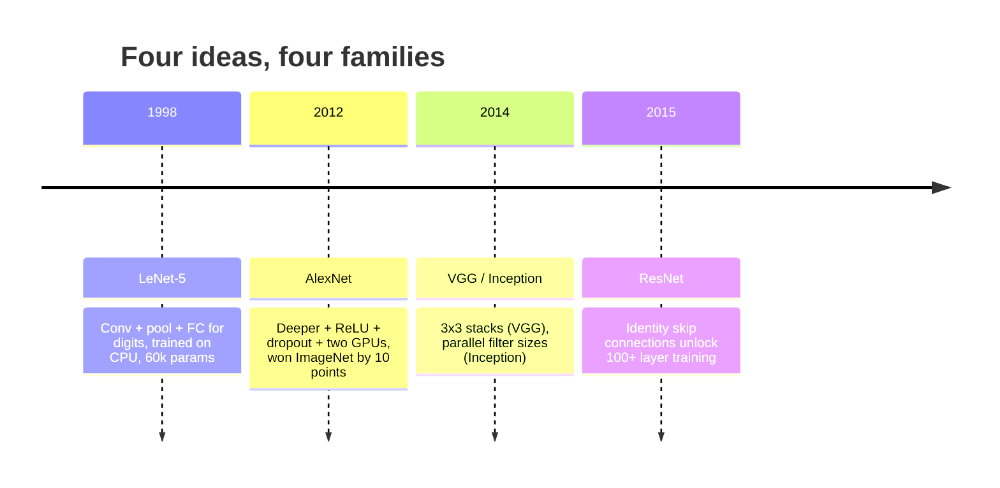
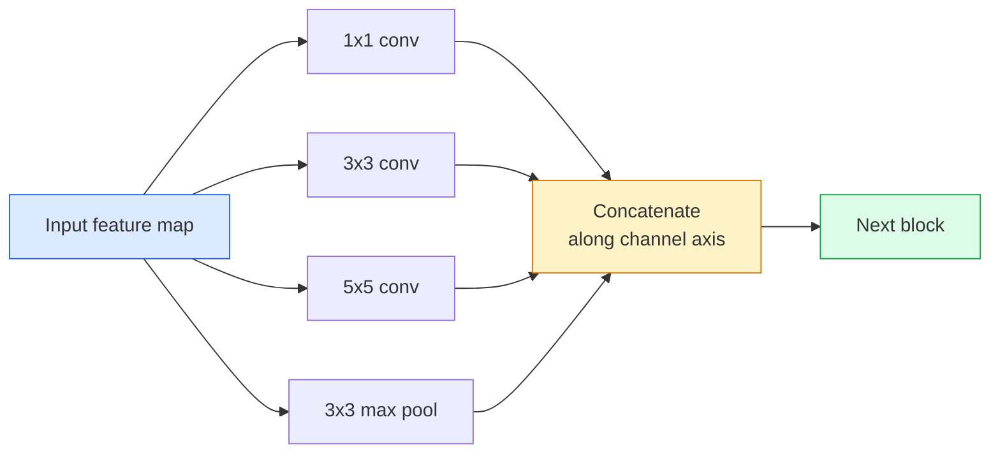
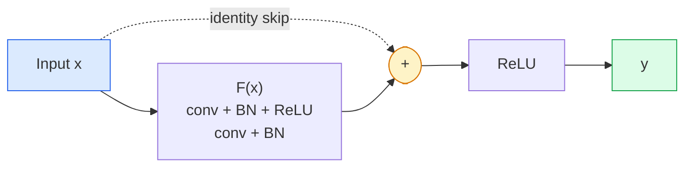

# CNN — LeNet'ten ResNet'e

> Son otuz yılın her büyük CNN'i, üzerine yeni bir fikir eklenen aynı dönüşüm-doğrusal olmayan-altörnekleme tarifidir. Fikirleri sırayla öğrenin.

**Tür:** Öğren + Oluştur
**Diller:** Python
**Önkoşullar:** Aşama 3 Ders 11 (PyTorch), Aşama 4 Ders 01 (Görüntünün Temelleri), Aşama 4 Ders 02 (Sıfırdan Evrişimler)
**Süre:** ~75 dakika

## Öğrenme Hedefleri

- LeNet-5 -> AlexNet -> VGG -> Inception -> ResNet mimari kökenini takip edin ve her ailenin katkıda bulunduğu tek yeni fikri belirtin
- PyTorch'ta her biri 40 satırdan oluşan VGG tarzı bir blok olan LeNet-5'i ve ResNet BasicBlock'u uygulayın
- Artık bağlantıların neden 1000 katmanlı bir ağı eğitilemez durumdan son teknolojiye dönüştürdüğünü açıklayın
- Modern bir omurgayı (ResNet-18, ResNet-50) okuyun ve kaynağa bakmadan önce çıkış şeklini, alıcı alanını ve parametre sayısını tahmin edin

## Sorun

2011'de en iyi ImageNet sınıflandırıcı yaklaşık %74'lük ilk 5 doğruluk oranına ulaştı. 2012'de AlexNet %85 puan aldı. 2015 yılında ResNet %96 puan aldı. Yeni veri yok. Yeni GPU nesli yok. Kazanımlar mimari fikirlerden geldi. Çalışan bir vizyon mühendisi, hangi fikrin hangi kağıttan geldiğini bilmelidir çünkü 2026'da gönderdiğiniz her üretim omurgası aynı parçaların bir rekombinasyonudur - ve fikirler aktarılmaya devam ettiği için: gruplandırılmış dönüşümler CNN'lerden transformer'lere gitti, kalan bağlantılar ResNet'ten var olan her LLM'ye gitti, toplu normalizasyon yayılma modellerinde yaşar.

Bu ağları sırayla incelemek aynı zamanda sizi yaygın bir hataya karşı da korur: LeNet boyutunda bir ağ sorunu çözerken mevcut en büyük modele ulaşmak. MNIST'in ResNet'e ihtiyacı yoktur. Her ailenin ölçeklendirme eğrisini bilmek size bu eğrinin neresinde duracağınızı söyler.

## Konsept

### Vizyonu değiştiren dört fikir



Klasik görüşte başka hiçbir şey bu dört sıçrama kadar önemli değildi.

### LeNet-5 (1998)

Yann LeCun'un rakam tanıyıcısı. 60.000 parametre. İki dönüşüm havuzu bloğu, iki tamamen bağlı katman, tanh aktivasyonları. Her CNN'in devraldığı şablonu tanımladı:

```
input (1, 32, 32)
  conv 5x5 -> (6, 28, 28)
  avg pool 2x2 -> (6, 14, 14)
  conv 5x5 -> (16, 10, 10)
  avg pool 2x2 -> (16, 5, 5)
  flatten -> 400
  dense -> 120
  dense -> 84
  dense -> 10
```

Modern dünyanın CNN olarak adlandırdığı her şey (alternatif evrişimler ve küçük bir sınıflandırıcı kafasını besleyen alt örnekleme) daha fazla katmana, daha büyük kanallara ve daha iyi aktivasyonlara sahip LeNet'tir.

### AlexNet (2012)

ImageNet'i bozan üç değişiklik:

1. Tanh yerine **ReLU**. Gradient'lerin kaybolması durur. Eğitim altı kat hızlanır.
2. Tamamen bağlı kafada **eksiklik**. Düzenlileştirme bir hile değil, bir katman haline gelir.
3. **Derinlik ve genişlik**. Beş dönüşüm katmanı, üç yoğun katman, 60 milyon parametre, iki GPU üzerinde eğitilmiş ve model bunlara bölünmüştür.

Makalenin Şekil 2'si hala GPU'nun iki paralel akışa bölündüğünü gösteriyor. Bu paralellik, mimari bir anlayış değil, bir donanım geçici çözümüydü; ancak yukarıdaki üç fikir hâlâ kullandığınız her modelde mevcuttur.

### VGG (2014)

VGG şunu sordu: Yalnızca 3x3 evrişim kullanırsanız ve derinlere inerseniz ne olur?

```
stack:   conv 3x3 -> conv 3x3 -> pool 2x2
repeat:  16 or 19 conv layers
```

İki 3x3 dönüşüm, bir 5x5 dönüşümle aynı 5x5 giriş alanını görür, ancak daha az parametreyle (2*9*C^2 = 18C^2 vs 25*C^2) ve arada ekstra bir ReLU bulunur. VGG bu gözlemi bütün bir mimariye dönüştürdü. Basitlik (tek blok tipinin tekrarlanması), onu daha sonra gelecek her şey için referans noktası haline getirdi.

Maliyet: 138 milyon parametre, eğitimi yavaş, inference'de pahalı.

### Başlangıç (2014, aynı yıl)

Google'ın "Hangi çekirdek boyutunu kullanmalıyım?" sorusuna yanıtı şuydu: hepsi paralel olarak.



Her dal uzmanlaşmıştır - kanal karıştırma için 1x1, yerel doku için 3x3, daha büyük desenler için 5x5, kaydırmayla değişmeyen özellikler için havuzlama - ve concat, bir sonraki katmanın hangi dalın yararlı olduğunu seçmesine olanak tanır. Inception v1, parametre sayımlarını makul tutmak için her dalın içinde 1x1 evrişimi darboğaz olarak kullandı.

### Bozunma sorunu

2015 yılına gelindiğinde VGG-19 çalıştı ancak VGG-32 çalışmadı. Derinliğin yardımcı olması gerekiyordu, ancak yaklaşık 20 katmandan sonra hem eğitim hem de test kaybı daha da kötüleşti. Bu pek uygun değil. Bu, gradient'lerin her katmanda katlanarak küçülmesi nedeniyle optimize edicinin faydalı ağırlıklar bulamamasıdır.

```
Plain deep network:
  y = f_L( f_{L-1}( ... f_1(x) ... ) )

Gradient wrt early layer:
  dL/dW_1 = dL/dy * df_L/df_{L-1} * ... * df_2/df_1 * df_1/dW_1

Each multiplicative term has magnitude roughly (weight magnitude) * (activation gain).
Stack 100 of them with gains < 1 and the gradient is effectively zero.
```

VGG 19 katmanda çalıştı çünkü toplu norm (aynı anda yayınlandı) aktivasyonların iyi ölçeklendirilmesini sağladı. Ancak toplu norm bile 30'a yakın katmanların ötesindeki derinliği kurtaramadı.

### ResNet (2015)

O, Zhang, Ren, Sun her şeyi düzeltecek bir değişiklik önerdi:

```
standard block:   y = F(x)
residual block:   y = F(x) + x
```

`+ x`, `F(x)`'yi sıfıra sürerek katmanın her zaman hiçbir şey yapmamayı seçebileceği anlamına gelir. 1000 katmanlı bir ResNet artık en fazla 1 katmanlı bir ağ kadar kötü, çünkü her ekstra bloğun önemsiz bir kaçış kapısı var. Bu garantiyle, optimize edici her bloğu *biraz da olsa* kullanışlı hale getirmeye isteklidir - ve 100 kez istiflenmiş, biraz kullanışlı, son teknoloji ürünüdür.



Bloğun iki çeşidi her yerde karşımıza çıkıyor:

- **BasicBlock** (ResNet-18, ResNet-34): iki adet 3x3 dönüşüm, her ikisini de atlayın.
- **Darboğaz** (ResNet-50, -101, -152): 1x1 aşağı, 3x3 orta, 1x1 yukarı, üçlünün etrafından dolaşın. Kanal sayıları yüksek olduğunda daha ucuzdur.

Atlamanın bir alt örnekten geçmesi gerektiğinde (adım=2), kimlik yolunun yerini şekilleri eşleştirmek için 1x1 adım=2 dönüşüm alır.

### Kalıntılar neden görüş ötesinde önemlidir?

Fikir aslında görüntü sınıflandırmasıyla ilgili değildi. Bu, derin ağları "zorla ve gradient'lerin hayatta kalmasını umarak" güvenilir, ölçeklenebilir bir mühendislik aracına dönüştürmekle ilgiliydi. Bir sonraki aşama hakkında okuyacağınız her transformer, her blokta tamamen aynı atlama bağlantısına sahiptir. ResNet olmadan GPT olmaz.

```figure
pooling
```

## İnşa Et

### Adım 1: LeNet-5

Minimal ve sadık bir LeNet. Tanh aktivasyonları, ortalama havuzlama. Moderniteye verilen tek taviz, orijinal Gauss bağlantıları yerine `nn.CrossEntropyLoss` aşağı yönde kullanmamızdır.

```python
import torch
import torch.nn as nn
import torch.nn.functional as F

class LeNet5(nn.Module):
    def __init__(self, num_classes=10):
        super().__init__()
        self.conv1 = nn.Conv2d(1, 6, kernel_size=5)
        self.conv2 = nn.Conv2d(6, 16, kernel_size=5)
        self.pool = nn.AvgPool2d(2)
        self.fc1 = nn.Linear(16 * 5 * 5, 120)
        self.fc2 = nn.Linear(120, 84)
        self.fc3 = nn.Linear(84, num_classes)

    def forward(self, x):
        x = self.pool(torch.tanh(self.conv1(x)))
        x = self.pool(torch.tanh(self.conv2(x)))
        x = torch.flatten(x, 1)
        x = torch.tanh(self.fc1(x))
        x = torch.tanh(self.fc2(x))
        return self.fc3(x)

net = LeNet5()
x = torch.randn(1, 1, 32, 32)
print(f"output: {net(x).shape}")
print(f"params: {sum(p.numel() for p in net.parameters()):,}")
```

Beklenen çıktı: `output: torch.Size([1, 10])`, `params: 61,706`. Modern vizyonu başlatan rakam sınıflandırıcının tamamı budur.

### Adım 2: Bir VGG bloğu

Yeniden kullanılabilir bir blok: iki adet 3x3 dönüşüm, ReLU, toplu norm, maksimum havuz.

```python
class VGGBlock(nn.Module):
    def __init__(self, in_c, out_c):
        super().__init__()
        self.conv1 = nn.Conv2d(in_c, out_c, kernel_size=3, padding=1)
        self.bn1 = nn.BatchNorm2d(out_c)
        self.conv2 = nn.Conv2d(out_c, out_c, kernel_size=3, padding=1)
        self.bn2 = nn.BatchNorm2d(out_c)
        self.pool = nn.MaxPool2d(2)

    def forward(self, x):
        x = F.relu(self.bn1(self.conv1(x)))
        x = F.relu(self.bn2(self.conv2(x)))
        return self.pool(x)

class MiniVGG(nn.Module):
    def __init__(self, num_classes=10):
        super().__init__()
        self.stack = nn.Sequential(
            VGGBlock(3, 32),
            VGGBlock(32, 64),
            VGGBlock(64, 128),
        )
        self.head = nn.Sequential(
            nn.AdaptiveAvgPool2d(1),
            nn.Flatten(),
            nn.Linear(128, num_classes),
        )

    def forward(self, x):
        return self.head(self.stack(x))

net = MiniVGG()
x = torch.randn(1, 3, 32, 32)
print(f"output: {net(x).shape}")
print(f"params: {sum(p.numel() for p in net.parameters()):,}")
```

CIFAR boyutunda girişte üç VGG bloğu, uyarlanabilir bir havuz, bir doğrusal katman. ~290k parametre. CIFAR-10 için bol miktarda.

### Adım 3: ResNet Temel Bloğu

ResNet-18 ve ResNet-34'ün temel yapı taşı.

```python
class BasicBlock(nn.Module):
    def __init__(self, in_c, out_c, stride=1):
        super().__init__()
        self.conv1 = nn.Conv2d(in_c, out_c, kernel_size=3, stride=stride, padding=1, bias=False)
        self.bn1 = nn.BatchNorm2d(out_c)
        self.conv2 = nn.Conv2d(out_c, out_c, kernel_size=3, stride=1, padding=1, bias=False)
        self.bn2 = nn.BatchNorm2d(out_c)
        if stride != 1 or in_c != out_c:
            self.shortcut = nn.Sequential(
                nn.Conv2d(in_c, out_c, kernel_size=1, stride=stride, bias=False),
                nn.BatchNorm2d(out_c),
            )
        else:
            self.shortcut = nn.Identity()

    def forward(self, x):
        out = F.relu(self.bn1(self.conv1(x)))
        out = self.bn2(self.conv2(out))
        out = out + self.shortcut(x)
        return F.relu(out)
```

Dönüşüm katmanlarındaki `bias=False` bir toplu norm kuralıdır - BN'nin beta parametresi zaten önyargıyı yönetir, dolayısıyla dönüşüm önyargısını taşımak da israftır. `shortcut` yalnızca adım veya kanal sayısı değiştiğinde gerçek bir dönüşüme ihtiyaç duyar; aksi halde işlem yapılmayan bir kimliktir.

### Adım 4: Küçük bir ResNet

CIFAR boyutlu girişler için çalışan bir ResNet elde etmek amacıyla dört grup BasicBlock'u yığınlayın.

```python
class TinyResNet(nn.Module):
    def __init__(self, num_classes=10):
        super().__init__()
        self.stem = nn.Sequential(
            nn.Conv2d(3, 32, kernel_size=3, stride=1, padding=1, bias=False),
            nn.BatchNorm2d(32),
            nn.ReLU(inplace=True),
        )
        self.layer1 = self._make_group(32, 32, num_blocks=2, stride=1)
        self.layer2 = self._make_group(32, 64, num_blocks=2, stride=2)
        self.layer3 = self._make_group(64, 128, num_blocks=2, stride=2)
        self.layer4 = self._make_group(128, 256, num_blocks=2, stride=2)
        self.head = nn.Sequential(
            nn.AdaptiveAvgPool2d(1),
            nn.Flatten(),
            nn.Linear(256, num_classes),
        )

    def _make_group(self, in_c, out_c, num_blocks, stride):
        blocks = [BasicBlock(in_c, out_c, stride=stride)]
        for _ in range(num_blocks - 1):
            blocks.append(BasicBlock(out_c, out_c, stride=1))
        return nn.Sequential(*blocks)

    def forward(self, x):
        x = self.stem(x)
        x = self.layer1(x)
        x = self.layer2(x)
        x = self.layer3(x)
        x = self.layer4(x)
        return self.head(x)

net = TinyResNet()
x = torch.randn(1, 3, 32, 32)
print(f"output: {net(x).shape}")
print(f"params: {sum(p.numel() for p in net.parameters()):,}")
```

Her biri iki bloktan oluşan dört grup. 2, 3, 4. grupların başlangıcında 2. Adım. Kanal sayısı her alt örneklemede iki katına çıkar. Yaklaşık 2,8 milyon parametre. Bu, ResNet-152'ye kadar temiz bir şekilde ölçeklenen standart tariftir.

### Adım 5: Parametre-özellik verimliliğini karşılaştırın

Aynı girişi her üç ağ üzerinden çalıştırın ve parametre sayımlarını karşılaştırın.

```python
def summary(name, net, x):
    y = net(x)
    params = sum(p.numel() for p in net.parameters())
    print(f"{name:12s}  input {tuple(x.shape)} -> output {tuple(y.shape)}  params {params:>10,}")

x = torch.randn(1, 3, 32, 32)
summary("LeNet5",     LeNet5(),       torch.randn(1, 1, 32, 32))
summary("MiniVGG",    MiniVGG(),      x)
summary("TinyResNet", TinyResNet(),   x)
```

Üç model, üç dönem, parametre sayımında üç büyüklük sırası. CIFAR-10 doğruluğu için, birkaç eğitim süresinden sonra kabaca şunlara ihtiyacınız vardır: LeNet %60, MiniVGG %89, TinyResNet %93.

## Kullan onu

`torchvision.models` size yukarıdakilerin hepsinin önceden eğitilmiş versiyonlarını sunar. Çağrı imzası aileler arasında aynıdır ve bu da tam olarak omurga soyutlamasının noktasıdır.

```python
from torchvision.models import resnet18, ResNet18_Weights, vgg16, VGG16_Weights

r18 = resnet18(weights=ResNet18_Weights.IMAGENET1K_V1)
r18.eval()

print(f"ResNet-18 params: {sum(p.numel() for p in r18.parameters()):,}")
print(r18.layer1[0])
print()

v16 = vgg16(weights=VGG16_Weights.IMAGENET1K_V1)
v16.eval()
print(f"VGG-16   params: {sum(p.numel() for p in v16.parameters()):,}")
```

ResNet-18'in 11,7M parametresi vardır. VGG-16'nın 138M'si var. Benzer ImageNet ilk 1 doğruluğu (%69,8'e karşı %71,6). Artık bağlantılar size 12 kat parametre verimliliği kazancı sağlar. Bu nedenle ResNet varyantları 2016'dan ViT'nin 2021'e gelmesine kadar hakim oldu ve hala hesaplamanın kısıt olduğu gerçek dünyadaki deployment'lere hakim durumda.

Transfer öğrenimi için tarif her zaman aynıdır: önceden eğitilmiş yükü yükleyin, omurgayı dondurun, sınıflandırıcı kafasını değiştirin.

```python
for p in r18.parameters():
    p.requires_grad = False
r18.fc = nn.Linear(r18.fc.in_features, 10)
```

Üç satır. Artık ImageNet'in ödediği temsilleri devralan 10 sınıflı bir CIFAR sınıflandırıcınız var.

## Gönderin

Bu ders şunları üretir:

- `outputs/prompt-backbone-selector.md` — göreve, dataset boyutuna ve işlem bütçesine göre doğru CNN ailesini (LeNet/VGG/ResNet/MobileNet/ConvNeXt) seçen bir prompt.
- `outputs/skill-residual-block-reviewer.md` — PyTorch modülünü okuyan ve bağlantı atlama hatalarını işaretleyen bir beceri (adım değişikliğinde eksik kısayol, kısayol etkinleştirme sırası, eklemeye göre BN yerleşimi).

## Egzersizler

1. **(Kolay)** `TinyResNet` için parametreleri katman katman elle sayın. `sum(p.numel() for p in net.parameters())` ile karşılaştırın. Parametre bütçesinin çoğunluğu nereye gidiyor; dönüşümler, BN veya sınıflandırıcı kafası?
2. **(Orta)** Darboğaz bloğunu uygulayın (1x1 -> 3x3 -> 1x1 atlamalı) ve bunu CIFAR için ResNet-50 tarzı bir ağ oluşturmak için kullanın. Paramları `TinyResNet` ile karşılaştırın.
3. **(Zor)** `BasicBlock`'den atlama bağlantısını kaldırın, her biri 10 dönem boyunca CIFAR-10 üzerinde 34 bloklu bir "düz" ağ ve 34 bloklu ResNet eğitin. Her ikisi için de eğitim kaybı ve dönem grafiğini çizin. He ve ark. Şekil 1, düz derin ağın sığ ikizinden daha yüksek kayıpla birleştiği sonuç.

## Anahtar Terimler

| Dönem | İnsanlar ne diyor | Aslında ne anlama geliyor |
|------|----------------|----------------------|
| Omurga | "Modeli" | Görev başlığına beslenen özellik haritasını üreten evrişimli blok yığını |
| Artık bağlantı | "Bağlantıyı atla" | `y = F(x) + x`; optimize edicinin F'yi sıfıra ayarlayarak kimliği öğrenmesini sağlar, bu da isteğe bağlı derinliği eğitilebilir hale getirir |
| Temel Blok | "Atlamalı iki 3x3 dönüşüm" | ResNet-18/34 yapı taşı: conv-BN-ReLU-conv-BN-add-ReLU |
| Darboğaz | "1x1 aşağı, 3x3, 1x1 yukarı" | ResNet-50/101/152 bloğu; 3x3 azaltılmış genişlikte çalıştığı için yüksek kanal sayılarında ucuz |
| Bozunma sorunu | "Daha derin daha kötüdür" | Geçmiş ~20 düz dönüşüm katmanı, hem eğitim hem de test hatası artar; daha fazla veriyle değil, kalan bağlantılarla çözüldü |
| Kök | "İlk katman" | 3 kanallı girişi temel özellik genişliğine dönüştüren ilk dönüşüm; genellikle ImageNet için 7x7 adım 2, CIFAR için 3x3 adım 1 |
| Kafa | "Sınıflandırıcı" | Son omurga bloğundan sonraki katmanlar: uyarlanabilir havuz, düzleştirme, doğrusal(lar) |
| Öğrenmeyi aktar | "Önceden eğitilmiş ağırlıklar" | ImageNet ve fine-tuning üzerinde eğitilmiş bir omurgayı yüklemek yalnızca işinize yarar |

## Daha Fazla Okuma

- [Görüntü Tanıma için Derin Kalıntı Öğrenme (He ve diğerleri, 2015)](https://arxiv.org/abs/1512.03385) — ResNet makalesi; her rakam çalışmaya değer
- [Çok Derin Evrişimli Ağlar (Simonyan ve Zisserman, 2014)](https://arxiv.org/abs/1409.1556) — VGG makalesi; "neden 3x3" konusunda hala en iyi referans
- [Derin CNN'lerle ImageNet Sınıflandırması (Krizhevsky ve diğerleri, 2012)](https://papers.nips.cc/paper_files/paper/2012/hash/c399862d3b9d6b76c8436e924a68c45b-Abstract.html) — AlexNet; el yapımı özellik çağını sona erdiren kağıt
- [Evrişimlerle Daha Derine Gitmek (Szegedy ve diğerleri, 2014)](https://arxiv.org/abs/1409.4842) — Başlangıç v1; transformer vizyonunda hala ortaya çıkan paralel filtre fikri
