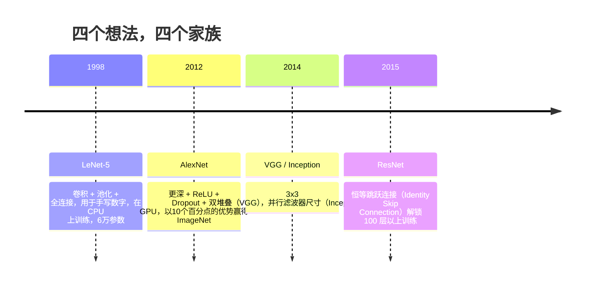
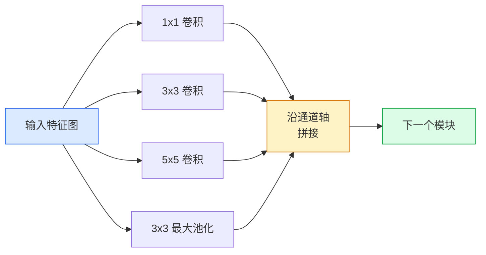
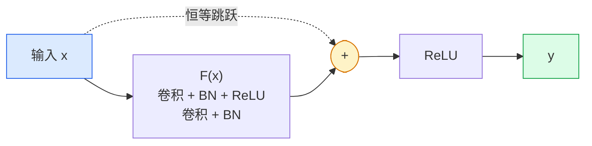

# 卷积神经网络（CNN）——从 LeNet 到 ResNet

> 过去三十年中，每一个重要的卷积神经网络都遵循着“卷积-非线性-下采样”这一基本范式，只是在其中加入了一个新的想法。请按时间顺序理解这些想法。

**类型：** 学习 + 构建  
**语言：** Python  
**先修知识：** 阶段3 第11课（PyTorch），阶段4 第01课（图像基础），阶段4 第02课（从头实现卷积）  
**时长：** ~75分钟

## 学习目标

- 梳理 LeNet-5 -> AlexNet -> VGG -> Inception -> ResNet 的架构演进脉络，并指出每个家族贡献的单一新想法
- 用 PyTorch 分别实现 LeNet-5、VGG 风格模块和 ResNet 的 BasicBlock，每个实现不超过 40 行
- 解释残差连接（Residual Connection）如何将 1000 层网络从不可训练变为最先进水平
- 阅读一个现代骨干网络（ResNet-18、ResNet-50），在查看源码前预测其输出形状、感受野（Receptive Field）和参数量

## 问题所在

2011 年，最好的 ImageNet 分类器 top-5 准确率约为 74%。2012 年 AlexNet 达到 85%。2015 年 ResNet 达到 96%。没有新数据，没有新 GPU 代次。这些提升来自架构想法。一位有经验的视觉工程师必须知道每个想法出自哪篇论文，因为你在 2026 年部署的每一个生产骨干网络都是这些相同组件的重新组合——而且这些想法还在持续迁移：分组卷积（Grouped Convolution）从 CNN 进入了 Transformer，残差连接从 ResNet 进入了所有大语言模型（LLM），批归一化（Batch Normalisation）存在于扩散模型中。

按顺序学习这些网络还能帮助你避免一个常见错误：当 LeNet 大小的网络就能解决问题时，却去使用最大的可用模型。MNIST 不需要 ResNet。了解每个家族的扩展曲线，你就知道应该选择什么规模。

## 概念

### 改变视觉领域的四个想法



在经典视觉领域，没有其他突破比得上这四次飞跃。

### LeNet-5（1998 年）

Yann LeCun 的手写数字识别器。6 万个参数。两个卷积-池化模块，两个全连接层，tanh 激活函数。它定义了所有 CNN 继承的模板：

```
输入 (1, 32, 32)
  卷积 5x5 -> (6, 28, 28)
  平均池化 2x2 -> (6, 14, 14)
  卷积 5x5 -> (16, 10, 10)
  平均池化 2x2 -> (16, 5, 5)
  展平 -> 400
  全连接 -> 120
  全连接 -> 84
  全连接 -> 10
```

现代世界称之为 CNN 的一切——交替的卷积和下采样，最终送入一个小型分类头——本质上就是 LeNet 的加深版：更多的层、更大的通道数、更好的激活函数。

### AlexNet（2012 年）

三项改变共同攻克了 ImageNet：

1. **ReLU** 替代 tanh。梯度不再消失。训练速度提升 6 倍。
2. **Dropout** 应用于全连接头部。正则化从技巧变成了一个层。
3. **深度和宽度**。5 个卷积层，3 个全连接层，6000 万参数，在两个 GPU 上分开训练。

论文中的图 2 仍然展示了两个并行流作为 GPU 划分。这种并行是硬件层面的变通方案，而非架构上的洞见——但上述三个想法，至今仍在每一个你使用的模型中发挥作用。

### VGG（2014 年）

VGG 的问题：如果只使用 3x3 卷积并且加深网络，会发生什么？

```
堆叠： 卷积 3x3 -> 卷积 3x3 -> 池化 2x2
重复： 16 或 19 个卷积层
```

两个 3x3 卷积拥有与一个 5x5 卷积相同的 5x5 输入感受野，但参数更少（2\*9\*C² = 18C² vs 25\*C²），而且中间多了一个 ReLU。VGG 将这一观察推广为整个架构。它的简洁性——仅一种模块类型，重复使用——使其成为了此后一切网络的参考基准。

代价：1.38 亿参数，训练缓慢，推理昂贵。

### Inception（2014 年，同一年）

对于“应该使用什么尺寸的卷积核？”这个问题，Google 的回答是：全部都用，并行处理。



每个分支各司其职——1x1 用于通道混合，3x3 用于局部纹理，5x5 用于更大模式，池化用于平移不变特征——拼接后让下一层自行选择有用的分支。Inception v1 在每条分支内部使用 1x1 卷积作为瓶颈（Bottleneck），以保持合理的参数量。

### 退化问题（Degradation Problem）

截至 2015 年，VGG-19 工作良好，但 VGG-32 不行。按道理深度应该有帮助，但超过约 20 层后，训练损失和测试损失均变得更差。这不是过拟合。这是优化器无法找到有效权重，因为梯度会通过每一层相乘而缩小。

```
普通深层网络：
  y = f_L( f_{L-1}( ... f_1(x) ... ) )

关于早期层的梯度：
  dL/dW_1 = dL/dy * df_L/df_{L-1} * ... * df_2/df_1 * df_1/dW_1

每个乘法因子的大小大致为（权重大小）*（激活增益）。
堆叠 100 个增益小于 1 的因子，梯度实际上为零。
```

VGG 之所以能在 19 层上工作，是因为批归一化（Batch Normalization，同时期发表的）保持了激活值的良好尺度。但即使有批归一化，也无法挽救超过 30 层左右的深度。

### ResNet（2015 年）

何恺明、张祥雨、任少卿、孙剑提出了一项改变，修复了所有问题：

```
标准模块：   y = F(x)
残差模块：   y = F(x) + x
```

这里的 `+ x` 意味着该层可以通过将 `F(x)` 驱动到零来始终选择“什么也不做”。一个 1000 层的 ResNet 至多退化为一个 1 层网络，因为每一个额外模块都有一个简单的逃生通道。有了这个保证，优化器就愿意让每个模块*稍微*有用——而“稍微有用”叠加上 100 次，就成为了最先进的水平。



有两种常见的模块变体：

- **BasicBlock**（ResNet-18, ResNet-34）：两个 3x3 卷积，跳跃连接绕过两者。
- **Bottleneck**（ResNet-50, -101, -152）：1x1 降维，3x3 中间，1x1 升维，跳跃连接绕过这三者。在通道数较高时更节省参数。

当跳跃连接需要跨越下采样（步长=2）时，恒等路径被替换为一个步长为 2 的 1x1 卷积，以匹配形状。

### 为什么残差在视觉领域之外也重要

这个想法实际上并非关于图像分类。它关乎将深层网络从“祈祷梯度存活”转变为一种可靠、可扩展的工程工具。你在下一阶段将学到的每一个 Transformer 都在每个模块中拥有完全相同的跳跃连接。没有 ResNet，就没有 GPT。

## 动手构建

### 第一步：LeNet-5

一个最小化的、忠实的 LeNet。使用 tanh 激活函数和平均池化。唯一向现代妥协的地方是，我们在下游使用 `nn.CrossEntropyLoss` 而不是原始的 Gaussian 连接。

```python
import torch
import torch.nn as nn
import torch.nn.functional as F

class LeNet5(nn.Module):
    def __init__(self, num_classes=10):
        super().__init__()
        self.conv1 = nn.Conv2d(1, 6, kernel_size=5)
        self.conv2 = nn.Conv2d(6, 16, kernel_size=5)
        self.pool = nn.AvgPool2d(2)
        self.fc1 = nn.Linear(16 * 5 * 5, 120)
        self.fc2 = nn.Linear(120, 84)
        self.fc3 = nn.Linear(84, num_classes)

    def forward(self, x):
        x = self.pool(torch.tanh(self.conv1(x)))
        x = self.pool(torch.tanh(self.conv2(x)))
        x = torch.flatten(x, 1)
        x = torch.tanh(self.fc1(x))
        x = torch.tanh(self.fc2(x))
        return self.fc3(x)

net = LeNet5()
x = torch.randn(1, 1, 32, 32)
print(f"输出形状: {net(x).shape}")
print(f"参数量: {sum(p.numel() for p in net.parameters()):,}")
```

预期输出：`输出形状: torch.Size([1, 10])`，`参数量: 61,706`。这就是开启现代视觉的那个整个数字分类器。

### 第二步：VGG 模块

一个可复用的模块：两个 3x3 卷积，ReLU，批归一化，最大池化。

```python
class VGGBlock(nn.Module):
    def __init__(self, in_c, out_c):
        super().__init__()
        self.conv1 = nn.Conv2d(in_c, out_c, kernel_size=3, padding=1)
        self.bn1 = nn.BatchNorm2d(out_c)
        self.conv2 = nn.Conv2d(out_c, out_c, kernel_size=3, padding=1)
        self.bn2 = nn.BatchNorm2d(out_c)
        self.pool = nn.MaxPool2d(2)

    def forward(self, x):
        x = F.relu(self.bn1(self.conv1(x)))
        x = F.relu(self.bn2(self.conv2(x)))
        return self.pool(x)

class MiniVGG(nn.Module):
    def __init__(self, num_classes=10):
        super().__init__()
        self.stack = nn.Sequential(
            VGGBlock(3, 32),
            VGGBlock(32, 64),
            VGGBlock(64, 128),
        )
        self.head = nn.Sequential(
            nn.AdaptiveAvgPool2d(1),
            nn.Flatten(),
            nn.Linear(128, num_classes),
        )

    def forward(self, x):
        return self.head(self.stack(x))

net = MiniVGG()
x = torch.randn(1, 3, 32, 32)
print(f"输出形状: {net(x).shape}")
print(f"参数量: {sum(p.numel() for p in net.parameters()):,}")
```

三个 VGG 模块，处理 CIFAR 尺寸的输入，一个自适应池化层，一个全连接层。大约 29 万参数。对 CIFAR-10 来说足够。

### 第三步：ResNet 的 BasicBlock

ResNet-18 和 ResNet-34 的核心构建模块。

```python
class BasicBlock(nn.Module):
    def __init__(self, in_c, out_c, stride=1):
        super().__init__()
        self.conv1 = nn.Conv2d(in_c, out_c, kernel_size=3, stride=stride, padding=1, bias=False)
        self.bn1 = nn.BatchNorm2d(out_c)
        self.conv2 = nn.Conv2d(out_c, out_c, kernel_size=3, stride=1, padding=1, bias=False)
        self.bn2 = nn.BatchNorm2d(out_c)
        if stride != 1 or in_c != out_c:
            self.shortcut = nn.Sequential(
                nn.Conv2d(in_c, out_c, kernel_size=1, stride=stride, bias=False),
                nn.BatchNorm2d(out_c),
            )
        else:
            self.shortcut = nn.Identity()

    def forward(self, x):
        out = F.relu(self.bn1(self.conv1(x)))
        out = self.bn2(self.conv2(out))
        out = out + self.shortcut(x)
        return F.relu(out)
```

在卷积层设置 `bias=False` 是批归一化的一种约定——BN 的 `beta` 参数已经处理了偏置项，因此再携带卷积偏置是一种浪费。`shortcut` 只有在步长或通道数改变时才需要真正的卷积；否则就是一个无操作的恒等映射。

### 第四步：一个微型 ResNet

堆叠四组 BasicBlock，得到一个适用于 CIFAR 尺寸输入的、可工作的 ResNet。

```python
class TinyResNet(nn.Module):
    def __init__(self, num_classes=10):
        super().__init__()
        self.stem = nn.Sequential(
            nn.Conv2d(3, 32, kernel_size=3, stride=1, padding=1, bias=False),
            nn.BatchNorm2d(32),
            nn.ReLU(inplace=True),
        )
        self.layer1 = self._make_group(32, 32, num_blocks=2, stride=1)
        self.layer2 = self._make_group(32, 64, num_blocks=2, stride=2)
        self.layer3 = self._make_group(64, 128, num_blocks=2, stride=2)
        self.layer4 = self._make_group(128, 256, num_blocks=2, stride=2)
        self.head = nn.Sequential(
            nn.AdaptiveAvgPool2d(1),
            nn.Flatten(),
            nn.Linear(256, num_classes),
        )

    def _make_group(self, in_c, out_c, num_blocks, stride):
        blocks = [BasicBlock(in_c, out_c, stride=stride)]
        for _ in range(num_blocks - 1):
            blocks.append(BasicBlock(out_c, out_c, stride=1))
        return nn.Sequential(*blocks)

    def forward(self, x):
        x = self.stem(x)
        x = self.layer1(x)
        x = self.layer2(x)
        x = self.layer3(x)
        x = self.layer4(x)
        return self.head(x)

net = TinyResNet()
x = torch.randn(1, 3, 32, 32)
print(f"输出形状: {net(x).shape}")
print(f"参数量: {sum(p.numel() for p in net.parameters()):,}")
```

四组，每组两个模块。在第 2、3、4 组的开头设置步长为 2。每次下采样时通道数翻倍。大约 280 万参数。这就是从 ResNet-18 到 ResNet-152 的标准化配方，可以干净地扩展。

### 第五步：比较参数与特征的效率

将同一个输入送入所有三个网络，比较参数量。

```python
def summary(name, net, x):
    y = net(x)
    params = sum(p.numel() for p in net.parameters())
    print(f"{name:12s}  输入 {tuple(x.shape)} -> 输出 {tuple(y.shape)}  参数 {params:>10,}")

x = torch.randn(1, 3, 32, 32)
summary("LeNet5",     LeNet5(),       torch.randn(1, 1, 32, 32))
summary("MiniVGG",    MiniVGG(),      x)
summary("TinyResNet", TinyResNet(),   x)
```

三个模型，三个时代，参数量跨越三个数量级。针对 CIFAR-10 的准确率，训练