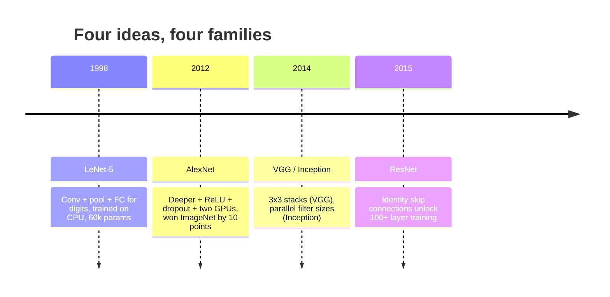
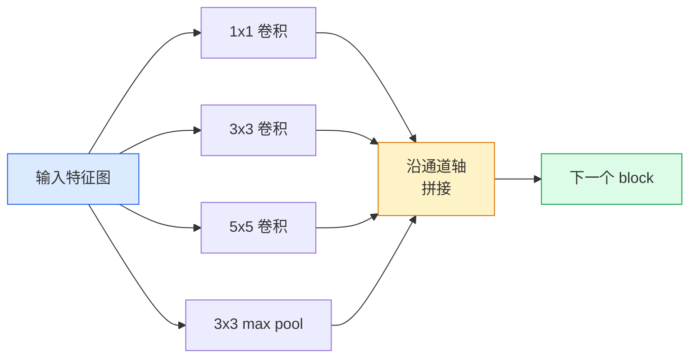
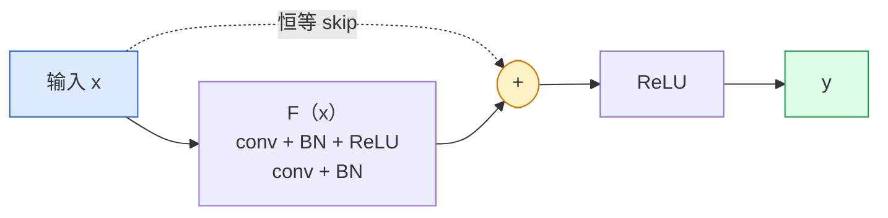

# CNN — 从 LeNet 到 ResNet

> 译注：本文译自同目录 [`en.md`](./en.md)。术语遵循仓根 [TRANSLATION_GUIDE.md](../../../../TRANSLATION_GUIDE.md)。

> 过去三十年里每一个里程碑式的 CNN，本质上都是同一套「卷积—非线性—下采样」配方，只不过外挂了一个新点子。把这些点子按时间顺序学一遍。

**Type:** Learn + Build
**Languages:** Python
**Prerequisites:** Phase 3 Lesson 11 (PyTorch), Phase 4 Lesson 01 (Image Fundamentals), Phase 4 Lesson 02 (Convolutions from Scratch)
**Time:** ~75 minutes

## 学习目标（Learning Objectives）

- 理清架构谱系 LeNet-5 → AlexNet → VGG → Inception → ResNet，并说出每个家族贡献了哪一个新点子
- 用 PyTorch 实现 LeNet-5、一个 VGG 风格的 block、以及一个 ResNet BasicBlock，每个不超过 40 行
- 解释为什么残差连接（residual connection）能把 1000 层网络从「根本训不动」变成 SOTA
- 在不看源码的前提下，读懂一个现代 backbone（ResNet-18、ResNet-50），并预测它的输出形状、感受野和参数量

## 问题（The Problem）

2011 年，ImageNet 上最好的分类器 top-5 准确率约 74%。2012 年 AlexNet 拿下 85%。2015 年 ResNet 干到 96%。没有新数据，也没有新一代 GPU。提升全靠架构上的点子。一个合格的视觉工程师必须知道哪个点子来自哪篇论文，因为你在 2026 年生产环境里跑的每一个 backbone，都是这些零件的重新组合——而且这些点子还在不断迁移：grouped conv 从 CNN 跑去了 transformer，残差连接从 ResNet 跑进了今天每一个 LLM，batch norm（批归一化）则活在 diffusion 模型里。

按时间顺序研究这些网络，还能让你免疫一个常见错误：明明 LeNet 大小的网络就能解决的问题，却伸手去抓现成里最大的那个模型。MNIST 不需要 ResNet。了解每个家族的 scaling 曲线，能告诉你应该坐在曲线上的哪个位置。

## 概念（The Concept）

### 改变视觉的四个点子（The four ideas that changed vision）



经典视觉里没有什么比这四次跳跃更重要。

### LeNet-5（1998）

Yann LeCun 的手写数字识别器。6 万个参数。两个 conv-pool block，两个全连接层，tanh 激活函数。它定下了之后每个 CNN 都继承的模板：

```
input (1, 32, 32)
  conv 5x5 -> (6, 28, 28)
  avg pool 2x2 -> (6, 14, 14)
  conv 5x5 -> (16, 10, 10)
  avg pool 2x2 -> (16, 5, 5)
  flatten -> 400
  dense -> 120
  dense -> 84
  dense -> 10
```

今天我们叫做 CNN 的一切——卷积和下采样交替排列、最后接一个小的分类 head——都只是 LeNet 加了更多层、更大通道数、更好激活函数后的样子。

### AlexNet（2012）

三个改动联手攻破了 ImageNet：

1. **ReLU** 取代 tanh。梯度不再消失，训练速度快了 6 倍。
2. **Dropout** 用在全连接 head 里。正则化（regularization）从一种「技巧」变成一个「层」。
3. **更深更宽**。5 个卷积层，3 个全连接层，6000 万参数，跨两块 GPU 训练，模型在两卡之间切开。

论文里的 Figure 2 至今还把 GPU 拆分画成两条并行流。那是硬件层面的妥协，不是架构上的洞见——但上面那三个点子，今天你用的每个模型里都还在。

### VGG（2014）

VGG 提了一个问题：如果只用 3×3 卷积，并且把网络做得很深，会怎样？

```
stack:   conv 3x3 -> conv 3x3 -> pool 2x2
repeat:  16 or 19 conv layers
```

两个 3×3 卷积看到的输入区域跟一个 5×5 卷积一样大，但参数更少（2·9·C² = 18C² 对比 25·C²），中间还能多塞一个 ReLU。VGG 把这一观察直接做成了整个架构。这种「一种 block，反复堆」的极简，让它成为之后所有工作的参照点。

代价是：1.38 亿参数，训练慢，推理（inference）也贵。

### Inception（2014，同一年）

Google 对「我该用多大的 kernel？」的回答是：全都要，并联。



每个分支各有所长——1×1 做通道混合，3×3 抓局部纹理，5×5 抓更大的图样，pooling 抓平移不变特征——拼接（concat）让下一层去自由挑选哪个分支有用。Inception v1 在每个分支里再塞一个 1×1 卷积当瓶颈，把参数量压住。

### 退化问题（The degradation problem）

到了 2015 年，VGG-19 能跑通，VGG-32 跑不通。本来加深应该有用，但超过 20 层左右，训练损失（loss）和测试 loss 都变差。这不是过拟合，是优化器（optimizer）找不到有用的权重——因为梯度沿着每一层乘性收缩。

```
Plain deep network:
  y = f_L( f_{L-1}( ... f_1(x) ... ) )

Gradient wrt early layer:
  dL/dW_1 = dL/dy * df_L/df_{L-1} * ... * df_2/df_1 * df_1/dW_1

Each multiplicative term has magnitude roughly (weight magnitude) * (activation gain).
Stack 100 of them with gains < 1 and the gradient is effectively zero.
```

VGG 能做到 19 层，是因为同一时期发表的 batch norm 把激活（activation）的尺度稳住了。可即便加上 batch norm，也救不了 30 层往上的深度。

### ResNet（2015）

He, Zhang, Ren, Sun 提出了一个改动，把所有问题一次解决：

```
standard block:   y = F(x)
residual block:   y = F(x) + x
```

`+ x` 意味着这一层永远可以「什么都不做」——只要把 `F(x)` 训练成 0 就行。一个 1000 层的 ResNet 现在最坏也就跟一个 1 层网络一样烂，因为每个额外 block 都有一条平凡的逃生通道。有了这个保证，优化器才愿意让每个 block *稍微* 有用一点——而「稍微有用」叠 100 次，就是 SOTA。



block 有两种变体到处都能见到：

- **BasicBlock**（ResNet-18、ResNet-34）：两个 3×3 卷积，skip 包住这两个。
- **Bottleneck**（ResNet-50、-101、-152）：1×1 下采、3×3 中间、1×1 上采，skip 包住三者。通道数大时更便宜。

当 skip 要跨过下采样（stride=2）时，identity 路径会被替换成一个 1×1 stride=2 的卷积来对齐形状。

### 为什么残差不只对视觉重要（Why residuals matter beyond vision）

这个点子本质上跟图像分类没什么关系。它真正做的事，是把深度网络从「双手合十祈祷梯度活下来」变成一个可靠、可扩展的工程工具。下一阶段你会读到的每一个 transformer，每个 block 里都长着完全一样的 skip connection。没有 ResNet，就没有 GPT。

## 动手实现（Build It）

### Step 1：LeNet-5

一个最小、忠实于原作的 LeNet。tanh 激活，平均池化。唯一对现代的让步是下游用 `nn.CrossEntropyLoss`，而不是原版的 Gaussian connection。

```python
import torch
import torch.nn as nn
import torch.nn.functional as F

class LeNet5(nn.Module):
    def __init__(self, num_classes=10):
        super().__init__()
        self.conv1 = nn.Conv2d(1, 6, kernel_size=5)
        self.conv2 = nn.Conv2d(6, 16, kernel_size=5)
        self.pool = nn.AvgPool2d(2)
        self.fc1 = nn.Linear(16 * 5 * 5, 120)
        self.fc2 = nn.Linear(120, 84)
        self.fc3 = nn.Linear(84, num_classes)

    def forward(self, x):
        x = self.pool(torch.tanh(self.conv1(x)))
        x = self.pool(torch.tanh(self.conv2(x)))
        x = torch.flatten(x, 1)
        x = torch.tanh(self.fc1(x))
        x = torch.tanh(self.fc2(x))
        return self.fc3(x)

net = LeNet5()
x = torch.randn(1, 1, 32, 32)
print(f"output: {net(x).shape}")
print(f"params: {sum(p.numel() for p in net.parameters()):,}")
```

预期输出：`output: torch.Size([1, 10])`，`params: 61,706`。这就是开启了现代视觉的那个手写数字分类器全部内容。

### Step 2：一个 VGG block

一个可复用 block：两个 3×3 卷积，ReLU，batch norm，max pool。

```python
class VGGBlock(nn.Module):
    def __init__(self, in_c, out_c):
        super().__init__()
        self.conv1 = nn.Conv2d(in_c, out_c, kernel_size=3, padding=1)
        self.bn1 = nn.BatchNorm2d(out_c)
        self.conv2 = nn.Conv2d(out_c, out_c, kernel_size=3, padding=1)
        self.bn2 = nn.BatchNorm2d(out_c)
        self.pool = nn.MaxPool2d(2)

    def forward(self, x):
        x = F.relu(self.bn1(self.conv1(x)))
        x = F.relu(self.bn2(self.conv2(x)))
        return self.pool(x)

class MiniVGG(nn.Module):
    def __init__(self, num_classes=10):
        super().__init__()
        self.stack = nn.Sequential(
            VGGBlock(3, 32),
            VGGBlock(32, 64),
            VGGBlock(64, 128),
        )
        self.head = nn.Sequential(
            nn.AdaptiveAvgPool2d(1),
            nn.Flatten(),
            nn.Linear(128, num_classes),
        )

    def forward(self, x):
        return self.head(self.stack(x))

net = MiniVGG()
x = torch.randn(1, 3, 32, 32)
print(f"output: {net(x).shape}")
print(f"params: {sum(p.numel() for p in net.parameters()):,}")
```

CIFAR 大小输入上跑三个 VGG block，再接一个自适应池化、一个线性层。约 29 万参数。对 CIFAR-10 已经够用。

### Step 3：一个 ResNet BasicBlock

ResNet-18 和 ResNet-34 的核心 block。

```python
class BasicBlock(nn.Module):
    def __init__(self, in_c, out_c, stride=1):
        super().__init__()
        self.conv1 = nn.Conv2d(in_c, out_c, kernel_size=3, stride=stride, padding=1, bias=False)
        self.bn1 = nn.BatchNorm2d(out_c)
        self.conv2 = nn.Conv2d(out_c, out_c, kernel_size=3, stride=1, padding=1, bias=False)
        self.bn2 = nn.BatchNorm2d(out_c)
        if stride != 1 or in_c != out_c:
            self.shortcut = nn.Sequential(
                nn.Conv2d(in_c, out_c, kernel_size=1, stride=stride, bias=False),
                nn.BatchNorm2d(out_c),
            )
        else:
            self.shortcut = nn.Identity()

    def forward(self, x):
        out = F.relu(self.bn1(self.conv1(x)))
        out = self.bn2(self.conv2(out))
        out = out + self.shortcut(x)
        return F.relu(out)
```

卷积层上的 `bias=False` 是 batch norm 的惯例——BN 的 beta 参数已经处理了 bias，再带一个 conv bias 就是浪费。`shortcut` 只有在 stride 或通道数发生变化时才需要真的卷积，否则就是一个空操作的 identity。

### Step 4：一个微型 ResNet

把四组 BasicBlock 堆起来，得到一个能跑 CIFAR 大小输入的 ResNet。

```python
class TinyResNet(nn.Module):
    def __init__(self, num_classes=10):
        super().__init__()
        self.stem = nn.Sequential(
            nn.Conv2d(3, 32, kernel_size=3, stride=1, padding=1, bias=False),
            nn.BatchNorm2d(32),
            nn.ReLU(inplace=True),
        )
        self.layer1 = self._make_group(32, 32, num_blocks=2, stride=1)
        self.layer2 = self._make_group(32, 64, num_blocks=2, stride=2)
        self.layer3 = self._make_group(64, 128, num_blocks=2, stride=2)
        self.layer4 = self._make_group(128, 256, num_blocks=2, stride=2)
        self.head = nn.Sequential(
            nn.AdaptiveAvgPool2d(1),
            nn.Flatten(),
            nn.Linear(256, num_classes),
        )

    def _make_group(self, in_c, out_c, num_blocks, stride):
        blocks = [BasicBlock(in_c, out_c, stride=stride)]
        for _ in range(num_blocks - 1):
            blocks.append(BasicBlock(out_c, out_c, stride=1))
        return nn.Sequential(*blocks)

    def forward(self, x):
        x = self.stem(x)
        x = self.layer1(x)
        x = self.layer2(x)
        x = self.layer3(x)
        x = self.layer4(x)
        return self.head(x)

net = TinyResNet()
x = torch.randn(1, 3, 32, 32)
print(f"output: {net(x).shape}")
print(f"params: {sum(p.numel() for p in net.parameters()):,}")
```

四组、每组两个 block。第 2、3、4 组开头 stride 设为 2。每次下采样通道数翻倍。约 280 万参数。这是一份能干净地一路扩到 ResNet-152 的标准配方。

### Step 5：对比「参数—特征」效率

把同一份输入喂给三个网络，比较参数量。

```python
def summary(name, net, x):
    y = net(x)
    params = sum(p.numel() for p in net.parameters())
    print(f"{name:12s}  input {tuple(x.shape)} -> output {tuple(y.shape)}  params {params:>10,}")

x = torch.randn(1, 3, 32, 32)
summary("LeNet5",     LeNet5(),       torch.randn(1, 1, 32, 32))
summary("MiniVGG",    MiniVGG(),      x)
summary("TinyResNet", TinyResNet(),   x)
```

三个模型，三个时代，参数量跨三个数量级。在 CIFAR-10 上训练若干 epoch 后，准确率大约：LeNet 60%，MiniVGG 89%，TinyResNet 93%。

## 用起来（Use It）

`torchvision.models` 给你提供了上述所有网络的预训练版本。各家族调用签名完全一致——这正是 backbone 抽象的意义所在。

```python
from torchvision.models import resnet18, ResNet18_Weights, vgg16, VGG16_Weights

r18 = resnet18(weights=ResNet18_Weights.IMAGENET1K_V1)
r18.eval()

print(f"ResNet-18 params: {sum(p.numel() for p in r18.parameters()):,}")
print(r18.layer1[0])
print()

v16 = vgg16(weights=VGG16_Weights.IMAGENET1K_V1)
v16.eval()
print(f"VGG-16   params: {sum(p.numel() for p in v16.parameters()):,}")
```

ResNet-18 有 1170 万参数，VGG-16 有 1.38 亿。两者的 ImageNet top-1 准确率相近（69.8% vs 71.6%）。残差连接给你买来的是 12 倍的参数效率提升。这就是为什么从 2016 年到 2021 年 ViT 出现之前，ResNet 系列一统天下——而且在算力受限的真实部署里，今天仍然是主力。

迁移学习的配方永远是同一个：加载预训练，冻结 backbone，替换分类 head。

```python
for p in r18.parameters():
    p.requires_grad = False
r18.fc = nn.Linear(r18.fc.in_features, 10)
```

三行代码。你现在就有了一个 10 类 CIFAR 分类器，继承的是 ImageNet 用钱砸出来的表征。

## 上线部署（Ship It）

本节产出：

- `outputs/prompt-backbone-selector.md` —— 一个 prompt，根据任务、数据集大小和算力预算，挑出合适的 CNN 家族（LeNet/VGG/ResNet/MobileNet/ConvNeXt）。
- `outputs/skill-residual-block-reviewer.md` —— 一个 skill，读入一个 PyTorch 模块，标出 skip connection 的常见错误（stride 变化处缺少 shortcut、shortcut 的激活顺序、BN 相对加法的位置）。

## 练习（Exercises）

1. **（简单）** 手算 `TinyResNet` 每一层的参数量，与 `sum(p.numel() for p in net.parameters())` 对比。参数预算的大头花在哪里——卷积、BN，还是分类 head？
2. **（中等）** 实现 Bottleneck block（1×1 → 3×3 → 1×1，外加 skip），用它搭一个 ResNet-50 风格的网络跑 CIFAR。把参数量与 `TinyResNet` 对比。
3. **（困难）** 把 `BasicBlock` 里的 skip connection 拿掉，用 34 个 block 训一个「plain」深网络；再训一个 34 block 的 ResNet。两者都在 CIFAR-10 上训 10 个 epoch。把训练 loss 随 epoch 的曲线画出来。复现 He et al. Figure 1 的结果——那条 plain 深网络的 loss 收敛到比它更浅的孪生兄弟还高的曲线。

## 关键术语（Key Terms）

| Term | What people say | What it actually means |
|------|----------------|----------------------|
| Backbone | 「模型」 | 给任务 head 输出特征图的那一摞卷积 block |
| Residual connection | 「skip 连接」 | `y = F(x) + x`；让优化器可以通过把 F 训练成 0 来学到 identity，从而让任意深度都可训练 |
| BasicBlock | 「带 skip 的两个 3×3 卷积」 | ResNet-18/34 的构件：conv-BN-ReLU-conv-BN-add-ReLU |
| Bottleneck | 「1×1 下、3×3、1×1 上」 | ResNet-50/101/152 的 block；通道很大时便宜，因为 3×3 是在压缩后的宽度上跑 |
| Degradation problem | 「越深越差」 | 超过约 20 层 plain 卷积，训练和测试误差都上升；靠残差连接解决，不是靠更多数据 |
| Stem | 「第一层」 | 把 3 通道输入转成 backbone 起始宽度的初始卷积；ImageNet 通常 7×7 stride 2，CIFAR 通常 3×3 stride 1 |
| Head | 「分类器」 | 最后一个 backbone block 之后那几层：自适应池化、flatten、线性层 |
| Transfer learning | 「预训练权重」 | 加载一个在 ImageNet 上训好的 backbone，只在你的任务上微调 head |

## 延伸阅读（Further Reading）

- [Deep Residual Learning for Image Recognition (He et al., 2015)](https://arxiv.org/abs/1512.03385) —— ResNet 论文；每张图都值得仔细看
- [Very Deep Convolutional Networks (Simonyan & Zisserman, 2014)](https://arxiv.org/abs/1409.1556) —— VGG 论文；至今仍是「为什么用 3×3」的最佳参考
- [ImageNet Classification with Deep CNNs (Krizhevsky et al., 2012)](https://papers.nips.cc/paper_files/paper/2012/hash/c399862d3b9d6b76c8436e924a68c45b-Abstract.html) —— AlexNet；终结了人工特征时代的那篇论文
- [Going Deeper with Convolutions (Szegedy et al., 2014)](https://arxiv.org/abs/1409.4842) —— Inception v1；至今还在 vision transformer 里出现的并行 filter 思路
