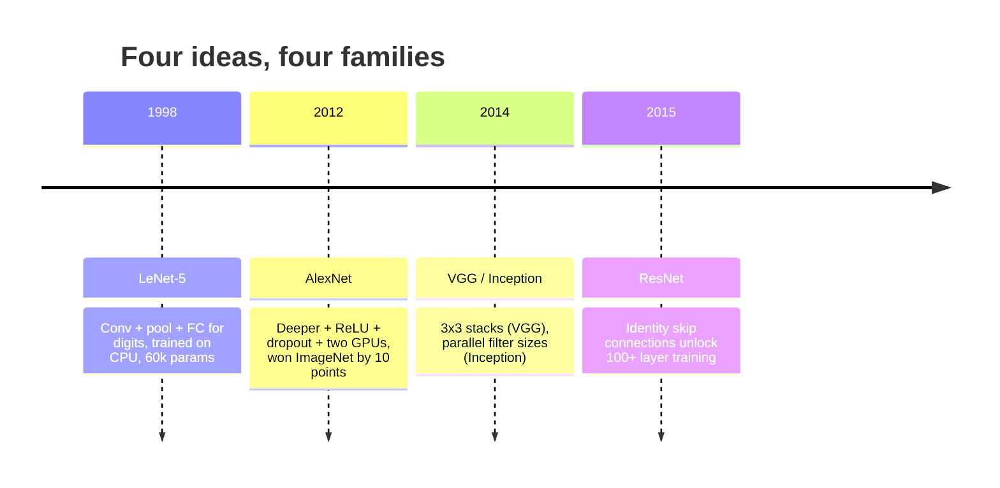
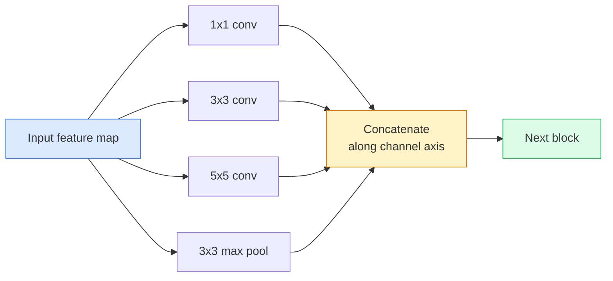
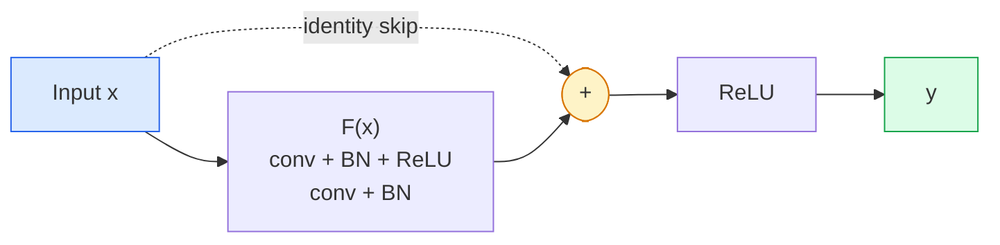

# CNNs — LeNet to ResNet

> 过去三十年来的每一个主要CNN都是相同的反非线性下采样食谱，但有一个新想法。按顺序学习这些想法。

** 类型：** 学习+构建
** 语言：** Python
** 先决条件：** 阶段3第11课（PyTorch）、阶段4第01课（图像基础知识）、阶段4第02课（从头开始的卷积）
** 时间：** ~75分钟

## Learning Objectives

- 追踪建筑谱系LeNet-5 -> AlexNet -> VGG -> Incement-> ResNet并陈述每个家庭贡献的单一新想法
- 在PyTorch中实现LeNet-5、VGG风格的块和ResNet BasicBlock，每行不超过40行
- 解释为什么剩余连接将1，000层网络从不可训练变成最先进的网络
- 阅读现代主干（ResNet-18、ResNet-50）并在查看源之前预测其输出形状、感受野和参数计数

## The Problem

2011年，最好的ImageNet分类器的准确率为74%左右。2012年，AlexNet的得分为85%。2015年，ResNet得分为96%。没有新数据。没有新一代的图形处理器。收益来自建筑理念。工作的视觉工程师必须知道哪个想法来自哪份论文，因为您在2026年交付的每个生产主干都是这些相同部分的重组-而且因为想法不断转移：分组Convers从CNN到变压器，剩余连接从ResNet到现有的每一个LLM，批量规范化生活在扩散模型中。

按照顺序研究这些网络还可以让您免受一个常见错误的影响：当LeNet大小的网络可以解决问题时，则选择最大的可用模型。MNIST不需要ResNet。了解每个家庭的比例曲线，就会告诉您该坐在哪里。

## The Concept

### The four ideas that changed vision



在古典视野中，没有什么比这四次跳跃更重要了。

### LeNet-5 (1998)

Yann LeCun的数字识别器。60，000参数。两个conv-pool区块，两个完全连接的层，tanh激活。它定义了每个CNN继承的模板：

```
input (1, 32, 32)
  conv 5x5 -> (6, 28, 28)
  avg pool 2x2 -> (6, 14, 14)
  conv 5x5 -> (16, 10, 10)
  avg pool 2x2 -> (16, 5, 5)
  flatten -> 400
  dense -> 120
  dense -> 84
  dense -> 10
```

现代世界称之为CNN的一切--交替卷积和向下采样，为小型分类器头供电--都是LeNet，具有更多层、更大通道和更好的激活。

### AlexNet (2012)

三个变化共同打破了ImageNet：

1. **ReLU** 而不是tanh。信徒停止消失。训练速度加快六倍。
2. **Dropout** 在完全连接的头部中。规范化成为一个层面，而不是一个技巧。
3. ** 深度和宽度 **。五个conv层、三个密集层、60 M个参数，在两个图形处理器上训练，模型在它们之间分裂。

本文的图2仍然显示GPU分为两个并行流。这种并行性是一种硬件解决方案，而不是一种架构见解-但上面的三个想法仍然存在于您使用的每个模型中。

### VGG (2014)

VGG问道：如果你只使用3x 3卷积并深入，会发生什么？

```
stack:   conv 3x3 -> conv 3x3 -> pool 2x2
repeat:  16 or 19 conv layers
```

两个3x 3 conv与一个5x 5 conv看到相同的5x 5输入区域，但参数较少（2*9* C#2 = 18C#2 vs 25* C#2），并且中间有额外的ReLU。VGG将这一观察结果转化为整个架构。简单性--一个块类型，重复--使其成为随后一切的参考点。

成本：1.38亿个参数，训练速度慢，推理成本高。

### Inception (2014, same year)

谷歌对“我应该使用多大的内核大小？”的回答“是：所有这些都是并行的。



每个分支都专门化-1x 1用于通道混合，3x 3用于局部纹理，5x 5用于更大的图案，池化移动不变特征-并且concat允许下一层选择有用的分支。Incement v1使用每个分支内的1x 1卷积作为保持参数计数理智的瓶颈。

### The degradation problem

到2015年，VGG-19有效，而VGG-32则无效。深度应该有所帮助，但过去约20层训练和测试损失都变得更糟。这并不过分。这是优化器未能找到有用的权重，因为梯度在每个层中都以成倍的方式缩小。

```
Plain deep network:
  y = f_L( f_{L-1}( ... f_1(x) ... ) )

Gradient wrt early layer:
  dL/dW_1 = dL/dy * df_L/df_{L-1} * ... * df_2/df_1 * df_1/dW_1

Each multiplicative term has magnitude roughly (weight magnitude) * (activation gain).
Stack 100 of them with gains < 1 and the gradient is effectively zero.
```

VGG在19层上工作，因为批量规范（同时发布）保持了良好的激活规模。但即使是批量标准也无法拯救超过30层的深度。

### ResNet (2015)

他、张、任、孙提出了一项解决一切的改变：

```
standard block:   y = F(x)
residual block:   y = F(x) + x
```

“+ x”意味着层始终可以通过将“F（x）”驱动为零来选择不做任何事情。1，000层ResNet现在最多与1层网络一样糟糕，因为每个额外的块都有一个微不足道的逃生舱口。有了这一保证，优化者愿意让每个块都 * 稍微 * 有用-而且稍微有用，堆叠100次，就是最先进的。



块的两个变体随处可见：

- **BasicBlock**（ResNet-18、ResNet-34）：两个3x 3版本，跳过两者。
- ** 瓶颈 **（ResNet-50，-101，-152）：1x 1向下，3x 3中间，1x 1向上，跳过三人组。当频道计数较高时，价格更便宜。

当跳过必须穿过向下采样（跨度=2）时，身份路径将被1x 1跨度=2 conv替换以匹配形状。

### Why residuals matter beyond vision

这个想法实际上与图像分类无关。它是为了将深度网络从“祈祷梯度生存”转变为可靠、可扩展的工程工具。您将读到的有关下一阶段的每个Transformer在每个块中都有完全相同的跳过连接。没有ResNet，就没有GPT。

## Build It

### Step 1: LeNet-5

一个简约、忠实的LeNet。Tanh激活，平均池数。对现代性的唯一让步是我们在下游使用' nn.CrossEntropyLoss '，而不是原始的高斯连接。

```python
import torch
import torch.nn as nn
import torch.nn.functional as F

class LeNet5(nn.Module):
    def __init__(self, num_classes=10):
        super().__init__()
        self.conv1 = nn.Conv2d(1, 6, kernel_size=5)
        self.conv2 = nn.Conv2d(6, 16, kernel_size=5)
        self.pool = nn.AvgPool2d(2)
        self.fc1 = nn.Linear(16 * 5 * 5, 120)
        self.fc2 = nn.Linear(120, 84)
        self.fc3 = nn.Linear(84, num_classes)

    def forward(self, x):
        x = self.pool(torch.tanh(self.conv1(x)))
        x = self.pool(torch.tanh(self.conv2(x)))
        x = torch.flatten(x, 1)
        x = torch.tanh(self.fc1(x))
        x = torch.tanh(self.fc2(x))
        return self.fc3(x)

net = LeNet5()
x = torch.randn(1, 1, 32, 32)
print(f"output: {net(x).shape}")
print(f"params: {sum(p.numel() for p in net.parameters()):,}")
```

预期输出：“输出：torch.Size（[1，10]）'，'，'参数：61，706 '。这就是开启现代视觉的整个数字分类器。

### Step 2: A VGG block

一个可重复使用的块：两个3x 3 convs、ReLU、批处理规范、最大池。

```python
class VGGBlock(nn.Module):
    def __init__(self, in_c, out_c):
        super().__init__()
        self.conv1 = nn.Conv2d(in_c, out_c, kernel_size=3, padding=1)
        self.bn1 = nn.BatchNorm2d(out_c)
        self.conv2 = nn.Conv2d(out_c, out_c, kernel_size=3, padding=1)
        self.bn2 = nn.BatchNorm2d(out_c)
        self.pool = nn.MaxPool2d(2)

    def forward(self, x):
        x = F.relu(self.bn1(self.conv1(x)))
        x = F.relu(self.bn2(self.conv2(x)))
        return self.pool(x)

class MiniVGG(nn.Module):
    def __init__(self, num_classes=10):
        super().__init__()
        self.stack = nn.Sequential(
            VGGBlock(3, 32),
            VGGBlock(32, 64),
            VGGBlock(64, 128),
        )
        self.head = nn.Sequential(
            nn.AdaptiveAvgPool2d(1),
            nn.Flatten(),
            nn.Linear(128, num_classes),
        )

    def forward(self, x):
        return self.head(self.stack(x))

net = MiniVGG()
x = torch.randn(1, 3, 32, 32)
print(f"output: {net(x).shape}")
print(f"params: {sum(p.numel() for p in net.parameters()):,}")
```

CIFAR大小的输入上的三个VGG块、一个自适应池、一个线性层。~ 290 k参数。CIFAR-10有很多。

### Step 3: A ResNet BasicBlock

ResNet-18和ResNet-34的核心构建块。

```python
class BasicBlock(nn.Module):
    def __init__(self, in_c, out_c, stride=1):
        super().__init__()
        self.conv1 = nn.Conv2d(in_c, out_c, kernel_size=3, stride=stride, padding=1, bias=False)
        self.bn1 = nn.BatchNorm2d(out_c)
        self.conv2 = nn.Conv2d(out_c, out_c, kernel_size=3, stride=1, padding=1, bias=False)
        self.bn2 = nn.BatchNorm2d(out_c)
        if stride != 1 or in_c != out_c:
            self.shortcut = nn.Sequential(
                nn.Conv2d(in_c, out_c, kernel_size=1, stride=stride, bias=False),
                nn.BatchNorm2d(out_c),
            )
        else:
            self.shortcut = nn.Identity()

    def forward(self, x):
        out = F.relu(self.bn1(self.conv1(x)))
        out = self.bn2(self.conv2(out))
        out = out + self.shortcut(x)
        return F.relu(out)
```

conv层上的`bias=False`是一个批量规范约定- BN的beta参数已经处理了偏差，所以携带conv偏差也是一种浪费。shortcut只在stride或channel count改变时需要一个真正的conv;否则它就是一个no-op标识。

### Step 4: A tiny ResNet

堆叠四组BasicBlocks，以获得CIFAR规模的输入的可用ResNet。

```python
class TinyResNet(nn.Module):
    def __init__(self, num_classes=10):
        super().__init__()
        self.stem = nn.Sequential(
            nn.Conv2d(3, 32, kernel_size=3, stride=1, padding=1, bias=False),
            nn.BatchNorm2d(32),
            nn.ReLU(inplace=True),
        )
        self.layer1 = self._make_group(32, 32, num_blocks=2, stride=1)
        self.layer2 = self._make_group(32, 64, num_blocks=2, stride=2)
        self.layer3 = self._make_group(64, 128, num_blocks=2, stride=2)
        self.layer4 = self._make_group(128, 256, num_blocks=2, stride=2)
        self.head = nn.Sequential(
            nn.AdaptiveAvgPool2d(1),
            nn.Flatten(),
            nn.Linear(256, num_classes),
        )

    def _make_group(self, in_c, out_c, num_blocks, stride):
        blocks = [BasicBlock(in_c, out_c, stride=stride)]
        for _ in range(num_blocks - 1):
            blocks.append(BasicBlock(out_c, out_c, stride=1))
        return nn.Sequential(*blocks)

    def forward(self, x):
        x = self.stem(x)
        x = self.layer1(x)
        x = self.layer2(x)
        x = self.layer3(x)
        x = self.layer4(x)
        return self.head(x)

net = TinyResNet()
x = torch.randn(1, 3, 32, 32)
print(f"output: {net(x).shape}")
print(f"params: {sum(p.numel() for p in net.parameters()):,}")
```

四组，每组两个区块。第2组、第3组、第4组开始时的第2步。每次下采样时，通道计数都会翻倍。大约280万个参数。这是可以完全扩展到ResNet-152的标准配方。

### Step 5: Compare parameter-to-feature efficiency

在所有三个网络中运行相同的输入并比较参数计数。

```python
def summary(name, net, x):
    y = net(x)
    params = sum(p.numel() for p in net.parameters())
    print(f"{name:12s}  input {tuple(x.shape)} -> output {tuple(y.shape)}  params {params:>10,}")

x = torch.randn(1, 3, 32, 32)
summary("LeNet5",     LeNet5(),       torch.randn(1, 1, 32, 32))
summary("MiniVGG",    MiniVGG(),      x)
summary("TinyResNet", TinyResNet(),   x)
```

三个型号，三个时代，三个数量级的参数计数。对于CIFAR-10的准确性，你需要大致：LeNet 60%，MiniVGG 89%，TinyResNet 93%经过几个时期的训练。

## Use It

' torchvision.models '为您提供上述所有内容的预训练版本。呼叫签名在不同的家庭中是相同的，这正是主干抽象的要点。

```python
from torchvision.models import resnet18, ResNet18_Weights, vgg16, VGG16_Weights

r18 = resnet18(weights=ResNet18_Weights.IMAGENET1K_V1)
r18.eval()

print(f"ResNet-18 params: {sum(p.numel() for p in r18.parameters()):,}")
print(r18.layer1[0])
print()

v16 = vgg16(weights=VGG16_Weights.IMAGENET1K_V1)
v16.eval()
print(f"VGG-16   params: {sum(p.numel() for p in v16.parameters()):,}")
```

ResNet-18具有1170万个参数。VGG-16有138 M。类似的ImageNet前一名准确率（69.8% vs 71.6%）。剩余连接为您带来12倍参数效率的胜利。这就是为什么ResNet变体从2016年起一直占据主导地位，直到2021年ViT到来，并且仍然主导着计算是约束的现实世界部署。

对于迁移学习，配方总是相同的：加载预训练、冻结主干、更换分类器头。

```python
for p in r18.parameters():
    p.requires_grad = False
r18.fc = nn.Linear(r18.fc.in_features, 10)
```

三行。现在您拥有了一个10级CIFAR分类器，它继承了ImageNet付费的表示。

## Ship It

本课产生：

- ' outputes/prompt-backbone-selector.md '-一个提示，根据任务、数据集大小和计算预算选择正确的CNN系列（LeNet/VGG/ResNet/MobileNet/ConvNeXt）。
- '输出/skill-residual-block-reviewer.md '-一种读取PyTorch模块并标记跳过连接错误的技能（缺少步距更改的快捷方式、快捷方式激活顺序、BN相对于加法的位置）。

## Exercises

1. **（简单）** 手工逐层计算“TinyResNet”的参数。与' sum（p.numel（）for p in net. parages（））'进行比较。大部分参数预算去哪里了-conves、BN还是分类器头？
2. **（中等）** 实现瓶颈块（1x 1-> 3x 3-> 1x 1，带skip）并使用它为CIFAR构建ResNet-50风格的网络。将参数与“TinyResNet”进行比较。
3. **（Hard）** 从“BasicBlock”中删除跳过连接，在CIFAR-10上训练34块“平原”网络和34块ResNet，各训练10个纪元。绘制两者的训练损失与时间的关系。重现He等人的图1结果，其中平原深层网络收敛到比其浅孪生网络更高的损失。

## Key Terms

| Term | 别人怎么说 | 它实际上意味着什么 |
|------|----------------|----------------------|
| 骨干 | “模特” | 生成提供给任务负责人的特征地图的卷积块堆栈 |
| 残差连接 | “跳过连接” | ' y = F（x）+ x ';通过将F设置为零来学习身份，这使得任意深度可训练 |
| 基本区块 | “两场3x 3比赛，跳过” | ResNet-18/34构建块：conv-BN-ReLU-conv-BN-add-ReLU |
| 瓶颈 | “1x 1向下、3x 3、1x 1向上” | ResNet-50/101/152块;在高通道数下便宜，因为3x 3在宽度缩小的情况下运行 |
| 退化问题 | “越深越糟糕” | 过去~20个普通转换层，训练和测试错误都增加了;通过剩余连接而不是更多数据来解决 |
| 干 | “第一层” | 将3通道输入转换为基本特征宽度的初始转换;对于ImageNet，通常为7 x 7步距2，对于CIFAR，通常为3x 3步距1 |
| 头 | “分类器” | 最终主干块之后的层：自适应池、拉平、线性 |
| 迁移学习 | “预先训练的重量” | 加载在ImageNet上训练的主干并仅微调任务的头部 |

## Further Reading

- [Deep图像识别的剩余学习（He等人，2015）]（https：//arxiv.org/ab/1512.03385）-ResNet论文;每个数字都值得研究
- [Very深度卷积网络（Simonyan & Zisserman，2014）]（https：//arxiv.org/ab/1409.1556）-VGG论文;仍然是“为什么是3x 3”的最佳参考
- [ImageNet Classification with Deep CNN（Krizhevsky et al.，2012）]（https：//papers.nips.cc/paper_files/paper/2012/hash/c399862d3b9d6b76c8436e924a68c45b-Abstract.html）- AlexNet;结束手工制作功能时代的论文
- [深入研究卷积（Szegedy等人，2014）]（https：//arxiv.org/ab/1409.4842）-Incement v1;并行过滤器想法仍然出现在视觉转换器中
