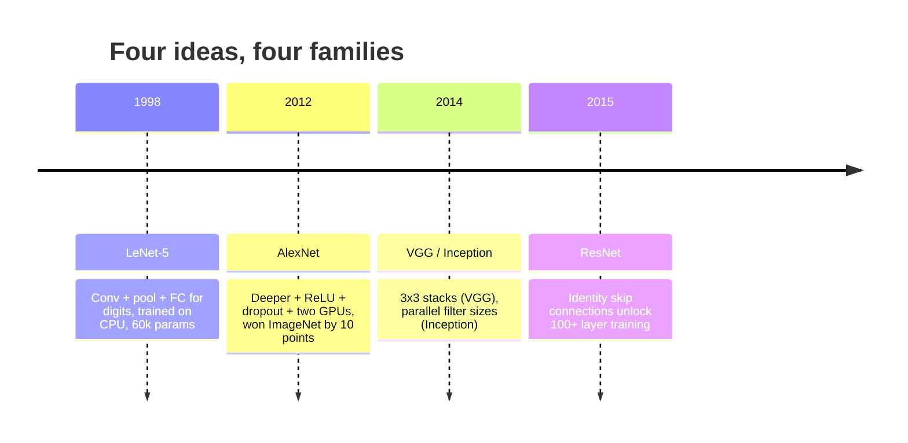
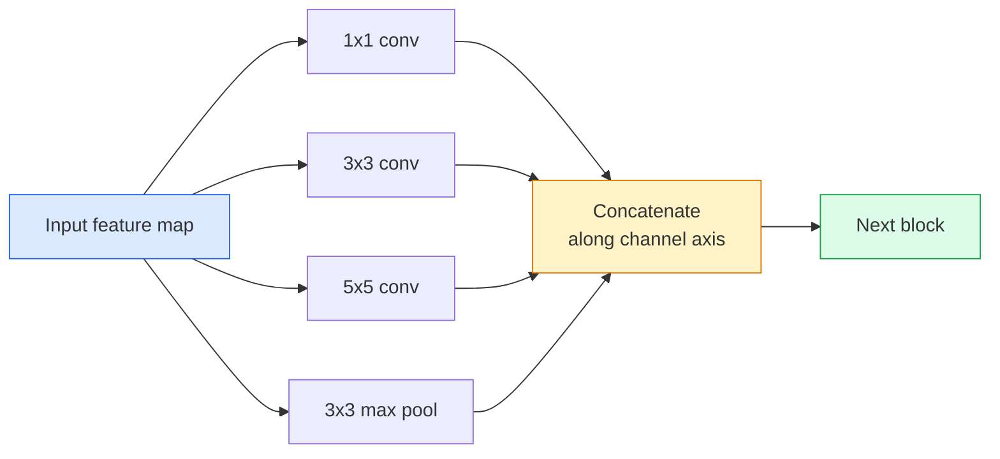

# 03 · 卷积神经网络——从 LeNet 到 ResNet

> 过去三十年里每一个重要的卷积神经网络，本质都是同一套「卷积—非线性—下采样」配方，只不过各自加上了一个新点子。请按时间顺序逐个掌握这些点子。

**类型：** 学习 + 构建
**语言：** Python
**前置：** 阶段 3 第 11 课（PyTorch）、阶段 4 第 01 课（图像基础）、阶段 4 第 02 课（从零实现卷积）
**时长：** 约 75 分钟

## 学习目标

- 梳理架构谱系 LeNet-5 -> AlexNet -> VGG -> Inception -> ResNet，并说出每个家族贡献的那一个新点子
- 在 PyTorch 中分别实现 LeNet-5、一个 VGG 风格的块，以及一个 ResNet BasicBlock，每个都控制在 40 行以内
- 解释为什么「残差连接（residual connection）」能把一个 1000 层的网络从无法训练变成业界最优
- 读懂一个现代主干网络（ResNet-18、ResNet-50），并在看源码之前就预测它的输出形状、感受野和参数量

## 问题所在

2011 年，ImageNet 上最好的分类器 top-5 准确率约为 74%。2012 年 AlexNet 拿到了 85%。2015 年 ResNet 拿到了 96%。没有新数据，也没有新一代 GPU。这些提升全部来自架构上的点子。一名合格的视觉工程师必须知道哪个点子出自哪篇论文，因为你在 2026 年部署的每一个生产级主干网络都是这些同样部件的重新组合——而且这些点子还在不断迁移：「分组卷积（grouped convolution）」从卷积神经网络迁移到了 Transformer，残差连接从 ResNet 迁移到了世上每一个大语言模型，「批归一化（batch normalisation）」活跃在扩散模型里。

按顺序研究这些网络，还能让你免疫一个常见错误：明明一个 LeNet 大小的网络就能解决问题，却伸手去抓手边最大的模型。MNIST 并不需要 ResNet。了解每个家族的缩放曲线，能告诉你应该坐在曲线上的哪个位置。

## 核心概念

### 改变视觉领域的四个点子



经典视觉领域中，没有任何东西比这四次跳跃更重要。

### LeNet-5（1998）

Yann LeCun 的数字识别器。60000 个参数。两个卷积-池化块，两个全连接层，tanh 激活。它定义了之后每一个卷积神经网络都继承下来的模板：

```
input (1, 32, 32)
  conv 5x5 -> (6, 28, 28)
  avg pool 2x2 -> (6, 14, 14)
  conv 5x5 -> (16, 10, 10)
  avg pool 2x2 -> (16, 5, 5)
  flatten -> 400
  dense -> 120
  dense -> 84
  dense -> 10
```

如今现代世界称之为卷积神经网络的一切——交替的卷积与下采样，最后接一个小的分类头——都不过是层数更多、通道更宽、激活更好的 LeNet。

### AlexNet（2012）

三处改动，合在一起攻破了 ImageNet：

1. **ReLU** 取代 tanh。梯度不再消失。训练速度提升六倍。
2. 在全连接头里加入 **Dropout**。正则化变成了一个层，而不再是个小技巧。
3. **深度与宽度**。五个卷积层、三个全连接层、6000 万参数，在两块 GPU 上训练，模型被切分到两块卡上。

该论文的图 2 至今仍把 GPU 切分画成两条平行的数据流。那种并行只是硬件上的权宜之计，并非架构上的洞见——但上面那三个点子，依然存在于你今天使用的每一个模型里。

### VGG（2014）

VGG 提出的问题是：如果你只用 3x3 卷积，并且把网络做得很深，会怎样？

```
stack:   conv 3x3 -> conv 3x3 -> pool 2x2
repeat:  16 or 19 conv layers
```

两个 3x3 卷积所覆盖的输入区域与一个 5x5 卷积相同，但参数更少（2*9*C^2 = 18C^2 对比 25*C^2），而且中间还多了一次 ReLU。VGG 把这个观察发展成了一整套架构。它的简洁——只有一种块类型、不断重复——使它成了后来一切工作的参照基准。

代价：1.38 亿参数，训练慢，推理昂贵。

### Inception（2014，同一年）

对于「我该用多大的卷积核？」这个问题，Google 的回答是：全都用上，并行地用。



每个分支各有专长——1x1 负责通道混合，3x3 负责局部纹理，5x5 负责更大的模式，池化负责具备平移不变性的特征——而拼接（concat）让下一层去挑选任何有用的分支。Inception v1 在每个分支内部用 1x1 卷积作为「瓶颈（bottleneck）」，以把参数量控制在合理范围内。

### 退化问题

到 2015 年，VGG-19 行得通，而 VGG-32 行不通。深度本应有帮助，但超过约 20 层后，训练损失和测试损失双双变差。这不是过拟合。这是优化器找不到有用的权重，因为梯度在逐层相乘的过程中不断收缩。

```
Plain deep network:
  y = f_L( f_{L-1}( ... f_1(x) ... ) )

Gradient wrt early layer:
  dL/dW_1 = dL/dy * df_L/df_{L-1} * ... * df_2/df_1 * df_1/dW_1

Each multiplicative term has magnitude roughly (weight magnitude) * (activation gain).
Stack 100 of them with gains < 1 and the gradient is effectively zero.
```

VGG 在 19 层时能行得通，是因为（同期发表的）批归一化把激活值维持在了良好的尺度上。但即便有批归一化，也救不了超过 30 层左右的深度。

### ResNet（2015）

He、Zhang、Ren、Sun 提出了一处改动，修复了一切：

```
standard block:   y = F(x)
residual block:   y = F(x) + x
```

那个 `+ x` 意味着这一层始终可以选择「什么都不做」，只要把 `F(x)` 驱动到零即可。如今一个 1000 层的 ResNet 最差也不过和一个 1 层网络一样糟，因为每个额外的块都有一条无足轻重的逃生通道。有了这个保证，优化器才愿意让每个块都*稍微*有点用——而稍微有点用，叠加 100 次，就是业界最优。


这个块有两种变体随处可见：

- **BasicBlock**（ResNet-18、ResNet-34）：两个 3x3 卷积，跳连绕过两者。
- **Bottleneck**（ResNet-50、-101、-152）：1x1 降维、3x3 居中、1x1 升维，跳连绕过这三者。在通道数很高时更省算力。

当跳连必须跨越一次下采样（stride=2）时，恒等路径会被替换成一个 1x1 stride=2 的卷积，以匹配形状。

### 为什么残差连接的意义超越视觉领域

这个点子其实并不真正关乎图像分类。它关乎的是把深层网络从「碰运气、祈祷梯度能存活」变成一个可靠、可扩展的工程工具。你下一阶段将读到的每一个 Transformer，其每个块里都有一模一样的跳连。没有 ResNet，就没有 GPT。

## 动手构建

### 第 1 步：LeNet-5

一个极简而忠实的 LeNet。tanh 激活，平均池化。唯一向现代做出的让步，是我们在下游使用 `nn.CrossEntropyLoss`，而非原始的高斯连接。

```python
import torch
import torch.nn as nn
import torch.nn.functional as F

class LeNet5(nn.Module):
    def __init__(self, num_classes=10):
        super().__init__()
        self.conv1 = nn.Conv2d(1, 6, kernel_size=5)
        self.conv2 = nn.Conv2d(6, 16, kernel_size=5)
        self.pool = nn.AvgPool2d(2)
        self.fc1 = nn.Linear(16 * 5 * 5, 120)
        self.fc2 = nn.Linear(120, 84)
        self.fc3 = nn.Linear(84, num_classes)

    def forward(self, x):
        x = self.pool(torch.tanh(self.conv1(x)))
        x = self.pool(torch.tanh(self.conv2(x)))
        x = torch.flatten(x, 1)
        x = torch.tanh(self.fc1(x))
        x = torch.tanh(self.fc2(x))
        return self.fc3(x)

net = LeNet5()
x = torch.randn(1, 1, 32, 32)
print(f"output: {net(x).shape}")
print(f"params: {sum(p.numel() for p in net.parameters()):,}")
```

预期输出：`output: torch.Size([1, 10])`、`params: 61,706`。这就是开启现代视觉时代的那整个数字分类器。

### 第 2 步：一个 VGG 块

一个可复用的块：两个 3x3 卷积、ReLU、批归一化、最大池化。

```python
class VGGBlock(nn.Module):
    def __init__(self, in_c, out_c):
        super().__init__()
        self.conv1 = nn.Conv2d(in_c, out_c, kernel_size=3, padding=1)
        self.bn1 = nn.BatchNorm2d(out_c)
        self.conv2 = nn.Conv2d(out_c, out_c, kernel_size=3, padding=1)
        self.bn2 = nn.BatchNorm2d(out_c)
        self.pool = nn.MaxPool2d(2)

    def forward(self, x):
        x = F.relu(self.bn1(self.conv1(x)))
        x = F.relu(self.bn2(self.conv2(x)))
        return self.pool(x)

class MiniVGG(nn.Module):
    def __init__(self, num_classes=10):
        super().__init__()
        self.stack = nn.Sequential(
            VGGBlock(3, 32),
            VGGBlock(32, 64),
            VGGBlock(64, 128),
        )
        self.head = nn.Sequential(
            nn.AdaptiveAvgPool2d(1),
            nn.Flatten(),
            nn.Linear(128, num_classes),
        )

    def forward(self, x):
        return self.head(self.stack(x))

net = MiniVGG()
x = torch.randn(1, 3, 32, 32)
print(f"output: {net(x).shape}")
print(f"params: {sum(p.numel() for p in net.parameters()):,}")
```

在 CIFAR 大小的输入上叠三个 VGG 块，一个自适应池化，一个线性层。约 29 万参数。对付 CIFAR-10 绰绰有余。

### 第 3 步：一个 ResNet BasicBlock

ResNet-18 和 ResNet-34 的核心构建块。

```python
class BasicBlock(nn.Module):
    def __init__(self, in_c, out_c, stride=1):
        super().__init__()
        self.conv1 = nn.Conv2d(in_c, out_c, kernel_size=3, stride=stride, padding=1, bias=False)
        self.bn1 = nn.BatchNorm2d(out_c)
        self.conv2 = nn.Conv2d(out_c, out_c, kernel_size=3, stride=1, padding=1, bias=False)
        self.bn2 = nn.BatchNorm2d(out_c)
        if stride != 1 or in_c != out_c:
            self.shortcut = nn.Sequential(
                nn.Conv2d(in_c, out_c, kernel_size=1, stride=stride, bias=False),
                nn.BatchNorm2d(out_c),
            )
        else:
            self.shortcut = nn.Identity()

    def forward(self, x):
        out = F.relu(self.bn1(self.conv1(x)))
        out = self.bn2(self.conv2(out))
        out = out + self.shortcut(x)
        return F.relu(out)
```

在卷积层上设 `bias=False` 是批归一化的惯例——BN 的 beta 参数已经处理了偏置，所以卷积再带一份偏置纯属浪费。只有当 stride 或通道数发生变化时，`shortcut` 才需要一个真正的卷积；否则它就是一个什么都不做的恒等映射。

### 第 4 步：一个微型 ResNet

把四组 BasicBlock 叠起来，得到一个能用于 CIFAR 大小输入的 ResNet。

```python
class TinyResNet(nn.Module):
    def __init__(self, num_classes=10):
        super().__init__()
        self.stem = nn.Sequential(
            nn.Conv2d(3, 32, kernel_size=3, stride=1, padding=1, bias=False),
            nn.BatchNorm2d(32),
            nn.ReLU(inplace=True),
        )
        self.layer1 = self._make_group(32, 32, num_blocks=2, stride=1)
        self.layer2 = self._make_group(32, 64, num_blocks=2, stride=2)
        self.layer3 = self._make_group(64, 128, num_blocks=2, stride=2)
        self.layer4 = self._make_group(128, 256, num_blocks=2, stride=2)
        self.head = nn.Sequential(
            nn.AdaptiveAvgPool2d(1),
            nn.Flatten(),
            nn.Linear(256, num_classes),
        )

    def _make_group(self, in_c, out_c, num_blocks, stride):
        blocks = [BasicBlock(in_c, out_c, stride=stride)]
        for _ in range(num_blocks - 1):
            blocks.append(BasicBlock(out_c, out_c, stride=1))
        return nn.Sequential(*blocks)

    def forward(self, x):
        x = self.stem(x)
        x = self.layer1(x)
        x = self.layer2(x)
        x = self.layer3(x)
        x = self.layer4(x)
        return self.head(x)

net = TinyResNet()
x = torch.randn(1, 3, 32, 32)
print(f"output: {net(x).shape}")
print(f"params: {sum(p.numel() for p in net.parameters()):,}")
```

四组，每组两个块。第 2、3、4 组的起始处使用 stride 2。每次下采样通道数翻倍。约 280 万参数。这就是能干净地一路扩展到 ResNet-152 的标准配方。

### 第 5 步：比较「参数到特征」的效率

让同一个输入流经全部三个网络，并比较它们的参数量。

```python
def summary(name, net, x):
    y = net(x)
    params = sum(p.numel() for p in net.parameters())
    print(f"{name:12s}  input {tuple(x.shape)} -> output {tuple(y.shape)}  params {params:>10,}")

x = torch.randn(1, 3, 32, 32)
summary("LeNet5",     LeNet5(),       torch.randn(1, 1, 32, 32))
summary("MiniVGG",    MiniVGG(),      x)
summary("TinyResNet", TinyResNet(),   x)
```

三个模型，三个时代，参数量相差三个数量级。在 CIFAR-10 准确率上，经过若干轮训练后你大致需要：LeNet 60%，MiniVGG 89%，TinyResNet 93%。

## 实战应用

`torchvision.models` 为你提供了上述所有模型的预训练版本。各家族的调用签名完全一致——这恰恰是主干网络这一抽象的意义所在。

```python
from torchvision.models import resnet18, ResNet18_Weights, vgg16, VGG16_Weights

r18 = resnet18(weights=ResNet18_Weights.IMAGENET1K_V1)
r18.eval()

print(f"ResNet-18 params: {sum(p.numel() for p in r18.parameters()):,}")
print(r18.layer1[0])
print()

v16 = vgg16(weights=VGG16_Weights.IMAGENET1K_V1)
v16.eval()
print(f"VGG-16   params: {sum(p.numel() for p in v16.parameters()):,}")
```

ResNet-18 有 1170 万参数。VGG-16 有 1.38 亿参数。两者在 ImageNet 上的 top-1 准确率相近（69.8% 对比 71.6%）。残差连接为你带来了 12 倍的参数效率优势。这就是为什么从 2016 年直到 2021 年 ViT 出现之前，ResNet 系列一直占据主导——而且在算力受限的真实部署场景中，它至今仍然主导。

对于「迁移学习（transfer learning）」，配方永远一样：加载预训练模型，冻结主干，替换分类头。

```python
for p in r18.parameters():
    p.requires_grad = False
r18.fc = nn.Linear(r18.fc.in_features, 10)
```

三行代码。你现在就拥有了一个 10 类的 CIFAR 分类器，它继承了 ImageNet 花费巨资学到的那些表征。

## 交付产出

这一课产出：

- `outputs/prompt-backbone-selector.md`——一个提示词，能在给定任务、数据集规模和算力预算的情况下，挑选出合适的 CNN 家族（LeNet/VGG/ResNet/MobileNet/ConvNeXt）。
- `outputs/skill-residual-block-reviewer.md`——一个技能，能读取一个 PyTorch 模块并标记跳连方面的错误（stride 变化时缺失 shortcut、shortcut 的激活顺序、BN 相对于相加的位置）。

## 练习

1. **（简单）** 手动逐层统计 `TinyResNet` 的参数量。与 `sum(p.numel() for p in net.parameters())` 对照。参数预算的大头花在了哪里——卷积、BN，还是分类头？
2. **（中等）** 实现 Bottleneck 块（1x1 -> 3x3 -> 1x1 带跳连），并用它为 CIFAR 构建一个 ResNet-50 风格的网络。把参数量与 `TinyResNet` 对比。
3. **（困难）** 从 `BasicBlock` 中去掉跳连，在 CIFAR-10 上各训练一个 34 块的「朴素」网络和一个 34 块的 ResNet，各训 10 轮。绘制两者的训练损失随轮次变化的曲线。复现 He 等人论文图 1 的结果：朴素深层网络收敛到的损失，比它更浅的孪生网络还要高。

## 关键术语

| 术语 | 人们怎么说 | 它实际的含义 |
|------|----------------|----------------------|
| 主干网络（Backbone） | 「那个模型」 | 一叠卷积块，产出供任务头使用的特征图 |
| 残差连接（Residual connection） | 「跳连」 | `y = F(x) + x`；让优化器可以通过把 F 设为零来学到恒等映射，从而使任意深度都可训练 |
| BasicBlock | 「两个 3x3 卷积加一条跳连」 | ResNet-18/34 的构建块：conv-BN-ReLU-conv-BN-add-ReLU |
| Bottleneck | 「1x1 降维、3x3、1x1 升维」 | ResNet-50/101/152 的块；在高通道数下很省，因为 3x3 在缩减后的宽度上运行 |
| 退化问题（Degradation problem） | 「越深越差」 | 超过约 20 个朴素卷积层后，训练误差和测试误差都上升；靠残差连接解决，而非靠更多数据 |
| Stem（输入主干） | 「第一层」 | 把 3 通道输入转换成基础特征宽度的起始卷积；ImageNet 通常用 7x7 stride 2，CIFAR 用 3x3 stride 1 |
| Head（分类头） | 「分类器」 | 最后一个主干块之后的若干层：自适应池化、展平、线性层 |
| 迁移学习（Transfer learning） | 「预训练权重」 | 加载一个在 ImageNet 上训练好的主干，仅在你的任务上微调分类头 |

## 延伸阅读

- [Deep Residual Learning for Image Recognition (He et al., 2015)](https://arxiv.org/abs/1512.03385)——ResNet 论文；每一幅图都值得研究
- [Very Deep Convolutional Networks (Simonyan & Zisserman, 2014)](https://arxiv.org/abs/1409.1556)——VGG 论文；至今仍是「为什么用 3x3」的最佳参考
- [ImageNet Classification with Deep CNNs (Krizhevsky et al., 2012)](https://papers.nips.cc/paper_files/paper/2012/hash/c399862d3b9d6b76c8436e924a68c45b-Abstract.html)——AlexNet；终结手工特征时代的那篇论文
- [Going Deeper with Convolutions (Szegedy et al., 2014)](https://arxiv.org/abs/1409.4842)——Inception v1；那个并行滤波器的点子至今仍出现在视觉 Transformer 中
