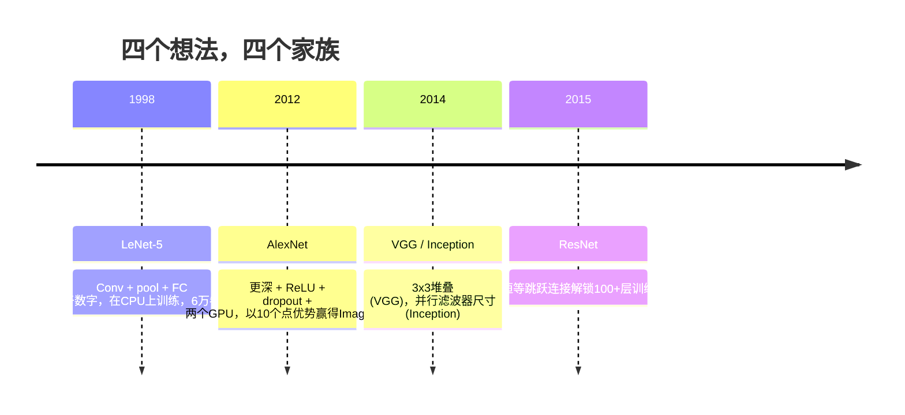
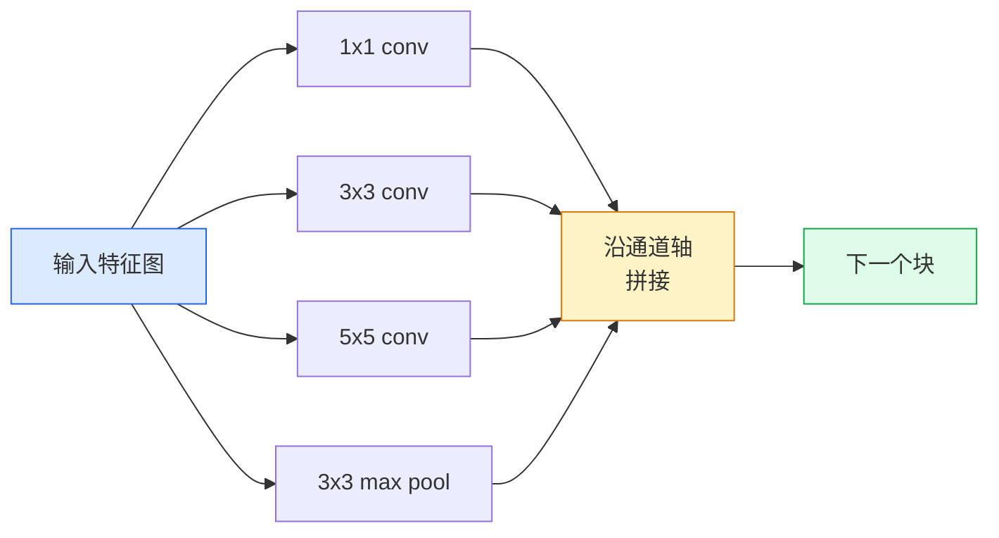
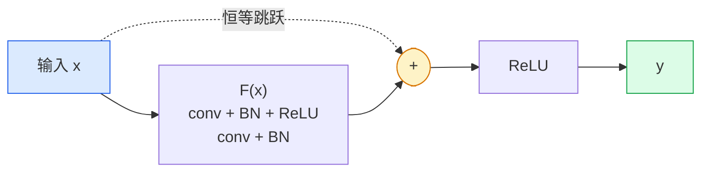

# CNN — 从LeNet到ResNet

> 过去三十年的每一个主要CNN都是相同的conv–非线性–下采样配方，加上一个新想法。按顺序学习这些想法。

**类型：** 学习+构建
**语言：** Python
**前置条件：** 阶段3 第11课（PyTorch），阶段4 第01课（图像基础），阶段4 第02课（从零实现卷积）
**时间：** ~75分钟

## 学习目标

- 追溯架构谱系 LeNet-5 -> AlexNet -> VGG -> Inception -> ResNet，并说明每个家族贡献的一个新想法
- 在PyTorch中实现LeNet-5、VGG风格的块和ResNet BasicBlock，每段代码在40行以内
- 解释为什么残差连接将1000层网络从不可训练变为最先进水平
- 阅读现代backbone（ResNet-18、ResNet-50），并在查看源代码之前预测其输出形状、感受野和参数数量

## 问题

2011年，最好的ImageNet分类器top-5准确率约为74%。2012年AlexNet达到85%。2015年ResNet达到96%。没有新数据。没有新GPU代际。这些进步来自架构思想。一个工作中的视觉工程师必须知道哪个想法来自哪篇论文，因为你在2026年交付的每个生产级backbone都是这些相同片段的重新组合——而且因为这些想法不断迁移：grouped convs从CNN到了transformer，残差连接从ResNet到了每个LLM，batch normalization存在于扩散模型中。

按顺序学习这些网络也能让你免疫一个常见错误：当LeNet大小的网络就能解决问题时，却去使用最大的可用模型。MNIST不需要ResNet。了解每个家族的扩展曲线告诉你应该停留在哪个位置。

## 概念

### 改变视觉的四个想法


```mermaid
timeline
    title 四个想法，四个家族
    1998 : LeNet-5 : Conv + pool + FC 用于数字，在CPU上训练，6万参数
    2012 : AlexNet : 更深 + ReLU + dropout + 两个GPU，以10个点优势赢得ImageNet
    2014 : VGG / Inception : 3x3堆叠 (VGG)，并行滤波器尺寸 (Inception)
    2015 : ResNet : 恒等跳跃连接解锁100+层训练
```

经典视觉中没有任何其他东西像这四个跳跃一样重要。

### LeNet-5 (1998)

Yann LeCun的数字识别器。60,000个参数。两个conv-pool块，两个全连接层，tanh激活。它定义了每个CNN继承的模板：

```
input (1, 32, 32)
  conv 5x5 -> (6, 28, 28)
  avg pool 2x2 -> (6, 14, 14)
  conv 5x5 -> (16, 10, 10)
  avg pool 2x2 -> (16, 5, 5)
  flatten -> 400
  dense -> 120
  dense -> 84
  dense -> 10
```

现代世界所称的CNN的一切——交替的卷积和下采样，馈送到一个小分类器头——就是具有更多层、更大通道和更好激活函数的LeNet。

### AlexNet (2012)

三个变化共同打破了ImageNet：

1. **ReLU** 替代tanh。梯度停止消失。训练速度提高六倍。
2. **Dropout** 在全连接头中。正则化成为一个层，而不是一个技巧。
3. **深度和宽度**。五个conv层，三个dense层，6000万参数，在两个GPU上训练，模型在它们之间分割。

论文的图2仍然显示GPU分割为两个并行流。这种并行性是一种硬件变通方法，而不是架构洞见——但上述三个想法仍然存在于你使用的每个模型中。

### VGG (2014)

VGG问道：如果你只使用3x3卷积并深入到底，会发生什么？

```
stack:   conv 3x3 -> conv 3x3 -> pool 2x2
repeat:  16 或 19 个 conv 层
```

两个3x3 conv看到与一个5x5 conv相同的5x5输入区域，但参数更少（2*9*C^2 = 18C^2 对比 25*C^2）且中间有一个额外的ReLU。VGG将这一观察变成了整个架构。这种简单性——一个块类型，重复使用——使其成为后续一切的参考点。

代价：1.38亿参数，训练慢，推理昂贵。

### Inception (2014，同一年)

谷歌对"我应该使用什么kernel大小？"的回答是：全部，并行使用。


```mermaid
flowchart LR
    IN["输入特征图"] --> A["1x1 conv"]
    IN --> B["3x3 conv"]
    IN --> C["5x5 conv"]
    IN --> D["3x3 max pool"]
    A --> CAT["沿通道轴<br/>拼接"]
    B --> CAT
    C --> CAT
    D --> CAT
    CAT --> OUT["下一个块"]

    style IN fill:#dbeafe,stroke:#2563eb
    style CAT fill:#fef3c7,stroke:#d97706
    style OUT fill:#dcfce7,stroke:#16a34a
```

每个分支专门化——1x1用于通道混合，3x3用于局部纹理，5x5用于更大的模式，pooling用于平移不变特征——拼接让下一层可以选择任何有用的分支。Inception v1在每个分支内部使用1x1卷积作为瓶颈，以保持参数数量合理。

### 退化问题

到2015年，VGG-19有效而VGG-32无效。深度本应有所帮助，但超过约20层后，训练和测试损失都变得更差。这不是过拟合。这是优化器无法找到有用权重，因为梯度通过每一层呈乘法缩小。

```
普通深度网络：
  y = f_L( f_{L-1}( ... f_1(x) ... ) )

关于早期层的梯度：
  dL/dW_1 = dL/dy * df_L/df_{L-1} * ... * df_2/df_1 * df_1/dW_1

每个乘法项的幅度大约为 (权重幅度) * (激活增益)。
堆叠100个增益<1的项，梯度实际上为零。
```

VGG在19层时有效，因为batch norm（同时发表）保持了激活的良好缩放。但即使batch norm也无法挽救超过约30层的深度。

### ResNet (2015)

He、Zhang、Ren、Sun提出了一个解决所有问题的改变：

```
标准块:   y = F(x)
残差块:   y = F(x) + x
```

`+ x` 意味着该层总是可以通过将 `F(x)` 驱动为零来选择什么也不做。一个1000层的ResNet现在最多和1层网络一样差，因为每个额外的块都有一个简单的逃生口。有了这个保证，优化器愿意让每个块*稍微*有用——而稍微有用，堆叠100次，就是最先进水平。


```mermaid
flowchart LR
    X["输入 x"] --> F["F(x)<br/>conv + BN + ReLU<br/>conv + BN"]
    X -.->|恒等跳跃| PLUS(["+"])
    F --> PLUS
    PLUS --> RELU["ReLU"]
    RELU --> OUT["y"]

    style X fill:#dbeafe,stroke:#2563eb
    style PLUS fill:#fef3c7,stroke:#d97706
    style OUT fill:#dcfce7,stroke:#16a34a
```

无处不在的两种块变体：

- **BasicBlock** (ResNet-18, ResNet-34)：两个3x3 convs，跳跃绕过两者。
- **Bottleneck** (ResNet-50, -101, -152)：1x1降维，3x3中间，1x1升维，跳跃绕过三重奏。在通道数量高时更便宜。

当跳跃需要跨越下采样（stride=2）时，恒等路径被替换为1x1 stride=2 conv以匹配形状。

### 为什么残差在视觉之外也重要

这个想法实际上不是关于图像分类的。它是关于将深度网络从"祈祷梯度存活"转变为可靠、可扩展的工程工具。你在下一阶段将读到的每个transformer在每个块中都有完全相同的跳跃连接。没有ResNet，就没有GPT。

```figure
pooling
```

## 构建

### 第1步：LeNet-5

一个最小、忠实的LeNet。Tanh激活，average pooling。对现代性的唯一让步是我们使用`nn.CrossEntropyLoss`而不是原始的Gaussian连接。

```python
import torch
import torch.nn as nn
import torch.nn.functional as F

class LeNet5(nn.Module):
    def __init__(self, num_classes=10):
        super().__init__()
        self.conv1 = nn.Conv2d(1, 6, kernel_size=5)
        self.conv2 = nn.Conv2d(6, 16, kernel_size=5)
        self.pool = nn.AvgPool2d(2)
        self.fc1 = nn.Linear(16 * 5 * 5, 120)
        self.fc2 = nn.Linear(120, 84)
        self.fc3 = nn.Linear(84, num_classes)

    def forward(self, x):
        x = self.pool(torch.tanh(self.conv1(x)))
        x = self.pool(torch.tanh(self.conv2(x)))
        x = torch.flatten(x, 1)
        x = torch.tanh(self.fc1(x))
        x = torch.tanh(self.fc2(x))
        return self.fc3(x)

net = LeNet5()
x = torch.randn(1, 1, 32, 32)
print(f"output: {net(x).shape}")
print(f"params: {sum(p.numel() for p in net.parameters()):,}")
```

期望输出：`output: torch.Size([1, 10])`, `params: 61,706`。这就是启动了现代视觉的整个数字分类器。

### 第2步：VGG块

一个可复用的块：两个3x3 conv，ReLU，batch norm，max pool。

```python
class VGGBlock(nn.Module):
    def __init__(self, in_c, out_c):
        super().__init__()
        self.conv1 = nn.Conv2d(in_c, out_c, kernel_size=3, padding=1)
        self.bn1 = nn.BatchNorm2d(out_c)
        self.conv2 = nn.Conv2d(out_c, out_c, kernel_size=3, padding=1)
        self.bn2 = nn.BatchNorm2d(out_c)
        self.pool = nn.MaxPool2d(2)

    def forward(self, x):
        x = F.relu(self.bn1(self.conv1(x)))
        x = F.relu(self.bn2(self.conv2(x)))
        return self.pool(x)

class MiniVGG(nn.Module):
    def __init__(self, num_classes=10):
        super().__init__()
        self.stack = nn.Sequential(
            VGGBlock(3, 32),
            VGGBlock(32, 64),
            VGGBlock(64, 128),
        )
        self.head = nn.Sequential(
            nn.AdaptiveAvgPool2d(1),
            nn.Flatten(),
            nn.Linear(128, num_classes),
        )

    def forward(self, x):
        return self.head(self.stack(x))

net = MiniVGG()
x = torch.randn(1, 3, 32, 32)
print(f"output: {net(x).shape}")
print(f"params: {sum(p.numel() for p in net.parameters()):,}")
```

CIFAR大小输入上的三个VGG块，一个adaptive pool，一个线性层。约29万个参数。对CIFAR-10来说足够了。

### 第3步：ResNet BasicBlock

ResNet-18和ResNet-34的核心构建块。

```python
class BasicBlock(nn.Module):
    def __init__(self, in_c, out_c, stride=1):
        super().__init__()
        self.conv1 = nn.Conv2d(in_c, out_c, kernel_size=3, stride=stride, padding=1, bias=False)
        self.bn1 = nn.BatchNorm2d(out_c)
        self.conv2 = nn.Conv2d(out_c, out_c, kernel_size=3, stride=1, padding=1, bias=False)
        self.bn2 = nn.BatchNorm2d(out_c)
        if stride != 1 or in_c != out_c:
            self.shortcut = nn.Sequential(
                nn.Conv2d(in_c, out_c, kernel_size=1, stride=stride, bias=False),
                nn.BatchNorm2d(out_c),
            )
        else:
            self.shortcut = nn.Identity()

    def forward(self, x):
        out = F.relu(self.bn1(self.conv1(x)))
        out = self.bn2(self.conv2(out))
        out = out + self.shortcut(x)
        return F.relu(out)
```

conv层上的`bias=False`是batch-norm惯例——BN的beta参数已经处理了bias，所以携带conv bias也是浪费。`shortcut`仅在stride或通道数变化时需要真正的conv；否则它是一个无操作的identity。

### 第4步：一个小型ResNet

堆叠四组BasicBlocks，得到一个适用于CIFAR大小输入的可工作的ResNet。

```python
class TinyResNet(nn.Module):
    def __init__(self, num_classes=10):
        super().__init__()
        self.stem = nn.Sequential(
            nn.Conv2d(3, 32, kernel_size=3, stride=1, padding=1, bias=False),
            nn.BatchNorm2d(32),
            nn.ReLU(inplace=True),
        )
        self.layer1 = self._make_group(32, 32, num_blocks=2, stride=1)
        self.layer2 = self._make_group(32, 64, num_blocks=2, stride=2)
        self.layer3 = self._make_group(64, 128, num_blocks=2, stride=2)
        self.layer4 = self._make_group(128, 256, num_blocks=2, stride=2)
        self.head = nn.Sequential(
            nn.AdaptiveAvgPool2d(1),
            nn.Flatten(),
            nn.Linear(256, num_classes),
        )

    def _make_group(self, in_c, out_c, num_blocks, stride):
        blocks = [BasicBlock(in_c, out_c, stride=stride)]
        for _ in range(num_blocks - 1):
            blocks.append(BasicBlock(out_c, out_c, stride=1))
        return nn.Sequential(*blocks)

    def forward(self, x):
        x = self.stem(x)
        x = self.layer1(x)
        x = self.layer2(x)
        x = self.layer3(x)
        x = self.layer4(x)
        return self.head(x)

net = TinyResNet()
x = torch.randn(1, 3, 32, 32)
print(f"output: {net(x).shape}")
print(f"params: {sum(p.numel() for p in net.parameters()):,}")
```

四组，每组两个块。第2、3、4组开始时stride为2。每次下采样时通道数翻倍。大约280万个参数。这是可以干净地扩展到ResNet-152的标准配方。

### 第5步：比较参数到特征的效率

通过所有三个网络运行相同的输入并比较参数数量。

```python
def summary(name, net, x):
    y = net(x)
    params = sum(p.numel() for p in net.parameters())
    print(f"{name:12s}  input {tuple(x.shape)} -> output {tuple(y.shape)}  params {params:>10,}")

x = torch.randn(1, 3, 32, 32)
summary("LeNet5",     LeNet5(),       torch.randn(1, 1, 32, 32))
summary("MiniVGG",    MiniVGG(),      x)
summary("TinyResNet", TinyResNet(),   x)
```

三个模型，三个时代，参数数量的三个数量级。对于CIFAR-10准确率，经过几个epoch的训练，你大约需要：LeNet 60%，MiniVGG 89%，TinyResNet 93%。

## 使用

`torchvision.models` 为你提供了上述所有模型的预训练版本。跨家族的调用签名相同，这正是backbone抽象的意义所在。

```python
from torchvision.models import resnet18, ResNet18_Weights, vgg16, VGG16_Weights

r18 = resnet18(weights=ResNet18_Weights.IMAGENET1K_V1)
r18.eval()

print(f"ResNet-18 params: {sum(p.numel() for p in r18.parameters()):,}")
print(r18.layer1[0])
print()

v16 = vgg16(weights=VGG16_Weights.IMAGENET1K_V1)
v16.eval()
print(f"VGG-16   params: {sum(p.numel() for p in v16.parameters()):,}")
```

ResNet-18有1170万个参数。VGG-16有1.38亿个。相似的ImageNet top-1准确率（69.8% vs 71.6%）。残差连接为你带来12倍的参数效率优势。这就是为什么ResNet变体从2016年主导到2021年ViT到来——并且在计算资源受限的实际部署中仍然占主导地位。

对于迁移学习，配方总是相同的：加载预训练，冻结backbone，替换分类器头。

```python
for p in r18.parameters():
    p.requires_grad = False
r18.fc = nn.Linear(r18.fc.in_features, 10)
```

三行代码。你现在有了一个继承ImageNet所支付表示的10类CIFAR分类器。

## 交付物

本课产出：

- `outputs/prompt-backbone-selector.md` — 一个prompt，根据任务、数据集大小和计算预算选择合适的CNN家族（LeNet/VGG/ResNet/MobileNet/ConvNeXt）。
- `outputs/skill-residual-block-reviewer.md` — 一个技能，读取PyTorch模块并标记跳跃连接错误（stride变化时缺少shortcut、shortcut激活顺序、BN相对于加法的位置）。

## 练习

1. **(简单)** 手动逐层计算`TinyResNet`的参数数量。与`sum(p.numel() for p in net.parameters())`比较。参数预算的大部分去向哪里——convs、BN还是分类器头？
2. **(中等)** 实现Bottleneck块（1x1 -> 3x3 -> 1x1带skip），并用它为CIFAR构建一个ResNet-50风格的网络。与`TinyResNet`比较参数数量。
3. **(困难)** 从`BasicBlock`中移除跳跃连接，在CIFAR-10上各训练10个epoch一个34块"plain"网络和一个34块ResNet。绘制两者的训练损失vs epoch曲线。重现He等人图1的结果，其中普通深度网络收敛到比其更浅的双胞胎更高的损失。

## 关键术语

| 术语 | 人们的说法 | 实际含义 |
|------|----------------|----------------------|
| Backbone | "模型" | 产生馈送到任务头的特征图的卷积块堆叠 |
| Residual connection | "跳跃连接" | `y = F(x) + x`；通过将F设为零让优化器学习identity，从而使任意深度可训练 |
| BasicBlock | "带跳跃的两个3x3 conv" | ResNet-18/34构建块：conv-BN-ReLU-conv-BN-add-ReLU |
| Bottleneck | "1x1降维, 3x3, 1x1升维" | ResNet-50/101/152块；在高通道数时便宜，因为3x3在减少的宽度上运行 |
| Degradation problem | "更深更差" | 超过约20个普通conv层后，训练和测试误差都会增加；由残差连接解决，而非更多数据 |
| Stem | "第一层" | 将3通道输入转换为基本特征宽度的初始conv；ImageNet通常为7x7 stride 2，CIFAR为3x3 stride 1 |
| Head | "分类器" | 最终backbone块之后的层：adaptive pool、flatten、linear(s) |
| Transfer learning | "预训练权重" | 加载在ImageNet上训练的backbone，仅在你的任务上微调head |

## 延伸阅读

- [Deep Residual Learning for Image Recognition (He et al., 2015)](https://arxiv.org/abs/1512.03385) — ResNet论文；每个数字都值得研究
- [Very Deep Convolutional Networks (Simonyan & Zisserman, 2014)](https://arxiv.org/abs/1409.1556) — VGG论文；仍然是"为什么用3x3"的最佳参考
- [ImageNet Classification with Deep CNNs (Krizhevsky et al., 2012)](https://papers.nips.cc/paper_files/paper/2012/hash/c399862d3b9d6b76c8436e924a68c45b-Abstract.html) — AlexNet；结束了手工特征时代的论文
- [Going Deeper with Convolutions (Szegedy et al., 2014)](https://arxiv.org/abs/1409.4842) — Inception v1；其并行滤波器想法至今仍在vision transformers中出现
