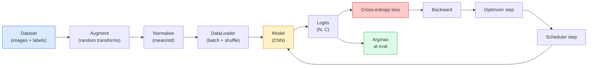

# 画像分類

> 分類器とは、ピクセルからクラス上の確率分布への関数です。それ以外はすべて配管です。

**種類:** Build
**言語:** Python
**前提条件:** フェーズ 2 レッスン 09（Model Evaluation）、フェーズ 3 レッスン 10（Mini Framework）、フェーズ 4 レッスン 03（CNNs）
**所要時間:** 約 75 分

## 学習目標

- CIFAR-10 向けのエンドツーエンドな画像分類パイプラインを構築する: データセット、拡張、モデル、学習ループ、評価
- 各コンポーネント（dataloader、loss、optimizer、scheduler、augmentation）の役割を説明し、どれか 1 つが壊れたときに損失曲線へどう現れるかを予測する
- mixup、cutout、label smoothing をゼロから実装し、それぞれを追加する価値がある場面を説明する
- 混同行列とクラス別 precision/recall 表を読み、集約 accuracy だけでは見えないデータセットとモデルの失敗を診断する

## 問題

出荷されるあらゆるビジョンタスクは、どこかのレベルで画像分類に帰着します。検出は領域を分類します。セグメンテーションはピクセルを分類します。検索はクラス重心との類似度で順位付けします。分類を正しく作ること、つまりデータセットループ、拡張方針、損失、評価を正しく組む力は、このフェーズの他のすべてのタスクに移転します。

分類のバグの多くはモデルの中にはありません。壊れた正規化、shuffle されていない訓練セット、ラベルを歪める拡張、訓練データで汚染された検証 split、epoch 30 の後に静かに発散する学習率など、パイプラインに潜んでいます。正しいセットアップなら CIFAR-10 で 93% に届く CNN でも、壊れたセットアップではよく 70-75% に落ちます。そして損失曲線は最後までそれらしく見えます。

このレッスンでは、全体のパイプラインを手でつなぎ、どの部分も検査できるようにします。バグを隠し得る `torchvision.datasets` の機能は使いません。

## 概念

### 分類パイプライン



このループの各行にバグが入り込めます。Cross-entropy は softmax 出力ではなく raw logits を受け取るので、loss の前に `model(x).softmax()` を置くと、静かに間違った勾配を計算します。拡張は入力にだけ適用し、ラベルには適用しません。ただし mixup だけは両方を混ぜます。`optimizer.zero_grad()` は step ごとに 1 回必要です。省くと勾配が蓄積し、学習率がひどく不安定に見えます。こうしたバグはどれもエラーを出さずに学習曲線を平らにします。

### Cross-entropy、logits、softmax

分類器は画像ごとに logits と呼ばれる `C` 個の数値を出します。softmax を適用すると、それらは確率分布になります。

```
softmax(z)_i = exp(z_i) / sum_j exp(z_j)
```

Cross-entropy は正解クラスの負の対数確率を測ります。

```
CE(z, y) = -log( softmax(z)_y )
        = -z_y + log( sum_j exp(z_j) )
```

右辺の形が数値的に安定な形（log-sum-exp）です。PyTorch の `nn.CrossEntropyLoss` は softmax + NLL を 1 つの op に融合し、raw logits を直接受け取ります。先に自分で softmax を適用するのは、ほぼ常にバグです。意味のない量である log(softmax(softmax(z))) を計算してしまいます。

### 拡張が効く理由

CNN には重み共有による平行移動への inductive bias がありますが、crop、flip、colour jitter、occlusion への不変性は組み込まれていません。その不変性を教える唯一の方法は、それを試すピクセルを見せることです。訓練中のランダム変換はどれも、「この 2 つの画像は同じラベルを持つ。違いを無視する特徴を学べ」という指示です。

```
Original crop:  "dog facing left"
Flip:           "dog facing right"       <- same label, different pixels
Rotate(+15):    "dog, slight tilt"
Colour jitter:  "dog in warmer light"
RandomErasing:  "dog with patch missing"
```

ルールは、拡張がラベルを保存しなければならない、ということです。数字データセットでは cutout や rotation が "6" を "9" に変えてしまうことがあります。その場合は回転範囲を小さくし、数字固有の不変性を尊重する拡張を選びます。

### Mixup と cutmix

通常の拡張はピクセルを変換し、ラベルは one-hot のままにします。**Mixup** と **cutmix** は、ピクセルとラベルの両方を補間することでその前提を破ります。

```
Mixup:
  lambda ~ Beta(a, a)
  x = lambda * x_i + (1 - lambda) * x_j
  y = lambda * y_i + (1 - lambda) * y_j

Cutmix:
  paste a random rectangle of x_j into x_i
  y = area-weighted mix of y_i and y_j
```

これが効く理由は、モデルが尖った one-hot target を暗記するのをやめ、クラス間を補間するよう学ぶからです。訓練損失は上がり、テスト accuracy は上がります。分類器に対して最も安価に追加できる堅牢性の改善です。

### Label smoothing

mixup の近縁です。`[0, 0, 1, 0, 0]` を相手に訓練する代わりに、小さな `eps`、たとえば 0.1 を使って `[eps/C, eps/C, 1-eps, eps/C, eps/C]` を相手に訓練します。モデルが際限なく鋭い logits を出すのを防ぎ、ほぼ追加コストなしに calibration を改善します。PyTorch 1.10 以降では `nn.CrossEntropyLoss(label_smoothing=0.1)` に組み込まれています。

### Accuracy を超えた評価

集約 accuracy は imbalance を隠します。90-10 の二値分類器が常に多数派クラスを予測すれば 90% を出せます。実際に何が起きているかを教えてくれる道具は次の通りです。

- **クラス別 accuracy** — クラスごとの数値。苦手なカテゴリがすぐに表に出ます。
- **混同行列** — 行 i 列 j が、真のクラス i をクラス j と予測した数を表す C x C のグリッド。対角成分が正解で、非対角成分にモデルの実態があります。
- **Top-1 / Top-5** — 正解クラスが上位 1 件または上位 5 件の予測に入っているか。ImageNet では "Norwich terrier" と "Norfolk terrier" のように本当に曖昧なクラスがあるため、Top-5 が重要です。
- **Calibration (ECE)** — confidence 0.8 の予測は 80% の頻度で正しいか。現代のネットワークは体系的に過信しがちです。temperature scaling や label smoothing で修正します。

## 作る

### ステップ 1: 決定的な synthetic dataset

CIFAR-10 はディスク上にあります。このレッスンを再現可能かつ高速にするため、CIFAR のような synthetic dataset を作ります。これは 32x32 RGB 画像で、モデルが学ぶべきクラス固有の構造を持ちます。まったく同じパイプラインを real CIFAR-10 にそのまま使えます。

```python
import numpy as np
import torch
from torch.utils.data import Dataset


def synthetic_cifar(num_per_class=1000, num_classes=10, seed=0):
    rng = np.random.default_rng(seed)
    X = []
    Y = []
    for c in range(num_classes):
        centre = rng.uniform(0, 1, (3,))
        freq = 2 + c
        for _ in range(num_per_class):
            yy, xx = np.meshgrid(np.linspace(0, 1, 32), np.linspace(0, 1, 32), indexing="ij")
            r = np.sin(xx * freq) * 0.5 + centre[0]
            g = np.cos(yy * freq) * 0.5 + centre[1]
            b = (xx + yy) * 0.5 * centre[2]
            img = np.stack([r, g, b], axis=-1)
            img += rng.normal(0, 0.08, img.shape)
            img = np.clip(img, 0, 1)
            X.append(img.astype(np.float32))
            Y.append(c)
    X = np.stack(X)
    Y = np.array(Y)
    idx = rng.permutation(len(X))
    return X[idx], Y[idx]


class ArrayDataset(Dataset):
    def __init__(self, X, Y, transform=None):
        self.X = X
        self.Y = Y
        self.transform = transform

    def __len__(self):
        return len(self.X)

    def __getitem__(self, i):
        img = self.X[i]
        if self.transform is not None:
            img = self.transform(img)
        img = torch.from_numpy(img).permute(2, 0, 1)
        return img, int(self.Y[i])
```

各クラスは独自の色 palette と周波数 pattern を持ち、さらに Gaussian noise を加えて、モデルがピクセルを暗記するのではなく signal を学ぶようにします。10 クラス、それぞれ 1000 枚の画像を作り、permutation します。

### ステップ 2: 正規化と拡張

すべてのビジョンパイプラインにある 2 つの transform です。

```python
def standardize(mean, std):
    mean = np.array(mean, dtype=np.float32)
    std = np.array(std, dtype=np.float32)
    def _fn(img):
        return (img - mean) / std
    return _fn


def random_hflip(p=0.5):
    def _fn(img):
        if np.random.random() < p:
            return img[:, ::-1, :].copy()
        return img
    return _fn


def random_crop(pad=4):
    def _fn(img):
        h, w = img.shape[:2]
        padded = np.pad(img, ((pad, pad), (pad, pad), (0, 0)), mode="reflect")
        y = np.random.randint(0, 2 * pad)
        x = np.random.randint(0, 2 * pad)
        return padded[y:y + h, x:x + w, :]
    return _fn


def compose(*fns):
    def _fn(img):
        for fn in fns:
            img = fn(img)
        return img
    return _fn
```

crop の前は zero-pad ではなく reflect-pad にします。黒い境界は、モデルが非有用な形で無視することを学んでしまう signal だからです。

### ステップ 3: Mixup

訓練 step の中で 2 枚の画像と 2 つのラベルを混ぜます。dataset の中ではなく forward pass の隣に置くため、batch transform として実装します。

```python
def mixup_batch(x, y, num_classes, alpha=0.2):
    if alpha <= 0:
        return x, torch.nn.functional.one_hot(y, num_classes).float()
    lam = float(np.random.beta(alpha, alpha))
    idx = torch.randperm(x.size(0), device=x.device)
    x_mixed = lam * x + (1 - lam) * x[idx]
    y_onehot = torch.nn.functional.one_hot(y, num_classes).float()
    y_mixed = lam * y_onehot + (1 - lam) * y_onehot[idx]
    return x_mixed, y_mixed


def soft_cross_entropy(logits, soft_targets):
    log_probs = torch.log_softmax(logits, dim=-1)
    return -(soft_targets * log_probs).sum(dim=-1).mean()
```

`soft_cross_entropy` は soft-label distribution を相手にする cross-entropy です。target が正確に one-hot のときは、通常の one-hot case に戻ります。

### ステップ 4: 訓練ループ

完全な recipe は、データを 1 回なめ、batch ごとに 1 回 gradient を計算し、epoch ごとに 1 回 scheduler を進める、というものです。

```python
import torch
import torch.nn as nn
from torch.utils.data import DataLoader
from torch.optim import SGD
from torch.optim.lr_scheduler import CosineAnnealingLR


def train_one_epoch(model, loader, optimizer, device, num_classes, use_mixup=True):
    model.train()
    total, correct, loss_sum = 0, 0, 0.0
    for x, y in loader:
        x, y = x.to(device), y.to(device)
        if use_mixup:
            x_m, y_soft = mixup_batch(x, y, num_classes)
            logits = model(x_m)
            loss = soft_cross_entropy(logits, y_soft)
        else:
            logits = model(x)
            loss = nn.functional.cross_entropy(logits, y, label_smoothing=0.1)
        optimizer.zero_grad()
        loss.backward()
        optimizer.step()
        loss_sum += loss.item() * x.size(0)
        total += x.size(0)
        # Training accuracy vs the un-mixed labels `y` is only an approximation
        # when mixup is on (the model saw soft targets, not y). Treat it as a
        # rough progress signal; rely on val accuracy for real performance.
        with torch.no_grad():
            pred = logits.argmax(dim=-1)
            correct += (pred == y).sum().item()
    return loss_sum / total, correct / total


@torch.no_grad()
def evaluate(model, loader, device, num_classes):
    model.eval()
    total, correct = 0, 0
    loss_sum = 0.0
    cm = torch.zeros(num_classes, num_classes, dtype=torch.long)
    for x, y in loader:
        x, y = x.to(device), y.to(device)
        logits = model(x)
        loss = nn.functional.cross_entropy(logits, y)
        pred = logits.argmax(dim=-1)
        for t, p in zip(y.cpu(), pred.cpu()):
            cm[t, p] += 1
        loss_sum += loss.item() * x.size(0)
        total += x.size(0)
        correct += (pred == y).sum().item()
    return loss_sum / total, correct / total, cm
```

訓練ループを書くたびに確認する 5 つの invariant は次の通りです。

1. 訓練前に `model.train()`、評価前に `model.eval()` — dropout と batchnorm の挙動を切り替えます。
2. `.backward()` の前に `.zero_grad()`。
3. metric を蓄積するときは `.item()` を使い、計算グラフが生き残らないようにします。
4. 評価中は `@torch.no_grad()` — メモリと時間を節約し、微妙な事故を防ぎます。
5. softmax ではなく raw logits に対して argmax — 結果は同じで、op が 1 つ減ります。

### ステップ 5: まとめて動かす

前のレッスンの `TinyResNet` を使い、数 epoch 学習して評価します。

```python
from main import synthetic_cifar, ArrayDataset
from main import standardize, random_hflip, random_crop, compose
from main import mixup_batch, soft_cross_entropy
from main import train_one_epoch, evaluate
# TinyResNet comes from the previous lesson (03-cnns-lenet-to-resnet).
# Adjust the import path to wherever you stored the previous lesson's code.
from cnns_lenet_to_resnet import TinyResNet  # example placeholder

X, Y = synthetic_cifar(num_per_class=500)
split = int(0.9 * len(X))
X_train, Y_train = X[:split], Y[:split]
X_val, Y_val = X[split:], Y[split:]

mean = [0.5, 0.5, 0.5]
std = [0.25, 0.25, 0.25]
train_tf = compose(random_hflip(), random_crop(pad=4), standardize(mean, std))
eval_tf = standardize(mean, std)

train_ds = ArrayDataset(X_train, Y_train, transform=train_tf)
val_ds = ArrayDataset(X_val, Y_val, transform=eval_tf)

train_loader = DataLoader(train_ds, batch_size=128, shuffle=True, num_workers=0)
val_loader = DataLoader(val_ds, batch_size=256, shuffle=False, num_workers=0)

device = "cuda" if torch.cuda.is_available() else "cpu"
model = TinyResNet(num_classes=10).to(device)
optimizer = SGD(model.parameters(), lr=0.1, momentum=0.9, weight_decay=5e-4, nesterov=True)
scheduler = CosineAnnealingLR(optimizer, T_max=10)

for epoch in range(10):
    tr_loss, tr_acc = train_one_epoch(model, train_loader, optimizer, device, 10, use_mixup=True)
    va_loss, va_acc, _ = evaluate(model, val_loader, device, 10)
    scheduler.step()
    print(f"epoch {epoch:2d}  lr {scheduler.get_last_lr()[0]:.4f}  "
          f"train {tr_loss:.3f}/{tr_acc:.3f}  val {va_loss:.3f}/{va_acc:.3f}")
```

synthetic dataset では、5 epoch 以内に validation accuracy がほぼ完全に近づきます。それが狙いです。パイプラインは正しく、モデルは学べるものを学べます。dataset を real CIFAR-10 に差し替えても、同じ loop は変更なしで約 90% まで学習します。

### ステップ 6: 混同行列を読む

Accuracy だけでは、モデルがどこで失敗しているかは決して分かりません。混同行列なら分かります。

```python
def print_confusion(cm, labels=None):
    c = cm.shape[0]
    labels = labels or [str(i) for i in range(c)]
    print(f"{'':>6}" + "".join(f"{l:>5}" for l in labels))
    for i in range(c):
        row = cm[i].tolist()
        print(f"{labels[i]:>6}" + "".join(f"{v:>5}" for v in row))
    print()
    tp = cm.diag().float()
    fp = cm.sum(dim=0).float() - tp
    fn = cm.sum(dim=1).float() - tp
    prec = tp / (tp + fp).clamp_min(1)
    rec = tp / (tp + fn).clamp_min(1)
    f1 = 2 * prec * rec / (prec + rec).clamp_min(1e-9)
    for i in range(c):
        print(f"{labels[i]:>6}  prec {prec[i]:.3f}  rec {rec[i]:.3f}  f1 {f1[i]:.3f}")

_, _, cm = evaluate(model, val_loader, device, 10)
print_confusion(cm)
```

行は真のクラス、列は予測です。クラス 3 と 5 の間に非対角の count が集中していれば、モデルがその 2 つを混同しているということで、targeted data collection や class-specific augmentation の出発点になります。

## 使う

`torchvision` は上で作ったものをすべて idiomatic な component として包みます。real CIFAR-10 向けの完全な pipeline は、training loop に加えて 4 行です。

```python
from torchvision.datasets import CIFAR10
from torchvision.transforms import Compose, RandomCrop, RandomHorizontalFlip, ToTensor, Normalize

mean = (0.4914, 0.4822, 0.4465)
std = (0.2470, 0.2435, 0.2616)
train_tf = Compose([
    RandomCrop(32, padding=4, padding_mode="reflect"),
    RandomHorizontalFlip(),
    ToTensor(),
    Normalize(mean, std),
])
eval_tf = Compose([ToTensor(), Normalize(mean, std)])

train_ds = CIFAR10(root="./data", train=True,  download=True, transform=train_tf)
val_ds   = CIFAR10(root="./data", train=False, download=True, transform=eval_tf)
```

注意点は 2 つです。mean/std は **dataset-specific** であり、ImageNet ではなく CIFAR-10 training set 上で計算されたものです。また、reflect pad はコミュニティで標準的な crop policy です。ここに ImageNet stats をコピーすると約 1% の accuracy leak が起きますが、誰かが model を profile するまで気づかれません。

## 出荷する

このレッスンは次を生成します。

- `outputs/prompt-classifier-pipeline-auditor.md` — training script を上記 5 つの invariant で audit し、最初の違反を表に出す prompt。
- `outputs/skill-classification-diagnostics.md` — confusion matrix と class name の list を受け取り、クラス別の失敗を要約し、最も効果の大きい fix を 1 つ提案する skill。

## 演習

1. **（Easy）** synthetic dataset 上で、同じ model を mixup あり・なしの両方で 5 epoch 学習します。両方の train loss と val loss を plot します。mixup ありの train loss は高いのに、val accuracy は同等か良くなる理由を説明してください。
2. **（Medium）** Cutout を実装します。各 training image のランダムな 8x8 正方形を zero out してください。そして no augmentation、hflip+crop、hflip+crop+cutout、hflip+crop+mixup の ablation を実行します。それぞれの val accuracy を報告してください。
3. **（Hard）** CIFAR-100 pipeline（100 クラス、同じ input size）を構築し、ResNet-34 の training run を published accuracy の 1% 以内で再現してください。追加課題: 3 つの learning rate と 2 つの weight decay を sweep し、local CSV に log し、最終的な confusion-matrix-top-confusions table を生成してください。

## 重要用語

| 用語 | よく言われること | 実際の意味 |
|------|----------------|------------|
| Logits | "Raw outputs" | 画像ごとに出る softmax 前の C 個の数値ベクトル。cross-entropy は softmax 済みの値ではなく、これを期待します |
| Cross-entropy | "The loss" | 正解クラスの負の対数確率。log-softmax と NLL を 1 つの安定な op にまとめたもの |
| DataLoader | "The batcher" | dataset を shuffling、batching、任意の multi-worker loading で包むもの。訓練バグの半分はこれのせいにされます |
| Augmentation | "Random transforms" | 訓練時に行う、ラベルを保存する任意の pixel-level transform。CNN が生まれつき持たない不変性を教えます |
| Mixup / Cutmix | "Mix two images" | 入力とラベルの両方を blend し、classifier が hard boundary ではなく滑らかな補間を学ぶようにします |
| Label smoothing | "Softer targets" | one-hot を (1-eps, eps/(C-1), ...) に置き換えること。calibration を改善し、accuracy を少し押し上げます |
| Top-k accuracy | "Top-5" | 正解クラスが、確率の高い k 個の予測に入っていること。本当に曖昧なクラスを含む dataset で使われます |
| Confusion matrix | "Where errors live" | 要素 (i, j) が、真のクラス i の画像を j と予測した数を数える C x C table。対角は正解、非対角は直すべき場所を示します |

## 参考資料

- [CS231n: Training Neural Networks](https://cs231n.github.io/neural-networks-3/) — training pipeline を 1 ページで見渡せる、今でも最も明快な解説
- [Bag of Tricks for Image Classification (He et al., 2019)](https://arxiv.org/abs/1812.01187) — 小さな工夫を積み重ねると ImageNet 上の ResNet accuracy が 3-4% 上がることを示す一覧
- [mixup: Beyond Empirical Risk Minimization (Zhang et al., 2017)](https://arxiv.org/abs/1710.09412) — mixup の元論文。3 ページの理論と説得力のある実験
- [Why temperature scaling matters (Guo et al., 2017)](https://arxiv.org/abs/1706.04599) — 現代のネットワークが miscalibrated であることを示し、1 つの scalar parameter で修正した論文
