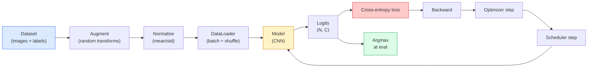

# Görüntü Sınıflandırması

> Bir sınıflandırıcı, piksellerden sınıflar üzerindeki olasılık dağılımına kadar uzanan bir fonksiyondur. Geri kalan her şey sıhhi tesisat.

**Tür:** Yapım
**Diller:** Python
**Önkoşullar:** Aşama 2 Ders 09 (Model Değerlendirme), Aşama 3 Ders 10 (Mini Framework), Aşama 4 Ders 03 (CNN'ler)
**Süre:** ~75 dakika

## Öğrenme Hedefleri

- CIFAR-10'da uçtan uca bir görüntü sınıflandırma hattı oluşturun: dataset, büyütme, model, eğitim döngüsü, değerlendirme
- Her bir bileşenin (veri yükleyici, kayıp, optimize edici, zamanlayıcı, artırma) rolünü açıklayın ve bunlardan herhangi birinin kırılmasının kayıp eğrisinde nasıl ortaya çıkacağını tahmin edin
- Karıştırma, kesme ve etiket düzeltme işlemlerini sıfırdan uygulayın ve her birinin eklenmeye değer olduğunu gerekçelendirin
- dataset'yi teşhis etmek ve toplam doğruluğun ötesindeki hataları modellemek için bir karışıklık matrisini ve sınıfa özel hassasiyet/geri çağırma tablosunu okuyun

## Sorun

Gönderilen her görüş görevi, bir düzeyde görüntü sınıflandırmasına indirgenir. Algılama bölgeleri sınıflandırır. Segmentasyon pikselleri sınıflandırır. Alma, sınıf merkezlerine benzerliğe göre sıralanır. Sınıflandırmayı doğru yapmak (dataset döngüsü, artırma politikası, kayıp, değerlendirme) bu aşamada diğer tüm görevlere aktarılan beceridir.

Çoğu sınıflandırma hatası modelde yoktur. Sırada yaşıyorlar: bozuk bir normalizasyon, karıştırılmamış bir eğitim seti, etiketleri bozan bir büyütme, eğitim verileriyle kirlenmiş bir doğrulama bölünmesi, 30. çağdan sonra sessizce ayrılan bir öğrenme oranı. Doğru kurulumla CIFAR-10'da %93'e ulaşacak bir CNN, bozuk bir kurulumla genellikle %70-75 puan alır ve kayıp eğrisi her zaman makul görünür.

Bu derste boru hattının tamamı elle kablolanır, böylece her parça denetlenebilir olur. `torchvision.datasets`'den bir hatayı gizleyebilecek hiçbir şey kullanmayacaksınız.

## Konsept

### Sınıflandırma hattı



Bu döngüdeki her satır bir hatanın yaşayabileceği yerdir. Çapraz entropi, softmax çıktılarını değil, ham logitleri alır, dolayısıyla kayıptan önceki herhangi bir `model(x).softmax()` sessizce yanlış gradient'yi hesaplar. Artırmalar yalnızca girdiler için geçerlidir, etiketler için geçerli değildir; her ikisini de karıştıran karıştırma hariç. `optimizer.zero_grad()` adım başına bir kez gerçekleşmelidir; bunu atlamak gradient'leri biriktirir ve son derece istikrarsız bir öğrenme oranı gibi görünür. Bu hataların her biri, herhangi bir hata yapmadan öğrenme eğrisini düzleştirir.

### Çapraz entropi, logitler ve softmax

Bir sınıflandırıcı, görüntü başına logit adı verilen `C` sayıları üretir. Softmax'ı uygulamak bunları bir olasılık dağılımına dönüştürür:

```
softmax(z)_i = exp(z_i) / sum_j exp(z_j)
```

Çapraz entropi, doğru sınıfın negatif log olasılığını ölçer:

```
CE(z, y) = -log( softmax(z)_y )
        = -z_y + log( sum_j exp(z_j) )
```

Sağdaki form sayısal olarak kararlı olanıdır (log-toplam-exp). PyTorch'un `nn.CrossEntropyLoss`'si softmax + NLL'yi tek bir operasyonda birleştirir ve doğrudan ham logitleri alır. Softmax'ı ilk önce kendiniz uygulamak neredeyse her zaman bir hatadır - log(softmax(softmax(z))), anlamsız bir miktar hesaplarsınız.

### Artırma neden işe yarıyor?

Bir CNN'nin çeviri için (ağırlık paylaşımından kaynaklanan) endüktif önyargısı vardır, ancak kırpma, çevirme, renk titremesi veya kapanmaya karşı yerleşik bir değişmezliği yoktur. Bu değişmezlikleri öğretmenin tek yolu, onları çalıştıran pikselleri göstermektir. Eğitim sırasındaki her rastgele dönüşüm, "bu iki görüntü aynı etikete sahip; farkı göz ardı eden özellikleri öğrenin" demenin bir yoludur.

```
Original crop:  "dog facing left"
Flip:           "dog facing right"       <- same label, different pixels
Rotate(+15):    "dog, slight tilt"
Colour jitter:  "dog in warmer light"
RandomErasing:  "dog with patch missing"
```

Kural: büyütme etiketi korumalıdır. Bir rakamın kesilmesi ve döndürülmesi "6"yı "9"a çevirebilir; bunun için dataset daha küçük dönüş aralıkları kullanırsınız ve rakama özgü değişmezliklere saygı duyan büyütmeleri seçersiniz.

### Karıştırma ve kesme karışımı

Sıradan büyütme pikselleri dönüştürür ancak etiketleri sıcak tutar. **Mixup** ve **cutmix** her ikisini de enterpolasyona tabi tutarak bunu bozar.

```
Mixup:
  lambda ~ Beta(a, a)
  x = lambda * x_i + (1 - lambda) * x_j
  y = lambda * y_i + (1 - lambda) * y_j

Cutmix:
  paste a random rectangle of x_j into x_i
  y = area-weighted mix of y_i and y_j
```

Neden yardımcı oluyor: Model, keskin tek sıcak hedefleri ezberlemeyi bırakıyor ve sınıflar arasında enterpolasyon yapmayı öğreniyor. Eğitim kaybı artar, test doğruluğu artar. Herhangi bir sınıflandırıcı için en ucuz sağlamlık yükseltmesidir.

### Etiket yumuşatma

Karışıklığın kuzeni. `[0, 0, 1, 0, 0]`'ye karşı antrenman yapmak yerine, 0.1 gibi küçük bir `eps` için `[eps/C, eps/C, 1-eps, eps/C, eps/C]`'ye karşı antrenman yapın. Modelin keyfi keskin logitler üretmesini durdurur ve kalibrasyonu neredeyse hiçbir maliyet olmadan geliştirir. PyTorch 1.10'dan beri `nn.CrossEntropyLoss(label_smoothing=0.1)`'de yerleşiktir.

### Doğruluğun ötesinde değerlendirme

Toplam doğruluk dengesizliği gizler. Her zaman çoğunluk sınıfının puanını %90 olarak tahmin eden 90-10 ikili sınıflandırıcı. Size gerçekte neler olduğunu anlatan araçlar:

- **Sınıf başına doğruluk** — sınıf başına bir sayı; düşük performans gösteren kategoriler hemen ortaya çıkar.
- **Karışıklık matrisi** — i sütun j'ye sahip C x C ızgarası = j sınıfı olarak tahmin edilen gerçek i sınıfının sayısı; köşegen doğrudur, köşegen dışı kısımlar modelinizin yaşadığı yerdir.
- **İlk-1 / İlk-5** — doğru sınıfın ilk 1'de mi yoksa ilk 5 tahminde mi olduğu; ImageNet için ilk 5 önemlidir çünkü "Norwich terrier" ve "Norfolk terrier" gibi sınıflar gerçekten belirsizdir.
- **Kalibrasyon (ECE)** — 0,8 güvenirlik tahmini %80 oranında doğru sonuç verir mi? Modern ağlar sistematik olarak kendilerine aşırı güveniyor; sıcaklık ölçekleme veya etiket yumuşatma ile düzeltin.

```figure
receptive-field
```

## İnşa Et

### Adım 1: Deterministik bir sentetik dataset

CIFAR-10 diskte yaşıyor. Bu dersi tekrarlanabilir ve hızlı hale getirmek için, modelin öğrenmesi gereken sınıfa özgü yapıya sahip CIFAR — 32x32 RGB görüntülere benzeyen sentetik bir dataset oluşturuyoruz. Tamamen aynı boru hattı gerçek CIFAR-10'da değişmeden çalışır.

```python
import numpy as np
import torch
from torch.utils.data import Dataset


def synthetic_cifar(num_per_class=1000, num_classes=10, seed=0):
    rng = np.random.default_rng(seed)
    X = []
    Y = []
    for c in range(num_classes):
        centre = rng.uniform(0, 1, (3,))
        freq = 2 + c
        for _ in range(num_per_class):
            yy, xx = np.meshgrid(np.linspace(0, 1, 32), np.linspace(0, 1, 32), indexing="ij")
            r = np.sin(xx * freq) * 0.5 + centre[0]
            g = np.cos(yy * freq) * 0.5 + centre[1]
            b = (xx + yy) * 0.5 * centre[2]
            img = np.stack([r, g, b], axis=-1)
            img += rng.normal(0, 0.08, img.shape)
            img = np.clip(img, 0, 1)
            X.append(img.astype(np.float32))
            Y.append(c)
    X = np.stack(X)
    Y = np.array(Y)
    idx = rng.permutation(len(X))
    return X[idx], Y[idx]


class ArrayDataset(Dataset):
    def __init__(self, X, Y, transform=None):
        self.X = X
        self.Y = Y
        self.transform = transform

    def __len__(self):
        return len(self.X)

    def __getitem__(self, i):
        img = self.X[i]
        if self.transform is not None:
            img = self.transform(img)
        img = torch.from_numpy(img).permute(2, 0, 1)
        return img, int(self.Y[i])
```

Her sınıf, modeli pikselleri ezberlemek yerine sinyali öğrenmeye zorlamak için kendi renk paletine ve frekans düzenine ek olarak Gauss gürültüsüne sahip olur. Her biri bin resimden oluşan on sınıf değiştirildi.

### Adım 2: Normalleştirme ve artırma

Her vizyon hattının sahip olduğu bu iki dönüşüm.

```python
def standardize(mean, std):
    mean = np.array(mean, dtype=np.float32)
    std = np.array(std, dtype=np.float32)
    def _fn(img):
        return (img - mean) / std
    return _fn


def random_hflip(p=0.5):
    def _fn(img):
        if np.random.random() < p:
            return img[:, ::-1, :].copy()
        return img
    return _fn


def random_crop(pad=4):
    def _fn(img):
        h, w = img.shape[:2]
        padded = np.pad(img, ((pad, pad), (pad, pad), (0, 0)), mode="reflect")
        y = np.random.randint(0, 2 * pad)
        x = np.random.randint(0, 2 * pad)
        return padded[y:y + h, x:x + w, :]
    return _fn


def compose(*fns):
    def _fn(img):
        for fn in fns:
            img = fn(img)
        return img
    return _fn
```

Kırpmadan önce yansıtma yastığı, sıfır doldurma değil, çünkü siyah kenarlıklar, modelin kullanışlı olmayan bir şekilde görmezden gelmeyi öğreneceği bir sinyaldir.

### Adım 3: Karıştırma

Eğitim adımında iki görüntüyü ve iki etiketi karıştırır. Toplu dönüşüm olarak uygulandığından dataset'nin içinde değil ileri geçişin yanında yer alır.

```python
def mixup_batch(x, y, num_classes, alpha=0.2):
    if alpha <= 0:
        return x, torch.nn.functional.one_hot(y, num_classes).float()
    lam = float(np.random.beta(alpha, alpha))
    idx = torch.randperm(x.size(0), device=x.device)
    x_mixed = lam * x + (1 - lam) * x[idx]
    y_onehot = torch.nn.functional.one_hot(y, num_classes).float()
    y_mixed = lam * y_onehot + (1 - lam) * y_onehot[idx]
    return x_mixed, y_mixed


def soft_cross_entropy(logits, soft_targets):
    log_probs = torch.log_softmax(logits, dim=-1)
    return -(soft_targets * log_probs).sum(dim=-1).mean()
```

`soft_cross_entropy`, yumuşak etiketli dağıtıma karşı çapraz entropidir. Hedefin tam olarak tek sıcak olduğu durumlarda bu durum olağan tek sıcak duruma düşer.

### Adım 4: Eğitim döngüsü

Tarifin tamamı: veriler üzerinden bir geçiş, parti başına bir kez gradient, zamanlayıcı her dönem için bir kez adım attı.

```python
import torch
import torch.nn as nn
from torch.utils.data import DataLoader
from torch.optim import SGD
from torch.optim.lr_scheduler import CosineAnnealingLR

def train_one_epoch(model, loader, optimizer, device, num_classes, use_mixup=True):
    model.train()
    total, correct, loss_sum = 0, 0, 0.0
    for x, y in loader:
        x, y = x.to(device), y.to(device)
        if use_mixup:
            x_m, y_soft = mixup_batch(x, y, num_classes)
            logits = model(x_m)
            loss = soft_cross_entropy(logits, y_soft)
        else:
            logits = model(x)
            loss = nn.functional.cross_entropy(logits, y, label_smoothing=0.1)
        optimizer.zero_grad()
        loss.backward()
        optimizer.step()
        loss_sum += loss.item() * x.size(0)
        total += x.size(0)
        # Training accuracy vs the un-mixed labels `y` is only an approximation
        # when mixup is on (the model saw soft targets, not y). Treat it as a
        # rough progress signal; rely on val accuracy for real performance.
        with torch.no_grad():
            pred = logits.argmax(dim=-1)
            correct += (pred == y).sum().item()
    return loss_sum / total, correct / total


@torch.no_grad()
def evaluate(model, loader, device, num_classes):
    model.eval()
    total, correct = 0, 0
    loss_sum = 0.0
    cm = torch.zeros(num_classes, num_classes, dtype=torch.long)
    for x, y in loader:
        x, y = x.to(device), y.to(device)
        logits = model(x)
        loss = nn.functional.cross_entropy(logits, y)
        pred = logits.argmax(dim=-1)
        for t, p in zip(y.cpu(), pred.cpu()):
            cm[t, p] += 1
        loss_sum += loss.item() * x.size(0)
        total += x.size(0)
        correct += (pred == y).sum().item()
    return loss_sum / total, correct / total, cm
```

Her eğitim döngüsü yazdığınızda kontrol ettiğiniz beş değişmez:

1. Eğitimden önce `model.train()`, değerlendirmeden önce `model.eval()` — bırakma ve toplu norm davranışını değiştirir.
2. `.zero_grad()`, `.backward()`'den önce.
3. `.item()` metrikleri biriktirirken hiçbir şeyin hesaplama grafiğini canlı tutmasını sağlayın.
4. Değerlendirme sırasında `@torch.no_grad()` — hafızadan ve zamandan tasarruf sağlar, hafif kazaları önler.
5. Softmax'a değil, ham logitlere karşı Argmax — aynı sonuç, bir daha az işlem.

### Adım 5: Birleştirin

Önceki dersteki `TinyResNet`'yi kullanın, birkaç dönem antrenman yapın, değerlendirin.

```python
from main import synthetic_cifar, ArrayDataset
from main import standardize, random_hflip, random_crop, compose
from main import mixup_batch, soft_cross_entropy
from main import train_one_epoch, evaluate
# TinyResNet comes from the previous lesson (03-cnns-lenet-to-resnet).
# Adjust the import path to wherever you stored the previous lesson's code.
from cnns_lenet_to_resnet import TinyResNet  # example placeholder

X, Y = synthetic_cifar(num_per_class=500)
split = int(0.9 * len(X))
X_train, Y_train = X[:split], Y[:split]
X_val, Y_val = X[split:], Y[split:]

mean = [0.5, 0.5, 0.5]
std = [0.25, 0.25, 0.25]
train_tf = compose(random_hflip(), random_crop(pad=4), standardize(mean, std))
eval_tf = standardize(mean, std)

train_ds = ArrayDataset(X_train, Y_train, transform=train_tf)
val_ds = ArrayDataset(X_val, Y_val, transform=eval_tf)

train_loader = DataLoader(train_ds, batch_size=128, shuffle=True, num_workers=0)
val_loader = DataLoader(val_ds, batch_size=256, shuffle=False, num_workers=0)

device = "cuda" if torch.cuda.is_available() else "cpu"
model = TinyResNet(num_classes=10).to(device)
optimizer = SGD(model.parameters(), lr=0.1, momentum=0.9, weight_decay=5e-4, nesterov=True)
scheduler = CosineAnnealingLR(optimizer, T_max=10)

for epoch in range(10):
    tr_loss, tr_acc = train_one_epoch(model, train_loader, optimizer, device, 10, use_mixup=True)
    va_loss, va_acc, _ = evaluate(model, val_loader, device, 10)
    scheduler.step()
    print(f"epoch {epoch:2d}  lr {scheduler.get_last_lr()[0]:.4f}  "
          f"train {tr_loss:.3f}/{tr_acc:.3f}  val {va_loss:.3f}/{va_acc:.3f}")
```

Sentetik dataset'de bu, beş dönem içinde neredeyse mükemmel doğrulama doğruluğuna ulaşır; önemli olan da budur: boru hattı doğrudur, model öğrenilebilir olanı öğrenebilir. dataset'yi gerçek CIFAR-10 ile değiştirin ve aynı döngü trenlerini değişiklik yapmadan ~%90'a getirin.

### Adım 6: Karışıklık matrisini okuyun

Doğruluk tek başına asla modelin nerede başarısız olduğunu söylemez. Karışıklık matrisi bunu yapar.

```python
def print_confusion(cm, labels=None):
    c = cm.shape[0]
    labels = labels or [str(i) for i in range(c)]
    print(f"{'':>6}" + "".join(f"{l:>5}" for l in labels))
    for i in range(c):
        row = cm[i].tolist()
        print(f"{labels[i]:>6}" + "".join(f"{v:>5}" for v in row))
    print()
    tp = cm.diag().float()
    fp = cm.sum(dim=0).float() - tp
    fn = cm.sum(dim=1).float() - tp
    prec = tp / (tp + fp).clamp_min(1)
    rec = tp / (tp + fn).clamp_min(1)
    f1 = 2 * prec * rec / (prec + rec).clamp_min(1e-9)
    for i in range(c):
        print(f"{labels[i]:>6}  prec {prec[i]:.3f}  rec {rec[i]:.3f}  f1 {f1[i]:.3f}")

_, _, cm = evaluate(model, val_loader, device, 10)
print_confusion(cm)
```

Satırlar gerçek sınıflardır, sütunlar ise tahminlerdir. Sınıf 3 ve 5 arasındaki köşegen dışı sayımların bir kümesi, modelin bu ikisini karıştırdığı ve size hedefli veri toplama veya sınıfa özgü bir genişletme için bir başlangıç ​​noktası sağladığı anlamına gelir.

## Kullan onu

`torchvision` yukarıdaki her şeyi deyimsel bileşenlere sarar. Gerçek CIFAR-10 için tüm boru hattı dört satır artı bir eğitim döngüsünden oluşur.

```python
from torchvision.datasets import CIFAR10
from torchvision.transforms import Compose, RandomCrop, RandomHorizontalFlip, ToTensor, Normalize

mean = (0.4914, 0.4822, 0.4465)
std = (0.2470, 0.2435, 0.2616)
train_tf = Compose([
    RandomCrop(32, padding=4, padding_mode="reflect"),
    RandomHorizontalFlip(),
    ToTensor(),
    Normalize(mean, std),
])
eval_tf = Compose([ToTensor(), Normalize(mean, std)])

train_ds = CIFAR10(root="./data", train=True,  download=True, transform=train_tf)
val_ds   = CIFAR10(root="./data", train=False, download=True, transform=eval_tf)
```

Dikkat edilmesi gereken iki nokta: ortalama/std **dataset'ye özeldir** - ImageNet'te değil, CIFAR-10 eğitim setinde hesaplanır - ve yansıtma pedi, topluluğun varsayılan kırpma politikasıdır. ImageNet istatistiklerini buraya kopyalayıp yapıştırmak, birisi modelin profilini çıkarana kadar kimsenin yakalayamayacağı ~%1'lik bir doğruluk sızıntısıdır.

## Gönderin

Bu ders şunları üretir:

- `outputs/prompt-classifier-pipeline-auditor.md` — yukarıdaki beş değişmez için bir eğitim komut dosyasını denetleyen ve ilk ihlali ortaya çıkaran bir prompt.
- `outputs/skill-classification-diagnostics.md` — karışıklık matrisi ve sınıf adlarının listesi verildiğinde, sınıf başına hataları özetleyen ve en etkili tek düzeltmeyi öneren bir beceri.

## Egzersizler

1. **(Kolay)** Sentetik dataset üzerinde aynı modeli beş dönem boyunca karıştırmalı ve karıştırmasız eğitin. Her ikisi için de tren ve val kaybını planlayın. Karışıklık nedeniyle tren kaybının neden daha yüksek olduğunu ancak değer doğruluğunun benzer veya daha iyi olduğunu açıklayın.
2. **(Orta)** Kesmeyi uygulayın — her eğitim görüntüsünde rastgele 8x8'lik bir kareyi sıfırlayın — ve büyütme olmadan bir ablasyon çalıştırın, hflip+crop, hflip+crop+cutout, hflip+crop+mixup. Her biri için değer doğruluğunu raporlayın.
3. **(Zor)** Bir CIFAR-100 işlem hattı oluşturun (100 sınıf, aynı giriş boyutu) ve bir ResNet-34 eğitim çalışmasını, yayınlanan doğruluğun %1'i dahilinde yeniden oluşturun. Ekstralar: üç öğrenme oranını ve iki ağırlık azalmasını tarayın, yerel bir CSV'ye giriş yapın, son karışıklık-matrisi-üst-karışıklıklar tablosunu oluşturun.

## Anahtar Terimler

| Dönem | İnsanlar ne diyor | Aslında ne anlama geliyor |
|------|----------------|----------------------|
| Logitler | "Ham çıktılar" | Görüntü başına C sayılarının softmax öncesi vektörü; çapraz entropi softmax değerleri değil bunları bekler |
| Çapraz entropi | "Kayıp" | Doğru sınıfın negatif log olasılığı; log-softmax ve NLL'yi tek bir kararlı operasyonda birleştiriyor |
| Veri Yükleyici | "Dolgulayıcı" | dataset'yi karıştırma, toplu işleme ve (isteğe bağlı) çok çalışanlı yükleme ile sarar; eğitim hatalarının yarısından sorumlu tutuluyor |
| Büyütme | "Rastgele dönüşümler" | Eğitim sırasında etiketi koruyan herhangi bir piksel düzeyinde dönüşüm; CNN'in doğal olarak sahip olmadığı değişmezlikleri öğretiyor |
| Karıştırma / Kesme Karışımı | "İki resmi karıştır" | Sınıflandırıcının katı sınırlar yerine düzgün enterpolasyonlar öğrenmesi için hem girdileri hem de etiketleri harmanlayın |
| Etiket yumuşatma | "Daha yumuşak hedefler" | One-hot'u (1-eps, eps/(C-1), ...); ile değiştirin Kalibrasyonu iyileştirir ve doğruluğu biraz artırır |
| En üst düzeyde doğruluk | "İlk-5" | Doğru sınıf en yüksek olasılıklı tahminler arasında yer alır; gerçekten belirsiz sınıflara sahip dataset'lerde kullanıldı |
| Karışıklık matrisi | "Hataların yaşandığı yer" | (i, j) girişinin j olarak tahmin edilen gerçek sınıf i'nin görüntülerini saydığı C x C tablosu; köşegen doğru, köşegen dışı size neyi düzeltmeniz gerektiğini söylüyor |

## Daha Fazla Okuma

- [CS231n: Training Neural Networks](https://cs231n.github.io/neural-networks-3/) — tek sayfada hâlâ eğitim hattının en net turu
- [Görüntü Sınıflandırma için Hileler Çantası (He ve diğerleri, 2019)](https://arxiv.org/abs/1812.01187) — ImageNet'te ResNet doğruluğuna %3-4 oranında katkıda bulunan her küçük numara
- [karışıklık: Deneysel Risk Minimizasyonunun Ötesinde (Zhang ve diğerleri, 2017)](https://arxiv.org/abs/1710.09412) — orijinal karma makale; üç sayfalık teori artı ikna edici deneyler
- [Sıcaklık ölçeklendirmesi neden önemlidir (Guo ve diğerleri, 2017)](https://arxiv.org/abs/1706.04599) — modern ağların yanlış kalibre edildiğini kanıtlayan ve bunu tek bir skaler parametreyle düzelten makale
