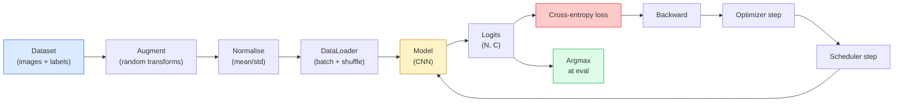

# 图像分类

> 分类器是从像素到类别上的概率分布的函数。其他一切都是管道。

** 类型：** 构建
** 语言：** Python
** 先决条件：** 阶段2第09课（模型评估）、阶段3第10课（迷你框架）、阶段4第03课（CNN）
** 时间：** ~75分钟

## 学习目标

- 在CIFAR-10上构建端到端图像分类管道：数据集、增强、模型、训练循环、评估
- 解释每个组件（数据加载器、损失、优化器、调度器、增强）的作用，并预测破坏其中任何一个组件的情况如何体现在损失曲线中
- 从头开始实施混合、剪切和标签平滑，并在每项都值得添加时进行合理调整
- 读取混淆矩阵和每个类的查准率/查全率表，以诊断超出聚合准确度的数据集和模型故障

## 问题

每项视觉任务都简化为某种级别的图像分类。检测对区域进行分类。分割对像素进行分类。检索根据与类中心的相似度进行排名。正确分类--数据集循环、增强策略、损失、评估--是转移到该阶段中所有其他任务的技能。

大多数分类错误都不在模型中。他们生活在管道中：破碎的规范化、未混洗的训练集、扭曲标签的增强、被训练数据污染的验证分裂、在历元30后悄然偏离的学习率。如果设置正确，CNN在CIFAR-10上的评分为93%，如果设置不设置，通常会获得70-75%的评分，而且损失曲线一直看起来是合理的。

本课手工布线整个管道，因此每个部分都可以检查。您不会使用“torchvision.datasets”中可能隐藏错误的任何内容。

## 概念

### 分类管道



这个循环中的每一行都是错误可以生存的地方。交叉熵采用原始logits，而不是softmax输出，因此在损失之前的任何“mode（x）.softmax（）”都会悄悄计算错误的梯度。增强仅适用于输入，而不适用于标签--除了mixup，它混合了两者。' optimizer.zero_grad（）'每步必须发生一次;跳过它会累积梯度，看起来学习率极不稳定。这些错误中的每一个都在学习曲线上没有抛出错误。

### 交叉熵、logits和softmax

分类器为每个图像生成“C”数字，称为logits。应用softmax将它们转换为概率分布：

```
softmax(z)_i = exp(z_i) / sum_j exp(z_j)
```

交叉熵测量正确类的负对数概率：

```
CE(z, y) = -log( softmax(z)_y )
        = -z_y + log( sum_j exp(z_j) )
```

右侧形式是数字稳定的形式（log-sum-BEP）。PyTorch的“nn.CrossEntropyLoss”在一次操作中融合了softmax + NLL，并直接获取原始日志。首先自己应用softmax几乎总是一个错误--您计算日志（softmax（softmax（z），这是一个毫无意义的量。

### 为什么增强有效

CNN对翻译具有感性偏差（来自权重共享），但对作物、翻转、颜色抖动或遮挡没有内置的不变性。教它这些不变性的唯一方法是向它显示练习这些不变性的像素。训练期间的每一次随机变换都是一种说法：“这两个图像具有相同的标签;学习忽略差异的特征。"

```
Original crop:  "dog facing left"
Flip:           "dog facing right"       <- same label, different pixels
Rotate(+15):    "dog, slight tilt"
Colour jitter:  "dog in warmer light"
RandomErasing:  "dog with patch missing"
```

规则：扩充必须保留标签。数字的剪切和旋转可以将“6”翻转为“9”;对于该数据集，您使用较小的旋转范围并选择尊重特定于数字的不变性的增强。

### 混合和剪辑混合

普通的增强会变换像素，但保持标签的单一性。**Mixup** 和 **cutmix** 通过内插两者来打破这一点。

```
Mixup:
  lambda ~ Beta(a, a)
  x = lambda * x_i + (1 - lambda) * x_j
  y = lambda * y_i + (1 - lambda) * y_j

Cutmix:
  paste a random rectangle of x_j into x_i
  y = area-weighted mix of y_i and y_j
```

为什么它有帮助：该模型停止记忆尖锐的一个热点目标，并学会在类之间插值。训练损耗上升，测试准确度上升。它是任何分类器最便宜的鲁棒性升级。

### 标签平滑

mixup的表弟。不要针对“[0，0，1，0，0，0]”进行训练，而应针对“[eps/C，eps/C，1-eps，eps/C，eps/C]”进行训练，以获得较小的“eps”（例如0.1）。阻止模型产生任意尖锐的logits，并几乎免费改进校准。自PyTorch 1.10以来，已内置到“nn.CrossEntropyLoss（Label_smooth =0.1）”中。

### 评估超出准确性

总体准确性隐藏了不平衡。始终预测多数类别的90-10二元分类器得分为90%。真正告诉您正在发生什么的工具：

- ** 每个类别的准确性 ** -每个类别一个数字;立即浮出水面表现不佳的类别。
- ** 混淆矩阵 ** - C x C网格，行i col j =预测为j类的真实i类的计数;对角线是正确的，非对角线是您的模型所在的位置。
- **Top-1 / Top-5** -正确的类别是否位于前1名或前5名预测中; Top-5对于ImageNet很重要，因为“诺维奇梗”与“诺福克梗”等类别确实是模棱两可的。
- ** 校准（ECE）** -0.8置信度预测是否80%正确？现代网络系统性地过度自信;用温度缩放或标签平滑来修复。

## 建设党

### 第1步：确定性合成数据集

CIFAR-10存在于磁盘上。为了使本课具有可重复性且快速性，我们构建了一个合成数据集，该数据集看起来像CIFAR -32 x32 RB图像，具有模型必须学习的特定类别结构。完全相同的管道在真正的CIFAR-10上工作时没有变化。

```python
import numpy as np
import torch
from torch.utils.data import Dataset


def synthetic_cifar(num_per_class=1000, num_classes=10, seed=0):
    rng = np.random.default_rng(seed)
    X = []
    Y = []
    for c in range(num_classes):
        centre = rng.uniform(0, 1, (3,))
        freq = 2 + c
        for _ in range(num_per_class):
            yy, xx = np.meshgrid(np.linspace(0, 1, 32), np.linspace(0, 1, 32), indexing="ij")
            r = np.sin(xx * freq) * 0.5 + centre[0]
            g = np.cos(yy * freq) * 0.5 + centre[1]
            b = (xx + yy) * 0.5 * centre[2]
            img = np.stack([r, g, b], axis=-1)
            img += rng.normal(0, 0.08, img.shape)
            img = np.clip(img, 0, 1)
            X.append(img.astype(np.float32))
            Y.append(c)
    X = np.stack(X)
    Y = np.array(Y)
    idx = rng.permutation(len(X))
    return X[idx], Y[idx]


class ArrayDataset(Dataset):
    def __init__(self, X, Y, transform=None):
        self.X = X
        self.Y = Y
        self.transform = transform

    def __len__(self):
        return len(self.X)

    def __getitem__(self, i):
        img = self.X[i]
        if self.transform is not None:
            img = self.transform(img)
        img = torch.from_numpy(img).permute(2, 0, 1)
        return img, int(self.Y[i])
```

每个类都有自己的调色板和频率模式，加上高斯噪音，迫使模型学习信号而不是记忆像素。排列了十个类，每个类一千张图像。

### 步骤2：标准化和增强

每个愿景管道都有这两种转变。

```python
def standardize(mean, std):
    mean = np.array(mean, dtype=np.float32)
    std = np.array(std, dtype=np.float32)
    def _fn(img):
        return (img - mean) / std
    return _fn


def random_hflip(p=0.5):
    def _fn(img):
        if np.random.random() < p:
            return img[:, ::-1, :].copy()
        return img
    return _fn


def random_crop(pad=4):
    def _fn(img):
        h, w = img.shape[:2]
        padded = np.pad(img, ((pad, pad), (pad, pad), (0, 0)), mode="reflect")
        y = np.random.randint(0, 2 * pad)
        x = np.random.randint(0, 2 * pad)
        return padded[y:y + h, x:x + w, :]
    return _fn


def compose(*fns):
    def _fn(img):
        for fn in fns:
            img = fn(img)
        return img
    return _fn
```

裁剪之前的反射垫，而不是零垫，因为黑色边界是模型会学会以无用的方式忽略的信号。

### 第3步：混淆

在训练步骤中混合两个图像和两个标签。作为批处理转换实现，因此它位于正向传递旁边，而不是位于数据集中。

```python
def mixup_batch(x, y, num_classes, alpha=0.2):
    if alpha <= 0:
        return x, torch.nn.functional.one_hot(y, num_classes).float()
    lam = float(np.random.beta(alpha, alpha))
    idx = torch.randperm(x.size(0), device=x.device)
    x_mixed = lam * x + (1 - lam) * x[idx]
    y_onehot = torch.nn.functional.one_hot(y, num_classes).float()
    y_mixed = lam * y_onehot + (1 - lam) * y_onehot[idx]
    return x_mixed, y_mixed


def soft_cross_entropy(logits, soft_targets):
    log_probs = torch.log_softmax(logits, dim=-1)
    return -(soft_targets * log_probs).sum(dim=-1).mean()
```

' soft_cross_entropy '是针对软标签分布的交叉熵。当目标恰好是一热时，它就会简化为通常的一热情况。

### 步骤4：训练循环

完整的配方：数据一次传递，每批渐变一次，调度程序每个纪元步进一次。

```python
import torch
import torch.nn as nn
from torch.utils.data import DataLoader
from torch.optim import SGD
from torch.optim.lr_scheduler import CosineAnnealingLR

def train_one_epoch(model, loader, optimizer, device, num_classes, use_mixup=True):
    model.train()
    total, correct, loss_sum = 0, 0, 0.0
    for x, y in loader:
        x, y = x.to(device), y.to(device)
        if use_mixup:
            x_m, y_soft = mixup_batch(x, y, num_classes)
            logits = model(x_m)
            loss = soft_cross_entropy(logits, y_soft)
        else:
            logits = model(x)
            loss = nn.functional.cross_entropy(logits, y, label_smoothing=0.1)
        optimizer.zero_grad()
        loss.backward()
        optimizer.step()
        loss_sum += loss.item() * x.size(0)
        total += x.size(0)
        # Training accuracy vs the un-mixed labels `y` is only an approximation
        # when mixup is on (the model saw soft targets, not y). Treat it as a
        # rough progress signal; rely on val accuracy for real performance.
        with torch.no_grad():
            pred = logits.argmax(dim=-1)
            correct += (pred == y).sum().item()
    return loss_sum / total, correct / total


@torch.no_grad()
def evaluate(model, loader, device, num_classes):
    model.eval()
    total, correct = 0, 0
    loss_sum = 0.0
    cm = torch.zeros(num_classes, num_classes, dtype=torch.long)
    for x, y in loader:
        x, y = x.to(device), y.to(device)
        logits = model(x)
        loss = nn.functional.cross_entropy(logits, y)
        pred = logits.argmax(dim=-1)
        for t, p in zip(y.cpu(), pred.cpu()):
            cm[t, p] += 1
        loss_sum += loss.item() * x.size(0)
        total += x.size(0)
        correct += (pred == y).sum().item()
    return loss_sum / total, correct / total, cm
```

每次编写训练循环时都会检查五个不变量：

1. 训练前的' modal.train（）'，评估前的'模型.eval（）'-翻转辍学和批量规范行为。
2. '.zero_grad（）' before '.backward（）'。
3. '. entry（）'当累积指标时，因此没有任何东西可以让计算图保持活力。
4. 评估期间'@torch.no_grad（）'-节省内存和时间，防止微妙的事故。
5. Argmax针对原始logits，而不是softmax -相同的结果，少一个操作。

### 第5步：把它们放在一起

使用上一课中的“TinyResNet”，训练几个时期，进行评估。

```python
from main import synthetic_cifar, ArrayDataset
from main import standardize, random_hflip, random_crop, compose
from main import mixup_batch, soft_cross_entropy
from main import train_one_epoch, evaluate
# TinyResNet comes from the previous lesson (03-cnns-lenet-to-resnet).
# Adjust the import path to wherever you stored the previous lesson's code.
from cnns_lenet_to_resnet import TinyResNet  # example placeholder

X, Y = synthetic_cifar(num_per_class=500)
split = int(0.9 * len(X))
X_train, Y_train = X[:split], Y[:split]
X_val, Y_val = X[split:], Y[split:]

mean = [0.5, 0.5, 0.5]
std = [0.25, 0.25, 0.25]
train_tf = compose(random_hflip(), random_crop(pad=4), standardize(mean, std))
eval_tf = standardize(mean, std)

train_ds = ArrayDataset(X_train, Y_train, transform=train_tf)
val_ds = ArrayDataset(X_val, Y_val, transform=eval_tf)

train_loader = DataLoader(train_ds, batch_size=128, shuffle=True, num_workers=0)
val_loader = DataLoader(val_ds, batch_size=256, shuffle=False, num_workers=0)

device = "cuda" if torch.cuda.is_available() else "cpu"
model = TinyResNet(num_classes=10).to(device)
optimizer = SGD(model.parameters(), lr=0.1, momentum=0.9, weight_decay=5e-4, nesterov=True)
scheduler = CosineAnnealingLR(optimizer, T_max=10)

for epoch in range(10):
    tr_loss, tr_acc = train_one_epoch(model, train_loader, optimizer, device, 10, use_mixup=True)
    va_loss, va_acc, _ = evaluate(model, val_loader, device, 10)
    scheduler.step()
    print(f"epoch {epoch:2d}  lr {scheduler.get_last_lr()[0]:.4f}  "
          f"train {tr_loss:.3f}/{tr_acc:.3f}  val {va_loss:.3f}/{va_acc:.3f}")
```

在合成数据集上，这在五个时期内达到了近乎完美的验证准确性，这就是重点：管道是正确的，模型可以学习可学习的内容。将数据集替换为真正的CIFAR-10和相同的循环序列，直至约90%，而不发生任何变化。

### 第6步：阅读混淆矩阵

仅靠准确性并不能告诉您模型在哪里失败。混乱矩阵确实如此。

```python
def print_confusion(cm, labels=None):
    c = cm.shape[0]
    labels = labels or [str(i) for i in range(c)]
    print(f"{'':>6}" + "".join(f"{l:>5}" for l in labels))
    for i in range(c):
        row = cm[i].tolist()
        print(f"{labels[i]:>6}" + "".join(f"{v:>5}" for v in row))
    print()
    tp = cm.diag().float()
    fp = cm.sum(dim=0).float() - tp
    fn = cm.sum(dim=1).float() - tp
    prec = tp / (tp + fp).clamp_min(1)
    rec = tp / (tp + fn).clamp_min(1)
    f1 = 2 * prec * rec / (prec + rec).clamp_min(1e-9)
    for i in range(c):
        print(f"{labels[i]:>6}  prec {prec[i]:.3f}  rec {rec[i]:.3f}  f1 {f1[i]:.3f}")

_, _, cm = evaluate(model, val_loader, device, 10)
print_confusion(cm)
```

收件箱是真实的类，列是预测。第3类和第5类之间的非对角线计数集群意味着该模型混淆了这两者，并为您提供了有针对性的数据收集或特定于类别的增强的起点。

## 使用它

`torchvision`将上面的所有内容包装成惯用的组件。对于真正的CIFAR-10，完整的管道是四行加上一个训练循环。

```python
from torchvision.datasets import CIFAR10
from torchvision.transforms import Compose, RandomCrop, RandomHorizontalFlip, ToTensor, Normalize

mean = (0.4914, 0.4822, 0.4465)
std = (0.2470, 0.2435, 0.2616)
train_tf = Compose([
    RandomCrop(32, padding=4, padding_mode="reflect"),
    RandomHorizontalFlip(),
    ToTensor(),
    Normalize(mean, std),
])
eval_tf = Compose([ToTensor(), Normalize(mean, std)])

train_ds = CIFAR10(root="./data", train=True,  download=True, transform=train_tf)
val_ds   = CIFAR10(root="./data", train=False, download=True, transform=eval_tf)
```

需要注意两件事：平均值/std是 ** 特定于厕所的 ** -在CIFAR-10训练集（而不是ImageNet）上计算-并且反射垫是社区默认的作物策略。复制粘贴ImageNet统计数据在这里是一个~1%的准确性泄露，直到有人分析该模型之前，没有人会发现。

## 把它运

本课产生：

- '输出/prompt-classifier-pipeline-auditor.md '-一个提示，审核上面五个不变量的培训脚本并暴露第一次违规。
- `outputs/skill-classification-diagnostics.md` -一种技能，在给定混淆矩阵和类名列表的情况下，总结每个类的故障并提出最有效的修复方法。

## 演习

1. **（简单）** 在合成数据集上的五个时期训练相同的模型（有和不有混淆）。绘制列车和vall损失的图。解释为什么混合后的列车损失更高，而验证准确性相似或更好。
2. **（中）** 实施Cutout -将每个训练图像中的随机8x 8方块归零-并运行消融与无增强、hflip+裁剪、hflip+裁剪+裁剪、hflip+裁剪+混合。报告每个的val准确性。
3. **（硬）** 构建CIFAR-100管道（100个类，相同的输入大小）并重现ResNet-34训练运行，精度在发布精度的1%以内。额外：扫描三个学习率和两个权重衰减，记录到本地CSV，生成最终的混淆矩阵顶部混淆表。

## 关键术语

| Term | 别人怎么说 | 它实际上意味着什么 |
|------|----------------|----------------------|
| Logits | “原始输出” | 每个图像的C数的softmax之前的vector;交叉熵期望这些值，而不是softmax值 |
| 交叉熵 | “损失” | 正确类别的负log概率;将log-softmax和NLL结合在一个稳定操作中 |
| DataLoader | “配料员” | 使用洗牌、调试和（可选）多工作者加载来包装数据集;一半的训练错误归咎于 |
| 增强 | “随机转换” | 训练时保留标签的任何像素级变换;教授CNN本身没有的不变性 |
| 混合/剪切混合 | “混合两个图像” | 混合输入和标签，以便分类器学习平滑插值而不是硬边界 |
| 标签平滑 | “更软的目标” | 将one-hot替换为（1-eps，eps/（C-1），..）;改进校准并略微提高准确性 |
| Top-k准确性 | “前五名” | 正确的类位于k个最高概率预测中;用于具有真正模糊类的数据集 |
| 混淆矩阵 | “错误存在的地方” | C x C表，其中条目（i，j）计算预测为j的真实类i的图像;对角线正确，非对角线告诉您要修复什么 |

## 进一步阅读

- [CS231 n：训练神经网络]（https：//cs231n.github.io/neural-networks-3/）-仍然是单页上最清晰的训练管道之旅
- [Bag图像分类技巧（He等人，2019）]（https：//arxiv.org/ab/1812.01187）-每个小技巧加在一起都会使ImageNet上的ResNet准确性增加3-4%
- [混淆：超越经验风险最小化（张等人，2017）]（https：//arxiv.org/ab/1710.09412）-原创混合论文;三页理论加上令人信服的实验
- [Why温度缩放很重要（Guo等人，2017）]（https：//arxiv.org/ab/1706.04599）-证明现代网络存在错误校准并用一个纯量参数修复它的论文
