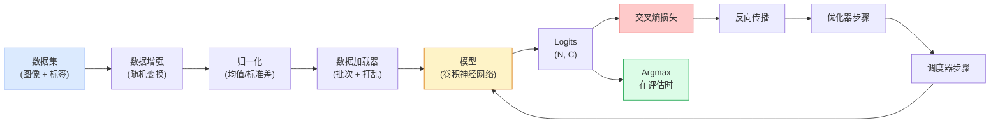

# 图像分类

> 分类器是一个从像素到类别概率分布的函数。其余的都是管道工程。

**类型：** 构建
**语言：** Python
**前置知识：** 第二阶段第9课（模型评估），第三阶段第10课（微型框架），第四阶段第3课（卷积神经网络）
**时长：** 约75分钟

## 学习目标

- 在CIFAR-10上构建端到端的图像分类流水线：数据集、数据增强、模型、训练循环、评估
- 解释每个组件（数据加载器、损失函数、优化器、调度器、数据增强）的作用，并预测破坏其中任何一个组件会如何体现在损失曲线上
- 从零实现混合（Mixup）、裁剪（Cutout）和标签平滑（Label Smoothing），并说明何时值得添加每种方法
- 读取混淆矩阵和每个类别的精确率/召回率表，以诊断数据集和模型在聚合准确率之外的故障

## 问题

每个上线的视觉任务在某种程度上都可归结为图像分类。检测对区域进行分类。分割对像素进行分类。检索通过与类别质心的相似度进行排序。正确地进行分类——数据集循环、数据增强策略、损失函数、评估——是能够迁移到该阶段所有其他任务的一项技能。

大多数分类错误不在于模型，而在于流水线：归一化出错、训练集未打乱、数据增强扭曲了标签、验证集被训练数据污染、学习率在第30个epoch后悄然发散。一个配置正确的卷积神经网络在CIFAR-10上可以达到93%的准确率，而配置错误时通常只能达到70-75%，并且损失曲线看起来全程都合理。

本课程手动搭建整个流水线，以便每个部分都可检查。你不会使用`torchvision.datasets`中的任何可能隐藏错误的内容。

## 概念

### 分类流水线



这个循环中的每一行都可能存在错误。交叉熵输入的是原始logits，而不是softmax输出，因此任何在损失之前执行的`model(x).softmax()`都会悄悄计算出错误的梯度。数据增强仅应用于输入，而不是标签——除了混合（Mixup），它同时混合两者。`optimizer.zero_grad()`必须在每个步骤执行一次；跳过它会累积梯度，看起来就像学习率极不稳定。每一个这样的错误都会使学习曲线变平，而不会抛出错误。

### 交叉熵、Logits和Softmax

一个分类器对每个图像产生`C`个数值，称为logits。应用softmax将其转换为概率分布：

```
softmax(z)_i = exp(z_i) / sum_j exp(z_j)
```

交叉熵衡量正确类别的负对数概率：

```
CE(z, y) = -log( softmax(z)_y )
        = -z_y + log( sum_j exp(z_j) )
```

右侧形式是数值稳定的形式（log-sum-exp）。PyTorch的`nn.CrossEntropyLoss`将softmax和NLL融合在一个操作中，并直接接受原始logits。先自己应用softmax几乎总是一个错误——你计算的是log(softmax(softmax(z)))，这是一个无意义的量。

### 为什么数据增强有效

卷积神经网络对平移有归纳偏置（来自权重共享），但对裁剪、翻转、颜色抖动或遮挡没有内置不变性。教会它这些不变性的唯一方法是向它展示使用这些不变性的像素。训练期间的每个随机变换都在说："这两张图像有相同的标签；学习那些忽略差异的特征。"

```
原始裁剪:  "左脸朝前的狗"
翻转:     "右脸朝前的狗"       <- 相同标签，不同像素
旋转(+15):  "狗，轻微倾斜"
颜色抖动:  "光线更暖的狗"
随机擦除:  "有缺失块的狗"
```

规则：数据增强必须保留标签。在数字上使用裁剪和旋转可能将"6"变成"9"；对于该数据集，使用较小的旋转范围，并选择尊重数字特定不变性的增强方法。

### 混合（Mixup）和Cutmix

普通的数据增强变换像素但保持标签为独热编码。**混合（Mixup）** 和 **Cutmix** 通过插值两者来打破这一点。

```
混合（Mixup）:
  lambda ~ Beta(a, a)
  x = lambda * x_i + (1 - lambda) * x_j
  y = lambda * y_i + (1 - lambda) * y_j

Cutmix:
  将x_j的一个随机矩形区域粘贴到x_i中
  y = 基于面积的y_i和y_j的混合
```

为什么有帮助：模型停止记忆尖刺状的独热目标，并学会在类别之间插值。训练损失上升，测试准确率上升。对于任何分类器来说，这是最便宜的鲁棒性升级。

### 标签平滑

混合（Mixup）的近亲。不是针对`[0, 0, 1, 0, 0]`进行训练，而是针对`[eps/C, eps/C, 1-eps, eps/C, eps/C]`进行训练，其中`eps`很小，比如0.1。阻止模型产生任意尖锐的logits，并以几乎零成本改进校准。自PyTorch 1.10以来，内置于`nn.CrossEntropyLoss(label_smoothing=0.1)`中。

### 超越准确率的评估

聚合准确率掩盖了不平衡。一个总是预测多数类别的90-10二元分类器得分90%。真正告诉你发生了什么工具：

- **每类准确率** — 每个类别一个数字；立即发现表现不佳的类别。
- **混淆矩阵** — C x C网格，行i列j = 真实类别i被预测为类别j的计数；对角线是正确的，非对角线是你的模型出错的地方。
- **Top-1 / Top-5** — 正确类别是否在top 1或top 5预测中；Top-5对ImageNet很重要，因为像"诺维奇梗" vs "诺福克梗"这样的类别确实模棱两可。
- **校准（ECE）** — 一个0.8置信度的预测在80%的时间里是否正确？现代网络系统性地过度自信；通过温度缩放或标签平滑修复。

## 动手构建

### 步骤1：确定性的合成数据集

CIFAR-10存在磁盘上。为了使本课程可重现且快速，我们构建一个看起来像CIFAR的合成数据集——32x32 RGB图像，具有模型必须学习的特定于类别的结构。完全相同的流水线可以在真实的CIFAR-10上无需更改地工作。

```python
import numpy as np
import torch
from torch.utils.data import Dataset


def synthetic_cifar(num_per_class=1000, num_classes=10, seed=0):
    rng = np.random.default_rng(seed)
    X = []
    Y = []
    for c in range(num_classes):
        centre = rng.uniform(0, 1, (3,))
        freq = 2 + c
        for _ in range(num_per_class):
            yy, xx = np.meshgrid(np.linspace(0, 1, 32), np.linspace(0, 1, 32), indexing="ij")
            r = np.sin(xx * freq) * 0.5 + centre[0]
            g = np.cos(yy * freq) * 0.5 + centre[1]
            b = (xx + yy) * 0.5 * centre[2]
            img = np.stack([r, g, b], axis=-1)
            img += rng.normal(0, 0.08, img.shape)
            img = np.clip(img, 0, 1)
            X.append(img.astype(np.float32))
            Y.append(c)
    X = np.stack(X)
    Y = np.array(Y)
    idx = rng.permutation(len(X))
    return X[idx], Y[idx]


class ArrayDataset(Dataset):
    def __init__(self, X, Y, transform=None):
        self.X = X
        self.Y = Y
        self.transform = transform

    def __len__(self):
        return len(self.X)

    def __getitem__(self, i):
        img = self.X[i]
        if self.transform is not None:
            img = self.transform(img)
        img = torch.from_numpy(img).permute(2, 0, 1)
        return img, int(self.Y[i])
```

每个类别都有自己的调色板和频率模式，加上高斯噪声，迫使模型学习信号而不是记忆像素。十个类别，每个类别一千张图像，已打乱。

### 步骤2：归一化和数据增强

每个视觉流水线都有的两个变换。

```python
def standardize(mean, std):
    mean = np.array(mean, dtype=np.float32)
    std = np.array(std, dtype=np.float32)
    def _fn(img):
        return (img - mean) / std
    return _fn


def random_hflip(p=0.5):
    def _fn(img):
        if np.random.random() < p:
            return img[:, ::-1, :].copy()
        return img
    return _fn


def random_crop(pad=4):
    def _fn(img):
        h, w = img.shape[:2]
        padded = np.pad(img, ((pad, pad), (pad, pad), (0, 0)), mode="reflect")
        y = np.random.randint(0, 2 * pad)
        x = np.random.randint(0, 2 * pad)
        return padded[y:y + h, x:x + w, :]
    return _fn


def compose(*fns):
    def _fn(img):
        for fn in fns:
            img = fn(img)
        return img
    return _fn
```

在裁剪之前使用反射填充，而不是零填充，因为黑色边框是模型会以一种无用的方式学会忽略的信号。

### 步骤3：混合（Mixup）

在训练步骤中混合两张图像和两个标签。实现为批次变换，因此它位于前向传播旁边，而不是数据集内部。

```python
def mixup_batch(x, y, num_classes, alpha=0.2):
    if alpha <= 0:
        return x, torch.nn.functional.one_hot(y, num_classes).float()
    lam = float(np.random.beta(alpha, alpha))
    idx = torch.randperm(x.size(0), device=x.device)
    x_mixed = lam * x + (1 - lam) * x[idx]
    y_onehot = torch.nn.functional.one_hot(y, num_classes).float()
    y_mixed = lam * y_onehot + (1 - lam) * y_onehot[idx]
    return x_mixed, y_mixed


def soft_cross_entropy(logits, soft_targets):
    log_probs = torch.log_softmax(logits, dim=-1)
    return -(soft_targets * log_probs).sum(dim=-1).mean()
```

`soft_cross_entropy`是针对软标签分布的交叉熵。当目标正好是独热编码时，它退化为通常的独热情况。

### 步骤4：训练循环

完整的配方：对数据的一次遍历，每个批次一次梯度，每个epoch一次调度器步骤。

```python
import torch
import torch.nn as nn
from torch.utils.data import DataLoader
from torch.optim import SGD
from torch.optim.lr_scheduler import CosineAnnealingLR

def train_one_epoch(model, loader, optimizer, device, num_classes, use_mixup=True):
    model.train()
    total, correct, loss_sum = 0, 0, 0.0
    for x, y in loader:
        x, y = x.to(device), y.to(device)
        if use_mixup:
            x_m, y_soft = mixup_batch(x, y, num_classes)
            logits = model(x_m)
            loss = soft_cross_entropy(logits, y_soft)
        else:
            logits = model(x)
            loss = nn.functional.cross_entropy(logits, y, label_smoothing=0.1)
        optimizer.zero_grad()
        loss.backward()
        optimizer.step()
        loss_sum += loss.item() * x.size(0)
        total += x.size(0)
        # 当混合（Mixup）开启时，针对未混合标签`y`的训练准确率只是一个近似值
        # （模型看到的是软目标，而不是y）。将其视为粗略的进展信号；
        # 真正的性能依赖于验证准确率。
        with torch.no_grad():
            pred = logits.argmax(dim=-1)
            correct += (pred == y).sum().item()
    return loss_sum / total, correct / total


@torch.no_grad()
def evaluate(model, loader, device, num_classes):
    model.eval()
    total, correct = 0, 0
    loss_sum = 0.0
    cm = torch.zeros(num_classes, num_classes, dtype=torch.long)
    for x, y in loader:
        x, y = x.to(device), y.to(device)
        logits = model(x)
        loss = nn.functional.cross_entropy(logits, y)
        pred = logits.argmax(dim=-1)
        for t, p in zip(y.cpu(), pred.cpu()):
            cm[t, p] += 1
        loss_sum += loss.item() * x.size(0)
        total += x.size(0)
        correct += (pred == y).sum().item()
    return loss_sum / total, correct / total, cm
```

每次编写训练循环时检查的五个不变条件：

1. 训练前调用`model.train()`，评估前调用`model.eval()`——翻转dropout和批归一化行为。
2. `.backward()`之前调用`.zero_grad()`。
3. 累积指标时使用`.item()`，以免任何东西保持计算图存活。
4. 评估期间使用`@torch.no_grad()`——节省内存和时间，防止微妙的事故。
5. 针对原始logits取argmax，而不是softmax——结果相同，但少一个操作。

### 步骤5：整合在一起

使用上一课的`TinyResNet`，训练几个epoch，评估。

```python
from main import synthetic_cifar, ArrayDataset
from main import standardize, random_hflip, random_crop, compose
from main import mixup_batch, soft_cross_entropy
from main import train_one_epoch, evaluate
# TinyResNet来自上一课（03-cnns-lenet-to-resnet）。
# 调整导入路径到你存储上一课代码的位置。
from cnns_lenet_to_resnet import TinyResNet  # 例子占位符

X, Y = synthetic_cifar(num_per_class=500)
split = int(0.9 * len(X))
X_train, Y_train = X[:split], Y[:split]
X_val, Y_val = X[split:], Y[split:]

mean = [0.5, 0.5, 0.5]
std = [0.25, 0.25, 0.25]
train_tf = compose(random_hflip(), random_crop(pad=4), standardize(mean, std))
eval_tf = standardize(mean, std)

train_ds = ArrayDataset(X_train, Y_train, transform=train_tf)
val_ds = ArrayDataset(X_val, Y_val, transform=eval_tf)

train_loader = DataLoader(train_ds, batch_size=128, shuffle=True, num_workers=0)
val_loader = DataLoader(val_ds, batch_size=256, shuffle=False, num_workers=0)

device = "cuda" if torch.cuda.is_available() else "cpu"
model = TinyResNet(num_classes=10).to(device)
optimizer = SGD(model.parameters(), lr=0.1, momentum=0.9, weight_decay=5e-4, nesterov=True)
scheduler = CosineAnnealingLR(optimizer, T_max=10)

for epoch in range(10):
    tr_loss, tr_acc = train_one_epoch(model, train_loader, optimizer, device, 10, use_mixup=True)
    va_loss, va_acc, _ = evaluate(model, val_loader, device, 10)
    scheduler.step()
    print(f"epoch {epoch:2d}  lr {scheduler.get_last_lr()[0]:.4f}  "
          f"train {tr_loss:.3f}/{tr_acc:.3f}  val {va_loss:.3f}/{va_acc:.3f}")
```

在合成数据集上，这会在五个epoch内达到接近完美的验证准确率，这就是关键点：流水线是正确的，模型可以学习可学习的内容。将数据集替换为真实的CIFAR-10，相同的循环训练到约90%无需更改。

### 步骤6：读取混淆矩阵

仅靠准确率永远不会告诉你模型在哪里失败。混淆矩阵可以。

```python
def print_confusion(cm, labels=None):
    c = cm.shape[0]
    labels = labels or [str(i) for i in range(c)]
    print(f"{'':>6}" + "".join(f"{l:>5}" for l in labels))
    for i in range(c):
        row = cm[i].tolist()
        print(f"{labels[i]:>6}" + "".join(f"{v:>