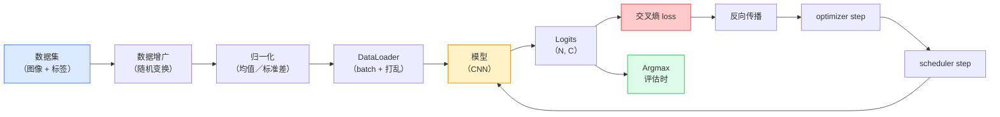

# 图像分类（Image Classification）

> 译注：本文译自同目录 [`en.md`](./en.md)。术语遵循仓根 [TRANSLATION_GUIDE.md](../../../../TRANSLATION_GUIDE.md)。

> 一个分类器，本质上就是把像素映射到类别概率分布的函数。其它一切都是管道。

**Type:** Build
**Languages:** Python
**Prerequisites:** Phase 2 Lesson 09 (Model Evaluation), Phase 3 Lesson 10 (Mini Framework), Phase 4 Lesson 03 (CNNs)
**Time:** ~75 minutes

## 学习目标（Learning Objectives）

- 在 CIFAR-10 上手搓一条端到端的图像分类流水线：数据集、增强、模型、训练循环、评估
- 解释每个组件（dataloader、loss、optimizer、scheduler、增强）的作用，并能预测其中任何一个出问题时损失曲线会怎么变形
- 从零实现 mixup、cutout 和 label smoothing，并说明各自值得加进来的场景
- 读懂混淆矩阵和每类 precision / recall 表，超越聚合 accuracy 去诊断数据集和模型的失败模式

## 问题（The Problem）

每一个上线的视觉任务，归根结底都可以归约为图像分类。检测分类区域、分割分类像素、检索按到类中心的相似度排序。把分类做对——数据集循环、增强策略、loss、评估——这套技能能迁移到 phase 里其它任何任务。

绝大多数分类 bug 不在模型里。它们活在流水线里：归一化写错了、训练集没 shuffle、增强破坏了标签、验证集被训练数据污染、学习率在第 30 个 epoch 之后悄无声息地发散。一个本该在 CIFAR-10 上跑到 93% 的 CNN，在配置出 bug 时常常只能得到 70-75%，而损失曲线全程看起来都还挺像样。

本课会把整条流水线手工连一遍，每个部件都可被检视。我们不会用 `torchvision.datasets` 里任何可能藏 bug 的东西。

## 概念（The Concept）

### 分类流水线（The classification pipeline）



这条循环里的每一行都是 bug 的栖息地。Cross-entropy 接收的是原始 logits，不是 softmax 之后的输出，所以在 loss 之前来一把 `model(x).softmax()` 会安静地算出错误的梯度。增强只作用在输入上、不动标签——除非你用 mixup，那就同时混。`optimizer.zero_grad()` 每步必须调一次；漏掉就会累积梯度，看上去像学习率剧烈不稳定。这些 bug 谁都不会抛错误，只是把学习曲线压扁。

### Cross-entropy、logits 与 softmax（Cross-entropy, logits, and softmax）

分类器对每张图像输出 `C` 个数字，叫 logits。套上 softmax 把它们变成一个概率分布：

```
softmax(z)_i = exp(z_i) / sum_j exp(z_j)
```

Cross-entropy 衡量正确类别的负对数概率：

```
CE(z, y) = -log( softmax(z)_y )
        = -z_y + log( sum_j exp(z_j) )
```

右边那种写法在数值上更稳定（log-sum-exp）。PyTorch 的 `nn.CrossEntropyLoss` 把 softmax + NLL 融合成一个 op，直接接收原始 logits。先自己 softmax 一把几乎一定是 bug——你算的是 log(softmax(softmax(z)))，一个毫无意义的量。

### 为什么增强有用（Why augmentation works）

CNN 通过权重共享天生具备平移的归纳偏置（inductive bias），但对裁剪、翻转、颜色抖动、遮挡毫无内建不变性。教会它这些不变性的唯一办法，就是把会触发它们的像素喂给它看。训练时的每一次随机变换，都是在告诉模型：「这两张图标签相同，去学那些忽略差异的特征。」

```
Original crop:  "dog facing left"
Flip:           "dog facing right"       <- same label, different pixels
Rotate(+15):    "dog, slight tilt"
Colour jitter:  "dog in warmer light"
RandomErasing:  "dog with patch missing"
```

规则只有一条：增强必须保留标签。在数字数据集上，cutout 和旋转可能把「6」变成「9」；那种数据集就要用更小的旋转范围，挑那些尊重数字特定不变性的增强方式。

### Mixup 与 cutmix（Mixup and cutmix）

普通增强变换像素但保持标签 one-hot。**Mixup** 和 **cutmix** 打破这点，把两边一起插值。

```
Mixup:
  lambda ~ Beta(a, a)
  x = lambda * x_i + (1 - lambda) * x_j
  y = lambda * y_i + (1 - lambda) * y_j

Cutmix:
  paste a random rectangle of x_j into x_i
  y = area-weighted mix of y_i and y_j
```

为什么有效：模型不再去死记尖锐的 one-hot 目标，而是学会在类别之间插值。训练 loss 上升、测试 accuracy 上升。这是给任何分类器加鲁棒性最便宜的一招。

### Label smoothing

mixup 的近亲。不再去拟合 `[0, 0, 1, 0, 0]`，而是拟合 `[eps/C, eps/C, 1-eps, eps/C, eps/C]`，`eps` 取个 0.1 之类的小值。它阻止模型输出任意尖锐的 logits，改善 calibration（校准），代价几乎为零。从 PyTorch 1.10 开始已内置在 `nn.CrossEntropyLoss(label_smoothing=0.1)` 里。

### 超越 accuracy 的评估（Evaluation beyond accuracy）

聚合 accuracy 会掩盖类别不平衡。一个 90-10 的二分类器只要永远预测多数类就有 90%。真正能告诉你发生了什么的工具：

- **每类 accuracy**——一类一个数；马上能暴露出表现差的类别。
- **混淆矩阵**——C x C 网格，第 i 行第 j 列等于「真实类 i 被预测为类 j」的数量；对角线是对的，非对角线就是你模型真正活着的地方。
- **Top-1 / Top-5**——正确类别是否在前 1 或前 5 的预测里；Top-5 在 ImageNet 上重要，因为像 "Norwich terrier" vs "Norfolk terrier" 这种类确实存在歧义。
- **Calibration（ECE）**——置信度 0.8 的预测，是不是真有 80% 的概率对？现代网络系统性过度自信；用 temperature scaling 或 label smoothing 能修。

## 动手实现（Build It）

### Step 1：一个确定性的合成数据集（A deterministic synthetic dataset）

CIFAR-10 是要落盘的。为了让本课可复现且跑得快，我们造一个长得像 CIFAR 的合成数据集——32x32 的 RGB 图像，每类带特定结构供模型学习。同样这条流水线一字不改也能跑真实的 CIFAR-10。

```python
import numpy as np
import torch
from torch.utils.data import Dataset


def synthetic_cifar(num_per_class=1000, num_classes=10, seed=0):
    rng = np.random.default_rng(seed)
    X = []
    Y = []
    for c in range(num_classes):
        centre = rng.uniform(0, 1, (3,))
        freq = 2 + c
        for _ in range(num_per_class):
            yy, xx = np.meshgrid(np.linspace(0, 1, 32), np.linspace(0, 1, 32), indexing="ij")
            r = np.sin(xx * freq) * 0.5 + centre[0]
            g = np.cos(yy * freq) * 0.5 + centre[1]
            b = (xx + yy) * 0.5 * centre[2]
            img = np.stack([r, g, b], axis=-1)
            img += rng.normal(0, 0.08, img.shape)
            img = np.clip(img, 0, 1)
            X.append(img.astype(np.float32))
            Y.append(c)
    X = np.stack(X)
    Y = np.array(Y)
    idx = rng.permutation(len(X))
    return X[idx], Y[idx]


class ArrayDataset(Dataset):
    def __init__(self, X, Y, transform=None):
        self.X = X
        self.Y = Y
        self.transform = transform

    def __len__(self):
        return len(self.X)

    def __getitem__(self, i):
        img = self.X[i]
        if self.transform is not None:
            img = self.transform(img)
        img = torch.from_numpy(img).permute(2, 0, 1)
        return img, int(self.Y[i])
```

每类有自己的颜色调色板和频率模式，再加一点高斯噪声，逼着模型去学信号而不是死记像素。十类，每类一千张，洗牌打乱。

### Step 2：归一化与增强（Normalisation and augmentation）

每条视觉流水线都有的两个变换。

```python
def standardize(mean, std):
    mean = np.array(mean, dtype=np.float32)
    std = np.array(std, dtype=np.float32)
    def _fn(img):
        return (img - mean) / std
    return _fn


def random_hflip(p=0.5):
    def _fn(img):
        if np.random.random() < p:
            return img[:, ::-1, :].copy()
        return img
    return _fn


def random_crop(pad=4):
    def _fn(img):
        h, w = img.shape[:2]
        padded = np.pad(img, ((pad, pad), (pad, pad), (0, 0)), mode="reflect")
        y = np.random.randint(0, 2 * pad)
        x = np.random.randint(0, 2 * pad)
        return padded[y:y + h, x:x + w, :]
    return _fn


def compose(*fns):
    def _fn(img):
        for fn in fns:
            img = fn(img)
        return img
    return _fn
```

裁剪前先 reflect-pad，不要 zero-pad，因为黑边本身是个信号，模型会学到一些没用的方式去忽略它。

### Step 3：Mixup

把两张图、两个标签在训练步内混起来。实现成 batch 级变换，因此它就在前向传播旁边，而不是塞在数据集里。

```python
def mixup_batch(x, y, num_classes, alpha=0.2):
    if alpha <= 0:
        return x, torch.nn.functional.one_hot(y, num_classes).float()
    lam = float(np.random.beta(alpha, alpha))
    idx = torch.randperm(x.size(0), device=x.device)
    x_mixed = lam * x + (1 - lam) * x[idx]
    y_onehot = torch.nn.functional.one_hot(y, num_classes).float()
    y_mixed = lam * y_onehot + (1 - lam) * y_onehot[idx]
    return x_mixed, y_mixed


def soft_cross_entropy(logits, soft_targets):
    log_probs = torch.log_softmax(logits, dim=-1)
    return -(soft_targets * log_probs).sum(dim=-1).mean()
```

`soft_cross_entropy` 是对软标签分布的 cross-entropy。当目标恰好是 one-hot 时，它会退化成普通 one-hot 情形。

### Step 4：训练循环（The training loop）

完整配方：数据过一遍，每个 batch 算一次梯度，scheduler 每个 epoch 走一步。

```python
import torch
import torch.nn as nn
from torch.utils.data import DataLoader
from torch.optim import SGD
from torch.optim.lr_scheduler import CosineAnnealingLR

def train_one_epoch(model, loader, optimizer, device, num_classes, use_mixup=True):
    model.train()
    total, correct, loss_sum = 0, 0, 0.0
    for x, y in loader:
        x, y = x.to(device), y.to(device)
        if use_mixup:
            x_m, y_soft = mixup_batch(x, y, num_classes)
            logits = model(x_m)
            loss = soft_cross_entropy(logits, y_soft)
        else:
            logits = model(x)
            loss = nn.functional.cross_entropy(logits, y, label_smoothing=0.1)
        optimizer.zero_grad()
        loss.backward()
        optimizer.step()
        loss_sum += loss.item() * x.size(0)
        total += x.size(0)
        # Training accuracy vs the un-mixed labels `y` is only an approximation
        # when mixup is on (the model saw soft targets, not y). Treat it as a
        # rough progress signal; rely on val accuracy for real performance.
        with torch.no_grad():
            pred = logits.argmax(dim=-1)
            correct += (pred == y).sum().item()
    return loss_sum / total, correct / total


@torch.no_grad()
def evaluate(model, loader, device, num_classes):
    model.eval()
    total, correct = 0, 0
    loss_sum = 0.0
    cm = torch.zeros(num_classes, num_classes, dtype=torch.long)
    for x, y in loader:
        x, y = x.to(device), y.to(device)
        logits = model(x)
        loss = nn.functional.cross_entropy(logits, y)
        pred = logits.argmax(dim=-1)
        for t, p in zip(y.cpu(), pred.cpu()):
            cm[t, p] += 1
        loss_sum += loss.item() * x.size(0)
        total += x.size(0)
        correct += (pred == y).sum().item()
    return loss_sum / total, correct / total, cm
```

每次写训练循环你都要查的五个不变量：

1. 训练前 `model.train()`，评估前 `model.eval()`——切换 dropout 和 batchnorm 的行为。
2. `.backward()` 之前一定要 `.zero_grad()`。
3. 累加指标用 `.item()`，免得让计算图一直活着。
4. 评估时挂 `@torch.no_grad()`——省内存省时间，也防止微妙的事故。
5. argmax 直接打在原始 logits 上，不要先 softmax——结果一样，少一个 op。

### Step 5：拼起来（Put it together）

用上一课的 `TinyResNet`，训几个 epoch，再评估一下。

```python
from main import synthetic_cifar, ArrayDataset
from main import standardize, random_hflip, random_crop, compose
from main import mixup_batch, soft_cross_entropy
from main import train_one_epoch, evaluate
# TinyResNet comes from the previous lesson (03-cnns-lenet-to-resnet).
# Adjust the import path to wherever you stored the previous lesson's code.
from cnns_lenet_to_resnet import TinyResNet  # example placeholder

X, Y = synthetic_cifar(num_per_class=500)
split = int(0.9 * len(X))
X_train, Y_train = X[:split], Y[:split]
X_val, Y_val = X[split:], Y[split:]

mean = [0.5, 0.5, 0.5]
std = [0.25, 0.25, 0.25]
train_tf = compose(random_hflip(), random_crop(pad=4), standardize(mean, std))
eval_tf = standardize(mean, std)

train_ds = ArrayDataset(X_train, Y_train, transform=train_tf)
val_ds = ArrayDataset(X_val, Y_val, transform=eval_tf)

train_loader = DataLoader(train_ds, batch_size=128, shuffle=True, num_workers=0)
val_loader = DataLoader(val_ds, batch_size=256, shuffle=False, num_workers=0)

device = "cuda" if torch.cuda.is_available() else "cpu"
model = TinyResNet(num_classes=10).to(device)
optimizer = SGD(model.parameters(), lr=0.1, momentum=0.9, weight_decay=5e-4, nesterov=True)
scheduler = CosineAnnealingLR(optimizer, T_max=10)

for epoch in range(10):
    tr_loss, tr_acc = train_one_epoch(model, train_loader, optimizer, device, 10, use_mixup=True)
    va_loss, va_acc, _ = evaluate(model, val_loader, device, 10)
    scheduler.step()
    print(f"epoch {epoch:2d}  lr {scheduler.get_last_lr()[0]:.4f}  "
          f"train {tr_loss:.3f}/{tr_acc:.3f}  val {va_loss:.3f}/{va_acc:.3f}")
```

在合成数据集上，五个 epoch 之内验证 accuracy 接近完美，这正是重点：流水线是对的，模型能学到该学的东西。把数据集换成真正的 CIFAR-10，同样的循环不改一行就能训到 ~90%。

### Step 6：读混淆矩阵（Read the confusion matrix）

光看 accuracy 永远说不出模型在哪里挂了。混淆矩阵能。

```python
def print_confusion(cm, labels=None):
    c = cm.shape[0]
    labels = labels or [str(i) for i in range(c)]
    print(f"{'':>6}" + "".join(f"{l:>5}" for l in labels))
    for i in range(c):
        row = cm[i].tolist()
        print(f"{labels[i]:>6}" + "".join(f"{v:>5}" for v in row))
    print()
    tp = cm.diag().float()
    fp = cm.sum(dim=0).float() - tp
    fn = cm.sum(dim=1).float() - tp
    prec = tp / (tp + fp).clamp_min(1)
    rec = tp / (tp + fn).clamp_min(1)
    f1 = 2 * prec * rec / (prec + rec).clamp_min(1e-9)
    for i in range(c):
        print(f"{labels[i]:>6}  prec {prec[i]:.3f}  rec {rec[i]:.3f}  f1 {f1[i]:.3f}")

_, _, cm = evaluate(model, val_loader, device, 10)
print_confusion(cm)
```

行是真实类，列是预测。如果第 3 类和第 5 类之间出现一团非对角线计数，说明模型把这俩搞混了，给你一个起点：要么针对性补数据，要么做类别相关的增强。

## 用起来（Use It）

`torchvision` 把上面这些都封装成了惯用组件。对于真正的 CIFAR-10，整条流水线就是四行加一个训练循环。

```python
from torchvision.datasets import CIFAR10
from torchvision.transforms import Compose, RandomCrop, RandomHorizontalFlip, ToTensor, Normalize

mean = (0.4914, 0.4822, 0.4465)
std = (0.2470, 0.2435, 0.2616)
train_tf = Compose([
    RandomCrop(32, padding=4, padding_mode="reflect"),
    RandomHorizontalFlip(),
    ToTensor(),
    Normalize(mean, std),
])
eval_tf = Compose([ToTensor(), Normalize(mean, std)])

train_ds = CIFAR10(root="./data", train=True,  download=True, transform=train_tf)
val_ds   = CIFAR10(root="./data", train=False, download=True, transform=eval_tf)
```

两点要注意：mean/std 是**数据集相关的**——它是在 CIFAR-10 训练集上算的，不是 ImageNet——而 reflect pad 是社区默认的裁剪策略。把 ImageNet 的统计量复制粘过来，会有一个 ~1% 的 accuracy 漏点，没人会注意到，直到有人去 profile 模型才被翻出来。

## 上线部署（Ship It）

本课产出：

- `outputs/prompt-classifier-pipeline-auditor.md`——一个 prompt，用来审计训练脚本是否满足上面五个不变量，并指出第一个违例。
- `outputs/skill-classification-diagnostics.md`——一个 skill：给定混淆矩阵和类别名列表，总结每类的失败模式，并提出影响最大的那一处修复方案。

## 练习（Exercises）

1. **(Easy)** 在合成数据集上分别带 mixup 和不带 mixup 各训五个 epoch。把两组的 train 和 val loss 都画出来。解释为什么开了 mixup 之后 train loss 反而更高，但 val accuracy 相当甚至更好。
2. **(Medium)** 实现 Cutout——把每张训练图像里一块随机的 8x8 方块清零——并做消融实验（ablation，对比无增强 / hflip+crop / hflip+crop+cutout / hflip+crop+mixup）。报告各自的 val accuracy。
3. **(Hard)** 搭一条 CIFAR-100 流水线（100 类，输入尺寸不变），复现一次 ResNet-34 的训练，做到与已发表 accuracy 误差在 1% 以内。加分项：扫三个学习率和两个 weight decay，记到本地 CSV，输出最终的「混淆矩阵 top 易混淆」表。

## 关键术语（Key Terms）

| 术语 | 大家怎么说 | 它实际是什么 |
|------|----------------|----------------------|
| Logits | "Raw outputs" | softmax 之前每张图的 C 维向量；cross-entropy 接收的就是它，而不是 softmax 后的值 |
| Cross-entropy | "The loss" | 正确类别的负对数概率；把 log-softmax 和 NLL 融合成一个数值稳定的 op |
| DataLoader | "The batcher" | 给数据集套上 shuffle、batch、（可选）多 worker 加载；一半训练 bug 都怪到它头上 |
| Augmentation | "Random transforms" | 训练时任意的像素级变换、且必须保留标签；教 CNN 那些它本来不具备的不变性 |
| Mixup / Cutmix | "Mix two images" | 把输入和标签一起插值，让分类器学平滑过渡而不是硬边界 |
| Label smoothing | "Softer targets" | 把 one-hot 替换成 (1-eps, eps/(C-1), ...)；改善 calibration，accuracy 也略涨 |
| Top-k accuracy | "Top-5" | 正确类别在 top-k 概率预测里；用在那些类别本身就有歧义的数据集上 |
| Confusion matrix | "Where errors live" | C x C 表格，(i, j) 项计数真实类 i 被预测为 j 的图像数；对角线是对的，非对角线告诉你下一步该修哪儿 |

## 延伸阅读（Further Reading）

- [CS231n: Training Neural Networks](https://cs231n.github.io/neural-networks-3/)——单页之内把训练流水线讲得最清楚的一篇，至今没被超越
- [Bag of Tricks for Image Classification (He et al., 2019)](https://arxiv.org/abs/1812.01187)——一堆小技巧，加在一起能给 ImageNet 上的 ResNet 多刷 3-4% accuracy
- [mixup: Beyond Empirical Risk Minimization (Zhang et al., 2017)](https://arxiv.org/abs/1710.09412)——mixup 的原始论文；三页理论加令人信服的实验
- [Why temperature scaling matters (Guo et al., 2017)](https://arxiv.org/abs/1706.04599)——证明现代网络系统性失校准、并用一个标量参数把它修好的那篇论文
