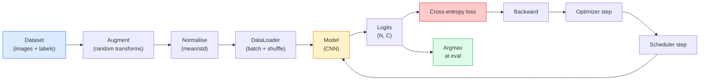

# 04 · 图像分类

> 分类器就是一个从像素到类别概率分布的函数。其余的一切都只是管道连接。

**类型：** 实战构建
**语言：** Python
**前置：** 第 2 阶段第 09 课（模型评估）、第 3 阶段第 10 课（迷你框架）、第 4 阶段第 03 课（CNN）
**时长：** 约 75 分钟

## 学习目标

- 在 CIFAR-10 上构建一条端到端的图像分类流水线：数据集、数据增强、模型、训练循环、评估
- 解释每个组件（数据加载器、损失、优化器、调度器、数据增强）的作用，并预测其中任何一个出问题时会如何反映在损失曲线上
- 从零实现「mixup」「cutout」和「标签平滑（label smoothing）」，并论证各自在何种情况下值得引入
- 读懂「混淆矩阵（confusion matrix）」和逐类「精确率/召回率（precision/recall）」表，从而诊断出聚合准确率之外的数据集与模型缺陷

## 问题所在

每一个真正落地的视觉任务，归根结底都可以在某个层面上化约为图像分类。检测是对区域分类，分割是对像素分类，检索则按与各类别质心的相似度排序。把分类这件事做对——数据集循环、增强策略、损失、评估——是一项能够迁移到本阶段所有其他任务的技能。

大多数分类的 bug 不在模型里，而是潜伏在流水线中：一处出错的归一化、一个未打乱的训练集、扭曲了标签的数据增强、被训练数据污染的验证集划分、在第 30 个 epoch 后悄悄发散的学习率。在配置正确时本能在 CIFAR-10 上达到 93% 的 CNN，配置出错时通常只能拿到 70-75%，而且整个过程中损失曲线看起来都很合理。

本课会手动接好整条流水线，让每一部分都可供检视。我们不会使用 `torchvision.datasets` 里任何可能藏起 bug 的东西。

## 核心概念

### 分类流水线



这个循环中的每一行都可能藏着 bug。交叉熵接收的是原始 logits，而不是 softmax 输出，因此在损失之前任何 `model(x).softmax()` 都会悄悄算出错误的梯度。数据增强只作用于输入，不作用于标签——唯一的例外是 mixup，它同时混合两者。`optimizer.zero_grad()` 必须每一步调用一次；漏掉它会导致梯度累积，看起来就像一个剧烈不稳定的学习率。上述每一个 bug 都会让学习曲线变平，却不会抛出任何错误。

### 交叉熵、logits 与 softmax

分类器为每张图片产生 `C` 个数，称为 logits。施加 softmax 会把它们转换成一个概率分布：

```
softmax(z)_i = exp(z_i) / sum_j exp(z_j)
```

交叉熵衡量的是正确类别的负对数概率：

```
CE(z, y) = -log( softmax(z)_y )
        = -z_y + log( sum_j exp(z_j) )
```

右边那种写法在数值上更稳定（log-sum-exp）。PyTorch 的 `nn.CrossEntropyLoss` 把 softmax + NLL 融合在一个算子里，直接接收原始 logits。自己先施加一次 softmax 几乎总是 bug——你算的会是 log(softmax(softmax(z)))，一个毫无意义的量。

### 数据增强为何有效

CNN 对平移有「归纳偏置（inductive bias）」（源自权重共享），但对裁剪、翻转、色彩抖动或遮挡并没有内建的不变性。教会它这些不变性的唯一办法，就是给它看能体现这些变化的像素。训练期间每一次随机变换，都是在说一句话：「这两张图片标签相同；去学习那些能忽略它们差异的特征。」

```
Original crop:  "dog facing left"
Flip:           "dog facing right"       <- same label, different pixels
Rotate(+15):    "dog, slight tilt"
Colour jitter:  "dog in warmer light"
RandomErasing:  "dog with patch missing"
```

规则是：数据增强必须保持标签不变。对一个数字做 cutout 和旋转，可能把「6」翻成「9」；对那种数据集，你要用更小的旋转范围，并挑选尊重数字特有不变性的增强方式。

### Mixup 与 cutmix

普通的数据增强变换像素，但保持标签为 one-hot。**Mixup** 和 **cutmix** 打破了这一点，它们对两者都做插值。

```
Mixup:
  lambda ~ Beta(a, a)
  x = lambda * x_i + (1 - lambda) * x_j
  y = lambda * y_i + (1 - lambda) * y_j

Cutmix:
  paste a random rectangle of x_j into x_i
  y = area-weighted mix of y_i and y_j
```

它为什么有用：模型不再去记忆那些尖锐的 one-hot 目标，而是学会在类别之间插值。训练损失上升，测试准确率上升。对任何分类器而言，这都是性价比最高的一项鲁棒性升级。

### 标签平滑

mixup 的近亲。不再针对 `[0, 0, 1, 0, 0]` 来训练，而是针对 `[eps/C, eps/C, 1-eps, eps/C, eps/C]` 训练，其中 `eps` 取一个很小的值，比如 0.1。这能阻止模型产生任意尖锐的 logits，并以几乎可忽略的代价改善「校准（calibration）」。自 PyTorch 1.10 起，它已内建于 `nn.CrossEntropyLoss(label_smoothing=0.1)`。

### 准确率之外的评估

聚合准确率会掩盖类别不平衡。一个 90-10 的二分类器，只要永远预测多数类就能拿到 90%。真正能告诉你发生了什么的工具有：

- **逐类准确率** —— 每个类别一个数字；能立刻暴露出表现欠佳的类别。
- **混淆矩阵** —— 一个 C x C 的网格，第 i 行第 j 列等于真实类别 i 被预测为类别 j 的计数；对角线是预测正确的部分，非对角线则是你的模型真正出问题的地方。
- **Top-1 / Top-5** —— 正确类别是否落在前 1 或前 5 个预测之内；Top-5 对 ImageNet 很重要，因为像「Norwich terrier」与「Norfolk terrier」这样的类别确实存在歧义。
- **校准（ECE）** —— 一个置信度为 0.8 的预测，是否真的有 80% 的时候是对的？现代网络系统性地过度自信；可用「温度缩放（temperature scaling）」或标签平滑来修正。

## 动手构建

### 第 1 步：一个确定性的合成数据集

CIFAR-10 存放在磁盘上。为了让本课可复现且运行快速，我们构建一个看起来像 CIFAR 的合成数据集——32x32 的 RGB 图像，带有模型必须学习的类别特有结构。完全相同的这条流水线，在真实的 CIFAR-10 上无需改动即可工作。

```python
import numpy as np
import torch
from torch.utils.data import Dataset


def synthetic_cifar(num_per_class=1000, num_classes=10, seed=0):
    rng = np.random.default_rng(seed)
    X = []
    Y = []
    for c in range(num_classes):
        centre = rng.uniform(0, 1, (3,))
        freq = 2 + c
        for _ in range(num_per_class):
            yy, xx = np.meshgrid(np.linspace(0, 1, 32), np.linspace(0, 1, 32), indexing="ij")
            r = np.sin(xx * freq) * 0.5 + centre[0]
            g = np.cos(yy * freq) * 0.5 + centre[1]
            b = (xx + yy) * 0.5 * centre[2]
            img = np.stack([r, g, b], axis=-1)
            img += rng.normal(0, 0.08, img.shape)
            img = np.clip(img, 0, 1)
            X.append(img.astype(np.float32))
            Y.append(c)
    X = np.stack(X)
    Y = np.array(Y)
    idx = rng.permutation(len(X))
    return X[idx], Y[idx]


class ArrayDataset(Dataset):
    def __init__(self, X, Y, transform=None):
        self.X = X
        self.Y = Y
        self.transform = transform

    def __len__(self):
        return len(self.X)

    def __getitem__(self, i):
        img = self.X[i]
        if self.transform is not None:
            img = self.transform(img)
        img = torch.from_numpy(img).permute(2, 0, 1)
        return img, int(self.Y[i])
```

每个类别都有自己的调色板和频率图案，再加上高斯噪声，迫使模型学习信号本身而不是去记忆像素。十个类别，每个一千张图像，并做了打乱。

### 第 2 步：归一化与数据增强

这是每条视觉流水线都有的两个变换。

```python
def standardize(mean, std):
    mean = np.array(mean, dtype=np.float32)
    std = np.array(std, dtype=np.float32)
    def _fn(img):
        return (img - mean) / std
    return _fn


def random_hflip(p=0.5):
    def _fn(img):
        if np.random.random() < p:
            return img[:, ::-1, :].copy()
        return img
    return _fn


def random_crop(pad=4):
    def _fn(img):
        h, w = img.shape[:2]
        padded = np.pad(img, ((pad, pad), (pad, pad), (0, 0)), mode="reflect")
        y = np.random.randint(0, 2 * pad)
        x = np.random.randint(0, 2 * pad)
        return padded[y:y + h, x:x + w, :]
    return _fn


def compose(*fns):
    def _fn(img):
        for fn in fns:
            img = fn(img)
        return img
    return _fn
```

裁剪前要用「反射填充（reflect-pad）」而不是「零填充（zero-pad）」，因为黑色边框是一种信号，模型会以一种无用的方式学着去忽略它。

### 第 3 步：Mixup

在训练步骤内部混合两张图像和两个标签。实现为一个批次变换（batch transform），让它紧挨着前向传播，而不是放在数据集内部。

```python
def mixup_batch(x, y, num_classes, alpha=0.2):
    if alpha <= 0:
        return x, torch.nn.functional.one_hot(y, num_classes).float()
    lam = float(np.random.beta(alpha, alpha))
    idx = torch.randperm(x.size(0), device=x.device)
    x_mixed = lam * x + (1 - lam) * x[idx]
    y_onehot = torch.nn.functional.one_hot(y, num_classes).float()
    y_mixed = lam * y_onehot + (1 - lam) * y_onehot[idx]
    return x_mixed, y_mixed


def soft_cross_entropy(logits, soft_targets):
    log_probs = torch.log_softmax(logits, dim=-1)
    return -(soft_targets * log_probs).sum(dim=-1).mean()
```

`soft_cross_entropy` 是针对软标签分布计算的交叉熵。当目标恰好是 one-hot 时，它就退化为常见的 one-hot 情形。

### 第 4 步：训练循环

完整的配方：在数据上跑一遍，每个批次更新一次梯度，每个 epoch 调度器步进一次。

```python
import torch
import torch.nn as nn
from torch.utils.data import DataLoader
from torch.optim import SGD
from torch.optim.lr_scheduler import CosineAnnealingLR

def train_one_epoch(model, loader, optimizer, device, num_classes, use_mixup=True):
    model.train()
    total, correct, loss_sum = 0, 0, 0.0
    for x, y in loader:
        x, y = x.to(device), y.to(device)
        if use_mixup:
            x_m, y_soft = mixup_batch(x, y, num_classes)
            logits = model(x_m)
            loss = soft_cross_entropy(logits, y_soft)
        else:
            logits = model(x)
            loss = nn.functional.cross_entropy(logits, y, label_smoothing=0.1)
        optimizer.zero_grad()
        loss.backward()
        optimizer.step()
        loss_sum += loss.item() * x.size(0)
        total += x.size(0)
        # 在开启 mixup 时，针对未混合标签 `y` 计算的训练准确率只是一个近似值
        # （模型看到的是软目标，而不是 y）。把它当作一个粗略的进度信号即可；
        # 真正的性能要依赖验证集准确率。
        with torch.no_grad():
            pred = logits.argmax(dim=-1)
            correct += (pred == y).sum().item()
    return loss_sum / total, correct / total


@torch.no_grad()
def evaluate(model, loader, device, num_classes):
    model.eval()
    total, correct = 0, 0
    loss_sum = 0.0
    cm = torch.zeros(num_classes, num_classes, dtype=torch.long)
    for x, y in loader:
        x, y = x.to(device), y.to(device)
        logits = model(x)
        loss = nn.functional.cross_entropy(logits, y)
        pred = logits.argmax(dim=-1)
        for t, p in zip(y.cpu(), pred.cpu()):
            cm[t, p] += 1
        loss_sum += loss.item() * x.size(0)
        total += x.size(0)
        correct += (pred == y).sum().item()
    return loss_sum / total, correct / total, cm
```

每次写训练循环时都要检查的五条不变量：

1. 训练前调用 `model.train()`，评估前调用 `model.eval()` —— 它会切换 dropout 和 batchnorm 的行为。
2. `.zero_grad()` 要在 `.backward()` 之前调用。
3. 累积指标时使用 `.item()`，这样就不会有任何东西让计算图保持存活。
4. 评估期间使用 `@torch.no_grad()` —— 既省内存又省时间，还能避免一些微妙的意外。
5. 对原始 logits 做 argmax，而不是对 softmax —— 结果相同，但少了一个算子。

### 第 5 步：拼装起来

使用上一课里的 `TinyResNet`，训练几个 epoch，然后评估。

```python
from main import synthetic_cifar, ArrayDataset
from main import standardize, random_hflip, random_crop, compose
from main import mixup_batch, soft_cross_entropy
from main import train_one_epoch, evaluate
# TinyResNet 来自上一课（03-cnns-lenet-to-resnet）。
# 请把导入路径改成你存放上一课代码的位置。
from cnns_lenet_to_resnet import TinyResNet  # 示例占位

X, Y = synthetic_cifar(num_per_class=500)
split = int(0.9 * len(X))
X_train, Y_train = X[:split], Y[:split]
X_val, Y_val = X[split:], Y[split:]

mean = [0.5, 0.5, 0.5]
std = [0.25, 0.25, 0.25]
train_tf = compose(random_hflip(), random_crop(pad=4), standardize(mean, std))
eval_tf = standardize(mean, std)

train_ds = ArrayDataset(X_train, Y_train, transform=train_tf)
val_ds = ArrayDataset(X_val, Y_val, transform=eval_tf)

train_loader = DataLoader(train_ds, batch_size=128, shuffle=True, num_workers=0)
val_loader = DataLoader(val_ds, batch_size=256, shuffle=False, num_workers=0)

device = "cuda" if torch.cuda.is_available() else "cpu"
model = TinyResNet(num_classes=10).to(device)
optimizer = SGD(model.parameters(), lr=0.1, momentum=0.9, weight_decay=5e-4, nesterov=True)
scheduler = CosineAnnealingLR(optimizer, T_max=10)

for epoch in range(10):
    tr_loss, tr_acc = train_one_epoch(model, train_loader, optimizer, device, 10, use_mixup=True)
    va_loss, va_acc, _ = evaluate(model, val_loader, device, 10)
    scheduler.step()
    print(f"epoch {epoch:2d}  lr {scheduler.get_last_lr()[0]:.4f}  "
          f"train {tr_loss:.3f}/{tr_acc:.3f}  val {va_loss:.3f}/{va_acc:.3f}")
```

在这个合成数据集上，它会在五个 epoch 内逼近完美的验证准确率，而这正是重点：流水线是正确的，模型能学会一切可学之物。把数据集换成真实的 CIFAR-10，同一个循环无需改动即可训练到约 90%。

### 第 6 步：读懂混淆矩阵

单凭准确率永远无法告诉你模型在哪里失败。混淆矩阵可以。

```python
def print_confusion(cm, labels=None):
    c = cm.shape[0]
    labels = labels or [str(i) for i in range(c)]
    print(f"{'':>6}" + "".join(f"{l:>5}" for l in labels))
    for i in range(c):
        row = cm[i].tolist()
        print(f"{labels[i]:>6}" + "".join(f"{v:>5}" for v in row))
    print()
    tp = cm.diag().float()
    fp = cm.sum(dim=0).float() - tp
    fn = cm.sum(dim=1).float() - tp
    prec = tp / (tp + fp).clamp_min(1)
    rec = tp / (tp + fn).clamp_min(1)
    f1 = 2 * prec * rec / (prec + rec).clamp_min(1e-9)
    for i in range(c):
        print(f"{labels[i]:>6}  prec {prec[i]:.3f}  rec {rec[i]:.3f}  f1 {f1[i]:.3f}")

_, _, cm = evaluate(model, val_loader, device, 10)
print_confusion(cm)
```

行是真实类别，列是预测。如果类别 3 和类别 5 之间出现一簇非对角线的计数，就意味着模型把这两类搞混了，这也为你定向收集数据或做特定类别的数据增强提供了一个起点。

## 实际应用

`torchvision` 把上面的一切都封装成了符合习惯的组件。对于真实的 CIFAR-10，完整流水线只需四行加上一个训练循环。

```python
from torchvision.datasets import CIFAR10
from torchvision.transforms import Compose, RandomCrop, RandomHorizontalFlip, ToTensor, Normalize

mean = (0.4914, 0.4822, 0.4465)
std = (0.2470, 0.2435, 0.2616)
train_tf = Compose([
    RandomCrop(32, padding=4, padding_mode="reflect"),
    RandomHorizontalFlip(),
    ToTensor(),
    Normalize(mean, std),
])
eval_tf = Compose([ToTensor(), Normalize(mean, std)])

train_ds = CIFAR10(root="./data", train=True,  download=True, transform=train_tf)
val_ds   = CIFAR10(root="./data", train=False, download=True, transform=eval_tf)
```

有两点要注意：mean/std 是**数据集特有的**——它们是在 CIFAR-10 训练集上计算的，而不是 ImageNet——而反射填充是社区默认的裁剪策略。把 ImageNet 的统计量直接复制粘贴到这里，会造成约 1% 的准确率损失，而在有人去剖析模型之前没人会发现。

## 交付成果

本课产出：

- `outputs/prompt-classifier-pipeline-auditor.md` —— 一个提示词，它会针对上面那五条不变量审计训练脚本，并指出第一处违规。
- `outputs/skill-classification-diagnostics.md` —— 一个 skill，给定一个混淆矩阵和一份类别名称列表，它会总结各类别的失败情况，并提出影响最大的那一处修复建议。

## 练习

1. **（简单）** 在合成数据集上，分别用开启 mixup 和不开启 mixup 训练同一个模型五个 epoch。把两者的训练损失和验证损失都画出来。解释为什么开启 mixup 时训练损失更高，而验证准确率却相近甚至更好。
2. **（中等）** 实现 Cutout——把每张训练图像中一个随机的 8x8 方块置零——并做一次「消融实验（ablation）」，对比：无增强、hflip+crop、hflip+crop+cutout、hflip+crop+mixup。报告每一种配置的验证准确率。
3. **（困难）** 构建一条 CIFAR-100 流水线（100 个类别，输入尺寸相同），复现一次 ResNet-34 的训练，使其准确率与已发表结果相差不超过 1%。附加项：扫描三个学习率和两个权重衰减，把日志记录到本地 CSV，并产出最终的「混淆矩阵-最易混淆项」表格。

## 关键术语

| 术语 | 人们怎么说 | 它实际指什么 |
|------|----------------|----------------------|
| Logits | 「原始输出」 | 每张图片 softmax 之前那个由 C 个数构成的向量；交叉熵期望的是它，而不是 softmax 之后的值 |
| 交叉熵（Cross-entropy） | 「那个损失」 | 正确类别的负对数概率；在一个数值稳定的算子里结合了 log-softmax 和 NLL |
| DataLoader | 「分批器」 | 给数据集包上打乱、分批以及（可选的）多 worker 加载；一半训练 bug 都会赖到它头上 |
| 数据增强（Augmentation） | 「随机变换」 | 训练时任何保持标签不变的像素级变换；教会 CNN 它本身不具备的不变性 |
| Mixup / Cutmix | 「混合两张图」 | 同时混合输入和标签，让分类器学习平滑插值而非硬边界 |
| 标签平滑（Label smoothing） | 「更柔和的目标」 | 把 one-hot 替换为 (1-eps, eps/(C-1), ...)；改善校准并略微提升准确率 |
| Top-k 准确率 | 「Top-5」 | 正确类别落在概率最高的 k 个预测之内；用于那些类别确实存在歧义的数据集 |
| 混淆矩阵（Confusion matrix） | 「错误藏在哪」 | 一个 C x C 的表，元素 (i, j) 统计真实类别 i 被预测为 j 的图像数；对角线是对的，非对角线告诉你该修什么 |

## 延伸阅读

- [CS231n: Training Neural Networks](https://cs231n.github.io/neural-networks-3/) —— 至今仍是单页之内对训练流水线最清晰的导览
- [Bag of Tricks for Image Classification (He et al., 2019)](https://arxiv.org/abs/1812.01187) —— 每一个小技巧合起来能让 ResNet 在 ImageNet 上的准确率提升 3-4%
- [mixup: Beyond Empirical Risk Minimization (Zhang et al., 2017)](https://arxiv.org/abs/1710.09412) —— mixup 的原始论文；三页理论加上有说服力的实验
- [Why temperature scaling matters (Guo et al., 2017)](https://arxiv.org/abs/1706.04599) —— 这篇论文证明了现代网络存在校准失准，并用一个标量参数解决了它
