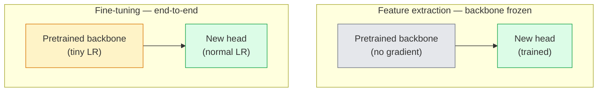

# Transfer Learning & Fine-Tuning

> ほかの誰かが、edges、textures、object parts がどのように見えるかを network に教えるため、膨大な GPU 時間を使っています。自分の task を学習する前に、その features を借りるべきです。

**種別:** 構築
**言語:** Python
**前提条件:** Phase 4 Lesson 03 (CNNs), Phase 4 Lesson 04 (Image Classification)
**所要時間:** 約75分

## Learning Objectives

- feature extraction と fine-tuning を区別し、dataset size、domain distance、compute budget に基づいて適切な方法を選ぶ
- pretrained backbone を読み込み、classifier head を置き換え、head だけを学習して短い code で working baseline を作る
- progressive unfreezing と discriminative learning rates を使い、初期の汎用 features には後段の task-specific features より小さい update を与える
- common failures である高すぎる LR による feature drift、tiny datasets での BN statistics collapse、catastrophic forgetting を診断する

## 問題

ImageNet で ResNet-50 を学習するには、およそ 2,000 GPU-hours が必要です。出荷するすべての task にその予算を使える team はほとんどありません。実際に多くの team が出荷するのは、pretrained backbone に新しい head を載せ、数百から数千枚の task-specific images で head と一部の層を調整した model です。

これは近道ではありません。ImageNet-trained CNN の最初の conv block は edges や Gabor-like filters を学び、次の blocks は textures と simple motifs を学び、中間層は object parts を、最後の blocks は 1,000 ImageNet categories に近い組み合わせを学びます。この hierarchy の最初の 90% は、medical imaging、industrial inspection、satellite data など多くの vision task にほぼそのまま転移します。実際に強く学習する必要があるのは最後の 10% です。

transfer を正しく行うには、3 つの罠を避ける必要があります。高すぎる learning rate で pretrained features を壊すこと、凍結しすぎて model から情報を奪うこと、BatchNorm の running statistics を小さな dataset に drift させることです。この lesson では、それぞれを意図的に扱います。

## The Concept

### Feature extraction vs fine-tuning

どちらを使うかは、pretrained features をどれだけ信頼できるか、data がどれだけあるかで決まります。



Rules of thumb:

| Dataset size | Domain distance | Recipe |
|--------------|-----------------|--------|
| < 1k images | close to ImageNet | Backbone を凍結し、head だけを学習する |
| 1k-10k | close | 最初の 2-3 stages を凍結し、残りを fine-tune する |
| 10k-100k | any | discriminative LR で end-to-end fine-tuning する |
| 100k+ | far | すべて fine-tune する。domain が十分遠ければ scratch training も検討する |

"Close to ImageNet" は、object-like content を含む自然な RGB 写真をおおよそ意味します。medical CT scans、overhead satellite imagery、microscopy は far domains です。features はまだ役に立ちますが、より多くの layers を適応させる必要があります。

### Why freezing works at all

CNN が ImageNet で学ぶ features は、1,000 categories だけに特化しているわけではありません。specific orientations の edges、textures、contrast patterns、shape primitives といった自然画像の統計に特化しています。これらの統計は、人間が名前を付けられるほぼすべての visual domain で安定しています。そのため、ImageNet で trained した model に新しい linear head だけを載せ、backbone を fine-tune しなくても、CIFAR-10 のような task で高い accuracy に届きます。head は、この task でどの既存 features に重みを置くかを学んでいます。

### Discriminative learning rates

unfreeze するとき、初期層は後段の層より遅く学習させます。初期層は保持したい generic features を符号化し、後段の層は大きく動かす必要がある task-specific structure を符号化しているからです。

```
Typical recipe:

  stage 0 (stem + first group): lr = base_lr / 100    (mostly fixed)
  stage 1:                       lr = base_lr / 10
  stage 2:                       lr = base_lr / 3
  stage 3 (last backbone group): lr = base_lr
  head:                          lr = base_lr  (or slightly higher)
```

PyTorch では optimizer に parameter groups の list を渡すだけです。1 つの model、5 つの learning rates、追加 code はほぼありません。

### The BatchNorm problem

BN layers は ImageNet で計算された `running_mean` と `running_var` buffers を持っています。task の pixel distribution が異なる場合、これらの buffers は誤っています。選択肢は次の 3 つです。

1. **Fine-tune with BN in train mode.** BN に running statistics を更新させます。medium-sized dataset（>= 5k examples）での default choice です。
2. **Freeze BN in eval mode.** ImageNet statistics を保持し、weights だけを学習します。BN の moving average が noisy になるほど dataset が小さい場合に正しい選択です。
3. **Replace BN with GroupNorm.** moving-average problem を完全に取り除きます。GPU あたりの batch size が小さい detection や segmentation backbones で使われます。

ここを間違えると accuracy が静かに 5-15% 落ちます。

### Head design

classifier head は 1-3 個の linear layers と optional dropout です。torchvision backbone には default head があり、それを置き換えます。

```
backbone.fc = nn.Linear(backbone.fc.in_features, num_classes)          # ResNet
backbone.classifier[1] = nn.Linear(..., num_classes)                    # EfficientNet, MobileNet
backbone.heads.head = nn.Linear(..., num_classes)                       # torchvision ViT
```

small datasets では single linear layer で十分なことが多いです。backbone の training distribution から task distribution が離れている場合は、hidden layer（Linear -> ReLU -> Dropout -> Linear）が効くことがあります。

### Layer-wise LR decay

modern fine-tuning（BEiT、DINOv2、ViT-B fine-tunes）で使われる、discriminative LR のより滑らかな版です。layers を stages にまとめる代わりに、上の layer より少し小さい LR を各 layer に与えます。

```
lr_layer_k = base_lr * decay^(L - k)
```

decay = 0.75、L = 12 transformer blocks なら、最初の block は head の LR の `0.75^11 ≈ 0.04x` で学習します。CNN では stage-grouped LR で十分なことが多く、transformer fine-tunes でより重要です。

### What to evaluate

transfer-learning runs では scratch run で追わない 2 つの数字が必要です。

- **Pretrained-only accuracy** — backbone を凍結した head の accuracy。floor です。
- **Fine-tuned accuracy** — end-to-end training 後の同じ model。ceiling です。

fine-tuned が pretrained-only より低ければ、learning-rate または BN の bug です。必ず両方を表示します。

## 実装

### Step 1: Load a pretrained backbone and inspect it

```python
import torch
import torch.nn as nn
from torchvision.models import resnet18, ResNet18_Weights

backbone = resnet18(weights=ResNet18_Weights.IMAGENET1K_V1)
print(backbone)
print()
print("classifier head:", backbone.fc)
print("feature dim:", backbone.fc.in_features)
```

`ResNet18` は stem と `fc` head に加えて 4 つの stages（`layer1..layer4`）を持ちます。torchvision の分類 backbone はいずれも似た構造です。

### Step 2: Feature extraction — freeze everything, replace the head

```python
def make_feature_extractor(num_classes=10):
    model = resnet18(weights=ResNet18_Weights.IMAGENET1K_V1)
    for p in model.parameters():
        p.requires_grad = False
    model.fc = nn.Linear(model.fc.in_features, num_classes)
    return model

model = make_feature_extractor(num_classes=10)
trainable = sum(p.numel() for p in model.parameters() if p.requires_grad)
frozen = sum(p.numel() for p in model.parameters() if not p.requires_grad)
print(f"trainable: {trainable:>10,}")
print(f"frozen:    {frozen:>10,}")
```

trainable なのは `model.fc` だけです。backbone は frozen feature extractor です。

### Step 3: Discriminative fine-tuning

stage ごとに異なる learning rate を持つ parameter groups を作る utility です。

```python
def discriminative_param_groups(model, base_lr=1e-3, decay=0.3):
    stages = [
        ["conv1", "bn1"],
        ["layer1"],
        ["layer2"],
        ["layer3"],
        ["layer4"],
        ["fc"],
    ]
    groups = []
    for i, names in enumerate(stages):
        lr = base_lr * (decay ** (len(stages) - 1 - i))
        params = [p for n, p in model.named_parameters()
                  if any(n.startswith(k) for k in names)]
        if params:
            groups.append({"params": params, "lr": lr, "name": "_".join(names)})
    return groups

model = resnet18(weights=ResNet18_Weights.IMAGENET1K_V1)
model.fc = nn.Linear(model.fc.in_features, 10)
for p in model.parameters():
    p.requires_grad = True

groups = discriminative_param_groups(model)
for g in groups:
    print(f"{g['name']:>10s}  lr={g['lr']:.2e}  params={sum(p.numel() for p in g['params']):>8,}")
```

`decay=0.3` は、各 stage が次の stage の 30% の rate で学習することを意味します。`fc` は `base_lr`、`layer4` は `0.3 * base_lr`、`conv1` は `0.3^5 * base_lr ≈ 0.00243 * base_lr` です。極端に見えますが、経験的にうまく機能します。

### Step 4: BatchNorm handling

BN の running statistics だけを凍結する helper です。

```python
def freeze_bn_stats(model):
    for m in model.modules():
        if isinstance(m, (nn.BatchNorm1d, nn.BatchNorm2d, nn.BatchNorm3d)):
            m.eval()
            for p in m.parameters():
                p.requires_grad = False
    return model
```

epoch の最初に `model.train()` を呼んだ後で使います。`model.train()` は全体を training mode に戻すため、この helper で BN layers だけを戻します。

### Step 5: A minimal end-to-end fine-tuning loop

```python
from torch.optim import SGD
from torch.utils.data import DataLoader
from torch.optim.lr_scheduler import CosineAnnealingLR
import torch.nn.functional as F

def fine_tune(model, train_loader, val_loader, device, epochs=5, base_lr=1e-3, freeze_bn=False):
    model = model.to(device)
    groups = discriminative_param_groups(model, base_lr=base_lr)
    optimizer = SGD(groups, momentum=0.9, weight_decay=1e-4, nesterov=True)
    scheduler = CosineAnnealingLR(optimizer, T_max=epochs)

    for epoch in range(epochs):
        model.train()
        if freeze_bn:
            freeze_bn_stats(model)
        tr_loss, tr_correct, tr_total = 0.0, 0, 0
        for x, y in train_loader:
            x, y = x.to(device), y.to(device)
            logits = model(x)
            loss = F.cross_entropy(logits, y, label_smoothing=0.1)
            optimizer.zero_grad()
            loss.backward()
            optimizer.step()
            tr_loss += loss.item() * x.size(0)
            tr_total += x.size(0)
            tr_correct += (logits.argmax(-1) == y).sum().item()
        scheduler.step()

        model.eval()
        va_total, va_correct = 0, 0
        with torch.no_grad():
            for x, y in val_loader:
                x, y = x.to(device), y.to(device)
                pred = model(x).argmax(-1)
                va_total += x.size(0)
                va_correct += (pred == y).sum().item()
        print(f"epoch {epoch}  train {tr_loss/tr_total:.3f}/{tr_correct/tr_total:.3f}  "
              f"val {va_correct/va_total:.3f}")
    return model
```

この recipe で CIFAR-10 を 5 epochs 回すと、`ResNet18-IMAGENET1K_V1` は zero-shot linear-probe accuracy 約 70% から fine-tuned accuracy 約 93% まで上がります。head だけなら backbone に触れないため 86% 付近で plateau します。

### Step 6: Progressive unfreezing

最後から先頭へ向かって epoch ごとに 1 stage ずつ unfreeze する schedule です。追加 epochs はかかりますが feature drift を抑えます。

```python
def progressive_unfreeze_schedule(model):
    stages = ["layer4", "layer3", "layer2", "layer1"]
    yielded = set()

    def start():
        for p in model.parameters():
            p.requires_grad = False
        for p in model.fc.parameters():
            p.requires_grad = True

    def unfreeze(epoch):
        if epoch < len(stages):
            name = stages[epoch]
            yielded.add(name)
            for n, p in model.named_parameters():
                if n.startswith(name):
                    p.requires_grad = True
            return name
        return None

    return start, unfreeze
```

最初の epoch 前に `start()` を 1 回呼び、各 epoch の開始時に `unfreeze(epoch)` を呼びます。trainable parameters の集合が変わるたびに optimizer を作り直してください。そうしないと frozen params に cached moments が残り、挙動を混乱させます。

## Use It

多くの実務 task では、`torchvision.models` と数行で十分です。上の重い machinery が必要になるのは、library defaults で直せない問題に当たったときです。

```python
from torchvision.models import resnet50, ResNet50_Weights

model = resnet50(weights=ResNet50_Weights.IMAGENET1K_V2)
model.fc = nn.Linear(model.fc.in_features, num_classes)
optimizer = torch.optim.AdamW(model.parameters(), lr=1e-4, weight_decay=1e-4)
```

production-grade defaults として次も覚えておく価値があります。

- `timm` は一貫した API で約 800 の pretrained vision backbones を提供します（`timm.create_model("resnet50", pretrained=True, num_classes=10)`）。torchvision zoo を超える fine-tune では標準です。
- transformers では `transformers.AutoModelForImageClassification.from_pretrained(name, num_labels=N)` が ViT / BEiT / DeiT を text models と同じ loading semantics で扱えます。

## Ship It

この lesson で作るもの:

- `outputs/prompt-fine-tune-planner.md` — dataset size、domain distance、compute budget に基づいて feature-extraction、progressive、end-to-end fine-tuning を選ぶ prompt。
- `outputs/skill-freeze-inspector.md` — PyTorch model を受け取り、trainable parameters、eval mode の BatchNorm layers、optimizer が trainable parameters を受け取っているかを報告する skill。

## Exercises

1. **(Easy)** 同じ synthetic-CIFAR dataset で `ResNet18` を linear probe（backbone frozen）と full fine-tune として学習し、両方の accuracies を並べて報告してください。どの gap が features の転移性を示し、どの gap が転移しにくさを示すか説明してください。
2. **(Medium)** わざと bug を入れます。head ではなく backbone stage に `base_lr = 1e-1` を設定し、training loss が explode する様子を示してください。その後 `discriminative_param_groups` helper で回復させ、各 stage が diverge し始める LR を記録してください。
3. **(Hard)** medical imaging dataset（例: CheXpert-small、PatchCamelyon、HAM10000）で 3 regimes を比較してください。(a) ImageNet-pretrained frozen backbone + linear head、(b) ImageNet-pretrained fine-tune end-to-end、(c) scratch training。accuracy と compute cost を報告し、どの dataset size で scratch training が competitive になるか確認してください。

## Key Terms

| Term | What people say | What it actually means |
|------|----------------|----------------------|
| Feature extraction | "Freeze and train head" | Backbone parameters を凍結し、新しい classifier head だけが gradient を受ける |
| Fine-tuning | "Retrain end-to-end" | すべての parameters が trainable。通常 scratch training よりかなり小さい LR を使う |
| Discriminative LR | "Smaller LR for early layers" | early-stage LR が late-stage LR の fraction になる optimizer parameter groups |
| Layer-wise LR decay | "Smooth LR gradient" | layer ごとの LR に decay^(L - k) を掛ける。transformer fine-tunes で一般的 |
| Catastrophic forgetting | "The model lost ImageNet" | 高すぎる LR が new task signal より先に pretrained features を上書きする |
| BN statistics drift | "Running mean is wrong" | BatchNorm running_mean/var が current task と異なる distribution で計算され、accuracy を静かに悪化させる |
| Linear probe | "Frozen backbone + linear head" | pretrained features の評価。frozen representation 上の best linear classifier の accuracy |
| Catastrophic collapse | "Everything predicts one class" | head からの gradients が安定する前に features を壊すほど LR が高い fine-tuning で起きる |

## 参考文献

- [How transferable are features in deep neural networks? (Yosinski et al., 2014)](https://arxiv.org/abs/1411.1792) — layers をまたぐ feature transferability を定量化した paper
- [Universal Language Model Fine-tuning (ULMFiT, Howard & Ruder, 2018)](https://arxiv.org/abs/1801.06146) — discriminative LR / progressive unfreezing recipe の原型。ideas は vision に直接転用できます
- [timm documentation](https://huggingface.co/docs/timm) — modern vision backbones と fine-tune defaults の reference
- [A Simple Framework for Linear-Probe Evaluation (Kornblith et al., 2019)](https://arxiv.org/abs/1805.08974) — linear-probe accuracy がなぜ重要か、どう報告するか
