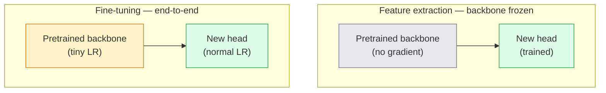

# Öğrenmeyi Aktar ve Fine-Tuning

> Başka biri bir ağa kenarların, dokuların ve nesne parçalarının neye benzediğini öğretmek için bir milyon GPU saati harcadı. Kendi özelliklerinizi eğitmeden önce bu özellikleri ödünç almalısınız.

**Tür:** Yapım
**Diller:** Python
**Önkoşullar:** Aşama 4 Ders 03 (CNN'ler), Aşama 4 Ders 04 (Görüntü Sınıflandırması)
**Süre:** ~75 dakika

## Öğrenme Hedefleri

- fine-tuning'den özellik çıkarmayı ayırt edin ve dataset boyutuna, etki alanı mesafesine ve işlem bütçesine göre doğru olanı seçin
- Önceden eğitilmiş bir omurga yükleyin, sınıflandırıcı kafasını değiştirin ve yalnızca kafayı 20 satırın altında çalışan bir temel çizgiye kadar eğitin
- Ayırt edici öğrenme oranlarıyla katmanların dondurmasını aşamalı olarak çözerek erken genel özelliklerin geç göreve özel olanlardan daha küçük güncellemeler almasını sağlayın
- Üç yaygın hatayı teşhis edin: dondurulmamış bloklarda çok yüksek LR'den kaynaklanan özellik sapması, küçük dataset'lerde BN istatistiklerinin çökmesi ve yıkıcı unutma

## Sorun

Bir ResNet-50'nin ImageNet üzerinde eğitiminin maliyeti yaklaşık 2.000 GPU saatidir. Çok az ekip, gönderdikleri her görev için bu bütçeye sahiptir. Neredeyse her takımın aslında gönderdiği şey, göreve özel birkaç yüz veya birkaç bin görüntü üzerinde eğitilmiş yeni bir kafaya sahip, önceden eğitilmiş bir omurgadır.

Bu bir kısayol değil. ImageNet tarafından eğitilmiş herhangi bir CNN'nin ilk dönüşüm bloğu, kenarları ve Gabor benzeri filtreleri öğrenir. Sonraki birkaç blok dokuları ve basit motifleri öğreniyor. Orta bloklar nesne parçalarını öğrenir. Son bloklar, 1000 ImageNet kategorisine benzemeye başlayan kombinasyonları öğrenir. Bu hiyerarşinin ilk %90'ı neredeyse hiç değişmeden tıbbi görüntülemeye, endüstriyel incelemeye, uydu verilerine ve diğer tüm görsel görevlere aktarılıyor; çünkü doğanın kenarlar ve dokularla ilgili sınırlı bir sözlüğü var. Geriye kalan %10 aslında eğittiğiniz kısımdır.

Aktarımı doğru bir şekilde gerçekleştirmek sizi bekleyen üç hatayla karşı karşıyadır: önceden eğitilmiş özellikleri çok yüksek öğrenme oranıyla yok etmek, çok fazla donarak bilgi modelini aç bırakmak ve BatchNorm'un çalışma istatistiklerinin ağın geri kalanının asla öğrenmediği küçük bir dataset'ye sürüklenmesine izin vermek. Bu ders her birini bilerek yürütür.

## Konsept

### Özellik çıkarma vs fine-tuning

Önceden eğitilmiş özelliklere ne kadar güvendiğinize ve ne kadar veriye sahip olduğunuza göre seçilen iki rejim.



Temel kurallar:

| Dataset boyutu | Etki alanı mesafesi | yemek tarifi |
|--------------|-----------------|--------|
| < 1k resim | ImageNet'e yakın | Omurgayı dondur, yalnızca kafayı eğit |
| 1k-10k | kapat | İlk 2-3 aşamayı dondurun, geri kalanına ince ayar yapın |
| 10k-100k | herhangi biri | Ayırt edici LR ile uçtan uca ince ayar yapın |
| 100k+ | uzak | Her şeye ince ayar yapın; Alan adı yeterince uzaksa sıfırdan eğitim almayı düşünün |

"ImageNet'e Yakın" kabaca nesne benzeri içeriğe sahip doğal RGB fotoğrafları anlamına gelir. Tıbbi CT taramaları, havai uydu görüntüleri ve mikroskopi çok uzak alanlardır; özellikler hâlâ yardımcı olur, ancak daha fazla katmanın uyum sağlamasına izin vermeniz gerekecektir.

### Dondurma neden işe yarıyor?

CNN'in öğrendiği ImageNet özellikleri 1000 kategoriye özel değildir. Doğal görüntülerin istatistikleri konusunda uzmanlaşmışlardır: belirli yönelimlerdeki kenarlar, dokular, kontrast desenler, şekil temelleri. Bu istatistikler, bir insanın adlandırabileceği hemen hemen her görsel alanda kararlıdır. ImageNet'te eğitilen ve CIFAR-10'da sıfır atımı değerlendiren, yalnızca yeni bir doğrusal kafaya sahip (omurganın fine-tuning'si yok) bir modelin %80+ doğruluğa ulaşmasının nedeni budur. Kafa, bu görev için önceden öğrenilmiş özelliklerden hangisine ağırlık verilmesi gerektiğini öğreniyor.

### Ayırıcı öğrenme oranları

Donmayı çözdüğünüzde, erken katmanların geç katmanlara göre daha yavaş eğitilmesi gerekir. İlk katmanlar, korumak istediğiniz genel özellikleri kodlar; Geç katmanlar, çok fazla taşımanız gereken göreve özgü yapıyı kodlar.

```
Typical recipe:

  stage 0 (stem + first group): lr = base_lr / 100    (mostly fixed)
  stage 1:                       lr = base_lr / 10
  stage 2:                       lr = base_lr / 3
  stage 3 (last backbone group): lr = base_lr
  head:                          lr = base_lr  (or slightly higher)
```

PyTorch'ta bu yalnızca optimize ediciye iletilen parametre gruplarının bir listesidir. Bir model, beş öğrenme oranı, sıfır ekstra kod.

### BatchNorm sorunu

BN katmanları, ImageNet'te hesaplanan `running_mean` ve `running_var` arabelleklerini içerir. Göreviniz farklı bir piksel dağılımına (farklı aydınlatma, farklı sensör, farklı renk alanı) sahipse bu tamponlar yanlıştır. Tercih sırasına göre üç seçenek:

1. **Tren modunda BN ile ince ayar yapın.** BN'nin diğer her şeyle birlikte koşu istatistiklerini güncellemesine izin verin. dataset görevi orta büyüklükte olduğunda varsayılan seçim (>= 5 bin örnek).
2. **Değerlendirme modunda BN'yi dondurun.** ImageNet istatistiklerini saklayın ve yalnızca ağırlıkları eğitin. dataset'niz BN'nin hareketli ortalamasının gürültülü olmasına neden olacak kadar küçük olduğunda düzeltin.
3. **BN'yi GroupNorm ile değiştirin.** Hareketli ortalama sorununu tamamen ortadan kaldırır. GPU başına parti boyutunun küçük olduğu tespit ve segmentasyon omurgalarında kullanılır.

Bunu yanlış yapmak sessizce doğruluğu %5-15 oranında azaltır.

### Kafa tasarımı

Sınıflandırıcı kafası 1-3 doğrusal katman artı isteğe bağlı bir çıkıştan oluşur. Her torchvision omurgası, değiştireceğiniz varsayılan bir kafa gönderir:

```
backbone.fc = nn.Linear(backbone.fc.in_features, num_classes)          # ResNet
backbone.classifier[1] = nn.Linear(..., num_classes)                    # EfficientNet, MobileNet
backbone.heads.head = nn.Linear(..., num_classes)                       # torchvision ViT
```

Küçük dataset'ler için genellikle tek bir doğrusal katman yeterlidir. Gizli bir katman eklemek (Doğrusal -> ReLU -> Bırakma -> Doğrusal), görev dağıtımı omurganın eğitim dağıtımından uzak olduğunda yardımcı olur.

### Katman bazında LR bozulması

Modern fine-tuning'de (BEiT, DINOv2, ViT-B ince ayarları) kullanılan ayırt edici LR'nin daha yumuşak bir versiyonu. Katmanları aşamalar halinde gruplamak yerine, her katmana bir üsttekinden biraz daha küçük bir LR verin:

```
lr_layer_k = base_lr * decay^(L - k)
```

Çürüme = 0,75 ve L = 12 transformer bloklarıyla, ilk blok `0.75^11 ≈ 0.04x`'de başın LR'sini eğitir. Aşama gruplu LR'lerin genellikle yeterli olduğu CNN'lerden ziyade transformer ince ayarları için daha önemlidir.

### Ne değerlendirilmeli?

Transfer-öğrenme koşuları, sıfırdan bir koşuda izleyemeyeceğiniz iki sayıya ihtiyaç duyar:

- **Yalnızca önceden eğitilmiş doğruluk** — omurga donmuş durumdayken kafanın doğruluğu. Burası sizin katınız.
- **İnce ayarlanmış doğruluk** — uçtan uca eğitimden sonraki aynı model. Bu senin tavanın.

İnce ayar, yalnızca önceden eğitilmiş olandan daha azsa, bir öğrenme oranınız veya BN hatanız var demektir. Her zaman ikisini de yazdırın.

## İnşa Et

### Adım 1: Önceden eğitilmiş bir omurga yükleyin ve inceleyin

```python
import torch
import torch.nn as nn
from torchvision.models import resnet18, ResNet18_Weights

backbone = resnet18(weights=ResNet18_Weights.IMAGENET1K_V1)
print(backbone)
print()
print("classifier head:", backbone.fc)
print("feature dim:", backbone.fc.in_features)
```

`ResNet18`'nin dört aşaması (`layer1..layer4`) artı bir gövde ve bir `fc` kafası vardır. Her torchvision sınıflandırma omurgası benzer bir yapıya sahiptir.

### Adım 2: Özellik çıkarma — her şeyi dondurun, başlığı değiştirin

```python
def make_feature_extractor(num_classes=10):
    model = resnet18(weights=ResNet18_Weights.IMAGENET1K_V1)
    for p in model.parameters():
        p.requires_grad = False
    model.fc = nn.Linear(model.fc.in_features, num_classes)
    return model

model = make_feature_extractor(num_classes=10)
trainable = sum(p.numel() for p in model.parameters() if p.requires_grad)
frozen = sum(p.numel() for p in model.parameters() if not p.requires_grad)
print(f"trainable: {trainable:>10,}")
print(f"frozen:    {frozen:>10,}")
```

Yalnızca `model.fc` eğitilebilir. Omurga dondurulmuş bir özellik çıkarıcıdır.

### Adım 3: Ayırt edici fine-tuning

Aşamaya özel öğrenme oranlarına sahip parametre grupları oluşturan bir yardımcı program.

```python
def discriminative_param_groups(model, base_lr=1e-3, decay=0.3):
    stages = [
        ["conv1", "bn1"],
        ["layer1"],
        ["layer2"],
        ["layer3"],
        ["layer4"],
        ["fc"],
    ]
    groups = []
    for i, names in enumerate(stages):
        lr = base_lr * (decay ** (len(stages) - 1 - i))
        params = [p for n, p in model.named_parameters()
                  if any(n.startswith(k) for k in names)]
        if params:
            groups.append({"params": params, "lr": lr, "name": "_".join(names)})
    return groups

model = resnet18(weights=ResNet18_Weights.IMAGENET1K_V1)
model.fc = nn.Linear(model.fc.in_features, 10)
for p in model.parameters():
    p.requires_grad = True

groups = discriminative_param_groups(model)
for g in groups:
    print(f"{g['name']:>10s}  lr={g['lr']:.2e}  params={sum(p.numel() for p in g['params']):>8,}")
```

`decay=0.3`, her aşamanın bir sonraki aşamanın %30 oranında eğitim alması anlamına gelir. `fc`, `base_lr`'yi alır, `layer4`, `0.3 * base_lr`'yi alır, `conv1`, `0.3^5 * base_lr ≈ 0.00243 * base_lr`'yi alır. Aşırı sondaj; ampirik olarak işe yarıyor.

### Adım 4: BatchNorm'un işlenmesi

Ağırlıklarını dondurmadan BN koşu istatistiklerini dondurmaya yardımcı olur.

```python
def freeze_bn_stats(model):
    for m in model.modules():
        if isinstance(m, (nn.BatchNorm1d, nn.BatchNorm2d, nn.BatchNorm3d)):
            m.eval()
            for p in m.parameters():
                p.requires_grad = False
    return model
```

`model.train()`'yi her çağın başında ayarladıktan sonra onu çağırın. `model.train()` her şeyi eğitim moduna çevirir; bu yalnızca BN katmanları için durumu tersine çevirir.

### Adım 5: Minimum uçtan uca fine-tuning döngüsü

```python
from torch.optim import SGD
from torch.utils.data import DataLoader
from torch.optim.lr_scheduler import CosineAnnealingLR
import torch.nn.functional as F

def fine_tune(model, train_loader, val_loader, device, epochs=5, base_lr=1e-3, freeze_bn=False):
    model = model.to(device)
    groups = discriminative_param_groups(model, base_lr=base_lr)
    optimizer = SGD(groups, momentum=0.9, weight_decay=1e-4, nesterov=True)
    scheduler = CosineAnnealingLR(optimizer, T_max=epochs)

    for epoch in range(epochs):
        model.train()
        if freeze_bn:
            freeze_bn_stats(model)
        tr_loss, tr_correct, tr_total = 0.0, 0, 0
        for x, y in train_loader:
            x, y = x.to(device), y.to(device)
            logits = model(x)
            loss = F.cross_entropy(logits, y, label_smoothing=0.1)
            optimizer.zero_grad()
            loss.backward()
            optimizer.step()
            tr_loss += loss.item() * x.size(0)
            tr_total += x.size(0)
            tr_correct += (logits.argmax(-1) == y).sum().item()
        scheduler.step()

        model.eval()
        va_total, va_correct = 0, 0
        with torch.no_grad():
            for x, y in val_loader:
                x, y = x.to(device), y.to(device)
                pred = model(x).argmax(-1)
                va_total += x.size(0)
                va_correct += (pred == y).sum().item()
        print(f"epoch {epoch}  train {tr_loss/tr_total:.3f}/{tr_correct/tr_total:.3f}  "
              f"val {va_correct/va_total:.3f}")
    return model
```

CIFAR-10'da yukarıdaki tarife sahip beş dönem, `ResNet18-IMAGENET1K_V1`'yi ~%70 sıfır atışlı doğrusal prob doğruluğundan ~%93 ince ayarlı doğruluğa götürür. Tek başına kafa, omurgaya hiç dokunmadan %86 civarında plato yapar.

### Adım 6: Aşamalı dondurma

Sondan başlangıca doğru çağ başına bir aşamayı çözen bir program. Azaltmalar, bazı ekstra dönemler pahasına sürüklenmeyi içerir.

```python
def progressive_unfreeze_schedule(model):
    stages = ["layer4", "layer3", "layer2", "layer1"]
    yielded = set()

    def start():
        for p in model.parameters():
            p.requires_grad = False
        for p in model.fc.parameters():
            p.requires_grad = True

    def unfreeze(epoch):
        if epoch < len(stages):
            name = stages[epoch]
            yielded.add(name)
            for n, p in model.named_parameters():
                if n.startswith(name):
                    p.requires_grad = True
            return name
        return None

    return start, unfreeze
```

İlk çağdan önce `start()`'yi bir kez arayın. Her çağın başında `unfreeze(epoch)`'yi arayın. Eğitilebilir parametreler kümesi değiştiğinde optimize ediciyi yeniden oluşturun, aksi takdirde donmuş parametreler, kafasını karıştıran önbelleğe alınmış anları tutmaya devam eder.

## Kullan onu

Çoğu gerçek görev için `torchvision.models` + üç satır yeterlidir. Yukarıdaki daha ağır makineler, kitaplık varsayılanlarının çözemediği sorunlarla karşılaştığınızda önemlidir.

```python
from torchvision.models import resnet50, ResNet50_Weights

model = resnet50(weights=ResNet50_Weights.IMAGENET1K_V2)
model.fc = nn.Linear(model.fc.in_features, num_classes)
optimizer = torch.optim.AdamW(model.parameters(), lr=1e-4, weight_decay=1e-4)
```

Üretim düzeyindeki diğer iki varsayılan:

- `timm`, tutarlı bir API (`timm.create_model("resnet50", pretrained=True, num_classes=10)`) ile yaklaşık 800 önceden eğitilmiş görüntü omurgası gönderir. Torchvision hayvanat bahçesinin ötesindeki herhangi bir ince ayar için bu standarttır.
- transformer'ler için `transformers.AutoModelForImageClassification.from_pretrained(name, num_labels=N)`, metin modelleriyle aynı yükleme semantiğine sahip ViT / BEiT / DeiT'i sunar.

## Gönderin

Bu ders şunları üretir:

- `outputs/prompt-fine-tune-planner.md` — dataset boyutuna, etki alanı mesafesine ve işlem bütçesine göre özellik çıkarma, aşamalı ve uçtan uca fine-tuning'yi seçen bir prompt.
- `outputs/skill-freeze-inspector.md` — bir PyTorch modeli verildiğinde hangi parametrelerin eğitilebileceğini, hangi BatchNorm katmanlarının değerlendirme modunda olduğunu ve optimize edicinin gerçekten eğitilebilir parametrelerle beslenip beslenmediğini bildiren bir beceri.

## Egzersizler

1. **(Kolay)** `ResNet18`'yi doğrusal bir prob (omurga dondurulmuş) olarak ve aynı sentetik-CIFAR dataset üzerinde tam ince ayar olarak eğitin. Her iki doğruluğu yan yana rapor edin. Hangi boşluğun size özelliklerin iyi aktarıldığını, hangisinin ise aktarılmadığını söylediğini açıklayın.
2. **(Medium)** Bilerek bir hata ekleyin: `base_lr = 1e-1`'yi kafa yerine omurga aşamasına ayarlayın. Eğitim kaybının patlamasını gösterin, ardından `discriminative_param_groups` yardımcısını uygulayarak kurtarın. Her aşamanın ayrılmaya başladığı LR'yi kaydedin.
3. **(Sert)** dataset (e.g. CheXpert-small, PatchCamelyon veya HAM10000) tıbbi görüntüleme alın ve üç rejimi karşılaştırın: (a) ImageNet ile önceden eğitilmiş donmuş omurga + doğrusal kafa; (b) ImageNet ile önceden eğitilmiş uçtan uca ince ayar; (c) çizilme eğitimi. Her biri için doğruluğu ve hesaplama maliyetini bildirin. Hangi dataset boyutunda çizik eğitimi rekabetçi hale gelir?

## Anahtar Terimler

| Dönem | İnsanlar ne diyor | Aslında ne anlama geliyor |
|------|----------------|----------------------|
| Özellik çıkarma | "Kafayı dondur ve eğit" | Omurga parametreleri donduruldu, yalnızca yeni sınıflandırıcı kafası gradient |
| Fine-tuning | "Uçtan uca yeniden eğitin" | Tüm parametreler, genellikle sıfırdan eğitimden çok daha küçük LR ile eğitilebilir |
| Ayırt edici LR | "Erken katmanlar için daha küçük LR" | Erken aşama LR'nin geç aşama LR'nin bir kısmı olduğu optimizasyon parametre grupları |
| Katman bazında LR bozulması | "Düzgün LR gradient" | Katman başına LR bozunma^(L - k) ile çarpılır; transformer ince ayarlarında ortak |
| Felaketsel unutma | "Model ImageNet'i kaybetti" | Çok yüksek bir LR, yeni görev sinyali öğrenilmeden önce önceden eğitilmiş özelliklerin üzerine yazar |
| BN istatistiklerindeki sapma | "Çalışan ortalama yanlış" | BatchNorm Running_mean/var mevcut görevden farklı bir dağıtımda hesaplanıyor ve doğruluk sessizce zarar görüyor |
| Doğrusal prob | "Dondurulmuş omurga + doğrusal kafa" | Önceden eğitilmiş özelliklerin değerlendirilmesi — dondurulmuş gösterimin yanı sıra en iyi doğrusal sınıflandırıcının doğruluğu |
| Yıkıcı çöküş | "Her şey bir sınıfı öngörüyor" | Bu, gradient'lerin kafadan stabil hale gelmesinden önce özellikleri yok edecek kadar yüksek bir LR'ye sahip fine-tuning olduğunda gerçekleşir |

## Daha Fazla Okuma

- [Derin neural network'lerdeki özellikler ne kadar aktarılabilir? (Yosinski ve diğerleri, 2014)](https://arxiv.org/abs/1411.1792) — katmanlar arasında özellik aktarılabilirliğini ölçen makale
- [Evrensel Dil Modeli Fine-tuning (ULMFiT, Howard & Ruder, 2018)](https://arxiv.org/abs/1801.06146) — orijinal ayırt edici LR / aşamalı donma çözme tarifi; fikirler doğrudan vizyona aktarılır
- [timm belgeleri](https://huggingface.co/docs/timm) — modern görüş omurgaları ve eğitildikleri tam ince ayar varsayılanları için referans
- [Doğrusal Prob Değerlendirmesi için Basit Bir Framework (Kornblith ve diğerleri, 2019)](https://arxiv.org/abs/1805.08974) — doğrusal prob doğruluğunun neden önemli olduğu ve bunun nasıl doğru şekilde raporlanacağı
